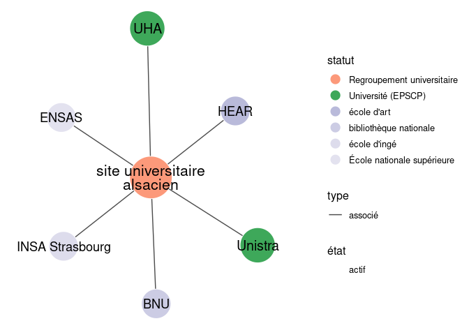
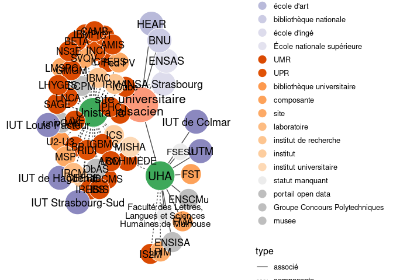
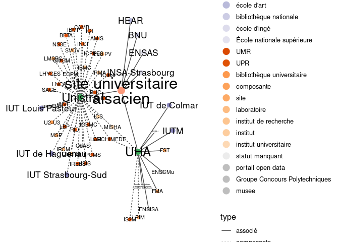
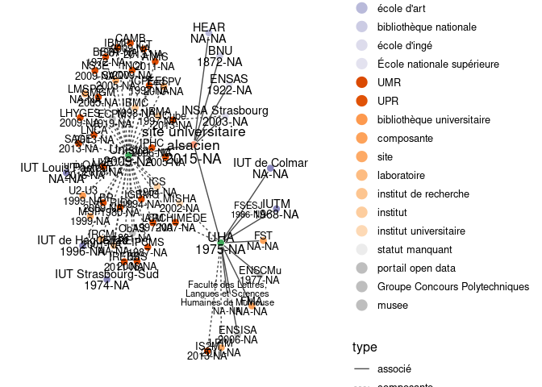

Tenter d’y voir clair dans l’ESR : tutorial R/WikidataESR
================
Julien Gossa
02/10/2022

Des visualisations de contrôles pour de nombres établissement de l’ESR
sont disponibles ici : [check](check.md)

# Guide de style pour les données wikidata

Les réformes successives touchant l’organisation de l’enseignement
supérieur et de la recherche (ESR) depuis une quinzaine d’années ont
profondément modifié le paysage universitaire français. Aujourd’hui, les
transformations institutionelles sont si nombreuses et si rapides, qu’il
est devenu impossible de connaitre la structure actuelle des
établissements de l’ESR.

Il existe trois sources principales d’informations sur les
établissements de l’ESR français :

-   [data.gouv.fr](https://www.data.gouv.fr/fr/) : le portail des
    données publiques du gouvernement français ;
-   [\#DataESR](https://data.esr.gouv.fr/FR/) : le portail des données
    publiques du ministère de l’enseignement supérieur, de la recherche
    et de l’innovation ;
-   [WikiData](https://www.wikidata.org/wiki/Wikidata:Main_Page) : une
    base de connaissances libre et gratuite, dans la famille WikiMédia,
    qui compte notamment WikiPédia.

Les deux premières sources ne sont pas communautaires, et proposent
essentiellement des jeux de données brutes. En revanche, WikiData permet
l’édition collaborative, plus adaptée au rythme actuel des
transformations. Il permet également de structurer les données grace à
un très large choix de relations. La contrepartie de ces deux avantages
est la difficulté à uniformiser les données, passage indispensable à
leur exploitation.

C’est pourquoi ce document est un guide visant l’harmonisation des
informations sur l’organisation de l’enseignement supérieur français
disponibles publiquement sur la base de donnée collaborative WikiData.

## Proposition de modélisation

Le principe de la modélisation des informations dans WikiData est
relativement simple :

-   chaque établissement de l’ESR, passé, présent ou futur, doit faire
    l’objet d’un **élément** (*item*) unique ;
-   chaque élément dispose de plusieurs **propriétés** (*properties*),
    dont la **valeur** (*value*) est l’information ;
-   le cas échéant, les propriétés peuvent avoir un **qualificatif**
    (*qualifier*) précisant cette information.

Pour l’utilisation particulière de WikiData, on pourra se reporter à
cette
[introduction](https://www.wikidata.org/wiki/Wikidata:Introduction/fr).

### Entête des éléments

Les éléments présentent quatre informations indispensables :

-   un **identifiant** unique, attribué automatiquement, qu’on retrouve
    dans l’URL de la page ;
-   un **libellé** (*label*) unique, ou nom principal ;
-   une **description** (*description*) ;
-   autant d’**alias** que nécessaire, ou noms alternatifs.

Par exemple, pour l’[UCA](https://www.wikidata.org/wiki/Q19370961) :

-   Q19370961
    [www.wikidata.org/wiki/Q19370961](https://www.wikidata.org/wiki/Q19370961)
-   Université Côte d’Azur
-   communauté d’universités et établissements (ComUE) créée en 2015 à
    Nice, dans la région Provence-Alpes-Côte d’Azur
-   Comue Université Côte d’Azur ; Comue UCA

### Propriétés

Les propriétés permettent de modéliser les relations entre les
établissements de l’ESR. La proposition suivante permet d’harmoniser les
informations :

| id                                                    | libellé.wikidata     | libellé.ESR   | note                                                                                                                                                                        | qualificatif                                                                                                            |
|:------------------------------------------------------|:---------------------|:--------------|:----------------------------------------------------------------------------------------------------------------------------------------------------------------------------|:------------------------------------------------------------------------------------------------------------------------|
| [P31](https://www.wikidata.org/wiki/Property:P31)     | nature de l’élément  | nature        | voir la liste en annexe                                                                                                                                                     |                                                                                                                         |
| [P3202](https://www.wikidata.org/wiki/Property:P3202) | code UAI             |               | permet de faire le lien avec les autres bases de données                                                                                                                    |                                                                                                                         |
| [P571](https://www.wikidata.org/wiki/Property:P571)   | date de fondation    | fondation     |                                                                                                                                                                             |                                                                                                                         |
| [P576](https://www.wikidata.org/wiki/Property:P576)   | date de dissolution  | dissolution   |                                                                                                                                                                             |                                                                                                                         |
| [P527](https://www.wikidata.org/wiki/Property:P527)   | comprend             | associé       | lien de subordination horizontal : avec une moindre hiérachie, avec une indépendance politique et financière                                                                | [date de début](https://www.wikidata.org/wiki/Property:P580) [date de fin](https://www.wikidata.org/wiki/Property:P582) |
| [P361](https://www.wikidata.org/wiki/Property:P361)   | partie de            | associé de    | inverse de associé                                                                                                                                                          | [date de début](https://www.wikidata.org/wiki/Property:P580) [date de fin](https://www.wikidata.org/wiki/Property:P582) |
| [P355](https://www.wikidata.org/wiki/Property:P355)   | organisation filiale | composante    | lien de subordination vertical: avec hiérarchie et dépendance politique ou financière accrue                                                                                | [date de début](https://www.wikidata.org/wiki/Property:P580) [date de fin](https://www.wikidata.org/wiki/Property:P582) |
| [P749](https://www.wikidata.org/wiki/Property:P749)   | organisation mère    | composante de | inverse de composante                                                                                                                                                       | [date de début](https://www.wikidata.org/wiki/Property:P580) [date de fin](https://www.wikidata.org/wiki/Property:P582) |
| [P1365](https://www.wikidata.org/wiki/Property:P1365) | remplace             | prédécesseur  | marque un changement de statut                                                                                                                                              | [date](https://www.wikidata.org/wiki/Property:P585)                                                                     |
| [P1366](https://www.wikidata.org/wiki/Property:P1366) | remplacé par         | successeur    | inverse de prédécesseur                                                                                                                                                     | [date](https://www.wikidata.org/wiki/Property:P585)                                                                     |
| [P807](https://www.wikidata.org/wiki/Property:P807)   | séparé de            |               | marque une séparation, lorsqu’un établissement nouveau est créé à partir d’une partie d’un autre, qui continue d’exister (doit être renseigné dans les deux établissements) | [date](https://www.wikidata.org/wiki/Property:P585)                                                                     |
| [P7888](https://www.wikidata.org/wiki/Property:P7888) | fusionné dans        | absorbé par   | marque une absorbtion, lorsqu’un établissement est dissout et fusionné dans un autre qui existait auparavant (doit être renseigné dans les deux établissements)             | [date](https://www.wikidata.org/wiki/Property:P585)                                                                     |
| [P1416](https://www.wikidata.org/wiki/Property:P1416) | affilié à            |               | pour le lien avec les organismes nationnaux (tutelles, EPIC, ONR, rectorat, etc.)                                                                                           | [date de début](https://www.wikidata.org/wiki/Property:P580) [date de fin](https://www.wikidata.org/wiki/Property:P582) |
| [P463](https://www.wikidata.org/wiki/Property:P463)   | membre de            |               | pour les adhésions aux diverses associations, également pour l’IDEX (de façon un peu abusive)                                                                               | [date de début](https://www.wikidata.org/wiki/Property:P580) [date de fin](https://www.wikidata.org/wiki/Property:P582) |
| [P1830](https://www.wikidata.org/wiki/Property:P1830) | propriétaire de      |               | pour les équipements de recherche par exemple                                                                                                                               | [date de début](https://www.wikidata.org/wiki/Property:P580) [date de fin](https://www.wikidata.org/wiki/Property:P582) |
| [P1344](https://www.wikidata.org/wiki/Property:P1344) | participant à        |               | pour les projets par exemple                                                                                                                                                | [date de début](https://www.wikidata.org/wiki/Property:P580) [date de fin](https://www.wikidata.org/wiki/Property:P582) |

### Erreurs fréquentes

Afin d’harmoniser au mieux les informations, il est utile d’éviter
plusieurs erreurs fréquentes.

-   Utiliser un seul élément pour représenter plusieurs établissements.

Il est recommandé d’utiliser autant d’éléments que de nécessaires, sans
tenter de réutiliser ceux qui existent. Cela vaut aussi bien pour les
établissements composites (regroupements) que pour les établissements
qui changent de statuts au cours du temps.

En particulier, les universités qui retrouvent leur nom historique après
une re-fusion ne doivent surtout pas réutiliser l’élément historique. De
même pour les universités qui gardent le même nom mais changent de
statut. Globalement, chaque changement d’UAI doit être marqué par un
changement d’élément wikidata.

-   Utiliser un statut inappropriée.

Il existe de très nombreux statuts d’établissement de l’ESR, ou qui s’en
approchent. Il est recommandé d’éviter d’utiliser des statuts génériques
(“centre de recherche”), et de stipuler le statut la plus précise
possible de l’établissement (“UMR”). Dans l’idéal, le statut se confond
avec la forme juridique. Stipuler plusieurs statuts doit être réservé au
cas où l’établissement a effectivement une nature composite.

Une liste de statuts recommandés et déconseillés est donnée en
[annexe](#listes-statuts).

-   Utiliser une propriété innapropriée.

Les organisations des regroupements de l’ESR étant particulièrement
complexes, il est indispensable d’utiliser les propriétés les mieux
adaptées, notamment pour différencier les membres pleinement intégrés
(appelés ici “composante”) des membres seulement associés.

De plus, même si les tutelles (EPST, EPCA, EPIC…) sont membres des
regroupements, il est recommandé de les déclarer sous forme
d’affiliation pour les différencier des établissements composantes ou
associés.

Enfin, les adhésions aux diverses associations (CPU, CURIF, LERU,
COUPERIN…) doivent être déclarées avec “membre de”, toujours pour les
différencier des autres types de relations.

## Status et niveaux

### Niveaux

Les statuts d’établissement sont hiérarchisés en différents niveaux :

| niveau | libellé       | description                                                                                                 | exemple                                 |
|-------:|:--------------|:------------------------------------------------------------------------------------------------------------|:----------------------------------------|
|      1 | national      | institutions nationales                                                                                     | CNRS                                    |
|      2 | regroupement  | groupe d’établissement ou intitutions régionales                                                            | COMUEs                                  |
|      3 | établissement | établissements de grande taille ou institutions locales                                                     | universités                             |
|      4 | intermédiaire | établissements de moindre taille, premier sous-niveau des grands établissements, ou réseau d’établissements | école indépendante, collégium, COUPERIN |
|      5 | composante    | sous-partie d’un établissement                                                                              | UFR ou UMR                              |
|      6 | autre         | ni établissement, ni institution, généralement de petite taille                                             | équipements ou projets                  |

Cette hiérarchisation est faite hors wikidata, directement dans la
librairie [R/wikidataESR](wikidataESR).

### Liste des statuts recommandés

| wikidata.id                                            | libellé                     | niveau | note | wikipedia                                                                                                                    |
|:-------------------------------------------------------|:----------------------------|-------:|:-----|:-----------------------------------------------------------------------------------------------------------------------------|
| [Q13582798](https://www.wikidata.org/wiki/Q13582798)   | EPST                        |      1 | NA   | [ref](https://fr.wikipedia.org/wiki/%C3%89tablissement_public_%C3%A0_caract%C3%A8re_scientifique_et_technologique)           |
| [Q3244038](https://www.wikidata.org/wiki/Q3244038)     | EPCA                        |      1 | NA   | [ref](https://fr.wikipedia.org/wiki/%C3%89tablissement_public_%C3%A0_caract%C3%A8re_administratif_en_France)                 |
| [Q3591583](https://www.wikidata.org/wiki/Q3591583)     | EPIC                        |      1 | NA   | [ref](https://fr.wikipedia.org/wiki/%C3%89tablissement_public_%C3%A0_caract%C3%A8re_industriel_et_commercial_en_France)      |
| [Q61612084](https://www.wikidata.org/wiki/Q61612084)   | PRES                        |      2 | NA   | [ref](https://fr.wikipedia.org/wiki/Regroupement_universitaire)                                                              |
| [Q15974764](https://www.wikidata.org/wiki/Q15974764)   | COMUE                       |      2 | NA   | [ref](https://fr.wikipedia.org/wiki/Communaut%C3%A9_d%27universit%C3%A9s_et_%C3%A9tablissements)                             |
| [Q77979904](https://www.wikidata.org/wiki/Q77979904)   | EPE                         |      2 | NA   | [ref](https://fr.wikipedia.org/wiki/Regroupement_universitaire)                                                              |
| [Q3412198](https://www.wikidata.org/wiki/Q3412198)     | Regroupement universitaire  |      2 | NA   | [ref](https://fr.wikipedia.org/wiki/Regroupement_universitaire)                                                              |
| [Q2822246](https://www.wikidata.org/wiki/Q2822246)     | Académie                    |      2 | NA   | [ref](https://fr.wikipedia.org/wiki/Acad%C3%A9mie_(%C3%A9ducation_en_France))                                                |
| [Q3551775](https://www.wikidata.org/wiki/Q3551775)     | Université (EPSCP)          |      3 | NA   | [ref](https://fr.wikipedia.org/wiki/%C3%89tablissement_public_%C3%A0_caract%C3%A8re_scientifique,_culturel_et_professionnel) |
| [Q1542938](https://www.wikidata.org/wiki/Q1542938)     | Grand Établissement         |      3 | NA   | [ref](https://fr.wikipedia.org/wiki/Grand_%C3%A9tablissement)                                                                |
| [Q3591586](https://www.wikidata.org/wiki/Q3591586)     | EPSCP                       |      3 | NA   | [ref](https://fr.wikipedia.org/wiki/%C3%89tablissement_public_%C3%A0_caract%C3%A8re_scientifique,_culturel_et_professionnel) |
| [Q135436](https://www.wikidata.org/wiki/Q135436)       | École normale supérieure    |      3 | NA   | [ref](https://fr.wikipedia.org/wiki/%C3%89cole_normale_sup%C3%A9rieure_(France))                                             |
| [Q3457065](https://www.wikidata.org/wiki/Q3457065)     | réseau universitaire        |      4 | NA   | [ref](NA)                                                                                                                    |
| [Q6542557](https://www.wikidata.org/wiki/Q6542557)     | consortium de bibliothèques |      4 | NA   | [ref](NA)                                                                                                                    |
| [Q1059324](https://www.wikidata.org/wiki/Q1059324)     | CHU                         |      4 | NA   | [ref](https://fr.wikipedia.org/wiki/Centre_hospitalier_universitaire)                                                        |
| [Q3152659](https://www.wikidata.org/wiki/Q3152659)     | IUT                         |      4 | NA   | [ref](https://fr.wikipedia.org/wiki/Institut_universitaire_de_technologie)                                                   |
| [Q1475041](https://www.wikidata.org/wiki/Q1475041)     | IEP                         |      4 | NA   | [ref](https://fr.wikipedia.org/wiki/Institut_d%27%C3%A9tudes_politiques)                                                     |
| [Q3578562](https://www.wikidata.org/wiki/Q3578562)     | ESPÉ                        |      4 | NA   | [ref](https://fr.wikipedia.org/wiki/%C3%89cole_sup%C3%A9rieure_du_professorat_et_de_l%27%C3%A9ducation)                      |
| [Q184644](https://www.wikidata.org/wiki/Q184644)       | école supérieure de musique |      4 | NA   | [ref](https://fr.wikipedia.org/wiki/%C3%89cole_sup%C3%A9rieure_de_musique)                                                   |
| [Q1143635](https://www.wikidata.org/wiki/Q1143635)     | école de commerce           |      4 | NA   | [ref](https://fr.wikipedia.org/wiki/%C3%89cole_de_commerce)                                                                  |
| [Q383092](https://www.wikidata.org/wiki/Q383092)       | école d’art                 |      4 | NA   | [ref](https://fr.wikipedia.org/wiki/%C3%89cole_d%27art)                                                                      |
| [Q479716](https://www.wikidata.org/wiki/Q479716)       | presse universitaire        |      4 | NA   | [ref](NA)                                                                                                                    |
| [Q22806](https://www.wikidata.org/wiki/Q22806)         | bibliothèque nationale      |      4 | NA   | [ref](NA)                                                                                                                    |
| [Q3550864](https://www.wikidata.org/wiki/Q3550864)     | UMR                         |      5 | NA   | [ref](https://fr.wikipedia.org/wiki/Unit%C3%A9_mixte_de_recherche)                                                           |
| [Q43371084](https://www.wikidata.org/wiki/Q43371084)   | UPR                         |      5 | NA   | [ref](https://fr.wikipedia.org/wiki/Centre_national_de_la_recherche_scientifique)                                            |
| [Q3550863](https://www.wikidata.org/wiki/Q3550863)     | UMS                         |      5 | NA   | [ref](https://fr.wikipedia.org/wiki/Unit%C3%A9_mixte_de_service)                                                             |
| [Q43371093](https://www.wikidata.org/wiki/Q43371093)   | FRE                         |      5 | NA   | [ref](https://fr.wikipedia.org/wiki/Centre_national_de_la_recherche_scientifique)                                            |
| [Q109584561](https://www.wikidata.org/wiki/Q109584561) | USC                         |      5 | NA   | [ref](https://fr.wikipedia.org/wiki/Laboratoire_de_recherche)                                                                |
| [Q3279950](https://www.wikidata.org/wiki/Q3279950)     | MSH                         |      5 | NA   | [ref](https://fr.wikipedia.org/wiki/Maison_des_Sciences_de_l%27Homme)                                                        |
| [Q3550804](https://www.wikidata.org/wiki/Q3550804)     | UFR                         |      5 | NA   | [ref](https://fr.wikipedia.org/wiki/Unit%C3%A9_de_formation_et_de_recherche)                                                 |
| [Q13220391](https://www.wikidata.org/wiki/Q13220391)   | école doctorale             |      5 | NA   | [ref](NA)                                                                                                                    |
| [Q57314035](https://www.wikidata.org/wiki/Q57314035)   | faculté de médecine         |      5 | NA   | [ref](NA)                                                                                                                    |
| [Q856234](https://www.wikidata.org/wiki/Q856234)       | bibliothèque universitaire  |      5 | NA   | [ref](NA)                                                                                                                    |
| [Q180958](https://www.wikidata.org/wiki/Q180958)       | composante                  |      5 | NA   | [ref](https://fr.wikipedia.org/wiki/Universit%C3%A9_en_France#Composantes)                                                   |
| [Q1254933](https://www.wikidata.org/wiki/Q1254933)     | observatoire astronomique   |      6 | NA   | [ref](NA)                                                                                                                    |
| [Q1298668](https://www.wikidata.org/wiki/Q1298668)     | projet de recherche         |      6 | NA   | [ref](NA)                                                                                                                    |
| [Q28863779](https://www.wikidata.org/wiki/Q28863779)   | équipe de recherche         |      6 | NA   | [ref](NA)                                                                                                                    |
| [Q1241025](https://www.wikidata.org/wiki/Q1241025)     | équipe de recherche         |      6 | NA   | [ref](NA,)                                                                                                                   |

### Liste des statuts déconseillés

La plupart des statuts dans cette liste sont déconseillés parce que des
statuts plus précises existent.

| wikidata.id                                          | libellé                           | niveau | note                                                                           | wikipedia                                                       |
|:-----------------------------------------------------|:----------------------------------|-------:|:-------------------------------------------------------------------------------|:----------------------------------------------------------------|
| [Q10861173](https://www.wikidata.org/wiki/Q10861173) | Système universitaire             |      1 | Préferer réseau universitaire (Q3457065), COMUE (Q15974764) ou EPE (Q77979904) | [ref](https://en.wikipedia.org/wiki/University_system)          |
| [Q2659904](https://www.wikidata.org/wiki/Q2659904)   | organisation gouvernementale      |      1 | Statut trop imprécis                                                           | [ref](NA)                                                       |
| [Q327333](https://www.wikidata.org/wiki/Q327333)     | agence publique                   |      1 | Statut trop imprécis                                                           | [ref](NA)                                                       |
| [Q65963615](https://www.wikidata.org/wiki/Q65963615) | EPE                               |      2 | Préférer Q77979904                                                             | [ref](https://fr.wikipedia.org/wiki/Regroupement_universitaire) |
| [Q43229](https://www.wikidata.org/wiki/Q43229)       | organisation                      |      2 | Statut trop imprécis                                                           | [ref](NA)                                                       |
| [Q15911314](https://www.wikidata.org/wiki/Q15911314) | association                       |      2 | Statut trop imprécis                                                           | [ref](NA)                                                       |
| [Q15343039](https://www.wikidata.org/wiki/Q15343039) | établissement public              |      3 | Statut trop imprécis                                                           | [ref](NA)                                                       |
| [Q270791](https://www.wikidata.org/wiki/Q270791)     | entreprise d’État                 |      3 | Statut trop imprécis                                                           | [ref](NA)                                                       |
| [Q902104](https://www.wikidata.org/wiki/Q902104)     | université privée                 |      3 | Statut trop imprécis                                                           | [ref](NA)                                                       |
| [Q1371037](https://www.wikidata.org/wiki/Q1371037)   | institut de technologie           |      3 | Statut trop imprécis                                                           | [ref](https://fr.wikipedia.org/wiki/Institut_de_technologie)    |
| [Q16917](https://www.wikidata.org/wiki/Q16917)       | hôpital                           |      3 | Préférer CHU                                                                   | [ref](NA)                                                       |
| [Q2945655](https://www.wikidata.org/wiki/Q2945655)   | CH                                |      3 | Préférer CHU                                                                   | [ref](NA)                                                       |
| [Q3918](https://www.wikidata.org/wiki/Q3918)         | université                        |      3 | Statut trop imprécis                                                           | [ref](NA)                                                       |
| [Q847027](https://www.wikidata.org/wiki/Q847027)     | Grande ecole                      |      3 | Réserver aux écoles non contemporaines                                         | [ref](https://fr.wikipedia.org/wiki/Grande_%C3%A9cole)          |
| [Q875538](https://www.wikidata.org/wiki/Q875538)     | université publique               |      3 | Statut trop imprécis                                                           | [ref](NA)                                                       |
| [Q194166](https://www.wikidata.org/wiki/Q194166)     | consortium                        |      4 | Préferer réseau universitaire (Q3457065)                                       | [ref](NA)                                                       |
| [Q1663017](https://www.wikidata.org/wiki/Q1663017)   | école d’ingé                      |      4 | Statut trop imprécis                                                           | [ref](NA)                                                       |
| [Q3578166](https://www.wikidata.org/wiki/Q3578166)   | École nationale supérieure        |      4 | Confusion avec les ENS                                                         | [ref](NA)                                                       |
| [Q2385804](https://www.wikidata.org/wiki/Q2385804)   | institution éducative             |      4 | Statut trop imprécis                                                           | [ref](NA)                                                       |
| [Q189004](https://www.wikidata.org/wiki/Q189004)     | Collége                           |      4 | Statut trop imprécis                                                           | [ref](NA)                                                       |
| [Q4287745](https://www.wikidata.org/wiki/Q4287745)   | organisation de santé             |      4 | Statut trop imprécis                                                           | [ref](NA)                                                       |
| [Q13226383](https://www.wikidata.org/wiki/Q13226383) | site                              |      5 | Statut trop imprécis                                                           | [ref](NA)                                                       |
| [Q3914](https://www.wikidata.org/wiki/Q3914)         | école                             |      5 | Statut trop imprécis                                                           | [ref](NA)                                                       |
| [Q483242](https://www.wikidata.org/wiki/Q483242)     | laboratoire                       |      5 | Statut trop imprécis                                                           | [ref](NA)                                                       |
| [Q31855](https://www.wikidata.org/wiki/Q31855)       | institut de recherche             |      5 | Statut trop imprécis                                                           | [ref](NA)                                                       |
| [Q1664720](https://www.wikidata.org/wiki/Q1664720)   | institut                          |      5 | Statut trop imprécis                                                           | [ref](NA)                                                       |
| [Q7315155](https://www.wikidata.org/wiki/Q7315155)   | centre de recherche               |      5 | Statut trop imprécis                                                           | [ref](NA)                                                       |
| [Q4671277](https://www.wikidata.org/wiki/Q4671277)   | institut universitaire            |      5 | Statut trop imprécis                                                           | [ref](NA)                                                       |
| [Q38723](https://www.wikidata.org/wiki/Q38723)       | institut d’enseignement supérieur |      5 | Statut trop imprécis                                                           | [ref](NA)                                                       |
| [Q3356144](https://www.wikidata.org/wiki/Q3356144)   | ODAC                              |      5 | Statut trop imprécis                                                           | [ref](NA)                                                       |
| [Q7075](https://www.wikidata.org/wiki/Q7075)         | bibliothèque                      |      5 | préférer BU/biliothèque universitaire (Q856234)                                | [ref](NA)                                                       |
| [Q1622062](https://www.wikidata.org/wiki/Q1622062)   | college library                   |      5 | Préférer bibliothèque universitaire (Q856234)                                  | [ref](NA)                                                       |
| [NOID](https://www.wikidata.org/wiki/NOID)           | statut manquant                   |      6 | Absence de propriété P31 (instance_of/nature de l’élément)                     | [ref](NA)                                                       |

<!-- 
`{r pressure, echo=FALSE, warning=FALSE, message=FALSE, fig.width=6, fig.height=4}
`wdesr_load_and_plot("Q61716176",c('composante','associé'), 1,
`                    node_size = c(10,30), label_sizes = c(3,5), arrow_gap = 0.0,
`                    node_label = "alias", node_type = "text",
`                    edge_label = FALSE)
`
-->

# Manuel d’édition

En complément des informations propres à wikidata, disponibles sur le
[portail
communautaire](https://www.wikidata.org/wiki/Wikidata:Community_portal/fr),
ces procédures aident aux premières éditions des données sur l’ESR.

## Bonnes pratiques

-   Supprimer et modifier ne servent qu’à corriger des erreurs, pas à
    indiquer les modifications qui ont eu lieu.
-   Les fins des choses s’indiquent avec des dates.
-   Les modifications des choses s’indiquent souvent en créant un nouvel
    élément à partir de l’ancien.

### Ajouter un établissement/organisation/structure

Dans wikidata, les établissements/organisations/structures sont
représentés par des `éléments`.

1.  Vérifier que l’élément n’existe pas déjà en cherchant son nom sur
    [wikidata](https://www.wikidata.org/w/index.php?search=&search=&title=Special%3ASearch&go=Lire).
    -   **Surtout, ne jamais créer d’élément en double**
2.  Si l’élément nexiste pas, la page de recherche renvoie [un
    lien](https://www.wikidata.org/w/index.php?title=Special:NewItem)
    permettant d’en créer un nouveau.
3.  Renseigner `Libellé` (nom complet), `Description` et `Alias`
    (sigle/nom court).
    -   Une fois créé, l’élément dispose d’un identifiant wikidata
        unique, sous la forme `Qxxxxxxx`, indiqué dans son adresse
        internet et à droite de son nom entre parenthèses.
4.  Renseigner le statut de l’établissement/organisation/structure :
    1.  Choisir `Ajouter une déclaration` ;
    2.  Dans `Propriété` choisir `Nature de l'élément` ;
    3.  Rechercher et sélectionner le statut le plus précis possible :
        -   WikidataESR propose une [liste des statuts
            recommandés](#Liste-des-statuts-recommandés) ;
        -   En cas de doute, choisissez une statut générique
            (e.g. `laboratoire` plutôt que `UMR`), même si ce statut
            n’est pas recommandé.
    4.  Choisir `Publier`.
5.  (Optionnel) En utilisation la même procédure, ajouter les
    informations additionnelles (dates de création, adresse, Identifiant
    UAI ou UMR, etc.).

### Ajouter une relation entre deux entités

Dans wikidata, les relations entre les
établissements/organisations/structures sont représentées par des
`propriétés`, qui doivent être ajoutées dans toutes les entités
concernées.

Les relations sont orientées : elles sont renseignées dans un élément
*source* et indiquent un élément *destination*.

1.  Identifier la `propriété` la plus adéquate à la relation en
    utilisant la \[liste des propriétés wikidataESR\](#Propriétés.
    -   **Attention : les propriétés ont une appellation wikidata qui
        diffère légèrement de l’appellation wikidataESR**.
2.  Depuis la page wikidata de l’élément *source*,
    `Ajouter une déclaration`.
3.  Renseigner l’élément *destination* dans la propriété.
4.  (Optionnel) Ajouter les informations annexes grâce aux `qualitatifs`
    (par exemple, `date de début` et `date de fin`).
5.  (Optionnel) Ajouter les références (par exemple décret ou site web).
6.  Choisir `Publier`.
7.  Si la relation est symétrique (par exemple, `organisation filiale`
    et `organisation mère`), recommencer en inversant *source* et
    *destination*.

## Modifications fréquentes

### Une composante (UFR/labo) de l’établissement est manquante

1.  Vérifier l’existence d’un élément wikidata pour la composante :
    -   Si aucun élément n’existe, le créer (voir [Ajouter
        élément](#Ajouter-un-établissementorganisationstructure)) ;
2.  Depuis la page wikidata de l’établissement :
    -   `Ajouter une déclaration`/`organisation filiale`, et choisir
        l’élément wikidata de la composante (voir [Ajouter
        relation](#Ajouter-une-relation-entre-deux-entités)) ;
3.  Depuis la page wikidata de la composante :
    -   `Ajouter une déclaration`/`organisation mère`, et choisir
        l’élément wikidata de la composante.

### Une association (COMUE, etc.) de l’établissement est manquante

1.  Depuis la page wikidata de l’établissement :
    -   `Ajouter une déclaration`/`comprend`, et choisir l’élément
        wikidata de l’association (voir [Ajouter
        relation](#Ajouter-une-relation-entre-deux-entités)) ;
    -   Ajouter `qualitatif`/`date de début` ;
2.  Depuis la page wikidata de l’association :
    -   `Ajouter une déclaration`/`partie de`, et choisir l’élément
        wikidata de l’établissement ;
    -   Ajouter `qualitatif`/`date de début`.

### Une tutelle de l’établissement est manquante

1.  Depuis la page wikidata de l’établissement :
    -   `Ajouter une déclaration`/`affilié à`, et choisir l’élément
        wikidata de la tutelle (voir [Ajouter
        relation](#Ajouter-une-relation-entre-deux-entités))

### Une adhésion de l’établissement à une organisation est manquante

1.  Depuis la page wikidata de l’établissement :
    -   `Ajouter une déclaration`/`membre de`, et choisir l’élément
        wikidata de l’organisation (voir [Ajouter
        relation](#Ajouter-une-relation-entre-deux-entités)) ;
    -   (Optionnel) Ajouter `qualitatif`/`date de début`.

### Une relation (composante/tutelle/adhésion) a pris fin

**Ne surtout pas supprimer la relation.**

1.  Depuis la page wikidata de l’établissement :
    -   Trouver et `modifier` la `déclaration` de la relation ;
    -   Ajouter `qualitatif`/`date de fin`.

### Un établissement n’existe plus

**Ne surtout pas supprimer l’élément wikidata**

1.  Depuis la page wikidata de l’établissement :
    -   `Ajouter une déclaration`/`date de dissolution` ;
2.  Si l’établissement a été fusionné dans un autre, qui existait
    auparavant :
    -   `Ajouter une déclaration`/`fusionné dans` et renseigner
        l’établissement fusion ;
        -   Ajouter un `qualitatif`/`date`.
3.  Si l’établissement a été fusionné avec plusieurs autres pour en
    créer un nouveau :
    -   Vérifier que le nouvel établissement existe dans wikidata, sinon
        le créer (voir [Ajouter
        élément](#Ajouter-un-établissementorganisationstructure)) ;
    -   Dans l’ancien établissement,
        `Ajouter une déclaration`/`remplacé par`
        -   Renseigner le nouvel établissement ;
        -   `Ajouter une déclaration`/`date` ;
    -   Dans le nouvel établissement,
        `Ajouter une déclaration`/`remplace`
        -   Renseigner l’ancien établissement ;
        -   `Ajouter une déclaration`/`date`.
    -   Recommencer pour tous les établissements fusionnés.

### Un établissement a changé de statut

**Ne surtout pas changer la nature de l’élément wikidata**

1.  Créer un nouvel élément pour l’établissement (voir [Ajouter
    élément](#Ajouter-un-établissementorganisationstructure)) ;
    -   [duplicate item tool](https://www.wikidata.org/wiki/Q108311191)
        peut être utile pour copier l’élément qui a changé de statut ;
    -   `Ajouter une déclaration`/`date de fondation` ;
    -   `Ajouter une déclaration`/`remplace` et renseigner l’ancien
        élément.
        -   Ajouter un `qualitatif`/`date`
2.  Si tout l’établissement a changé de statut, depuis la page wikidata
    de l’ancien établissement :
    -   `Ajouter une déclaration`/`date de dissolution` ;
    -   `Ajouter une déclaration`/`remplacé par` et renseigner le nouvel
        élément ;
        -   Ajouter un `qualitatif`/`date`
3.  Si une partie de l’établissement s’est détachée d’un établissement
    qui continue d’exister, depuis la page wikidata du nouvel
    établissement :
    -   `Ajouter une déclaration`/`séparé de` et renseigner l’ancien
        élément ;
        -   Ajouter un `qualitatif`/`date`

# Tutorial pour la librairie R

WikidataESR est une librairie R s’appuyant sur
[wikidataR](https://cran.r-project.org/web/packages/WikidataR/index.html)
pour récupérer les données de l’ESR dans
[wikidata](https://www.wikidata.org) et produire des graphiques.

## Installation

WikidataESR peut s’installer directement depuis GitHub avec devtools :

``` r
install.packages("devtools")
library(devtools)

install_github("cpesr/wikidataESR")
```

## Les bases de WikidataESR

### Récupérer les données

Pour récupérer les données, vous devez disposer d’un identifiant
wikidata racine, et savoir quelles
[propriétés](https://github.com/cpesr/wikidata/tree/master/etablissements.esr#liste-proprietes)
vous souhaitez explorer.

L’exploration se fait avec la fonction `wdesr_get_graph`.

Par exemple, il est possible d’explorer les établissements du Site
Alsace :

-   l’*identifiant wikidata* est
    [Q61716176](https://www.wikidata.org/wiki/Q61716176) ;
-   les *propriétés* sont “composante” et “associé” ;
-   il est possible de fixer une *profondeur* pour l’exploration.

``` r
library(wikidataESR)
df.alsace <- wdesr_get_graph("Q61716176", c('composante','associé'), 1)
```

    ## [1] "Loading:  Q61716176"
    ## [1] "Loading:  Q280183"
    ## [1] "Loading:  Q157575"
    ## [1] "Loading:  Q521036"

    ## Warning in wdesr_get_item_status(item): The instance of wikidata item Q521036 is not recommended: école d'ingé.
    ##   Reason is: Statut trop imprécis.
    ##   Please check https://www.wikidata.org/wiki/Q521036
    ##   using the guideline at https://github.com/cpesr

    ## [1] "Loading:  Q630461"
    ## [1] "Loading:  Q3578190"

    ## Warning in wdesr_get_item_status(item): The instance of wikidata item Q3578190 is not recommended: École nationale supérieure.
    ##   Reason is: Confusion avec les ENS.
    ##   Please check https://www.wikidata.org/wiki/Q3578190
    ##   using the guideline at https://github.com/cpesr

    ## [1] "Loading:  Q21041502"

Pour faciliter les contributions, la fonction déclenche des warning pour
chaque problème potentiel lié aux données saisie dans wikidata.

Elle retourne un objet contenant `vertices` et `edges`, qui représentent
les établissements et leurs relations.

| id        | label                                                   | alias                       | statut                     | niveau |
|:----------|:--------------------------------------------------------|:----------------------------|:---------------------------|-------:|
| Q61716176 | site universitaire alsacien                             | site universitaire alsacien | Regroupement universitaire |      2 |
| Q280183   | université de Haute-Alsace                              | UHA                         | Université (EPSCP)         |      3 |
| Q157575   | université de Strasbourg                                | Unistra                     | Université (EPSCP)         |      3 |
| Q521036   | Institut national des sciences appliquées de Strasbourg | INSA Strasbourg             | école d’ingé               |      4 |
| Q630461   | bibliothèque nationale et universitaire                 | BNU                         | bibliothèque nationale     |      4 |
| Q3578190  | École nationale supérieure d’architecture de Strasbourg | ENSAS                       | École nationale supérieure |      4 |
| Q21041502 | Haute école des arts du Rhin                            | HEAR                        | école d’art                |      4 |

| from      | to        | type    | date | depth | distance |
|:----------|:----------|:--------|:-----|------:|---------:|
| Q61716176 | Q280183   | associé | NA   |     1 |       -1 |
| Q61716176 | Q157575   | associé | NA   |     1 |       -1 |
| Q61716176 | Q521036   | associé | NA   |     1 |       -2 |
| Q61716176 | Q630461   | associé | NA   |     1 |       -2 |
| Q61716176 | Q3578190  | associé | NA   |     1 |       -2 |
| Q61716176 | Q21041502 | associé | NA   |     1 |       -2 |

### Tracer des représentations

Depuis le graphes retourné par `wdesr_get_graph`, il est possible de
tracer directement en utilisant la librairie `network`.

``` r
library(network)
net <- network(df.alsace$edges,
               matrix.type="edgelist", ignore.eval=FALSE,
               directed = TRUE)

plot(net)
```

<!-- -->

Cependant, pour faciliter les choses, `wikidataESR` propose une fonction
adaptatée : `wdesr_ggplot_graph`

``` r
wdesr_ggplot_graph(df.alsace)
```

<!-- -->

### Deux en un

Pour facilier les choses, la fonction `wdesr_load_and_plot` permet de
tout faire d’un coup :

``` r
wdesr_load_and_plot("Q61716176", c('composante','associé'), 1)
```

<!-- -->

On peut observer que les deux images ne sont pas identiques : le
processus de traçage des graphes est aléatoire. Il est ainsi parfois
utile de tracer plusieurs fois un graphiques pour arriver à un résultat
satisfaisant.

### Gestion du cache

Afin de ne pas avoir à retélécharger systématiquement les données,
`wikidataESR` utilise un cache local. Il est possible de sauvegarder ce
cache pour une utilisation future avec `wdesr_save_cache()`.

Il suffira ensuite de recharger le cache à la prochaine session pour ne
pas retélécharger les données avec `wdesr_load_cache()`. Attention : en
cas de modification des données sur wikidata, les données du cache local
peuvent être périmées.

Il est enfin possible d’accéder directement au cache avec
`wdesr_get_cache()`

## Pour aller plus loin

### Plus de profondeur

Il est souvent utile d’aller plus en profondeur pour explorer plus de
relations. Cela se fait en modifiant l’argument `depth` :

``` r
wdesr_load_and_plot("Q61716176", c('composante','associé'), depth = 3)
```

<!-- -->

### Plus de contrôle

Pour contrôler les graphiques, plusieurs paramètres sont disponibles :

#### Taille des noeuds

``` r
wdesr_load_and_plot("Q61716176",c('composante','associé'), 3,
                    node_size = c(2,5), label_sizes = c(3,5), 
                    arrow_gap = 0.0,
                    node_label = "alias", node_type = "text",
                    edge_label = FALSE)
```

<!-- -->

#### Taille des textes

``` r
wdesr_load_and_plot("Q61716176",c('composante','associé'), 3,
                    node_size = c(2,8), label_sizes = c(1,10), 
                    arrow_gap = 0.0,
                    node_label = "alias", node_type = "text",
                    edge_label = FALSE)
```

<!-- -->

#### Taille des textes

``` r
wdesr_load_and_plot("Q61716176",c('composante','associé'), 3,
                    node_size = c(2,8), label_sizes = c(3,5), 
                    arrow_gap = 0.0,
                    node_label = "alias", node_type = "text",
                    edge_label = FALSE)
```

<!-- -->

#### Type des textes

``` r
wdesr_load_and_plot("Q61716176",c('composante','associé'), 3,
                    node_size = 3, label_sizes = c(3,5), 
                    arrow_gap = 0.0,
                    node_label = "alias_date", node_type = "text",
                    edge_label = TRUE)
```

<!-- -->

#### Type des noeuds

``` r
wdesr_load_and_plot("Q61716176",c('composante','associé'), 3,
                    node_size = 3, label_sizes = c(1,3), 
                    arrow_gap = 0.0,
                    node_label = "alias_date", node_type = "label_repel",
                    edge_label = FALSE)
```

<!-- -->
