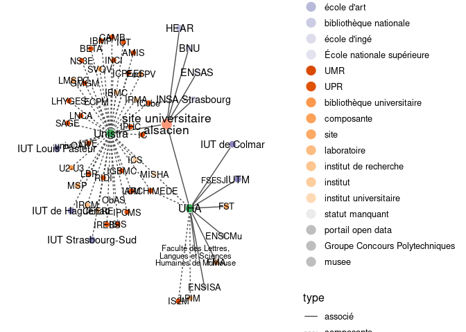
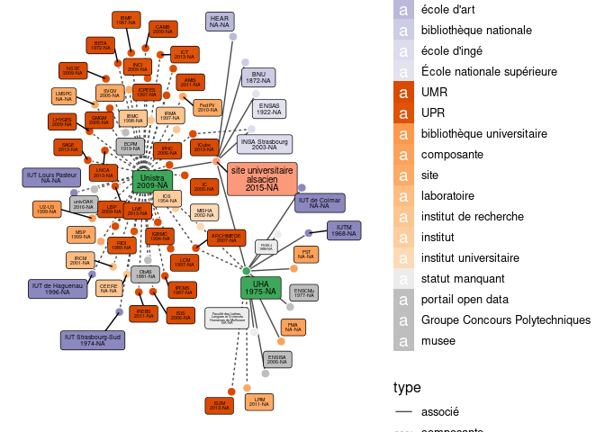

Tenter d’y voir clair dans l’ESR : tutorial R/WikidataESR
================
Julien Gossa
29/07/2019

WikidataESR est une librairie R s’appuyant sur
[wikidataR](https://cran.r-project.org/web/packages/WikidataR/index.html)
pour récupérer les données de l’ESR dans
[wikidata](https://www.wikidata.org) et produire des graphiques.

## Installation

WikidataESR peut s’installer directement depuis GitHub avec devtools :

``` r
install.packages("devtools")
library(devtools)

install_github("juliengossa/DataESR", subdir="etablissements.esr/wikidataESR")
```

## Les bases de WikidataESR

### Récupérer les données

Pour récupérer les données, vous devez disposer d’un identifiant
wikidata racine, et savoir quelles
[propriétés](https://github.com/juliengossa/DataESR/tree/master/etablissements.esr#liste-proprietes)
vous souhaitez explorer.

L’exploration se fait avec la fonction `wdesr_get_graph`.

Par exemple, il est possible d’explorer les établissements du Site
Alsace :

  - l’*identifiant wikidata* est
    [Q61716176](https://www.wikidata.org/wiki/Q61716176) ;
  - les *propriétés* sont “composante” et “associé” ;
  - il est possible de fixer une *profondeur* pour l’exploration.

<!-- end list -->

``` r
library(wikidataESR)
df.alsace <- wdesr_get_graph("Q61716176", c('composante','associé'), 1)
```

    ## [1] "Loading:  Q61716176"
    ## [1] "Loading:  Q280183"
    ## [1] "Loading:  Q157575"
    ## [1] "Loading:  Q521036"

    ## Warning in wdesr_get_item_status(item): The instance of wikidata item Q521036 is not recommended: école d'ingé.
    ##   Reason is: Statut pas assez précis.
    ##   Please check https://www.wikidata.org/wiki/Q521036
    ##   using the guideline at https://github.com/juliengossa/DataESR/tree/master/etablissements.esr

    ## [1] "Loading:  Q630461"

    ## Warning in wdesr_get_item_status(item): The instance of wikidata item Q630461 is not recommended: bibliothèque.
    ##   Reason is: préférer BU/biliothèque universitaire.
    ##   Please check https://www.wikidata.org/wiki/Q630461
    ##   using the guideline at https://github.com/juliengossa/DataESR/tree/master/etablissements.esr

    ## [1] "Loading:  Q3578190"

    ## Warning in wdesr_get_item_status(item): The instance of wikidata item Q3578190 is not recommended: École nationale supérieure.
    ##   Reason is: Confusion avec les ENS.
    ##   Please check https://www.wikidata.org/wiki/Q3578190
    ##   using the guideline at https://github.com/juliengossa/DataESR/tree/master/etablissements.esr

    ## [1] "Loading:  Q21041502"

Pour faciliter les contributions, la fonction déclenche des warning pour
chaque problème potentiel lié aux données saisie dans wikidata.

Elle retourne un objet contenant `vertices` et `edges`, qui représentent
les établissements et leurs
relations.

| id        | label                                                   | alias           | statut                     | niveau |
| :-------- | :------------------------------------------------------ | :-------------- | :------------------------- | :----- |
| Q157575   | université de Strasbourg                                | UdS             | Université (EPSCP)         | 3      |
| Q21041502 | Haute école des arts du Rhin                            | HEAR            | école d’art                | 4      |
| Q280183   | université de Haute-Alsace                              | UHA             | Université (EPSCP)         | 3      |
| Q3578190  | École nationale supérieure d’architecture de Strasbourg | ENSAS           | École nationale supérieure | 4      |
| Q521036   | Institut national des sciences appliquées de Strasbourg | INSA Strasbourg | école d’ingé               | 4      |
| Q61716176 | Université de Strasbourg                                | Site alsacien   | Regroupement universitaire | 2      |
| Q630461   | Bibliothèque nationale et universitaire de Strasbourg   | BNUS            | bibliothèque               | 5      |

| from      | to        | type    | date | depth |
| :-------- | :-------- | :------ | :--- | ----: |
| Q61716176 | Q280183   | associé | NA   |     1 |
| Q61716176 | Q157575   | associé | NA   |     1 |
| Q61716176 | Q521036   | associé | NA   |     1 |
| Q61716176 | Q630461   | associé | NA   |     1 |
| Q61716176 | Q3578190  | associé | NA   |     1 |
| Q61716176 | Q21041502 | associé | NA   |     1 |

### Tracer des représentations

Depuis le graphes retourné par `wdesr_get_graph`, il est possible de
tracer directement en utilisant la librairie `network`.

``` r
library(network)
net <- network(df.alsace$edges,
               matrix.type="edgelist", ignore.eval=FALSE,
               directed = TRUE)

plot(net)
```

<!-- -->

Cependant, pour faciliter les choses, `wikidataESR` propose une fonction
adaptatée : `wdesr_ggplot_graph`

``` r
wdesr_ggplot_graph(df.alsace)
```

<!-- -->

### Deux en un

Pour facilier les choses, la fonction `wdesr_load_and_plot` permet de
tout faire d’un coup :

``` r
wdesr_load_and_plot("Q61716176", c('composante','associé'), 1)
```

<!-- -->

On peut observer que les deux images ne sont pas identiques : le
processus de traçage des graphes est aléatoire. Il est ainsi parfois
utile de tracer plusieurs fois un graphiques pour arriver à un résultat
satisfaisant.

### Gestion du cache

Afin de ne pas avoir à retélécharger systématiquement les données,
`wikidataESR` utilise un cache local. Il est possible de sauvegarder ce
cache pour une utilisation future avec `wdesr_save_cache()`.

Il suffira ensuite de recharger le cache à la prochaine session pour ne
pas retélécharger les données avec `wdesr_load_cache()`. Attention : en
cas de modification des données sur wikidata, les données du cache local
peuvent être périmées.

Il est enfin possible d’accéder directement au cache avec
`wdesr_get_cache()`

## Pour aller plus loin

### Plus de profondeur

Il est souvent utile d’aller plus en profondeur pour explorer plus de
relations. Cela se fait en modifiant l’argument `depth` :

``` r
wdesr_load_and_plot("Q61716176", c('composante','associé'), depth = 3)
```

<!-- -->

### Plus de contrôle

Pour contrôler les graphiques, plusieurs paramètres sont disponibles :

#### Taille des noeuds

``` r
wdesr_load_and_plot("Q61716176",c('composante','associé'), 3,
                    node_size = c(2,5), label_sizes = c(3,5), 
                    arrow_gap = 0.0,
                    node_label = "alias", node_type = "text",
                    edge_label = FALSE)
```

<!-- -->

#### Taille des textes

``` r
wdesr_load_and_plot("Q61716176",c('composante','associé'), 3,
                    node_size = c(2,8), label_sizes = c(1,10), 
                    arrow_gap = 0.0,
                    node_label = "alias", node_type = "text",
                    edge_label = FALSE)
```

<!-- -->

#### Taille des textes

``` r
wdesr_load_and_plot("Q61716176",c('composante','associé'), 3,
                    node_size = c(2,8), label_sizes = c(3,5), 
                    arrow_gap = 0.0,
                    node_label = "alias", node_type = "text",
                    edge_label = FALSE)
```

<!-- -->

#### Type des textes

``` r
wdesr_load_and_plot("Q61716176",c('composante','associé'), 3,
                    node_size = 3, label_sizes = c(3,5), 
                    arrow_gap = 0.0,
                    node_label = "alias_date", node_type = "text",
                    edge_label = TRUE)
```

<!-- -->

#### Type des noeuds

``` r
wdesr_load_and_plot("Q61716176",c('composante','associé'), 3,
                    node_size = 3, label_sizes = c(1,3), 
                    arrow_gap = 0.0,
                    node_label = "alias_date", node_type = "label_repel",
                    edge_label = FALSE)
```

<!-- -->
