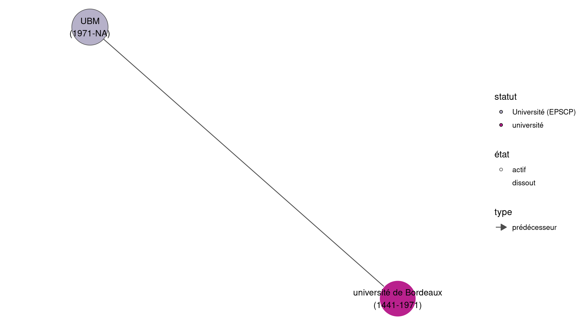
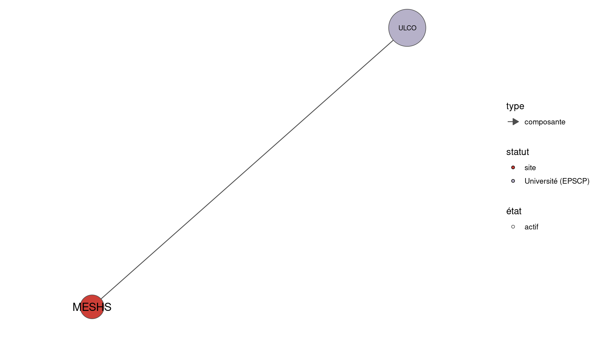
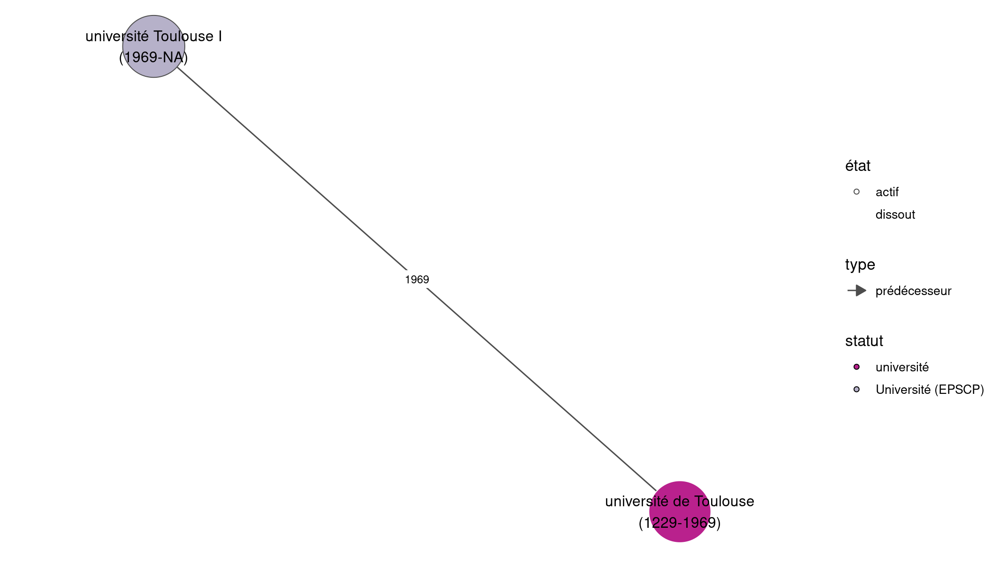
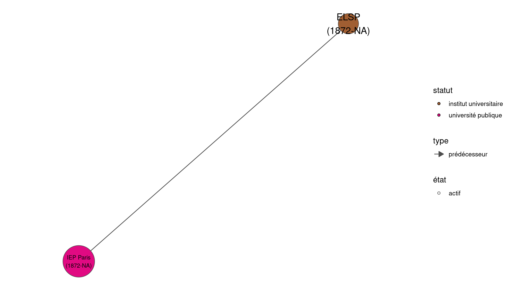

# Batches de représentation wikidataESR 

https://github.com/cpesr/WikidataESR 

```
  - twtexte:[#DataESR #HelpESR] Visualisation des organisations de l'#ESR.
  - twalt:@juliengossa LO 2.0 www.cpesr.fr
  - twurl:https://twitter.com/CPESR_/status/1457453241378148361
``` 

## Histoire, composition et association des Université actuels 

### Histoire : Paris 1 @SorbonneParis1 https://github.com/cpesr/wikidataESR/blob/master/plots/etablissements/Paris_1_@SorbonneParis1-Q999763-histoire.md 

 

[Avertissements et édition](plots/etablissements/Paris_1_@SorbonneParis1-Q999763-histoire.md 

### Composition : Paris 1 @SorbonneParis1 https://github.com/cpesr/wikidataESR/blob/master/plots/etablissements/Paris_1_@SorbonneParis1-Q999763-composition.md 

 

[Avertissements et édition](plots/etablissements/Paris_1_@SorbonneParis1-Q999763-composition.md 

### Associations : Paris 1 @SorbonneParis1 https://github.com/cpesr/wikidataESR/blob/master/plots/etablissements/Paris_1_@SorbonneParis1-Q999763-associations.md 

 

[Avertissements et édition](plots/etablissements/Paris_1_@SorbonneParis1-Q999763-associations.md 

### Histoire : Sorbonne U @Sorbonne_Univ_ https://github.com/cpesr/wikidataESR/blob/master/plots/etablissements/Sorbonne_U_@Sorbonne_Univ_-Q41497113-histoire.md 

 

[Avertissements et édition](plots/etablissements/Sorbonne_U_@Sorbonne_Univ_-Q41497113-histoire.md 

### Composition : Sorbonne U @Sorbonne_Univ_ https://github.com/cpesr/wikidataESR/blob/master/plots/etablissements/Sorbonne_U_@Sorbonne_Univ_-Q41497113-composition.md 

 

[Avertissements et édition](plots/etablissements/Sorbonne_U_@Sorbonne_Univ_-Q41497113-composition.md 

### Associations : Sorbonne U @Sorbonne_Univ_ https://github.com/cpesr/wikidataESR/blob/master/plots/etablissements/Sorbonne_U_@Sorbonne_Univ_-Q41497113-associations.md 

 

[Avertissements et édition](plots/etablissements/Sorbonne_U_@Sorbonne_Univ_-Q41497113-associations.md 

### Histoire : UBx @univbordeaux https://github.com/cpesr/wikidataESR/blob/master/plots/etablissements/UBx_@univbordeaux-Q13344-histoire.md 

 

[Avertissements et édition](plots/etablissements/UBx_@univbordeaux-Q13344-histoire.md 

### Composition : UBx @univbordeaux https://github.com/cpesr/wikidataESR/blob/master/plots/etablissements/UBx_@univbordeaux-Q13344-composition.md 

 

[Avertissements et édition](plots/etablissements/UBx_@univbordeaux-Q13344-composition.md 

### Associations : UBx @univbordeaux https://github.com/cpesr/wikidataESR/blob/master/plots/etablissements/UBx_@univbordeaux-Q13344-associations.md 

[Avertissements et édition](plots/etablissements/UBx_@univbordeaux-Q13344-associations.md 

### Histoire : Université Gustave Eiffel @UGustaveEiffel https://github.com/cpesr/wikidataESR/blob/master/plots/etablissements/Université_Gustave_Eiffel_@UGustaveEiffel-Q65153823-histoire.md 

 

[Avertissements et édition](plots/etablissements/Université_Gustave_Eiffel_@UGustaveEiffel-Q65153823-histoire.md 

### Composition : Université Gustave Eiffel @UGustaveEiffel https://github.com/cpesr/wikidataESR/blob/master/plots/etablissements/Université_Gustave_Eiffel_@UGustaveEiffel-Q65153823-composition.md 

[Avertissements et édition](plots/etablissements/Université_Gustave_Eiffel_@UGustaveEiffel-Q65153823-composition.md 

### Associations : Université Gustave Eiffel @UGustaveEiffel https://github.com/cpesr/wikidataESR/blob/master/plots/etablissements/Université_Gustave_Eiffel_@UGustaveEiffel-Q65153823-associations.md 

[Avertissements et édition](plots/etablissements/Université_Gustave_Eiffel_@UGustaveEiffel-Q65153823-associations.md 

### Histoire : Université de Poitiers @UnivPoitiers https://github.com/cpesr/wikidataESR/blob/master/plots/etablissements/Université_de_Poitiers_@UnivPoitiers-Q661056-histoire.md 

[Avertissements et édition](plots/etablissements/Université_de_Poitiers_@UnivPoitiers-Q661056-histoire.md 

### Composition : Université de Poitiers @UnivPoitiers https://github.com/cpesr/wikidataESR/blob/master/plots/etablissements/Université_de_Poitiers_@UnivPoitiers-Q661056-composition.md 

 

[Avertissements et édition](plots/etablissements/Université_de_Poitiers_@UnivPoitiers-Q661056-composition.md 

### Associations : Université de Poitiers @UnivPoitiers https://github.com/cpesr/wikidataESR/blob/master/plots/etablissements/Université_de_Poitiers_@UnivPoitiers-Q661056-associations.md 

 

[Avertissements et édition](plots/etablissements/Université_de_Poitiers_@UnivPoitiers-Q661056-associations.md 

### Histoire : Université d'Artois @Univ_Artois https://github.com/cpesr/wikidataESR/blob/master/plots/etablissements/Université_d'Artois_@Univ_Artois-Q475504-histoire.md 

[Avertissements et édition](plots/etablissements/Université_d'Artois_@Univ_Artois-Q475504-histoire.md 

### Composition : Université d'Artois @Univ_Artois https://github.com/cpesr/wikidataESR/blob/master/plots/etablissements/Université_d'Artois_@Univ_Artois-Q475504-composition.md 

 

[Avertissements et édition](plots/etablissements/Université_d'Artois_@Univ_Artois-Q475504-composition.md 

### Associations : Université d'Artois @Univ_Artois https://github.com/cpesr/wikidataESR/blob/master/plots/etablissements/Université_d'Artois_@Univ_Artois-Q475504-associations.md 

 

[Avertissements et édition](plots/etablissements/Université_d'Artois_@Univ_Artois-Q475504-associations.md 

### Histoire : Université Paris 8 - Vincennes - Saint-Denis @UnivParis8 https://github.com/cpesr/wikidataESR/blob/master/plots/etablissements/Université_Paris_8_-_Vincennes_-_Saint-Denis_@UnivParis8-Q1194988-histoire.md 

 

[Avertissements et édition](plots/etablissements/Université_Paris_8_-_Vincennes_-_Saint-Denis_@UnivParis8-Q1194988-histoire.md 

### Composition : Université Paris 8 - Vincennes - Saint-Denis @UnivParis8 https://github.com/cpesr/wikidataESR/blob/master/plots/etablissements/Université_Paris_8_-_Vincennes_-_Saint-Denis_@UnivParis8-Q1194988-composition.md 

 

[Avertissements et édition](plots/etablissements/Université_Paris_8_-_Vincennes_-_Saint-Denis_@UnivParis8-Q1194988-composition.md 

### Associations : Université Paris 8 - Vincennes - Saint-Denis @UnivParis8 https://github.com/cpesr/wikidataESR/blob/master/plots/etablissements/Université_Paris_8_-_Vincennes_-_Saint-Denis_@UnivParis8-Q1194988-associations.md 

 

[Avertissements et édition](plots/etablissements/Université_Paris_8_-_Vincennes_-_Saint-Denis_@UnivParis8-Q1194988-associations.md 

### Histoire : La Rochelle Université @UnivLaRochelle https://github.com/cpesr/wikidataESR/blob/master/plots/etablissements/La_Rochelle_Université_@UnivLaRochelle-Q1500822-histoire.md 

 

[Avertissements et édition](plots/etablissements/La_Rochelle_Université_@UnivLaRochelle-Q1500822-histoire.md 

### Composition : La Rochelle Université @UnivLaRochelle https://github.com/cpesr/wikidataESR/blob/master/plots/etablissements/La_Rochelle_Université_@UnivLaRochelle-Q1500822-composition.md 

 

[Avertissements et édition](plots/etablissements/La_Rochelle_Université_@UnivLaRochelle-Q1500822-composition.md 

### Associations : La Rochelle Université @UnivLaRochelle https://github.com/cpesr/wikidataESR/blob/master/plots/etablissements/La_Rochelle_Université_@UnivLaRochelle-Q1500822-associations.md 

 

[Avertissements et édition](plots/etablissements/La_Rochelle_Université_@UnivLaRochelle-Q1500822-associations.md 

### Histoire : Université Côte d'Azur @Univ_CotedAzur https://github.com/cpesr/wikidataESR/blob/master/plots/etablissements/Université_Côte_d'Azur_@Univ_CotedAzur-Q80186910-histoire.md 

[Avertissements et édition](plots/etablissements/Université_Côte_d'Azur_@Univ_CotedAzur-Q80186910-histoire.md 

### Composition : Université Côte d'Azur @Univ_CotedAzur https://github.com/cpesr/wikidataESR/blob/master/plots/etablissements/Université_Côte_d'Azur_@Univ_CotedAzur-Q80186910-composition.md 

[Avertissements et édition](plots/etablissements/Université_Côte_d'Azur_@Univ_CotedAzur-Q80186910-composition.md 

### Associations : Université Côte d'Azur @Univ_CotedAzur https://github.com/cpesr/wikidataESR/blob/master/plots/etablissements/Université_Côte_d'Azur_@Univ_CotedAzur-Q80186910-associations.md 

[Avertissements et édition](plots/etablissements/Université_Côte_d'Azur_@Univ_CotedAzur-Q80186910-associations.md 

### Histoire : Université Le Havre Normandie  https://github.com/cpesr/wikidataESR/blob/master/plots/etablissements/Université_Le_Havre_Normandie_-Q1784954-histoire.md 

[Avertissements et édition](plots/etablissements/Université_Le_Havre_Normandie_-Q1784954-histoire.md 

### Composition : Université Le Havre Normandie  https://github.com/cpesr/wikidataESR/blob/master/plots/etablissements/Université_Le_Havre_Normandie_-Q1784954-composition.md 

 

[Avertissements et édition](plots/etablissements/Université_Le_Havre_Normandie_-Q1784954-composition.md 

### Associations : Université Le Havre Normandie  https://github.com/cpesr/wikidataESR/blob/master/plots/etablissements/Université_Le_Havre_Normandie_-Q1784954-associations.md 

 

[Avertissements et édition](plots/etablissements/Université_Le_Havre_Normandie_-Q1784954-associations.md 

### Histoire : Université Jean Monnet @Univ_St_Etienne https://github.com/cpesr/wikidataESR/blob/master/plots/etablissements/Université_Jean_Monnet_@Univ_St_Etienne-Q623154-histoire.md 

[Avertissements et édition](plots/etablissements/Université_Jean_Monnet_@Univ_St_Etienne-Q623154-histoire.md 

### Composition : Université Jean Monnet @Univ_St_Etienne https://github.com/cpesr/wikidataESR/blob/master/plots/etablissements/Université_Jean_Monnet_@Univ_St_Etienne-Q623154-composition.md 

 

[Avertissements et édition](plots/etablissements/Université_Jean_Monnet_@Univ_St_Etienne-Q623154-composition.md 

### Associations : Université Jean Monnet @Univ_St_Etienne https://github.com/cpesr/wikidataESR/blob/master/plots/etablissements/Université_Jean_Monnet_@Univ_St_Etienne-Q623154-associations.md 

 

[Avertissements et édition](plots/etablissements/Université_Jean_Monnet_@Univ_St_Etienne-Q623154-associations.md 

### Histoire : Université Rennes 2 @Univ_Rennes2 https://github.com/cpesr/wikidataESR/blob/master/plots/etablissements/Université_Rennes_2_@Univ_Rennes2-Q459026-histoire.md 

 

[Avertissements et édition](plots/etablissements/Université_Rennes_2_@Univ_Rennes2-Q459026-histoire.md 

### Composition : Université Rennes 2 @Univ_Rennes2 https://github.com/cpesr/wikidataESR/blob/master/plots/etablissements/Université_Rennes_2_@Univ_Rennes2-Q459026-composition.md 

 

[Avertissements et édition](plots/etablissements/Université_Rennes_2_@Univ_Rennes2-Q459026-composition.md 

### Associations : Université Rennes 2 @Univ_Rennes2 https://github.com/cpesr/wikidataESR/blob/master/plots/etablissements/Université_Rennes_2_@Univ_Rennes2-Q459026-associations.md 

 

[Avertissements et édition](plots/etablissements/Université_Rennes_2_@Univ_Rennes2-Q459026-associations.md 

### Histoire : Université de Rennes 1 @UnivRennes1 https://github.com/cpesr/wikidataESR/blob/master/plots/etablissements/Université_de_Rennes_1_@UnivRennes1-Q726595-histoire.md 

 

[Avertissements et édition](plots/etablissements/Université_de_Rennes_1_@UnivRennes1-Q726595-histoire.md 

### Composition : Université de Rennes 1 @UnivRennes1 https://github.com/cpesr/wikidataESR/blob/master/plots/etablissements/Université_de_Rennes_1_@UnivRennes1-Q726595-composition.md 

 

[Avertissements et édition](plots/etablissements/Université_de_Rennes_1_@UnivRennes1-Q726595-composition.md 

### Associations : Université de Rennes 1 @UnivRennes1 https://github.com/cpesr/wikidataESR/blob/master/plots/etablissements/Université_de_Rennes_1_@UnivRennes1-Q726595-associations.md 

 

[Avertissements et édition](plots/etablissements/Université_de_Rennes_1_@UnivRennes1-Q726595-associations.md 

### Histoire : UBM @UBMontaigne https://github.com/cpesr/wikidataESR/blob/master/plots/etablissements/UBM_@UBMontaigne-Q13342-histoire.md 

 

[Avertissements et édition](plots/etablissements/UBM_@UBMontaigne-Q13342-histoire.md 

### Composition : UBM @UBMontaigne https://github.com/cpesr/wikidataESR/blob/master/plots/etablissements/UBM_@UBMontaigne-Q13342-composition.md 

 

[Avertissements et édition](plots/etablissements/UBM_@UBMontaigne-Q13342-composition.md 

### Associations : UBM @UBMontaigne https://github.com/cpesr/wikidataESR/blob/master/plots/etablissements/UBM_@UBMontaigne-Q13342-associations.md 

 

[Avertissements et édition](plots/etablissements/UBM_@UBMontaigne-Q13342-associations.md 

### Histoire : Université Paul-Valéry - Montpellier 3 @univpaulvalery https://github.com/cpesr/wikidataESR/blob/master/plots/etablissements/Université_Paul-Valéry_-_Montpellier_3_@univpaulvalery-Q2912244-histoire.md 

 

[Avertissements et édition](plots/etablissements/Université_Paul-Valéry_-_Montpellier_3_@univpaulvalery-Q2912244-histoire.md 

### Composition : Université Paul-Valéry - Montpellier 3 @univpaulvalery https://github.com/cpesr/wikidataESR/blob/master/plots/etablissements/Université_Paul-Valéry_-_Montpellier_3_@univpaulvalery-Q2912244-composition.md 

 

[Avertissements et édition](plots/etablissements/Université_Paul-Valéry_-_Montpellier_3_@univpaulvalery-Q2912244-composition.md 

### Associations : Université Paul-Valéry - Montpellier 3 @univpaulvalery https://github.com/cpesr/wikidataESR/blob/master/plots/etablissements/Université_Paul-Valéry_-_Montpellier_3_@univpaulvalery-Q2912244-associations.md 

 

[Avertissements et édition](plots/etablissements/Université_Paul-Valéry_-_Montpellier_3_@univpaulvalery-Q2912244-associations.md 

### Histoire : Université de Paris @Univ_Paris https://github.com/cpesr/wikidataESR/blob/master/plots/etablissements/Université_de_Paris_@Univ_Paris-Q55849612-histoire.md 

 

[Avertissements et édition](plots/etablissements/Université_de_Paris_@Univ_Paris-Q55849612-histoire.md 

### Composition : Université de Paris @Univ_Paris https://github.com/cpesr/wikidataESR/blob/master/plots/etablissements/Université_de_Paris_@Univ_Paris-Q55849612-composition.md 

 

[Avertissements et édition](plots/etablissements/Université_de_Paris_@Univ_Paris-Q55849612-composition.md 

### Associations : Université de Paris @Univ_Paris https://github.com/cpesr/wikidataESR/blob/master/plots/etablissements/Université_de_Paris_@Univ_Paris-Q55849612-associations.md 

[Avertissements et édition](plots/etablissements/Université_de_Paris_@Univ_Paris-Q55849612-associations.md 

### Histoire : Université de Pau et des Pays de l'Adour @universite_uppa https://github.com/cpesr/wikidataESR/blob/master/plots/etablissements/Université_de_Pau_et_des_Pays_de_l'Adour_@universite_uppa-Q572968-histoire.md 

[Avertissements et édition](plots/etablissements/Université_de_Pau_et_des_Pays_de_l'Adour_@universite_uppa-Q572968-histoire.md 

### Composition : Université de Pau et des Pays de l'Adour @universite_uppa https://github.com/cpesr/wikidataESR/blob/master/plots/etablissements/Université_de_Pau_et_des_Pays_de_l'Adour_@universite_uppa-Q572968-composition.md 

 

[Avertissements et édition](plots/etablissements/Université_de_Pau_et_des_Pays_de_l'Adour_@universite_uppa-Q572968-composition.md 

### Associations : Université de Pau et des Pays de l'Adour @universite_uppa https://github.com/cpesr/wikidataESR/blob/master/plots/etablissements/Université_de_Pau_et_des_Pays_de_l'Adour_@universite_uppa-Q572968-associations.md 

 

[Avertissements et édition](plots/etablissements/Université_de_Pau_et_des_Pays_de_l'Adour_@universite_uppa-Q572968-associations.md 

### Histoire : AMU @univamu https://github.com/cpesr/wikidataESR/blob/master/plots/etablissements/AMU_@univamu-Q2302586-histoire.md 

 

[Avertissements et édition](plots/etablissements/AMU_@univamu-Q2302586-histoire.md 

### Composition : AMU @univamu https://github.com/cpesr/wikidataESR/blob/master/plots/etablissements/AMU_@univamu-Q2302586-composition.md 

 

[Avertissements et édition](plots/etablissements/AMU_@univamu-Q2302586-composition.md 

### Associations : AMU @univamu https://github.com/cpesr/wikidataESR/blob/master/plots/etablissements/AMU_@univamu-Q2302586-associations.md 

 

[Avertissements et édition](plots/etablissements/AMU_@univamu-Q2302586-associations.md 

### Histoire : Université de Haute-Alsace @UHA68 https://github.com/cpesr/wikidataESR/blob/master/plots/etablissements/Université_de_Haute-Alsace_@UHA68-Q280183-histoire.md 

[Avertissements et édition](plots/etablissements/Université_de_Haute-Alsace_@UHA68-Q280183-histoire.md 

### Composition : Université de Haute-Alsace @UHA68 https://github.com/cpesr/wikidataESR/blob/master/plots/etablissements/Université_de_Haute-Alsace_@UHA68-Q280183-composition.md 

 

[Avertissements et édition](plots/etablissements/Université_de_Haute-Alsace_@UHA68-Q280183-composition.md 

### Associations : Université de Haute-Alsace @UHA68 https://github.com/cpesr/wikidataESR/blob/master/plots/etablissements/Université_de_Haute-Alsace_@UHA68-Q280183-associations.md 

 

[Avertissements et édition](plots/etablissements/Université_de_Haute-Alsace_@UHA68-Q280183-associations.md 

### Histoire : Université de La Réunion @univ_reunion https://github.com/cpesr/wikidataESR/blob/master/plots/etablissements/Université_de_La_Réunion_@univ_reunion-Q834819-histoire.md 

[Avertissements et édition](plots/etablissements/Université_de_La_Réunion_@univ_reunion-Q834819-histoire.md 

### Composition : Université de La Réunion @univ_reunion https://github.com/cpesr/wikidataESR/blob/master/plots/etablissements/Université_de_La_Réunion_@univ_reunion-Q834819-composition.md 

 

[Avertissements et édition](plots/etablissements/Université_de_La_Réunion_@univ_reunion-Q834819-composition.md 

### Associations : Université de La Réunion @univ_reunion https://github.com/cpesr/wikidataESR/blob/master/plots/etablissements/Université_de_La_Réunion_@univ_reunion-Q834819-associations.md 

[Avertissements et édition](plots/etablissements/Université_de_La_Réunion_@univ_reunion-Q834819-associations.md 

### Histoire : Université Toulouse III - Paul Sabatier @UT3PaulSabatier https://github.com/cpesr/wikidataESR/blob/master/plots/etablissements/Université_Toulouse_III_-_Paul_Sabatier_@UT3PaulSabatier-Q1273188-histoire.md 

 

[Avertissements et édition](plots/etablissements/Université_Toulouse_III_-_Paul_Sabatier_@UT3PaulSabatier-Q1273188-histoire.md 

### Composition : Université Toulouse III - Paul Sabatier @UT3PaulSabatier https://github.com/cpesr/wikidataESR/blob/master/plots/etablissements/Université_Toulouse_III_-_Paul_Sabatier_@UT3PaulSabatier-Q1273188-composition.md 

 

[Avertissements et édition](plots/etablissements/Université_Toulouse_III_-_Paul_Sabatier_@UT3PaulSabatier-Q1273188-composition.md 

### Associations : Université Toulouse III - Paul Sabatier @UT3PaulSabatier https://github.com/cpesr/wikidataESR/blob/master/plots/etablissements/Université_Toulouse_III_-_Paul_Sabatier_@UT3PaulSabatier-Q1273188-associations.md 

 

[Avertissements et édition](plots/etablissements/Université_Toulouse_III_-_Paul_Sabatier_@UT3PaulSabatier-Q1273188-associations.md 

### Histoire : Université d'Orléans @Univ_Orleans https://github.com/cpesr/wikidataESR/blob/master/plots/etablissements/Université_d'Orléans_@Univ_Orleans-Q13334-histoire.md 

 

[Avertissements et édition](plots/etablissements/Université_d'Orléans_@Univ_Orleans-Q13334-histoire.md 

### Composition : Université d'Orléans @Univ_Orleans https://github.com/cpesr/wikidataESR/blob/master/plots/etablissements/Université_d'Orléans_@Univ_Orleans-Q13334-composition.md 

 

[Avertissements et édition](plots/etablissements/Université_d'Orléans_@Univ_Orleans-Q13334-composition.md 

### Associations : Université d'Orléans @Univ_Orleans https://github.com/cpesr/wikidataESR/blob/master/plots/etablissements/Université_d'Orléans_@Univ_Orleans-Q13334-associations.md 

 

[Avertissements et édition](plots/etablissements/Université_d'Orléans_@Univ_Orleans-Q13334-associations.md 

### Histoire : CY Cergy Paris Université @UniversiteCergy https://github.com/cpesr/wikidataESR/blob/master/plots/etablissements/CY_Cergy_Paris_Université_@UniversiteCergy-Q74452784-histoire.md 

[Avertissements et édition](plots/etablissements/CY_Cergy_Paris_Université_@UniversiteCergy-Q74452784-histoire.md 

### Composition : CY Cergy Paris Université @UniversiteCergy https://github.com/cpesr/wikidataESR/blob/master/plots/etablissements/CY_Cergy_Paris_Université_@UniversiteCergy-Q74452784-composition.md 

 

[Avertissements et édition](plots/etablissements/CY_Cergy_Paris_Université_@UniversiteCergy-Q74452784-composition.md 

### Associations : CY Cergy Paris Université @UniversiteCergy https://github.com/cpesr/wikidataESR/blob/master/plots/etablissements/CY_Cergy_Paris_Université_@UniversiteCergy-Q74452784-associations.md 

 

[Avertissements et édition](plots/etablissements/CY_Cergy_Paris_Université_@UniversiteCergy-Q74452784-associations.md 

### Histoire : Université de la Polynésie Française @univpf https://github.com/cpesr/wikidataESR/blob/master/plots/etablissements/Université_de_la_Polynésie_Française_@univpf-Q1695245-histoire.md 

[Avertissements et édition](plots/etablissements/Université_de_la_Polynésie_Française_@univpf-Q1695245-histoire.md 

### Composition : Université de la Polynésie Française @univpf https://github.com/cpesr/wikidataESR/blob/master/plots/etablissements/Université_de_la_Polynésie_Française_@univpf-Q1695245-composition.md 

[Avertissements et édition](plots/etablissements/Université_de_la_Polynésie_Française_@univpf-Q1695245-composition.md 

### Associations : Université de la Polynésie Française @univpf https://github.com/cpesr/wikidataESR/blob/master/plots/etablissements/Université_de_la_Polynésie_Française_@univpf-Q1695245-associations.md 

[Avertissements et édition](plots/etablissements/Université_de_la_Polynésie_Française_@univpf-Q1695245-associations.md 

### Histoire : Université Panthéon-Assas @AssasParis2 https://github.com/cpesr/wikidataESR/blob/master/plots/etablissements/Université_Panthéon-Assas_@AssasParis2-Q662976-histoire.md 

 

[Avertissements et édition](plots/etablissements/Université_Panthéon-Assas_@AssasParis2-Q662976-histoire.md 

### Composition : Université Panthéon-Assas @AssasParis2 https://github.com/cpesr/wikidataESR/blob/master/plots/etablissements/Université_Panthéon-Assas_@AssasParis2-Q662976-composition.md 

 

[Avertissements et édition](plots/etablissements/Université_Panthéon-Assas_@AssasParis2-Q662976-composition.md 

### Associations : Université Panthéon-Assas @AssasParis2 https://github.com/cpesr/wikidataESR/blob/master/plots/etablissements/Université_Panthéon-Assas_@AssasParis2-Q662976-associations.md 

 

[Avertissements et édition](plots/etablissements/Université_Panthéon-Assas_@AssasParis2-Q662976-associations.md 

### Histoire : Université Paris Nanterre @uparisnanterre https://github.com/cpesr/wikidataESR/blob/master/plots/etablissements/Université_Paris_Nanterre_@uparisnanterre-Q1394262-histoire.md 

 

[Avertissements et édition](plots/etablissements/Université_Paris_Nanterre_@uparisnanterre-Q1394262-histoire.md 

### Composition : Université Paris Nanterre @uparisnanterre https://github.com/cpesr/wikidataESR/blob/master/plots/etablissements/Université_Paris_Nanterre_@uparisnanterre-Q1394262-composition.md 

 

[Avertissements et édition](plots/etablissements/Université_Paris_Nanterre_@uparisnanterre-Q1394262-composition.md 

### Associations : Université Paris Nanterre @uparisnanterre https://github.com/cpesr/wikidataESR/blob/master/plots/etablissements/Université_Paris_Nanterre_@uparisnanterre-Q1394262-associations.md 

 

[Avertissements et édition](plots/etablissements/Université_Paris_Nanterre_@uparisnanterre-Q1394262-associations.md 

### Histoire : Université Savoie Mont Blanc @Univ_Savoie https://github.com/cpesr/wikidataESR/blob/master/plots/etablissements/Université_Savoie_Mont_Blanc_@Univ_Savoie-Q2496158-histoire.md 

[Avertissements et édition](plots/etablissements/Université_Savoie_Mont_Blanc_@Univ_Savoie-Q2496158-histoire.md 

### Composition : Université Savoie Mont Blanc @Univ_Savoie https://github.com/cpesr/wikidataESR/blob/master/plots/etablissements/Université_Savoie_Mont_Blanc_@Univ_Savoie-Q2496158-composition.md 

 

[Avertissements et édition](plots/etablissements/Université_Savoie_Mont_Blanc_@Univ_Savoie-Q2496158-composition.md 

### Associations : Université Savoie Mont Blanc @Univ_Savoie https://github.com/cpesr/wikidataESR/blob/master/plots/etablissements/Université_Savoie_Mont_Blanc_@Univ_Savoie-Q2496158-associations.md 

[Avertissements et édition](plots/etablissements/Université_Savoie_Mont_Blanc_@Univ_Savoie-Q2496158-associations.md 

### Histoire : Le Mans Université @LeMansUniv https://github.com/cpesr/wikidataESR/blob/master/plots/etablissements/Le_Mans_Université_@LeMansUniv-Q834825-histoire.md 

[Avertissements et édition](plots/etablissements/Le_Mans_Université_@LeMansUniv-Q834825-histoire.md 

### Composition : Le Mans Université @LeMansUniv https://github.com/cpesr/wikidataESR/blob/master/plots/etablissements/Le_Mans_Université_@LeMansUniv-Q834825-composition.md 

 

[Avertissements et édition](plots/etablissements/Le_Mans_Université_@LeMansUniv-Q834825-composition.md 

### Associations : Le Mans Université @LeMansUniv https://github.com/cpesr/wikidataESR/blob/master/plots/etablissements/Le_Mans_Université_@LeMansUniv-Q834825-associations.md 

 

[Avertissements et édition](plots/etablissements/Le_Mans_Université_@LeMansUniv-Q834825-associations.md 

### Histoire : UNICAEN @universite_caen https://github.com/cpesr/wikidataESR/blob/master/plots/etablissements/UNICAEN_@universite_caen-Q568554-histoire.md 

[Avertissements et édition](plots/etablissements/UNICAEN_@universite_caen-Q568554-histoire.md 

### Composition : UNICAEN @universite_caen https://github.com/cpesr/wikidataESR/blob/master/plots/etablissements/UNICAEN_@universite_caen-Q568554-composition.md 

 

[Avertissements et édition](plots/etablissements/UNICAEN_@universite_caen-Q568554-composition.md 

### Associations : UNICAEN @universite_caen https://github.com/cpesr/wikidataESR/blob/master/plots/etablissements/UNICAEN_@universite_caen-Q568554-associations.md 

 

[Avertissements et édition](plots/etablissements/UNICAEN_@universite_caen-Q568554-associations.md 

### Histoire : Université de Strasbourg @unistra https://github.com/cpesr/wikidataESR/blob/master/plots/etablissements/Université_de_Strasbourg_@unistra-Q157575-histoire.md 

 

[Avertissements et édition](plots/etablissements/Université_de_Strasbourg_@unistra-Q157575-histoire.md 

### Composition : Université de Strasbourg @unistra https://github.com/cpesr/wikidataESR/blob/master/plots/etablissements/Université_de_Strasbourg_@unistra-Q157575-composition.md 

 

[Avertissements et édition](plots/etablissements/Université_de_Strasbourg_@unistra-Q157575-composition.md 

### Associations : Université de Strasbourg @unistra https://github.com/cpesr/wikidataESR/blob/master/plots/etablissements/Université_de_Strasbourg_@unistra-Q157575-associations.md 

 

[Avertissements et édition](plots/etablissements/Université_de_Strasbourg_@unistra-Q157575-associations.md 

### Histoire : Université d'Évry-Val-d'Essonne @UnivEvry https://github.com/cpesr/wikidataESR/blob/master/plots/etablissements/Université_d'Évry-Val-d'Essonne_@UnivEvry-Q1531014-histoire.md 

[Avertissements et édition](plots/etablissements/Université_d'Évry-Val-d'Essonne_@UnivEvry-Q1531014-histoire.md 

### Composition : Université d'Évry-Val-d'Essonne @UnivEvry https://github.com/cpesr/wikidataESR/blob/master/plots/etablissements/Université_d'Évry-Val-d'Essonne_@UnivEvry-Q1531014-composition.md 

 

[Avertissements et édition](plots/etablissements/Université_d'Évry-Val-d'Essonne_@UnivEvry-Q1531014-composition.md 

### Associations : Université d'Évry-Val-d'Essonne @UnivEvry https://github.com/cpesr/wikidataESR/blob/master/plots/etablissements/Université_d'Évry-Val-d'Essonne_@UnivEvry-Q1531014-associations.md 

 

[Avertissements et édition](plots/etablissements/Université_d'Évry-Val-d'Essonne_@UnivEvry-Q1531014-associations.md 

### Histoire : Université Grenoble Alpes @UGrenobleAlpes https://github.com/cpesr/wikidataESR/blob/master/plots/etablissements/Université_Grenoble_Alpes_@UGrenobleAlpes-Q945876-histoire.md 

 

[Avertissements et édition](plots/etablissements/Université_Grenoble_Alpes_@UGrenobleAlpes-Q945876-histoire.md 

### Composition : Université Grenoble Alpes @UGrenobleAlpes https://github.com/cpesr/wikidataESR/blob/master/plots/etablissements/Université_Grenoble_Alpes_@UGrenobleAlpes-Q945876-composition.md 

 

[Avertissements et édition](plots/etablissements/Université_Grenoble_Alpes_@UGrenobleAlpes-Q945876-composition.md 

### Associations : Université Grenoble Alpes @UGrenobleAlpes https://github.com/cpesr/wikidataESR/blob/master/plots/etablissements/Université_Grenoble_Alpes_@UGrenobleAlpes-Q945876-associations.md 

[Avertissements et édition](plots/etablissements/Université_Grenoble_Alpes_@UGrenobleAlpes-Q945876-associations.md 

### Histoire : URCA @universitereims https://github.com/cpesr/wikidataESR/blob/master/plots/etablissements/URCA_@universitereims-Q2496149-histoire.md 

[Avertissements et édition](plots/etablissements/URCA_@universitereims-Q2496149-histoire.md 

### Composition : URCA @universitereims https://github.com/cpesr/wikidataESR/blob/master/plots/etablissements/URCA_@universitereims-Q2496149-composition.md 

 

[Avertissements et édition](plots/etablissements/URCA_@universitereims-Q2496149-composition.md 

### Associations : URCA @universitereims https://github.com/cpesr/wikidataESR/blob/master/plots/etablissements/URCA_@universitereims-Q2496149-associations.md 

 

[Avertissements et édition](plots/etablissements/URCA_@universitereims-Q2496149-associations.md 

### Histoire : Université de Toulon @univtoulon https://github.com/cpesr/wikidataESR/blob/master/plots/etablissements/Université_de_Toulon_@univtoulon-Q1816857-histoire.md 

[Avertissements et édition](plots/etablissements/Université_de_Toulon_@univtoulon-Q1816857-histoire.md 

### Composition : Université de Toulon @univtoulon https://github.com/cpesr/wikidataESR/blob/master/plots/etablissements/Université_de_Toulon_@univtoulon-Q1816857-composition.md 

 

[Avertissements et édition](plots/etablissements/Université_de_Toulon_@univtoulon-Q1816857-composition.md 

### Associations : Université de Toulon @univtoulon https://github.com/cpesr/wikidataESR/blob/master/plots/etablissements/Université_de_Toulon_@univtoulon-Q1816857-associations.md 

 

[Avertissements et édition](plots/etablissements/Université_de_Toulon_@univtoulon-Q1816857-associations.md 

### Histoire : Université de Guyane @univguyane https://github.com/cpesr/wikidataESR/blob/master/plots/etablissements/Université_de_Guyane_@univguyane-Q16682067-histoire.md 

[Avertissements et édition](plots/etablissements/Université_de_Guyane_@univguyane-Q16682067-histoire.md 

### Composition : Université de Guyane @univguyane https://github.com/cpesr/wikidataESR/blob/master/plots/etablissements/Université_de_Guyane_@univguyane-Q16682067-composition.md 

 

[Avertissements et édition](plots/etablissements/Université_de_Guyane_@univguyane-Q16682067-composition.md 

### Associations : Université de Guyane @univguyane https://github.com/cpesr/wikidataESR/blob/master/plots/etablissements/Université_de_Guyane_@univguyane-Q16682067-associations.md 

[Avertissements et édition](plots/etablissements/Université_de_Guyane_@univguyane-Q16682067-associations.md 

### Histoire : UVSQ @uvsq https://github.com/cpesr/wikidataESR/blob/master/plots/etablissements/UVSQ_@uvsq-Q186638-histoire.md 

[Avertissements et édition](plots/etablissements/UVSQ_@uvsq-Q186638-histoire.md 

### Composition : UVSQ @uvsq https://github.com/cpesr/wikidataESR/blob/master/plots/etablissements/UVSQ_@uvsq-Q186638-composition.md 

 

[Avertissements et édition](plots/etablissements/UVSQ_@uvsq-Q186638-composition.md 

### Associations : UVSQ @uvsq https://github.com/cpesr/wikidataESR/blob/master/plots/etablissements/UVSQ_@uvsq-Q186638-associations.md 

 

[Avertissements et édition](plots/etablissements/UVSQ_@uvsq-Q186638-associations.md 

### Histoire : ULCO @ULCO_Univ https://github.com/cpesr/wikidataESR/blob/master/plots/etablissements/ULCO_@ULCO_Univ-Q3551755-histoire.md 

[Avertissements et édition](plots/etablissements/ULCO_@ULCO_Univ-Q3551755-histoire.md 

### Composition : ULCO @ULCO_Univ https://github.com/cpesr/wikidataESR/blob/master/plots/etablissements/ULCO_@ULCO_Univ-Q3551755-composition.md 

 

[Avertissements et édition](plots/etablissements/ULCO_@ULCO_Univ-Q3551755-composition.md 

### Associations : ULCO @ULCO_Univ https://github.com/cpesr/wikidataESR/blob/master/plots/etablissements/ULCO_@ULCO_Univ-Q3551755-associations.md 

 

[Avertissements et édition](plots/etablissements/ULCO_@ULCO_Univ-Q3551755-associations.md 

### Histoire : UFC @fc_univ https://github.com/cpesr/wikidataESR/blob/master/plots/etablissements/UFC_@fc_univ-Q829449-histoire.md 

[Avertissements et édition](plots/etablissements/UFC_@fc_univ-Q829449-histoire.md 

### Composition : UFC @fc_univ https://github.com/cpesr/wikidataESR/blob/master/plots/etablissements/UFC_@fc_univ-Q829449-composition.md 

 

[Avertissements et édition](plots/etablissements/UFC_@fc_univ-Q829449-composition.md 

### Associations : UFC @fc_univ https://github.com/cpesr/wikidataESR/blob/master/plots/etablissements/UFC_@fc_univ-Q829449-associations.md 

 

[Avertissements et édition](plots/etablissements/UFC_@fc_univ-Q829449-associations.md 

### Histoire : Université Sorbonne Nouvelle - Paris 3 @SorbonneParis3 https://github.com/cpesr/wikidataESR/blob/master/plots/etablissements/Université_Sorbonne_Nouvelle_-_Paris_3_@SorbonneParis3-Q571293-histoire.md 

 

[Avertissements et édition](plots/etablissements/Université_Sorbonne_Nouvelle_-_Paris_3_@SorbonneParis3-Q571293-histoire.md 

### Composition : Université Sorbonne Nouvelle - Paris 3 @SorbonneParis3 https://github.com/cpesr/wikidataESR/blob/master/plots/etablissements/Université_Sorbonne_Nouvelle_-_Paris_3_@SorbonneParis3-Q571293-composition.md 

 

[Avertissements et édition](plots/etablissements/Université_Sorbonne_Nouvelle_-_Paris_3_@SorbonneParis3-Q571293-composition.md 

### Associations : Université Sorbonne Nouvelle - Paris 3 @SorbonneParis3 https://github.com/cpesr/wikidataESR/blob/master/plots/etablissements/Université_Sorbonne_Nouvelle_-_Paris_3_@SorbonneParis3-Q571293-associations.md 

 

[Avertissements et édition](plots/etablissements/Université_Sorbonne_Nouvelle_-_Paris_3_@SorbonneParis3-Q571293-associations.md 

### Histoire : UT1 @UT1Capitole https://github.com/cpesr/wikidataESR/blob/master/plots/etablissements/UT1_@UT1Capitole-Q590201-histoire.md 

 

[Avertissements et édition](plots/etablissements/UT1_@UT1Capitole-Q590201-histoire.md 

### Composition : UT1 @UT1Capitole https://github.com/cpesr/wikidataESR/blob/master/plots/etablissements/UT1_@UT1Capitole-Q590201-composition.md 

 

[Avertissements et édition](plots/etablissements/UT1_@UT1Capitole-Q590201-composition.md 

### Associations : UT1 @UT1Capitole https://github.com/cpesr/wikidataESR/blob/master/plots/etablissements/UT1_@UT1Capitole-Q590201-associations.md 

 

[Avertissements et édition](plots/etablissements/UT1_@UT1Capitole-Q590201-associations.md 

### Histoire : Université de Picardie Jules-Verne @UPJV_Univ https://github.com/cpesr/wikidataESR/blob/master/plots/etablissements/Université_de_Picardie_Jules-Verne_@UPJV_Univ-Q947747-histoire.md 

[Avertissements et édition](plots/etablissements/Université_de_Picardie_Jules-Verne_@UPJV_Univ-Q947747-histoire.md 

### Composition : Université de Picardie Jules-Verne @UPJV_Univ https://github.com/cpesr/wikidataESR/blob/master/plots/etablissements/Université_de_Picardie_Jules-Verne_@UPJV_Univ-Q947747-composition.md 

[Avertissements et édition](plots/etablissements/Université_de_Picardie_Jules-Verne_@UPJV_Univ-Q947747-composition.md 

### Associations : Université de Picardie Jules-Verne @UPJV_Univ https://github.com/cpesr/wikidataESR/blob/master/plots/etablissements/Université_de_Picardie_Jules-Verne_@UPJV_Univ-Q947747-associations.md 

[Avertissements et édition](plots/etablissements/Université_de_Picardie_Jules-Verne_@UPJV_Univ-Q947747-associations.md 

### Histoire : Université PSL @psl_univ https://github.com/cpesr/wikidataESR/blob/master/plots/etablissements/Université_PSL_@psl_univ-Q1163431-histoire.md 

 

[Avertissements et édition](plots/etablissements/Université_PSL_@psl_univ-Q1163431-histoire.md 

### Composition : Université PSL @psl_univ https://github.com/cpesr/wikidataESR/blob/master/plots/etablissements/Université_PSL_@psl_univ-Q1163431-composition.md 

 

[Avertissements et édition](plots/etablissements/Université_PSL_@psl_univ-Q1163431-composition.md 

### Associations : Université PSL @psl_univ https://github.com/cpesr/wikidataESR/blob/master/plots/etablissements/Université_PSL_@psl_univ-Q1163431-associations.md 

[Avertissements et édition](plots/etablissements/Université_PSL_@psl_univ-Q1163431-associations.md 

### Histoire : Université Paris-Est Créteil @UPECactus https://github.com/cpesr/wikidataESR/blob/master/plots/etablissements/Université_Paris-Est_Créteil_@UPECactus-Q980688-histoire.md 

 

[Avertissements et édition](plots/etablissements/Université_Paris-Est_Créteil_@UPECactus-Q980688-histoire.md 

### Composition : Université Paris-Est Créteil @UPECactus https://github.com/cpesr/wikidataESR/blob/master/plots/etablissements/Université_Paris-Est_Créteil_@UPECactus-Q980688-composition.md 

 

[Avertissements et édition](plots/etablissements/Université_Paris-Est_Créteil_@UPECactus-Q980688-composition.md 

### Associations : Université Paris-Est Créteil @UPECactus https://github.com/cpesr/wikidataESR/blob/master/plots/etablissements/Université_Paris-Est_Créteil_@UPECactus-Q980688-associations.md 

 

[Avertissements et édition](plots/etablissements/Université_Paris-Est_Créteil_@UPECactus-Q980688-associations.md 

### Histoire : UNÎMES @unimesfr https://github.com/cpesr/wikidataESR/blob/master/plots/etablissements/UNÎMES_@unimesfr-Q2496121-histoire.md 

[Avertissements et édition](plots/etablissements/UNÎMES_@unimesfr-Q2496121-histoire.md 

### Composition : UNÎMES @unimesfr https://github.com/cpesr/wikidataESR/blob/master/plots/etablissements/UNÎMES_@unimesfr-Q2496121-composition.md 

 

[Avertissements et édition](plots/etablissements/UNÎMES_@unimesfr-Q2496121-composition.md 

### Associations : UNÎMES @unimesfr https://github.com/cpesr/wikidataESR/blob/master/plots/etablissements/UNÎMES_@unimesfr-Q2496121-associations.md 

 

[Avertissements et édition](plots/etablissements/UNÎMES_@unimesfr-Q2496121-associations.md 

### Histoire : Université Sorbonne Paris Nord @univ_spn https://github.com/cpesr/wikidataESR/blob/master/plots/etablissements/Université_Sorbonne_Paris_Nord_@univ_spn-Q1780212-histoire.md 

 

[Avertissements et édition](plots/etablissements/Université_Sorbonne_Paris_Nord_@univ_spn-Q1780212-histoire.md 

### Composition : Université Sorbonne Paris Nord @univ_spn https://github.com/cpesr/wikidataESR/blob/master/plots/etablissements/Université_Sorbonne_Paris_Nord_@univ_spn-Q1780212-composition.md 

 

[Avertissements et édition](plots/etablissements/Université_Sorbonne_Paris_Nord_@univ_spn-Q1780212-composition.md 

### Associations : Université Sorbonne Paris Nord @univ_spn https://github.com/cpesr/wikidataESR/blob/master/plots/etablissements/Université_Sorbonne_Paris_Nord_@univ_spn-Q1780212-associations.md 

 

[Avertissements et édition](plots/etablissements/Université_Sorbonne_Paris_Nord_@univ_spn-Q1780212-associations.md 

### Histoire : Université Claude Bernard - Lyon 1 @UnivLyon1 https://github.com/cpesr/wikidataESR/blob/master/plots/etablissements/Université_Claude_Bernard_-_Lyon_1_@UnivLyon1-Q4032-histoire.md 

 

[Avertissements et édition](plots/etablissements/Université_Claude_Bernard_-_Lyon_1_@UnivLyon1-Q4032-histoire.md 

### Composition : Université Claude Bernard - Lyon 1 @UnivLyon1 https://github.com/cpesr/wikidataESR/blob/master/plots/etablissements/Université_Claude_Bernard_-_Lyon_1_@UnivLyon1-Q4032-composition.md 

 

[Avertissements et édition](plots/etablissements/Université_Claude_Bernard_-_Lyon_1_@UnivLyon1-Q4032-composition.md 

### Associations : Université Claude Bernard - Lyon 1 @UnivLyon1 https://github.com/cpesr/wikidataESR/blob/master/plots/etablissements/Université_Claude_Bernard_-_Lyon_1_@UnivLyon1-Q4032-associations.md 

 

[Avertissements et édition](plots/etablissements/Université_Claude_Bernard_-_Lyon_1_@UnivLyon1-Q4032-associations.md 

### Histoire : Université de Corse Pasquale Paoli @univcorse https://github.com/cpesr/wikidataESR/blob/master/plots/etablissements/Université_de_Corse_Pasquale_Paoli_@univcorse-Q335841-histoire.md 

[Avertissements et édition](plots/etablissements/Université_de_Corse_Pasquale_Paoli_@univcorse-Q335841-histoire.md 

### Composition : Université de Corse Pasquale Paoli @univcorse https://github.com/cpesr/wikidataESR/blob/master/plots/etablissements/Université_de_Corse_Pasquale_Paoli_@univcorse-Q335841-composition.md 

[Avertissements et édition](plots/etablissements/Université_de_Corse_Pasquale_Paoli_@univcorse-Q335841-composition.md 

### Associations : Université de Corse Pasquale Paoli @univcorse https://github.com/cpesr/wikidataESR/blob/master/plots/etablissements/Université_de_Corse_Pasquale_Paoli_@univcorse-Q335841-associations.md 

[Avertissements et édition](plots/etablissements/Université_de_Corse_Pasquale_Paoli_@univcorse-Q335841-associations.md 

### Histoire : Université de Perpignan Via Domitia @upvd1 https://github.com/cpesr/wikidataESR/blob/master/plots/etablissements/Université_de_Perpignan_Via_Domitia_@upvd1-Q304872-histoire.md 

 

[Avertissements et édition](plots/etablissements/Université_de_Perpignan_Via_Domitia_@upvd1-Q304872-histoire.md 

### Composition : Université de Perpignan Via Domitia @upvd1 https://github.com/cpesr/wikidataESR/blob/master/plots/etablissements/Université_de_Perpignan_Via_Domitia_@upvd1-Q304872-composition.md 

 

[Avertissements et édition](plots/etablissements/Université_de_Perpignan_Via_Domitia_@upvd1-Q304872-composition.md 

### Associations : Université de Perpignan Via Domitia @upvd1 https://github.com/cpesr/wikidataESR/blob/master/plots/etablissements/Université_de_Perpignan_Via_Domitia_@upvd1-Q304872-associations.md 

 

[Avertissements et édition](plots/etablissements/Université_de_Perpignan_Via_Domitia_@upvd1-Q304872-associations.md 

### Histoire : Université Paris-Saclay @UnivParisSaclay https://github.com/cpesr/wikidataESR/blob/master/plots/etablissements/Université_Paris-Saclay_@UnivParisSaclay-Q13531686-histoire.md 

 

[Avertissements et édition](plots/etablissements/Université_Paris-Saclay_@UnivParisSaclay-Q13531686-histoire.md 

### Composition : Université Paris-Saclay @UnivParisSaclay https://github.com/cpesr/wikidataESR/blob/master/plots/etablissements/Université_Paris-Saclay_@UnivParisSaclay-Q13531686-composition.md 

 

[Avertissements et édition](plots/etablissements/Université_Paris-Saclay_@UnivParisSaclay-Q13531686-composition.md 

### Associations : Université Paris-Saclay @UnivParisSaclay https://github.com/cpesr/wikidataESR/blob/master/plots/etablissements/Université_Paris-Saclay_@UnivParisSaclay-Q13531686-associations.md 

[Avertissements et édition](plots/etablissements/Université_Paris-Saclay_@UnivParisSaclay-Q13531686-associations.md 

### Histoire : Université de la Nouvelle-Calédonie @unc_nc https://github.com/cpesr/wikidataESR/blob/master/plots/etablissements/Université_de_la_Nouvelle-Calédonie_@unc_nc-Q734332-histoire.md 

[Avertissements et édition](plots/etablissements/Université_de_la_Nouvelle-Calédonie_@unc_nc-Q734332-histoire.md 

### Composition : Université de la Nouvelle-Calédonie @unc_nc https://github.com/cpesr/wikidataESR/blob/master/plots/etablissements/Université_de_la_Nouvelle-Calédonie_@unc_nc-Q734332-composition.md 

 

[Avertissements et édition](plots/etablissements/Université_de_la_Nouvelle-Calédonie_@unc_nc-Q734332-composition.md 

### Associations : Université de la Nouvelle-Calédonie @unc_nc https://github.com/cpesr/wikidataESR/blob/master/plots/etablissements/Université_de_la_Nouvelle-Calédonie_@unc_nc-Q734332-associations.md 

[Avertissements et édition](plots/etablissements/Université_de_la_Nouvelle-Calédonie_@unc_nc-Q734332-associations.md 

### Histoire : Université de Limoges @unilim https://github.com/cpesr/wikidataESR/blob/master/plots/etablissements/Université_de_Limoges_@unilim-Q2661290-histoire.md 

[Avertissements et édition](plots/etablissements/Université_de_Limoges_@unilim-Q2661290-histoire.md 

### Composition : Université de Limoges @unilim https://github.com/cpesr/wikidataESR/blob/master/plots/etablissements/Université_de_Limoges_@unilim-Q2661290-composition.md 

 

[Avertissements et édition](plots/etablissements/Université_de_Limoges_@unilim-Q2661290-composition.md 

### Associations : Université de Limoges @unilim https://github.com/cpesr/wikidataESR/blob/master/plots/etablissements/Université_de_Limoges_@unilim-Q2661290-associations.md 

 

[Avertissements et édition](plots/etablissements/Université_de_Limoges_@unilim-Q2661290-associations.md 

### Histoire : Université de Tours @UnivTours https://github.com/cpesr/wikidataESR/blob/master/plots/etablissements/Université_de_Tours_@UnivTours-Q494335-histoire.md 

 

[Avertissements et édition](plots/etablissements/Université_de_Tours_@UnivTours-Q494335-histoire.md 

### Composition : Université de Tours @UnivTours https://github.com/cpesr/wikidataESR/blob/master/plots/etablissements/Université_de_Tours_@UnivTours-Q494335-composition.md 

 

[Avertissements et édition](plots/etablissements/Université_de_Tours_@UnivTours-Q494335-composition.md 

### Associations : Université de Tours @UnivTours https://github.com/cpesr/wikidataESR/blob/master/plots/etablissements/Université_de_Tours_@UnivTours-Q494335-associations.md 

 

[Avertissements et édition](plots/etablissements/Université_de_Tours_@UnivTours-Q494335-associations.md 

### Histoire : Université des Antilles @UnivAntilles https://github.com/cpesr/wikidataESR/blob/master/plots/etablissements/Université_des_Antilles_@UnivAntilles-Q16682075-histoire.md 

[Avertissements et édition](plots/etablissements/Université_des_Antilles_@UnivAntilles-Q16682075-histoire.md 

### Composition : Université des Antilles @UnivAntilles https://github.com/cpesr/wikidataESR/blob/master/plots/etablissements/Université_des_Antilles_@UnivAntilles-Q16682075-composition.md 

[Avertissements et édition](plots/etablissements/Université_des_Antilles_@UnivAntilles-Q16682075-composition.md 

### Associations : Université des Antilles @UnivAntilles https://github.com/cpesr/wikidataESR/blob/master/plots/etablissements/Université_des_Antilles_@UnivAntilles-Q16682075-associations.md 

[Avertissements et édition](plots/etablissements/Université_des_Antilles_@UnivAntilles-Q16682075-associations.md 

### Histoire : Université Lumière - Lyon 2 @univ_lyon2 https://github.com/cpesr/wikidataESR/blob/master/plots/etablissements/Université_Lumière_-_Lyon_2_@univ_lyon2-Q4041-histoire.md 

 

[Avertissements et édition](plots/etablissements/Université_Lumière_-_Lyon_2_@univ_lyon2-Q4041-histoire.md 

### Composition : Université Lumière - Lyon 2 @univ_lyon2 https://github.com/cpesr/wikidataESR/blob/master/plots/etablissements/Université_Lumière_-_Lyon_2_@univ_lyon2-Q4041-composition.md 

 

[Avertissements et édition](plots/etablissements/Université_Lumière_-_Lyon_2_@univ_lyon2-Q4041-composition.md 

### Associations : Université Lumière - Lyon 2 @univ_lyon2 https://github.com/cpesr/wikidataESR/blob/master/plots/etablissements/Université_Lumière_-_Lyon_2_@univ_lyon2-Q4041-associations.md 

 

[Avertissements et édition](plots/etablissements/Université_Lumière_-_Lyon_2_@univ_lyon2-Q4041-associations.md 

### Histoire : Université Jean Moulin - Lyon 3 @UJML https://github.com/cpesr/wikidataESR/blob/master/plots/etablissements/Université_Jean_Moulin_-_Lyon_3_@UJML-Q4027-histoire.md 

 

[Avertissements et édition](plots/etablissements/Université_Jean_Moulin_-_Lyon_3_@UJML-Q4027-histoire.md 

### Composition : Université Jean Moulin - Lyon 3 @UJML https://github.com/cpesr/wikidataESR/blob/master/plots/etablissements/Université_Jean_Moulin_-_Lyon_3_@UJML-Q4027-composition.md 

 

[Avertissements et édition](plots/etablissements/Université_Jean_Moulin_-_Lyon_3_@UJML-Q4027-composition.md 

### Associations : Université Jean Moulin - Lyon 3 @UJML https://github.com/cpesr/wikidataESR/blob/master/plots/etablissements/Université_Jean_Moulin_-_Lyon_3_@UJML-Q4027-associations.md 

 

[Avertissements et édition](plots/etablissements/Université_Jean_Moulin_-_Lyon_3_@UJML-Q4027-associations.md 

### Histoire : AU @univavignon https://github.com/cpesr/wikidataESR/blob/master/plots/etablissements/AU_@univavignon-Q2033119-histoire.md 

[Avertissements et édition](plots/etablissements/AU_@univavignon-Q2033119-histoire.md 

### Composition : AU @univavignon https://github.com/cpesr/wikidataESR/blob/master/plots/etablissements/AU_@univavignon-Q2033119-composition.md 

 

[Avertissements et édition](plots/etablissements/AU_@univavignon-Q2033119-composition.md 

### Associations : AU @univavignon https://github.com/cpesr/wikidataESR/blob/master/plots/etablissements/AU_@univavignon-Q2033119-associations.md 

 

[Avertissements et édition](plots/etablissements/AU_@univavignon-Q2033119-associations.md 

### Histoire : Université d'Angers @UnivAngers https://github.com/cpesr/wikidataESR/blob/master/plots/etablissements/Université_d'Angers_@UnivAngers-Q1538727-histoire.md 

[Avertissements et édition](plots/etablissements/Université_d'Angers_@UnivAngers-Q1538727-histoire.md 

### Composition : Université d'Angers @UnivAngers https://github.com/cpesr/wikidataESR/blob/master/plots/etablissements/Université_d'Angers_@UnivAngers-Q1538727-composition.md 

 

[Avertissements et édition](plots/etablissements/Université_d'Angers_@UnivAngers-Q1538727-composition.md 

### Associations : Université d'Angers @UnivAngers https://github.com/cpesr/wikidataESR/blob/master/plots/etablissements/Université_d'Angers_@UnivAngers-Q1538727-associations.md 

 

[Avertissements et édition](plots/etablissements/Université_d'Angers_@UnivAngers-Q1538727-associations.md 

### Histoire : Université de Bourgogne @univbourgogne https://github.com/cpesr/wikidataESR/blob/master/plots/etablissements/Université_de_Bourgogne_@univbourgogne-Q287072-histoire.md 

[Avertissements et édition](plots/etablissements/Université_de_Bourgogne_@univbourgogne-Q287072-histoire.md 

### Composition : Université de Bourgogne @univbourgogne https://github.com/cpesr/wikidataESR/blob/master/plots/etablissements/Université_de_Bourgogne_@univbourgogne-Q287072-composition.md 

 

[Avertissements et édition](plots/etablissements/Université_de_Bourgogne_@univbourgogne-Q287072-composition.md 

### Associations : Université de Bourgogne @univbourgogne https://github.com/cpesr/wikidataESR/blob/master/plots/etablissements/Université_de_Bourgogne_@univbourgogne-Q287072-associations.md 

 

[Avertissements et édition](plots/etablissements/Université_de_Bourgogne_@univbourgogne-Q287072-associations.md 

### Histoire : UBS @ubs_universite https://github.com/cpesr/wikidataESR/blob/master/plots/etablissements/UBS_@ubs_universite-Q1125958-histoire.md 

[Avertissements et édition](plots/etablissements/UBS_@ubs_universite-Q1125958-histoire.md 

### Composition : UBS @ubs_universite https://github.com/cpesr/wikidataESR/blob/master/plots/etablissements/UBS_@ubs_universite-Q1125958-composition.md 

 

[Avertissements et édition](plots/etablissements/UBS_@ubs_universite-Q1125958-composition.md 

### Associations : UBS @ubs_universite https://github.com/cpesr/wikidataESR/blob/master/plots/etablissements/UBS_@ubs_universite-Q1125958-associations.md 

[Avertissements et édition](plots/etablissements/UBS_@ubs_universite-Q1125958-associations.md 

### Histoire : Université de Rouen Normandie  https://github.com/cpesr/wikidataESR/blob/master/plots/etablissements/Université_de_Rouen_Normandie_-Q494247-histoire.md 

[Avertissements et édition](plots/etablissements/Université_de_Rouen_Normandie_-Q494247-histoire.md 

### Composition : Université de Rouen Normandie  https://github.com/cpesr/wikidataESR/blob/master/plots/etablissements/Université_de_Rouen_Normandie_-Q494247-composition.md 

 

[Avertissements et édition](plots/etablissements/Université_de_Rouen_Normandie_-Q494247-composition.md 

### Associations : Université de Rouen Normandie  https://github.com/cpesr/wikidataESR/blob/master/plots/etablissements/Université_de_Rouen_Normandie_-Q494247-associations.md 

 

[Avertissements et édition](plots/etablissements/Université_de_Rouen_Normandie_-Q494247-associations.md 

### Histoire : Université de Bretagne Occidentale @UBO_UnivBrest https://github.com/cpesr/wikidataESR/blob/master/plots/etablissements/Université_de_Bretagne_Occidentale_@UBO_UnivBrest-Q1857334-histoire.md 

[Avertissements et édition](plots/etablissements/Université_de_Bretagne_Occidentale_@UBO_UnivBrest-Q1857334-histoire.md 

### Composition : Université de Bretagne Occidentale @UBO_UnivBrest https://github.com/cpesr/wikidataESR/blob/master/plots/etablissements/Université_de_Bretagne_Occidentale_@UBO_UnivBrest-Q1857334-composition.md 

 

[Avertissements et édition](plots/etablissements/Université_de_Bretagne_Occidentale_@UBO_UnivBrest-Q1857334-composition.md 

### Associations : Université de Bretagne Occidentale @UBO_UnivBrest https://github.com/cpesr/wikidataESR/blob/master/plots/etablissements/Université_de_Bretagne_Occidentale_@UBO_UnivBrest-Q1857334-associations.md 

[Avertissements et édition](plots/etablissements/Université_de_Bretagne_Occidentale_@UBO_UnivBrest-Q1857334-associations.md 

### Histoire : Université Toulouse - Jean Jaurès @UTJeanJaures https://github.com/cpesr/wikidataESR/blob/master/plots/etablissements/Université_Toulouse_-_Jean_Jaurès_@UTJeanJaures-Q1933558-histoire.md 

 

[Avertissements et édition](plots/etablissements/Université_Toulouse_-_Jean_Jaurès_@UTJeanJaures-Q1933558-histoire.md 

### Composition : Université Toulouse - Jean Jaurès @UTJeanJaures https://github.com/cpesr/wikidataESR/blob/master/plots/etablissements/Université_Toulouse_-_Jean_Jaurès_@UTJeanJaures-Q1933558-composition.md 

 

[Avertissements et édition](plots/etablissements/Université_Toulouse_-_Jean_Jaurès_@UTJeanJaures-Q1933558-composition.md 

### Associations : Université Toulouse - Jean Jaurès @UTJeanJaures https://github.com/cpesr/wikidataESR/blob/master/plots/etablissements/Université_Toulouse_-_Jean_Jaurès_@UTJeanJaures-Q1933558-associations.md 

 

[Avertissements et édition](plots/etablissements/Université_Toulouse_-_Jean_Jaurès_@UTJeanJaures-Q1933558-associations.md 

## Histoire, composition et association des Grand établissement actuels 

### Histoire : CNAM @LeCnam https://github.com/cpesr/wikidataESR/blob/master/plots/etablissements/CNAM_@LeCnam-Q524289-histoire.md 

[Avertissements et édition](plots/etablissements/CNAM_@LeCnam-Q524289-histoire.md 

### Composition : CNAM @LeCnam https://github.com/cpesr/wikidataESR/blob/master/plots/etablissements/CNAM_@LeCnam-Q524289-composition.md 

 

[Avertissements et édition](plots/etablissements/CNAM_@LeCnam-Q524289-composition.md 

### Associations : CNAM @LeCnam https://github.com/cpesr/wikidataESR/blob/master/plots/etablissements/CNAM_@LeCnam-Q524289-associations.md 

 

[Avertissements et édition](plots/etablissements/CNAM_@LeCnam-Q524289-associations.md 

### Histoire : IEP de Paris @sciencespo https://github.com/cpesr/wikidataESR/blob/master/plots/etablissements/IEP_de_Paris_@sciencespo-Q859363-histoire.md 

 

[Avertissements et édition](plots/etablissements/IEP_de_Paris_@sciencespo-Q859363-histoire.md 

### Composition : IEP de Paris @sciencespo https://github.com/cpesr/wikidataESR/blob/master/plots/etablissements/IEP_de_Paris_@sciencespo-Q859363-composition.md 

 

[Avertissements et édition](plots/etablissements/IEP_de_Paris_@sciencespo-Q859363-composition.md 

### Associations : IEP de Paris @sciencespo https://github.com/cpesr/wikidataESR/blob/master/plots/etablissements/IEP_de_Paris_@sciencespo-Q859363-associations.md 

 

[Avertissements et édition](plots/etablissements/IEP_de_Paris_@sciencespo-Q859363-associations.md 

### Histoire : Agrosup Dijon @AgroSupDijon https://github.com/cpesr/wikidataESR/blob/master/plots/etablissements/Agrosup_Dijon_@AgroSupDijon-Q8077943-histoire.md 

[Avertissements et édition](plots/etablissements/Agrosup_Dijon_@AgroSupDijon-Q8077943-histoire.md 

### Composition : Agrosup Dijon @AgroSupDijon https://github.com/cpesr/wikidataESR/blob/master/plots/etablissements/Agrosup_Dijon_@AgroSupDijon-Q8077943-composition.md 

 

[Avertissements et édition](plots/etablissements/Agrosup_Dijon_@AgroSupDijon-Q8077943-composition.md 

### Associations : Agrosup Dijon @AgroSupDijon https://github.com/cpesr/wikidataESR/blob/master/plots/etablissements/Agrosup_Dijon_@AgroSupDijon-Q8077943-associations.md 

[Avertissements et édition](plots/etablissements/Agrosup_Dijon_@AgroSupDijon-Q8077943-associations.md 

### Histoire : Ecole de l'air et de l'espace  https://github.com/cpesr/wikidataESR/blob/master/plots/etablissements/Ecole_de_l'air_et_de_l'espace_-Q3577870-histoire.md 

[Avertissements et édition](plots/etablissements/Ecole_de_l'air_et_de_l'espace_-Q3577870-histoire.md 

### Composition : Ecole de l'air et de l'espace  https://github.com/cpesr/wikidataESR/blob/master/plots/etablissements/Ecole_de_l'air_et_de_l'espace_-Q3577870-composition.md 

[Avertissements et édition](plots/etablissements/Ecole_de_l'air_et_de_l'espace_-Q3577870-composition.md 

### Associations : Ecole de l'air et de l'espace  https://github.com/cpesr/wikidataESR/blob/master/plots/etablissements/Ecole_de_l'air_et_de_l'espace_-Q3577870-associations.md 

 

[Avertissements et édition](plots/etablissements/Ecole_de_l'air_et_de_l'espace_-Q3577870-associations.md 

### Histoire : ENAC @enacfrance https://github.com/cpesr/wikidataESR/blob/master/plots/etablissements/ENAC_@enacfrance-Q174335-histoire.md 

[Avertissements et édition](plots/etablissements/ENAC_@enacfrance-Q174335-histoire.md 

### Composition : ENAC @enacfrance https://github.com/cpesr/wikidataESR/blob/master/plots/etablissements/ENAC_@enacfrance-Q174335-composition.md 

[Avertissements et édition](plots/etablissements/ENAC_@enacfrance-Q174335-composition.md 

### Associations : ENAC @enacfrance https://github.com/cpesr/wikidataESR/blob/master/plots/etablissements/ENAC_@enacfrance-Q174335-associations.md 

[Avertissements et édition](plots/etablissements/ENAC_@enacfrance-Q174335-associations.md 

### Histoire : École nationale des ponts et chaussées @EcoledesPonts https://github.com/cpesr/wikidataESR/blob/master/plots/etablissements/École_nationale_des_ponts_et_chaussées_@EcoledesPonts-Q273523-histoire.md 

[Avertissements et édition](plots/etablissements/École_nationale_des_ponts_et_chaussées_@EcoledesPonts-Q273523-histoire.md 

### Composition : École nationale des ponts et chaussées @EcoledesPonts https://github.com/cpesr/wikidataESR/blob/master/plots/etablissements/École_nationale_des_ponts_et_chaussées_@EcoledesPonts-Q273523-composition.md 

 

[Avertissements et édition](plots/etablissements/École_nationale_des_ponts_et_chaussées_@EcoledesPonts-Q273523-composition.md 

### Associations : École nationale des ponts et chaussées @EcoledesPonts https://github.com/cpesr/wikidataESR/blob/master/plots/etablissements/École_nationale_des_ponts_et_chaussées_@EcoledesPonts-Q273523-associations.md 

 

[Avertissements et édition](plots/etablissements/École_nationale_des_ponts_et_chaussées_@EcoledesPonts-Q273523-associations.md 

### Histoire : EHESP @EHESP https://github.com/cpesr/wikidataESR/blob/master/plots/etablissements/EHESP_@EHESP-Q1587855-histoire.md 

[Avertissements et édition](plots/etablissements/EHESP_@EHESP-Q1587855-histoire.md 

### Composition : EHESP @EHESP https://github.com/cpesr/wikidataESR/blob/master/plots/etablissements/EHESP_@EHESP-Q1587855-composition.md 

[Avertissements et édition](plots/etablissements/EHESP_@EHESP-Q1587855-composition.md 

### Associations : EHESP @EHESP https://github.com/cpesr/wikidataESR/blob/master/plots/etablissements/EHESP_@EHESP-Q1587855-associations.md 

 

[Avertissements et édition](plots/etablissements/EHESP_@EHESP-Q1587855-associations.md 

### Histoire : Collège de France @cdf1530 https://github.com/cpesr/wikidataESR/blob/master/plots/etablissements/Collège_de_France_@cdf1530-Q202660-histoire.md 

 

[Avertissements et édition](plots/etablissements/Collège_de_France_@cdf1530-Q202660-histoire.md 

### Composition : Collège de France @cdf1530 https://github.com/cpesr/wikidataESR/blob/master/plots/etablissements/Collège_de_France_@cdf1530-Q202660-composition.md 

 

[Avertissements et édition](plots/etablissements/Collège_de_France_@cdf1530-Q202660-composition.md 

### Associations : Collège de France @cdf1530 https://github.com/cpesr/wikidataESR/blob/master/plots/etablissements/Collège_de_France_@cdf1530-Q202660-associations.md 

 

[Avertissements et édition](plots/etablissements/Collège_de_France_@cdf1530-Q202660-associations.md 

### Histoire : EHESS @EHESS_fr https://github.com/cpesr/wikidataESR/blob/master/plots/etablissements/EHESS_@EHESS_fr-Q273518-histoire.md 

 

[Avertissements et édition](plots/etablissements/EHESS_@EHESS_fr-Q273518-histoire.md 

### Composition : EHESS @EHESS_fr https://github.com/cpesr/wikidataESR/blob/master/plots/etablissements/EHESS_@EHESS_fr-Q273518-composition.md 

 

[Avertissements et édition](plots/etablissements/EHESS_@EHESS_fr-Q273518-composition.md 

### Associations : EHESS @EHESS_fr https://github.com/cpesr/wikidataESR/blob/master/plots/etablissements/EHESS_@EHESS_fr-Q273518-associations.md 

 

[Avertissements et édition](plots/etablissements/EHESS_@EHESS_fr-Q273518-associations.md 

### Histoire : École nationale vétérinaire, agroalimentaire et de l'alimentation, Nantes-Atlantique  https://github.com/cpesr/wikidataESR/blob/master/plots/etablissements/École_nationale_vétérinaire,_agroalimentaire_et_de_l'alimentation,_Nantes-Atlantique_-Q3578268-histoire.md 

[Avertissements et édition](plots/etablissements/École_nationale_vétérinaire,_agroalimentaire_et_de_l'alimentation,_Nantes-Atlantique_-Q3578268-histoire.md 

### Composition : École nationale vétérinaire, agroalimentaire et de l'alimentation, Nantes-Atlantique  https://github.com/cpesr/wikidataESR/blob/master/plots/etablissements/École_nationale_vétérinaire,_agroalimentaire_et_de_l'alimentation,_Nantes-Atlantique_-Q3578268-composition.md 

 

[Avertissements et édition](plots/etablissements/École_nationale_vétérinaire,_agroalimentaire_et_de_l'alimentation,_Nantes-Atlantique_-Q3578268-composition.md 

### Associations : École nationale vétérinaire, agroalimentaire et de l'alimentation, Nantes-Atlantique  https://github.com/cpesr/wikidataESR/blob/master/plots/etablissements/École_nationale_vétérinaire,_agroalimentaire_et_de_l'alimentation,_Nantes-Atlantique_-Q3578268-associations.md 

[Avertissements et édition](plots/etablissements/École_nationale_vétérinaire,_agroalimentaire_et_de_l'alimentation,_Nantes-Atlantique_-Q3578268-associations.md 

### Histoire : Bordeaux INP @BordeauxINP https://github.com/cpesr/wikidataESR/blob/master/plots/etablissements/Bordeaux_INP_@BordeauxINP-Q3152470-histoire.md 

[Avertissements et édition](plots/etablissements/Bordeaux_INP_@BordeauxINP-Q3152470-histoire.md 

### Composition : Bordeaux INP @BordeauxINP https://github.com/cpesr/wikidataESR/blob/master/plots/etablissements/Bordeaux_INP_@BordeauxINP-Q3152470-composition.md 

 

[Avertissements et édition](plots/etablissements/Bordeaux_INP_@BordeauxINP-Q3152470-composition.md 

### Associations : Bordeaux INP @BordeauxINP https://github.com/cpesr/wikidataESR/blob/master/plots/etablissements/Bordeaux_INP_@BordeauxINP-Q3152470-associations.md 

[Avertissements et édition](plots/etablissements/Bordeaux_INP_@BordeauxINP-Q3152470-associations.md 

### Histoire : École navale @Ecole_navale https://github.com/cpesr/wikidataESR/blob/master/plots/etablissements/École_navale_@Ecole_navale-Q974394-histoire.md 

[Avertissements et édition](plots/etablissements/École_navale_@Ecole_navale-Q974394-histoire.md 

### Composition : École navale @Ecole_navale https://github.com/cpesr/wikidataESR/blob/master/plots/etablissements/École_navale_@Ecole_navale-Q974394-composition.md 

 

[Avertissements et édition](plots/etablissements/École_navale_@Ecole_navale-Q974394-composition.md 

### Associations : École navale @Ecole_navale https://github.com/cpesr/wikidataESR/blob/master/plots/etablissements/École_navale_@Ecole_navale-Q974394-associations.md 

[Avertissements et édition](plots/etablissements/École_navale_@Ecole_navale-Q974394-associations.md 

### Histoire : INALCO @Inalco https://github.com/cpesr/wikidataESR/blob/master/plots/etablissements/INALCO_@Inalco-Q1430113-histoire.md 

 

[Avertissements et édition](plots/etablissements/INALCO_@Inalco-Q1430113-histoire.md 

### Composition : INALCO @Inalco https://github.com/cpesr/wikidataESR/blob/master/plots/etablissements/INALCO_@Inalco-Q1430113-composition.md 

 

[Avertissements et édition](plots/etablissements/INALCO_@Inalco-Q1430113-composition.md 

### Associations : INALCO @Inalco https://github.com/cpesr/wikidataESR/blob/master/plots/etablissements/INALCO_@Inalco-Q1430113-associations.md 

 

[Avertissements et édition](plots/etablissements/INALCO_@Inalco-Q1430113-associations.md 

### Histoire : Institut national d'histoire de l'art @INHA_Fr https://github.com/cpesr/wikidataESR/blob/master/plots/etablissements/Institut_national_d'histoire_de_l'art_@INHA_Fr-Q3152376-histoire.md 

[Avertissements et édition](plots/etablissements/Institut_national_d'histoire_de_l'art_@INHA_Fr-Q3152376-histoire.md 

### Composition : Institut national d'histoire de l'art @INHA_Fr https://github.com/cpesr/wikidataESR/blob/master/plots/etablissements/Institut_national_d'histoire_de_l'art_@INHA_Fr-Q3152376-composition.md 

[Avertissements et édition](plots/etablissements/Institut_national_d'histoire_de_l'art_@INHA_Fr-Q3152376-composition.md 

### Associations : Institut national d'histoire de l'art @INHA_Fr https://github.com/cpesr/wikidataESR/blob/master/plots/etablissements/Institut_national_d'histoire_de_l'art_@INHA_Fr-Q3152376-associations.md 

 

[Avertissements et édition](plots/etablissements/Institut_national_d'histoire_de_l'art_@INHA_Fr-Q3152376-associations.md 

### Histoire : Muséum national d'histoire naturelle @Le_Museum https://github.com/cpesr/wikidataESR/blob/master/plots/etablissements/Muséum_national_d'histoire_naturelle_@Le_Museum-Q838691-histoire.md 

[Avertissements et édition](plots/etablissements/Muséum_national_d'histoire_naturelle_@Le_Museum-Q838691-histoire.md 

### Composition : Muséum national d'histoire naturelle @Le_Museum https://github.com/cpesr/wikidataESR/blob/master/plots/etablissements/Muséum_national_d'histoire_naturelle_@Le_Museum-Q838691-composition.md 

 

[Avertissements et édition](plots/etablissements/Muséum_national_d'histoire_naturelle_@Le_Museum-Q838691-composition.md 

### Associations : Muséum national d'histoire naturelle @Le_Museum https://github.com/cpesr/wikidataESR/blob/master/plots/etablissements/Muséum_national_d'histoire_naturelle_@Le_Museum-Q838691-associations.md 

 

[Avertissements et édition](plots/etablissements/Muséum_national_d'histoire_naturelle_@Le_Museum-Q838691-associations.md 

### Histoire : Institut Agro  https://github.com/cpesr/wikidataESR/blob/master/plots/etablissements/Institut_Agro_-Q81433122-histoire.md 

 

[Avertissements et édition](plots/etablissements/Institut_Agro_-Q81433122-histoire.md 

### Composition : Institut Agro  https://github.com/cpesr/wikidataESR/blob/master/plots/etablissements/Institut_Agro_-Q81433122-composition.md 

[Avertissements et édition](plots/etablissements/Institut_Agro_-Q81433122-composition.md 

### Associations : Institut Agro  https://github.com/cpesr/wikidataESR/blob/master/plots/etablissements/Institut_Agro_-Q81433122-associations.md 

[Avertissements et édition](plots/etablissements/Institut_Agro_-Q81433122-associations.md 

### Histoire : Université de Lorraine @Univ_Lorraine https://github.com/cpesr/wikidataESR/blob/master/plots/etablissements/Université_de_Lorraine_@Univ_Lorraine-Q4173330-histoire.md 

 

[Avertissements et édition](plots/etablissements/Université_de_Lorraine_@Univ_Lorraine-Q4173330-histoire.md 

### Composition : Université de Lorraine @Univ_Lorraine https://github.com/cpesr/wikidataESR/blob/master/plots/etablissements/Université_de_Lorraine_@Univ_Lorraine-Q4173330-composition.md 

 

[Avertissements et édition](plots/etablissements/Université_de_Lorraine_@Univ_Lorraine-Q4173330-composition.md 

### Associations : Université de Lorraine @Univ_Lorraine https://github.com/cpesr/wikidataESR/blob/master/plots/etablissements/Université_de_Lorraine_@Univ_Lorraine-Q4173330-associations.md 

 

[Avertissements et édition](plots/etablissements/Université_de_Lorraine_@Univ_Lorraine-Q4173330-associations.md 

### Histoire : Institut Mines-Télécom, au périmètre des écoles IMT Atlantique, Lille Douai, Albi, Alès, Mines Saint-Étienne et Institut Mines-Télécom Business school @IMTFrance https://github.com/cpesr/wikidataESR/blob/master/plots/etablissements/Institut_Mines-Télécom,_au_périmètre_des_écoles_IMT_Atlantique,_Lille_Douai,_Albi,_Alès,_Mines_Saint-Étienne_et_Institut_Mines-Télécom_Business_school_@IMTFrance-Q7885718-histoire.md 

[Avertissements et édition](plots/etablissements/Institut_Mines-Télécom,_au_périmètre_des_écoles_IMT_Atlantique,_Lille_Douai,_Albi,_Alès,_Mines_Saint-Étienne_et_Institut_Mines-Télécom_Business_school_@IMTFrance-Q7885718-histoire.md 

### Composition : Institut Mines-Télécom, au périmètre des écoles IMT Atlantique, Lille Douai, Albi, Alès, Mines Saint-Étienne et Institut Mines-Télécom Business school @IMTFrance https://github.com/cpesr/wikidataESR/blob/master/plots/etablissements/Institut_Mines-Télécom,_au_périmètre_des_écoles_IMT_Atlantique,_Lille_Douai,_Albi,_Alès,_Mines_Saint-Étienne_et_Institut_Mines-Télécom_Business_school_@IMTFrance-Q7885718-composition.md 

 

[Avertissements et édition](plots/etablissements/Institut_Mines-Télécom,_au_périmètre_des_écoles_IMT_Atlantique,_Lille_Douai,_Albi,_Alès,_Mines_Saint-Étienne_et_Institut_Mines-Télécom_Business_school_@IMTFrance-Q7885718-composition.md 

### Associations : Institut Mines-Télécom, au périmètre des écoles IMT Atlantique, Lille Douai, Albi, Alès, Mines Saint-Étienne et Institut Mines-Télécom Business school @IMTFrance https://github.com/cpesr/wikidataESR/blob/master/plots/etablissements/Institut_Mines-Télécom,_au_périmètre_des_écoles_IMT_Atlantique,_Lille_Douai,_Albi,_Alès,_Mines_Saint-Étienne_et_Institut_Mines-Télécom_Business_school_@IMTFrance-Q7885718-associations.md 

 

[Avertissements et édition](plots/etablissements/Institut_Mines-Télécom,_au_périmètre_des_écoles_IMT_Atlantique,_Lille_Douai,_Albi,_Alès,_Mines_Saint-Étienne_et_Institut_Mines-Télécom_Business_school_@IMTFrance-Q7885718-associations.md 

### Histoire : École nationale supérieure maritime @ENSM https://github.com/cpesr/wikidataESR/blob/master/plots/etablissements/École_nationale_supérieure_maritime_@ENSM-Q3578264-histoire.md 

[Avertissements et édition](plots/etablissements/École_nationale_supérieure_maritime_@ENSM-Q3578264-histoire.md 

### Composition : École nationale supérieure maritime @ENSM https://github.com/cpesr/wikidataESR/blob/master/plots/etablissements/École_nationale_supérieure_maritime_@ENSM-Q3578264-composition.md 

[Avertissements et édition](plots/etablissements/École_nationale_supérieure_maritime_@ENSM-Q3578264-composition.md 

### Associations : École nationale supérieure maritime @ENSM https://github.com/cpesr/wikidataESR/blob/master/plots/etablissements/École_nationale_supérieure_maritime_@ENSM-Q3578264-associations.md 

 

[Avertissements et édition](plots/etablissements/École_nationale_supérieure_maritime_@ENSM-Q3578264-associations.md 

### Histoire : Vet Agro Sup @VetAgroSup https://github.com/cpesr/wikidataESR/blob/master/plots/etablissements/Vet_Agro_Sup_@VetAgroSup-Q3151920-histoire.md 

 

[Avertissements et édition](plots/etablissements/Vet_Agro_Sup_@VetAgroSup-Q3151920-histoire.md 

### Composition : Vet Agro Sup @VetAgroSup https://github.com/cpesr/wikidataESR/blob/master/plots/etablissements/Vet_Agro_Sup_@VetAgroSup-Q3151920-composition.md 

 

[Avertissements et édition](plots/etablissements/Vet_Agro_Sup_@VetAgroSup-Q3151920-composition.md 

### Associations : Vet Agro Sup @VetAgroSup https://github.com/cpesr/wikidataESR/blob/master/plots/etablissements/Vet_Agro_Sup_@VetAgroSup-Q3151920-associations.md 

[Avertissements et édition](plots/etablissements/Vet_Agro_Sup_@VetAgroSup-Q3151920-associations.md 

### Histoire : ISAE-SUPAERO @ISAE_officiel https://github.com/cpesr/wikidataESR/blob/master/plots/etablissements/ISAE-SUPAERO_@ISAE_officiel-Q155446-histoire.md 

 

[Avertissements et édition](plots/etablissements/ISAE-SUPAERO_@ISAE_officiel-Q155446-histoire.md 

### Composition : ISAE-SUPAERO @ISAE_officiel https://github.com/cpesr/wikidataESR/blob/master/plots/etablissements/ISAE-SUPAERO_@ISAE_officiel-Q155446-composition.md 

 

[Avertissements et édition](plots/etablissements/ISAE-SUPAERO_@ISAE_officiel-Q155446-composition.md 

### Associations : ISAE-SUPAERO @ISAE_officiel https://github.com/cpesr/wikidataESR/blob/master/plots/etablissements/ISAE-SUPAERO_@ISAE_officiel-Q155446-associations.md 

[Avertissements et édition](plots/etablissements/ISAE-SUPAERO_@ISAE_officiel-Q155446-associations.md 

### Histoire : École nationale supérieure des sciences de l'information et des bibliothèques @enssib https://github.com/cpesr/wikidataESR/blob/master/plots/etablissements/École_nationale_supérieure_des_sciences_de_l'information_et_des_bibliothèques_@enssib-Q2791269-histoire.md 

[Avertissements et édition](plots/etablissements/École_nationale_supérieure_des_sciences_de_l'information_et_des_bibliothèques_@enssib-Q2791269-histoire.md 

### Composition : École nationale supérieure des sciences de l'information et des bibliothèques @enssib https://github.com/cpesr/wikidataESR/blob/master/plots/etablissements/École_nationale_supérieure_des_sciences_de_l'information_et_des_bibliothèques_@enssib-Q2791269-composition.md 

 

[Avertissements et édition](plots/etablissements/École_nationale_supérieure_des_sciences_de_l'information_et_des_bibliothèques_@enssib-Q2791269-composition.md 

### Associations : École nationale supérieure des sciences de l'information et des bibliothèques @enssib https://github.com/cpesr/wikidataESR/blob/master/plots/etablissements/École_nationale_supérieure_des_sciences_de_l'information_et_des_bibliothèques_@enssib-Q2791269-associations.md 

[Avertissements et édition](plots/etablissements/École_nationale_supérieure_des_sciences_de_l'information_et_des_bibliothèques_@enssib-Q2791269-associations.md 

### Histoire : Institut national du sport, de l'expertise et de la performance @INSEP_PARIS https://github.com/cpesr/wikidataESR/blob/master/plots/etablissements/Institut_national_du_sport,_de_l'expertise_et_de_la_performance_@INSEP_PARIS-Q3152447-histoire.md 

 

[Avertissements et édition](plots/etablissements/Institut_national_du_sport,_de_l'expertise_et_de_la_performance_@INSEP_PARIS-Q3152447-histoire.md 

### Composition : Institut national du sport, de l'expertise et de la performance @INSEP_PARIS https://github.com/cpesr/wikidataESR/blob/master/plots/etablissements/Institut_national_du_sport,_de_l'expertise_et_de_la_performance_@INSEP_PARIS-Q3152447-composition.md 

[Avertissements et édition](plots/etablissements/Institut_national_du_sport,_de_l'expertise_et_de_la_performance_@INSEP_PARIS-Q3152447-composition.md 

### Associations : Institut national du sport, de l'expertise et de la performance @INSEP_PARIS https://github.com/cpesr/wikidataESR/blob/master/plots/etablissements/Institut_national_du_sport,_de_l'expertise_et_de_la_performance_@INSEP_PARIS-Q3152447-associations.md 

[Avertissements et édition](plots/etablissements/Institut_national_du_sport,_de_l'expertise_et_de_la_performance_@INSEP_PARIS-Q3152447-associations.md 

### Histoire : Arts et Métiers @ArtsetMetiers_ https://github.com/cpesr/wikidataESR/blob/master/plots/etablissements/Arts_et_Métiers_@ArtsetMetiers_-Q2570220-histoire.md 

[Avertissements et édition](plots/etablissements/Arts_et_Métiers_@ArtsetMetiers_-Q2570220-histoire.md 

### Composition : Arts et Métiers @ArtsetMetiers_ https://github.com/cpesr/wikidataESR/blob/master/plots/etablissements/Arts_et_Métiers_@ArtsetMetiers_-Q2570220-composition.md 

 

[Avertissements et édition](plots/etablissements/Arts_et_Métiers_@ArtsetMetiers_-Q2570220-composition.md 

### Associations : Arts et Métiers @ArtsetMetiers_ https://github.com/cpesr/wikidataESR/blob/master/plots/etablissements/Arts_et_Métiers_@ArtsetMetiers_-Q2570220-associations.md 

 

[Avertissements et édition](plots/etablissements/Arts_et_Métiers_@ArtsetMetiers_-Q2570220-associations.md 

## Regroupements 

### Regroupement-Court : COMUE d'Aquitaine https://github.com/cpesr/wikidataESR/blob/master/plots/regroupements/COMUE_d'Aquitaine-Q16541346-regroupement-court.md 

 

[Avertissements et édition](plots/regroupements/COMUE_d'Aquitaine-Q16541346-regroupement-court.md 

### Regroupement-Etendu : COMUE d'Aquitaine https://github.com/cpesr/wikidataESR/blob/master/plots/regroupements/COMUE_d'Aquitaine-Q16541346-regroupement-etendu.md 

 

[Avertissements et édition](plots/regroupements/COMUE_d'Aquitaine-Q16541346-regroupement-etendu.md 

### Regroupement-Superetendu : COMUE d'Aquitaine https://github.com/cpesr/wikidataESR/blob/master/plots/regroupements/COMUE_d'Aquitaine-Q16541346-regroupement-superetendu.md 

 

[Avertissements et édition](plots/regroupements/COMUE_d'Aquitaine-Q16541346-regroupement-superetendu.md 

### Regroupement-Court : COMUE d'Aquitaine https://github.com/cpesr/wikidataESR/blob/master/plots/regroupements/COMUE_d'Aquitaine-Q13344-regroupement-court.md 

 

[Avertissements et édition](plots/regroupements/COMUE_d'Aquitaine-Q13344-regroupement-court.md 

### Regroupement-Etendu : COMUE d'Aquitaine https://github.com/cpesr/wikidataESR/blob/master/plots/regroupements/COMUE_d'Aquitaine-Q13344-regroupement-etendu.md 

 

[Avertissements et édition](plots/regroupements/COMUE_d'Aquitaine-Q13344-regroupement-etendu.md 

### Regroupement-Superetendu : COMUE d'Aquitaine https://github.com/cpesr/wikidataESR/blob/master/plots/regroupements/COMUE_d'Aquitaine-Q13344-regroupement-superetendu.md 

 

[Avertissements et édition](plots/regroupements/COMUE_d'Aquitaine-Q13344-regroupement-superetendu.md 

### Regroupement-Court : COMUE Centre Val de Loire https://github.com/cpesr/wikidataESR/blob/master/plots/regroupements/COMUE_Centre_Val_de_Loire-Q2944885-regroupement-court.md 

 

[Avertissements et édition](plots/regroupements/COMUE_Centre_Val_de_Loire-Q2944885-regroupement-court.md 

### Regroupement-Etendu : COMUE Centre Val de Loire https://github.com/cpesr/wikidataESR/blob/master/plots/regroupements/COMUE_Centre_Val_de_Loire-Q2944885-regroupement-etendu.md 

 

[Avertissements et édition](plots/regroupements/COMUE_Centre_Val_de_Loire-Q2944885-regroupement-etendu.md 

### Regroupement-Superetendu : COMUE Centre Val de Loire https://github.com/cpesr/wikidataESR/blob/master/plots/regroupements/COMUE_Centre_Val_de_Loire-Q2944885-regroupement-superetendu.md 

 

[Avertissements et édition](plots/regroupements/COMUE_Centre_Val_de_Loire-Q2944885-regroupement-superetendu.md 

### Regroupement-Court : Comue de Bourgogne Franche Comté https://github.com/cpesr/wikidataESR/blob/master/plots/regroupements/Comue_de_Bourgogne_Franche_Comté-Q3359833-regroupement-court.md 

 

[Avertissements et édition](plots/regroupements/Comue_de_Bourgogne_Franche_Comté-Q3359833-regroupement-court.md 

### Regroupement-Etendu : Comue de Bourgogne Franche Comté https://github.com/cpesr/wikidataESR/blob/master/plots/regroupements/Comue_de_Bourgogne_Franche_Comté-Q3359833-regroupement-etendu.md 

 

[Avertissements et édition](plots/regroupements/Comue_de_Bourgogne_Franche_Comté-Q3359833-regroupement-etendu.md 

### Regroupement-Superetendu : Comue de Bourgogne Franche Comté https://github.com/cpesr/wikidataESR/blob/master/plots/regroupements/Comue_de_Bourgogne_Franche_Comté-Q3359833-regroupement-superetendu.md 

 

[Avertissements et édition](plots/regroupements/Comue_de_Bourgogne_Franche_Comté-Q3359833-regroupement-superetendu.md 

### Regroupement-Court : Comue de Toulouse https://github.com/cpesr/wikidataESR/blob/master/plots/regroupements/Comue_de_Toulouse-Q20669873-regroupement-court.md 

 

[Avertissements et édition](plots/regroupements/Comue_de_Toulouse-Q20669873-regroupement-court.md 

### Regroupement-Etendu : Comue de Toulouse https://github.com/cpesr/wikidataESR/blob/master/plots/regroupements/Comue_de_Toulouse-Q20669873-regroupement-etendu.md 

 

[Avertissements et édition](plots/regroupements/Comue_de_Toulouse-Q20669873-regroupement-etendu.md 

### Regroupement-Superetendu : Comue de Toulouse https://github.com/cpesr/wikidataESR/blob/master/plots/regroupements/Comue_de_Toulouse-Q20669873-regroupement-superetendu.md 

 

[Avertissements et édition](plots/regroupements/Comue_de_Toulouse-Q20669873-regroupement-superetendu.md 

### Regroupement-Court : Comue UCA https://github.com/cpesr/wikidataESR/blob/master/plots/regroupements/Comue_UCA-Q19370961-regroupement-court.md 

 

[Avertissements et édition](plots/regroupements/Comue_UCA-Q19370961-regroupement-court.md 

### Regroupement-Etendu : Comue UCA https://github.com/cpesr/wikidataESR/blob/master/plots/regroupements/Comue_UCA-Q19370961-regroupement-etendu.md 

 

[Avertissements et édition](plots/regroupements/Comue_UCA-Q19370961-regroupement-etendu.md 

### Regroupement-Superetendu : Comue UCA https://github.com/cpesr/wikidataESR/blob/master/plots/regroupements/Comue_UCA-Q19370961-regroupement-superetendu.md 

 

[Avertissements et édition](plots/regroupements/Comue_UCA-Q19370961-regroupement-superetendu.md 

### Regroupement-Court : Comue UGA https://github.com/cpesr/wikidataESR/blob/master/plots/regroupements/Comue_UGA-Q3551589-regroupement-court.md 

 

[Avertissements et édition](plots/regroupements/Comue_UGA-Q3551589-regroupement-court.md 

### Regroupement-Etendu : Comue UGA https://github.com/cpesr/wikidataESR/blob/master/plots/regroupements/Comue_UGA-Q3551589-regroupement-etendu.md 

 

[Avertissements et édition](plots/regroupements/Comue_UGA-Q3551589-regroupement-etendu.md 

### Regroupement-Superetendu : Comue UGA https://github.com/cpesr/wikidataESR/blob/master/plots/regroupements/Comue_UGA-Q3551589-regroupement-superetendu.md 

 

[Avertissements et édition](plots/regroupements/Comue_UGA-Q3551589-regroupement-superetendu.md 

### Regroupement-Court : HESAM https://github.com/cpesr/wikidataESR/blob/master/plots/regroupements/HESAM-Q3128622-regroupement-court.md 

 

[Avertissements et édition](plots/regroupements/HESAM-Q3128622-regroupement-court.md 

### Regroupement-Etendu : HESAM https://github.com/cpesr/wikidataESR/blob/master/plots/regroupements/HESAM-Q3128622-regroupement-etendu.md 

 

[Avertissements et édition](plots/regroupements/HESAM-Q3128622-regroupement-etendu.md 

### Regroupement-Superetendu : HESAM https://github.com/cpesr/wikidataESR/blob/master/plots/regroupements/HESAM-Q3128622-regroupement-superetendu.md 

 

[Avertissements et édition](plots/regroupements/HESAM-Q3128622-regroupement-superetendu.md 

### Regroupement-Court : Languedoc Roussillon Universités https://github.com/cpesr/wikidataESR/blob/master/plots/regroupements/Languedoc_Roussillon_Universités-Q2476558-regroupement-court.md 

 

[Avertissements et édition](plots/regroupements/Languedoc_Roussillon_Universités-Q2476558-regroupement-court.md 

### Regroupement-Etendu : Languedoc Roussillon Universités https://github.com/cpesr/wikidataESR/blob/master/plots/regroupements/Languedoc_Roussillon_Universités-Q2476558-regroupement-etendu.md 

 

[Avertissements et édition](plots/regroupements/Languedoc_Roussillon_Universités-Q2476558-regroupement-etendu.md 

### Regroupement-Superetendu : Languedoc Roussillon Universités https://github.com/cpesr/wikidataESR/blob/master/plots/regroupements/Languedoc_Roussillon_Universités-Q2476558-regroupement-superetendu.md 

 

[Avertissements et édition](plots/regroupements/Languedoc_Roussillon_Universités-Q2476558-regroupement-superetendu.md 

### Regroupement-Court : Normandie Université https://github.com/cpesr/wikidataESR/blob/master/plots/regroupements/Normandie_Université-Q3343880-regroupement-court.md 

 

[Avertissements et édition](plots/regroupements/Normandie_Université-Q3343880-regroupement-court.md 

### Regroupement-Etendu : Normandie Université https://github.com/cpesr/wikidataESR/blob/master/plots/regroupements/Normandie_Université-Q3343880-regroupement-etendu.md 

 

[Avertissements et édition](plots/regroupements/Normandie_Université-Q3343880-regroupement-etendu.md 

### Regroupement-Superetendu : Normandie Université https://github.com/cpesr/wikidataESR/blob/master/plots/regroupements/Normandie_Université-Q3343880-regroupement-superetendu.md 

 

[Avertissements et édition](plots/regroupements/Normandie_Université-Q3343880-regroupement-superetendu.md 

### Regroupement-Court : Picardie Universités https://github.com/cpesr/wikidataESR/blob/master/plots/regroupements/Picardie_Universités-Q61716197-regroupement-court.md 

 

[Avertissements et édition](plots/regroupements/Picardie_Universités-Q61716197-regroupement-court.md 

### Regroupement-Etendu : Picardie Universités https://github.com/cpesr/wikidataESR/blob/master/plots/regroupements/Picardie_Universités-Q61716197-regroupement-etendu.md 

 

[Avertissements et édition](plots/regroupements/Picardie_Universités-Q61716197-regroupement-etendu.md 

### Regroupement-Superetendu : Picardie Universités https://github.com/cpesr/wikidataESR/blob/master/plots/regroupements/Picardie_Universités-Q61716197-regroupement-superetendu.md 

 

[Avertissements et édition](plots/regroupements/Picardie_Universités-Q61716197-regroupement-superetendu.md 

### Regroupement-Court : PSL https://github.com/cpesr/wikidataESR/blob/master/plots/regroupements/PSL-Q1163431-regroupement-court.md 

 

[Avertissements et édition](plots/regroupements/PSL-Q1163431-regroupement-court.md 

### Regroupement-Etendu : PSL https://github.com/cpesr/wikidataESR/blob/master/plots/regroupements/PSL-Q1163431-regroupement-etendu.md 

 

[Avertissements et édition](plots/regroupements/PSL-Q1163431-regroupement-etendu.md 

### Regroupement-Superetendu : PSL https://github.com/cpesr/wikidataESR/blob/master/plots/regroupements/PSL-Q1163431-regroupement-superetendu.md 

 

[Avertissements et édition](plots/regroupements/PSL-Q1163431-regroupement-superetendu.md 

### Regroupement-Court : Site alsacien https://github.com/cpesr/wikidataESR/blob/master/plots/regroupements/Site_alsacien-Q61716176-regroupement-court.md 

 

[Avertissements et édition](plots/regroupements/Site_alsacien-Q61716176-regroupement-court.md 

### Regroupement-Etendu : Site alsacien https://github.com/cpesr/wikidataESR/blob/master/plots/regroupements/Site_alsacien-Q61716176-regroupement-etendu.md 

 

[Avertissements et édition](plots/regroupements/Site_alsacien-Q61716176-regroupement-etendu.md 

### Regroupement-Superetendu : Site alsacien https://github.com/cpesr/wikidataESR/blob/master/plots/regroupements/Site_alsacien-Q61716176-regroupement-superetendu.md 

 

[Avertissements et édition](plots/regroupements/Site_alsacien-Q61716176-regroupement-superetendu.md 

### Regroupement-Court : Site AMPM https://github.com/cpesr/wikidataESR/blob/master/plots/regroupements/Site_AMPM-Q61716142-regroupement-court.md 

 

[Avertissements et édition](plots/regroupements/Site_AMPM-Q61716142-regroupement-court.md 

### Regroupement-Etendu : Site AMPM https://github.com/cpesr/wikidataESR/blob/master/plots/regroupements/Site_AMPM-Q61716142-regroupement-etendu.md 

 

[Avertissements et édition](plots/regroupements/Site_AMPM-Q61716142-regroupement-etendu.md 

### Regroupement-Superetendu : Site AMPM https://github.com/cpesr/wikidataESR/blob/master/plots/regroupements/Site_AMPM-Q61716142-regroupement-superetendu.md 

 

[Avertissements et édition](plots/regroupements/Site_AMPM-Q61716142-regroupement-superetendu.md 

### Regroupement-Court : Site champenois https://github.com/cpesr/wikidataESR/blob/master/plots/regroupements/Site_champenois-Q61716216-regroupement-court.md 

 

[Avertissements et édition](plots/regroupements/Site_champenois-Q61716216-regroupement-court.md 

### Regroupement-Etendu : Site champenois https://github.com/cpesr/wikidataESR/blob/master/plots/regroupements/Site_champenois-Q61716216-regroupement-etendu.md 

 

[Avertissements et édition](plots/regroupements/Site_champenois-Q61716216-regroupement-etendu.md 

### Regroupement-Superetendu : Site champenois https://github.com/cpesr/wikidataESR/blob/master/plots/regroupements/Site_champenois-Q61716216-regroupement-superetendu.md 

 

[Avertissements et édition](plots/regroupements/Site_champenois-Q61716216-regroupement-superetendu.md 

### Regroupement-Court : Sorbonne Paris Cité https://github.com/cpesr/wikidataESR/blob/master/plots/regroupements/Sorbonne_Paris_Cité-Q3491149-regroupement-court.md 

 

[Avertissements et édition](plots/regroupements/Sorbonne_Paris_Cité-Q3491149-regroupement-court.md 

### Regroupement-Etendu : Sorbonne Paris Cité https://github.com/cpesr/wikidataESR/blob/master/plots/regroupements/Sorbonne_Paris_Cité-Q3491149-regroupement-etendu.md 

 

[Avertissements et édition](plots/regroupements/Sorbonne_Paris_Cité-Q3491149-regroupement-etendu.md 

### Regroupement-Superetendu : Sorbonne Paris Cité https://github.com/cpesr/wikidataESR/blob/master/plots/regroupements/Sorbonne_Paris_Cité-Q3491149-regroupement-superetendu.md 

 

[Avertissements et édition](plots/regroupements/Sorbonne_Paris_Cité-Q3491149-regroupement-superetendu.md 

### Regroupement-Court : Sorbonne Université https://github.com/cpesr/wikidataESR/blob/master/plots/regroupements/Sorbonne_Université-Q61716212-regroupement-court.md 

 

[Avertissements et édition](plots/regroupements/Sorbonne_Université-Q61716212-regroupement-court.md 

### Regroupement-Etendu : Sorbonne Université https://github.com/cpesr/wikidataESR/blob/master/plots/regroupements/Sorbonne_Université-Q61716212-regroupement-etendu.md 

 

[Avertissements et édition](plots/regroupements/Sorbonne_Université-Q61716212-regroupement-etendu.md 

### Regroupement-Superetendu : Sorbonne Université https://github.com/cpesr/wikidataESR/blob/master/plots/regroupements/Sorbonne_Université-Q61716212-regroupement-superetendu.md 

 

[Avertissements et édition](plots/regroupements/Sorbonne_Université-Q61716212-regroupement-superetendu.md 

### Regroupement-Court : UBL https://github.com/cpesr/wikidataESR/blob/master/plots/regroupements/UBL-Q21994834-regroupement-court.md 

 

[Avertissements et édition](plots/regroupements/UBL-Q21994834-regroupement-court.md 

### Regroupement-Etendu : UBL https://github.com/cpesr/wikidataESR/blob/master/plots/regroupements/UBL-Q21994834-regroupement-etendu.md 

 

[Avertissements et édition](plots/regroupements/UBL-Q21994834-regroupement-etendu.md 

### Regroupement-Superetendu : UBL https://github.com/cpesr/wikidataESR/blob/master/plots/regroupements/UBL-Q21994834-regroupement-superetendu.md 

 

[Avertissements et édition](plots/regroupements/UBL-Q21994834-regroupement-superetendu.md 

### Regroupement-Court : UCA https://github.com/cpesr/wikidataESR/blob/master/plots/regroupements/UCA-Q61716190-regroupement-court.md 

 

[Avertissements et édition](plots/regroupements/UCA-Q61716190-regroupement-court.md 

### Regroupement-Etendu : UCA https://github.com/cpesr/wikidataESR/blob/master/plots/regroupements/UCA-Q61716190-regroupement-etendu.md 

 

[Avertissements et édition](plots/regroupements/UCA-Q61716190-regroupement-etendu.md 

### Regroupement-Superetendu : UCA https://github.com/cpesr/wikidataESR/blob/master/plots/regroupements/UCA-Q61716190-regroupement-superetendu.md 

 

[Avertissements et édition](plots/regroupements/UCA-Q61716190-regroupement-superetendu.md 

### Regroupement-Court : UDL https://github.com/cpesr/wikidataESR/blob/master/plots/regroupements/UDL-Q10176-regroupement-court.md 

 

[Avertissements et édition](plots/regroupements/UDL-Q10176-regroupement-court.md 

### Regroupement-Etendu : UDL https://github.com/cpesr/wikidataESR/blob/master/plots/regroupements/UDL-Q10176-regroupement-etendu.md 

 

[Avertissements et édition](plots/regroupements/UDL-Q10176-regroupement-etendu.md 

### Regroupement-Superetendu : UDL https://github.com/cpesr/wikidataESR/blob/master/plots/regroupements/UDL-Q10176-regroupement-superetendu.md 

 

[Avertissements et édition](plots/regroupements/UDL-Q10176-regroupement-superetendu.md 

### Regroupement-Court : Université confédérale Léonard-de-Vinci https://github.com/cpesr/wikidataESR/blob/master/plots/regroupements/Université_confédérale_Léonard-de-Vinci-Q20735682-regroupement-court.md 

 

[Avertissements et édition](plots/regroupements/Université_confédérale_Léonard-de-Vinci-Q20735682-regroupement-court.md 

### Regroupement-Etendu : Université confédérale Léonard-de-Vinci https://github.com/cpesr/wikidataESR/blob/master/plots/regroupements/Université_confédérale_Léonard-de-Vinci-Q20735682-regroupement-etendu.md 

 

[Avertissements et édition](plots/regroupements/Université_confédérale_Léonard-de-Vinci-Q20735682-regroupement-etendu.md 

### Regroupement-Superetendu : Université confédérale Léonard-de-Vinci https://github.com/cpesr/wikidataESR/blob/master/plots/regroupements/Université_confédérale_Léonard-de-Vinci-Q20735682-regroupement-superetendu.md 

 

[Avertissements et édition](plots/regroupements/Université_confédérale_Léonard-de-Vinci-Q20735682-regroupement-superetendu.md 

### Regroupement-Court : Université de Lille https://github.com/cpesr/wikidataESR/blob/master/plots/regroupements/Université_de_Lille-Q1322289-regroupement-court.md 

 

[Avertissements et édition](plots/regroupements/Université_de_Lille-Q1322289-regroupement-court.md 

### Regroupement-Etendu : Université de Lille https://github.com/cpesr/wikidataESR/blob/master/plots/regroupements/Université_de_Lille-Q1322289-regroupement-etendu.md 

 

[Avertissements et édition](plots/regroupements/Université_de_Lille-Q1322289-regroupement-etendu.md 

### Regroupement-Superetendu : Université de Lille https://github.com/cpesr/wikidataESR/blob/master/plots/regroupements/Université_de_Lille-Q1322289-regroupement-superetendu.md 

 

[Avertissements et édition](plots/regroupements/Université_de_Lille-Q1322289-regroupement-superetendu.md 

### Regroupement-Court : PRES Université de Lorraine https://github.com/cpesr/wikidataESR/blob/master/plots/regroupements/PRES_Université_de_Lorraine-Q64590454-regroupement-court.md 

 

[Avertissements et édition](plots/regroupements/PRES_Université_de_Lorraine-Q64590454-regroupement-court.md 

### Regroupement-Etendu : PRES Université de Lorraine https://github.com/cpesr/wikidataESR/blob/master/plots/regroupements/PRES_Université_de_Lorraine-Q64590454-regroupement-etendu.md 

 

[Avertissements et édition](plots/regroupements/PRES_Université_de_Lorraine-Q64590454-regroupement-etendu.md 

### Regroupement-Superetendu : PRES Université de Lorraine https://github.com/cpesr/wikidataESR/blob/master/plots/regroupements/PRES_Université_de_Lorraine-Q64590454-regroupement-superetendu.md 

 

[Avertissements et édition](plots/regroupements/PRES_Université_de_Lorraine-Q64590454-regroupement-superetendu.md 

### Regroupement-Court : Association Université de Lorraine https://github.com/cpesr/wikidataESR/blob/master/plots/regroupements/Association_Université_de_Lorraine-Q61718100-regroupement-court.md 

 

[Avertissements et édition](plots/regroupements/Association_Université_de_Lorraine-Q61718100-regroupement-court.md 

### Regroupement-Etendu : Association Université de Lorraine https://github.com/cpesr/wikidataESR/blob/master/plots/regroupements/Association_Université_de_Lorraine-Q61718100-regroupement-etendu.md 

 

[Avertissements et édition](plots/regroupements/Association_Université_de_Lorraine-Q61718100-regroupement-etendu.md 

### Regroupement-Superetendu : Association Université de Lorraine https://github.com/cpesr/wikidataESR/blob/master/plots/regroupements/Association_Université_de_Lorraine-Q61718100-regroupement-superetendu.md 

 

[Avertissements et édition](plots/regroupements/Association_Université_de_Lorraine-Q61718100-regroupement-superetendu.md 

### Regroupement-Court : Université fédérale de Toulouse Midi-Pyrénées https://github.com/cpesr/wikidataESR/blob/master/plots/regroupements/Université_fédérale_de_Toulouse_Midi-Pyrénées-Q578023-regroupement-court.md 

 

[Avertissements et édition](plots/regroupements/Université_fédérale_de_Toulouse_Midi-Pyrénées-Q578023-regroupement-court.md 

### Regroupement-Etendu : Université fédérale de Toulouse Midi-Pyrénées https://github.com/cpesr/wikidataESR/blob/master/plots/regroupements/Université_fédérale_de_Toulouse_Midi-Pyrénées-Q578023-regroupement-etendu.md 

 

[Avertissements et édition](plots/regroupements/Université_fédérale_de_Toulouse_Midi-Pyrénées-Q578023-regroupement-etendu.md 

### Regroupement-Superetendu : Université fédérale de Toulouse Midi-Pyrénées https://github.com/cpesr/wikidataESR/blob/master/plots/regroupements/Université_fédérale_de_Toulouse_Midi-Pyrénées-Q578023-regroupement-superetendu.md 

 

[Avertissements et édition](plots/regroupements/Université_fédérale_de_Toulouse_Midi-Pyrénées-Q578023-regroupement-superetendu.md 

### Regroupement-Court : université Paris Lumières https://github.com/cpesr/wikidataESR/blob/master/plots/regroupements/université_Paris_Lumières-Q3551474-regroupement-court.md 

 

[Avertissements et édition](plots/regroupements/université_Paris_Lumières-Q3551474-regroupement-court.md 

### Regroupement-Etendu : université Paris Lumières https://github.com/cpesr/wikidataESR/blob/master/plots/regroupements/université_Paris_Lumières-Q3551474-regroupement-etendu.md 

 

[Avertissements et édition](plots/regroupements/université_Paris_Lumières-Q3551474-regroupement-etendu.md 

### Regroupement-Superetendu : université Paris Lumières https://github.com/cpesr/wikidataESR/blob/master/plots/regroupements/université_Paris_Lumières-Q3551474-regroupement-superetendu.md 

 

[Avertissements et édition](plots/regroupements/université_Paris_Lumières-Q3551474-regroupement-superetendu.md 

### Regroupement-Court : Université Paris-Est https://github.com/cpesr/wikidataESR/blob/master/plots/regroupements/Université_Paris-Est-Q3551472-regroupement-court.md 

 

[Avertissements et édition](plots/regroupements/Université_Paris-Est-Q3551472-regroupement-court.md 

### Regroupement-Etendu : Université Paris-Est https://github.com/cpesr/wikidataESR/blob/master/plots/regroupements/Université_Paris-Est-Q3551472-regroupement-etendu.md 

 

[Avertissements et édition](plots/regroupements/Université_Paris-Est-Q3551472-regroupement-etendu.md 

### Regroupement-Superetendu : Université Paris-Est https://github.com/cpesr/wikidataESR/blob/master/plots/regroupements/Université_Paris-Est-Q3551472-regroupement-superetendu.md 

 

[Avertissements et édition](plots/regroupements/Université_Paris-Est-Q3551472-regroupement-superetendu.md 

### Regroupement-Court : PRES UniverSud Paris https://github.com/cpesr/wikidataESR/blob/master/plots/regroupements/PRES_UniverSud_Paris-Q3248808-regroupement-court.md 

 

[Avertissements et édition](plots/regroupements/PRES_UniverSud_Paris-Q3248808-regroupement-court.md 

### Regroupement-Etendu : PRES UniverSud Paris https://github.com/cpesr/wikidataESR/blob/master/plots/regroupements/PRES_UniverSud_Paris-Q3248808-regroupement-etendu.md 

 

[Avertissements et édition](plots/regroupements/PRES_UniverSud_Paris-Q3248808-regroupement-etendu.md 

### Regroupement-Superetendu : PRES UniverSud Paris https://github.com/cpesr/wikidataESR/blob/master/plots/regroupements/PRES_UniverSud_Paris-Q3248808-regroupement-superetendu.md 

 

[Avertissements et édition](plots/regroupements/PRES_UniverSud_Paris-Q3248808-regroupement-superetendu.md 

### Regroupement-Court : Université Paris-Seine https://github.com/cpesr/wikidataESR/blob/master/plots/regroupements/Université_Paris-Seine-Q3247880-regroupement-court.md 

 

[Avertissements et édition](plots/regroupements/Université_Paris-Seine-Q3247880-regroupement-court.md 

### Regroupement-Etendu : Université Paris-Seine https://github.com/cpesr/wikidataESR/blob/master/plots/regroupements/Université_Paris-Seine-Q3247880-regroupement-etendu.md 

 

[Avertissements et édition](plots/regroupements/Université_Paris-Seine-Q3247880-regroupement-etendu.md 

### Regroupement-Superetendu : Université Paris-Seine https://github.com/cpesr/wikidataESR/blob/master/plots/regroupements/Université_Paris-Seine-Q3247880-regroupement-superetendu.md 

 

[Avertissements et édition](plots/regroupements/Université_Paris-Seine-Q3247880-regroupement-superetendu.md 

### Regroupement-Court : COMUE Université Paris-Saclay https://github.com/cpesr/wikidataESR/blob/master/plots/regroupements/COMUE_Université_Paris-Saclay-Q13531686-regroupement-court.md 

 

[Avertissements et édition](plots/regroupements/COMUE_Université_Paris-Saclay-Q13531686-regroupement-court.md 

### Regroupement-Etendu : COMUE Université Paris-Saclay https://github.com/cpesr/wikidataESR/blob/master/plots/regroupements/COMUE_Université_Paris-Saclay-Q13531686-regroupement-etendu.md 

 

[Avertissements et édition](plots/regroupements/COMUE_Université_Paris-Saclay-Q13531686-regroupement-etendu.md 

### Regroupement-Superetendu : COMUE Université Paris-Saclay https://github.com/cpesr/wikidataESR/blob/master/plots/regroupements/COMUE_Université_Paris-Saclay-Q13531686-regroupement-superetendu.md 

[Avertissements et édition](plots/regroupements/COMUE_Université_Paris-Saclay-Q13531686-regroupement-superetendu.md 

### Regroupement-Court : Union des universités de la Méditerranée https://github.com/cpesr/wikidataESR/blob/master/plots/regroupements/Union_des_universités_de_la_Méditerranée-Q850927-regroupement-court.md 

[Avertissements et édition](plots/regroupements/Union_des_universités_de_la_Méditerranée-Q850927-regroupement-court.md 

### Regroupement-Etendu : Union des universités de la Méditerranée https://github.com/cpesr/wikidataESR/blob/master/plots/regroupements/Union_des_universités_de_la_Méditerranée-Q850927-regroupement-etendu.md 

[Avertissements et édition](plots/regroupements/Union_des_universités_de_la_Méditerranée-Q850927-regroupement-etendu.md 

### Regroupement-Superetendu : Union des universités de la Méditerranée https://github.com/cpesr/wikidataESR/blob/master/plots/regroupements/Union_des_universités_de_la_Méditerranée-Q850927-regroupement-superetendu.md 

[Avertissements et édition](plots/regroupements/Union_des_universités_de_la_Méditerranée-Q850927-regroupement-superetendu.md 

### Regroupement-Court : Sorbonne Universités https://github.com/cpesr/wikidataESR/blob/master/plots/regroupements/Sorbonne_Universités-Q3491150-regroupement-court.md 

 

[Avertissements et édition](plots/regroupements/Sorbonne_Universités-Q3491150-regroupement-court.md 

### Regroupement-Etendu : Sorbonne Universités https://github.com/cpesr/wikidataESR/blob/master/plots/regroupements/Sorbonne_Universités-Q3491150-regroupement-etendu.md 

 

[Avertissements et édition](plots/regroupements/Sorbonne_Universités-Q3491150-regroupement-etendu.md 

### Regroupement-Superetendu : Sorbonne Universités https://github.com/cpesr/wikidataESR/blob/master/plots/regroupements/Sorbonne_Universités-Q3491150-regroupement-superetendu.md 

 

[Avertissements et édition](plots/regroupements/Sorbonne_Universités-Q3491150-regroupement-superetendu.md 

### Regroupement-Court : COMUE Angers-Le Mans https://github.com/cpesr/wikidataESR/blob/master/plots/regroupements/COMUE_Angers-Le_Mans-Q104621964-regroupement-court.md 

[Avertissements et édition](plots/regroupements/COMUE_Angers-Le_Mans-Q104621964-regroupement-court.md 

### Regroupement-Etendu : COMUE Angers-Le Mans https://github.com/cpesr/wikidataESR/blob/master/plots/regroupements/COMUE_Angers-Le_Mans-Q104621964-regroupement-etendu.md 

[Avertissements et édition](plots/regroupements/COMUE_Angers-Le_Mans-Q104621964-regroupement-etendu.md 

### Regroupement-Superetendu : COMUE Angers-Le Mans https://github.com/cpesr/wikidataESR/blob/master/plots/regroupements/COMUE_Angers-Le_Mans-Q104621964-regroupement-superetendu.md 

[Avertissements et édition](plots/regroupements/COMUE_Angers-Le_Mans-Q104621964-regroupement-superetendu.md 

## Histoire des universités historiques 

### Histoire : université de Clermont-Ferrand https://github.com/cpesr/wikidataESR/blob/master/plots/histoire/université_de_Clermont-Ferrand-Q3551576-histoire.md 

 

[Avertissements et édition](plots/histoire/université_de_Clermont-Ferrand-Q3551576-histoire.md 

### Histoire : université de Bordeaux https://github.com/cpesr/wikidataESR/blob/master/plots/histoire/université_de_Bordeaux-Q20791505-histoire.md 

 

[Avertissements et édition](plots/histoire/université_de_Bordeaux-Q20791505-histoire.md 

### Histoire : Université de Paris https://github.com/cpesr/wikidataESR/blob/master/plots/histoire/Université_de_Paris-Q209842-histoire.md 

 

[Avertissements et édition](plots/histoire/Université_de_Paris-Q209842-histoire.md 

### Histoire : université de Lille https://github.com/cpesr/wikidataESR/blob/master/plots/histoire/université_de_Lille-Q3551621-histoire.md 

[Avertissements et édition](plots/histoire/université_de_Lille-Q3551621-histoire.md 

### Histoire : université de Lyon (1896-1969) https://github.com/cpesr/wikidataESR/blob/master/plots/histoire/université_de_Lyon_(1896-1969)-Q2383462-histoire.md 

-Q2383462-histoire.png) 

[Avertissements et édition](plots/histoire/université_de_Lyon_(1896-1969)-Q2383462-histoire.md 

### Histoire : ancienne université d'Orléans https://github.com/cpesr/wikidataESR/blob/master/plots/histoire/ancienne_université_d'Orléans-Q23197733-histoire.md 

 

[Avertissements et édition](plots/histoire/ancienne_université_d'Orléans-Q23197733-histoire.md 

### Histoire : Université de Montpellier https://github.com/cpesr/wikidataESR/blob/master/plots/histoire/Université_de_Montpellier-Q64690423-histoire.md 

 

[Avertissements et édition](plots/histoire/Université_de_Montpellier-Q64690423-histoire.md 

### Histoire : université de Rennes https://github.com/cpesr/wikidataESR/blob/master/plots/histoire/université_de_Rennes-Q1987282-histoire.md 

 

[Avertissements et édition](plots/histoire/université_de_Rennes-Q1987282-histoire.md 

### Histoire : École royale de dessin (Paris) https://github.com/cpesr/wikidataESR/blob/master/plots/histoire/École_royale_de_dessin_(Paris)-Q20774688-histoire.md 

-Q20774688-histoire.png) 

[Avertissements et édition](plots/histoire/École_royale_de_dessin_(Paris)-Q20774688-histoire.md 

### Histoire : Ancienne université de Toulouse https://github.com/cpesr/wikidataESR/blob/master/plots/histoire/Ancienne_université_de_Toulouse-Q578023-histoire.md 

 

[Avertissements et édition](plots/histoire/Ancienne_université_de_Toulouse-Q578023-histoire.md 

### Histoire : Academia argentinensis https://github.com/cpesr/wikidataESR/blob/master/plots/histoire/Academia_argentinensis-Q20808141-histoire.md 

 

[Avertissements et édition](plots/histoire/Academia_argentinensis-Q20808141-histoire.md 

### Histoire : université d'Aix-Marseille (1896-1971) https://github.com/cpesr/wikidataESR/blob/master/plots/histoire/université_d'Aix-Marseille_(1896-1971)-Q21592577-histoire.md 

-Q21592577-histoire.png) 

[Avertissements et édition](plots/histoire/université_d'Aix-Marseille_(1896-1971)-Q21592577-histoire.md 

