Batches de représentation wikidataESR
================

 

01/10/2023 

https://github.com/cpesr/WikidataESR 

```
  - twtexte:[#DataESR #HelpESR] Visualisation des @wikidata de l'#ESR.
  - twalt:@juliengossa LO 2.0 www.cpesr.fr
  - url:https://github.com/cpesr/WikidataESR
``` 

## Histoire, composition et association actuelles des Universités et assimilés 

Twitters manquants :
```
 - CU de Mayotte
 - UCA
 - UDL
 - Université de Montpellier
 - URN
 - ULH
 - Paris-Dauphine
``` 

### AMU @univamu : Histoire 

- url:Edition des données : https://github.com/cpesr/wikidataESR/blob/master/plots/etablissements/Q2302586.md 

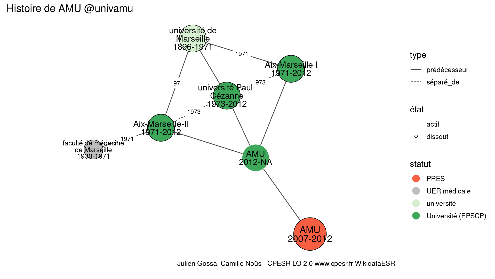 

Avertissements et édition : [logs](plots/etablissements/Q2302586.md) 

### AMU @univamu : Composition 

- url:Edition des données : https://github.com/cpesr/wikidataESR/blob/master/plots/etablissements/Q2302586.md 

 

Avertissements et édition : [logs](plots/etablissements/Q2302586.md) 

### AMU @univamu : Associations 

- url:Edition des données : https://github.com/cpesr/wikidataESR/blob/master/plots/etablissements/Q2302586.md 


Erreur : les données sont probablement trop partielles.
```
Error in ans[npos] <- rep(no, length.out = len)[npos]: l'argument de remplacement est de longueur nulle

``` 

Avertissements et édition : [logs](plots/etablissements/Q2302586.md) 

### AU @univavignon : Histoire 

- url:Edition des données : https://github.com/cpesr/wikidataESR/blob/master/plots/etablissements/Q2033119.md 


Erreur : les données sont probablement trop partielles.
```
Error in wdesr_ggplot_graph(df, node_size = node_size, label_sizes = label_sizes, : Empty ESR graph: something went wrong with the graph production parameters

``` 

Avertissements et édition : [logs](plots/etablissements/Q2033119.md) 

### AU @univavignon : Composition 

- url:Edition des données : https://github.com/cpesr/wikidataESR/blob/master/plots/etablissements/Q2033119.md 

 

Avertissements et édition : [logs](plots/etablissements/Q2033119.md) 

### AU @univavignon : Associations 

- url:Edition des données : https://github.com/cpesr/wikidataESR/blob/master/plots/etablissements/Q2033119.md 


Erreur : les données sont probablement trop partielles.
```
Error in ans[npos] <- rep(no, length.out = len)[npos]: l'argument de remplacement est de longueur nulle

``` 

Avertissements et édition : [logs](plots/etablissements/Q2033119.md) 

### CU de Mayotte NA : Histoire 

- url:Edition des données : https://github.com/cpesr/wikidataESR/blob/master/plots/etablissements/Q2946102.md 


Erreur : les données sont probablement trop partielles.
```
Error in wdesr_ggplot_graph(df, node_size = node_size, label_sizes = label_sizes, : Empty ESR graph: something went wrong with the graph production parameters

``` 

Avertissements et édition : [logs](plots/etablissements/Q2946102.md) 

### CU de Mayotte NA : Composition 

- url:Edition des données : https://github.com/cpesr/wikidataESR/blob/master/plots/etablissements/Q2946102.md 


Erreur : les données sont probablement trop partielles.
```
Error in wdesr_ggplot_graph(df, node_size = node_size, label_sizes = label_sizes, : Empty ESR graph: something went wrong with the graph production parameters

``` 

Avertissements et édition : [logs](plots/etablissements/Q2946102.md) 

### CU de Mayotte NA : Associations 

- url:Edition des données : https://github.com/cpesr/wikidataESR/blob/master/plots/etablissements/Q2946102.md 


Erreur : les données sont probablement trop partielles.
```
Error in wdesr_ggplot_graph(df, node_size = node_size, label_sizes = label_sizes, : Empty ESR graph: something went wrong with the graph production parameters

``` 

Avertissements et édition : [logs](plots/etablissements/Q2946102.md) 

### CY @UniversiteCergy : Histoire 

- url:Edition des données : https://github.com/cpesr/wikidataESR/blob/master/plots/etablissements/Q74452784.md 

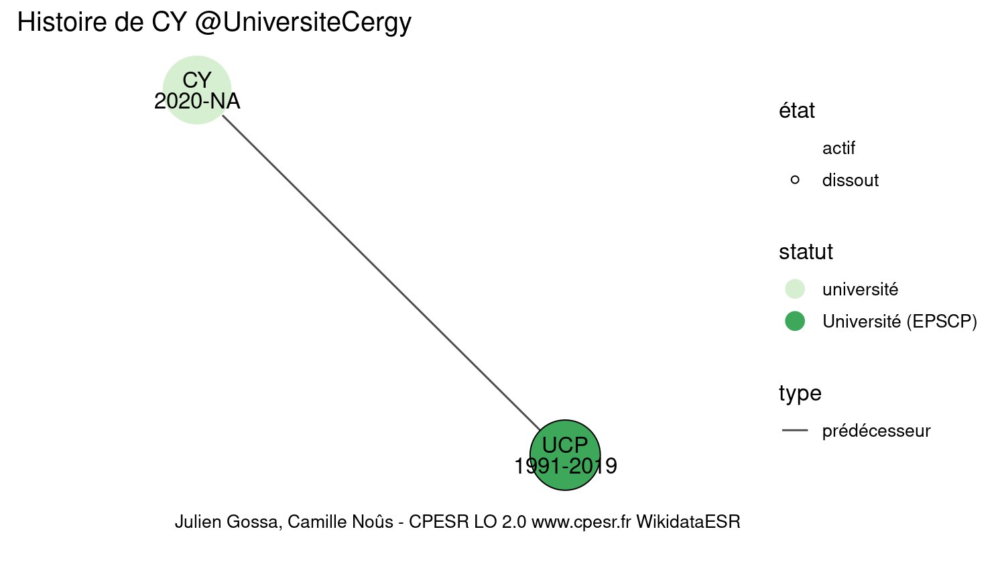 

Avertissements et édition : [logs](plots/etablissements/Q74452784.md) 

### CY @UniversiteCergy : Composition 

- url:Edition des données : https://github.com/cpesr/wikidataESR/blob/master/plots/etablissements/Q74452784.md 

 

Avertissements et édition : [logs](plots/etablissements/Q74452784.md) 

### CY @UniversiteCergy : Associations 

- url:Edition des données : https://github.com/cpesr/wikidataESR/blob/master/plots/etablissements/Q74452784.md 

 

Avertissements et édition : [logs](plots/etablissements/Q74452784.md) 

### La Rochelle Université @UnivLaRochelle : Histoire 

- url:Edition des données : https://github.com/cpesr/wikidataESR/blob/master/plots/etablissements/Q1500822.md 

 

Avertissements et édition : [logs](plots/etablissements/Q1500822.md) 

### La Rochelle Université @UnivLaRochelle : Composition 

- url:Edition des données : https://github.com/cpesr/wikidataESR/blob/master/plots/etablissements/Q1500822.md 

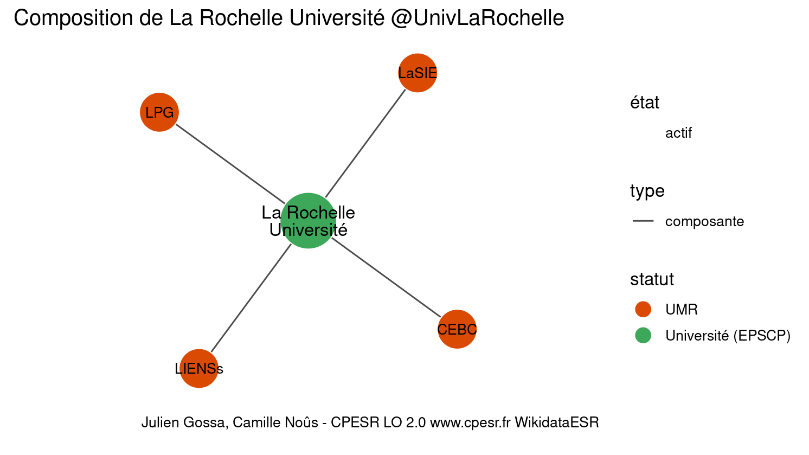 

Avertissements et édition : [logs](plots/etablissements/Q1500822.md) 

### La Rochelle Université @UnivLaRochelle : Associations 

- url:Edition des données : https://github.com/cpesr/wikidataESR/blob/master/plots/etablissements/Q1500822.md 


Erreur : les données sont probablement trop partielles.
```
Error in wdesr_ggplot_graph(df, node_size = node_size, label_sizes = label_sizes, : Empty ESR graph: something went wrong with the graph production parameters

``` 

Avertissements et édition : [logs](plots/etablissements/Q1500822.md) 

### LMU @LeMansUniv : Histoire 

- url:Edition des données : https://github.com/cpesr/wikidataESR/blob/master/plots/etablissements/Q834825.md 


Erreur : les données sont probablement trop partielles.
```
Error in wdesr_ggplot_graph(df, node_size = node_size, label_sizes = label_sizes, : Empty ESR graph: something went wrong with the graph production parameters

``` 

Avertissements et édition : [logs](plots/etablissements/Q834825.md) 

### LMU @LeMansUniv : Composition 

- url:Edition des données : https://github.com/cpesr/wikidataESR/blob/master/plots/etablissements/Q834825.md 

 

Avertissements et édition : [logs](plots/etablissements/Q834825.md) 

### LMU @LeMansUniv : Associations 

- url:Edition des données : https://github.com/cpesr/wikidataESR/blob/master/plots/etablissements/Q834825.md 


Erreur : les données sont probablement trop partielles.
```
Error in wdesr_ggplot_graph(df, node_size = node_size, label_sizes = label_sizes, : Empty ESR graph: something went wrong with the graph production parameters

``` 

Avertissements et édition : [logs](plots/etablissements/Q834825.md) 

### UN @NantesUniv : Histoire 

- url:Edition des données : https://github.com/cpesr/wikidataESR/blob/master/plots/etablissements/Q259388.md 


Erreur : les données sont probablement trop partielles.
```
Error in wdesr_ggplot_graph(df, node_size = node_size, label_sizes = label_sizes, : Empty ESR graph: something went wrong with the graph production parameters

``` 

Avertissements et édition : [logs](plots/etablissements/Q259388.md) 

### UN @NantesUniv : Composition 

- url:Edition des données : https://github.com/cpesr/wikidataESR/blob/master/plots/etablissements/Q259388.md 

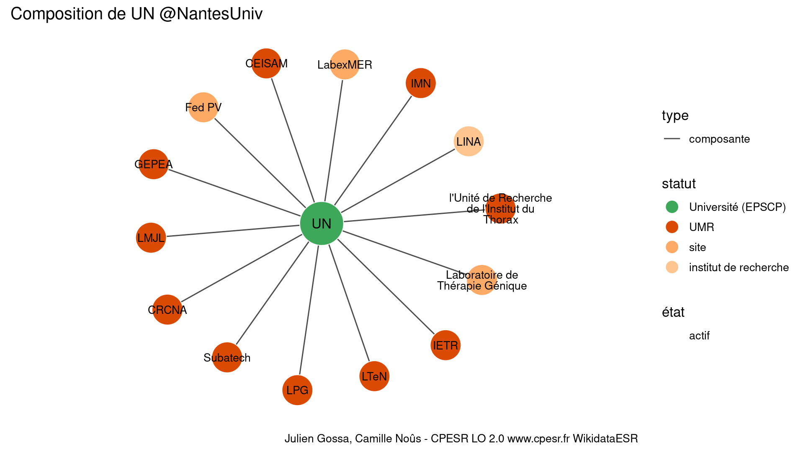 

Avertissements et édition : [logs](plots/etablissements/Q259388.md) 

### UN @NantesUniv : Associations 

- url:Edition des données : https://github.com/cpesr/wikidataESR/blob/master/plots/etablissements/Q259388.md 


Erreur : les données sont probablement trop partielles.
```
Error in wdesr_ggplot_graph(df, node_size = node_size, label_sizes = label_sizes, : Empty ESR graph: something went wrong with the graph production parameters

``` 

Avertissements et édition : [logs](plots/etablissements/Q259388.md) 

### Sorbonne U @Sorbonne_Univ_ : Histoire 

- url:Edition des données : https://github.com/cpesr/wikidataESR/blob/master/plots/etablissements/Q41497113.md 

 

Avertissements et édition : [logs](plots/etablissements/Q41497113.md) 

### Sorbonne U @Sorbonne_Univ_ : Composition 

- url:Edition des données : https://github.com/cpesr/wikidataESR/blob/master/plots/etablissements/Q41497113.md 

 

Avertissements et édition : [logs](plots/etablissements/Q41497113.md) 

### Sorbonne U @Sorbonne_Univ_ : Associations 

- url:Edition des données : https://github.com/cpesr/wikidataESR/blob/master/plots/etablissements/Q41497113.md 

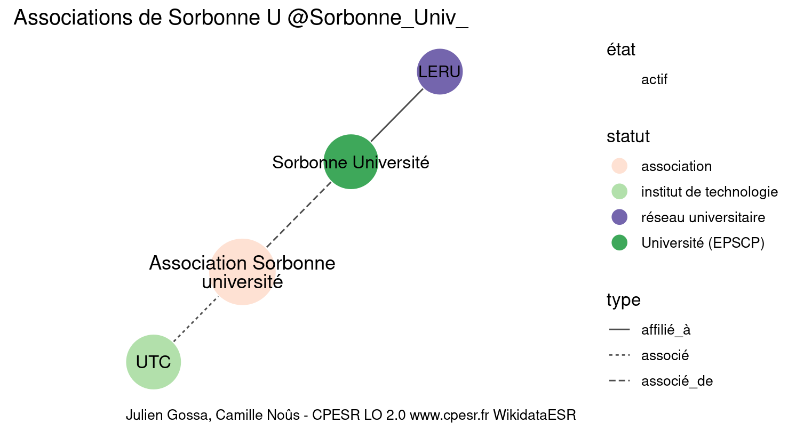 

Avertissements et édition : [logs](plots/etablissements/Q41497113.md) 

### UBM @UBMontaigne : Histoire 

- url:Edition des données : https://github.com/cpesr/wikidataESR/blob/master/plots/etablissements/Q13342.md 

 

Avertissements et édition : [logs](plots/etablissements/Q13342.md) 

### UBM @UBMontaigne : Composition 

- url:Edition des données : https://github.com/cpesr/wikidataESR/blob/master/plots/etablissements/Q13342.md 

 

Avertissements et édition : [logs](plots/etablissements/Q13342.md) 

### UBM @UBMontaigne : Associations 

- url:Edition des données : https://github.com/cpesr/wikidataESR/blob/master/plots/etablissements/Q13342.md 


Erreur : les données sont probablement trop partielles.
```
Error in wdesr_ggplot_graph(df, node_size = node_size, label_sizes = label_sizes, : Empty ESR graph: something went wrong with the graph production parameters

``` 

Avertissements et édition : [logs](plots/etablissements/Q13342.md) 

### UBS @ubs_universite : Histoire 

- url:Edition des données : https://github.com/cpesr/wikidataESR/blob/master/plots/etablissements/Q1125958.md 


Erreur : les données sont probablement trop partielles.
```
Error in wdesr_ggplot_graph(df, node_size = node_size, label_sizes = label_sizes, : Empty ESR graph: something went wrong with the graph production parameters

``` 

Avertissements et édition : [logs](plots/etablissements/Q1125958.md) 

### UBS @ubs_universite : Composition 

- url:Edition des données : https://github.com/cpesr/wikidataESR/blob/master/plots/etablissements/Q1125958.md 

 

Avertissements et édition : [logs](plots/etablissements/Q1125958.md) 

### UBS @ubs_universite : Associations 

- url:Edition des données : https://github.com/cpesr/wikidataESR/blob/master/plots/etablissements/Q1125958.md 


Erreur : les données sont probablement trop partielles.
```
Error in wdesr_ggplot_graph(df, node_size = node_size, label_sizes = label_sizes, : Empty ESR graph: something went wrong with the graph production parameters

``` 

Avertissements et édition : [logs](plots/etablissements/Q1125958.md) 

### UCBL @UnivLyon1 : Histoire 

- url:Edition des données : https://github.com/cpesr/wikidataESR/blob/master/plots/etablissements/Q4032.md 

 

Avertissements et édition : [logs](plots/etablissements/Q4032.md) 

### UCBL @UnivLyon1 : Composition 

- url:Edition des données : https://github.com/cpesr/wikidataESR/blob/master/plots/etablissements/Q4032.md 

 

Avertissements et édition : [logs](plots/etablissements/Q4032.md) 

### UCBL @UnivLyon1 : Associations 

- url:Edition des données : https://github.com/cpesr/wikidataESR/blob/master/plots/etablissements/Q4032.md 

 

Avertissements et édition : [logs](plots/etablissements/Q4032.md) 

### UCA NA : Histoire 

- url:Edition des données : https://github.com/cpesr/wikidataESR/blob/master/plots/etablissements/Q1319786.md 

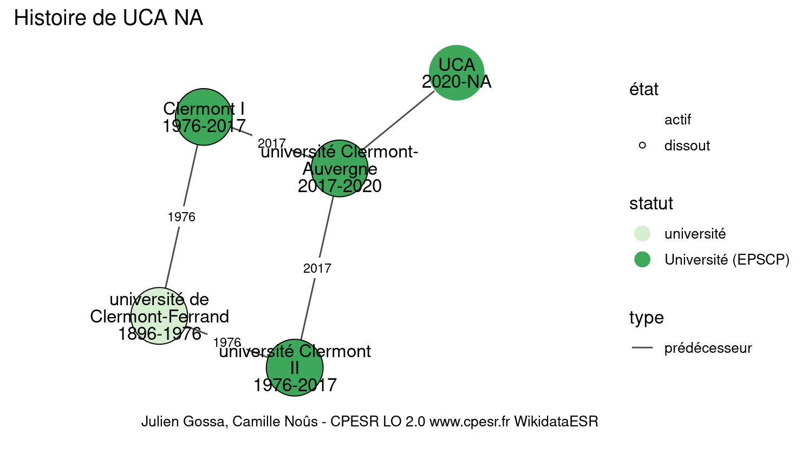 

Avertissements et édition : [logs](plots/etablissements/Q1319786.md) 

### UCA NA : Composition 

- url:Edition des données : https://github.com/cpesr/wikidataESR/blob/master/plots/etablissements/Q1319786.md 

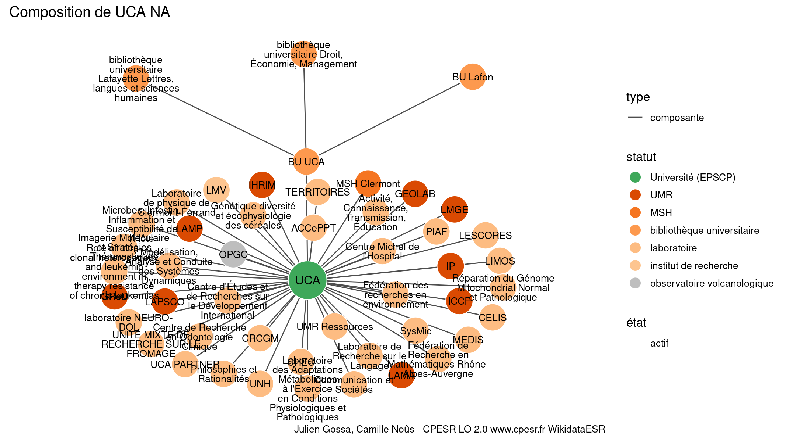 

Avertissements et édition : [logs](plots/etablissements/Q1319786.md) 

### UCA NA : Associations 

- url:Edition des données : https://github.com/cpesr/wikidataESR/blob/master/plots/etablissements/Q1319786.md 

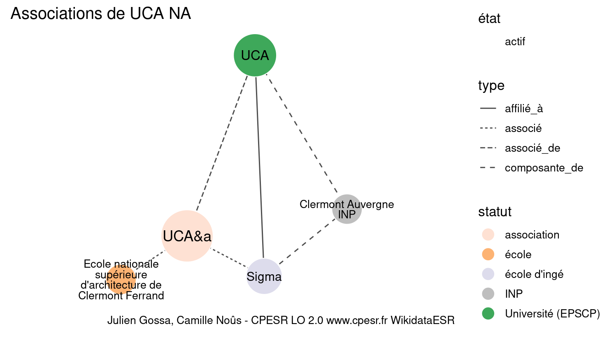 

Avertissements et édition : [logs](plots/etablissements/Q1319786.md) 

### UCA @Univ_CotedAzur : Histoire 

- url:Edition des données : https://github.com/cpesr/wikidataESR/blob/master/plots/etablissements/Q80186910.md 

 

Avertissements et édition : [logs](plots/etablissements/Q80186910.md) 

### UCA @Univ_CotedAzur : Composition 

- url:Edition des données : https://github.com/cpesr/wikidataESR/blob/master/plots/etablissements/Q80186910.md 

 

Avertissements et édition : [logs](plots/etablissements/Q80186910.md) 

### UCA @Univ_CotedAzur : Associations 

- url:Edition des données : https://github.com/cpesr/wikidataESR/blob/master/plots/etablissements/Q80186910.md 

 

Avertissements et édition : [logs](plots/etablissements/Q80186910.md) 

### U. Angers @UnivAngers : Histoire 

- url:Edition des données : https://github.com/cpesr/wikidataESR/blob/master/plots/etablissements/Q1538727.md 


Erreur : les données sont probablement trop partielles.
```
Error in wdesr_ggplot_graph(df, node_size = node_size, label_sizes = label_sizes, : Empty ESR graph: something went wrong with the graph production parameters

``` 

Avertissements et édition : [logs](plots/etablissements/Q1538727.md) 

### U. Angers @UnivAngers : Composition 

- url:Edition des données : https://github.com/cpesr/wikidataESR/blob/master/plots/etablissements/Q1538727.md 

 

Avertissements et édition : [logs](plots/etablissements/Q1538727.md) 

### U. Angers @UnivAngers : Associations 

- url:Edition des données : https://github.com/cpesr/wikidataESR/blob/master/plots/etablissements/Q1538727.md 


Erreur : les données sont probablement trop partielles.
```
Error in wdesr_ggplot_graph(df, node_size = node_size, label_sizes = label_sizes, : Empty ESR graph: something went wrong with the graph production parameters

``` 

Avertissements et édition : [logs](plots/etablissements/Q1538727.md) 

### U. Artois @Univ_Artois : Histoire 

- url:Edition des données : https://github.com/cpesr/wikidataESR/blob/master/plots/etablissements/Q475504.md 


Erreur : les données sont probablement trop partielles.
```
Error in wdesr_ggplot_graph(df, node_size = node_size, label_sizes = label_sizes, : Empty ESR graph: something went wrong with the graph production parameters

``` 

Avertissements et édition : [logs](plots/etablissements/Q475504.md) 

### U. Artois @Univ_Artois : Composition 

- url:Edition des données : https://github.com/cpesr/wikidataESR/blob/master/plots/etablissements/Q475504.md 


Erreur : les données sont probablement trop partielles.
```
Error in wdesr_ggplot_graph(df, node_size = node_size, label_sizes = label_sizes, : Empty ESR graph: something went wrong with the graph production parameters

``` 

Avertissements et édition : [logs](plots/etablissements/Q475504.md) 

### U. Artois @Univ_Artois : Associations 

- url:Edition des données : https://github.com/cpesr/wikidataESR/blob/master/plots/etablissements/Q475504.md 


Erreur : les données sont probablement trop partielles.
```
Error in wdesr_ggplot_graph(df, node_size = node_size, label_sizes = label_sizes, : Empty ESR graph: something went wrong with the graph production parameters

``` 

Avertissements et édition : [logs](plots/etablissements/Q475504.md) 

### UEVE @UnivEvry : Histoire 

- url:Edition des données : https://github.com/cpesr/wikidataESR/blob/master/plots/etablissements/Q1531014.md 


Erreur : les données sont probablement trop partielles.
```
Error in wdesr_ggplot_graph(df, node_size = node_size, label_sizes = label_sizes, : Empty ESR graph: something went wrong with the graph production parameters

``` 

Avertissements et édition : [logs](plots/etablissements/Q1531014.md) 

### UEVE @UnivEvry : Composition 

- url:Edition des données : https://github.com/cpesr/wikidataESR/blob/master/plots/etablissements/Q1531014.md 

 

Avertissements et édition : [logs](plots/etablissements/Q1531014.md) 

### UEVE @UnivEvry : Associations 

- url:Edition des données : https://github.com/cpesr/wikidataESR/blob/master/plots/etablissements/Q1531014.md 

 

Avertissements et édition : [logs](plots/etablissements/Q1531014.md) 

### Université d'Orléans @Univ_Orleans : Histoire 

- url:Edition des données : https://github.com/cpesr/wikidataESR/blob/master/plots/etablissements/Q13334.md 

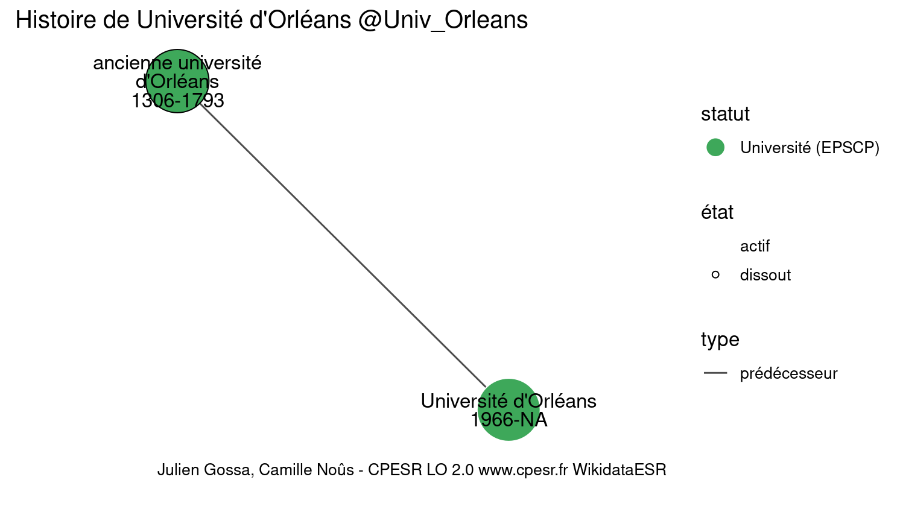 

Avertissements et édition : [logs](plots/etablissements/Q13334.md) 

### Université d'Orléans @Univ_Orleans : Composition 

- url:Edition des données : https://github.com/cpesr/wikidataESR/blob/master/plots/etablissements/Q13334.md 

 

Avertissements et édition : [logs](plots/etablissements/Q13334.md) 

### Université d'Orléans @Univ_Orleans : Associations 

- url:Edition des données : https://github.com/cpesr/wikidataESR/blob/master/plots/etablissements/Q13334.md 


Erreur : les données sont probablement trop partielles.
```
Error in wdesr_ggplot_graph(df, node_size = node_size, label_sizes = label_sizes, : Empty ESR graph: something went wrong with the graph production parameters

``` 

Avertissements et édition : [logs](plots/etablissements/Q13334.md) 

### UBx @univbordeaux : Histoire 

- url:Edition des données : https://github.com/cpesr/wikidataESR/blob/master/plots/etablissements/Q13344.md 

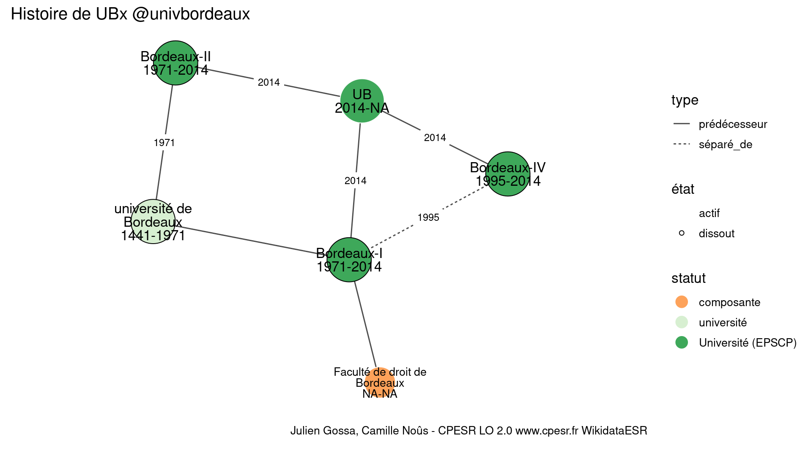 

Avertissements et édition : [logs](plots/etablissements/Q13344.md) 

### UBx @univbordeaux : Composition 

- url:Edition des données : https://github.com/cpesr/wikidataESR/blob/master/plots/etablissements/Q13344.md 

 

Avertissements et édition : [logs](plots/etablissements/Q13344.md) 

### UBx @univbordeaux : Associations 

- url:Edition des données : https://github.com/cpesr/wikidataESR/blob/master/plots/etablissements/Q13344.md 

 

Avertissements et édition : [logs](plots/etablissements/Q13344.md) 

### uB @univbourgogne : Histoire 

- url:Edition des données : https://github.com/cpesr/wikidataESR/blob/master/plots/etablissements/Q287072.md 


Erreur : les données sont probablement trop partielles.
```
Error in wdesr_ggplot_graph(df, node_size = node_size, label_sizes = label_sizes, : Empty ESR graph: something went wrong with the graph production parameters

``` 

Avertissements et édition : [logs](plots/etablissements/Q287072.md) 

### uB @univbourgogne : Composition 

- url:Edition des données : https://github.com/cpesr/wikidataESR/blob/master/plots/etablissements/Q287072.md 

 

Avertissements et édition : [logs](plots/etablissements/Q287072.md) 

### uB @univbourgogne : Associations 

- url:Edition des données : https://github.com/cpesr/wikidataESR/blob/master/plots/etablissements/Q287072.md 

 

Avertissements et édition : [logs](plots/etablissements/Q287072.md) 

### UBO @UBO_UnivBrest : Histoire 

- url:Edition des données : https://github.com/cpesr/wikidataESR/blob/master/plots/etablissements/Q1857334.md 


Erreur : les données sont probablement trop partielles.
```
Error in wdesr_ggplot_graph(df, node_size = node_size, label_sizes = label_sizes, : Empty ESR graph: something went wrong with the graph production parameters

``` 

Avertissements et édition : [logs](plots/etablissements/Q1857334.md) 

### UBO @UBO_UnivBrest : Composition 

- url:Edition des données : https://github.com/cpesr/wikidataESR/blob/master/plots/etablissements/Q1857334.md 

 

Avertissements et édition : [logs](plots/etablissements/Q1857334.md) 

### UBO @UBO_UnivBrest : Associations 

- url:Edition des données : https://github.com/cpesr/wikidataESR/blob/master/plots/etablissements/Q1857334.md 


Erreur : les données sont probablement trop partielles.
```
Error in wdesr_ggplot_graph(df, node_size = node_size, label_sizes = label_sizes, : Empty ESR graph: something went wrong with the graph production parameters

``` 

Avertissements et édition : [logs](plots/etablissements/Q1857334.md) 

### UNICAEN @universite_caen : Histoire 

- url:Edition des données : https://github.com/cpesr/wikidataESR/blob/master/plots/etablissements/Q568554.md 


Erreur : les données sont probablement trop partielles.
```
Error in wdesr_ggplot_graph(df, node_size = node_size, label_sizes = label_sizes, : Empty ESR graph: something went wrong with the graph production parameters

``` 

Avertissements et édition : [logs](plots/etablissements/Q568554.md) 

### UNICAEN @universite_caen : Composition 

- url:Edition des données : https://github.com/cpesr/wikidataESR/blob/master/plots/etablissements/Q568554.md 

 

Avertissements et édition : [logs](plots/etablissements/Q568554.md) 

### UNICAEN @universite_caen : Associations 

- url:Edition des données : https://github.com/cpesr/wikidataESR/blob/master/plots/etablissements/Q568554.md 

 

Avertissements et édition : [logs](plots/etablissements/Q568554.md) 

### université de Corse @univcorse : Histoire 

- url:Edition des données : https://github.com/cpesr/wikidataESR/blob/master/plots/etablissements/Q335841.md 


Erreur : les données sont probablement trop partielles.
```
Error in wdesr_ggplot_graph(df, node_size = node_size, label_sizes = label_sizes, : Empty ESR graph: something went wrong with the graph production parameters

``` 

Avertissements et édition : [logs](plots/etablissements/Q335841.md) 

### université de Corse @univcorse : Composition 

- url:Edition des données : https://github.com/cpesr/wikidataESR/blob/master/plots/etablissements/Q335841.md 


Erreur : les données sont probablement trop partielles.
```
Error in wdesr_ggplot_graph(df, node_size = node_size, label_sizes = label_sizes, : Empty ESR graph: something went wrong with the graph production parameters

``` 

Avertissements et édition : [logs](plots/etablissements/Q335841.md) 

### université de Corse @univcorse : Associations 

- url:Edition des données : https://github.com/cpesr/wikidataESR/blob/master/plots/etablissements/Q335841.md 


Erreur : les données sont probablement trop partielles.
```
Error in wdesr_ggplot_graph(df, node_size = node_size, label_sizes = label_sizes, : Empty ESR graph: something went wrong with the graph production parameters

``` 

Avertissements et édition : [logs](plots/etablissements/Q335841.md) 

### UFC @fc_univ : Histoire 

- url:Edition des données : https://github.com/cpesr/wikidataESR/blob/master/plots/etablissements/Q829449.md 


Erreur : les données sont probablement trop partielles.
```
Error in wdesr_ggplot_graph(df, node_size = node_size, label_sizes = label_sizes, : Empty ESR graph: something went wrong with the graph production parameters

``` 

Avertissements et édition : [logs](plots/etablissements/Q829449.md) 

### UFC @fc_univ : Composition 

- url:Edition des données : https://github.com/cpesr/wikidataESR/blob/master/plots/etablissements/Q829449.md 

 

Avertissements et édition : [logs](plots/etablissements/Q829449.md) 

### UFC @fc_univ : Associations 

- url:Edition des données : https://github.com/cpesr/wikidataESR/blob/master/plots/etablissements/Q829449.md 

 

Avertissements et édition : [logs](plots/etablissements/Q829449.md) 

### Université de Guyane @univguyane : Histoire 

- url:Edition des données : https://github.com/cpesr/wikidataESR/blob/master/plots/etablissements/Q16682067.md 


Erreur : les données sont probablement trop partielles.
```
Error in wdesr_ggplot_graph(df, node_size = node_size, label_sizes = label_sizes, : Empty ESR graph: something went wrong with the graph production parameters

``` 

Avertissements et édition : [logs](plots/etablissements/Q16682067.md) 

### Université de Guyane @univguyane : Composition 

- url:Edition des données : https://github.com/cpesr/wikidataESR/blob/master/plots/etablissements/Q16682067.md 

 

Avertissements et édition : [logs](plots/etablissements/Q16682067.md) 

### Université de Guyane @univguyane : Associations 

- url:Edition des données : https://github.com/cpesr/wikidataESR/blob/master/plots/etablissements/Q16682067.md 


Erreur : les données sont probablement trop partielles.
```
Error in wdesr_ggplot_graph(df, node_size = node_size, label_sizes = label_sizes, : Empty ESR graph: something went wrong with the graph production parameters

``` 

Avertissements et édition : [logs](plots/etablissements/Q16682067.md) 

### UHA @UHA68 : Histoire 

- url:Edition des données : https://github.com/cpesr/wikidataESR/blob/master/plots/etablissements/Q280183.md 


Erreur : les données sont probablement trop partielles.
```
Error in wdesr_ggplot_graph(df, node_size = node_size, label_sizes = label_sizes, : Empty ESR graph: something went wrong with the graph production parameters

``` 

Avertissements et édition : [logs](plots/etablissements/Q280183.md) 

### UHA @UHA68 : Composition 

- url:Edition des données : https://github.com/cpesr/wikidataESR/blob/master/plots/etablissements/Q280183.md 

 

Avertissements et édition : [logs](plots/etablissements/Q280183.md) 

### UHA @UHA68 : Associations 

- url:Edition des données : https://github.com/cpesr/wikidataESR/blob/master/plots/etablissements/Q280183.md 

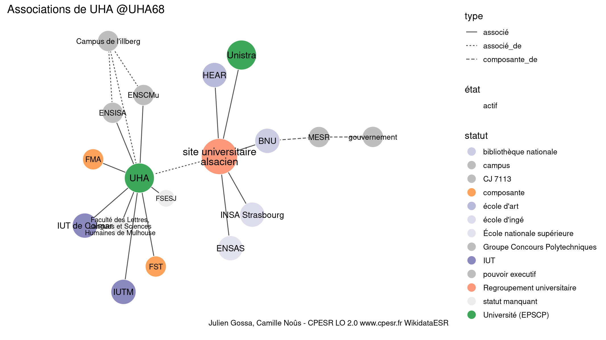 

Avertissements et édition : [logs](plots/etablissements/Q280183.md) 

### Université de la Nouvelle-Calédonie @unc_nc : Histoire 

- url:Edition des données : https://github.com/cpesr/wikidataESR/blob/master/plots/etablissements/Q734332.md 


Erreur : les données sont probablement trop partielles.
```
Error in wdesr_ggplot_graph(df, node_size = node_size, label_sizes = label_sizes, : Empty ESR graph: something went wrong with the graph production parameters

``` 

Avertissements et édition : [logs](plots/etablissements/Q734332.md) 

### Université de la Nouvelle-Calédonie @unc_nc : Composition 

- url:Edition des données : https://github.com/cpesr/wikidataESR/blob/master/plots/etablissements/Q734332.md 

 

Avertissements et édition : [logs](plots/etablissements/Q734332.md) 

### Université de la Nouvelle-Calédonie @unc_nc : Associations 

- url:Edition des données : https://github.com/cpesr/wikidataESR/blob/master/plots/etablissements/Q734332.md 


Erreur : les données sont probablement trop partielles.
```
Error in wdesr_ggplot_graph(df, node_size = node_size, label_sizes = label_sizes, : Empty ESR graph: something went wrong with the graph production parameters

``` 

Avertissements et édition : [logs](plots/etablissements/Q734332.md) 

### UPF @univpf : Histoire 

- url:Edition des données : https://github.com/cpesr/wikidataESR/blob/master/plots/etablissements/Q1695245.md 


Erreur : les données sont probablement trop partielles.
```
Error in wdesr_ggplot_graph(df, node_size = node_size, label_sizes = label_sizes, : Empty ESR graph: something went wrong with the graph production parameters

``` 

Avertissements et édition : [logs](plots/etablissements/Q1695245.md) 

### UPF @univpf : Composition 

- url:Edition des données : https://github.com/cpesr/wikidataESR/blob/master/plots/etablissements/Q1695245.md 


Erreur : les données sont probablement trop partielles.
```
Error in wdesr_ggplot_graph(df, node_size = node_size, label_sizes = label_sizes, : Empty ESR graph: something went wrong with the graph production parameters

``` 

Avertissements et édition : [logs](plots/etablissements/Q1695245.md) 

### UPF @univpf : Associations 

- url:Edition des données : https://github.com/cpesr/wikidataESR/blob/master/plots/etablissements/Q1695245.md 


Erreur : les données sont probablement trop partielles.
```
Error in wdesr_ggplot_graph(df, node_size = node_size, label_sizes = label_sizes, : Empty ESR graph: something went wrong with the graph production parameters

``` 

Avertissements et édition : [logs](plots/etablissements/Q1695245.md) 

### UFOI @univ_reunion : Histoire 

- url:Edition des données : https://github.com/cpesr/wikidataESR/blob/master/plots/etablissements/Q834819.md 


Erreur : les données sont probablement trop partielles.
```
Error in wdesr_ggplot_graph(df, node_size = node_size, label_sizes = label_sizes, : Empty ESR graph: something went wrong with the graph production parameters

``` 

Avertissements et édition : [logs](plots/etablissements/Q834819.md) 

### UFOI @univ_reunion : Composition 

- url:Edition des données : https://github.com/cpesr/wikidataESR/blob/master/plots/etablissements/Q834819.md 

 

Avertissements et édition : [logs](plots/etablissements/Q834819.md) 

### UFOI @univ_reunion : Associations 

- url:Edition des données : https://github.com/cpesr/wikidataESR/blob/master/plots/etablissements/Q834819.md 


Erreur : les données sont probablement trop partielles.
```
Error in wdesr_ggplot_graph(df, node_size = node_size, label_sizes = label_sizes, : Empty ESR graph: something went wrong with the graph production parameters

``` 

Avertissements et édition : [logs](plots/etablissements/Q834819.md) 

### UDL NA : Histoire 

- url:Edition des données : https://github.com/cpesr/wikidataESR/blob/master/plots/etablissements/Q3551621.md 


Erreur : les données sont probablement trop partielles.
```
Error in wdesr_ggplot_graph(df, node_size = node_size, label_sizes = label_sizes, : Empty ESR graph: something went wrong with the graph production parameters

``` 

Avertissements et édition : [logs](plots/etablissements/Q3551621.md) 

### UDL NA : Composition 

- url:Edition des données : https://github.com/cpesr/wikidataESR/blob/master/plots/etablissements/Q3551621.md 


Erreur : les données sont probablement trop partielles.
```
Error in wdesr_ggplot_graph(df, node_size = node_size, label_sizes = label_sizes, : Empty ESR graph: something went wrong with the graph production parameters

``` 

Avertissements et édition : [logs](plots/etablissements/Q3551621.md) 

### UDL NA : Associations 

- url:Edition des données : https://github.com/cpesr/wikidataESR/blob/master/plots/etablissements/Q3551621.md 


Erreur : les données sont probablement trop partielles.
```
Error in wdesr_ggplot_graph(df, node_size = node_size, label_sizes = label_sizes, : Empty ESR graph: something went wrong with the graph production parameters

``` 

Avertissements et édition : [logs](plots/etablissements/Q3551621.md) 

### Unilim @unilim : Histoire 

- url:Edition des données : https://github.com/cpesr/wikidataESR/blob/master/plots/etablissements/Q2661290.md 


Erreur : les données sont probablement trop partielles.
```
Error in wdesr_ggplot_graph(df, node_size = node_size, label_sizes = label_sizes, : Empty ESR graph: something went wrong with the graph production parameters

``` 

Avertissements et édition : [logs](plots/etablissements/Q2661290.md) 

### Unilim @unilim : Composition 

- url:Edition des données : https://github.com/cpesr/wikidataESR/blob/master/plots/etablissements/Q2661290.md 

 

Avertissements et édition : [logs](plots/etablissements/Q2661290.md) 

### Unilim @unilim : Associations 

- url:Edition des données : https://github.com/cpesr/wikidataESR/blob/master/plots/etablissements/Q2661290.md 


Erreur : les données sont probablement trop partielles.
```
Error in wdesr_ggplot_graph(df, node_size = node_size, label_sizes = label_sizes, : Empty ESR graph: something went wrong with the graph production parameters

``` 

Avertissements et édition : [logs](plots/etablissements/Q2661290.md) 

### université de Lorraine @Univ_Lorraine : Histoire 

- url:Edition des données : https://github.com/cpesr/wikidataESR/blob/master/plots/etablissements/Q4173330.md 

 

Avertissements et édition : [logs](plots/etablissements/Q4173330.md) 

### université de Lorraine @Univ_Lorraine : Composition 

- url:Edition des données : https://github.com/cpesr/wikidataESR/blob/master/plots/etablissements/Q4173330.md 

 

Avertissements et édition : [logs](plots/etablissements/Q4173330.md) 

### université de Lorraine @Univ_Lorraine : Associations 

- url:Edition des données : https://github.com/cpesr/wikidataESR/blob/master/plots/etablissements/Q4173330.md 

 

Avertissements et édition : [logs](plots/etablissements/Q4173330.md) 

### Université de Montpellier NA : Histoire 

- url:Edition des données : https://github.com/cpesr/wikidataESR/blob/master/plots/etablissements/Q776223.md 

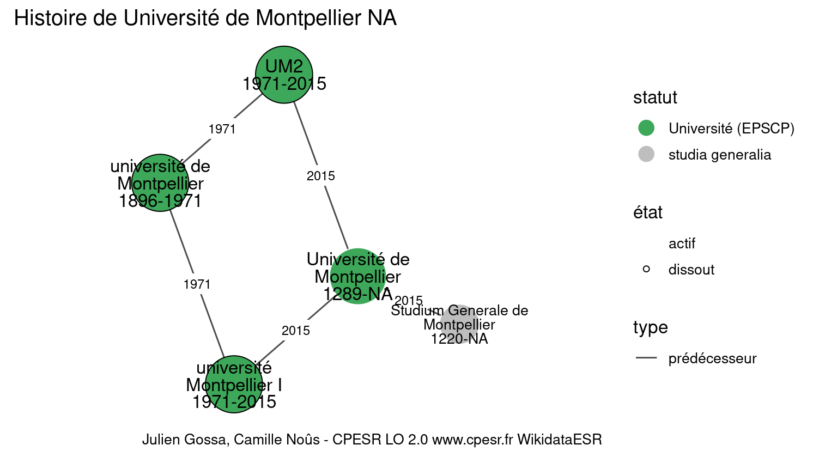 

Avertissements et édition : [logs](plots/etablissements/Q776223.md) 

### Université de Montpellier NA : Composition 

- url:Edition des données : https://github.com/cpesr/wikidataESR/blob/master/plots/etablissements/Q776223.md 

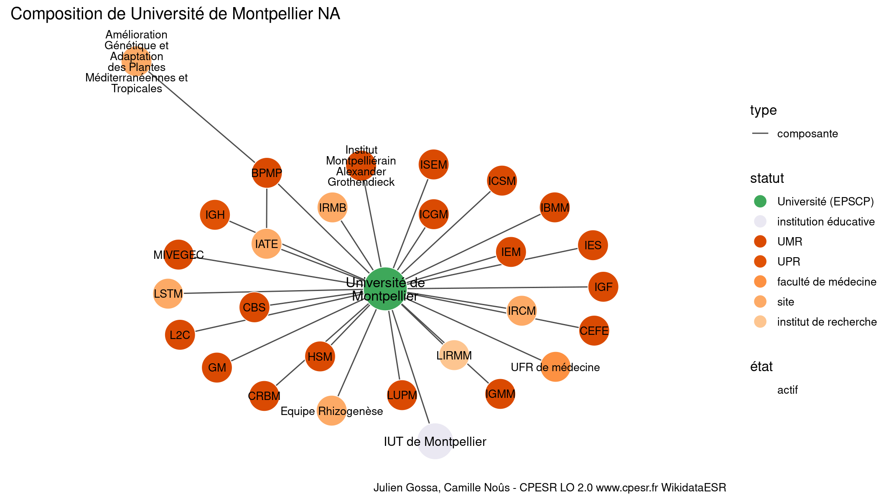 

Avertissements et édition : [logs](plots/etablissements/Q776223.md) 

### Université de Montpellier NA : Associations 

- url:Edition des données : https://github.com/cpesr/wikidataESR/blob/master/plots/etablissements/Q776223.md 

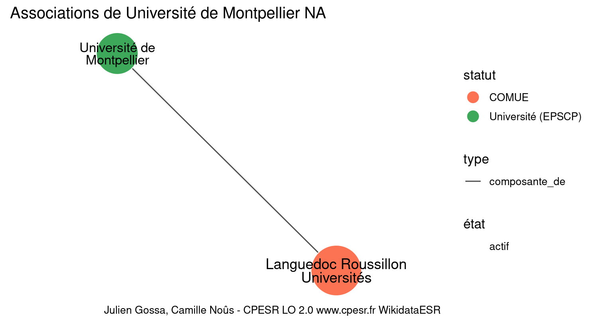 

Avertissements et édition : [logs](plots/etablissements/Q776223.md) 

### UNÎMES @unimesfr : Histoire 

- url:Edition des données : https://github.com/cpesr/wikidataESR/blob/master/plots/etablissements/Q2496121.md 


Erreur : les données sont probablement trop partielles.
```
Error in wdesr_ggplot_graph(df, node_size = node_size, label_sizes = label_sizes, : Empty ESR graph: something went wrong with the graph production parameters

``` 

Avertissements et édition : [logs](plots/etablissements/Q2496121.md) 

### UNÎMES @unimesfr : Composition 

- url:Edition des données : https://github.com/cpesr/wikidataESR/blob/master/plots/etablissements/Q2496121.md 

 

Avertissements et édition : [logs](plots/etablissements/Q2496121.md) 

### UNÎMES @unimesfr : Associations 

- url:Edition des données : https://github.com/cpesr/wikidataESR/blob/master/plots/etablissements/Q2496121.md 

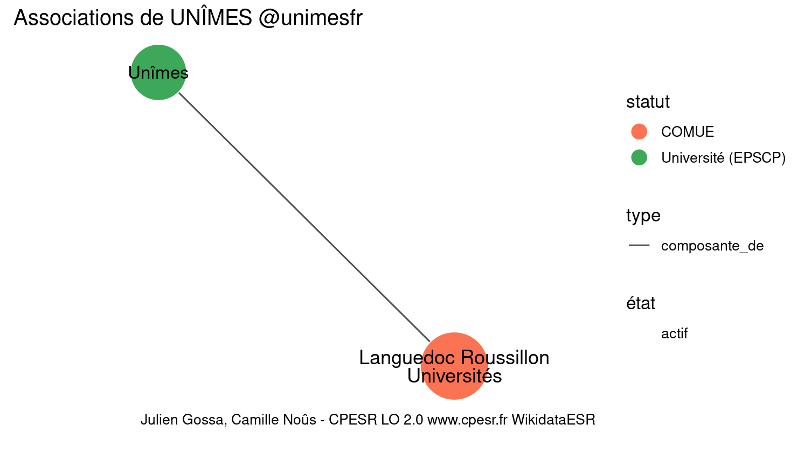 

Avertissements et édition : [logs](plots/etablissements/Q2496121.md) 

### UPC @Univ_Paris : Histoire 

- url:Edition des données : https://github.com/cpesr/wikidataESR/blob/master/plots/etablissements/Q55849612.md 

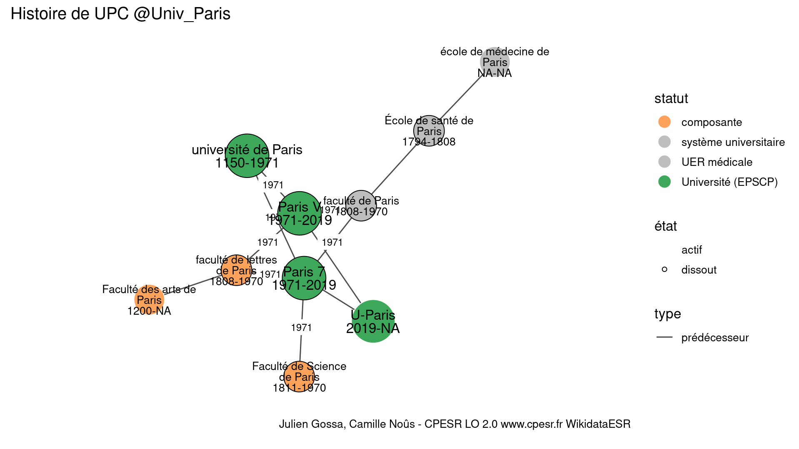 

Avertissements et édition : [logs](plots/etablissements/Q55849612.md) 

### UPC @Univ_Paris : Composition 

- url:Edition des données : https://github.com/cpesr/wikidataESR/blob/master/plots/etablissements/Q55849612.md 

 

Avertissements et édition : [logs](plots/etablissements/Q55849612.md) 

### UPC @Univ_Paris : Associations 

- url:Edition des données : https://github.com/cpesr/wikidataESR/blob/master/plots/etablissements/Q55849612.md 


Erreur : les données sont probablement trop partielles.
```
Error in ans[npos] <- rep(no, length.out = len)[npos]: l'argument de remplacement est de longueur nulle

``` 

Avertissements et édition : [logs](plots/etablissements/Q55849612.md) 

### UPPA @universite_uppa : Histoire 

- url:Edition des données : https://github.com/cpesr/wikidataESR/blob/master/plots/etablissements/Q572968.md 


Erreur : les données sont probablement trop partielles.
```
Error in wdesr_ggplot_graph(df, node_size = node_size, label_sizes = label_sizes, : Empty ESR graph: something went wrong with the graph production parameters

``` 

Avertissements et édition : [logs](plots/etablissements/Q572968.md) 

### UPPA @universite_uppa : Composition 

- url:Edition des données : https://github.com/cpesr/wikidataESR/blob/master/plots/etablissements/Q572968.md 

 

Avertissements et édition : [logs](plots/etablissements/Q572968.md) 

### UPPA @universite_uppa : Associations 

- url:Edition des données : https://github.com/cpesr/wikidataESR/blob/master/plots/etablissements/Q572968.md 


Erreur : les données sont probablement trop partielles.
```
Error in wdesr_ggplot_graph(df, node_size = node_size, label_sizes = label_sizes, : Empty ESR graph: something went wrong with the graph production parameters

``` 

Avertissements et édition : [logs](plots/etablissements/Q572968.md) 

### UPVD @upvd1 : Histoire 

- url:Edition des données : https://github.com/cpesr/wikidataESR/blob/master/plots/etablissements/Q304872.md 

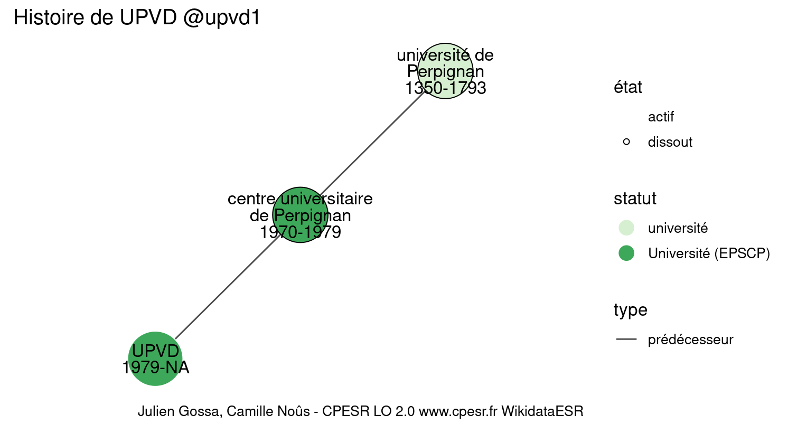 

Avertissements et édition : [logs](plots/etablissements/Q304872.md) 

### UPVD @upvd1 : Composition 

- url:Edition des données : https://github.com/cpesr/wikidataESR/blob/master/plots/etablissements/Q304872.md 

 

Avertissements et édition : [logs](plots/etablissements/Q304872.md) 

### UPVD @upvd1 : Associations 

- url:Edition des données : https://github.com/cpesr/wikidataESR/blob/master/plots/etablissements/Q304872.md 

 

Avertissements et édition : [logs](plots/etablissements/Q304872.md) 

### UPJV @UPJV_Univ : Histoire 

- url:Edition des données : https://github.com/cpesr/wikidataESR/blob/master/plots/etablissements/Q947747.md 


Erreur : les données sont probablement trop partielles.
```
Error in wdesr_ggplot_graph(df, node_size = node_size, label_sizes = label_sizes, : Empty ESR graph: something went wrong with the graph production parameters

``` 

Avertissements et édition : [logs](plots/etablissements/Q947747.md) 

### UPJV @UPJV_Univ : Composition 

- url:Edition des données : https://github.com/cpesr/wikidataESR/blob/master/plots/etablissements/Q947747.md 


Erreur : les données sont probablement trop partielles.
```
Error in wdesr_ggplot_graph(df, node_size = node_size, label_sizes = label_sizes, : Empty ESR graph: something went wrong with the graph production parameters

``` 

Avertissements et édition : [logs](plots/etablissements/Q947747.md) 

### UPJV @UPJV_Univ : Associations 

- url:Edition des données : https://github.com/cpesr/wikidataESR/blob/master/plots/etablissements/Q947747.md 


Erreur : les données sont probablement trop partielles.
```
Error in wdesr_ggplot_graph(df, node_size = node_size, label_sizes = label_sizes, : Empty ESR graph: something went wrong with the graph production parameters

``` 

Avertissements et édition : [logs](plots/etablissements/Q947747.md) 

### UnivPoitiers @UnivPoitiers : Histoire 

- url:Edition des données : https://github.com/cpesr/wikidataESR/blob/master/plots/etablissements/Q661056.md 


Erreur : les données sont probablement trop partielles.
```
Error in wdesr_ggplot_graph(df, node_size = node_size, label_sizes = label_sizes, : Empty ESR graph: something went wrong with the graph production parameters

``` 

Avertissements et édition : [logs](plots/etablissements/Q661056.md) 

### UnivPoitiers @UnivPoitiers : Composition 

- url:Edition des données : https://github.com/cpesr/wikidataESR/blob/master/plots/etablissements/Q661056.md 

 

Avertissements et édition : [logs](plots/etablissements/Q661056.md) 

### UnivPoitiers @UnivPoitiers : Associations 

- url:Edition des données : https://github.com/cpesr/wikidataESR/blob/master/plots/etablissements/Q661056.md 


Erreur : les données sont probablement trop partielles.
```
Error in wdesr_ggplot_graph(df, node_size = node_size, label_sizes = label_sizes, : Empty ESR graph: something went wrong with the graph production parameters

``` 

Avertissements et édition : [logs](plots/etablissements/Q661056.md) 

### URCA @universitereims : Histoire 

- url:Edition des données : https://github.com/cpesr/wikidataESR/blob/master/plots/etablissements/Q2496149.md 


Erreur : les données sont probablement trop partielles.
```
Error in wdesr_ggplot_graph(df, node_size = node_size, label_sizes = label_sizes, : Empty ESR graph: something went wrong with the graph production parameters

``` 

Avertissements et édition : [logs](plots/etablissements/Q2496149.md) 

### URCA @universitereims : Composition 

- url:Edition des données : https://github.com/cpesr/wikidataESR/blob/master/plots/etablissements/Q2496149.md 

 

Avertissements et édition : [logs](plots/etablissements/Q2496149.md) 

### URCA @universitereims : Associations 

- url:Edition des données : https://github.com/cpesr/wikidataESR/blob/master/plots/etablissements/Q2496149.md 

 

Avertissements et édition : [logs](plots/etablissements/Q2496149.md) 

### UR1 @UnivRennes1 : Histoire 

- url:Edition des données : https://github.com/cpesr/wikidataESR/blob/master/plots/etablissements/Q726595.md 

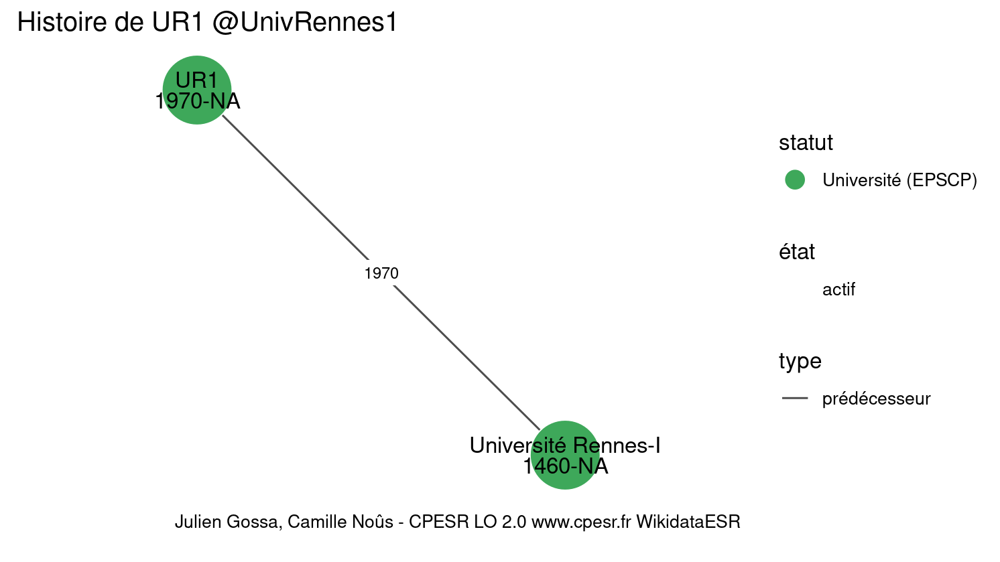 

Avertissements et édition : [logs](plots/etablissements/Q726595.md) 

### UR1 @UnivRennes1 : Composition 

- url:Edition des données : https://github.com/cpesr/wikidataESR/blob/master/plots/etablissements/Q726595.md 

 

Avertissements et édition : [logs](plots/etablissements/Q726595.md) 

### UR1 @UnivRennes1 : Associations 

- url:Edition des données : https://github.com/cpesr/wikidataESR/blob/master/plots/etablissements/Q726595.md 


Erreur : les données sont probablement trop partielles.
```
Error in wdesr_ggplot_graph(df, node_size = node_size, label_sizes = label_sizes, : Empty ESR graph: something went wrong with the graph production parameters

``` 

Avertissements et édition : [logs](plots/etablissements/Q726595.md) 

### URN NA : Histoire 

- url:Edition des données : https://github.com/cpesr/wikidataESR/blob/master/plots/etablissements/Q494247.md 


Erreur : les données sont probablement trop partielles.
```
Error in wdesr_ggplot_graph(df, node_size = node_size, label_sizes = label_sizes, : Empty ESR graph: something went wrong with the graph production parameters

``` 

Avertissements et édition : [logs](plots/etablissements/Q494247.md) 

### URN NA : Composition 

- url:Edition des données : https://github.com/cpesr/wikidataESR/blob/master/plots/etablissements/Q494247.md 

 

Avertissements et édition : [logs](plots/etablissements/Q494247.md) 

### URN NA : Associations 

- url:Edition des données : https://github.com/cpesr/wikidataESR/blob/master/plots/etablissements/Q494247.md 

 

Avertissements et édition : [logs](plots/etablissements/Q494247.md) 

### Unistra @unistra : Histoire 

- url:Edition des données : https://github.com/cpesr/wikidataESR/blob/master/plots/etablissements/Q157575.md 

 

Avertissements et édition : [logs](plots/etablissements/Q157575.md) 

### Unistra @unistra : Composition 

- url:Edition des données : https://github.com/cpesr/wikidataESR/blob/master/plots/etablissements/Q157575.md 

 

Avertissements et édition : [logs](plots/etablissements/Q157575.md) 

### Unistra @unistra : Associations 

- url:Edition des données : https://github.com/cpesr/wikidataESR/blob/master/plots/etablissements/Q157575.md 

 

Avertissements et édition : [logs](plots/etablissements/Q157575.md) 

### Ustv @univtoulon : Histoire 

- url:Edition des données : https://github.com/cpesr/wikidataESR/blob/master/plots/etablissements/Q1816857.md 


Erreur : les données sont probablement trop partielles.
```
Error in wdesr_ggplot_graph(df, node_size = node_size, label_sizes = label_sizes, : Empty ESR graph: something went wrong with the graph production parameters

``` 

Avertissements et édition : [logs](plots/etablissements/Q1816857.md) 

### Ustv @univtoulon : Composition 

- url:Edition des données : https://github.com/cpesr/wikidataESR/blob/master/plots/etablissements/Q1816857.md 

 

Avertissements et édition : [logs](plots/etablissements/Q1816857.md) 

### Ustv @univtoulon : Associations 

- url:Edition des données : https://github.com/cpesr/wikidataESR/blob/master/plots/etablissements/Q1816857.md 


Erreur : les données sont probablement trop partielles.
```
Error in ans[npos] <- rep(no, length.out = len)[npos]: l'argument de remplacement est de longueur nulle

``` 

Avertissements et édition : [logs](plots/etablissements/Q1816857.md) 

### université de Tours @UnivTours : Histoire 

- url:Edition des données : https://github.com/cpesr/wikidataESR/blob/master/plots/etablissements/Q494335.md 

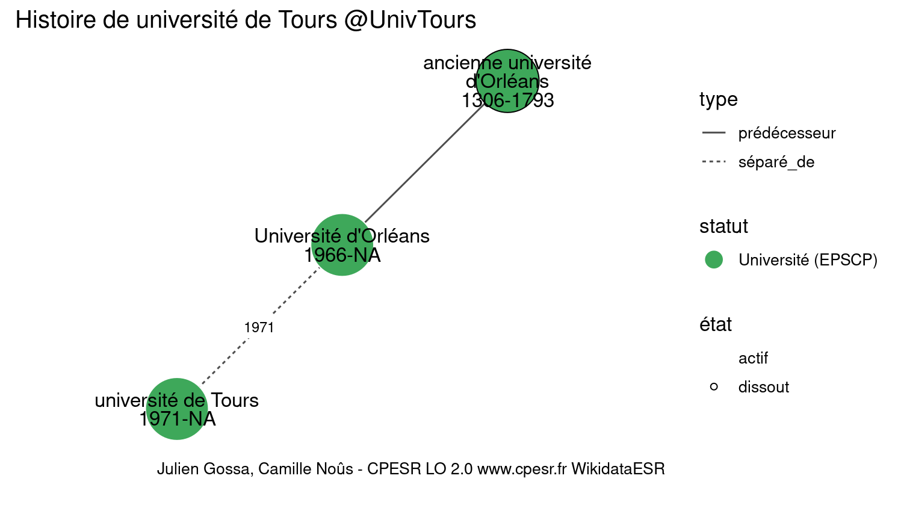 

Avertissements et édition : [logs](plots/etablissements/Q494335.md) 

### université de Tours @UnivTours : Composition 

- url:Edition des données : https://github.com/cpesr/wikidataESR/blob/master/plots/etablissements/Q494335.md 

 

Avertissements et édition : [logs](plots/etablissements/Q494335.md) 

### université de Tours @UnivTours : Associations 

- url:Edition des données : https://github.com/cpesr/wikidataESR/blob/master/plots/etablissements/Q494335.md 

 

Avertissements et édition : [logs](plots/etablissements/Q494335.md) 

### UVSQ @uvsq : Histoire 

- url:Edition des données : https://github.com/cpesr/wikidataESR/blob/master/plots/etablissements/Q186638.md 


Erreur : les données sont probablement trop partielles.
```
Error in wdesr_ggplot_graph(df, node_size = node_size, label_sizes = label_sizes, : Empty ESR graph: something went wrong with the graph production parameters

``` 

Avertissements et édition : [logs](plots/etablissements/Q186638.md) 

### UVSQ @uvsq : Composition 

- url:Edition des données : https://github.com/cpesr/wikidataESR/blob/master/plots/etablissements/Q186638.md 

 

Avertissements et édition : [logs](plots/etablissements/Q186638.md) 

### UVSQ @uvsq : Associations 

- url:Edition des données : https://github.com/cpesr/wikidataESR/blob/master/plots/etablissements/Q186638.md 

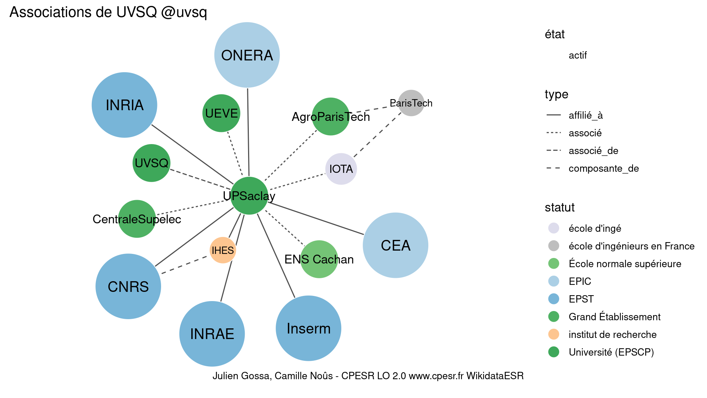 

Avertissements et édition : [logs](plots/etablissements/Q186638.md) 

### UnivAG @UnivAntilles : Histoire 

- url:Edition des données : https://github.com/cpesr/wikidataESR/blob/master/plots/etablissements/Q16682075.md 


Erreur : les données sont probablement trop partielles.
```
Error in wdesr_ggplot_graph(df, node_size = node_size, label_sizes = label_sizes, : Empty ESR graph: something went wrong with the graph production parameters

``` 

Avertissements et édition : [logs](plots/etablissements/Q16682075.md) 

### UnivAG @UnivAntilles : Composition 

- url:Edition des données : https://github.com/cpesr/wikidataESR/blob/master/plots/etablissements/Q16682075.md 


Erreur : les données sont probablement trop partielles.
```
Error in wdesr_ggplot_graph(df, node_size = node_size, label_sizes = label_sizes, : Empty ESR graph: something went wrong with the graph production parameters

``` 

Avertissements et édition : [logs](plots/etablissements/Q16682075.md) 

### UnivAG @UnivAntilles : Associations 

- url:Edition des données : https://github.com/cpesr/wikidataESR/blob/master/plots/etablissements/Q16682075.md 


Erreur : les données sont probablement trop partielles.
```
Error in wdesr_ggplot_graph(df, node_size = node_size, label_sizes = label_sizes, : Empty ESR graph: something went wrong with the graph production parameters

``` 

Avertissements et édition : [logs](plots/etablissements/Q16682075.md) 

### ULCO @ULCO_Univ : Histoire 

- url:Edition des données : https://github.com/cpesr/wikidataESR/blob/master/plots/etablissements/Q3551755.md 


Erreur : les données sont probablement trop partielles.
```
Error in wdesr_ggplot_graph(df, node_size = node_size, label_sizes = label_sizes, : Empty ESR graph: something went wrong with the graph production parameters

``` 

Avertissements et édition : [logs](plots/etablissements/Q3551755.md) 

### ULCO @ULCO_Univ : Composition 

- url:Edition des données : https://github.com/cpesr/wikidataESR/blob/master/plots/etablissements/Q3551755.md 

 

Avertissements et édition : [logs](plots/etablissements/Q3551755.md) 

### ULCO @ULCO_Univ : Associations 

- url:Edition des données : https://github.com/cpesr/wikidataESR/blob/master/plots/etablissements/Q3551755.md 


Erreur : les données sont probablement trop partielles.
```
Error in wdesr_ggplot_graph(df, node_size = node_size, label_sizes = label_sizes, : Empty ESR graph: something went wrong with the graph production parameters

``` 

Avertissements et édition : [logs](plots/etablissements/Q3551755.md) 

### UGA @UGrenobleAlpes : Histoire 

- url:Edition des données : https://github.com/cpesr/wikidataESR/blob/master/plots/etablissements/Q945876.md 

 

Avertissements et édition : [logs](plots/etablissements/Q945876.md) 

### UGA @UGrenobleAlpes : Composition 

- url:Edition des données : https://github.com/cpesr/wikidataESR/blob/master/plots/etablissements/Q945876.md 

 

Avertissements et édition : [logs](plots/etablissements/Q945876.md) 

### UGA @UGrenobleAlpes : Associations 

- url:Edition des données : https://github.com/cpesr/wikidataESR/blob/master/plots/etablissements/Q945876.md 


Erreur : les données sont probablement trop partielles.
```
Error in wdesr_ggplot_graph(df, node_size = node_size, label_sizes = label_sizes, : Empty ESR graph: something went wrong with the graph production parameters

``` 

Avertissements et édition : [logs](plots/etablissements/Q945876.md) 

### UGE @UGustaveEiffel : Histoire 

- url:Edition des données : https://github.com/cpesr/wikidataESR/blob/master/plots/etablissements/Q65153823.md 

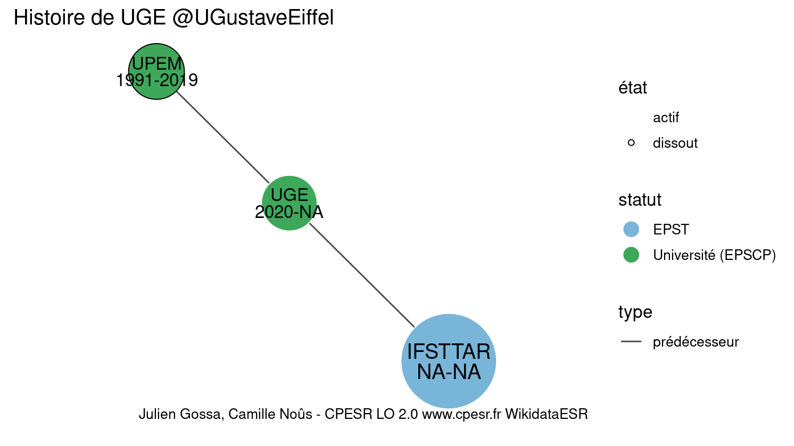 

Avertissements et édition : [logs](plots/etablissements/Q65153823.md) 

### UGE @UGustaveEiffel : Composition 

- url:Edition des données : https://github.com/cpesr/wikidataESR/blob/master/plots/etablissements/Q65153823.md 

 

Avertissements et édition : [logs](plots/etablissements/Q65153823.md) 

### UGE @UGustaveEiffel : Associations 

- url:Edition des données : https://github.com/cpesr/wikidataESR/blob/master/plots/etablissements/Q65153823.md 


Erreur : les données sont probablement trop partielles.
```
Error in wdesr_ggplot_graph(df, node_size = node_size, label_sizes = label_sizes, : Empty ESR graph: something went wrong with the graph production parameters

``` 

Avertissements et édition : [logs](plots/etablissements/Q65153823.md) 

### UJM @Univ_St_Etienne : Histoire 

- url:Edition des données : https://github.com/cpesr/wikidataESR/blob/master/plots/etablissements/Q623154.md 


Erreur : les données sont probablement trop partielles.
```
Error in wdesr_ggplot_graph(df, node_size = node_size, label_sizes = label_sizes, : Empty ESR graph: something went wrong with the graph production parameters

``` 

Avertissements et édition : [logs](plots/etablissements/Q623154.md) 

### UJM @Univ_St_Etienne : Composition 

- url:Edition des données : https://github.com/cpesr/wikidataESR/blob/master/plots/etablissements/Q623154.md 

 

Avertissements et édition : [logs](plots/etablissements/Q623154.md) 

### UJM @Univ_St_Etienne : Associations 

- url:Edition des données : https://github.com/cpesr/wikidataESR/blob/master/plots/etablissements/Q623154.md 

 

Avertissements et édition : [logs](plots/etablissements/Q623154.md) 

### Lyon 3 @UJML : Histoire 

- url:Edition des données : https://github.com/cpesr/wikidataESR/blob/master/plots/etablissements/Q4027.md 

 

Avertissements et édition : [logs](plots/etablissements/Q4027.md) 

### Lyon 3 @UJML : Composition 

- url:Edition des données : https://github.com/cpesr/wikidataESR/blob/master/plots/etablissements/Q4027.md 

 

Avertissements et édition : [logs](plots/etablissements/Q4027.md) 

### Lyon 3 @UJML : Associations 

- url:Edition des données : https://github.com/cpesr/wikidataESR/blob/master/plots/etablissements/Q4027.md 

 

Avertissements et édition : [logs](plots/etablissements/Q4027.md) 

### ULH NA : Histoire 

- url:Edition des données : https://github.com/cpesr/wikidataESR/blob/master/plots/etablissements/Q1784954.md 


Erreur : les données sont probablement trop partielles.
```
Error in wdesr_ggplot_graph(df, node_size = node_size, label_sizes = label_sizes, : Empty ESR graph: something went wrong with the graph production parameters

``` 

Avertissements et édition : [logs](plots/etablissements/Q1784954.md) 

### ULH NA : Composition 

- url:Edition des données : https://github.com/cpesr/wikidataESR/blob/master/plots/etablissements/Q1784954.md 

 

Avertissements et édition : [logs](plots/etablissements/Q1784954.md) 

### ULH NA : Associations 

- url:Edition des données : https://github.com/cpesr/wikidataESR/blob/master/plots/etablissements/Q1784954.md 

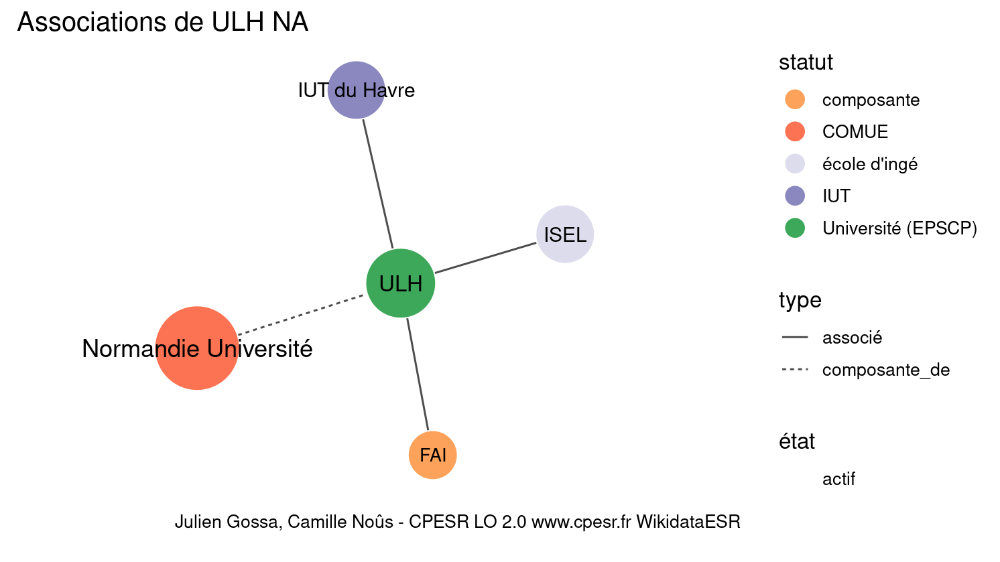 

Avertissements et édition : [logs](plots/etablissements/Q1784954.md) 

### Lyon 2 @univ_lyon2 : Histoire 

- url:Edition des données : https://github.com/cpesr/wikidataESR/blob/master/plots/etablissements/Q4041.md 

 

Avertissements et édition : [logs](plots/etablissements/Q4041.md) 

### Lyon 2 @univ_lyon2 : Composition 

- url:Edition des données : https://github.com/cpesr/wikidataESR/blob/master/plots/etablissements/Q4041.md 

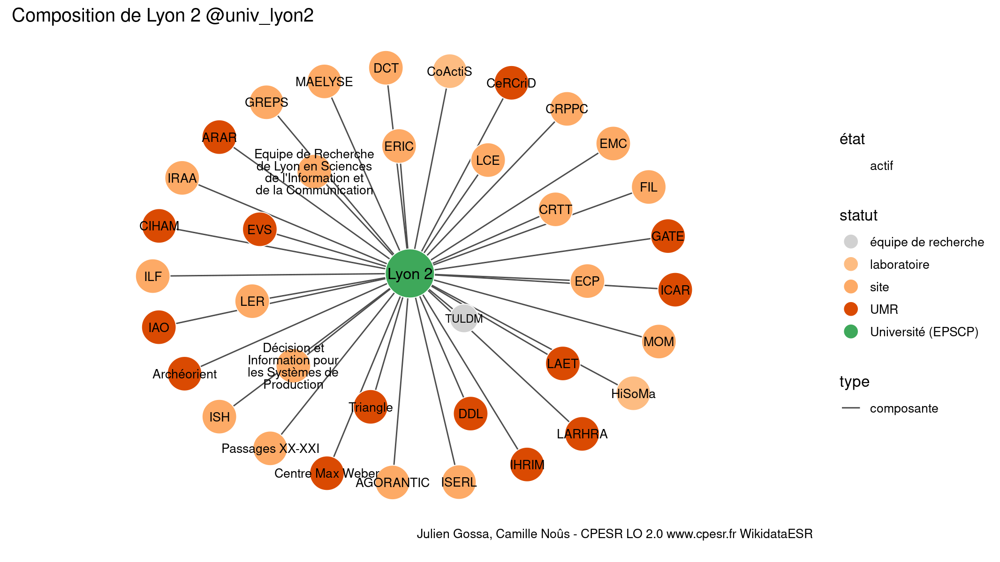 

Avertissements et édition : [logs](plots/etablissements/Q4041.md) 

### Lyon 2 @univ_lyon2 : Associations 

- url:Edition des données : https://github.com/cpesr/wikidataESR/blob/master/plots/etablissements/Q4041.md 

 

Avertissements et édition : [logs](plots/etablissements/Q4041.md) 

### Assas @AssasParis2 : Histoire 

- url:Edition des données : https://github.com/cpesr/wikidataESR/blob/master/plots/etablissements/Q662976.md 

 

Avertissements et édition : [logs](plots/etablissements/Q662976.md) 

### Assas @AssasParis2 : Composition 

- url:Edition des données : https://github.com/cpesr/wikidataESR/blob/master/plots/etablissements/Q662976.md 

 

Avertissements et édition : [logs](plots/etablissements/Q662976.md) 

### Assas @AssasParis2 : Associations 

- url:Edition des données : https://github.com/cpesr/wikidataESR/blob/master/plots/etablissements/Q662976.md 

 

Avertissements et édition : [logs](plots/etablissements/Q662976.md) 

### Paris 1 @SorbonneParis1 : Histoire 

- url:Edition des données : https://github.com/cpesr/wikidataESR/blob/master/plots/etablissements/Q999763.md 

 

Avertissements et édition : [logs](plots/etablissements/Q999763.md) 

### Paris 1 @SorbonneParis1 : Composition 

- url:Edition des données : https://github.com/cpesr/wikidataESR/blob/master/plots/etablissements/Q999763.md 

 

Avertissements et édition : [logs](plots/etablissements/Q999763.md) 

### Paris 1 @SorbonneParis1 : Associations 

- url:Edition des données : https://github.com/cpesr/wikidataESR/blob/master/plots/etablissements/Q999763.md 

 

Avertissements et édition : [logs](plots/etablissements/Q999763.md) 

### UP8 @UnivParis8 : Histoire 

- url:Edition des données : https://github.com/cpesr/wikidataESR/blob/master/plots/etablissements/Q1194988.md 

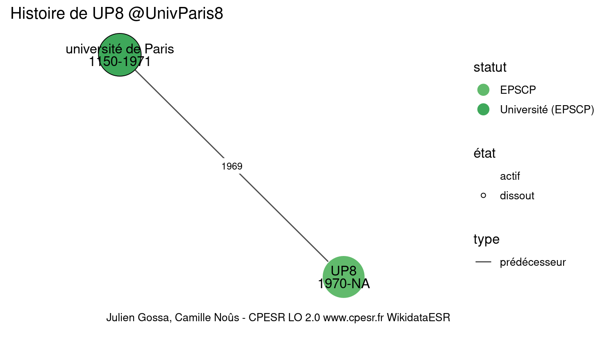 

Avertissements et édition : [logs](plots/etablissements/Q1194988.md) 

### UP8 @UnivParis8 : Composition 

- url:Edition des données : https://github.com/cpesr/wikidataESR/blob/master/plots/etablissements/Q1194988.md 

 

Avertissements et édition : [logs](plots/etablissements/Q1194988.md) 

### UP8 @UnivParis8 : Associations 

- url:Edition des données : https://github.com/cpesr/wikidataESR/blob/master/plots/etablissements/Q1194988.md 

 

Avertissements et édition : [logs](plots/etablissements/Q1194988.md) 

### Paris-Dauphine NA : Histoire 

- url:Edition des données : https://github.com/cpesr/wikidataESR/blob/master/plots/etablissements/Q1546437.md 

 

Avertissements et édition : [logs](plots/etablissements/Q1546437.md) 

### Paris-Dauphine NA : Composition 

- url:Edition des données : https://github.com/cpesr/wikidataESR/blob/master/plots/etablissements/Q1546437.md 

 

Avertissements et édition : [logs](plots/etablissements/Q1546437.md) 

### Paris-Dauphine NA : Associations 

- url:Edition des données : https://github.com/cpesr/wikidataESR/blob/master/plots/etablissements/Q1546437.md 

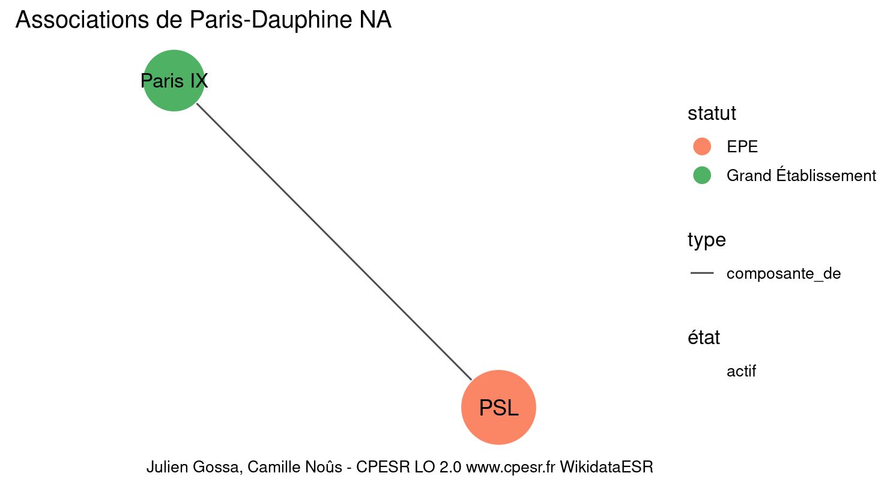 

Avertissements et édition : [logs](plots/etablissements/Q1546437.md) 

### Paris X @uparisnanterre : Histoire 

- url:Edition des données : https://github.com/cpesr/wikidataESR/blob/master/plots/etablissements/Q1394262.md 

 

Avertissements et édition : [logs](plots/etablissements/Q1394262.md) 

### Paris X @uparisnanterre : Composition 

- url:Edition des données : https://github.com/cpesr/wikidataESR/blob/master/plots/etablissements/Q1394262.md 

 

Avertissements et édition : [logs](plots/etablissements/Q1394262.md) 

### Paris X @uparisnanterre : Associations 

- url:Edition des données : https://github.com/cpesr/wikidataESR/blob/master/plots/etablissements/Q1394262.md 

 

Avertissements et édition : [logs](plots/etablissements/Q1394262.md) 

### PSL @psl_univ : Histoire 

- url:Edition des données : https://github.com/cpesr/wikidataESR/blob/master/plots/etablissements/Q1163431.md 

 

Avertissements et édition : [logs](plots/etablissements/Q1163431.md) 

### PSL @psl_univ : Composition 

- url:Edition des données : https://github.com/cpesr/wikidataESR/blob/master/plots/etablissements/Q1163431.md 

 

Avertissements et édition : [logs](plots/etablissements/Q1163431.md) 

### PSL @psl_univ : Associations 

- url:Edition des données : https://github.com/cpesr/wikidataESR/blob/master/plots/etablissements/Q1163431.md 


Erreur : les données sont probablement trop partielles.
```
Error in wdesr_ggplot_graph(df, node_size = node_size, label_sizes = label_sizes, : Empty ESR graph: something went wrong with the graph production parameters

``` 

Avertissements et édition : [logs](plots/etablissements/Q1163431.md) 

### UPEC @UPECactus : Histoire 

- url:Edition des données : https://github.com/cpesr/wikidataESR/blob/master/plots/etablissements/Q980688.md 

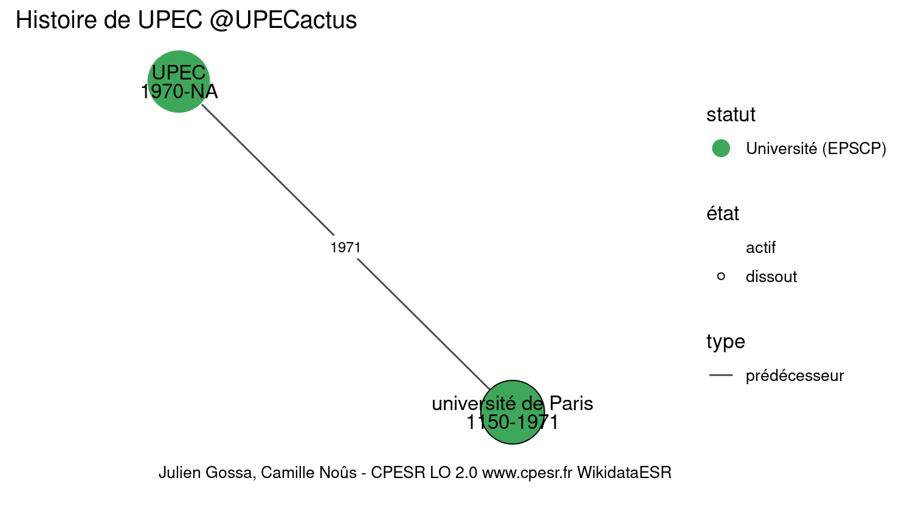 

Avertissements et édition : [logs](plots/etablissements/Q980688.md) 

### UPEC @UPECactus : Composition 

- url:Edition des données : https://github.com/cpesr/wikidataESR/blob/master/plots/etablissements/Q980688.md 

 

Avertissements et édition : [logs](plots/etablissements/Q980688.md) 

### UPEC @UPECactus : Associations 

- url:Edition des données : https://github.com/cpesr/wikidataESR/blob/master/plots/etablissements/Q980688.md 

 

Avertissements et édition : [logs](plots/etablissements/Q980688.md) 

### UPSaclay @UnivParisSaclay : Histoire 

- url:Edition des données : https://github.com/cpesr/wikidataESR/blob/master/plots/etablissements/Q109409389.md 

 

Avertissements et édition : [logs](plots/etablissements/Q109409389.md) 

### UPSaclay @UnivParisSaclay : Composition 

- url:Edition des données : https://github.com/cpesr/wikidataESR/blob/master/plots/etablissements/Q109409389.md 

 

Avertissements et édition : [logs](plots/etablissements/Q109409389.md) 

### UPSaclay @UnivParisSaclay : Associations 

- url:Edition des données : https://github.com/cpesr/wikidataESR/blob/master/plots/etablissements/Q109409389.md 

 

Avertissements et édition : [logs](plots/etablissements/Q109409389.md) 

### UPV @univpaulvalery : Histoire 

- url:Edition des données : https://github.com/cpesr/wikidataESR/blob/master/plots/etablissements/Q2912244.md 

 

Avertissements et édition : [logs](plots/etablissements/Q2912244.md) 

### UPV @univpaulvalery : Composition 

- url:Edition des données : https://github.com/cpesr/wikidataESR/blob/master/plots/etablissements/Q2912244.md 

 

Avertissements et édition : [logs](plots/etablissements/Q2912244.md) 

### UPV @univpaulvalery : Associations 

- url:Edition des données : https://github.com/cpesr/wikidataESR/blob/master/plots/etablissements/Q2912244.md 

 

Avertissements et édition : [logs](plots/etablissements/Q2912244.md) 

### UPHF @UphfOfficiel : Histoire 

- url:Edition des données : https://github.com/cpesr/wikidataESR/blob/master/plots/etablissements/Q1548539.md 

 

Avertissements et édition : [logs](plots/etablissements/Q1548539.md) 

### UPHF @UphfOfficiel : Composition 

- url:Edition des données : https://github.com/cpesr/wikidataESR/blob/master/plots/etablissements/Q1548539.md 

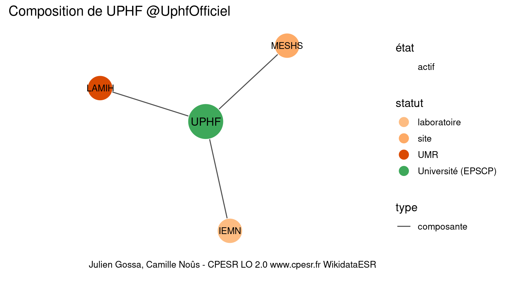 

Avertissements et édition : [logs](plots/etablissements/Q1548539.md) 

### UPHF @UphfOfficiel : Associations 

- url:Edition des données : https://github.com/cpesr/wikidataESR/blob/master/plots/etablissements/Q1548539.md 


Erreur : les données sont probablement trop partielles.
```
Error in wdesr_ggplot_graph(df, node_size = node_size, label_sizes = label_sizes, : Empty ESR graph: something went wrong with the graph production parameters

``` 

Avertissements et édition : [logs](plots/etablissements/Q1548539.md) 

### Rennes 2 @Univ_Rennes2 : Histoire 

- url:Edition des données : https://github.com/cpesr/wikidataESR/blob/master/plots/etablissements/Q459026.md 

 

Avertissements et édition : [logs](plots/etablissements/Q459026.md) 

### Rennes 2 @Univ_Rennes2 : Composition 

- url:Edition des données : https://github.com/cpesr/wikidataESR/blob/master/plots/etablissements/Q459026.md 

 

Avertissements et édition : [logs](plots/etablissements/Q459026.md) 

### Rennes 2 @Univ_Rennes2 : Associations 

- url:Edition des données : https://github.com/cpesr/wikidataESR/blob/master/plots/etablissements/Q459026.md 

 

Avertissements et édition : [logs](plots/etablissements/Q459026.md) 

### USMB @Univ_Savoie : Histoire 

- url:Edition des données : https://github.com/cpesr/wikidataESR/blob/master/plots/etablissements/Q2496158.md 


Erreur : les données sont probablement trop partielles.
```
Error in wdesr_ggplot_graph(df, node_size = node_size, label_sizes = label_sizes, : Empty ESR graph: something went wrong with the graph production parameters

``` 

Avertissements et édition : [logs](plots/etablissements/Q2496158.md) 

### USMB @Univ_Savoie : Composition 

- url:Edition des données : https://github.com/cpesr/wikidataESR/blob/master/plots/etablissements/Q2496158.md 

 

Avertissements et édition : [logs](plots/etablissements/Q2496158.md) 

### USMB @Univ_Savoie : Associations 

- url:Edition des données : https://github.com/cpesr/wikidataESR/blob/master/plots/etablissements/Q2496158.md 


Erreur : les données sont probablement trop partielles.
```
Error in wdesr_ggplot_graph(df, node_size = node_size, label_sizes = label_sizes, : Empty ESR graph: something went wrong with the graph production parameters

``` 

Avertissements et édition : [logs](plots/etablissements/Q2496158.md) 

### Paris 3 @SorbonneParis3 : Histoire 

- url:Edition des données : https://github.com/cpesr/wikidataESR/blob/master/plots/etablissements/Q571293.md 

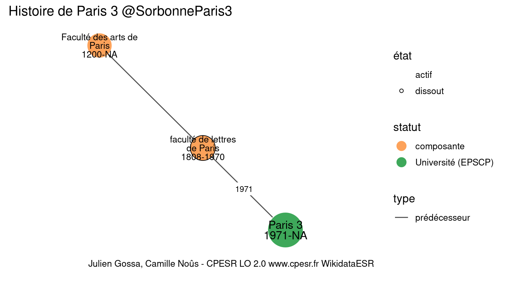 

Avertissements et édition : [logs](plots/etablissements/Q571293.md) 

### Paris 3 @SorbonneParis3 : Composition 

- url:Edition des données : https://github.com/cpesr/wikidataESR/blob/master/plots/etablissements/Q571293.md 

 

Avertissements et édition : [logs](plots/etablissements/Q571293.md) 

### Paris 3 @SorbonneParis3 : Associations 

- url:Edition des données : https://github.com/cpesr/wikidataESR/blob/master/plots/etablissements/Q571293.md 


Erreur : les données sont probablement trop partielles.
```
Error in wdesr_ggplot_graph(df, node_size = node_size, label_sizes = label_sizes, : Empty ESR graph: something went wrong with the graph production parameters

``` 

Avertissements et édition : [logs](plots/etablissements/Q571293.md) 

### UP13 @univ_spn : Histoire 

- url:Edition des données : https://github.com/cpesr/wikidataESR/blob/master/plots/etablissements/Q1780212.md 

 

Avertissements et édition : [logs](plots/etablissements/Q1780212.md) 

### UP13 @univ_spn : Composition 

- url:Edition des données : https://github.com/cpesr/wikidataESR/blob/master/plots/etablissements/Q1780212.md 

 

Avertissements et édition : [logs](plots/etablissements/Q1780212.md) 

### UP13 @univ_spn : Associations 

- url:Edition des données : https://github.com/cpesr/wikidataESR/blob/master/plots/etablissements/Q1780212.md 


Erreur : les données sont probablement trop partielles.
```
Error in wdesr_ggplot_graph(df, node_size = node_size, label_sizes = label_sizes, : Empty ESR graph: something went wrong with the graph production parameters

``` 

Avertissements et édition : [logs](plots/etablissements/Q1780212.md) 

### UT2 @UTJeanJaures : Histoire 

- url:Edition des données : https://github.com/cpesr/wikidataESR/blob/master/plots/etablissements/Q1933558.md 

 

Avertissements et édition : [logs](plots/etablissements/Q1933558.md) 

### UT2 @UTJeanJaures : Composition 

- url:Edition des données : https://github.com/cpesr/wikidataESR/blob/master/plots/etablissements/Q1933558.md 

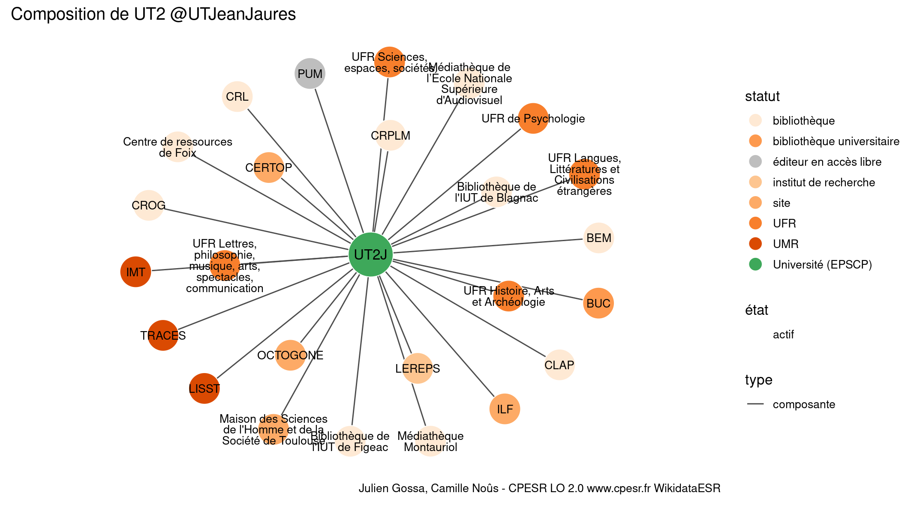 

Avertissements et édition : [logs](plots/etablissements/Q1933558.md) 

### UT2 @UTJeanJaures : Associations 

- url:Edition des données : https://github.com/cpesr/wikidataESR/blob/master/plots/etablissements/Q1933558.md 

 

Avertissements et édition : [logs](plots/etablissements/Q1933558.md) 

### UT1 @UT1Capitole : Histoire 

- url:Edition des données : https://github.com/cpesr/wikidataESR/blob/master/plots/etablissements/Q590201.md 

 

Avertissements et édition : [logs](plots/etablissements/Q590201.md) 

### UT1 @UT1Capitole : Composition 

- url:Edition des données : https://github.com/cpesr/wikidataESR/blob/master/plots/etablissements/Q590201.md 

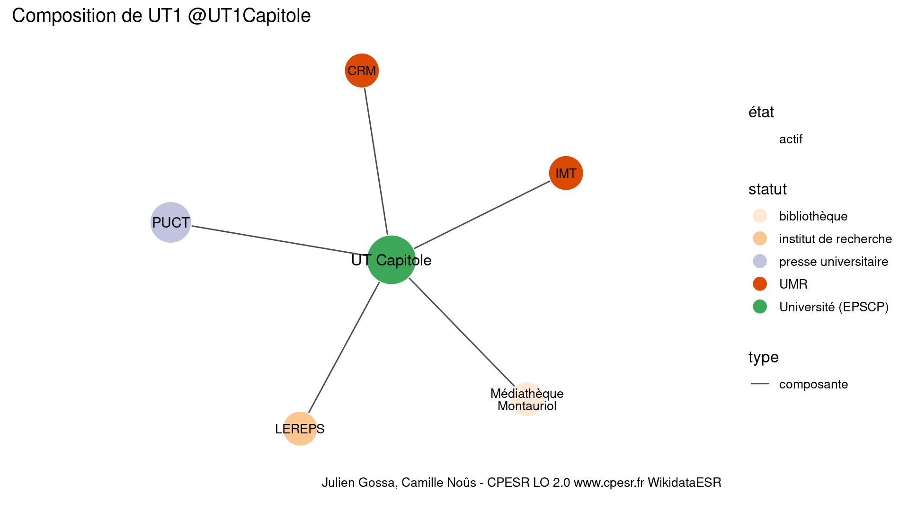 

Avertissements et édition : [logs](plots/etablissements/Q590201.md) 

### UT1 @UT1Capitole : Associations 

- url:Edition des données : https://github.com/cpesr/wikidataESR/blob/master/plots/etablissements/Q590201.md 

 

Avertissements et édition : [logs](plots/etablissements/Q590201.md) 

### Université Toulouse III @UT3PaulSabatier : Histoire 

- url:Edition des données : https://github.com/cpesr/wikidataESR/blob/master/plots/etablissements/Q1273188.md 

 

Avertissements et édition : [logs](plots/etablissements/Q1273188.md) 

### Université Toulouse III @UT3PaulSabatier : Composition 

- url:Edition des données : https://github.com/cpesr/wikidataESR/blob/master/plots/etablissements/Q1273188.md 

 

Avertissements et édition : [logs](plots/etablissements/Q1273188.md) 

### Université Toulouse III @UT3PaulSabatier : Associations 

- url:Edition des données : https://github.com/cpesr/wikidataESR/blob/master/plots/etablissements/Q1273188.md 

 

Avertissements et édition : [logs](plots/etablissements/Q1273188.md) 

## Histoire, composition et association actuelles des Regroupements 

Twitters manquants :
```
 - Campus Condorcet
 - HESAM
 - Normandie Université
 - UPE
 - Comue de Bourgogne Franche-Comté
 - UBL
 - université confédérale Léonard-de-Vinci
 - UDL
 - université de Toulouse
 - UPL
``` 

### Campus Condorcet NA : Histoire 

- url:Edition des données : https://github.com/cpesr/wikidataESR/blob/master/plots/etablissements/Q2935605.md 


Erreur : les données sont probablement trop partielles.
```
Error in wdesr_ggplot_graph(df, node_size = node_size, label_sizes = label_sizes, : Empty ESR graph: something went wrong with the graph production parameters

``` 

Avertissements et édition : [logs](plots/etablissements/Q2935605.md) 

### Campus Condorcet NA : Composition 

- url:Edition des données : https://github.com/cpesr/wikidataESR/blob/master/plots/etablissements/Q2935605.md 


Erreur : les données sont probablement trop partielles.
```
Error in wdesr_ggplot_graph(df, node_size = node_size, label_sizes = label_sizes, : Empty ESR graph: something went wrong with the graph production parameters

``` 

Avertissements et édition : [logs](plots/etablissements/Q2935605.md) 

### Campus Condorcet NA : Associations 

- url:Edition des données : https://github.com/cpesr/wikidataESR/blob/master/plots/etablissements/Q2935605.md 

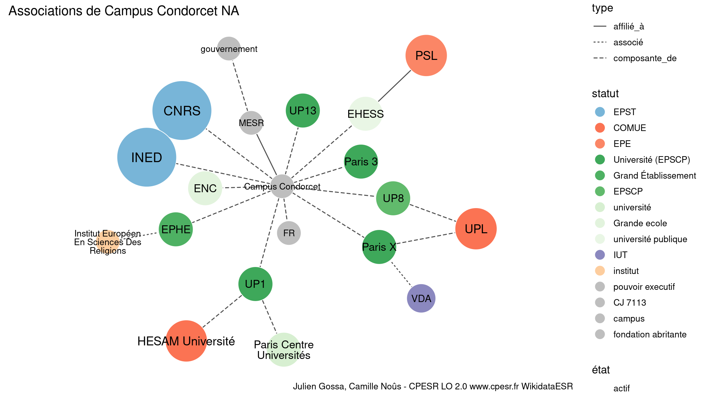 

Avertissements et édition : [logs](plots/etablissements/Q2935605.md) 

### HESAM NA : Histoire 

- url:Edition des données : https://github.com/cpesr/wikidataESR/blob/master/plots/etablissements/Q3128622.md 

 

Avertissements et édition : [logs](plots/etablissements/Q3128622.md) 

### HESAM NA : Composition 

- url:Edition des données : https://github.com/cpesr/wikidataESR/blob/master/plots/etablissements/Q3128622.md 

 

Avertissements et édition : [logs](plots/etablissements/Q3128622.md) 

### HESAM NA : Associations 

- url:Edition des données : https://github.com/cpesr/wikidataESR/blob/master/plots/etablissements/Q3128622.md 


Erreur : les données sont probablement trop partielles.
```
Error in wdesr_ggplot_graph(df, node_size = node_size, label_sizes = label_sizes, : Empty ESR graph: something went wrong with the graph production parameters

``` 

Avertissements et édition : [logs](plots/etablissements/Q3128622.md) 

### Normandie Université NA : Histoire 

- url:Edition des données : https://github.com/cpesr/wikidataESR/blob/master/plots/etablissements/Q3343880.md 

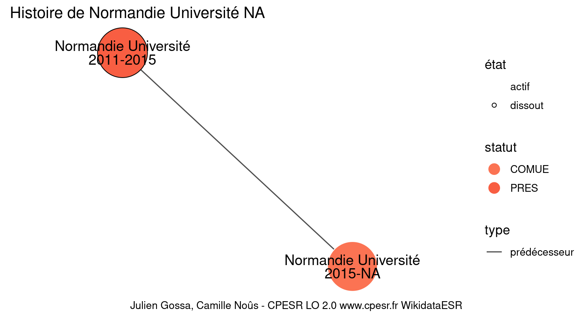 

Avertissements et édition : [logs](plots/etablissements/Q3343880.md) 

### Normandie Université NA : Composition 

- url:Edition des données : https://github.com/cpesr/wikidataESR/blob/master/plots/etablissements/Q3343880.md 

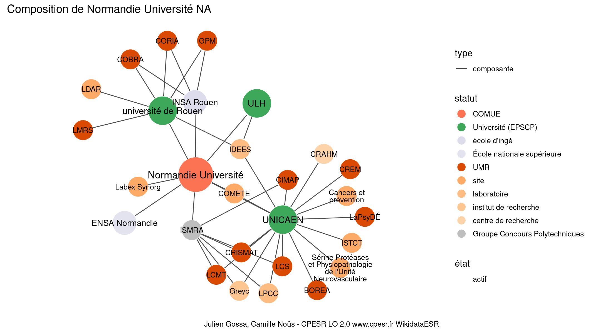 

Avertissements et édition : [logs](plots/etablissements/Q3343880.md) 

### Normandie Université NA : Associations 

- url:Edition des données : https://github.com/cpesr/wikidataESR/blob/master/plots/etablissements/Q3343880.md 


Erreur : les données sont probablement trop partielles.
```
Error in wdesr_ggplot_graph(df, node_size = node_size, label_sizes = label_sizes, : Empty ESR graph: something went wrong with the graph production parameters

``` 

Avertissements et édition : [logs](plots/etablissements/Q3343880.md) 

### UPE NA : Histoire 

- url:Edition des données : https://github.com/cpesr/wikidataESR/blob/master/plots/etablissements/Q3551472.md 

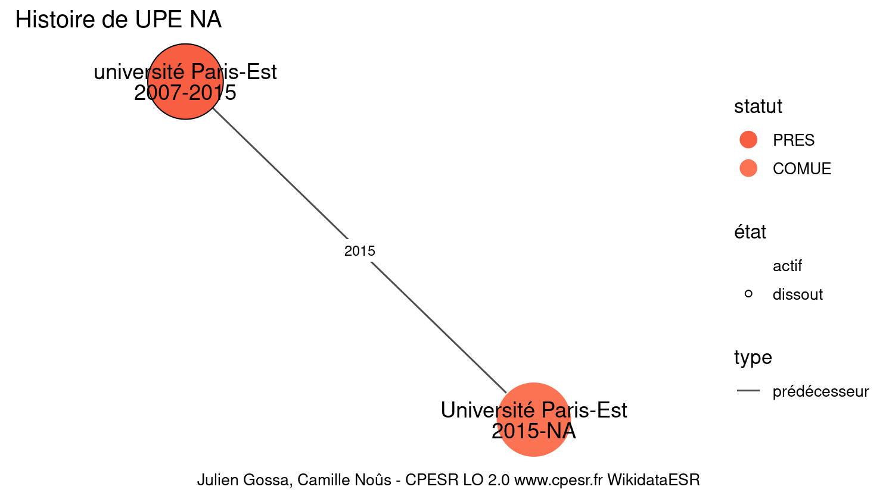 

Avertissements et édition : [logs](plots/etablissements/Q3551472.md) 

### UPE NA : Composition 

- url:Edition des données : https://github.com/cpesr/wikidataESR/blob/master/plots/etablissements/Q3551472.md 

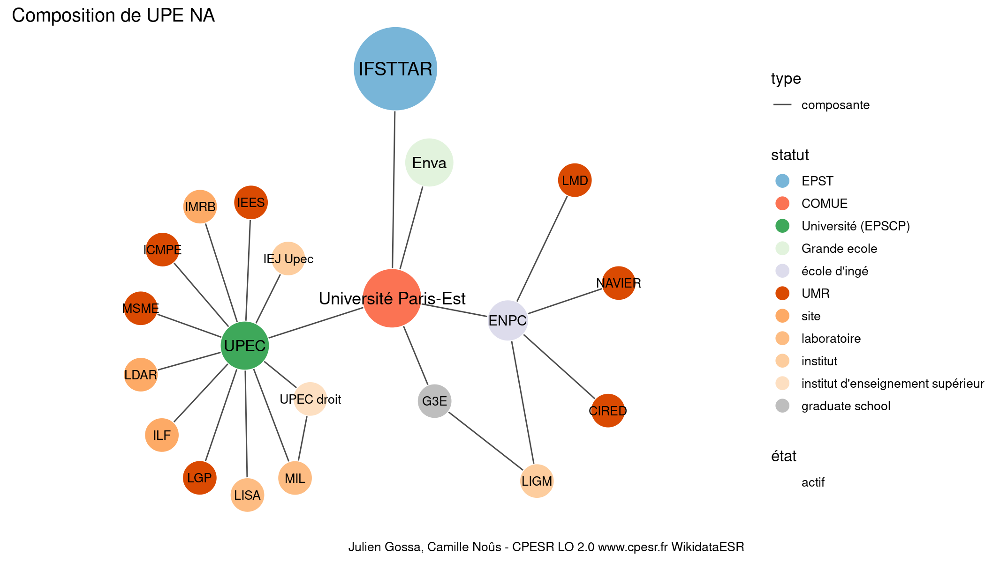 

Avertissements et édition : [logs](plots/etablissements/Q3551472.md) 

### UPE NA : Associations 

- url:Edition des données : https://github.com/cpesr/wikidataESR/blob/master/plots/etablissements/Q3551472.md 


Erreur : les données sont probablement trop partielles.
```
Error in wdesr_ggplot_graph(df, node_size = node_size, label_sizes = label_sizes, : Empty ESR graph: something went wrong with the graph production parameters

``` 

Avertissements et édition : [logs](plots/etablissements/Q3551472.md) 

### Comue de Bourgogne Franche-Comté NA : Histoire 

- url:Edition des données : https://github.com/cpesr/wikidataESR/blob/master/plots/etablissements/Q3359833.md 


Erreur : les données sont probablement trop partielles.
```
Error in wdesr_ggplot_graph(df, node_size = node_size, label_sizes = label_sizes, : Empty ESR graph: something went wrong with the graph production parameters

``` 

Avertissements et édition : [logs](plots/etablissements/Q3359833.md) 

### Comue de Bourgogne Franche-Comté NA : Composition 

- url:Edition des données : https://github.com/cpesr/wikidataESR/blob/master/plots/etablissements/Q3359833.md 

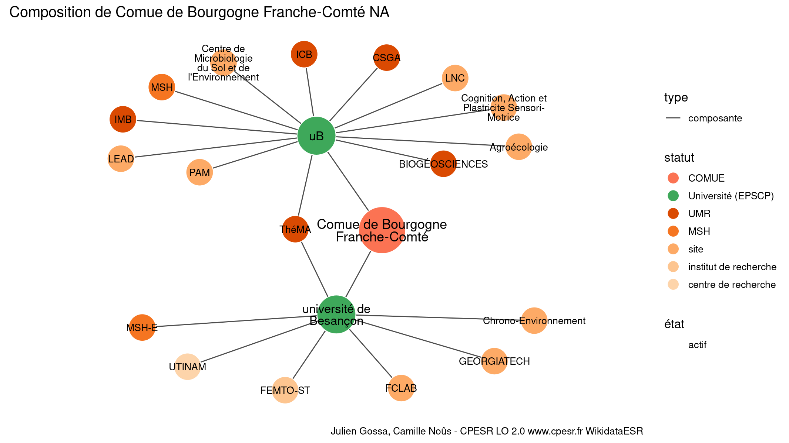 

Avertissements et édition : [logs](plots/etablissements/Q3359833.md) 

### Comue de Bourgogne Franche-Comté NA : Associations 

- url:Edition des données : https://github.com/cpesr/wikidataESR/blob/master/plots/etablissements/Q3359833.md 


Erreur : les données sont probablement trop partielles.
```
Error in wdesr_ggplot_graph(df, node_size = node_size, label_sizes = label_sizes, : Empty ESR graph: something went wrong with the graph production parameters

``` 

Avertissements et édition : [logs](plots/etablissements/Q3359833.md) 

### UBL NA : Histoire 

- url:Edition des données : https://github.com/cpesr/wikidataESR/blob/master/plots/etablissements/Q21994834.md 

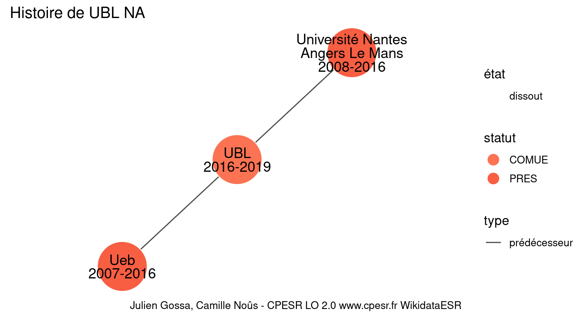 

Avertissements et édition : [logs](plots/etablissements/Q21994834.md) 

### UBL NA : Composition 

- url:Edition des données : https://github.com/cpesr/wikidataESR/blob/master/plots/etablissements/Q21994834.md 

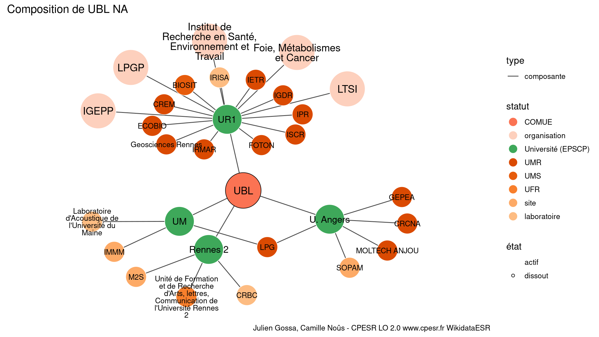 

Avertissements et édition : [logs](plots/etablissements/Q21994834.md) 

### UBL NA : Associations 

- url:Edition des données : https://github.com/cpesr/wikidataESR/blob/master/plots/etablissements/Q21994834.md 


Erreur : les données sont probablement trop partielles.
```
Error in wdesr_ggplot_graph(df, node_size = node_size, label_sizes = label_sizes, : Empty ESR graph: something went wrong with the graph production parameters

``` 

Avertissements et édition : [logs](plots/etablissements/Q21994834.md) 

### université confédérale Léonard-de-Vinci NA : Histoire 

- url:Edition des données : https://github.com/cpesr/wikidataESR/blob/master/plots/etablissements/Q20735682.md 


Erreur : les données sont probablement trop partielles.
```
Error in wdesr_ggplot_graph(df, node_size = node_size, label_sizes = label_sizes, : Empty ESR graph: something went wrong with the graph production parameters

``` 

Avertissements et édition : [logs](plots/etablissements/Q20735682.md) 

### université confédérale Léonard-de-Vinci NA : Composition 

- url:Edition des données : https://github.com/cpesr/wikidataESR/blob/master/plots/etablissements/Q20735682.md 

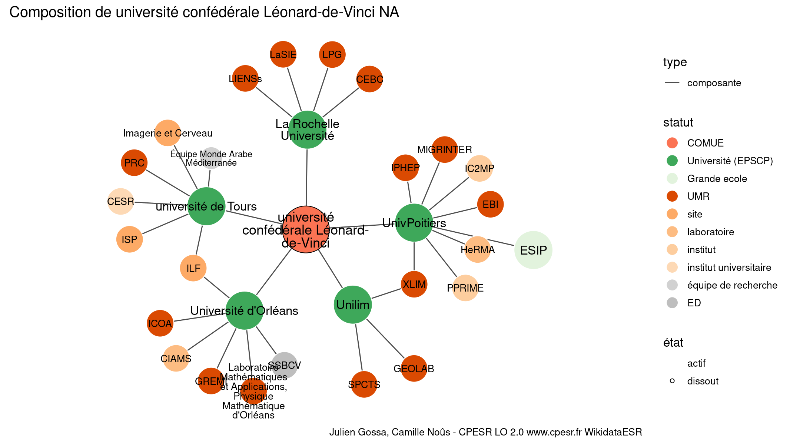 

Avertissements et édition : [logs](plots/etablissements/Q20735682.md) 

### université confédérale Léonard-de-Vinci NA : Associations 

- url:Edition des données : https://github.com/cpesr/wikidataESR/blob/master/plots/etablissements/Q20735682.md 


Erreur : les données sont probablement trop partielles.
```
Error in wdesr_ggplot_graph(df, node_size = node_size, label_sizes = label_sizes, : Empty ESR graph: something went wrong with the graph production parameters

``` 

Avertissements et édition : [logs](plots/etablissements/Q20735682.md) 

### UDL NA : Histoire 

- url:Edition des données : https://github.com/cpesr/wikidataESR/blob/master/plots/etablissements/Q10176.md 

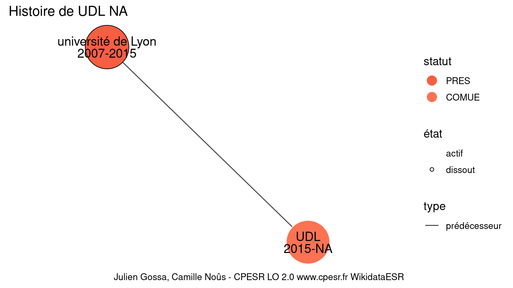 

Avertissements et édition : [logs](plots/etablissements/Q10176.md) 

### UDL NA : Composition 

- url:Edition des données : https://github.com/cpesr/wikidataESR/blob/master/plots/etablissements/Q10176.md 

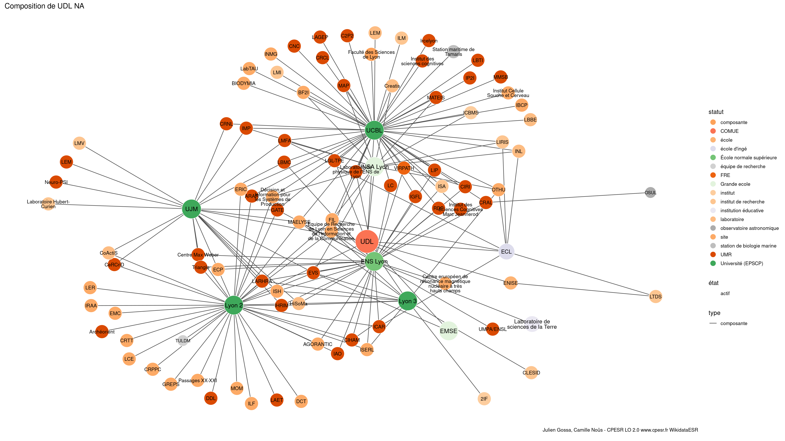 

Avertissements et édition : [logs](plots/etablissements/Q10176.md) 

### UDL NA : Associations 

- url:Edition des données : https://github.com/cpesr/wikidataESR/blob/master/plots/etablissements/Q10176.md 


Erreur : les données sont probablement trop partielles.
```
Error in wdesr_ggplot_graph(df, node_size = node_size, label_sizes = label_sizes, : Empty ESR graph: something went wrong with the graph production parameters

``` 

Avertissements et édition : [logs](plots/etablissements/Q10176.md) 

### université de Toulouse NA : Histoire 

- url:Edition des données : https://github.com/cpesr/wikidataESR/blob/master/plots/etablissements/Q578023.md 


Erreur : les données sont probablement trop partielles.
```
Error in wdesr_ggplot_graph(df, node_size = node_size, label_sizes = label_sizes, : Empty ESR graph: something went wrong with the graph production parameters

``` 

Avertissements et édition : [logs](plots/etablissements/Q578023.md) 

### université de Toulouse NA : Composition 

- url:Edition des données : https://github.com/cpesr/wikidataESR/blob/master/plots/etablissements/Q578023.md 


Erreur : les données sont probablement trop partielles.
```
Error in wdesr_ggplot_graph(df, node_size = node_size, label_sizes = label_sizes, : Empty ESR graph: something went wrong with the graph production parameters

``` 

Avertissements et édition : [logs](plots/etablissements/Q578023.md) 

### université de Toulouse NA : Associations 

- url:Edition des données : https://github.com/cpesr/wikidataESR/blob/master/plots/etablissements/Q578023.md 

 

Avertissements et édition : [logs](plots/etablissements/Q578023.md) 

### UPL NA : Histoire 

- url:Edition des données : https://github.com/cpesr/wikidataESR/blob/master/plots/etablissements/Q3551474.md 

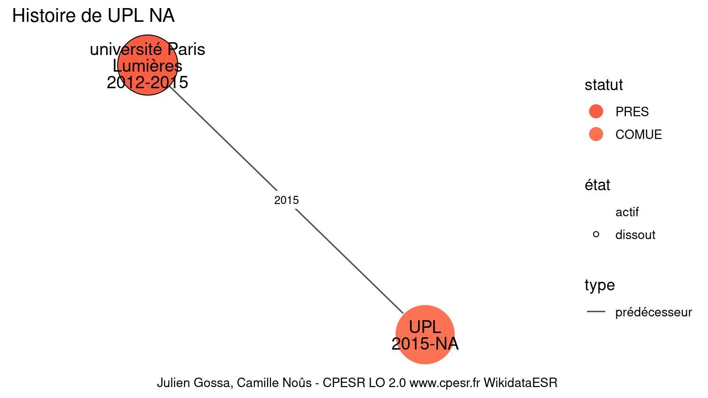 

Avertissements et édition : [logs](plots/etablissements/Q3551474.md) 

### UPL NA : Composition 

- url:Edition des données : https://github.com/cpesr/wikidataESR/blob/master/plots/etablissements/Q3551474.md 

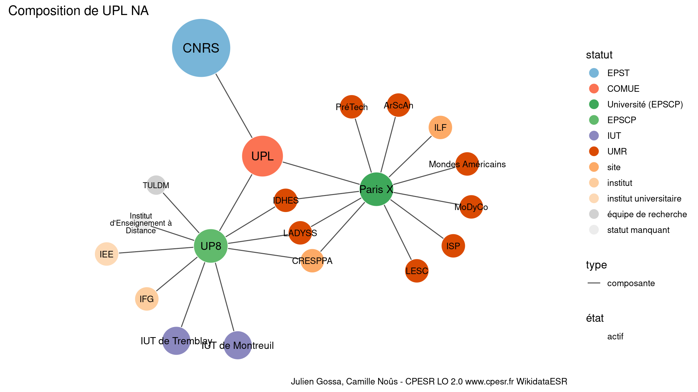 

Avertissements et édition : [logs](plots/etablissements/Q3551474.md) 

### UPL NA : Associations 

- url:Edition des données : https://github.com/cpesr/wikidataESR/blob/master/plots/etablissements/Q3551474.md 


Erreur : les données sont probablement trop partielles.
```
Error in wdesr_ggplot_graph(df, node_size = node_size, label_sizes = label_sizes, : Empty ESR graph: something went wrong with the graph production parameters

``` 

Avertissements et édition : [logs](plots/etablissements/Q3551474.md) 

## Histoire, composition et association actuelles des Ecoles d'ingénieurs 

Twitters manquants :
```
 - CentraleSupelec
 - ENS Chimie de Paris
 - INPG
``` 

### Arts et Métiers @ArtsetMetiers_ : Histoire 

- url:Edition des données : https://github.com/cpesr/wikidataESR/blob/master/plots/etablissements/Q2570220.md 


Erreur : les données sont probablement trop partielles.
```
Error in wdesr_ggplot_graph(df, node_size = node_size, label_sizes = label_sizes, : Empty ESR graph: something went wrong with the graph production parameters

``` 

Avertissements et édition : [logs](plots/etablissements/Q2570220.md) 

### Arts et Métiers @ArtsetMetiers_ : Composition 

- url:Edition des données : https://github.com/cpesr/wikidataESR/blob/master/plots/etablissements/Q2570220.md 

 

Avertissements et édition : [logs](plots/etablissements/Q2570220.md) 

### Arts et Métiers @ArtsetMetiers_ : Associations 

- url:Edition des données : https://github.com/cpesr/wikidataESR/blob/master/plots/etablissements/Q2570220.md 

 

Avertissements et édition : [logs](plots/etablissements/Q2570220.md) 

### IPB @BordeauxINP : Histoire 

- url:Edition des données : https://github.com/cpesr/wikidataESR/blob/master/plots/etablissements/Q3152470.md 


Erreur : les données sont probablement trop partielles.
```
Error in wdesr_ggplot_graph(df, node_size = node_size, label_sizes = label_sizes, : Empty ESR graph: something went wrong with the graph production parameters

``` 

Avertissements et édition : [logs](plots/etablissements/Q3152470.md) 

### IPB @BordeauxINP : Composition 

- url:Edition des données : https://github.com/cpesr/wikidataESR/blob/master/plots/etablissements/Q3152470.md 

 

Avertissements et édition : [logs](plots/etablissements/Q3152470.md) 

### IPB @BordeauxINP : Associations 

- url:Edition des données : https://github.com/cpesr/wikidataESR/blob/master/plots/etablissements/Q3152470.md 


Erreur : les données sont probablement trop partielles.
```
Error in wdesr_ggplot_graph(df, node_size = node_size, label_sizes = label_sizes, : Empty ESR graph: something went wrong with the graph production parameters

``` 

Avertissements et édition : [logs](plots/etablissements/Q3152470.md) 

### CLI @Centralelille : Histoire 

- url:Edition des données : https://github.com/cpesr/wikidataESR/blob/master/plots/etablissements/Q273461.md 


Erreur : les données sont probablement trop partielles.
```
Error in wdesr_ggplot_graph(df, node_size = node_size, label_sizes = label_sizes, : Empty ESR graph: something went wrong with the graph production parameters

``` 

Avertissements et édition : [logs](plots/etablissements/Q273461.md) 

### CLI @Centralelille : Composition 

- url:Edition des données : https://github.com/cpesr/wikidataESR/blob/master/plots/etablissements/Q273461.md 

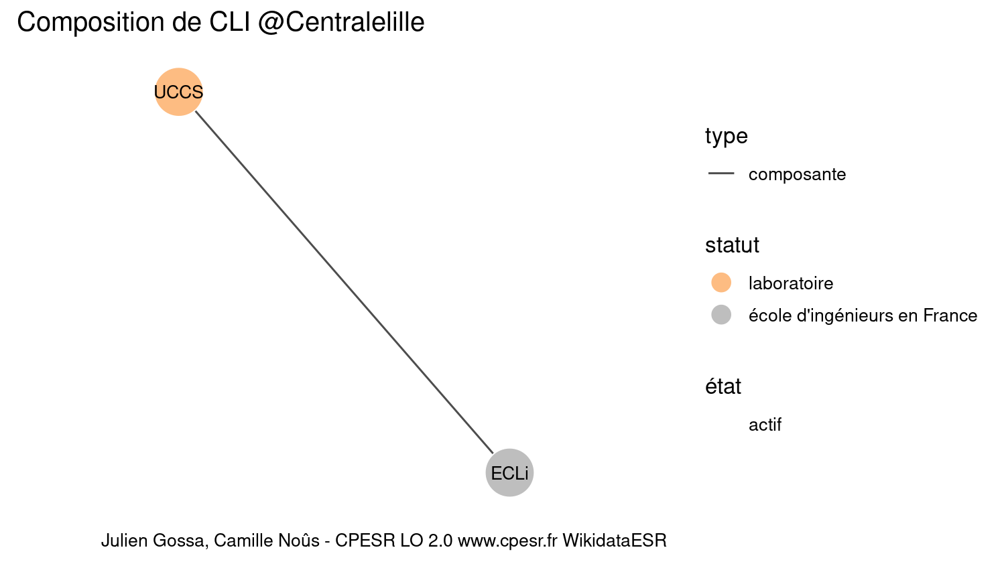 

Avertissements et édition : [logs](plots/etablissements/Q273461.md) 

### CLI @Centralelille : Associations 

- url:Edition des données : https://github.com/cpesr/wikidataESR/blob/master/plots/etablissements/Q273461.md 

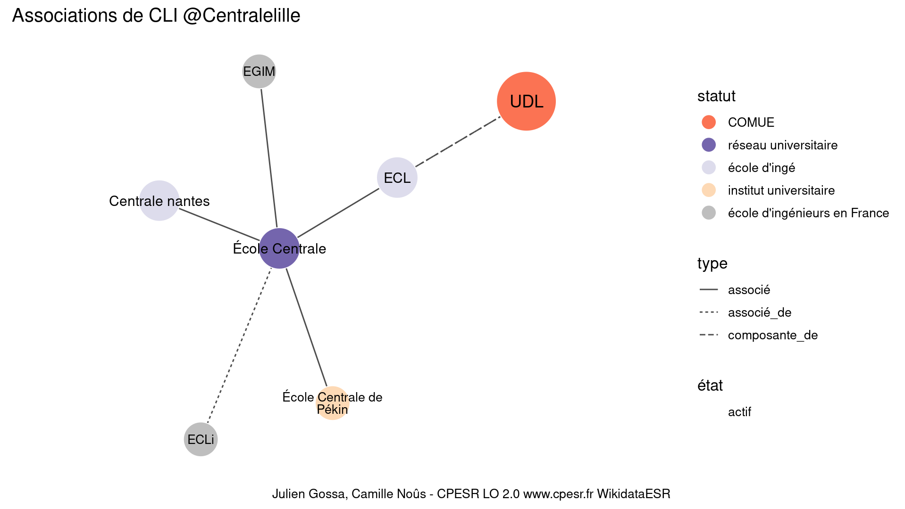 

Avertissements et édition : [logs](plots/etablissements/Q273461.md) 

### EC Lyon @CentraleLyon : Histoire 

- url:Edition des données : https://github.com/cpesr/wikidataESR/blob/master/plots/etablissements/Q10177.md 


Erreur : les données sont probablement trop partielles.
```
Error in wdesr_ggplot_graph(df, node_size = node_size, label_sizes = label_sizes, : Empty ESR graph: something went wrong with the graph production parameters

``` 

Avertissements et édition : [logs](plots/etablissements/Q10177.md) 

### EC Lyon @CentraleLyon : Composition 

- url:Edition des données : https://github.com/cpesr/wikidataESR/blob/master/plots/etablissements/Q10177.md 

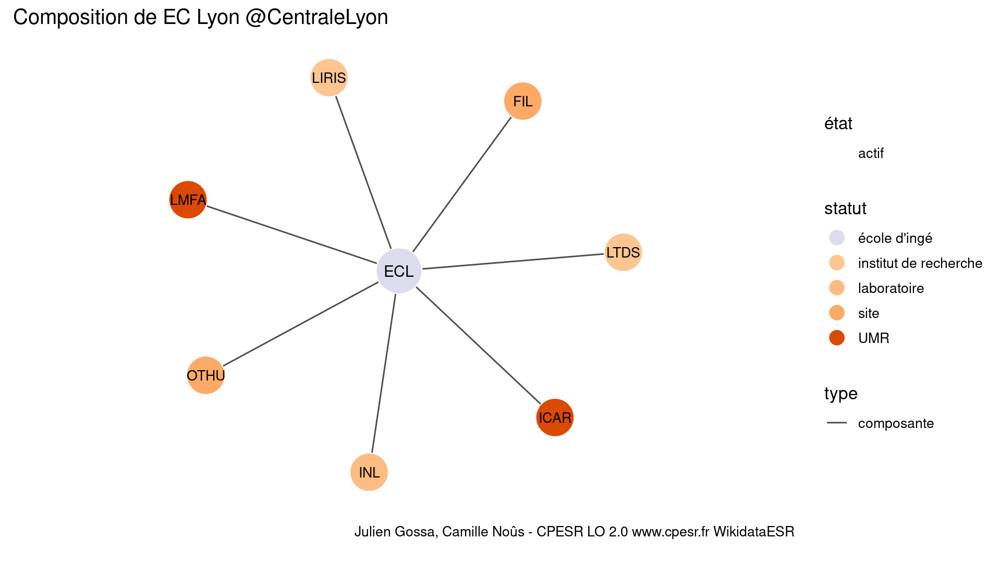 

Avertissements et édition : [logs](plots/etablissements/Q10177.md) 

### EC Lyon @CentraleLyon : Associations 

- url:Edition des données : https://github.com/cpesr/wikidataESR/blob/master/plots/etablissements/Q10177.md 

 

Avertissements et édition : [logs](plots/etablissements/Q10177.md) 

### ECM @CentraleMars : Histoire 

- url:Edition des données : https://github.com/cpesr/wikidataESR/blob/master/plots/etablissements/Q273454.md 

 

Avertissements et édition : [logs](plots/etablissements/Q273454.md) 

### ECM @CentraleMars : Composition 

- url:Edition des données : https://github.com/cpesr/wikidataESR/blob/master/plots/etablissements/Q273454.md 

 

Avertissements et édition : [logs](plots/etablissements/Q273454.md) 

### ECM @CentraleMars : Associations 

- url:Edition des données : https://github.com/cpesr/wikidataESR/blob/master/plots/etablissements/Q273454.md 

 

Avertissements et édition : [logs](plots/etablissements/Q273454.md) 

### Centrale nantes @CentraleNantes : Histoire 

- url:Edition des données : https://github.com/cpesr/wikidataESR/blob/master/plots/etablissements/Q273458.md 


Erreur : les données sont probablement trop partielles.
```
Error in wdesr_ggplot_graph(df, node_size = node_size, label_sizes = label_sizes, : Empty ESR graph: something went wrong with the graph production parameters

``` 

Avertissements et édition : [logs](plots/etablissements/Q273458.md) 

### Centrale nantes @CentraleNantes : Composition 

- url:Edition des données : https://github.com/cpesr/wikidataESR/blob/master/plots/etablissements/Q273458.md 

 

Avertissements et édition : [logs](plots/etablissements/Q273458.md) 

### Centrale nantes @CentraleNantes : Associations 

- url:Edition des données : https://github.com/cpesr/wikidataESR/blob/master/plots/etablissements/Q273458.md 

 

Avertissements et édition : [logs](plots/etablissements/Q273458.md) 

### CentraleSupelec NA : Histoire 

- url:Edition des données : https://github.com/cpesr/wikidataESR/blob/master/plots/etablissements/Q19203245.md 


Erreur : les données sont probablement trop partielles.
```
Error in wdesr_ggplot_graph(df, node_size = node_size, label_sizes = label_sizes, : Empty ESR graph: something went wrong with the graph production parameters

``` 

Avertissements et édition : [logs](plots/etablissements/Q19203245.md) 

### CentraleSupelec NA : Composition 

- url:Edition des données : https://github.com/cpesr/wikidataESR/blob/master/plots/etablissements/Q19203245.md 

 

Avertissements et édition : [logs](plots/etablissements/Q19203245.md) 

### CentraleSupelec NA : Associations 

- url:Edition des données : https://github.com/cpesr/wikidataESR/blob/master/plots/etablissements/Q19203245.md 

 

Avertissements et édition : [logs](plots/etablissements/Q19203245.md) 

### ENS Chimie de Paris NA : Histoire 

- url:Edition des données : https://github.com/cpesr/wikidataESR/blob/master/plots/etablissements/Q2963665.md 


Erreur : les données sont probablement trop partielles.
```
Error in wdesr_ggplot_graph(df, node_size = node_size, label_sizes = label_sizes, : Empty ESR graph: something went wrong with the graph production parameters

``` 

Avertissements et édition : [logs](plots/etablissements/Q2963665.md) 

### ENS Chimie de Paris NA : Composition 

- url:Edition des données : https://github.com/cpesr/wikidataESR/blob/master/plots/etablissements/Q2963665.md 

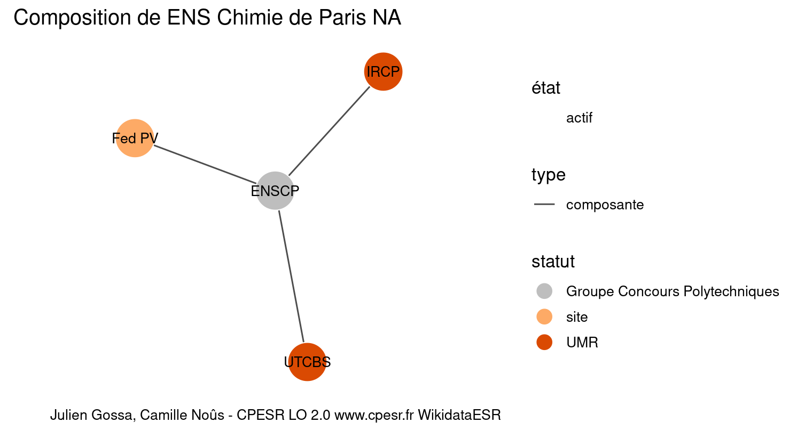 

Avertissements et édition : [logs](plots/etablissements/Q2963665.md) 

### ENS Chimie de Paris NA : Associations 

- url:Edition des données : https://github.com/cpesr/wikidataESR/blob/master/plots/etablissements/Q2963665.md 

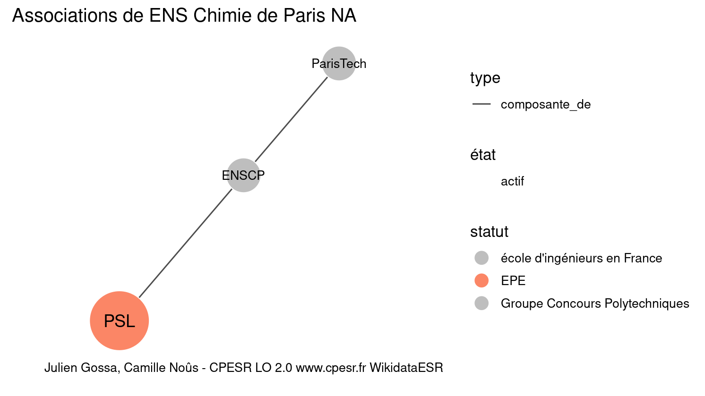 

Avertissements et édition : [logs](plots/etablissements/Q2963665.md) 

### CNAM @LeCnam : Histoire 

- url:Edition des données : https://github.com/cpesr/wikidataESR/blob/master/plots/etablissements/Q524289.md 


Erreur : les données sont probablement trop partielles.
```
Error in wdesr_ggplot_graph(df, node_size = node_size, label_sizes = label_sizes, : Empty ESR graph: something went wrong with the graph production parameters

``` 

Avertissements et édition : [logs](plots/etablissements/Q524289.md) 

### CNAM @LeCnam : Composition 

- url:Edition des données : https://github.com/cpesr/wikidataESR/blob/master/plots/etablissements/Q524289.md 

 

Avertissements et édition : [logs](plots/etablissements/Q524289.md) 

### CNAM @LeCnam : Associations 

- url:Edition des données : https://github.com/cpesr/wikidataESR/blob/master/plots/etablissements/Q524289.md 

 

Avertissements et édition : [logs](plots/etablissements/Q524289.md) 

### ENIB @ENIB_INFO : Histoire 

- url:Edition des données : https://github.com/cpesr/wikidataESR/blob/master/plots/etablissements/Q273564.md 


Erreur : les données sont probablement trop partielles.
```
Error in wdesr_ggplot_graph(df, node_size = node_size, label_sizes = label_sizes, : Empty ESR graph: something went wrong with the graph production parameters

``` 

Avertissements et édition : [logs](plots/etablissements/Q273564.md) 

### ENIB @ENIB_INFO : Composition 

- url:Edition des données : https://github.com/cpesr/wikidataESR/blob/master/plots/etablissements/Q273564.md 

 

Avertissements et édition : [logs](plots/etablissements/Q273564.md) 

### ENIB @ENIB_INFO : Associations 

- url:Edition des données : https://github.com/cpesr/wikidataESR/blob/master/plots/etablissements/Q273564.md 


Erreur : les données sont probablement trop partielles.
```
Error in wdesr_ggplot_graph(df, node_size = node_size, label_sizes = label_sizes, : Empty ESR graph: something went wrong with the graph production parameters

``` 

Avertissements et édition : [logs](plots/etablissements/Q273564.md) 

### ENI Tarbes @ENITarbes : Histoire 

- url:Edition des données : https://github.com/cpesr/wikidataESR/blob/master/plots/etablissements/Q3578096.md 


Erreur : les données sont probablement trop partielles.
```
Error in wdesr_ggplot_graph(df, node_size = node_size, label_sizes = label_sizes, : Empty ESR graph: something went wrong with the graph production parameters

``` 

Avertissements et édition : [logs](plots/etablissements/Q3578096.md) 

### ENI Tarbes @ENITarbes : Composition 

- url:Edition des données : https://github.com/cpesr/wikidataESR/blob/master/plots/etablissements/Q3578096.md 

 

Avertissements et édition : [logs](plots/etablissements/Q3578096.md) 

### ENI Tarbes @ENITarbes : Associations 

- url:Edition des données : https://github.com/cpesr/wikidataESR/blob/master/plots/etablissements/Q3578096.md 


Erreur : les données sont probablement trop partielles.
```
Error in wdesr_ggplot_graph(df, node_size = node_size, label_sizes = label_sizes, : Empty ESR graph: something went wrong with the graph production parameters

``` 

Avertissements et édition : [logs](plots/etablissements/Q3578096.md) 

### ENSIIE @ensiie : Histoire 

- url:Edition des données : https://github.com/cpesr/wikidataESR/blob/master/plots/etablissements/Q3578204.md 


Erreur : les données sont probablement trop partielles.
```
Error in wdesr_ggplot_graph(df, node_size = node_size, label_sizes = label_sizes, : Empty ESR graph: something went wrong with the graph production parameters

``` 

Avertissements et édition : [logs](plots/etablissements/Q3578204.md) 

### ENSIIE @ensiie : Composition 

- url:Edition des données : https://github.com/cpesr/wikidataESR/blob/master/plots/etablissements/Q3578204.md 

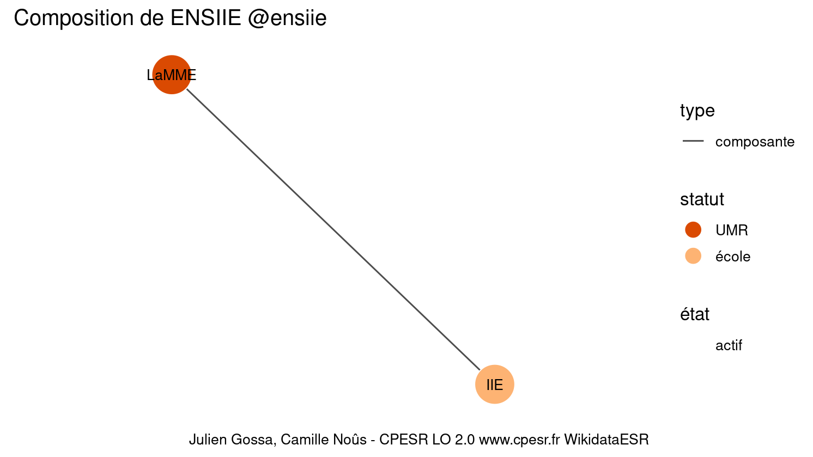 

Avertissements et édition : [logs](plots/etablissements/Q3578204.md) 

### ENSIIE @ensiie : Associations 

- url:Edition des données : https://github.com/cpesr/wikidataESR/blob/master/plots/etablissements/Q3578204.md 


Erreur : les données sont probablement trop partielles.
```
Error in wdesr_ggplot_graph(df, node_size = node_size, label_sizes = label_sizes, : Empty ESR graph: something went wrong with the graph production parameters

``` 

Avertissements et édition : [logs](plots/etablissements/Q3578204.md) 

### ENSI Caen @ENSICAEN : Histoire 

- url:Edition des données : https://github.com/cpesr/wikidataESR/blob/master/plots/etablissements/Q3578208.md 


Erreur : les données sont probablement trop partielles.
```
Error in wdesr_ggplot_graph(df, node_size = node_size, label_sizes = label_sizes, : Empty ESR graph: something went wrong with the graph production parameters

``` 

Avertissements et édition : [logs](plots/etablissements/Q3578208.md) 

### ENSI Caen @ENSICAEN : Composition 

- url:Edition des données : https://github.com/cpesr/wikidataESR/blob/master/plots/etablissements/Q3578208.md 

 

Avertissements et édition : [logs](plots/etablissements/Q3578208.md) 

### ENSI Caen @ENSICAEN : Associations 

- url:Edition des données : https://github.com/cpesr/wikidataESR/blob/master/plots/etablissements/Q3578208.md 

 

Avertissements et édition : [logs](plots/etablissements/Q3578208.md) 

### ENS Chimie Montpellier @enscmchimiemtp : Histoire 

- url:Edition des données : https://github.com/cpesr/wikidataESR/blob/master/plots/etablissements/Q948420.md 


Erreur : les données sont probablement trop partielles.
```
Error in wdesr_ggplot_graph(df, node_size = node_size, label_sizes = label_sizes, : Empty ESR graph: something went wrong with the graph production parameters

``` 

Avertissements et édition : [logs](plots/etablissements/Q948420.md) 

### ENS Chimie Montpellier @enscmchimiemtp : Composition 

- url:Edition des données : https://github.com/cpesr/wikidataESR/blob/master/plots/etablissements/Q948420.md 

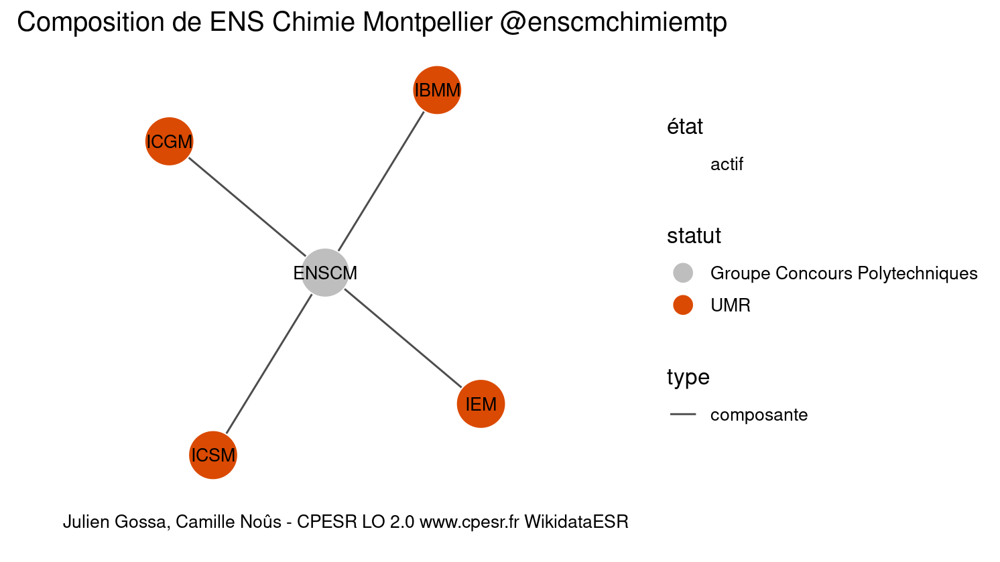 

Avertissements et édition : [logs](plots/etablissements/Q948420.md) 

### ENS Chimie Montpellier @enscmchimiemtp : Associations 

- url:Edition des données : https://github.com/cpesr/wikidataESR/blob/master/plots/etablissements/Q948420.md 

 

Avertissements et édition : [logs](plots/etablissements/Q948420.md) 

### ENSCR @ENSCR : Histoire 

- url:Edition des données : https://github.com/cpesr/wikidataESR/blob/master/plots/etablissements/Q3578223.md 


Erreur : les données sont probablement trop partielles.
```
Error in wdesr_ggplot_graph(df, node_size = node_size, label_sizes = label_sizes, : Empty ESR graph: something went wrong with the graph production parameters

``` 

Avertissements et édition : [logs](plots/etablissements/Q3578223.md) 

### ENSCR @ENSCR : Composition 

- url:Edition des données : https://github.com/cpesr/wikidataESR/blob/master/plots/etablissements/Q3578223.md 

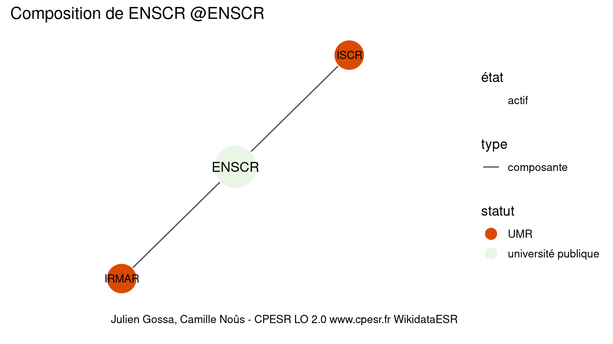 

Avertissements et édition : [logs](plots/etablissements/Q3578223.md) 

### ENSCR @ENSCR : Associations 

- url:Edition des données : https://github.com/cpesr/wikidataESR/blob/master/plots/etablissements/Q3578223.md 


Erreur : les données sont probablement trop partielles.
```
Error in wdesr_ggplot_graph(df, node_size = node_size, label_sizes = label_sizes, : Empty ESR graph: something went wrong with the graph production parameters

``` 

Avertissements et édition : [logs](plots/etablissements/Q3578223.md) 

### ENSEA @ensea1 : Histoire 

- url:Edition des données : https://github.com/cpesr/wikidataESR/blob/master/plots/etablissements/Q2707341.md 


Erreur : les données sont probablement trop partielles.
```
Error in wdesr_ggplot_graph(df, node_size = node_size, label_sizes = label_sizes, : Empty ESR graph: something went wrong with the graph production parameters

``` 

Avertissements et édition : [logs](plots/etablissements/Q2707341.md) 

### ENSEA @ensea1 : Composition 

- url:Edition des données : https://github.com/cpesr/wikidataESR/blob/master/plots/etablissements/Q2707341.md 

 

Avertissements et édition : [logs](plots/etablissements/Q2707341.md) 

### ENSEA @ensea1 : Associations 

- url:Edition des données : https://github.com/cpesr/wikidataESR/blob/master/plots/etablissements/Q2707341.md 

 

Avertissements et édition : [logs](plots/etablissements/Q2707341.md) 

### ISAE-ENSMA @isae_ensma : Histoire 

- url:Edition des données : https://github.com/cpesr/wikidataESR/blob/master/plots/etablissements/Q391044.md 


Erreur : les données sont probablement trop partielles.
```
Error in wdesr_ggplot_graph(df, node_size = node_size, label_sizes = label_sizes, : Empty ESR graph: something went wrong with the graph production parameters

``` 

Avertissements et édition : [logs](plots/etablissements/Q391044.md) 

### ISAE-ENSMA @isae_ensma : Composition 

- url:Edition des données : https://github.com/cpesr/wikidataESR/blob/master/plots/etablissements/Q391044.md 

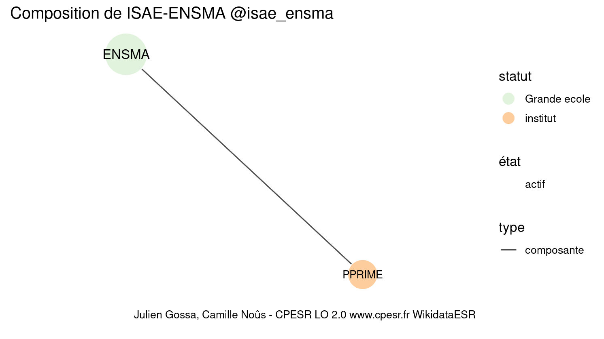 

Avertissements et édition : [logs](plots/etablissements/Q391044.md) 

### ISAE-ENSMA @isae_ensma : Associations 

- url:Edition des données : https://github.com/cpesr/wikidataESR/blob/master/plots/etablissements/Q391044.md 

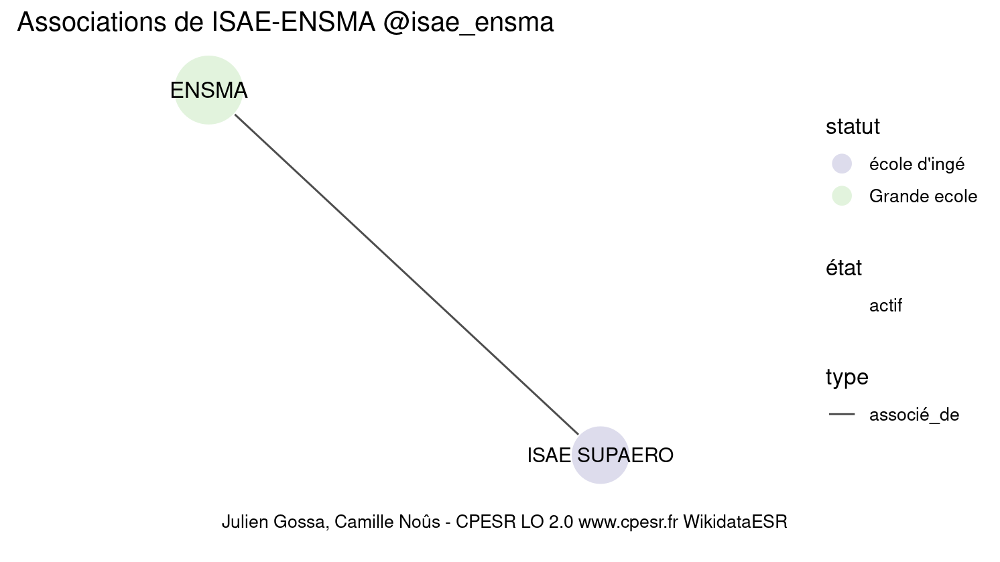 

Avertissements et édition : [logs](plots/etablissements/Q391044.md) 

### ENS2M @ENSMMOfficiel : Histoire 

- url:Edition des données : https://github.com/cpesr/wikidataESR/blob/master/plots/etablissements/Q3578235.md 


Erreur : les données sont probablement trop partielles.
```
Error in wdesr_ggplot_graph(df, node_size = node_size, label_sizes = label_sizes, : Empty ESR graph: something went wrong with the graph production parameters

``` 

Avertissements et édition : [logs](plots/etablissements/Q3578235.md) 

### ENS2M @ENSMMOfficiel : Composition 

- url:Edition des données : https://github.com/cpesr/wikidataESR/blob/master/plots/etablissements/Q3578235.md 

 

Avertissements et édition : [logs](plots/etablissements/Q3578235.md) 

### ENS2M @ENSMMOfficiel : Associations 

- url:Edition des données : https://github.com/cpesr/wikidataESR/blob/master/plots/etablissements/Q3578235.md 


Erreur : les données sont probablement trop partielles.
```
Error in wdesr_ggplot_graph(df, node_size = node_size, label_sizes = label_sizes, : Empty ESR graph: something went wrong with the graph production parameters

``` 

Avertissements et édition : [logs](plots/etablissements/Q3578235.md) 

### INSA CVL @insacvl : Histoire 

- url:Edition des données : https://github.com/cpesr/wikidataESR/blob/master/plots/etablissements/Q15651478.md 


Erreur : les données sont probablement trop partielles.
```
Error in wdesr_ggplot_graph(df, node_size = node_size, label_sizes = label_sizes, : Empty ESR graph: something went wrong with the graph production parameters

``` 

Avertissements et édition : [logs](plots/etablissements/Q15651478.md) 

### INSA CVL @insacvl : Composition 

- url:Edition des données : https://github.com/cpesr/wikidataESR/blob/master/plots/etablissements/Q15651478.md 


Erreur : les données sont probablement trop partielles.
```
Error in wdesr_ggplot_graph(df, node_size = node_size, label_sizes = label_sizes, : Empty ESR graph: something went wrong with the graph production parameters

``` 

Avertissements et édition : [logs](plots/etablissements/Q15651478.md) 

### INSA CVL @insacvl : Associations 

- url:Edition des données : https://github.com/cpesr/wikidataESR/blob/master/plots/etablissements/Q15651478.md 


Erreur : les données sont probablement trop partielles.
```
Error in wdesr_ggplot_graph(df, node_size = node_size, label_sizes = label_sizes, : Empty ESR graph: something went wrong with the graph production parameters

``` 

Avertissements et édition : [logs](plots/etablissements/Q15651478.md) 

### INSA Lyon @insadelyon : Histoire 

- url:Edition des données : https://github.com/cpesr/wikidataESR/blob/master/plots/etablissements/Q1633859.md 


Erreur : les données sont probablement trop partielles.
```
Error in wdesr_ggplot_graph(df, node_size = node_size, label_sizes = label_sizes, : Empty ESR graph: something went wrong with the graph production parameters

``` 

Avertissements et édition : [logs](plots/etablissements/Q1633859.md) 

### INSA Lyon @insadelyon : Composition 

- url:Edition des données : https://github.com/cpesr/wikidataESR/blob/master/plots/etablissements/Q1633859.md 

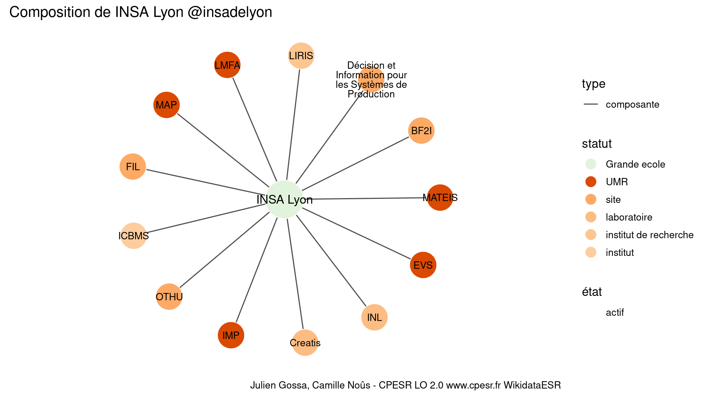 

Avertissements et édition : [logs](plots/etablissements/Q1633859.md) 

### INSA Lyon @insadelyon : Associations 

- url:Edition des données : https://github.com/cpesr/wikidataESR/blob/master/plots/etablissements/Q1633859.md 

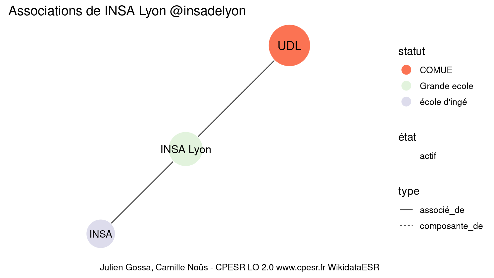 

Avertissements et édition : [logs](plots/etablissements/Q1633859.md) 

### INSA Rennes @INSA_Rennes : Histoire 

- url:Edition des données : https://github.com/cpesr/wikidataESR/blob/master/plots/etablissements/Q1934614.md 


Erreur : les données sont probablement trop partielles.
```
Error in wdesr_ggplot_graph(df, node_size = node_size, label_sizes = label_sizes, : Empty ESR graph: something went wrong with the graph production parameters

``` 

Avertissements et édition : [logs](plots/etablissements/Q1934614.md) 

### INSA Rennes @INSA_Rennes : Composition 

- url:Edition des données : https://github.com/cpesr/wikidataESR/blob/master/plots/etablissements/Q1934614.md 

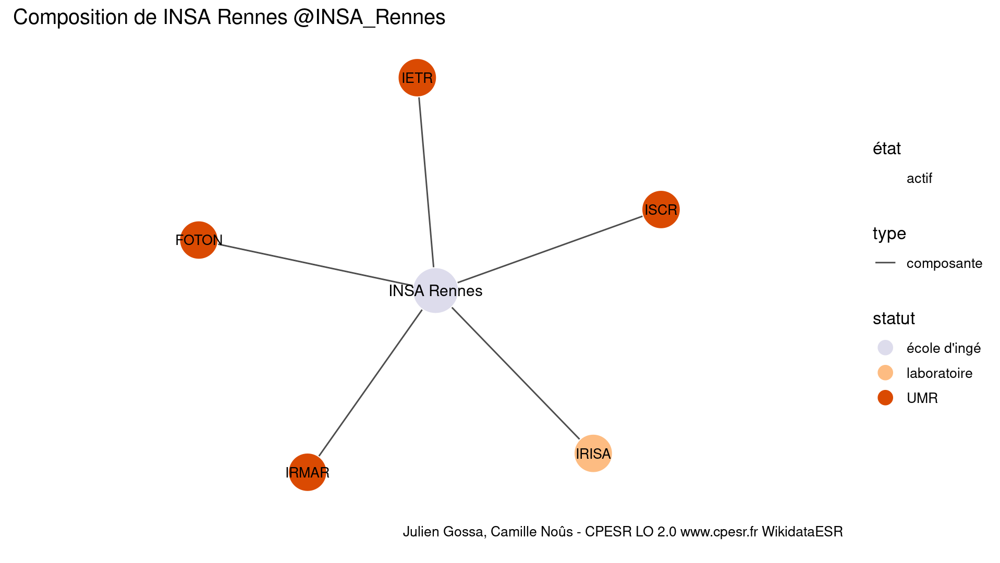 

Avertissements et édition : [logs](plots/etablissements/Q1934614.md) 

### INSA Rennes @INSA_Rennes : Associations 

- url:Edition des données : https://github.com/cpesr/wikidataESR/blob/master/plots/etablissements/Q1934614.md 


Erreur : les données sont probablement trop partielles.
```
Error in wdesr_ggplot_graph(df, node_size = node_size, label_sizes = label_sizes, : Empty ESR graph: something went wrong with the graph production parameters

``` 

Avertissements et édition : [logs](plots/etablissements/Q1934614.md) 

### INSA Rouen Normandie @insarouen : Histoire 

- url:Edition des données : https://github.com/cpesr/wikidataESR/blob/master/plots/etablissements/Q1665112.md 


Erreur : les données sont probablement trop partielles.
```
Error in wdesr_ggplot_graph(df, node_size = node_size, label_sizes = label_sizes, : Empty ESR graph: something went wrong with the graph production parameters

``` 

Avertissements et édition : [logs](plots/etablissements/Q1665112.md) 

### INSA Rouen Normandie @insarouen : Composition 

- url:Edition des données : https://github.com/cpesr/wikidataESR/blob/master/plots/etablissements/Q1665112.md 

 

Avertissements et édition : [logs](plots/etablissements/Q1665112.md) 

### INSA Rouen Normandie @insarouen : Associations 

- url:Edition des données : https://github.com/cpesr/wikidataESR/blob/master/plots/etablissements/Q1665112.md 

 

Avertissements et édition : [logs](plots/etablissements/Q1665112.md) 

### INSA Strasbourg @Insa_Strasbourg : Histoire 

- url:Edition des données : https://github.com/cpesr/wikidataESR/blob/master/plots/etablissements/Q521036.md 


Erreur : les données sont probablement trop partielles.
```
Error in wdesr_ggplot_graph(df, node_size = node_size, label_sizes = label_sizes, : Empty ESR graph: something went wrong with the graph production parameters

``` 

Avertissements et édition : [logs](plots/etablissements/Q521036.md) 

### INSA Strasbourg @Insa_Strasbourg : Composition 

- url:Edition des données : https://github.com/cpesr/wikidataESR/blob/master/plots/etablissements/Q521036.md 

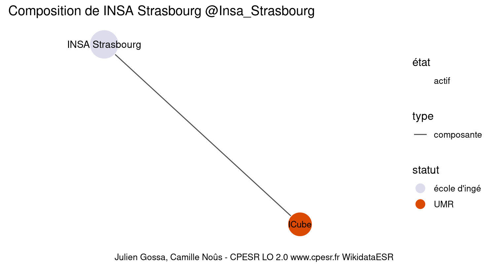 

Avertissements et édition : [logs](plots/etablissements/Q521036.md) 

### INSA Strasbourg @Insa_Strasbourg : Associations 

- url:Edition des données : https://github.com/cpesr/wikidataESR/blob/master/plots/etablissements/Q521036.md 

 

Avertissements et édition : [logs](plots/etablissements/Q521036.md) 

### INSA Toulouse @INSAToulouse : Histoire 

- url:Edition des données : https://github.com/cpesr/wikidataESR/blob/master/plots/etablissements/Q858979.md 


Erreur : les données sont probablement trop partielles.
```
Error in wdesr_ggplot_graph(df, node_size = node_size, label_sizes = label_sizes, : Empty ESR graph: something went wrong with the graph production parameters

``` 

Avertissements et édition : [logs](plots/etablissements/Q858979.md) 

### INSA Toulouse @INSAToulouse : Composition 

- url:Edition des données : https://github.com/cpesr/wikidataESR/blob/master/plots/etablissements/Q858979.md 

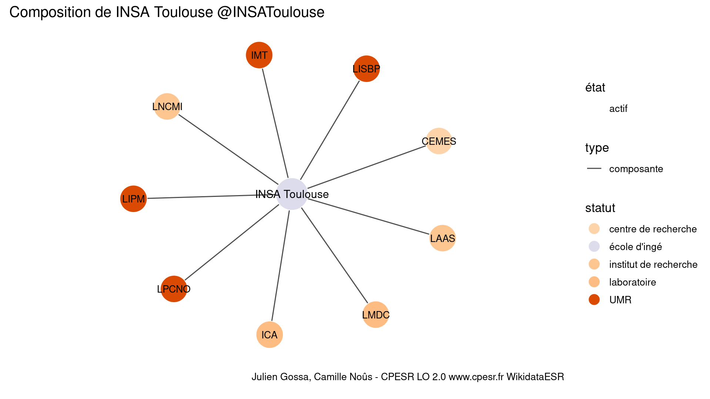 

Avertissements et édition : [logs](plots/etablissements/Q858979.md) 

### INSA Toulouse @INSAToulouse : Associations 

- url:Edition des données : https://github.com/cpesr/wikidataESR/blob/master/plots/etablissements/Q858979.md 

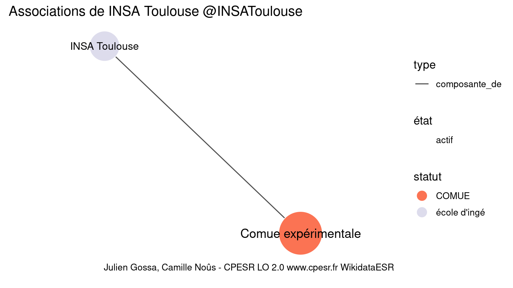 

Avertissements et édition : [logs](plots/etablissements/Q858979.md) 

### INPG NA : Histoire 

- url:Edition des données : https://github.com/cpesr/wikidataESR/blob/master/plots/etablissements/Q1665121.md 


Erreur : les données sont probablement trop partielles.
```
Error in wdesr_ggplot_graph(df, node_size = node_size, label_sizes = label_sizes, : Empty ESR graph: something went wrong with the graph production parameters

``` 

Avertissements et édition : [logs](plots/etablissements/Q1665121.md) 

### INPG NA : Composition 

- url:Edition des données : https://github.com/cpesr/wikidataESR/blob/master/plots/etablissements/Q1665121.md 

 

Avertissements et édition : [logs](plots/etablissements/Q1665121.md) 

### INPG NA : Associations 

- url:Edition des données : https://github.com/cpesr/wikidataESR/blob/master/plots/etablissements/Q1665121.md 


Erreur : les données sont probablement trop partielles.
```
Error in wdesr_ggplot_graph(df, node_size = node_size, label_sizes = label_sizes, : Empty ESR graph: something went wrong with the graph production parameters

``` 

Avertissements et édition : [logs](plots/etablissements/Q1665121.md) 

### supméca @supmeca : Histoire 

- url:Edition des données : https://github.com/cpesr/wikidataESR/blob/master/plots/etablissements/Q1267711.md 


Erreur : les données sont probablement trop partielles.
```
Error in wdesr_ggplot_graph(df, node_size = node_size, label_sizes = label_sizes, : Empty ESR graph: something went wrong with the graph production parameters

``` 

Avertissements et édition : [logs](plots/etablissements/Q1267711.md) 

### supméca @supmeca : Composition 

- url:Edition des données : https://github.com/cpesr/wikidataESR/blob/master/plots/etablissements/Q1267711.md 


Erreur : les données sont probablement trop partielles.
```
Error in wdesr_ggplot_graph(df, node_size = node_size, label_sizes = label_sizes, : Empty ESR graph: something went wrong with the graph production parameters

``` 

Avertissements et édition : [logs](plots/etablissements/Q1267711.md) 

### supméca @supmeca : Associations 

- url:Edition des données : https://github.com/cpesr/wikidataESR/blob/master/plots/etablissements/Q1267711.md 


Erreur : les données sont probablement trop partielles.
```
Error in wdesr_ggplot_graph(df, node_size = node_size, label_sizes = label_sizes, : Empty ESR graph: something went wrong with the graph production parameters

``` 

Avertissements et édition : [logs](plots/etablissements/Q1267711.md) 

### INPT @INP_Toulouse : Histoire 

- url:Edition des données : https://github.com/cpesr/wikidataESR/blob/master/plots/etablissements/Q3152453.md 


Erreur : les données sont probablement trop partielles.
```
Error in wdesr_ggplot_graph(df, node_size = node_size, label_sizes = label_sizes, : Empty ESR graph: something went wrong with the graph production parameters

``` 

Avertissements et édition : [logs](plots/etablissements/Q3152453.md) 

### INPT @INP_Toulouse : Composition 

- url:Edition des données : https://github.com/cpesr/wikidataESR/blob/master/plots/etablissements/Q3152453.md 

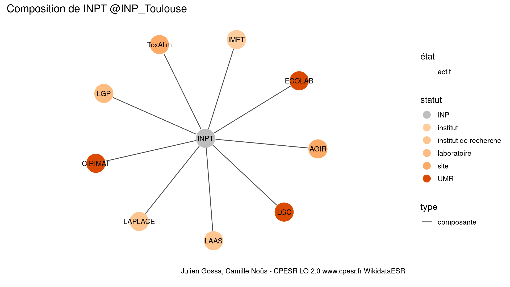 

Avertissements et édition : [logs](plots/etablissements/Q3152453.md) 

### INPT @INP_Toulouse : Associations 

- url:Edition des données : https://github.com/cpesr/wikidataESR/blob/master/plots/etablissements/Q3152453.md 


Erreur : les données sont probablement trop partielles.
```
Error in query(url, "pcontent", clean_response, query_param = query_param, : The API returned an error: missingtitle - The page you specified doesn't exist.

``` 

Avertissements et édition : [logs](plots/etablissements/Q3152453.md) 

### UTBM @utbm_fr : Histoire 

- url:Edition des données : https://github.com/cpesr/wikidataESR/blob/master/plots/etablissements/Q2399264.md 


Erreur : les données sont probablement trop partielles.
```
Error in wdesr_ggplot_graph(df, node_size = node_size, label_sizes = label_sizes, : Empty ESR graph: something went wrong with the graph production parameters

``` 

Avertissements et édition : [logs](plots/etablissements/Q2399264.md) 

### UTBM @utbm_fr : Composition 

- url:Edition des données : https://github.com/cpesr/wikidataESR/blob/master/plots/etablissements/Q2399264.md 

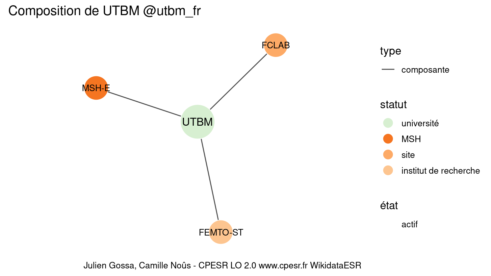 

Avertissements et édition : [logs](plots/etablissements/Q2399264.md) 

### UTBM @utbm_fr : Associations 

- url:Edition des données : https://github.com/cpesr/wikidataESR/blob/master/plots/etablissements/Q2399264.md 


Erreur : les données sont probablement trop partielles.
```
Error in wdesr_ggplot_graph(df, node_size = node_size, label_sizes = label_sizes, : Empty ESR graph: something went wrong with the graph production parameters

``` 

Avertissements et édition : [logs](plots/etablissements/Q2399264.md) 

### UTC @utc_compiegne : Histoire 

- url:Edition des données : https://github.com/cpesr/wikidataESR/blob/master/plots/etablissements/Q622906.md 


Erreur : les données sont probablement trop partielles.
```
Error in wdesr_ggplot_graph(df, node_size = node_size, label_sizes = label_sizes, : Empty ESR graph: something went wrong with the graph production parameters

``` 

Avertissements et édition : [logs](plots/etablissements/Q622906.md) 

### UTC @utc_compiegne : Composition 

- url:Edition des données : https://github.com/cpesr/wikidataESR/blob/master/plots/etablissements/Q622906.md 

 

Avertissements et édition : [logs](plots/etablissements/Q622906.md) 

### UTC @utc_compiegne : Associations 

- url:Edition des données : https://github.com/cpesr/wikidataESR/blob/master/plots/etablissements/Q622906.md 


Erreur : les données sont probablement trop partielles.
```
Error in wdesr_ggplot_graph(df, node_size = node_size, label_sizes = label_sizes, : Empty ESR graph: something went wrong with the graph production parameters

``` 

Avertissements et édition : [logs](plots/etablissements/Q622906.md) 

### UTT @UTTroyes : Histoire 

- url:Edition des données : https://github.com/cpesr/wikidataESR/blob/master/plots/etablissements/Q1037208.md 


Erreur : les données sont probablement trop partielles.
```
Error in wdesr_ggplot_graph(df, node_size = node_size, label_sizes = label_sizes, : Empty ESR graph: something went wrong with the graph production parameters

``` 

Avertissements et édition : [logs](plots/etablissements/Q1037208.md) 

### UTT @UTTroyes : Composition 

- url:Edition des données : https://github.com/cpesr/wikidataESR/blob/master/plots/etablissements/Q1037208.md 

 

Avertissements et édition : [logs](plots/etablissements/Q1037208.md) 

### UTT @UTTroyes : Associations 

- url:Edition des données : https://github.com/cpesr/wikidataESR/blob/master/plots/etablissements/Q1037208.md 

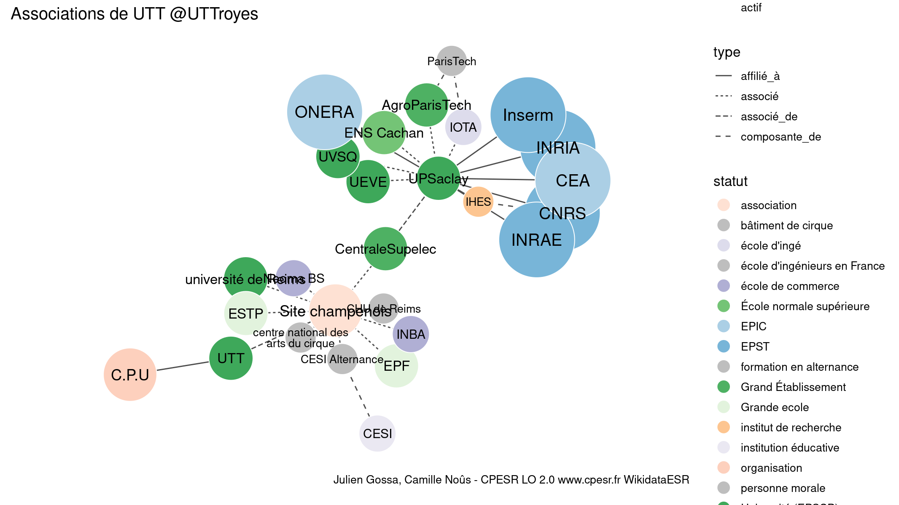 

Avertissements et édition : [logs](plots/etablissements/Q1037208.md) 

## Regroupements 

### Association Université de Lorraine : Histoire 

- url:Edition des données : https://github.com/cpesr/wikidataESR/blob/master/plots/regroupements/Q61718100.md 


Erreur : les données sont probablement trop partielles.
```
Error in wdesr_ggplot_graph(df, node_size = node_size, label_sizes = label_sizes, : Empty ESR graph: something went wrong with the graph production parameters

``` 

Avertissements et édition : [logs](plots/regroupements/Q61718100.md) 

### Association Université de Lorraine : Regroupement Court 

- url:Edition des données : https://github.com/cpesr/wikidataESR/blob/master/plots/regroupements/Q61718100.md 

 

Avertissements et édition : [logs](plots/regroupements/Q61718100.md) 

### Association Université de Lorraine : Regroupement Etendu 

- url:Edition des données : https://github.com/cpesr/wikidataESR/blob/master/plots/regroupements/Q61718100.md 

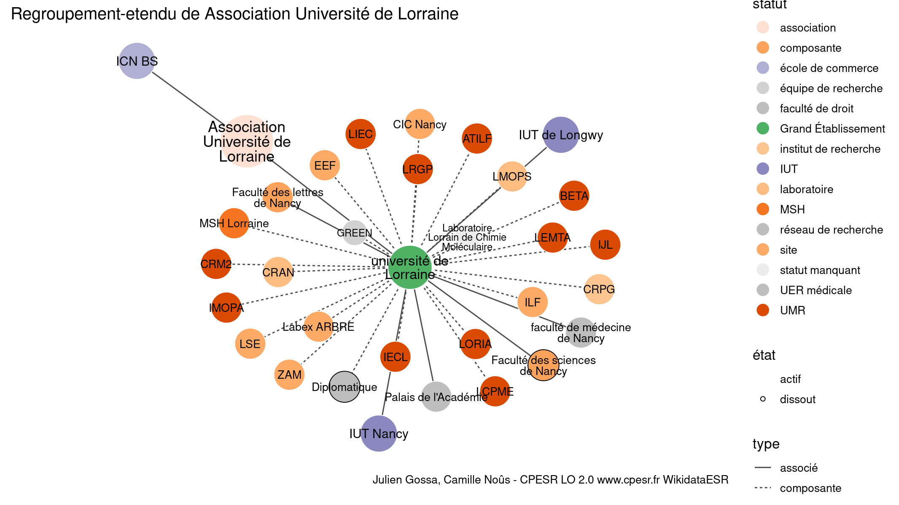 

Avertissements et édition : [logs](plots/regroupements/Q61718100.md) 

### Association Université de Lorraine : Regroupement Superetendu 

- url:Edition des données : https://github.com/cpesr/wikidataESR/blob/master/plots/regroupements/Q61718100.md 

 

Avertissements et édition : [logs](plots/regroupements/Q61718100.md) 

### Picardie Universités : Histoire 

- url:Edition des données : https://github.com/cpesr/wikidataESR/blob/master/plots/regroupements/Q61716197.md 


Erreur : les données sont probablement trop partielles.
```
Error in wdesr_ggplot_graph(df, node_size = node_size, label_sizes = label_sizes, : Empty ESR graph: something went wrong with the graph production parameters

``` 

Avertissements et édition : [logs](plots/regroupements/Q61716197.md) 

### Picardie Universités : Regroupement Court 

- url:Edition des données : https://github.com/cpesr/wikidataESR/blob/master/plots/regroupements/Q61716197.md 

 

Avertissements et édition : [logs](plots/regroupements/Q61716197.md) 

### Picardie Universités : Regroupement Etendu 

- url:Edition des données : https://github.com/cpesr/wikidataESR/blob/master/plots/regroupements/Q61716197.md 

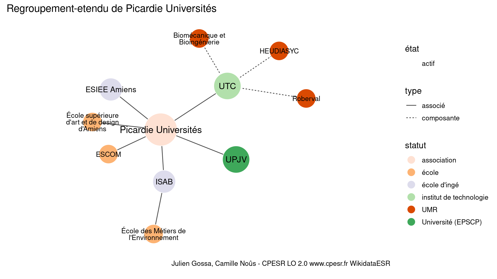 

Avertissements et édition : [logs](plots/regroupements/Q61716197.md) 

### Picardie Universités : Regroupement Superetendu 

- url:Edition des données : https://github.com/cpesr/wikidataESR/blob/master/plots/regroupements/Q61716197.md 

 

Avertissements et édition : [logs](plots/regroupements/Q61716197.md) 

### Site AMPM : Histoire 

- url:Edition des données : https://github.com/cpesr/wikidataESR/blob/master/plots/regroupements/Q61716142.md 


Erreur : les données sont probablement trop partielles.
```
Error in wdesr_ggplot_graph(df, node_size = node_size, label_sizes = label_sizes, : Empty ESR graph: something went wrong with the graph production parameters

``` 

Avertissements et édition : [logs](plots/regroupements/Q61716142.md) 

### Site AMPM : Regroupement Court 

- url:Edition des données : https://github.com/cpesr/wikidataESR/blob/master/plots/regroupements/Q61716142.md 

 

Avertissements et édition : [logs](plots/regroupements/Q61716142.md) 

### Site AMPM : Regroupement Etendu 

- url:Edition des données : https://github.com/cpesr/wikidataESR/blob/master/plots/regroupements/Q61716142.md 

 

Avertissements et édition : [logs](plots/regroupements/Q61716142.md) 

### Site AMPM : Regroupement Superetendu 

- url:Edition des données : https://github.com/cpesr/wikidataESR/blob/master/plots/regroupements/Q61716142.md 


Erreur : les données sont probablement trop partielles.
```
Error in ans[npos] <- rep(no, length.out = len)[npos]: l'argument de remplacement est de longueur nulle

``` 

Avertissements et édition : [logs](plots/regroupements/Q61716142.md) 

### Site champenois : Histoire 

- url:Edition des données : https://github.com/cpesr/wikidataESR/blob/master/plots/regroupements/Q61716216.md 


Erreur : les données sont probablement trop partielles.
```
Error in wdesr_ggplot_graph(df, node_size = node_size, label_sizes = label_sizes, : Empty ESR graph: something went wrong with the graph production parameters

``` 

Avertissements et édition : [logs](plots/regroupements/Q61716216.md) 

### Site champenois : Regroupement Court 

- url:Edition des données : https://github.com/cpesr/wikidataESR/blob/master/plots/regroupements/Q61716216.md 

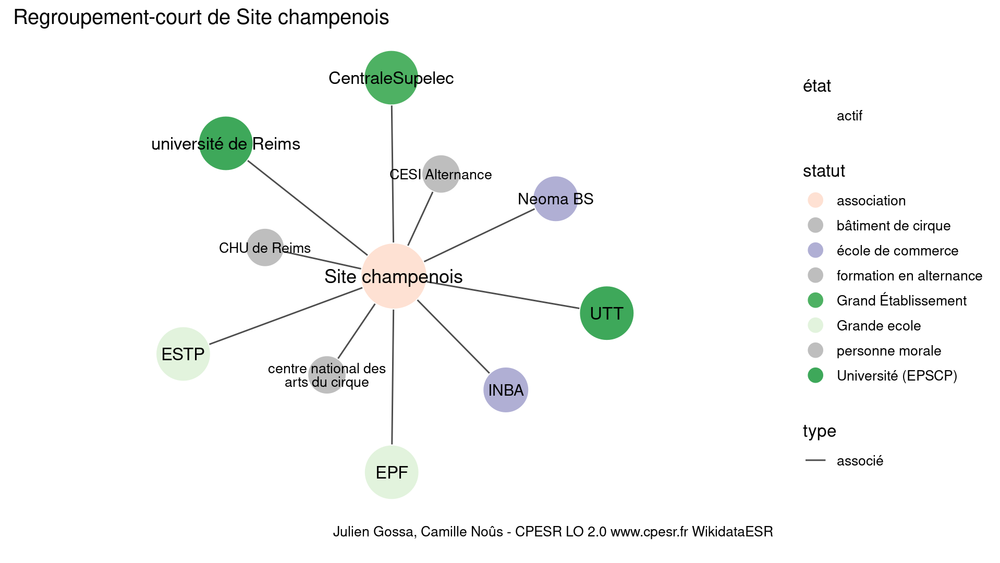 

Avertissements et édition : [logs](plots/regroupements/Q61716216.md) 

### Site champenois : Regroupement Etendu 

- url:Edition des données : https://github.com/cpesr/wikidataESR/blob/master/plots/regroupements/Q61716216.md 

 

Avertissements et édition : [logs](plots/regroupements/Q61716216.md) 

### Site champenois : Regroupement Superetendu 

- url:Edition des données : https://github.com/cpesr/wikidataESR/blob/master/plots/regroupements/Q61716216.md 

 

Avertissements et édition : [logs](plots/regroupements/Q61716216.md) 

### Sorbonne Université : Histoire 

- url:Edition des données : https://github.com/cpesr/wikidataESR/blob/master/plots/regroupements/Q61716212.md 


Erreur : les données sont probablement trop partielles.
```
Error in wdesr_ggplot_graph(df, node_size = node_size, label_sizes = label_sizes, : Empty ESR graph: something went wrong with the graph production parameters

``` 

Avertissements et édition : [logs](plots/regroupements/Q61716212.md) 

### Sorbonne Université : Regroupement Court 

- url:Edition des données : https://github.com/cpesr/wikidataESR/blob/master/plots/regroupements/Q61716212.md 

 

Avertissements et édition : [logs](plots/regroupements/Q61716212.md) 

### Sorbonne Université : Regroupement Etendu 

- url:Edition des données : https://github.com/cpesr/wikidataESR/blob/master/plots/regroupements/Q61716212.md 

 

Avertissements et édition : [logs](plots/regroupements/Q61716212.md) 

### Sorbonne Université : Regroupement Superetendu 

- url:Edition des données : https://github.com/cpesr/wikidataESR/blob/master/plots/regroupements/Q61716212.md 

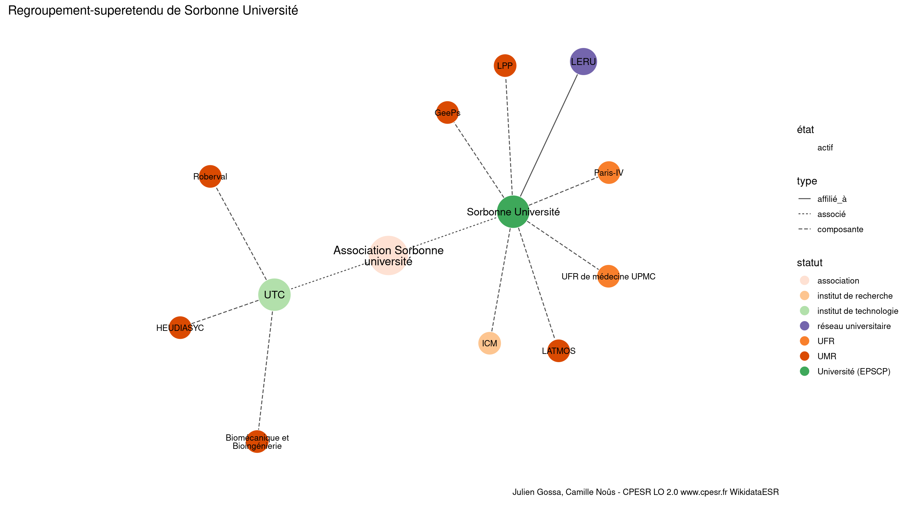 

Avertissements et édition : [logs](plots/regroupements/Q61716212.md) 

### UCA : Histoire 

- url:Edition des données : https://github.com/cpesr/wikidataESR/blob/master/plots/regroupements/Q61716190.md 


Erreur : les données sont probablement trop partielles.
```
Error in wdesr_ggplot_graph(df, node_size = node_size, label_sizes = label_sizes, : Empty ESR graph: something went wrong with the graph production parameters

``` 

Avertissements et édition : [logs](plots/regroupements/Q61716190.md) 

### UCA : Regroupement Court 

- url:Edition des données : https://github.com/cpesr/wikidataESR/blob/master/plots/regroupements/Q61716190.md 

 

Avertissements et édition : [logs](plots/regroupements/Q61716190.md) 

### UCA : Regroupement Etendu 

- url:Edition des données : https://github.com/cpesr/wikidataESR/blob/master/plots/regroupements/Q61716190.md 

 

Avertissements et édition : [logs](plots/regroupements/Q61716190.md) 

### UCA : Regroupement Superetendu 

- url:Edition des données : https://github.com/cpesr/wikidataESR/blob/master/plots/regroupements/Q61716190.md 

 

Avertissements et édition : [logs](plots/regroupements/Q61716190.md) 

### COMUE Angers-Le Mans : Histoire 

- url:Edition des données : https://github.com/cpesr/wikidataESR/blob/master/plots/regroupements/Q104621964.md 


Erreur : les données sont probablement trop partielles.
```
Error in wdesr_ggplot_graph(df, node_size = node_size, label_sizes = label_sizes, : Empty ESR graph: something went wrong with the graph production parameters

``` 

Avertissements et édition : [logs](plots/regroupements/Q104621964.md) 

### COMUE Angers-Le Mans : Regroupement Court 

- url:Edition des données : https://github.com/cpesr/wikidataESR/blob/master/plots/regroupements/Q104621964.md 


Erreur : les données sont probablement trop partielles.
```
Error in wdesr_ggplot_graph(df, node_size = node_size, label_sizes = label_sizes, : Empty ESR graph: something went wrong with the graph production parameters

``` 

Avertissements et édition : [logs](plots/regroupements/Q104621964.md) 

### COMUE Angers-Le Mans : Regroupement Etendu 

- url:Edition des données : https://github.com/cpesr/wikidataESR/blob/master/plots/regroupements/Q104621964.md 


Erreur : les données sont probablement trop partielles.
```
Error in wdesr_ggplot_graph(df, node_size = node_size, label_sizes = label_sizes, : Empty ESR graph: something went wrong with the graph production parameters

``` 

Avertissements et édition : [logs](plots/regroupements/Q104621964.md) 

### COMUE Angers-Le Mans : Regroupement Superetendu 

- url:Edition des données : https://github.com/cpesr/wikidataESR/blob/master/plots/regroupements/Q104621964.md 


Erreur : les données sont probablement trop partielles.
```
Error in wdesr_ggplot_graph(df, node_size = node_size, label_sizes = label_sizes, : Empty ESR graph: something went wrong with the graph production parameters

``` 

Avertissements et édition : [logs](plots/regroupements/Q104621964.md) 

### COMUE Centre Val de Loire : Histoire 

- url:Edition des données : https://github.com/cpesr/wikidataESR/blob/master/plots/regroupements/Q2944885.md 


Erreur : les données sont probablement trop partielles.
```
Error in wdesr_ggplot_graph(df, node_size = node_size, label_sizes = label_sizes, : Empty ESR graph: something went wrong with the graph production parameters

``` 

Avertissements et édition : [logs](plots/regroupements/Q2944885.md) 

### COMUE Centre Val de Loire : Regroupement Court 

- url:Edition des données : https://github.com/cpesr/wikidataESR/blob/master/plots/regroupements/Q2944885.md 

 

Avertissements et édition : [logs](plots/regroupements/Q2944885.md) 

### COMUE Centre Val de Loire : Regroupement Etendu 

- url:Edition des données : https://github.com/cpesr/wikidataESR/blob/master/plots/regroupements/Q2944885.md 

 

Avertissements et édition : [logs](plots/regroupements/Q2944885.md) 

### COMUE Centre Val de Loire : Regroupement Superetendu 

- url:Edition des données : https://github.com/cpesr/wikidataESR/blob/master/plots/regroupements/Q2944885.md 

 

Avertissements et édition : [logs](plots/regroupements/Q2944885.md) 

### COMUE de Bourgogne Franche Comté : Histoire 

- url:Edition des données : https://github.com/cpesr/wikidataESR/blob/master/plots/regroupements/Q3359833.md 


Erreur : les données sont probablement trop partielles.
```
Error in wdesr_ggplot_graph(df, node_size = node_size, label_sizes = label_sizes, : Empty ESR graph: something went wrong with the graph production parameters

``` 

Avertissements et édition : [logs](plots/regroupements/Q3359833.md) 

### COMUE de Bourgogne Franche Comté : Regroupement Court 

- url:Edition des données : https://github.com/cpesr/wikidataESR/blob/master/plots/regroupements/Q3359833.md 

 

Avertissements et édition : [logs](plots/regroupements/Q3359833.md) 

### COMUE de Bourgogne Franche Comté : Regroupement Etendu 

- url:Edition des données : https://github.com/cpesr/wikidataESR/blob/master/plots/regroupements/Q3359833.md 

 

Avertissements et édition : [logs](plots/regroupements/Q3359833.md) 

### COMUE de Bourgogne Franche Comté : Regroupement Superetendu 

- url:Edition des données : https://github.com/cpesr/wikidataESR/blob/master/plots/regroupements/Q3359833.md 

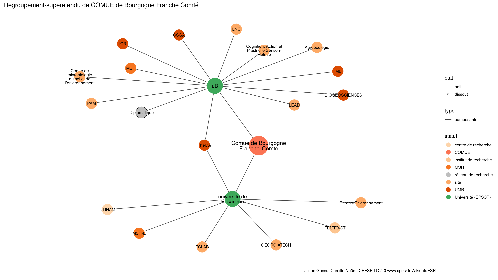 

Avertissements et édition : [logs](plots/regroupements/Q3359833.md) 

### COMUE de Toulouse : Histoire 

- url:Edition des données : https://github.com/cpesr/wikidataESR/blob/master/plots/regroupements/Q20669873.md 


Erreur : les données sont probablement trop partielles.
```
Error in wdesr_ggplot_graph(df, node_size = node_size, label_sizes = label_sizes, : Empty ESR graph: something went wrong with the graph production parameters

``` 

Avertissements et édition : [logs](plots/regroupements/Q20669873.md) 

### COMUE de Toulouse : Regroupement Court 

- url:Edition des données : https://github.com/cpesr/wikidataESR/blob/master/plots/regroupements/Q20669873.md 

 

Avertissements et édition : [logs](plots/regroupements/Q20669873.md) 

### COMUE de Toulouse : Regroupement Etendu 

- url:Edition des données : https://github.com/cpesr/wikidataESR/blob/master/plots/regroupements/Q20669873.md 

 

Avertissements et édition : [logs](plots/regroupements/Q20669873.md) 

### COMUE de Toulouse : Regroupement Superetendu 

- url:Edition des données : https://github.com/cpesr/wikidataESR/blob/master/plots/regroupements/Q20669873.md 


Erreur : les données sont probablement trop partielles.
```
Error in query(url, "pcontent", clean_response, query_param = query_param, : The API returned an error: missingtitle - The page you specified doesn't exist.

``` 

Avertissements et édition : [logs](plots/regroupements/Q20669873.md) 

### COMUE UCA : Histoire 

- url:Edition des données : https://github.com/cpesr/wikidataESR/blob/master/plots/regroupements/Q19370961.md 

 

Avertissements et édition : [logs](plots/regroupements/Q19370961.md) 

### COMUE UCA : Regroupement Court 

- url:Edition des données : https://github.com/cpesr/wikidataESR/blob/master/plots/regroupements/Q19370961.md 

 

Avertissements et édition : [logs](plots/regroupements/Q19370961.md) 

### COMUE UCA : Regroupement Etendu 

- url:Edition des données : https://github.com/cpesr/wikidataESR/blob/master/plots/regroupements/Q19370961.md 

 

Avertissements et édition : [logs](plots/regroupements/Q19370961.md) 

### COMUE UCA : Regroupement Superetendu 

- url:Edition des données : https://github.com/cpesr/wikidataESR/blob/master/plots/regroupements/Q19370961.md 

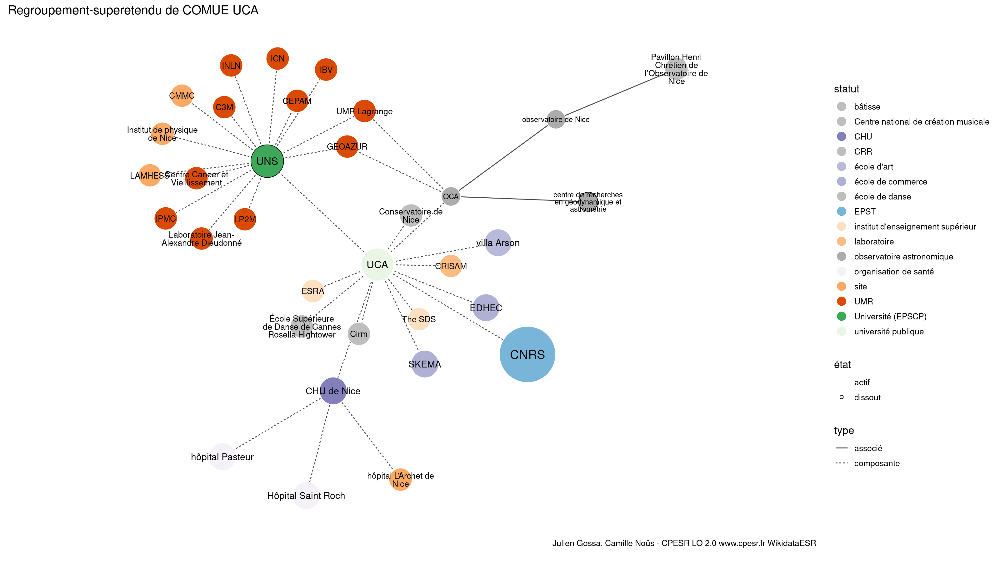 

Avertissements et édition : [logs](plots/regroupements/Q19370961.md) 

### COMUE UGA : Histoire 

- url:Edition des données : https://github.com/cpesr/wikidataESR/blob/master/plots/regroupements/Q3551589.md 

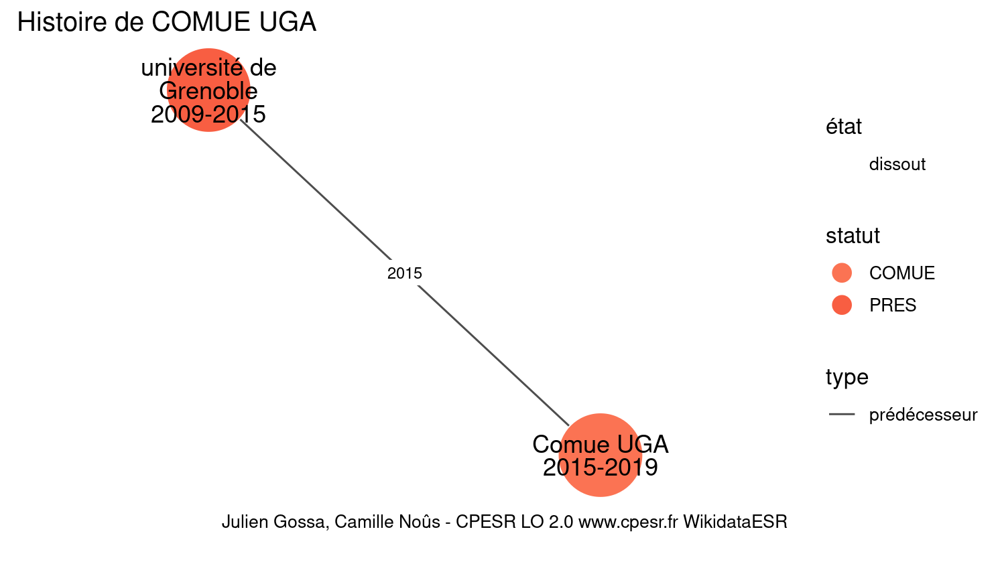 

Avertissements et édition : [logs](plots/regroupements/Q3551589.md) 

### COMUE UGA : Regroupement Court 

- url:Edition des données : https://github.com/cpesr/wikidataESR/blob/master/plots/regroupements/Q3551589.md 

 

Avertissements et édition : [logs](plots/regroupements/Q3551589.md) 

### COMUE UGA : Regroupement Etendu 

- url:Edition des données : https://github.com/cpesr/wikidataESR/blob/master/plots/regroupements/Q3551589.md 

 

Avertissements et édition : [logs](plots/regroupements/Q3551589.md) 

### COMUE UGA : Regroupement Superetendu 

- url:Edition des données : https://github.com/cpesr/wikidataESR/blob/master/plots/regroupements/Q3551589.md 

 

Avertissements et édition : [logs](plots/regroupements/Q3551589.md) 

### COMUE Université Paris-Saclay : Histoire 

- url:Edition des données : https://github.com/cpesr/wikidataESR/blob/master/plots/regroupements/Q13531686.md 

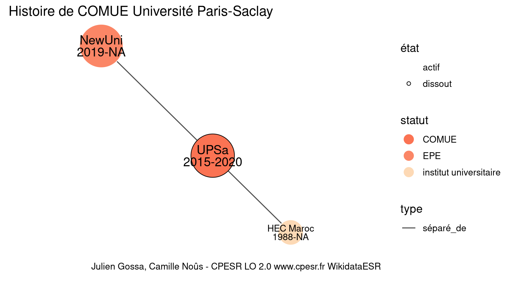 

Avertissements et édition : [logs](plots/regroupements/Q13531686.md) 

### COMUE Université Paris-Saclay : Regroupement Court 

- url:Edition des données : https://github.com/cpesr/wikidataESR/blob/master/plots/regroupements/Q13531686.md 

 

Avertissements et édition : [logs](plots/regroupements/Q13531686.md) 

### COMUE Université Paris-Saclay : Regroupement Etendu 

- url:Edition des données : https://github.com/cpesr/wikidataESR/blob/master/plots/regroupements/Q13531686.md 

 

Avertissements et édition : [logs](plots/regroupements/Q13531686.md) 

### COMUE Université Paris-Saclay : Regroupement Superetendu 

- url:Edition des données : https://github.com/cpesr/wikidataESR/blob/master/plots/regroupements/Q13531686.md 


Erreur : les données sont probablement trop partielles.
```
Error in query(url, "pcontent", clean_response, query_param = query_param, : The API returned an error: missingtitle - The page you specified doesn't exist.

``` 

Avertissements et édition : [logs](plots/regroupements/Q13531686.md) 

### HESAM : Histoire 

- url:Edition des données : https://github.com/cpesr/wikidataESR/blob/master/plots/regroupements/Q3128622.md 

 

Avertissements et édition : [logs](plots/regroupements/Q3128622.md) 

### HESAM : Regroupement Court 

- url:Edition des données : https://github.com/cpesr/wikidataESR/blob/master/plots/regroupements/Q3128622.md 

 

Avertissements et édition : [logs](plots/regroupements/Q3128622.md) 

### HESAM : Regroupement Etendu 

- url:Edition des données : https://github.com/cpesr/wikidataESR/blob/master/plots/regroupements/Q3128622.md 

 

Avertissements et édition : [logs](plots/regroupements/Q3128622.md) 

### HESAM : Regroupement Superetendu 

- url:Edition des données : https://github.com/cpesr/wikidataESR/blob/master/plots/regroupements/Q3128622.md 

 

Avertissements et édition : [logs](plots/regroupements/Q3128622.md) 

### Languedoc Roussillon Universités : Histoire 

- url:Edition des données : https://github.com/cpesr/wikidataESR/blob/master/plots/regroupements/Q2476558.md 


Erreur : les données sont probablement trop partielles.
```
Error in wdesr_ggplot_graph(df, node_size = node_size, label_sizes = label_sizes, : Empty ESR graph: something went wrong with the graph production parameters

``` 

Avertissements et édition : [logs](plots/regroupements/Q2476558.md) 

### Languedoc Roussillon Universités : Regroupement Court 

- url:Edition des données : https://github.com/cpesr/wikidataESR/blob/master/plots/regroupements/Q2476558.md 

 

Avertissements et édition : [logs](plots/regroupements/Q2476558.md) 

### Languedoc Roussillon Universités : Regroupement Etendu 

- url:Edition des données : https://github.com/cpesr/wikidataESR/blob/master/plots/regroupements/Q2476558.md 

 

Avertissements et édition : [logs](plots/regroupements/Q2476558.md) 

### Languedoc Roussillon Universités : Regroupement Superetendu 

- url:Edition des données : https://github.com/cpesr/wikidataESR/blob/master/plots/regroupements/Q2476558.md 

 

Avertissements et édition : [logs](plots/regroupements/Q2476558.md) 

### Normandie Université : Histoire 

- url:Edition des données : https://github.com/cpesr/wikidataESR/blob/master/plots/regroupements/Q3343880.md 

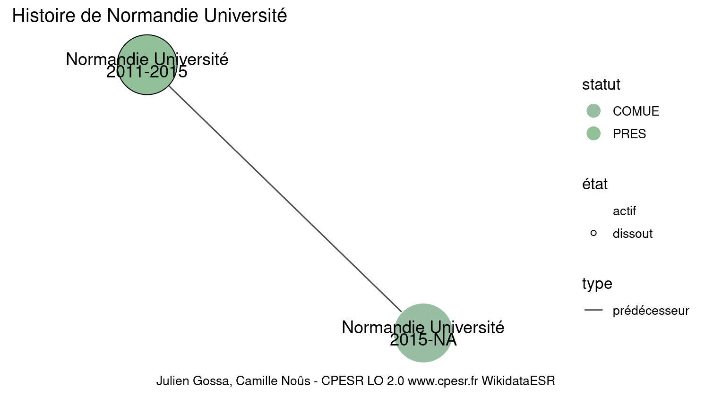 

Avertissements et édition : [logs](plots/regroupements/Q3343880.md) 

### Normandie Université : Regroupement Court 

- url:Edition des données : https://github.com/cpesr/wikidataESR/blob/master/plots/regroupements/Q3343880.md 

 

Avertissements et édition : [logs](plots/regroupements/Q3343880.md) 

### Normandie Université : Regroupement Etendu 

- url:Edition des données : https://github.com/cpesr/wikidataESR/blob/master/plots/regroupements/Q3343880.md 

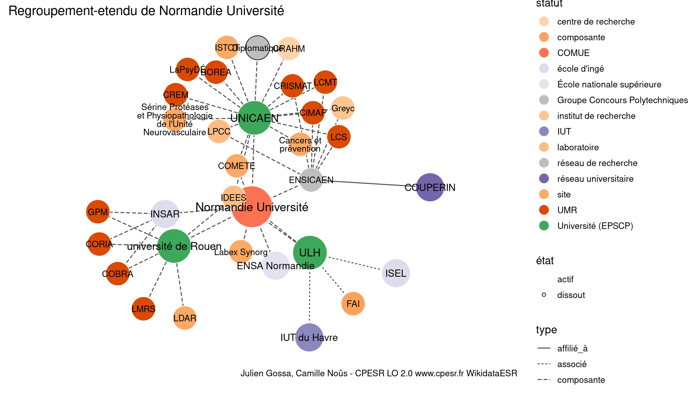 

Avertissements et édition : [logs](plots/regroupements/Q3343880.md) 

### Normandie Université : Regroupement Superetendu 

- url:Edition des données : https://github.com/cpesr/wikidataESR/blob/master/plots/regroupements/Q3343880.md 

 

Avertissements et édition : [logs](plots/regroupements/Q3343880.md) 

### Sorbonne Paris Cité : Histoire 

- url:Edition des données : https://github.com/cpesr/wikidataESR/blob/master/plots/regroupements/Q3491149.md 

 

Avertissements et édition : [logs](plots/regroupements/Q3491149.md) 

### Sorbonne Paris Cité : Regroupement Court 

- url:Edition des données : https://github.com/cpesr/wikidataESR/blob/master/plots/regroupements/Q3491149.md 

 

Avertissements et édition : [logs](plots/regroupements/Q3491149.md) 

### Sorbonne Paris Cité : Regroupement Etendu 

- url:Edition des données : https://github.com/cpesr/wikidataESR/blob/master/plots/regroupements/Q3491149.md 

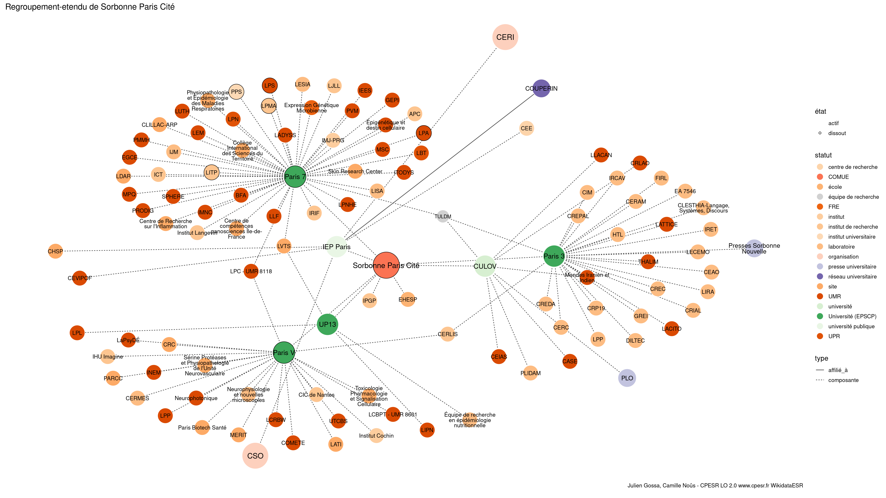 

Avertissements et édition : [logs](plots/regroupements/Q3491149.md) 

### Sorbonne Paris Cité : Regroupement Superetendu 

- url:Edition des données : https://github.com/cpesr/wikidataESR/blob/master/plots/regroupements/Q3491149.md 

 

Avertissements et édition : [logs](plots/regroupements/Q3491149.md) 

### Sorbonne Universités : Histoire 

- url:Edition des données : https://github.com/cpesr/wikidataESR/blob/master/plots/regroupements/Q3491150.md 


Erreur : les données sont probablement trop partielles.
```
Error in wdesr_ggplot_graph(df, node_size = node_size, label_sizes = label_sizes, : Empty ESR graph: something went wrong with the graph production parameters

``` 

Avertissements et édition : [logs](plots/regroupements/Q3491150.md) 

### Sorbonne Universités : Regroupement Court 

- url:Edition des données : https://github.com/cpesr/wikidataESR/blob/master/plots/regroupements/Q3491150.md 

 

Avertissements et édition : [logs](plots/regroupements/Q3491150.md) 

### Sorbonne Universités : Regroupement Etendu 

- url:Edition des données : https://github.com/cpesr/wikidataESR/blob/master/plots/regroupements/Q3491150.md 

 

Avertissements et édition : [logs](plots/regroupements/Q3491150.md) 

### Sorbonne Universités : Regroupement Superetendu 

- url:Edition des données : https://github.com/cpesr/wikidataESR/blob/master/plots/regroupements/Q3491150.md 


Erreur : les données sont probablement trop partielles.
```
Error in query(url, "pcontent", clean_response, query_param = query_param, : The API returned an error: missingtitle - The page you specified doesn't exist.

``` 

Avertissements et édition : [logs](plots/regroupements/Q3491150.md) 

### UBL : Histoire 

- url:Edition des données : https://github.com/cpesr/wikidataESR/blob/master/plots/regroupements/Q21994834.md 

 

Avertissements et édition : [logs](plots/regroupements/Q21994834.md) 

### UBL : Regroupement Court 

- url:Edition des données : https://github.com/cpesr/wikidataESR/blob/master/plots/regroupements/Q21994834.md 

 

Avertissements et édition : [logs](plots/regroupements/Q21994834.md) 

### UBL : Regroupement Etendu 

- url:Edition des données : https://github.com/cpesr/wikidataESR/blob/master/plots/regroupements/Q21994834.md 

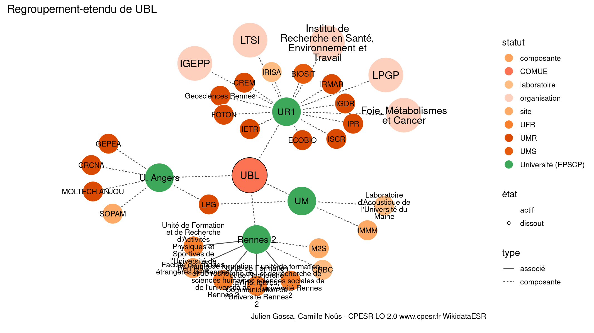 

Avertissements et édition : [logs](plots/regroupements/Q21994834.md) 

### UBL : Regroupement Superetendu 

- url:Edition des données : https://github.com/cpesr/wikidataESR/blob/master/plots/regroupements/Q21994834.md 

 

Avertissements et édition : [logs](plots/regroupements/Q21994834.md) 

### UDL : Histoire 

- url:Edition des données : https://github.com/cpesr/wikidataESR/blob/master/plots/regroupements/Q10176.md 

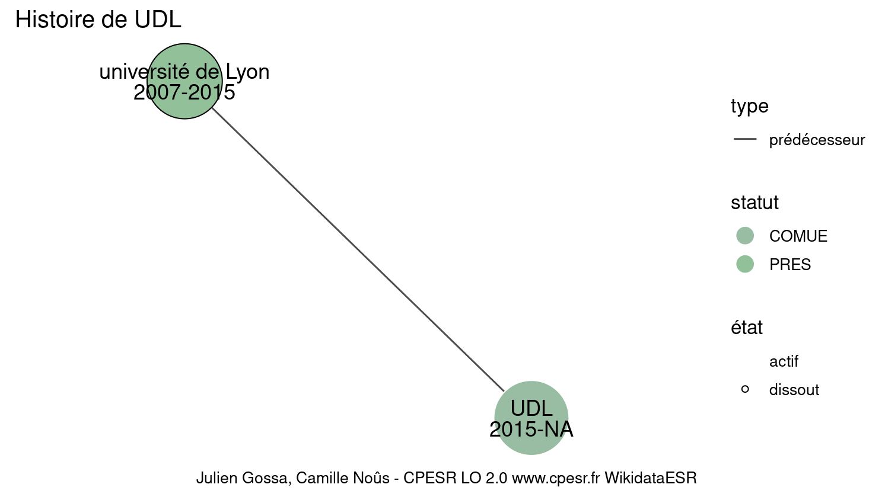 

Avertissements et édition : [logs](plots/regroupements/Q10176.md) 

### UDL : Regroupement Court 

- url:Edition des données : https://github.com/cpesr/wikidataESR/blob/master/plots/regroupements/Q10176.md 

 

Avertissements et édition : [logs](plots/regroupements/Q10176.md) 

### UDL : Regroupement Etendu 

- url:Edition des données : https://github.com/cpesr/wikidataESR/blob/master/plots/regroupements/Q10176.md 

 

Avertissements et édition : [logs](plots/regroupements/Q10176.md) 

### UDL : Regroupement Superetendu 

- url:Edition des données : https://github.com/cpesr/wikidataESR/blob/master/plots/regroupements/Q10176.md 


Erreur : les données sont probablement trop partielles.
```
Error in query(url, "pcontent", clean_response, query_param = query_param, : The API returned an error: missingtitle - The page you specified doesn't exist.

``` 

Avertissements et édition : [logs](plots/regroupements/Q10176.md) 

### Union des universités de la Méditerranée : Histoire 

- url:Edition des données : https://github.com/cpesr/wikidataESR/blob/master/plots/regroupements/Q850927.md 


Erreur : les données sont probablement trop partielles.
```
Error in wdesr_ggplot_graph(df, node_size = node_size, label_sizes = label_sizes, : Empty ESR graph: something went wrong with the graph production parameters

``` 

Avertissements et édition : [logs](plots/regroupements/Q850927.md) 

### Union des universités de la Méditerranée : Regroupement Court 

- url:Edition des données : https://github.com/cpesr/wikidataESR/blob/master/plots/regroupements/Q850927.md 

 

Avertissements et édition : [logs](plots/regroupements/Q850927.md) 

### Union des universités de la Méditerranée : Regroupement Etendu 

- url:Edition des données : https://github.com/cpesr/wikidataESR/blob/master/plots/regroupements/Q850927.md 


Erreur : les données sont probablement trop partielles.
```
Error in ans[npos] <- rep(no, length.out = len)[npos]: l'argument de remplacement est de longueur nulle

``` 

Avertissements et édition : [logs](plots/regroupements/Q850927.md) 

### Union des universités de la Méditerranée : Regroupement Superetendu 

- url:Edition des données : https://github.com/cpesr/wikidataESR/blob/master/plots/regroupements/Q850927.md 


Erreur : les données sont probablement trop partielles.
```
Error in ans[npos] <- rep(no, length.out = len)[npos]: l'argument de remplacement est de longueur nulle

``` 

Avertissements et édition : [logs](plots/regroupements/Q850927.md) 

### Université confédérale Léonard-de-Vinci : Histoire 

- url:Edition des données : https://github.com/cpesr/wikidataESR/blob/master/plots/regroupements/Q20735682.md 


Erreur : les données sont probablement trop partielles.
```
Error in wdesr_ggplot_graph(df, node_size = node_size, label_sizes = label_sizes, : Empty ESR graph: something went wrong with the graph production parameters

``` 

Avertissements et édition : [logs](plots/regroupements/Q20735682.md) 

### Université confédérale Léonard-de-Vinci : Regroupement Court 

- url:Edition des données : https://github.com/cpesr/wikidataESR/blob/master/plots/regroupements/Q20735682.md 

 

Avertissements et édition : [logs](plots/regroupements/Q20735682.md) 

### Université confédérale Léonard-de-Vinci : Regroupement Etendu 

- url:Edition des données : https://github.com/cpesr/wikidataESR/blob/master/plots/regroupements/Q20735682.md 

 

Avertissements et édition : [logs](plots/regroupements/Q20735682.md) 

### Université confédérale Léonard-de-Vinci : Regroupement Superetendu 

- url:Edition des données : https://github.com/cpesr/wikidataESR/blob/master/plots/regroupements/Q20735682.md 

 

Avertissements et édition : [logs](plots/regroupements/Q20735682.md) 

### Université de Lille : Histoire 

- url:Edition des données : https://github.com/cpesr/wikidataESR/blob/master/plots/regroupements/Q1322289.md 


Erreur : les données sont probablement trop partielles.
```
Error in wdesr_ggplot_graph(df, node_size = node_size, label_sizes = label_sizes, : Empty ESR graph: something went wrong with the graph production parameters

``` 

Avertissements et édition : [logs](plots/regroupements/Q1322289.md) 

### Université de Lille : Regroupement Court 

- url:Edition des données : https://github.com/cpesr/wikidataESR/blob/master/plots/regroupements/Q1322289.md 

 

Avertissements et édition : [logs](plots/regroupements/Q1322289.md) 

### Université de Lille : Regroupement Etendu 

- url:Edition des données : https://github.com/cpesr/wikidataESR/blob/master/plots/regroupements/Q1322289.md 

 

Avertissements et édition : [logs](plots/regroupements/Q1322289.md) 

### Université de Lille : Regroupement Superetendu 

- url:Edition des données : https://github.com/cpesr/wikidataESR/blob/master/plots/regroupements/Q1322289.md 

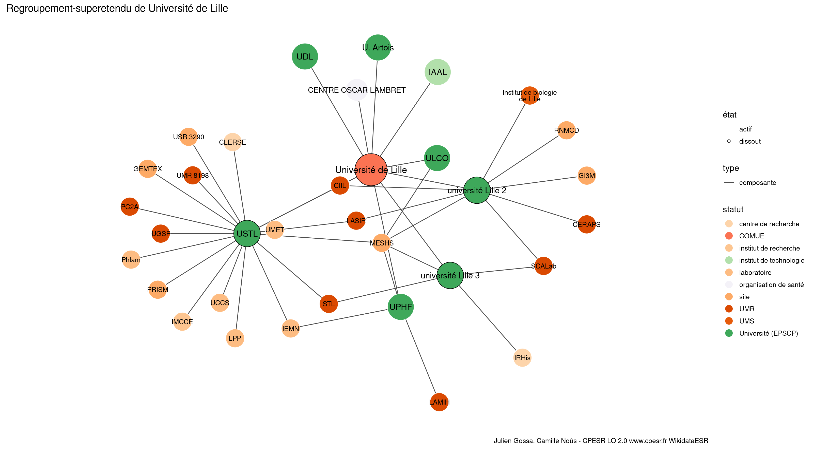 

Avertissements et édition : [logs](plots/regroupements/Q1322289.md) 

### université Paris Lumières : Histoire 

- url:Edition des données : https://github.com/cpesr/wikidataESR/blob/master/plots/regroupements/Q3551474.md 

 

Avertissements et édition : [logs](plots/regroupements/Q3551474.md) 

### université Paris Lumières : Regroupement Court 

- url:Edition des données : https://github.com/cpesr/wikidataESR/blob/master/plots/regroupements/Q3551474.md 

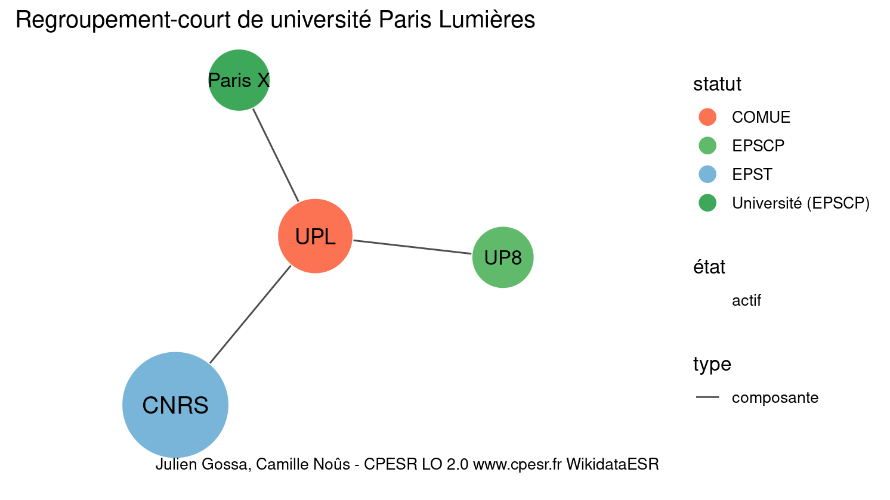 

Avertissements et édition : [logs](plots/regroupements/Q3551474.md) 

### université Paris Lumières : Regroupement Etendu 

- url:Edition des données : https://github.com/cpesr/wikidataESR/blob/master/plots/regroupements/Q3551474.md 

 

Avertissements et édition : [logs](plots/regroupements/Q3551474.md) 

### université Paris Lumières : Regroupement Superetendu 

- url:Edition des données : https://github.com/cpesr/wikidataESR/blob/master/plots/regroupements/Q3551474.md 

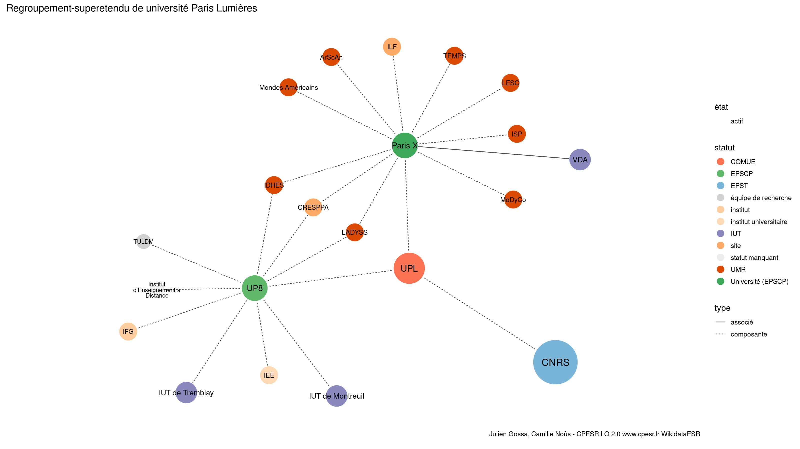 

Avertissements et édition : [logs](plots/regroupements/Q3551474.md) 

### Université Paris-Est : Histoire 

- url:Edition des données : https://github.com/cpesr/wikidataESR/blob/master/plots/regroupements/Q3551472.md 

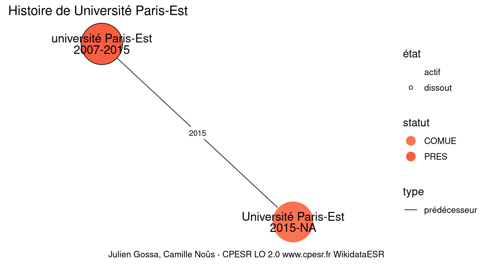 

Avertissements et édition : [logs](plots/regroupements/Q3551472.md) 

### Université Paris-Est : Regroupement Court 

- url:Edition des données : https://github.com/cpesr/wikidataESR/blob/master/plots/regroupements/Q3551472.md 

 

Avertissements et édition : [logs](plots/regroupements/Q3551472.md) 

### Université Paris-Est : Regroupement Etendu 

- url:Edition des données : https://github.com/cpesr/wikidataESR/blob/master/plots/regroupements/Q3551472.md 

 

Avertissements et édition : [logs](plots/regroupements/Q3551472.md) 

### Université Paris-Est : Regroupement Superetendu 

- url:Edition des données : https://github.com/cpesr/wikidataESR/blob/master/plots/regroupements/Q3551472.md 


Erreur : les données sont probablement trop partielles.
```
Error in query(url, "pcontent", clean_response, query_param = query_param, : The API returned an error: missingtitle - The page you specified doesn't exist.

``` 

Avertissements et édition : [logs](plots/regroupements/Q3551472.md) 

### Université Paris-Seine : Histoire 

- url:Edition des données : https://github.com/cpesr/wikidataESR/blob/master/plots/regroupements/Q3247880.md 


Erreur : les données sont probablement trop partielles.
```
Error in wdesr_ggplot_graph(df, node_size = node_size, label_sizes = label_sizes, : Empty ESR graph: something went wrong with the graph production parameters

``` 

Avertissements et édition : [logs](plots/regroupements/Q3247880.md) 

### Université Paris-Seine : Regroupement Court 

- url:Edition des données : https://github.com/cpesr/wikidataESR/blob/master/plots/regroupements/Q3247880.md 

 

Avertissements et édition : [logs](plots/regroupements/Q3247880.md) 

### Université Paris-Seine : Regroupement Etendu 

- url:Edition des données : https://github.com/cpesr/wikidataESR/blob/master/plots/regroupements/Q3247880.md 

 

Avertissements et édition : [logs](plots/regroupements/Q3247880.md) 

### Université Paris-Seine : Regroupement Superetendu 

- url:Edition des données : https://github.com/cpesr/wikidataESR/blob/master/plots/regroupements/Q3247880.md 

 

Avertissements et édition : [logs](plots/regroupements/Q3247880.md) 

### PSL : Histoire 

- url:Edition des données : https://github.com/cpesr/wikidataESR/blob/master/plots/regroupements/Q1163431.md 

 

Avertissements et édition : [logs](plots/regroupements/Q1163431.md) 

### PSL : Regroupement Court 

- url:Edition des données : https://github.com/cpesr/wikidataESR/blob/master/plots/regroupements/Q1163431.md 

 

Avertissements et édition : [logs](plots/regroupements/Q1163431.md) 

### PSL : Regroupement Etendu 

- url:Edition des données : https://github.com/cpesr/wikidataESR/blob/master/plots/regroupements/Q1163431.md 

 

Avertissements et édition : [logs](plots/regroupements/Q1163431.md) 

### PSL : Regroupement Superetendu 

- url:Edition des données : https://github.com/cpesr/wikidataESR/blob/master/plots/regroupements/Q1163431.md 


Erreur : les données sont probablement trop partielles.
```
Error in query(url, "pcontent", clean_response, query_param = query_param, : The API returned an error: missingtitle - The page you specified doesn't exist.

``` 

Avertissements et édition : [logs](plots/regroupements/Q1163431.md) 

### PRES Université de Lorraine : Histoire 

- url:Edition des données : https://github.com/cpesr/wikidataESR/blob/master/plots/regroupements/Q64590454.md 

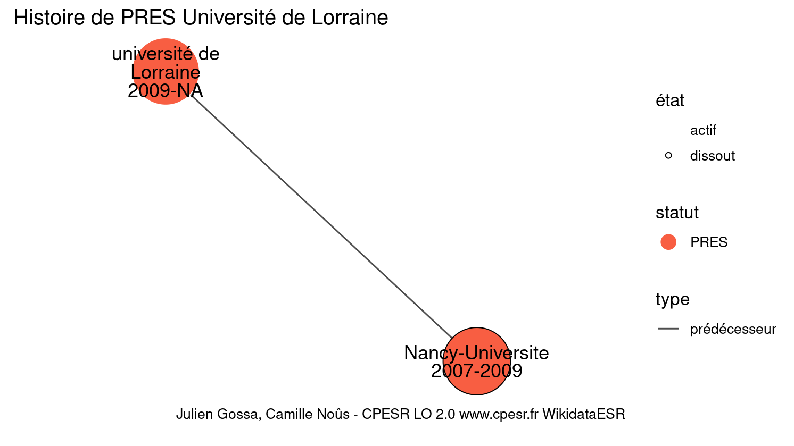 

Avertissements et édition : [logs](plots/regroupements/Q64590454.md) 

### PRES Université de Lorraine : Regroupement Court 

- url:Edition des données : https://github.com/cpesr/wikidataESR/blob/master/plots/regroupements/Q64590454.md 

 

Avertissements et édition : [logs](plots/regroupements/Q64590454.md) 

### PRES Université de Lorraine : Regroupement Etendu 

- url:Edition des données : https://github.com/cpesr/wikidataESR/blob/master/plots/regroupements/Q64590454.md 

 

Avertissements et édition : [logs](plots/regroupements/Q64590454.md) 

### PRES Université de Lorraine : Regroupement Superetendu 

- url:Edition des données : https://github.com/cpesr/wikidataESR/blob/master/plots/regroupements/Q64590454.md 

 

Avertissements et édition : [logs](plots/regroupements/Q64590454.md) 

### PRES UniverSud Paris : Histoire 

- url:Edition des données : https://github.com/cpesr/wikidataESR/blob/master/plots/regroupements/Q3248808.md 


Erreur : les données sont probablement trop partielles.
```
Error in wdesr_ggplot_graph(df, node_size = node_size, label_sizes = label_sizes, : Empty ESR graph: something went wrong with the graph production parameters

``` 

Avertissements et édition : [logs](plots/regroupements/Q3248808.md) 

### PRES UniverSud Paris : Regroupement Court 

- url:Edition des données : https://github.com/cpesr/wikidataESR/blob/master/plots/regroupements/Q3248808.md 

 

Avertissements et édition : [logs](plots/regroupements/Q3248808.md) 

### PRES UniverSud Paris : Regroupement Etendu 

- url:Edition des données : https://github.com/cpesr/wikidataESR/blob/master/plots/regroupements/Q3248808.md 

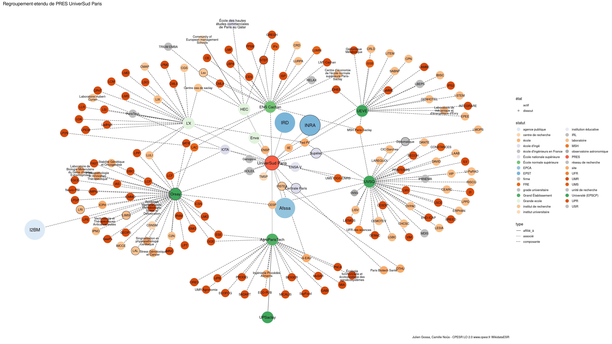 

Avertissements et édition : [logs](plots/regroupements/Q3248808.md) 

### PRES UniverSud Paris : Regroupement Superetendu 

- url:Edition des données : https://github.com/cpesr/wikidataESR/blob/master/plots/regroupements/Q3248808.md 


Erreur : les données sont probablement trop partielles.
```
Error in query(url, "pcontent", clean_response, query_param = query_param, : The API returned an error: missingtitle - The page you specified doesn't exist.

``` 

Avertissements et édition : [logs](plots/regroupements/Q3248808.md) 

### Site alsacien : Histoire 

- url:Edition des données : https://github.com/cpesr/wikidataESR/blob/master/plots/regroupements/Q61716176.md 


Erreur : les données sont probablement trop partielles.
```
Error in wdesr_ggplot_graph(df, node_size = node_size, label_sizes = label_sizes, : Empty ESR graph: something went wrong with the graph production parameters

``` 

Avertissements et édition : [logs](plots/regroupements/Q61716176.md) 

### Site alsacien : Regroupement Court 

- url:Edition des données : https://github.com/cpesr/wikidataESR/blob/master/plots/regroupements/Q61716176.md 

 

Avertissements et édition : [logs](plots/regroupements/Q61716176.md) 

### Site alsacien : Regroupement Etendu 

- url:Edition des données : https://github.com/cpesr/wikidataESR/blob/master/plots/regroupements/Q61716176.md 

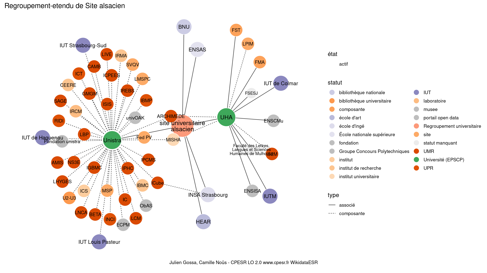 

Avertissements et édition : [logs](plots/regroupements/Q61716176.md) 

### Site alsacien : Regroupement Superetendu 

- url:Edition des données : https://github.com/cpesr/wikidataESR/blob/master/plots/regroupements/Q61716176.md 

 

Avertissements et édition : [logs](plots/regroupements/Q61716176.md) 

### Université fédérale de Toulouse Midi-Pyrénées : Histoire 

- url:Edition des données : https://github.com/cpesr/wikidataESR/blob/master/plots/regroupements/Q578023.md 


Erreur : les données sont probablement trop partielles.
```
Error in wdesr_ggplot_graph(df, node_size = node_size, label_sizes = label_sizes, : Empty ESR graph: something went wrong with the graph production parameters

``` 

Avertissements et édition : [logs](plots/regroupements/Q578023.md) 

### Université fédérale de Toulouse Midi-Pyrénées : Regroupement Court 

- url:Edition des données : https://github.com/cpesr/wikidataESR/blob/master/plots/regroupements/Q578023.md 

 

Avertissements et édition : [logs](plots/regroupements/Q578023.md) 

### Université fédérale de Toulouse Midi-Pyrénées : Regroupement Etendu 

- url:Edition des données : https://github.com/cpesr/wikidataESR/blob/master/plots/regroupements/Q578023.md 

 

Avertissements et édition : [logs](plots/regroupements/Q578023.md) 

### Université fédérale de Toulouse Midi-Pyrénées : Regroupement Superetendu 

- url:Edition des données : https://github.com/cpesr/wikidataESR/blob/master/plots/regroupements/Q578023.md 

 

Avertissements et édition : [logs](plots/regroupements/Q578023.md) 

### Université Paris-Saclay : Histoire 

- url:Edition des données : https://github.com/cpesr/wikidataESR/blob/master/plots/regroupements/Q109409389.md 

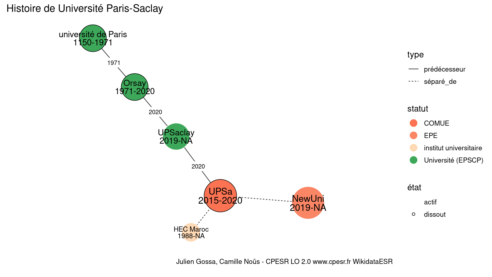 

Avertissements et édition : [logs](plots/regroupements/Q109409389.md) 

### Université Paris-Saclay : Regroupement Court 

- url:Edition des données : https://github.com/cpesr/wikidataESR/blob/master/plots/regroupements/Q109409389.md 

 

Avertissements et édition : [logs](plots/regroupements/Q109409389.md) 

### Université Paris-Saclay : Regroupement Etendu 

- url:Edition des données : https://github.com/cpesr/wikidataESR/blob/master/plots/regroupements/Q109409389.md 

 

Avertissements et édition : [logs](plots/regroupements/Q109409389.md) 

### Université Paris-Saclay : Regroupement Superetendu 

- url:Edition des données : https://github.com/cpesr/wikidataESR/blob/master/plots/regroupements/Q109409389.md 


Erreur : les données sont probablement trop partielles.
```
Error in query(url, "pcontent", clean_response, query_param = query_param, : The API returned an error: missingtitle - The page you specified doesn't exist.

``` 

Avertissements et édition : [logs](plots/regroupements/Q109409389.md) 

## Histoire des universités historiques 

### université de Clermont-Ferrand : Histoire 

- url:Edition des données : https://github.com/cpesr/wikidataESR/blob/master/plots/histoire/Q3551576.md 

 

Avertissements et édition : [logs](plots/histoire/Q3551576.md) 

### université de Bordeaux : Histoire 

- url:Edition des données : https://github.com/cpesr/wikidataESR/blob/master/plots/histoire/Q20791505.md 

 

Avertissements et édition : [logs](plots/histoire/Q20791505.md) 

### Université de Paris : Histoire 

- url:Edition des données : https://github.com/cpesr/wikidataESR/blob/master/plots/histoire/Q209842.md 

 

Avertissements et édition : [logs](plots/histoire/Q209842.md) 

### université de Lille : Histoire 

- url:Edition des données : https://github.com/cpesr/wikidataESR/blob/master/plots/histoire/Q3551621.md 


Erreur : les données sont probablement trop partielles.
```
Error in wdesr_ggplot_graph(df, node_size = node_size, label_sizes = label_sizes, : Empty ESR graph: something went wrong with the graph production parameters

``` 

Avertissements et édition : [logs](plots/histoire/Q3551621.md) 

### université de Lyon (1896-1969) : Histoire 

- url:Edition des données : https://github.com/cpesr/wikidataESR/blob/master/plots/histoire/Q2383462.md 

 

Avertissements et édition : [logs](plots/histoire/Q2383462.md) 

### ancienne université d'Orléans : Histoire 

- url:Edition des données : https://github.com/cpesr/wikidataESR/blob/master/plots/histoire/Q23197733.md 

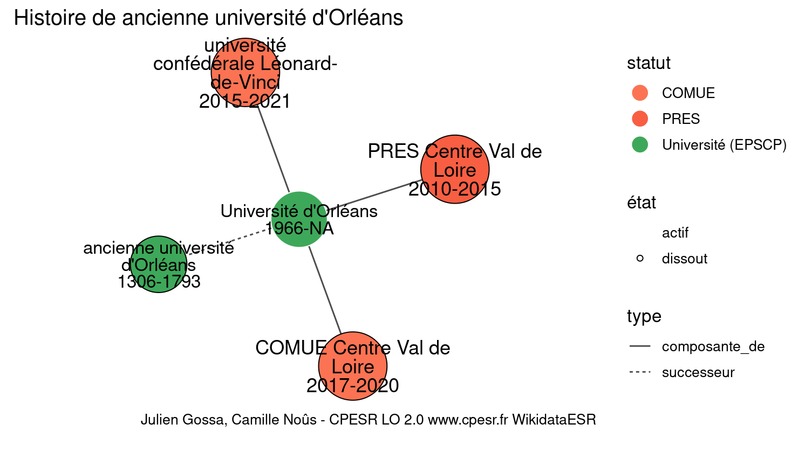 

Avertissements et édition : [logs](plots/histoire/Q23197733.md) 

### Université de Montpellier : Histoire 

- url:Edition des données : https://github.com/cpesr/wikidataESR/blob/master/plots/histoire/Q64690423.md 

 

Avertissements et édition : [logs](plots/histoire/Q64690423.md) 

### université de Rennes : Histoire 

- url:Edition des données : https://github.com/cpesr/wikidataESR/blob/master/plots/histoire/Q1987282.md 

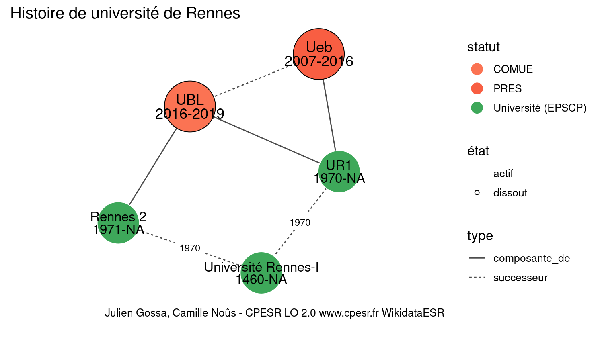 

Avertissements et édition : [logs](plots/histoire/Q1987282.md) 

### École royale de dessin (Paris) : Histoire 

- url:Edition des données : https://github.com/cpesr/wikidataESR/blob/master/plots/histoire/Q20774688.md 

 

Avertissements et édition : [logs](plots/histoire/Q20774688.md) 

### Ancienne université de Toulouse : Histoire 

- url:Edition des données : https://github.com/cpesr/wikidataESR/blob/master/plots/histoire/Q578023.md 

 

Avertissements et édition : [logs](plots/histoire/Q578023.md) 

### Academia argentinensis : Histoire 

- url:Edition des données : https://github.com/cpesr/wikidataESR/blob/master/plots/histoire/Q20808141.md 

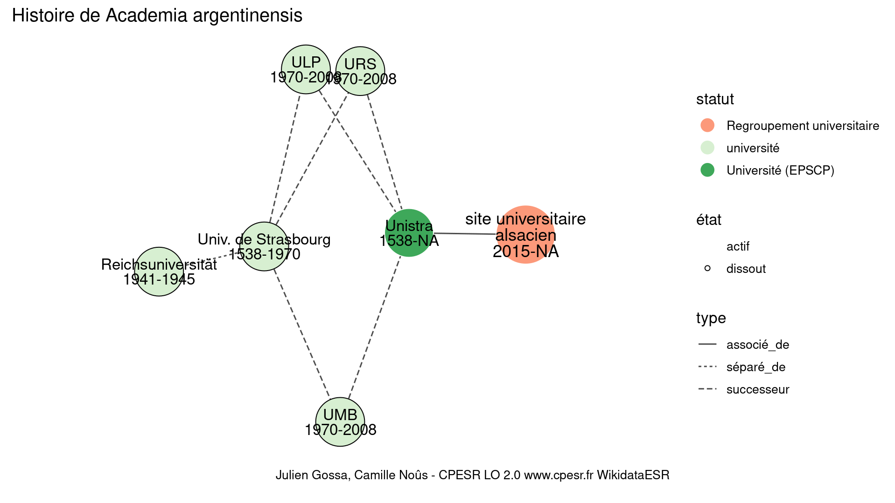 

Avertissements et édition : [logs](plots/histoire/Q20808141.md) 

### université d'Aix-Marseille (1896-1971) : Histoire 

- url:Edition des données : https://github.com/cpesr/wikidataESR/blob/master/plots/histoire/Q21592577.md 

 

Avertissements et édition : [logs](plots/histoire/Q21592577.md) 

