Batches de représentation wikidataESR
================

 

10/11/2022 

https://github.com/cpesr/WikidataESR 

```
  - twtexte:[#DataESR #HelpESR] Visualisation des @wikidata de l'#ESR.
  - twalt:@juliengossa LO 2.0 www.cpesr.fr
  - twurl:https://twitter.com/CPESR_/status/1457453241378148361
  - url:https://github.com/cpesr/WikidataESR
``` 

## Histoire, composition et association actuelles des NA 

## Histoire, composition et association actuelles des Universités et assimilés 

Twitters manquants :
```
 - CU de Mayotte
 - UCA
 - UDL
 - Université de Montpellier
 - URN
 - ULH
 - Paris-Dauphine
``` 

### AMU @univamu : Histoire.     Edition des données : https://github.com/cpesr/wikidataESR/blob/master/plots/etablissements/Q2302586.md 

 

Avertissements et édition : [logs](plots/etablissements/Q2302586.md) 

### AMU @univamu : Composition.     Edition des données : https://github.com/cpesr/wikidataESR/blob/master/plots/etablissements/Q2302586.md 

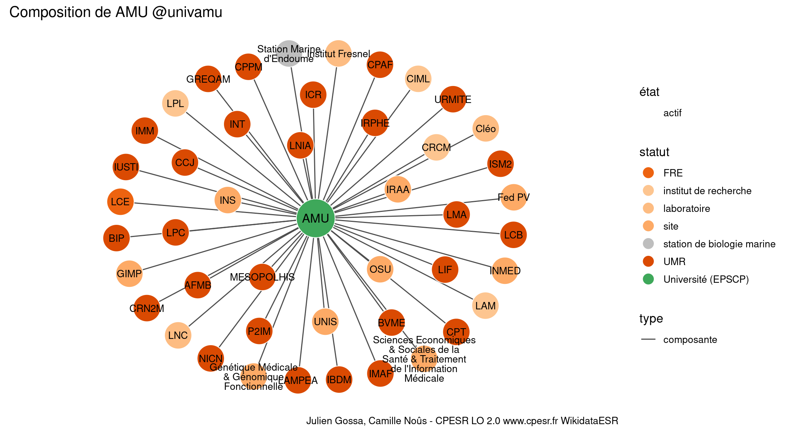 

Avertissements et édition : [logs](plots/etablissements/Q2302586.md) 

### AMU @univamu : Associations.     Edition des données : https://github.com/cpesr/wikidataESR/blob/master/plots/etablissements/Q2302586.md 


Erreur : les données sont probablement trop partielles.
```
Error in ans[npos] <- rep(no, length.out = len)[npos]: l'argument de remplacement est de longueur nulle

``` 

Avertissements et édition : [logs](plots/etablissements/Q2302586.md) 

### AU @univavignon : Histoire.     Edition des données : https://github.com/cpesr/wikidataESR/blob/master/plots/etablissements/Q2033119.md 


Erreur : les données sont probablement trop partielles.
```
Error in wdesr_ggplot_graph(df, node_size = node_size, label_sizes = label_sizes, : Empty ESR graph: something went wrong with the graph production parameters

``` 

Avertissements et édition : [logs](plots/etablissements/Q2033119.md) 

### AU @univavignon : Composition.     Edition des données : https://github.com/cpesr/wikidataESR/blob/master/plots/etablissements/Q2033119.md 

 

Avertissements et édition : [logs](plots/etablissements/Q2033119.md) 

### AU @univavignon : Associations.     Edition des données : https://github.com/cpesr/wikidataESR/blob/master/plots/etablissements/Q2033119.md 


Erreur : les données sont probablement trop partielles.
```
Error in ans[npos] <- rep(no, length.out = len)[npos]: l'argument de remplacement est de longueur nulle

``` 

Avertissements et édition : [logs](plots/etablissements/Q2033119.md) 

### CU de Mayotte NA : Histoire.     Edition des données : https://github.com/cpesr/wikidataESR/blob/master/plots/etablissements/Q2946102.md 


Erreur : les données sont probablement trop partielles.
```
Error in wdesr_ggplot_graph(df, node_size = node_size, label_sizes = label_sizes, : Empty ESR graph: something went wrong with the graph production parameters

``` 

Avertissements et édition : [logs](plots/etablissements/Q2946102.md) 

### CU de Mayotte NA : Composition.     Edition des données : https://github.com/cpesr/wikidataESR/blob/master/plots/etablissements/Q2946102.md 


Erreur : les données sont probablement trop partielles.
```
Error in wdesr_ggplot_graph(df, node_size = node_size, label_sizes = label_sizes, : Empty ESR graph: something went wrong with the graph production parameters

``` 

Avertissements et édition : [logs](plots/etablissements/Q2946102.md) 

### CU de Mayotte NA : Associations.     Edition des données : https://github.com/cpesr/wikidataESR/blob/master/plots/etablissements/Q2946102.md 


Erreur : les données sont probablement trop partielles.
```
Error in wdesr_ggplot_graph(df, node_size = node_size, label_sizes = label_sizes, : Empty ESR graph: something went wrong with the graph production parameters

``` 

Avertissements et édition : [logs](plots/etablissements/Q2946102.md) 

### CY @UniversiteCergy : Histoire.     Edition des données : https://github.com/cpesr/wikidataESR/blob/master/plots/etablissements/Q74452784.md 


Erreur : les données sont probablement trop partielles.
```
Error in wdesr_ggplot_graph(df, node_size = node_size, label_sizes = label_sizes, : Empty ESR graph: something went wrong with the graph production parameters

``` 

Avertissements et édition : [logs](plots/etablissements/Q74452784.md) 

### CY @UniversiteCergy : Composition.     Edition des données : https://github.com/cpesr/wikidataESR/blob/master/plots/etablissements/Q74452784.md 

 

Avertissements et édition : [logs](plots/etablissements/Q74452784.md) 

### CY @UniversiteCergy : Associations.     Edition des données : https://github.com/cpesr/wikidataESR/blob/master/plots/etablissements/Q74452784.md 

 

Avertissements et édition : [logs](plots/etablissements/Q74452784.md) 

### La Rochelle Université @UnivLaRochelle : Histoire.     Edition des données : https://github.com/cpesr/wikidataESR/blob/master/plots/etablissements/Q1500822.md 

 

Avertissements et édition : [logs](plots/etablissements/Q1500822.md) 

### La Rochelle Université @UnivLaRochelle : Composition.     Edition des données : https://github.com/cpesr/wikidataESR/blob/master/plots/etablissements/Q1500822.md 

 

Avertissements et édition : [logs](plots/etablissements/Q1500822.md) 

### La Rochelle Université @UnivLaRochelle : Associations.     Edition des données : https://github.com/cpesr/wikidataESR/blob/master/plots/etablissements/Q1500822.md 


Erreur : les données sont probablement trop partielles.
```
Error in wdesr_ggplot_graph(df, node_size = node_size, label_sizes = label_sizes, : Empty ESR graph: something went wrong with the graph production parameters

``` 

Avertissements et édition : [logs](plots/etablissements/Q1500822.md) 

### LMU @LeMansUniv : Histoire.     Edition des données : https://github.com/cpesr/wikidataESR/blob/master/plots/etablissements/Q834825.md 


Erreur : les données sont probablement trop partielles.
```
Error in wdesr_ggplot_graph(df, node_size = node_size, label_sizes = label_sizes, : Empty ESR graph: something went wrong with the graph production parameters

``` 

Avertissements et édition : [logs](plots/etablissements/Q834825.md) 

### LMU @LeMansUniv : Composition.     Edition des données : https://github.com/cpesr/wikidataESR/blob/master/plots/etablissements/Q834825.md 

 

Avertissements et édition : [logs](plots/etablissements/Q834825.md) 

### LMU @LeMansUniv : Associations.     Edition des données : https://github.com/cpesr/wikidataESR/blob/master/plots/etablissements/Q834825.md 


Erreur : les données sont probablement trop partielles.
```
Error in wdesr_ggplot_graph(df, node_size = node_size, label_sizes = label_sizes, : Empty ESR graph: something went wrong with the graph production parameters

``` 

Avertissements et édition : [logs](plots/etablissements/Q834825.md) 

### UN @NantesUniv : Histoire.     Edition des données : https://github.com/cpesr/wikidataESR/blob/master/plots/etablissements/Q259388.md 


Erreur : les données sont probablement trop partielles.
```
Error in wdesr_ggplot_graph(df, node_size = node_size, label_sizes = label_sizes, : Empty ESR graph: something went wrong with the graph production parameters

``` 

Avertissements et édition : [logs](plots/etablissements/Q259388.md) 

### UN @NantesUniv : Composition.     Edition des données : https://github.com/cpesr/wikidataESR/blob/master/plots/etablissements/Q259388.md 

 

Avertissements et édition : [logs](plots/etablissements/Q259388.md) 

### UN @NantesUniv : Associations.     Edition des données : https://github.com/cpesr/wikidataESR/blob/master/plots/etablissements/Q259388.md 


Erreur : les données sont probablement trop partielles.
```
Error in wdesr_ggplot_graph(df, node_size = node_size, label_sizes = label_sizes, : Empty ESR graph: something went wrong with the graph production parameters

``` 

Avertissements et édition : [logs](plots/etablissements/Q259388.md) 

### Sorbonne U @Sorbonne_Univ_ : Histoire.     Edition des données : https://github.com/cpesr/wikidataESR/blob/master/plots/etablissements/Q41497113.md 

 

Avertissements et édition : [logs](plots/etablissements/Q41497113.md) 

### Sorbonne U @Sorbonne_Univ_ : Composition.     Edition des données : https://github.com/cpesr/wikidataESR/blob/master/plots/etablissements/Q41497113.md 

 

Avertissements et édition : [logs](plots/etablissements/Q41497113.md) 

### Sorbonne U @Sorbonne_Univ_ : Associations.     Edition des données : https://github.com/cpesr/wikidataESR/blob/master/plots/etablissements/Q41497113.md 

 

Avertissements et édition : [logs](plots/etablissements/Q41497113.md) 

### UBM @UBMontaigne : Histoire.     Edition des données : https://github.com/cpesr/wikidataESR/blob/master/plots/etablissements/Q13342.md 

 

Avertissements et édition : [logs](plots/etablissements/Q13342.md) 

### UBM @UBMontaigne : Composition.     Edition des données : https://github.com/cpesr/wikidataESR/blob/master/plots/etablissements/Q13342.md 

 

Avertissements et édition : [logs](plots/etablissements/Q13342.md) 

### UBM @UBMontaigne : Associations.     Edition des données : https://github.com/cpesr/wikidataESR/blob/master/plots/etablissements/Q13342.md 


Erreur : les données sont probablement trop partielles.
```
Error in wdesr_ggplot_graph(df, node_size = node_size, label_sizes = label_sizes, : Empty ESR graph: something went wrong with the graph production parameters

``` 

Avertissements et édition : [logs](plots/etablissements/Q13342.md) 

### UBS @ubs_universite : Histoire.     Edition des données : https://github.com/cpesr/wikidataESR/blob/master/plots/etablissements/Q1125958.md 


Erreur : les données sont probablement trop partielles.
```
Error in wdesr_ggplot_graph(df, node_size = node_size, label_sizes = label_sizes, : Empty ESR graph: something went wrong with the graph production parameters

``` 

Avertissements et édition : [logs](plots/etablissements/Q1125958.md) 

### UBS @ubs_universite : Composition.     Edition des données : https://github.com/cpesr/wikidataESR/blob/master/plots/etablissements/Q1125958.md 

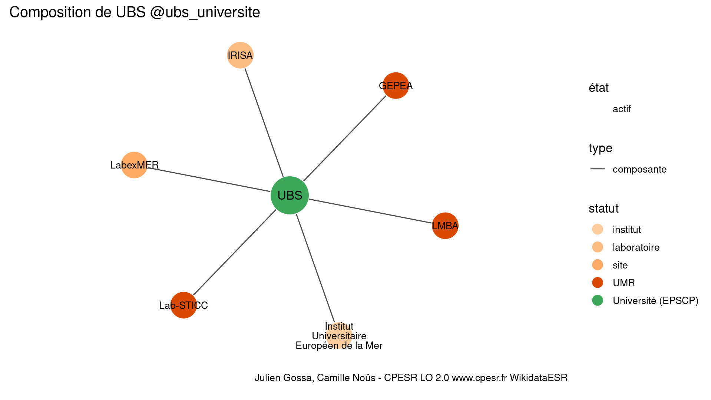 

Avertissements et édition : [logs](plots/etablissements/Q1125958.md) 

### UBS @ubs_universite : Associations.     Edition des données : https://github.com/cpesr/wikidataESR/blob/master/plots/etablissements/Q1125958.md 


Erreur : les données sont probablement trop partielles.
```
Error in wdesr_ggplot_graph(df, node_size = node_size, label_sizes = label_sizes, : Empty ESR graph: something went wrong with the graph production parameters

``` 

Avertissements et édition : [logs](plots/etablissements/Q1125958.md) 

### UCBL @UnivLyon1 : Histoire.     Edition des données : https://github.com/cpesr/wikidataESR/blob/master/plots/etablissements/Q4032.md 

 

Avertissements et édition : [logs](plots/etablissements/Q4032.md) 

### UCBL @UnivLyon1 : Composition.     Edition des données : https://github.com/cpesr/wikidataESR/blob/master/plots/etablissements/Q4032.md 

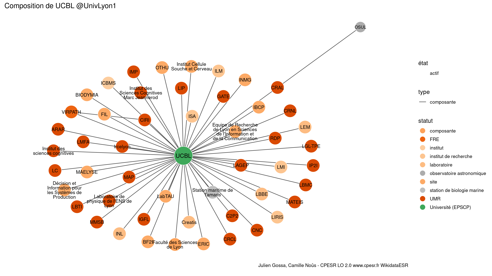 

Avertissements et édition : [logs](plots/etablissements/Q4032.md) 

### UCBL @UnivLyon1 : Associations.     Edition des données : https://github.com/cpesr/wikidataESR/blob/master/plots/etablissements/Q4032.md 

 

Avertissements et édition : [logs](plots/etablissements/Q4032.md) 

### UCA NA : Histoire.     Edition des données : https://github.com/cpesr/wikidataESR/blob/master/plots/etablissements/Q1319786.md 

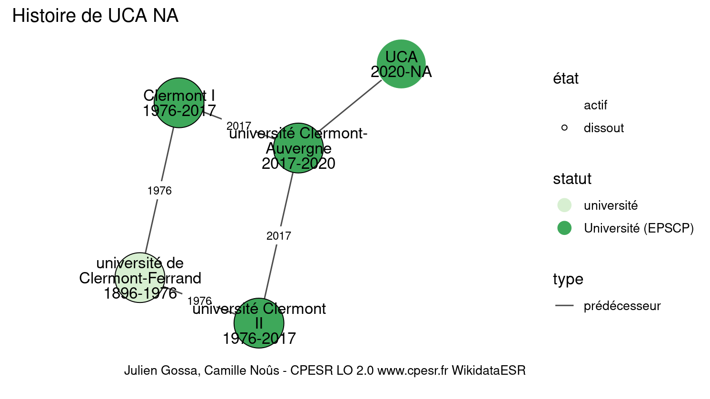 

Avertissements et édition : [logs](plots/etablissements/Q1319786.md) 

### UCA NA : Composition.     Edition des données : https://github.com/cpesr/wikidataESR/blob/master/plots/etablissements/Q1319786.md 

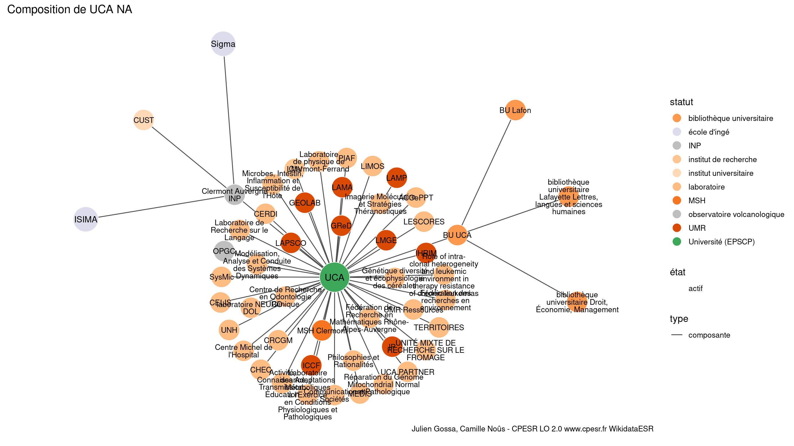 

Avertissements et édition : [logs](plots/etablissements/Q1319786.md) 

### UCA NA : Associations.     Edition des données : https://github.com/cpesr/wikidataESR/blob/master/plots/etablissements/Q1319786.md 

 

Avertissements et édition : [logs](plots/etablissements/Q1319786.md) 

### UCA @Univ_CotedAzur : Histoire.     Edition des données : https://github.com/cpesr/wikidataESR/blob/master/plots/etablissements/Q80186910.md 

 

Avertissements et édition : [logs](plots/etablissements/Q80186910.md) 

### UCA @Univ_CotedAzur : Composition.     Edition des données : https://github.com/cpesr/wikidataESR/blob/master/plots/etablissements/Q80186910.md 

 

Avertissements et édition : [logs](plots/etablissements/Q80186910.md) 

### UCA @Univ_CotedAzur : Associations.     Edition des données : https://github.com/cpesr/wikidataESR/blob/master/plots/etablissements/Q80186910.md 

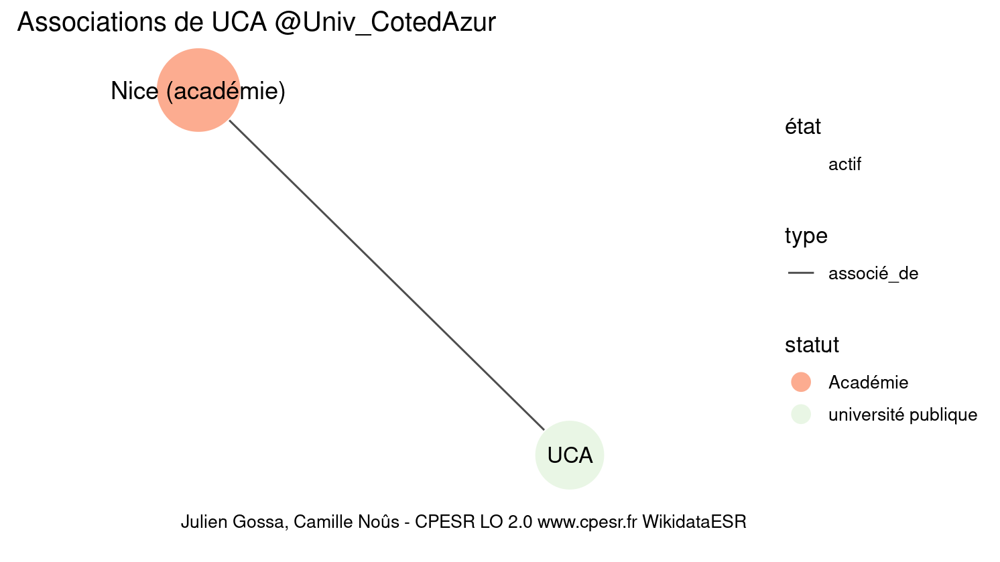 

Avertissements et édition : [logs](plots/etablissements/Q80186910.md) 

### U. Angers @UnivAngers : Histoire.     Edition des données : https://github.com/cpesr/wikidataESR/blob/master/plots/etablissements/Q1538727.md 


Erreur : les données sont probablement trop partielles.
```
Error in wdesr_ggplot_graph(df, node_size = node_size, label_sizes = label_sizes, : Empty ESR graph: something went wrong with the graph production parameters

``` 

Avertissements et édition : [logs](plots/etablissements/Q1538727.md) 

### U. Angers @UnivAngers : Composition.     Edition des données : https://github.com/cpesr/wikidataESR/blob/master/plots/etablissements/Q1538727.md 

 

Avertissements et édition : [logs](plots/etablissements/Q1538727.md) 

### U. Angers @UnivAngers : Associations.     Edition des données : https://github.com/cpesr/wikidataESR/blob/master/plots/etablissements/Q1538727.md 


Erreur : les données sont probablement trop partielles.
```
Error in wdesr_ggplot_graph(df, node_size = node_size, label_sizes = label_sizes, : Empty ESR graph: something went wrong with the graph production parameters

``` 

Avertissements et édition : [logs](plots/etablissements/Q1538727.md) 

### U. Artois @Univ_Artois : Histoire.     Edition des données : https://github.com/cpesr/wikidataESR/blob/master/plots/etablissements/Q475504.md 


Erreur : les données sont probablement trop partielles.
```
Error in wdesr_ggplot_graph(df, node_size = node_size, label_sizes = label_sizes, : Empty ESR graph: something went wrong with the graph production parameters

``` 

Avertissements et édition : [logs](plots/etablissements/Q475504.md) 

### U. Artois @Univ_Artois : Composition.     Edition des données : https://github.com/cpesr/wikidataESR/blob/master/plots/etablissements/Q475504.md 


Erreur : les données sont probablement trop partielles.
```
Error in wdesr_ggplot_graph(df, node_size = node_size, label_sizes = label_sizes, : Empty ESR graph: something went wrong with the graph production parameters

``` 

Avertissements et édition : [logs](plots/etablissements/Q475504.md) 

### U. Artois @Univ_Artois : Associations.     Edition des données : https://github.com/cpesr/wikidataESR/blob/master/plots/etablissements/Q475504.md 


Erreur : les données sont probablement trop partielles.
```
Error in wdesr_ggplot_graph(df, node_size = node_size, label_sizes = label_sizes, : Empty ESR graph: something went wrong with the graph production parameters

``` 

Avertissements et édition : [logs](plots/etablissements/Q475504.md) 

### UEVE @UnivEvry : Histoire.     Edition des données : https://github.com/cpesr/wikidataESR/blob/master/plots/etablissements/Q1531014.md 


Erreur : les données sont probablement trop partielles.
```
Error in wdesr_ggplot_graph(df, node_size = node_size, label_sizes = label_sizes, : Empty ESR graph: something went wrong with the graph production parameters

``` 

Avertissements et édition : [logs](plots/etablissements/Q1531014.md) 

### UEVE @UnivEvry : Composition.     Edition des données : https://github.com/cpesr/wikidataESR/blob/master/plots/etablissements/Q1531014.md 

 

Avertissements et édition : [logs](plots/etablissements/Q1531014.md) 

### UEVE @UnivEvry : Associations.     Edition des données : https://github.com/cpesr/wikidataESR/blob/master/plots/etablissements/Q1531014.md 

 

Avertissements et édition : [logs](plots/etablissements/Q1531014.md) 

### Université d'Orléans @Univ_Orleans : Histoire.     Edition des données : https://github.com/cpesr/wikidataESR/blob/master/plots/etablissements/Q13334.md 

 

Avertissements et édition : [logs](plots/etablissements/Q13334.md) 

### Université d'Orléans @Univ_Orleans : Composition.     Edition des données : https://github.com/cpesr/wikidataESR/blob/master/plots/etablissements/Q13334.md 

 

Avertissements et édition : [logs](plots/etablissements/Q13334.md) 

### Université d'Orléans @Univ_Orleans : Associations.     Edition des données : https://github.com/cpesr/wikidataESR/blob/master/plots/etablissements/Q13334.md 


Erreur : les données sont probablement trop partielles.
```
Error in wdesr_ggplot_graph(df, node_size = node_size, label_sizes = label_sizes, : Empty ESR graph: something went wrong with the graph production parameters

``` 

Avertissements et édition : [logs](plots/etablissements/Q13334.md) 

### UBx @univbordeaux : Histoire.     Edition des données : https://github.com/cpesr/wikidataESR/blob/master/plots/etablissements/Q13344.md 

 

Avertissements et édition : [logs](plots/etablissements/Q13344.md) 

### UBx @univbordeaux : Composition.     Edition des données : https://github.com/cpesr/wikidataESR/blob/master/plots/etablissements/Q13344.md 

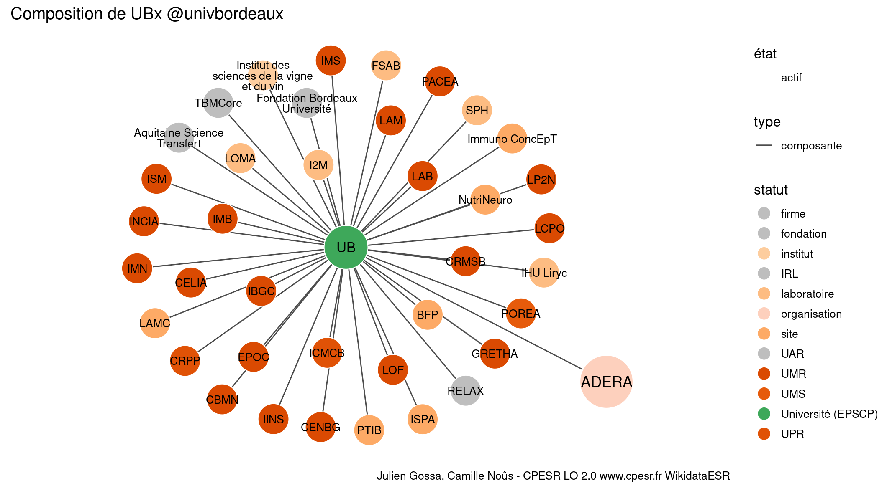 

Avertissements et édition : [logs](plots/etablissements/Q13344.md) 

### UBx @univbordeaux : Associations.     Edition des données : https://github.com/cpesr/wikidataESR/blob/master/plots/etablissements/Q13344.md 


Erreur : les données sont probablement trop partielles.
```
Error in wdesr_ggplot_graph(df, node_size = node_size, label_sizes = label_sizes, : Empty ESR graph: something went wrong with the graph production parameters

``` 

Avertissements et édition : [logs](plots/etablissements/Q13344.md) 

### uB @univbourgogne : Histoire.     Edition des données : https://github.com/cpesr/wikidataESR/blob/master/plots/etablissements/Q287072.md 


Erreur : les données sont probablement trop partielles.
```
Error in wdesr_ggplot_graph(df, node_size = node_size, label_sizes = label_sizes, : Empty ESR graph: something went wrong with the graph production parameters

``` 

Avertissements et édition : [logs](plots/etablissements/Q287072.md) 

### uB @univbourgogne : Composition.     Edition des données : https://github.com/cpesr/wikidataESR/blob/master/plots/etablissements/Q287072.md 

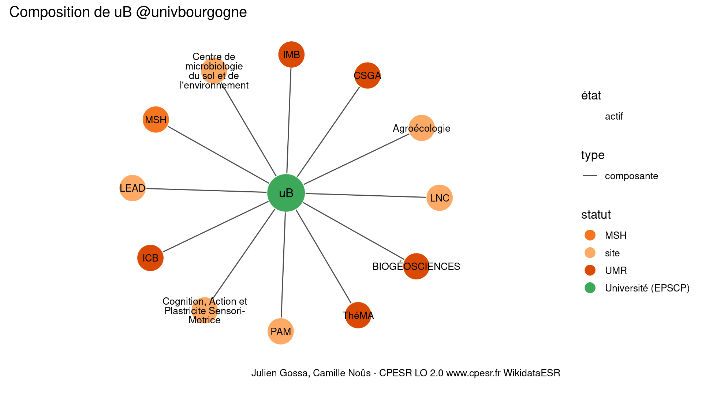 

Avertissements et édition : [logs](plots/etablissements/Q287072.md) 

### uB @univbourgogne : Associations.     Edition des données : https://github.com/cpesr/wikidataESR/blob/master/plots/etablissements/Q287072.md 

 

Avertissements et édition : [logs](plots/etablissements/Q287072.md) 

### UBO @UBO_UnivBrest : Histoire.     Edition des données : https://github.com/cpesr/wikidataESR/blob/master/plots/etablissements/Q1857334.md 


Erreur : les données sont probablement trop partielles.
```
Error in wdesr_ggplot_graph(df, node_size = node_size, label_sizes = label_sizes, : Empty ESR graph: something went wrong with the graph production parameters

``` 

Avertissements et édition : [logs](plots/etablissements/Q1857334.md) 

### UBO @UBO_UnivBrest : Composition.     Edition des données : https://github.com/cpesr/wikidataESR/blob/master/plots/etablissements/Q1857334.md 

 

Avertissements et édition : [logs](plots/etablissements/Q1857334.md) 

### UBO @UBO_UnivBrest : Associations.     Edition des données : https://github.com/cpesr/wikidataESR/blob/master/plots/etablissements/Q1857334.md 


Erreur : les données sont probablement trop partielles.
```
Error in wdesr_ggplot_graph(df, node_size = node_size, label_sizes = label_sizes, : Empty ESR graph: something went wrong with the graph production parameters

``` 

Avertissements et édition : [logs](plots/etablissements/Q1857334.md) 

### UNICAEN @universite_caen : Histoire.     Edition des données : https://github.com/cpesr/wikidataESR/blob/master/plots/etablissements/Q568554.md 


Erreur : les données sont probablement trop partielles.
```
Error in wdesr_ggplot_graph(df, node_size = node_size, label_sizes = label_sizes, : Empty ESR graph: something went wrong with the graph production parameters

``` 

Avertissements et édition : [logs](plots/etablissements/Q568554.md) 

### UNICAEN @universite_caen : Composition.     Edition des données : https://github.com/cpesr/wikidataESR/blob/master/plots/etablissements/Q568554.md 

 

Avertissements et édition : [logs](plots/etablissements/Q568554.md) 

### UNICAEN @universite_caen : Associations.     Edition des données : https://github.com/cpesr/wikidataESR/blob/master/plots/etablissements/Q568554.md 

 

Avertissements et édition : [logs](plots/etablissements/Q568554.md) 

### université de Corse @univcorse : Histoire.     Edition des données : https://github.com/cpesr/wikidataESR/blob/master/plots/etablissements/Q335841.md 


Erreur : les données sont probablement trop partielles.
```
Error in wdesr_ggplot_graph(df, node_size = node_size, label_sizes = label_sizes, : Empty ESR graph: something went wrong with the graph production parameters

``` 

Avertissements et édition : [logs](plots/etablissements/Q335841.md) 

### université de Corse @univcorse : Composition.     Edition des données : https://github.com/cpesr/wikidataESR/blob/master/plots/etablissements/Q335841.md 


Erreur : les données sont probablement trop partielles.
```
Error in wdesr_ggplot_graph(df, node_size = node_size, label_sizes = label_sizes, : Empty ESR graph: something went wrong with the graph production parameters

``` 

Avertissements et édition : [logs](plots/etablissements/Q335841.md) 

### université de Corse @univcorse : Associations.     Edition des données : https://github.com/cpesr/wikidataESR/blob/master/plots/etablissements/Q335841.md 


Erreur : les données sont probablement trop partielles.
```
Error in wdesr_ggplot_graph(df, node_size = node_size, label_sizes = label_sizes, : Empty ESR graph: something went wrong with the graph production parameters

``` 

Avertissements et édition : [logs](plots/etablissements/Q335841.md) 

### UFC @fc_univ : Histoire.     Edition des données : https://github.com/cpesr/wikidataESR/blob/master/plots/etablissements/Q829449.md 


Erreur : les données sont probablement trop partielles.
```
Error in wdesr_ggplot_graph(df, node_size = node_size, label_sizes = label_sizes, : Empty ESR graph: something went wrong with the graph production parameters

``` 

Avertissements et édition : [logs](plots/etablissements/Q829449.md) 

### UFC @fc_univ : Composition.     Edition des données : https://github.com/cpesr/wikidataESR/blob/master/plots/etablissements/Q829449.md 

 

Avertissements et édition : [logs](plots/etablissements/Q829449.md) 

### UFC @fc_univ : Associations.     Edition des données : https://github.com/cpesr/wikidataESR/blob/master/plots/etablissements/Q829449.md 

 

Avertissements et édition : [logs](plots/etablissements/Q829449.md) 

### Université de Guyane @univguyane : Histoire.     Edition des données : https://github.com/cpesr/wikidataESR/blob/master/plots/etablissements/Q16682067.md 


Erreur : les données sont probablement trop partielles.
```
Error in wdesr_ggplot_graph(df, node_size = node_size, label_sizes = label_sizes, : Empty ESR graph: something went wrong with the graph production parameters

``` 

Avertissements et édition : [logs](plots/etablissements/Q16682067.md) 

### Université de Guyane @univguyane : Composition.     Edition des données : https://github.com/cpesr/wikidataESR/blob/master/plots/etablissements/Q16682067.md 

 

Avertissements et édition : [logs](plots/etablissements/Q16682067.md) 

### Université de Guyane @univguyane : Associations.     Edition des données : https://github.com/cpesr/wikidataESR/blob/master/plots/etablissements/Q16682067.md 


Erreur : les données sont probablement trop partielles.
```
Error in wdesr_ggplot_graph(df, node_size = node_size, label_sizes = label_sizes, : Empty ESR graph: something went wrong with the graph production parameters

``` 

Avertissements et édition : [logs](plots/etablissements/Q16682067.md) 

### UHA @UHA68 : Histoire.     Edition des données : https://github.com/cpesr/wikidataESR/blob/master/plots/etablissements/Q280183.md 


Erreur : les données sont probablement trop partielles.
```
Error in wdesr_ggplot_graph(df, node_size = node_size, label_sizes = label_sizes, : Empty ESR graph: something went wrong with the graph production parameters

``` 

Avertissements et édition : [logs](plots/etablissements/Q280183.md) 

### UHA @UHA68 : Composition.     Edition des données : https://github.com/cpesr/wikidataESR/blob/master/plots/etablissements/Q280183.md 

 

Avertissements et édition : [logs](plots/etablissements/Q280183.md) 

### UHA @UHA68 : Associations.     Edition des données : https://github.com/cpesr/wikidataESR/blob/master/plots/etablissements/Q280183.md 

 

Avertissements et édition : [logs](plots/etablissements/Q280183.md) 

### Université de la Nouvelle-Calédonie @unc_nc : Histoire.     Edition des données : https://github.com/cpesr/wikidataESR/blob/master/plots/etablissements/Q734332.md 


Erreur : les données sont probablement trop partielles.
```
Error in wdesr_ggplot_graph(df, node_size = node_size, label_sizes = label_sizes, : Empty ESR graph: something went wrong with the graph production parameters

``` 

Avertissements et édition : [logs](plots/etablissements/Q734332.md) 

### Université de la Nouvelle-Calédonie @unc_nc : Composition.     Edition des données : https://github.com/cpesr/wikidataESR/blob/master/plots/etablissements/Q734332.md 

 

Avertissements et édition : [logs](plots/etablissements/Q734332.md) 

### Université de la Nouvelle-Calédonie @unc_nc : Associations.     Edition des données : https://github.com/cpesr/wikidataESR/blob/master/plots/etablissements/Q734332.md 


Erreur : les données sont probablement trop partielles.
```
Error in wdesr_ggplot_graph(df, node_size = node_size, label_sizes = label_sizes, : Empty ESR graph: something went wrong with the graph production parameters

``` 

Avertissements et édition : [logs](plots/etablissements/Q734332.md) 

### UPF @univpf : Histoire.     Edition des données : https://github.com/cpesr/wikidataESR/blob/master/plots/etablissements/Q1695245.md 


Erreur : les données sont probablement trop partielles.
```
Error in wdesr_ggplot_graph(df, node_size = node_size, label_sizes = label_sizes, : Empty ESR graph: something went wrong with the graph production parameters

``` 

Avertissements et édition : [logs](plots/etablissements/Q1695245.md) 

### UPF @univpf : Composition.     Edition des données : https://github.com/cpesr/wikidataESR/blob/master/plots/etablissements/Q1695245.md 


Erreur : les données sont probablement trop partielles.
```
Error in wdesr_ggplot_graph(df, node_size = node_size, label_sizes = label_sizes, : Empty ESR graph: something went wrong with the graph production parameters

``` 

Avertissements et édition : [logs](plots/etablissements/Q1695245.md) 

### UPF @univpf : Associations.     Edition des données : https://github.com/cpesr/wikidataESR/blob/master/plots/etablissements/Q1695245.md 


Erreur : les données sont probablement trop partielles.
```
Error in wdesr_ggplot_graph(df, node_size = node_size, label_sizes = label_sizes, : Empty ESR graph: something went wrong with the graph production parameters

``` 

Avertissements et édition : [logs](plots/etablissements/Q1695245.md) 

### UFOI @univ_reunion : Histoire.     Edition des données : https://github.com/cpesr/wikidataESR/blob/master/plots/etablissements/Q834819.md 


Erreur : les données sont probablement trop partielles.
```
Error in wdesr_ggplot_graph(df, node_size = node_size, label_sizes = label_sizes, : Empty ESR graph: something went wrong with the graph production parameters

``` 

Avertissements et édition : [logs](plots/etablissements/Q834819.md) 

### UFOI @univ_reunion : Composition.     Edition des données : https://github.com/cpesr/wikidataESR/blob/master/plots/etablissements/Q834819.md 

 

Avertissements et édition : [logs](plots/etablissements/Q834819.md) 

### UFOI @univ_reunion : Associations.     Edition des données : https://github.com/cpesr/wikidataESR/blob/master/plots/etablissements/Q834819.md 


Erreur : les données sont probablement trop partielles.
```
Error in wdesr_ggplot_graph(df, node_size = node_size, label_sizes = label_sizes, : Empty ESR graph: something went wrong with the graph production parameters

``` 

Avertissements et édition : [logs](plots/etablissements/Q834819.md) 

### UDL NA : Histoire.     Edition des données : https://github.com/cpesr/wikidataESR/blob/master/plots/etablissements/Q3551621.md 


Erreur : les données sont probablement trop partielles.
```
Error in wdesr_ggplot_graph(df, node_size = node_size, label_sizes = label_sizes, : Empty ESR graph: something went wrong with the graph production parameters

``` 

Avertissements et édition : [logs](plots/etablissements/Q3551621.md) 

### UDL NA : Composition.     Edition des données : https://github.com/cpesr/wikidataESR/blob/master/plots/etablissements/Q3551621.md 


Erreur : les données sont probablement trop partielles.
```
Error in wdesr_ggplot_graph(df, node_size = node_size, label_sizes = label_sizes, : Empty ESR graph: something went wrong with the graph production parameters

``` 

Avertissements et édition : [logs](plots/etablissements/Q3551621.md) 

### UDL NA : Associations.     Edition des données : https://github.com/cpesr/wikidataESR/blob/master/plots/etablissements/Q3551621.md 


Erreur : les données sont probablement trop partielles.
```
Error in wdesr_ggplot_graph(df, node_size = node_size, label_sizes = label_sizes, : Empty ESR graph: something went wrong with the graph production parameters

``` 

Avertissements et édition : [logs](plots/etablissements/Q3551621.md) 

### Unilim @unilim : Histoire.     Edition des données : https://github.com/cpesr/wikidataESR/blob/master/plots/etablissements/Q2661290.md 


Erreur : les données sont probablement trop partielles.
```
Error in wdesr_ggplot_graph(df, node_size = node_size, label_sizes = label_sizes, : Empty ESR graph: something went wrong with the graph production parameters

``` 

Avertissements et édition : [logs](plots/etablissements/Q2661290.md) 

### Unilim @unilim : Composition.     Edition des données : https://github.com/cpesr/wikidataESR/blob/master/plots/etablissements/Q2661290.md 

 

Avertissements et édition : [logs](plots/etablissements/Q2661290.md) 

### Unilim @unilim : Associations.     Edition des données : https://github.com/cpesr/wikidataESR/blob/master/plots/etablissements/Q2661290.md 


Erreur : les données sont probablement trop partielles.
```
Error in wdesr_ggplot_graph(df, node_size = node_size, label_sizes = label_sizes, : Empty ESR graph: something went wrong with the graph production parameters

``` 

Avertissements et édition : [logs](plots/etablissements/Q2661290.md) 

### université de Lorraine @Univ_Lorraine : Histoire.     Edition des données : https://github.com/cpesr/wikidataESR/blob/master/plots/etablissements/Q4173330.md 

 

Avertissements et édition : [logs](plots/etablissements/Q4173330.md) 

### université de Lorraine @Univ_Lorraine : Composition.     Edition des données : https://github.com/cpesr/wikidataESR/blob/master/plots/etablissements/Q4173330.md 

 

Avertissements et édition : [logs](plots/etablissements/Q4173330.md) 

### université de Lorraine @Univ_Lorraine : Associations.     Edition des données : https://github.com/cpesr/wikidataESR/blob/master/plots/etablissements/Q4173330.md 

 

Avertissements et édition : [logs](plots/etablissements/Q4173330.md) 

### Université de Montpellier NA : Histoire.     Edition des données : https://github.com/cpesr/wikidataESR/blob/master/plots/etablissements/Q776223.md 

 

Avertissements et édition : [logs](plots/etablissements/Q776223.md) 

### Université de Montpellier NA : Composition.     Edition des données : https://github.com/cpesr/wikidataESR/blob/master/plots/etablissements/Q776223.md 

 

Avertissements et édition : [logs](plots/etablissements/Q776223.md) 

### Université de Montpellier NA : Associations.     Edition des données : https://github.com/cpesr/wikidataESR/blob/master/plots/etablissements/Q776223.md 

 

Avertissements et édition : [logs](plots/etablissements/Q776223.md) 

### UNÎMES @unimesfr : Histoire.     Edition des données : https://github.com/cpesr/wikidataESR/blob/master/plots/etablissements/Q2496121.md 


Erreur : les données sont probablement trop partielles.
```
Error in wdesr_ggplot_graph(df, node_size = node_size, label_sizes = label_sizes, : Empty ESR graph: something went wrong with the graph production parameters

``` 

Avertissements et édition : [logs](plots/etablissements/Q2496121.md) 

### UNÎMES @unimesfr : Composition.     Edition des données : https://github.com/cpesr/wikidataESR/blob/master/plots/etablissements/Q2496121.md 

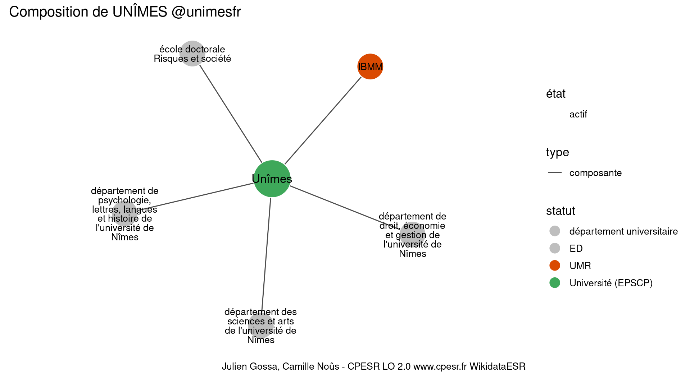 

Avertissements et édition : [logs](plots/etablissements/Q2496121.md) 

### UNÎMES @unimesfr : Associations.     Edition des données : https://github.com/cpesr/wikidataESR/blob/master/plots/etablissements/Q2496121.md 

 

Avertissements et édition : [logs](plots/etablissements/Q2496121.md) 

### UPC @Univ_Paris : Histoire.     Edition des données : https://github.com/cpesr/wikidataESR/blob/master/plots/etablissements/Q55849612.md 

 

Avertissements et édition : [logs](plots/etablissements/Q55849612.md) 

### UPC @Univ_Paris : Composition.     Edition des données : https://github.com/cpesr/wikidataESR/blob/master/plots/etablissements/Q55849612.md 

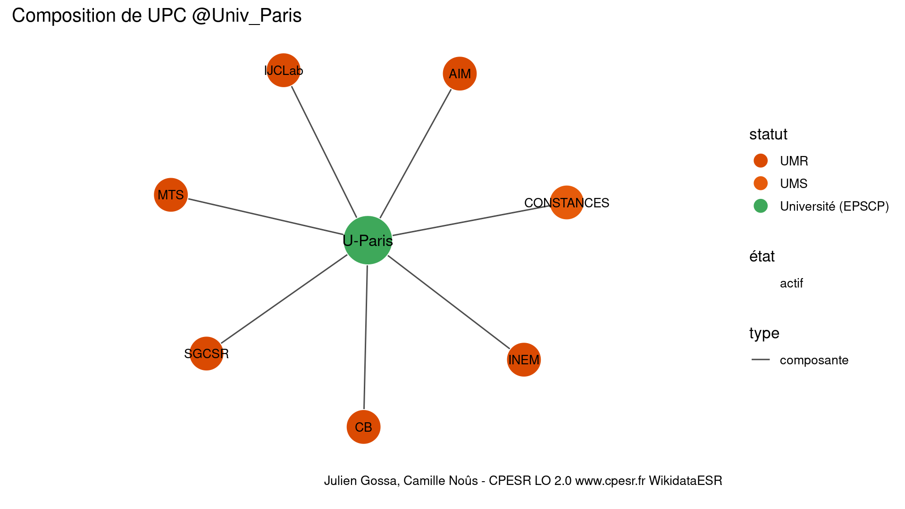 

Avertissements et édition : [logs](plots/etablissements/Q55849612.md) 

### UPC @Univ_Paris : Associations.     Edition des données : https://github.com/cpesr/wikidataESR/blob/master/plots/etablissements/Q55849612.md 


Erreur : les données sont probablement trop partielles.
```
Error in ans[npos] <- rep(no, length.out = len)[npos]: l'argument de remplacement est de longueur nulle

``` 

Avertissements et édition : [logs](plots/etablissements/Q55849612.md) 

### UPPA @universite_uppa : Histoire.     Edition des données : https://github.com/cpesr/wikidataESR/blob/master/plots/etablissements/Q572968.md 


Erreur : les données sont probablement trop partielles.
```
Error in wdesr_ggplot_graph(df, node_size = node_size, label_sizes = label_sizes, : Empty ESR graph: something went wrong with the graph production parameters

``` 

Avertissements et édition : [logs](plots/etablissements/Q572968.md) 

### UPPA @universite_uppa : Composition.     Edition des données : https://github.com/cpesr/wikidataESR/blob/master/plots/etablissements/Q572968.md 

 

Avertissements et édition : [logs](plots/etablissements/Q572968.md) 

### UPPA @universite_uppa : Associations.     Edition des données : https://github.com/cpesr/wikidataESR/blob/master/plots/etablissements/Q572968.md 


Erreur : les données sont probablement trop partielles.
```
Error in wdesr_ggplot_graph(df, node_size = node_size, label_sizes = label_sizes, : Empty ESR graph: something went wrong with the graph production parameters

``` 

Avertissements et édition : [logs](plots/etablissements/Q572968.md) 

### UPVD @upvd1 : Histoire.     Edition des données : https://github.com/cpesr/wikidataESR/blob/master/plots/etablissements/Q304872.md 

 

Avertissements et édition : [logs](plots/etablissements/Q304872.md) 

### UPVD @upvd1 : Composition.     Edition des données : https://github.com/cpesr/wikidataESR/blob/master/plots/etablissements/Q304872.md 

 

Avertissements et édition : [logs](plots/etablissements/Q304872.md) 

### UPVD @upvd1 : Associations.     Edition des données : https://github.com/cpesr/wikidataESR/blob/master/plots/etablissements/Q304872.md 

 

Avertissements et édition : [logs](plots/etablissements/Q304872.md) 

### UPJV @UPJV_Univ : Histoire.     Edition des données : https://github.com/cpesr/wikidataESR/blob/master/plots/etablissements/Q947747.md 


Erreur : les données sont probablement trop partielles.
```
Error in wdesr_ggplot_graph(df, node_size = node_size, label_sizes = label_sizes, : Empty ESR graph: something went wrong with the graph production parameters

``` 

Avertissements et édition : [logs](plots/etablissements/Q947747.md) 

### UPJV @UPJV_Univ : Composition.     Edition des données : https://github.com/cpesr/wikidataESR/blob/master/plots/etablissements/Q947747.md 


Erreur : les données sont probablement trop partielles.
```
Error in wdesr_ggplot_graph(df, node_size = node_size, label_sizes = label_sizes, : Empty ESR graph: something went wrong with the graph production parameters

``` 

Avertissements et édition : [logs](plots/etablissements/Q947747.md) 

### UPJV @UPJV_Univ : Associations.     Edition des données : https://github.com/cpesr/wikidataESR/blob/master/plots/etablissements/Q947747.md 


Erreur : les données sont probablement trop partielles.
```
Error in wdesr_ggplot_graph(df, node_size = node_size, label_sizes = label_sizes, : Empty ESR graph: something went wrong with the graph production parameters

``` 

Avertissements et édition : [logs](plots/etablissements/Q947747.md) 

### UnivPoitiers @UnivPoitiers : Histoire.     Edition des données : https://github.com/cpesr/wikidataESR/blob/master/plots/etablissements/Q661056.md 


Erreur : les données sont probablement trop partielles.
```
Error in wdesr_ggplot_graph(df, node_size = node_size, label_sizes = label_sizes, : Empty ESR graph: something went wrong with the graph production parameters

``` 

Avertissements et édition : [logs](plots/etablissements/Q661056.md) 

### UnivPoitiers @UnivPoitiers : Composition.     Edition des données : https://github.com/cpesr/wikidataESR/blob/master/plots/etablissements/Q661056.md 

 

Avertissements et édition : [logs](plots/etablissements/Q661056.md) 

### UnivPoitiers @UnivPoitiers : Associations.     Edition des données : https://github.com/cpesr/wikidataESR/blob/master/plots/etablissements/Q661056.md 


Erreur : les données sont probablement trop partielles.
```
Error in wdesr_ggplot_graph(df, node_size = node_size, label_sizes = label_sizes, : Empty ESR graph: something went wrong with the graph production parameters

``` 

Avertissements et édition : [logs](plots/etablissements/Q661056.md) 

### URCA @universitereims : Histoire.     Edition des données : https://github.com/cpesr/wikidataESR/blob/master/plots/etablissements/Q2496149.md 


Erreur : les données sont probablement trop partielles.
```
Error in wdesr_ggplot_graph(df, node_size = node_size, label_sizes = label_sizes, : Empty ESR graph: something went wrong with the graph production parameters

``` 

Avertissements et édition : [logs](plots/etablissements/Q2496149.md) 

### URCA @universitereims : Composition.     Edition des données : https://github.com/cpesr/wikidataESR/blob/master/plots/etablissements/Q2496149.md 

 

Avertissements et édition : [logs](plots/etablissements/Q2496149.md) 

### URCA @universitereims : Associations.     Edition des données : https://github.com/cpesr/wikidataESR/blob/master/plots/etablissements/Q2496149.md 

 

Avertissements et édition : [logs](plots/etablissements/Q2496149.md) 

### UR1 @UnivRennes1 : Histoire.     Edition des données : https://github.com/cpesr/wikidataESR/blob/master/plots/etablissements/Q726595.md 

 

Avertissements et édition : [logs](plots/etablissements/Q726595.md) 

### UR1 @UnivRennes1 : Composition.     Edition des données : https://github.com/cpesr/wikidataESR/blob/master/plots/etablissements/Q726595.md 

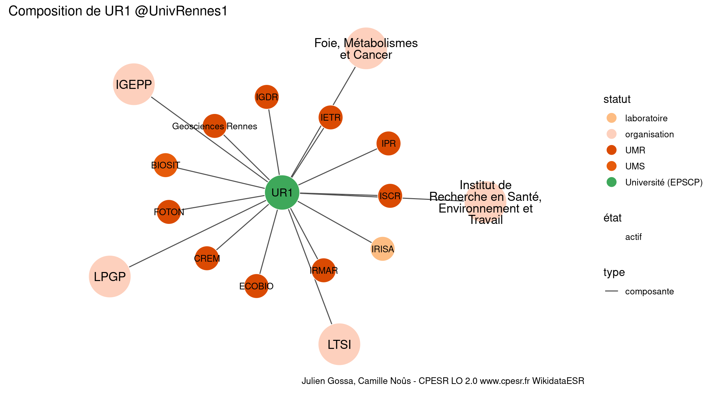 

Avertissements et édition : [logs](plots/etablissements/Q726595.md) 

### UR1 @UnivRennes1 : Associations.     Edition des données : https://github.com/cpesr/wikidataESR/blob/master/plots/etablissements/Q726595.md 


Erreur : les données sont probablement trop partielles.
```
Error in wdesr_ggplot_graph(df, node_size = node_size, label_sizes = label_sizes, : Empty ESR graph: something went wrong with the graph production parameters

``` 

Avertissements et édition : [logs](plots/etablissements/Q726595.md) 

### URN NA : Histoire.     Edition des données : https://github.com/cpesr/wikidataESR/blob/master/plots/etablissements/Q494247.md 


Erreur : les données sont probablement trop partielles.
```
Error in wdesr_ggplot_graph(df, node_size = node_size, label_sizes = label_sizes, : Empty ESR graph: something went wrong with the graph production parameters

``` 

Avertissements et édition : [logs](plots/etablissements/Q494247.md) 

### URN NA : Composition.     Edition des données : https://github.com/cpesr/wikidataESR/blob/master/plots/etablissements/Q494247.md 

 

Avertissements et édition : [logs](plots/etablissements/Q494247.md) 

### URN NA : Associations.     Edition des données : https://github.com/cpesr/wikidataESR/blob/master/plots/etablissements/Q494247.md 

 

Avertissements et édition : [logs](plots/etablissements/Q494247.md) 

### Unistra @unistra : Histoire.     Edition des données : https://github.com/cpesr/wikidataESR/blob/master/plots/etablissements/Q157575.md 

 

Avertissements et édition : [logs](plots/etablissements/Q157575.md) 

### Unistra @unistra : Composition.     Edition des données : https://github.com/cpesr/wikidataESR/blob/master/plots/etablissements/Q157575.md 

 

Avertissements et édition : [logs](plots/etablissements/Q157575.md) 

### Unistra @unistra : Associations.     Edition des données : https://github.com/cpesr/wikidataESR/blob/master/plots/etablissements/Q157575.md 

 

Avertissements et édition : [logs](plots/etablissements/Q157575.md) 

### Ustv @univtoulon : Histoire.     Edition des données : https://github.com/cpesr/wikidataESR/blob/master/plots/etablissements/Q1816857.md 


Erreur : les données sont probablement trop partielles.
```
Error in wdesr_ggplot_graph(df, node_size = node_size, label_sizes = label_sizes, : Empty ESR graph: something went wrong with the graph production parameters

``` 

Avertissements et édition : [logs](plots/etablissements/Q1816857.md) 

### Ustv @univtoulon : Composition.     Edition des données : https://github.com/cpesr/wikidataESR/blob/master/plots/etablissements/Q1816857.md 

 

Avertissements et édition : [logs](plots/etablissements/Q1816857.md) 

### Ustv @univtoulon : Associations.     Edition des données : https://github.com/cpesr/wikidataESR/blob/master/plots/etablissements/Q1816857.md 


Erreur : les données sont probablement trop partielles.
```
Error in ans[npos] <- rep(no, length.out = len)[npos]: l'argument de remplacement est de longueur nulle

``` 

Avertissements et édition : [logs](plots/etablissements/Q1816857.md) 

### université de Tours @UnivTours : Histoire.     Edition des données : https://github.com/cpesr/wikidataESR/blob/master/plots/etablissements/Q494335.md 

 

Avertissements et édition : [logs](plots/etablissements/Q494335.md) 

### université de Tours @UnivTours : Composition.     Edition des données : https://github.com/cpesr/wikidataESR/blob/master/plots/etablissements/Q494335.md 

 

Avertissements et édition : [logs](plots/etablissements/Q494335.md) 

### université de Tours @UnivTours : Associations.     Edition des données : https://github.com/cpesr/wikidataESR/blob/master/plots/etablissements/Q494335.md 

 

Avertissements et édition : [logs](plots/etablissements/Q494335.md) 

### UVSQ @uvsq : Histoire.     Edition des données : https://github.com/cpesr/wikidataESR/blob/master/plots/etablissements/Q186638.md 


Erreur : les données sont probablement trop partielles.
```
Error in wdesr_ggplot_graph(df, node_size = node_size, label_sizes = label_sizes, : Empty ESR graph: something went wrong with the graph production parameters

``` 

Avertissements et édition : [logs](plots/etablissements/Q186638.md) 

### UVSQ @uvsq : Composition.     Edition des données : https://github.com/cpesr/wikidataESR/blob/master/plots/etablissements/Q186638.md 

 

Avertissements et édition : [logs](plots/etablissements/Q186638.md) 

### UVSQ @uvsq : Associations.     Edition des données : https://github.com/cpesr/wikidataESR/blob/master/plots/etablissements/Q186638.md 

 

Avertissements et édition : [logs](plots/etablissements/Q186638.md) 

### UnivAG @UnivAntilles : Histoire.     Edition des données : https://github.com/cpesr/wikidataESR/blob/master/plots/etablissements/Q16682075.md 


Erreur : les données sont probablement trop partielles.
```
Error in wdesr_ggplot_graph(df, node_size = node_size, label_sizes = label_sizes, : Empty ESR graph: something went wrong with the graph production parameters

``` 

Avertissements et édition : [logs](plots/etablissements/Q16682075.md) 

### UnivAG @UnivAntilles : Composition.     Edition des données : https://github.com/cpesr/wikidataESR/blob/master/plots/etablissements/Q16682075.md 


Erreur : les données sont probablement trop partielles.
```
Error in wdesr_ggplot_graph(df, node_size = node_size, label_sizes = label_sizes, : Empty ESR graph: something went wrong with the graph production parameters

``` 

Avertissements et édition : [logs](plots/etablissements/Q16682075.md) 

### UnivAG @UnivAntilles : Associations.     Edition des données : https://github.com/cpesr/wikidataESR/blob/master/plots/etablissements/Q16682075.md 


Erreur : les données sont probablement trop partielles.
```
Error in wdesr_ggplot_graph(df, node_size = node_size, label_sizes = label_sizes, : Empty ESR graph: something went wrong with the graph production parameters

``` 

Avertissements et édition : [logs](plots/etablissements/Q16682075.md) 

### ULCO @ULCO_Univ : Histoire.     Edition des données : https://github.com/cpesr/wikidataESR/blob/master/plots/etablissements/Q3551755.md 


Erreur : les données sont probablement trop partielles.
```
Error in wdesr_ggplot_graph(df, node_size = node_size, label_sizes = label_sizes, : Empty ESR graph: something went wrong with the graph production parameters

``` 

Avertissements et édition : [logs](plots/etablissements/Q3551755.md) 

### ULCO @ULCO_Univ : Composition.     Edition des données : https://github.com/cpesr/wikidataESR/blob/master/plots/etablissements/Q3551755.md 

 

Avertissements et édition : [logs](plots/etablissements/Q3551755.md) 

### ULCO @ULCO_Univ : Associations.     Edition des données : https://github.com/cpesr/wikidataESR/blob/master/plots/etablissements/Q3551755.md 


Erreur : les données sont probablement trop partielles.
```
Error in wdesr_ggplot_graph(df, node_size = node_size, label_sizes = label_sizes, : Empty ESR graph: something went wrong with the graph production parameters

``` 

Avertissements et édition : [logs](plots/etablissements/Q3551755.md) 

### UGA @UGrenobleAlpes : Histoire.     Edition des données : https://github.com/cpesr/wikidataESR/blob/master/plots/etablissements/Q945876.md 

 

Avertissements et édition : [logs](plots/etablissements/Q945876.md) 

### UGA @UGrenobleAlpes : Composition.     Edition des données : https://github.com/cpesr/wikidataESR/blob/master/plots/etablissements/Q945876.md 

 

Avertissements et édition : [logs](plots/etablissements/Q945876.md) 

### UGA @UGrenobleAlpes : Associations.     Edition des données : https://github.com/cpesr/wikidataESR/blob/master/plots/etablissements/Q945876.md 


Erreur : les données sont probablement trop partielles.
```
Error in wdesr_ggplot_graph(df, node_size = node_size, label_sizes = label_sizes, : Empty ESR graph: something went wrong with the graph production parameters

``` 

Avertissements et édition : [logs](plots/etablissements/Q945876.md) 

### UGE @UGustaveEiffel : Histoire.     Edition des données : https://github.com/cpesr/wikidataESR/blob/master/plots/etablissements/Q65153823.md 

 

Avertissements et édition : [logs](plots/etablissements/Q65153823.md) 

### UGE @UGustaveEiffel : Composition.     Edition des données : https://github.com/cpesr/wikidataESR/blob/master/plots/etablissements/Q65153823.md 

 

Avertissements et édition : [logs](plots/etablissements/Q65153823.md) 

### UGE @UGustaveEiffel : Associations.     Edition des données : https://github.com/cpesr/wikidataESR/blob/master/plots/etablissements/Q65153823.md 


Erreur : les données sont probablement trop partielles.
```
Error in wdesr_ggplot_graph(df, node_size = node_size, label_sizes = label_sizes, : Empty ESR graph: something went wrong with the graph production parameters

``` 

Avertissements et édition : [logs](plots/etablissements/Q65153823.md) 

### UJM @Univ_St_Etienne : Histoire.     Edition des données : https://github.com/cpesr/wikidataESR/blob/master/plots/etablissements/Q623154.md 


Erreur : les données sont probablement trop partielles.
```
Error in wdesr_ggplot_graph(df, node_size = node_size, label_sizes = label_sizes, : Empty ESR graph: something went wrong with the graph production parameters

``` 

Avertissements et édition : [logs](plots/etablissements/Q623154.md) 

### UJM @Univ_St_Etienne : Composition.     Edition des données : https://github.com/cpesr/wikidataESR/blob/master/plots/etablissements/Q623154.md 

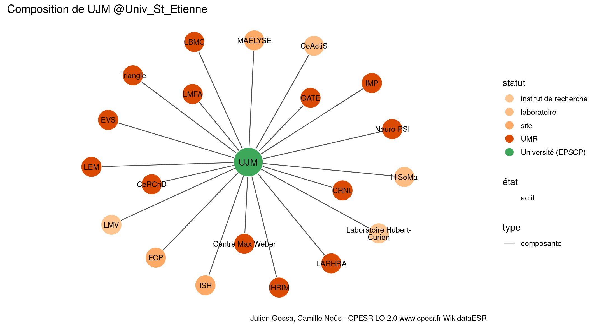 

Avertissements et édition : [logs](plots/etablissements/Q623154.md) 

### UJM @Univ_St_Etienne : Associations.     Edition des données : https://github.com/cpesr/wikidataESR/blob/master/plots/etablissements/Q623154.md 

 

Avertissements et édition : [logs](plots/etablissements/Q623154.md) 

### Lyon 3 @UJML : Histoire.     Edition des données : https://github.com/cpesr/wikidataESR/blob/master/plots/etablissements/Q4027.md 

 

Avertissements et édition : [logs](plots/etablissements/Q4027.md) 

### Lyon 3 @UJML : Composition.     Edition des données : https://github.com/cpesr/wikidataESR/blob/master/plots/etablissements/Q4027.md 

 

Avertissements et édition : [logs](plots/etablissements/Q4027.md) 

### Lyon 3 @UJML : Associations.     Edition des données : https://github.com/cpesr/wikidataESR/blob/master/plots/etablissements/Q4027.md 

 

Avertissements et édition : [logs](plots/etablissements/Q4027.md) 

### ULH NA : Histoire.     Edition des données : https://github.com/cpesr/wikidataESR/blob/master/plots/etablissements/Q1784954.md 


Erreur : les données sont probablement trop partielles.
```
Error in wdesr_ggplot_graph(df, node_size = node_size, label_sizes = label_sizes, : Empty ESR graph: something went wrong with the graph production parameters

``` 

Avertissements et édition : [logs](plots/etablissements/Q1784954.md) 

### ULH NA : Composition.     Edition des données : https://github.com/cpesr/wikidataESR/blob/master/plots/etablissements/Q1784954.md 

 

Avertissements et édition : [logs](plots/etablissements/Q1784954.md) 

### ULH NA : Associations.     Edition des données : https://github.com/cpesr/wikidataESR/blob/master/plots/etablissements/Q1784954.md 

 

Avertissements et édition : [logs](plots/etablissements/Q1784954.md) 

### Lyon 2 @univ_lyon2 : Histoire.     Edition des données : https://github.com/cpesr/wikidataESR/blob/master/plots/etablissements/Q4041.md 

 

Avertissements et édition : [logs](plots/etablissements/Q4041.md) 

### Lyon 2 @univ_lyon2 : Composition.     Edition des données : https://github.com/cpesr/wikidataESR/blob/master/plots/etablissements/Q4041.md 

 

Avertissements et édition : [logs](plots/etablissements/Q4041.md) 

### Lyon 2 @univ_lyon2 : Associations.     Edition des données : https://github.com/cpesr/wikidataESR/blob/master/plots/etablissements/Q4041.md 

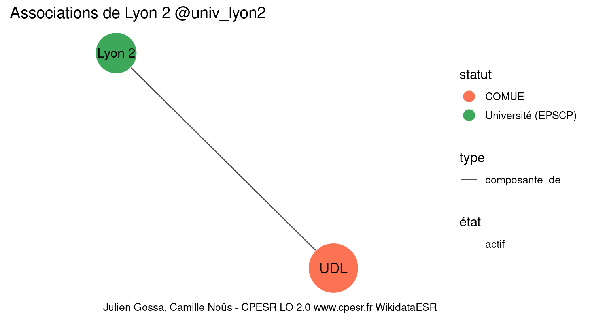 

Avertissements et édition : [logs](plots/etablissements/Q4041.md) 

### Assas @AssasParis2 : Histoire.     Edition des données : https://github.com/cpesr/wikidataESR/blob/master/plots/etablissements/Q662976.md 

 

Avertissements et édition : [logs](plots/etablissements/Q662976.md) 

### Assas @AssasParis2 : Composition.     Edition des données : https://github.com/cpesr/wikidataESR/blob/master/plots/etablissements/Q662976.md 

 

Avertissements et édition : [logs](plots/etablissements/Q662976.md) 

### Assas @AssasParis2 : Associations.     Edition des données : https://github.com/cpesr/wikidataESR/blob/master/plots/etablissements/Q662976.md 

 

Avertissements et édition : [logs](plots/etablissements/Q662976.md) 

### Paris 1 @SorbonneParis1 : Histoire.     Edition des données : https://github.com/cpesr/wikidataESR/blob/master/plots/etablissements/Q999763.md 

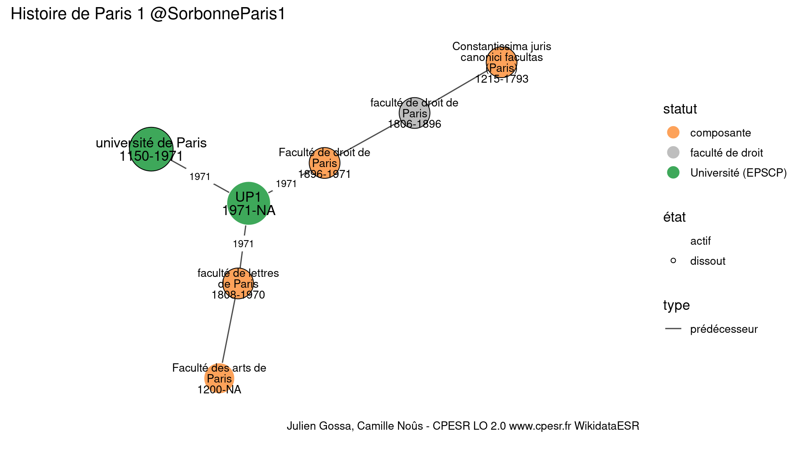 

Avertissements et édition : [logs](plots/etablissements/Q999763.md) 

### Paris 1 @SorbonneParis1 : Composition.     Edition des données : https://github.com/cpesr/wikidataESR/blob/master/plots/etablissements/Q999763.md 

 

Avertissements et édition : [logs](plots/etablissements/Q999763.md) 

### Paris 1 @SorbonneParis1 : Associations.     Edition des données : https://github.com/cpesr/wikidataESR/blob/master/plots/etablissements/Q999763.md 

 

Avertissements et édition : [logs](plots/etablissements/Q999763.md) 

### UP8 @UnivParis8 : Histoire.     Edition des données : https://github.com/cpesr/wikidataESR/blob/master/plots/etablissements/Q1194988.md 

 

Avertissements et édition : [logs](plots/etablissements/Q1194988.md) 

### UP8 @UnivParis8 : Composition.     Edition des données : https://github.com/cpesr/wikidataESR/blob/master/plots/etablissements/Q1194988.md 

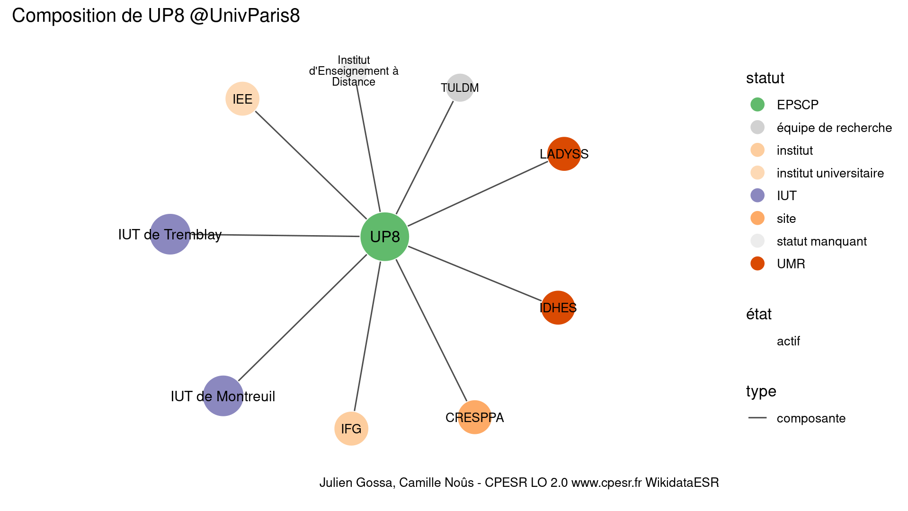 

Avertissements et édition : [logs](plots/etablissements/Q1194988.md) 

### UP8 @UnivParis8 : Associations.     Edition des données : https://github.com/cpesr/wikidataESR/blob/master/plots/etablissements/Q1194988.md 

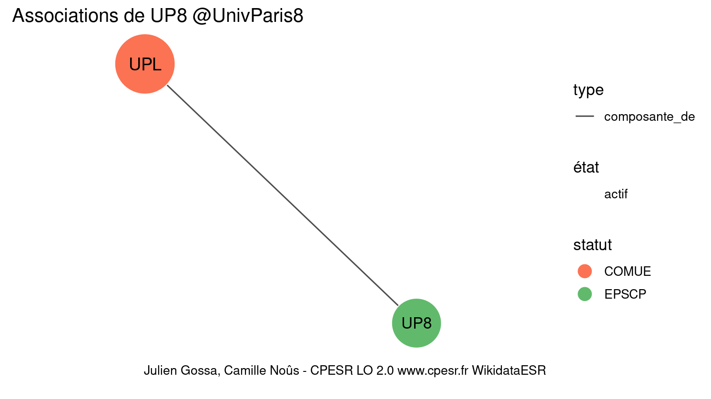 

Avertissements et édition : [logs](plots/etablissements/Q1194988.md) 

### Paris-Dauphine NA : Histoire.     Edition des données : https://github.com/cpesr/wikidataESR/blob/master/plots/etablissements/Q1546437.md 

 

Avertissements et édition : [logs](plots/etablissements/Q1546437.md) 

### Paris-Dauphine NA : Composition.     Edition des données : https://github.com/cpesr/wikidataESR/blob/master/plots/etablissements/Q1546437.md 

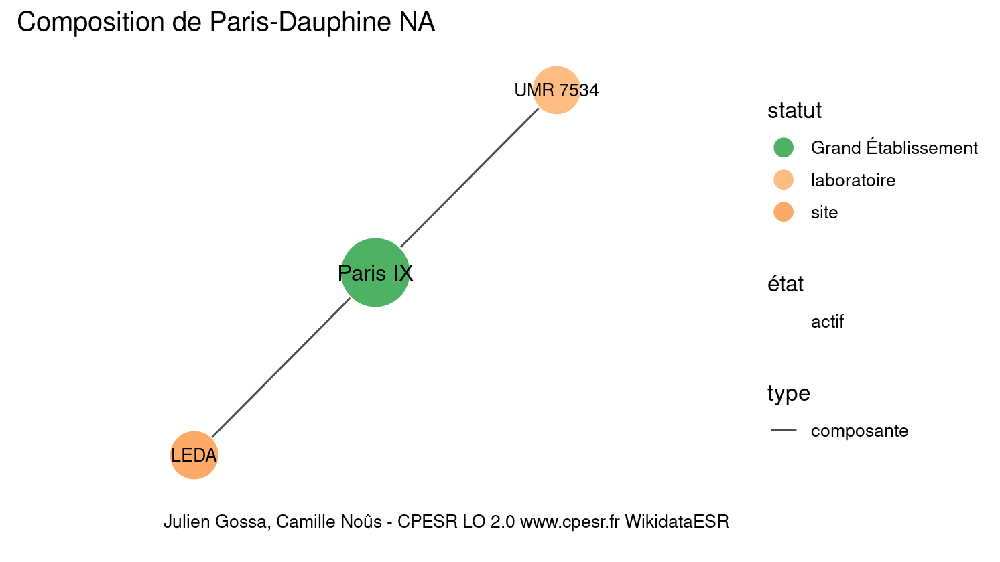 

Avertissements et édition : [logs](plots/etablissements/Q1546437.md) 

### Paris-Dauphine NA : Associations.     Edition des données : https://github.com/cpesr/wikidataESR/blob/master/plots/etablissements/Q1546437.md 

 

Avertissements et édition : [logs](plots/etablissements/Q1546437.md) 

### Paris X @uparisnanterre : Histoire.     Edition des données : https://github.com/cpesr/wikidataESR/blob/master/plots/etablissements/Q1394262.md 

 

Avertissements et édition : [logs](plots/etablissements/Q1394262.md) 

### Paris X @uparisnanterre : Composition.     Edition des données : https://github.com/cpesr/wikidataESR/blob/master/plots/etablissements/Q1394262.md 

 

Avertissements et édition : [logs](plots/etablissements/Q1394262.md) 

### Paris X @uparisnanterre : Associations.     Edition des données : https://github.com/cpesr/wikidataESR/blob/master/plots/etablissements/Q1394262.md 

 

Avertissements et édition : [logs](plots/etablissements/Q1394262.md) 

### PSL @psl_univ : Histoire.     Edition des données : https://github.com/cpesr/wikidataESR/blob/master/plots/etablissements/Q1163431.md 

 

Avertissements et édition : [logs](plots/etablissements/Q1163431.md) 

### PSL @psl_univ : Composition.     Edition des données : https://github.com/cpesr/wikidataESR/blob/master/plots/etablissements/Q1163431.md 

 

Avertissements et édition : [logs](plots/etablissements/Q1163431.md) 

### PSL @psl_univ : Associations.     Edition des données : https://github.com/cpesr/wikidataESR/blob/master/plots/etablissements/Q1163431.md 


Erreur : les données sont probablement trop partielles.
```
Error in wdesr_ggplot_graph(df, node_size = node_size, label_sizes = label_sizes, : Empty ESR graph: something went wrong with the graph production parameters

``` 

Avertissements et édition : [logs](plots/etablissements/Q1163431.md) 

### UPEC @UPECactus : Histoire.     Edition des données : https://github.com/cpesr/wikidataESR/blob/master/plots/etablissements/Q980688.md 

 

Avertissements et édition : [logs](plots/etablissements/Q980688.md) 

### UPEC @UPECactus : Composition.     Edition des données : https://github.com/cpesr/wikidataESR/blob/master/plots/etablissements/Q980688.md 

 

Avertissements et édition : [logs](plots/etablissements/Q980688.md) 

### UPEC @UPECactus : Associations.     Edition des données : https://github.com/cpesr/wikidataESR/blob/master/plots/etablissements/Q980688.md 

 

Avertissements et édition : [logs](plots/etablissements/Q980688.md) 

### UPSaclay @UnivParisSaclay : Histoire.     Edition des données : https://github.com/cpesr/wikidataESR/blob/master/plots/etablissements/Q109409389.md 

 

Avertissements et édition : [logs](plots/etablissements/Q109409389.md) 

### UPSaclay @UnivParisSaclay : Composition.     Edition des données : https://github.com/cpesr/wikidataESR/blob/master/plots/etablissements/Q109409389.md 

 

Avertissements et édition : [logs](plots/etablissements/Q109409389.md) 

### UPSaclay @UnivParisSaclay : Associations.     Edition des données : https://github.com/cpesr/wikidataESR/blob/master/plots/etablissements/Q109409389.md 

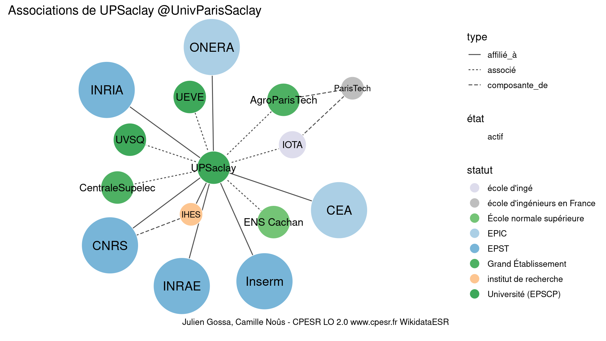 

Avertissements et édition : [logs](plots/etablissements/Q109409389.md) 

### UPV @univpaulvalery : Histoire.     Edition des données : https://github.com/cpesr/wikidataESR/blob/master/plots/etablissements/Q2912244.md 

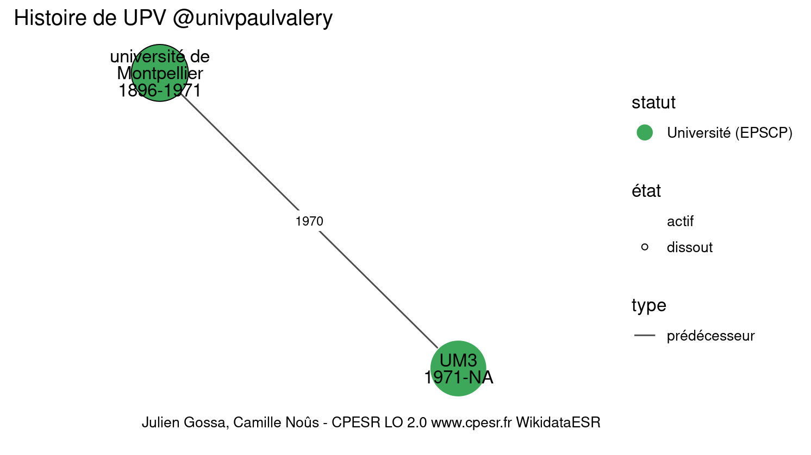 

Avertissements et édition : [logs](plots/etablissements/Q2912244.md) 

### UPV @univpaulvalery : Composition.     Edition des données : https://github.com/cpesr/wikidataESR/blob/master/plots/etablissements/Q2912244.md 

 

Avertissements et édition : [logs](plots/etablissements/Q2912244.md) 

### UPV @univpaulvalery : Associations.     Edition des données : https://github.com/cpesr/wikidataESR/blob/master/plots/etablissements/Q2912244.md 

 

Avertissements et édition : [logs](plots/etablissements/Q2912244.md) 

### UPHF @UphfOfficiel : Histoire.     Edition des données : https://github.com/cpesr/wikidataESR/blob/master/plots/etablissements/Q1548539.md 

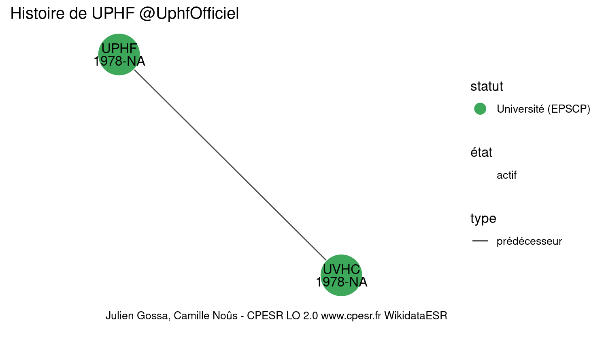 

Avertissements et édition : [logs](plots/etablissements/Q1548539.md) 

### UPHF @UphfOfficiel : Composition.     Edition des données : https://github.com/cpesr/wikidataESR/blob/master/plots/etablissements/Q1548539.md 

 

Avertissements et édition : [logs](plots/etablissements/Q1548539.md) 

### UPHF @UphfOfficiel : Associations.     Edition des données : https://github.com/cpesr/wikidataESR/blob/master/plots/etablissements/Q1548539.md 


Erreur : les données sont probablement trop partielles.
```
Error in wdesr_ggplot_graph(df, node_size = node_size, label_sizes = label_sizes, : Empty ESR graph: something went wrong with the graph production parameters

``` 

Avertissements et édition : [logs](plots/etablissements/Q1548539.md) 

### Rennes 2 @Univ_Rennes2 : Histoire.     Edition des données : https://github.com/cpesr/wikidataESR/blob/master/plots/etablissements/Q459026.md 

 

Avertissements et édition : [logs](plots/etablissements/Q459026.md) 

### Rennes 2 @Univ_Rennes2 : Composition.     Edition des données : https://github.com/cpesr/wikidataESR/blob/master/plots/etablissements/Q459026.md 

 

Avertissements et édition : [logs](plots/etablissements/Q459026.md) 

### Rennes 2 @Univ_Rennes2 : Associations.     Edition des données : https://github.com/cpesr/wikidataESR/blob/master/plots/etablissements/Q459026.md 

 

Avertissements et édition : [logs](plots/etablissements/Q459026.md) 

### USMB @Univ_Savoie : Histoire.     Edition des données : https://github.com/cpesr/wikidataESR/blob/master/plots/etablissements/Q2496158.md 


Erreur : les données sont probablement trop partielles.
```
Error in wdesr_ggplot_graph(df, node_size = node_size, label_sizes = label_sizes, : Empty ESR graph: something went wrong with the graph production parameters

``` 

Avertissements et édition : [logs](plots/etablissements/Q2496158.md) 

### USMB @Univ_Savoie : Composition.     Edition des données : https://github.com/cpesr/wikidataESR/blob/master/plots/etablissements/Q2496158.md 

 

Avertissements et édition : [logs](plots/etablissements/Q2496158.md) 

### USMB @Univ_Savoie : Associations.     Edition des données : https://github.com/cpesr/wikidataESR/blob/master/plots/etablissements/Q2496158.md 


Erreur : les données sont probablement trop partielles.
```
Error in wdesr_ggplot_graph(df, node_size = node_size, label_sizes = label_sizes, : Empty ESR graph: something went wrong with the graph production parameters

``` 

Avertissements et édition : [logs](plots/etablissements/Q2496158.md) 

### Paris 3 @SorbonneParis3 : Histoire.     Edition des données : https://github.com/cpesr/wikidataESR/blob/master/plots/etablissements/Q571293.md 

 

Avertissements et édition : [logs](plots/etablissements/Q571293.md) 

### Paris 3 @SorbonneParis3 : Composition.     Edition des données : https://github.com/cpesr/wikidataESR/blob/master/plots/etablissements/Q571293.md 

 

Avertissements et édition : [logs](plots/etablissements/Q571293.md) 

### Paris 3 @SorbonneParis3 : Associations.     Edition des données : https://github.com/cpesr/wikidataESR/blob/master/plots/etablissements/Q571293.md 


Erreur : les données sont probablement trop partielles.
```
Error in wdesr_ggplot_graph(df, node_size = node_size, label_sizes = label_sizes, : Empty ESR graph: something went wrong with the graph production parameters

``` 

Avertissements et édition : [logs](plots/etablissements/Q571293.md) 

### UP13 @univ_spn : Histoire.     Edition des données : https://github.com/cpesr/wikidataESR/blob/master/plots/etablissements/Q1780212.md 

 

Avertissements et édition : [logs](plots/etablissements/Q1780212.md) 

### UP13 @univ_spn : Composition.     Edition des données : https://github.com/cpesr/wikidataESR/blob/master/plots/etablissements/Q1780212.md 

 

Avertissements et édition : [logs](plots/etablissements/Q1780212.md) 

### UP13 @univ_spn : Associations.     Edition des données : https://github.com/cpesr/wikidataESR/blob/master/plots/etablissements/Q1780212.md 


Erreur : les données sont probablement trop partielles.
```
Error in wdesr_ggplot_graph(df, node_size = node_size, label_sizes = label_sizes, : Empty ESR graph: something went wrong with the graph production parameters

``` 

Avertissements et édition : [logs](plots/etablissements/Q1780212.md) 

### UT2 @UTJeanJaures : Histoire.     Edition des données : https://github.com/cpesr/wikidataESR/blob/master/plots/etablissements/Q1933558.md 

 

Avertissements et édition : [logs](plots/etablissements/Q1933558.md) 

### UT2 @UTJeanJaures : Composition.     Edition des données : https://github.com/cpesr/wikidataESR/blob/master/plots/etablissements/Q1933558.md 

 

Avertissements et édition : [logs](plots/etablissements/Q1933558.md) 

### UT2 @UTJeanJaures : Associations.     Edition des données : https://github.com/cpesr/wikidataESR/blob/master/plots/etablissements/Q1933558.md 

 

Avertissements et édition : [logs](plots/etablissements/Q1933558.md) 

### UT1 @UT1Capitole : Histoire.     Edition des données : https://github.com/cpesr/wikidataESR/blob/master/plots/etablissements/Q590201.md 

 

Avertissements et édition : [logs](plots/etablissements/Q590201.md) 

### UT1 @UT1Capitole : Composition.     Edition des données : https://github.com/cpesr/wikidataESR/blob/master/plots/etablissements/Q590201.md 

 

Avertissements et édition : [logs](plots/etablissements/Q590201.md) 

### UT1 @UT1Capitole : Associations.     Edition des données : https://github.com/cpesr/wikidataESR/blob/master/plots/etablissements/Q590201.md 

 

Avertissements et édition : [logs](plots/etablissements/Q590201.md) 

### Université Toulouse III @UT3PaulSabatier : Histoire.     Edition des données : https://github.com/cpesr/wikidataESR/blob/master/plots/etablissements/Q1273188.md 

 

Avertissements et édition : [logs](plots/etablissements/Q1273188.md) 

### Université Toulouse III @UT3PaulSabatier : Composition.     Edition des données : https://github.com/cpesr/wikidataESR/blob/master/plots/etablissements/Q1273188.md 

 

Avertissements et édition : [logs](plots/etablissements/Q1273188.md) 

### Université Toulouse III @UT3PaulSabatier : Associations.     Edition des données : https://github.com/cpesr/wikidataESR/blob/master/plots/etablissements/Q1273188.md 

 

Avertissements et édition : [logs](plots/etablissements/Q1273188.md) 

## Histoire, composition et association actuelles des Regroupements 

Twitters manquants :
```
 - Campus Condorcet
 - HESAM
 - Normandie Université
 - UPE
 - Comue de Bourgogne Franche-Comté
 - UBL
 - université confédérale Léonard-de-Vinci
 - UDL
 - université de Toulouse
 - UPL
``` 

### Campus Condorcet NA : Histoire.     Edition des données : https://github.com/cpesr/wikidataESR/blob/master/plots/etablissements/Q2935605.md 


Erreur : les données sont probablement trop partielles.
```
Error in wdesr_ggplot_graph(df, node_size = node_size, label_sizes = label_sizes, : Empty ESR graph: something went wrong with the graph production parameters

``` 

Avertissements et édition : [logs](plots/etablissements/Q2935605.md) 

### Campus Condorcet NA : Composition.     Edition des données : https://github.com/cpesr/wikidataESR/blob/master/plots/etablissements/Q2935605.md 


Erreur : les données sont probablement trop partielles.
```
Error in wdesr_ggplot_graph(df, node_size = node_size, label_sizes = label_sizes, : Empty ESR graph: something went wrong with the graph production parameters

``` 

Avertissements et édition : [logs](plots/etablissements/Q2935605.md) 

### Campus Condorcet NA : Associations.     Edition des données : https://github.com/cpesr/wikidataESR/blob/master/plots/etablissements/Q2935605.md 

 

Avertissements et édition : [logs](plots/etablissements/Q2935605.md) 

### HESAM NA : Histoire.     Edition des données : https://github.com/cpesr/wikidataESR/blob/master/plots/etablissements/Q3128622.md 

 

Avertissements et édition : [logs](plots/etablissements/Q3128622.md) 

### HESAM NA : Composition.     Edition des données : https://github.com/cpesr/wikidataESR/blob/master/plots/etablissements/Q3128622.md 

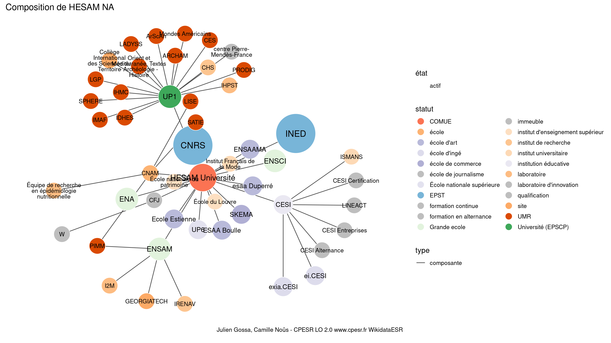 

Avertissements et édition : [logs](plots/etablissements/Q3128622.md) 

### HESAM NA : Associations.     Edition des données : https://github.com/cpesr/wikidataESR/blob/master/plots/etablissements/Q3128622.md 


Erreur : les données sont probablement trop partielles.
```
Error in wdesr_ggplot_graph(df, node_size = node_size, label_sizes = label_sizes, : Empty ESR graph: something went wrong with the graph production parameters

``` 

Avertissements et édition : [logs](plots/etablissements/Q3128622.md) 

### Normandie Université NA : Histoire.     Edition des données : https://github.com/cpesr/wikidataESR/blob/master/plots/etablissements/Q3343880.md 

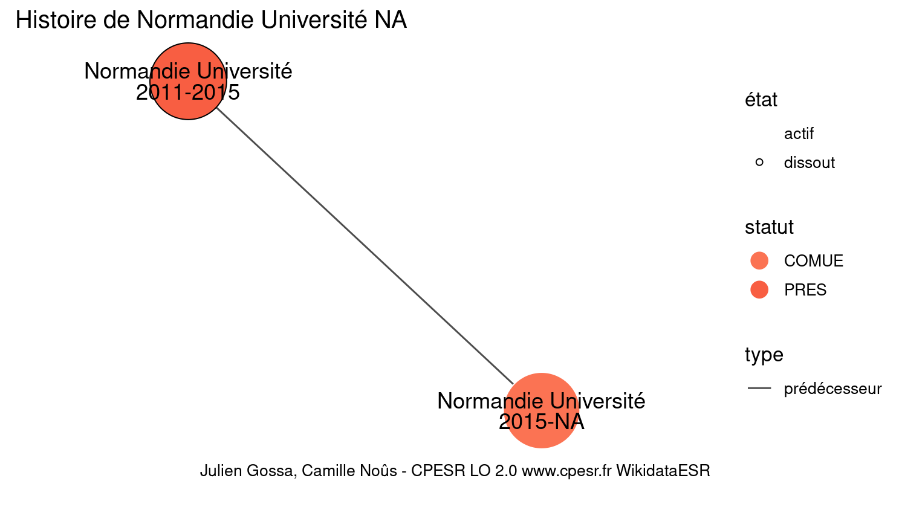 

Avertissements et édition : [logs](plots/etablissements/Q3343880.md) 

### Normandie Université NA : Composition.     Edition des données : https://github.com/cpesr/wikidataESR/blob/master/plots/etablissements/Q3343880.md 

 

Avertissements et édition : [logs](plots/etablissements/Q3343880.md) 

### Normandie Université NA : Associations.     Edition des données : https://github.com/cpesr/wikidataESR/blob/master/plots/etablissements/Q3343880.md 


Erreur : les données sont probablement trop partielles.
```
Error in wdesr_ggplot_graph(df, node_size = node_size, label_sizes = label_sizes, : Empty ESR graph: something went wrong with the graph production parameters

``` 

Avertissements et édition : [logs](plots/etablissements/Q3343880.md) 

### UPE NA : Histoire.     Edition des données : https://github.com/cpesr/wikidataESR/blob/master/plots/etablissements/Q3551472.md 

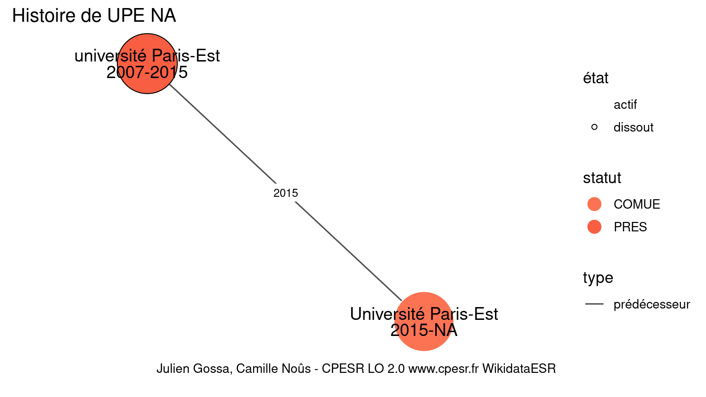 

Avertissements et édition : [logs](plots/etablissements/Q3551472.md) 

### UPE NA : Composition.     Edition des données : https://github.com/cpesr/wikidataESR/blob/master/plots/etablissements/Q3551472.md 

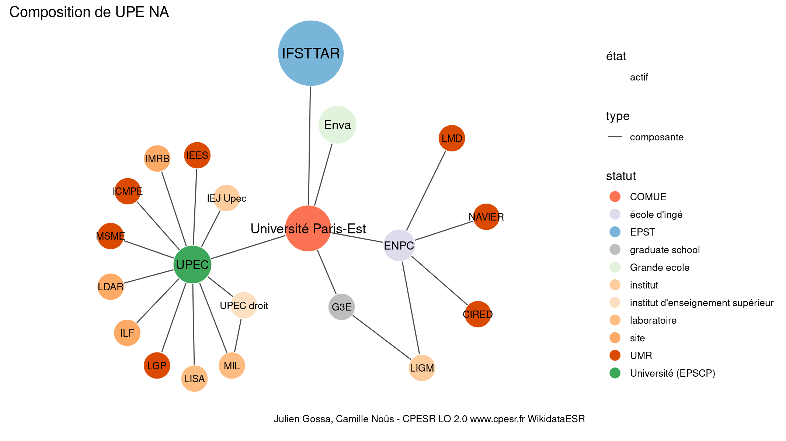 

Avertissements et édition : [logs](plots/etablissements/Q3551472.md) 

### UPE NA : Associations.     Edition des données : https://github.com/cpesr/wikidataESR/blob/master/plots/etablissements/Q3551472.md 


Erreur : les données sont probablement trop partielles.
```
Error in wdesr_ggplot_graph(df, node_size = node_size, label_sizes = label_sizes, : Empty ESR graph: something went wrong with the graph production parameters

``` 

Avertissements et édition : [logs](plots/etablissements/Q3551472.md) 

### Comue de Bourgogne Franche-Comté NA : Histoire.     Edition des données : https://github.com/cpesr/wikidataESR/blob/master/plots/etablissements/Q3359833.md 


Erreur : les données sont probablement trop partielles.
```
Error in wdesr_ggplot_graph(df, node_size = node_size, label_sizes = label_sizes, : Empty ESR graph: something went wrong with the graph production parameters

``` 

Avertissements et édition : [logs](plots/etablissements/Q3359833.md) 

### Comue de Bourgogne Franche-Comté NA : Composition.     Edition des données : https://github.com/cpesr/wikidataESR/blob/master/plots/etablissements/Q3359833.md 

 

Avertissements et édition : [logs](plots/etablissements/Q3359833.md) 

### Comue de Bourgogne Franche-Comté NA : Associations.     Edition des données : https://github.com/cpesr/wikidataESR/blob/master/plots/etablissements/Q3359833.md 


Erreur : les données sont probablement trop partielles.
```
Error in wdesr_ggplot_graph(df, node_size = node_size, label_sizes = label_sizes, : Empty ESR graph: something went wrong with the graph production parameters

``` 

Avertissements et édition : [logs](plots/etablissements/Q3359833.md) 

### UBL NA : Histoire.     Edition des données : https://github.com/cpesr/wikidataESR/blob/master/plots/etablissements/Q21994834.md 

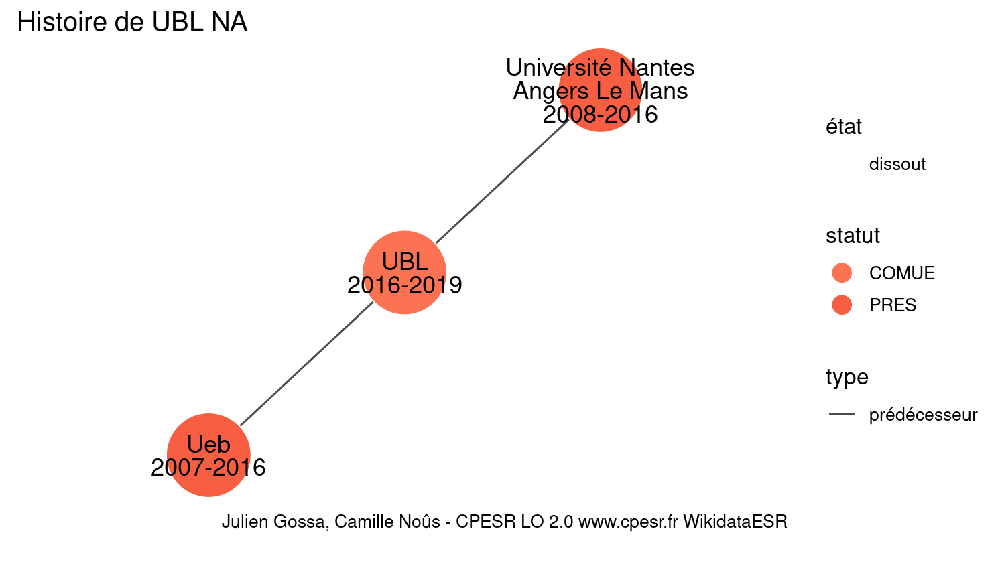 

Avertissements et édition : [logs](plots/etablissements/Q21994834.md) 

### UBL NA : Composition.     Edition des données : https://github.com/cpesr/wikidataESR/blob/master/plots/etablissements/Q21994834.md 

 

Avertissements et édition : [logs](plots/etablissements/Q21994834.md) 

### UBL NA : Associations.     Edition des données : https://github.com/cpesr/wikidataESR/blob/master/plots/etablissements/Q21994834.md 


Erreur : les données sont probablement trop partielles.
```
Error in wdesr_ggplot_graph(df, node_size = node_size, label_sizes = label_sizes, : Empty ESR graph: something went wrong with the graph production parameters

``` 

Avertissements et édition : [logs](plots/etablissements/Q21994834.md) 

### université confédérale Léonard-de-Vinci NA : Histoire.     Edition des données : https://github.com/cpesr/wikidataESR/blob/master/plots/etablissements/Q20735682.md 


Erreur : les données sont probablement trop partielles.
```
Error in wdesr_ggplot_graph(df, node_size = node_size, label_sizes = label_sizes, : Empty ESR graph: something went wrong with the graph production parameters

``` 

Avertissements et édition : [logs](plots/etablissements/Q20735682.md) 

### université confédérale Léonard-de-Vinci NA : Composition.     Edition des données : https://github.com/cpesr/wikidataESR/blob/master/plots/etablissements/Q20735682.md 

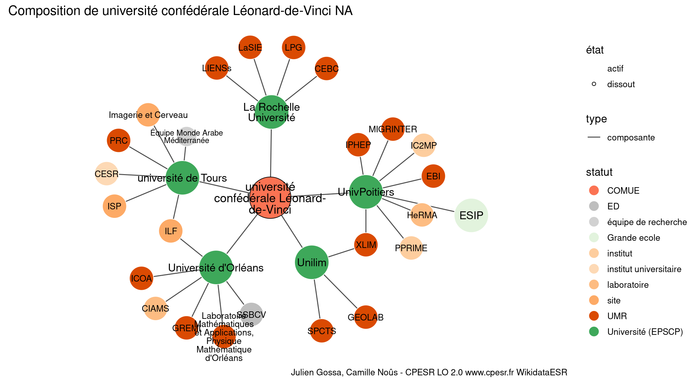 

Avertissements et édition : [logs](plots/etablissements/Q20735682.md) 

### université confédérale Léonard-de-Vinci NA : Associations.     Edition des données : https://github.com/cpesr/wikidataESR/blob/master/plots/etablissements/Q20735682.md 


Erreur : les données sont probablement trop partielles.
```
Error in wdesr_ggplot_graph(df, node_size = node_size, label_sizes = label_sizes, : Empty ESR graph: something went wrong with the graph production parameters

``` 

Avertissements et édition : [logs](plots/etablissements/Q20735682.md) 

### UDL NA : Histoire.     Edition des données : https://github.com/cpesr/wikidataESR/blob/master/plots/etablissements/Q10176.md 

 

Avertissements et édition : [logs](plots/etablissements/Q10176.md) 

### UDL NA : Composition.     Edition des données : https://github.com/cpesr/wikidataESR/blob/master/plots/etablissements/Q10176.md 

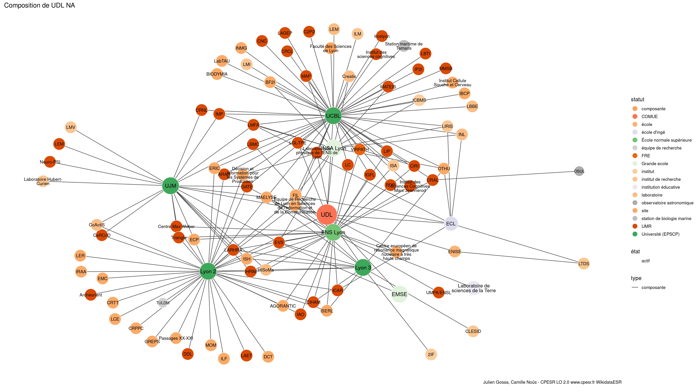 

Avertissements et édition : [logs](plots/etablissements/Q10176.md) 

### UDL NA : Associations.     Edition des données : https://github.com/cpesr/wikidataESR/blob/master/plots/etablissements/Q10176.md 


Erreur : les données sont probablement trop partielles.
```
Error in wdesr_ggplot_graph(df, node_size = node_size, label_sizes = label_sizes, : Empty ESR graph: something went wrong with the graph production parameters

``` 

Avertissements et édition : [logs](plots/etablissements/Q10176.md) 

### université de Toulouse NA : Histoire.     Edition des données : https://github.com/cpesr/wikidataESR/blob/master/plots/etablissements/Q578023.md 


Erreur : les données sont probablement trop partielles.
```
Error in wdesr_ggplot_graph(df, node_size = node_size, label_sizes = label_sizes, : Empty ESR graph: something went wrong with the graph production parameters

``` 

Avertissements et édition : [logs](plots/etablissements/Q578023.md) 

### université de Toulouse NA : Composition.     Edition des données : https://github.com/cpesr/wikidataESR/blob/master/plots/etablissements/Q578023.md 


Erreur : les données sont probablement trop partielles.
```
Error in wdesr_ggplot_graph(df, node_size = node_size, label_sizes = label_sizes, : Empty ESR graph: something went wrong with the graph production parameters

``` 

Avertissements et édition : [logs](plots/etablissements/Q578023.md) 

### université de Toulouse NA : Associations.     Edition des données : https://github.com/cpesr/wikidataESR/blob/master/plots/etablissements/Q578023.md 

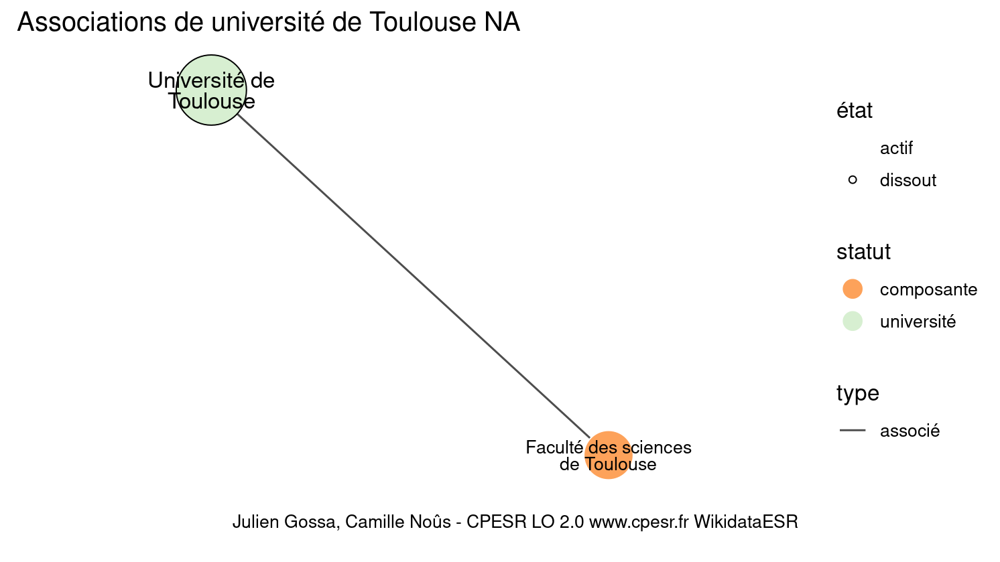 

Avertissements et édition : [logs](plots/etablissements/Q578023.md) 

### UPL NA : Histoire.     Edition des données : https://github.com/cpesr/wikidataESR/blob/master/plots/etablissements/Q3551474.md 

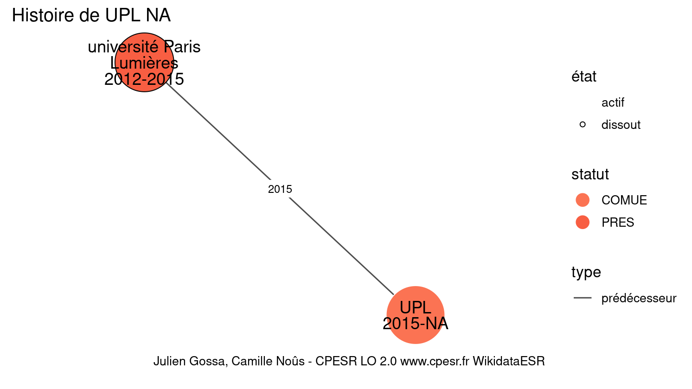 

Avertissements et édition : [logs](plots/etablissements/Q3551474.md) 

### UPL NA : Composition.     Edition des données : https://github.com/cpesr/wikidataESR/blob/master/plots/etablissements/Q3551474.md 

 

Avertissements et édition : [logs](plots/etablissements/Q3551474.md) 

### UPL NA : Associations.     Edition des données : https://github.com/cpesr/wikidataESR/blob/master/plots/etablissements/Q3551474.md 


Erreur : les données sont probablement trop partielles.
```
Error in wdesr_ggplot_graph(df, node_size = node_size, label_sizes = label_sizes, : Empty ESR graph: something went wrong with the graph production parameters

``` 

Avertissements et édition : [logs](plots/etablissements/Q3551474.md) 

## Histoire, composition et association actuelles des Ecoles d'ingénieurs 

Twitters manquants :
```
 - CentraleSupelec
 - ENS Chimie de Paris
 - INPG
``` 

### Arts et Métiers @ArtsetMetiers_ : Histoire.     Edition des données : https://github.com/cpesr/wikidataESR/blob/master/plots/etablissements/Q2570220.md 


Erreur : les données sont probablement trop partielles.
```
Error in wdesr_ggplot_graph(df, node_size = node_size, label_sizes = label_sizes, : Empty ESR graph: something went wrong with the graph production parameters

``` 

Avertissements et édition : [logs](plots/etablissements/Q2570220.md) 

### Arts et Métiers @ArtsetMetiers_ : Composition.     Edition des données : https://github.com/cpesr/wikidataESR/blob/master/plots/etablissements/Q2570220.md 

 

Avertissements et édition : [logs](plots/etablissements/Q2570220.md) 

### Arts et Métiers @ArtsetMetiers_ : Associations.     Edition des données : https://github.com/cpesr/wikidataESR/blob/master/plots/etablissements/Q2570220.md 

 

Avertissements et édition : [logs](plots/etablissements/Q2570220.md) 

### IPB @BordeauxINP : Histoire.     Edition des données : https://github.com/cpesr/wikidataESR/blob/master/plots/etablissements/Q3152470.md 


Erreur : les données sont probablement trop partielles.
```
Error in wdesr_ggplot_graph(df, node_size = node_size, label_sizes = label_sizes, : Empty ESR graph: something went wrong with the graph production parameters

``` 

Avertissements et édition : [logs](plots/etablissements/Q3152470.md) 

### IPB @BordeauxINP : Composition.     Edition des données : https://github.com/cpesr/wikidataESR/blob/master/plots/etablissements/Q3152470.md 

 

Avertissements et édition : [logs](plots/etablissements/Q3152470.md) 

### IPB @BordeauxINP : Associations.     Edition des données : https://github.com/cpesr/wikidataESR/blob/master/plots/etablissements/Q3152470.md 


Erreur : les données sont probablement trop partielles.
```
Error in wdesr_ggplot_graph(df, node_size = node_size, label_sizes = label_sizes, : Empty ESR graph: something went wrong with the graph production parameters

``` 

Avertissements et édition : [logs](plots/etablissements/Q3152470.md) 

### CLI @Centralelille : Histoire.     Edition des données : https://github.com/cpesr/wikidataESR/blob/master/plots/etablissements/Q273461.md 


Erreur : les données sont probablement trop partielles.
```
Error in wdesr_ggplot_graph(df, node_size = node_size, label_sizes = label_sizes, : Empty ESR graph: something went wrong with the graph production parameters

``` 

Avertissements et édition : [logs](plots/etablissements/Q273461.md) 

### CLI @Centralelille : Composition.     Edition des données : https://github.com/cpesr/wikidataESR/blob/master/plots/etablissements/Q273461.md 

 

Avertissements et édition : [logs](plots/etablissements/Q273461.md) 

### CLI @Centralelille : Associations.     Edition des données : https://github.com/cpesr/wikidataESR/blob/master/plots/etablissements/Q273461.md 

 

Avertissements et édition : [logs](plots/etablissements/Q273461.md) 

### EC Lyon @CentraleLyon : Histoire.     Edition des données : https://github.com/cpesr/wikidataESR/blob/master/plots/etablissements/Q10177.md 


Erreur : les données sont probablement trop partielles.
```
Error in wdesr_ggplot_graph(df, node_size = node_size, label_sizes = label_sizes, : Empty ESR graph: something went wrong with the graph production parameters

``` 

Avertissements et édition : [logs](plots/etablissements/Q10177.md) 

### EC Lyon @CentraleLyon : Composition.     Edition des données : https://github.com/cpesr/wikidataESR/blob/master/plots/etablissements/Q10177.md 

 

Avertissements et édition : [logs](plots/etablissements/Q10177.md) 

### EC Lyon @CentraleLyon : Associations.     Edition des données : https://github.com/cpesr/wikidataESR/blob/master/plots/etablissements/Q10177.md 

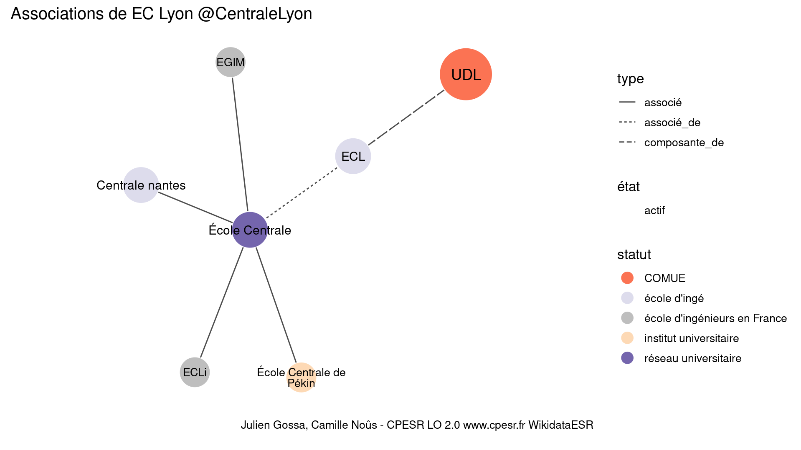 

Avertissements et édition : [logs](plots/etablissements/Q10177.md) 

### ECM @CentraleMars : Histoire.     Edition des données : https://github.com/cpesr/wikidataESR/blob/master/plots/etablissements/Q273454.md 

 

Avertissements et édition : [logs](plots/etablissements/Q273454.md) 

### ECM @CentraleMars : Composition.     Edition des données : https://github.com/cpesr/wikidataESR/blob/master/plots/etablissements/Q273454.md 

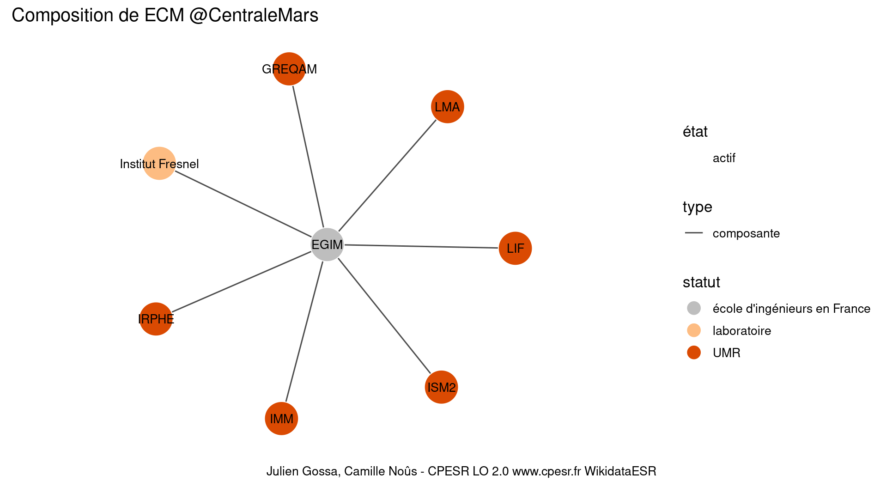 

Avertissements et édition : [logs](plots/etablissements/Q273454.md) 

### ECM @CentraleMars : Associations.     Edition des données : https://github.com/cpesr/wikidataESR/blob/master/plots/etablissements/Q273454.md 

 

Avertissements et édition : [logs](plots/etablissements/Q273454.md) 

### Centrale nantes @CentraleNantes : Histoire.     Edition des données : https://github.com/cpesr/wikidataESR/blob/master/plots/etablissements/Q273458.md 


Erreur : les données sont probablement trop partielles.
```
Error in wdesr_ggplot_graph(df, node_size = node_size, label_sizes = label_sizes, : Empty ESR graph: something went wrong with the graph production parameters

``` 

Avertissements et édition : [logs](plots/etablissements/Q273458.md) 

### Centrale nantes @CentraleNantes : Composition.     Edition des données : https://github.com/cpesr/wikidataESR/blob/master/plots/etablissements/Q273458.md 

 

Avertissements et édition : [logs](plots/etablissements/Q273458.md) 

### Centrale nantes @CentraleNantes : Associations.     Edition des données : https://github.com/cpesr/wikidataESR/blob/master/plots/etablissements/Q273458.md 

 

Avertissements et édition : [logs](plots/etablissements/Q273458.md) 

### CentraleSupelec NA : Histoire.     Edition des données : https://github.com/cpesr/wikidataESR/blob/master/plots/etablissements/Q19203245.md 


Erreur : les données sont probablement trop partielles.
```
Error in wdesr_ggplot_graph(df, node_size = node_size, label_sizes = label_sizes, : Empty ESR graph: something went wrong with the graph production parameters

``` 

Avertissements et édition : [logs](plots/etablissements/Q19203245.md) 

### CentraleSupelec NA : Composition.     Edition des données : https://github.com/cpesr/wikidataESR/blob/master/plots/etablissements/Q19203245.md 

 

Avertissements et édition : [logs](plots/etablissements/Q19203245.md) 

### CentraleSupelec NA : Associations.     Edition des données : https://github.com/cpesr/wikidataESR/blob/master/plots/etablissements/Q19203245.md 

 

Avertissements et édition : [logs](plots/etablissements/Q19203245.md) 

### ENS Chimie de Paris NA : Histoire.     Edition des données : https://github.com/cpesr/wikidataESR/blob/master/plots/etablissements/Q2963665.md 


Erreur : les données sont probablement trop partielles.
```
Error in wdesr_ggplot_graph(df, node_size = node_size, label_sizes = label_sizes, : Empty ESR graph: something went wrong with the graph production parameters

``` 

Avertissements et édition : [logs](plots/etablissements/Q2963665.md) 

### ENS Chimie de Paris NA : Composition.     Edition des données : https://github.com/cpesr/wikidataESR/blob/master/plots/etablissements/Q2963665.md 

 

Avertissements et édition : [logs](plots/etablissements/Q2963665.md) 

### ENS Chimie de Paris NA : Associations.     Edition des données : https://github.com/cpesr/wikidataESR/blob/master/plots/etablissements/Q2963665.md 

 

Avertissements et édition : [logs](plots/etablissements/Q2963665.md) 

### CNAM @LeCnam : Histoire.     Edition des données : https://github.com/cpesr/wikidataESR/blob/master/plots/etablissements/Q524289.md 


Erreur : les données sont probablement trop partielles.
```
Error in wdesr_ggplot_graph(df, node_size = node_size, label_sizes = label_sizes, : Empty ESR graph: something went wrong with the graph production parameters

``` 

Avertissements et édition : [logs](plots/etablissements/Q524289.md) 

### CNAM @LeCnam : Composition.     Edition des données : https://github.com/cpesr/wikidataESR/blob/master/plots/etablissements/Q524289.md 

 

Avertissements et édition : [logs](plots/etablissements/Q524289.md) 

### CNAM @LeCnam : Associations.     Edition des données : https://github.com/cpesr/wikidataESR/blob/master/plots/etablissements/Q524289.md 

 

Avertissements et édition : [logs](plots/etablissements/Q524289.md) 

### ENIB @ENIB_INFO : Histoire.     Edition des données : https://github.com/cpesr/wikidataESR/blob/master/plots/etablissements/Q273564.md 


Erreur : les données sont probablement trop partielles.
```
Error in wdesr_ggplot_graph(df, node_size = node_size, label_sizes = label_sizes, : Empty ESR graph: something went wrong with the graph production parameters

``` 

Avertissements et édition : [logs](plots/etablissements/Q273564.md) 

### ENIB @ENIB_INFO : Composition.     Edition des données : https://github.com/cpesr/wikidataESR/blob/master/plots/etablissements/Q273564.md 

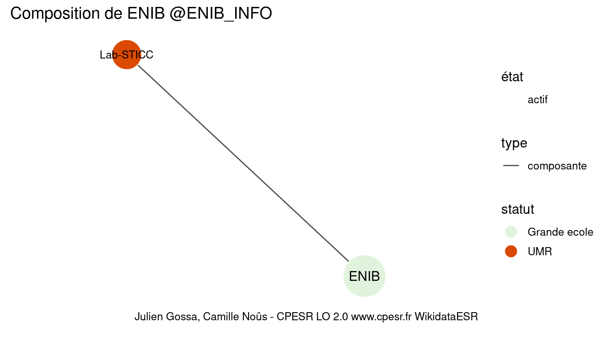 

Avertissements et édition : [logs](plots/etablissements/Q273564.md) 

### ENIB @ENIB_INFO : Associations.     Edition des données : https://github.com/cpesr/wikidataESR/blob/master/plots/etablissements/Q273564.md 


Erreur : les données sont probablement trop partielles.
```
Error in wdesr_ggplot_graph(df, node_size = node_size, label_sizes = label_sizes, : Empty ESR graph: something went wrong with the graph production parameters

``` 

Avertissements et édition : [logs](plots/etablissements/Q273564.md) 

### ENI Tarbes @ENITarbes : Histoire.     Edition des données : https://github.com/cpesr/wikidataESR/blob/master/plots/etablissements/Q3578096.md 


Erreur : les données sont probablement trop partielles.
```
Error in wdesr_ggplot_graph(df, node_size = node_size, label_sizes = label_sizes, : Empty ESR graph: something went wrong with the graph production parameters

``` 

Avertissements et édition : [logs](plots/etablissements/Q3578096.md) 

### ENI Tarbes @ENITarbes : Composition.     Edition des données : https://github.com/cpesr/wikidataESR/blob/master/plots/etablissements/Q3578096.md 

 

Avertissements et édition : [logs](plots/etablissements/Q3578096.md) 

### ENI Tarbes @ENITarbes : Associations.     Edition des données : https://github.com/cpesr/wikidataESR/blob/master/plots/etablissements/Q3578096.md 


Erreur : les données sont probablement trop partielles.
```
Error in wdesr_ggplot_graph(df, node_size = node_size, label_sizes = label_sizes, : Empty ESR graph: something went wrong with the graph production parameters

``` 

Avertissements et édition : [logs](plots/etablissements/Q3578096.md) 

### ENSIIE @ensiie : Histoire.     Edition des données : https://github.com/cpesr/wikidataESR/blob/master/plots/etablissements/Q3578204.md 


Erreur : les données sont probablement trop partielles.
```
Error in wdesr_ggplot_graph(df, node_size = node_size, label_sizes = label_sizes, : Empty ESR graph: something went wrong with the graph production parameters

``` 

Avertissements et édition : [logs](plots/etablissements/Q3578204.md) 

### ENSIIE @ensiie : Composition.     Edition des données : https://github.com/cpesr/wikidataESR/blob/master/plots/etablissements/Q3578204.md 

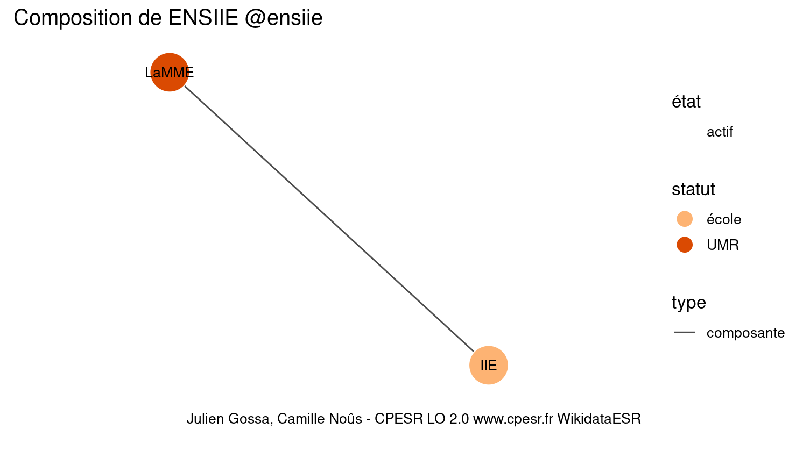 

Avertissements et édition : [logs](plots/etablissements/Q3578204.md) 

### ENSIIE @ensiie : Associations.     Edition des données : https://github.com/cpesr/wikidataESR/blob/master/plots/etablissements/Q3578204.md 


Erreur : les données sont probablement trop partielles.
```
Error in wdesr_ggplot_graph(df, node_size = node_size, label_sizes = label_sizes, : Empty ESR graph: something went wrong with the graph production parameters

``` 

Avertissements et édition : [logs](plots/etablissements/Q3578204.md) 

### ENSI Caen @ENSICAEN : Histoire.     Edition des données : https://github.com/cpesr/wikidataESR/blob/master/plots/etablissements/Q3578208.md 


Erreur : les données sont probablement trop partielles.
```
Error in wdesr_ggplot_graph(df, node_size = node_size, label_sizes = label_sizes, : Empty ESR graph: something went wrong with the graph production parameters

``` 

Avertissements et édition : [logs](plots/etablissements/Q3578208.md) 

### ENSI Caen @ENSICAEN : Composition.     Edition des données : https://github.com/cpesr/wikidataESR/blob/master/plots/etablissements/Q3578208.md 

 

Avertissements et édition : [logs](plots/etablissements/Q3578208.md) 

### ENSI Caen @ENSICAEN : Associations.     Edition des données : https://github.com/cpesr/wikidataESR/blob/master/plots/etablissements/Q3578208.md 

 

Avertissements et édition : [logs](plots/etablissements/Q3578208.md) 

### ENS Chimie Montpellier @enscmchimiemtp : Histoire.     Edition des données : https://github.com/cpesr/wikidataESR/blob/master/plots/etablissements/Q948420.md 


Erreur : les données sont probablement trop partielles.
```
Error in wdesr_ggplot_graph(df, node_size = node_size, label_sizes = label_sizes, : Empty ESR graph: something went wrong with the graph production parameters

``` 

Avertissements et édition : [logs](plots/etablissements/Q948420.md) 

### ENS Chimie Montpellier @enscmchimiemtp : Composition.     Edition des données : https://github.com/cpesr/wikidataESR/blob/master/plots/etablissements/Q948420.md 

 

Avertissements et édition : [logs](plots/etablissements/Q948420.md) 

### ENS Chimie Montpellier @enscmchimiemtp : Associations.     Edition des données : https://github.com/cpesr/wikidataESR/blob/master/plots/etablissements/Q948420.md 

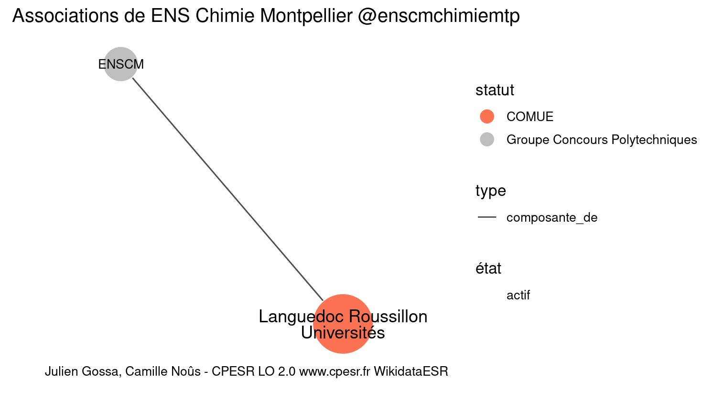 

Avertissements et édition : [logs](plots/etablissements/Q948420.md) 

### ENSCR @ENSCR : Histoire.     Edition des données : https://github.com/cpesr/wikidataESR/blob/master/plots/etablissements/Q3578223.md 


Erreur : les données sont probablement trop partielles.
```
Error in wdesr_ggplot_graph(df, node_size = node_size, label_sizes = label_sizes, : Empty ESR graph: something went wrong with the graph production parameters

``` 

Avertissements et édition : [logs](plots/etablissements/Q3578223.md) 

### ENSCR @ENSCR : Composition.     Edition des données : https://github.com/cpesr/wikidataESR/blob/master/plots/etablissements/Q3578223.md 

 

Avertissements et édition : [logs](plots/etablissements/Q3578223.md) 

### ENSCR @ENSCR : Associations.     Edition des données : https://github.com/cpesr/wikidataESR/blob/master/plots/etablissements/Q3578223.md 


Erreur : les données sont probablement trop partielles.
```
Error in wdesr_ggplot_graph(df, node_size = node_size, label_sizes = label_sizes, : Empty ESR graph: something went wrong with the graph production parameters

``` 

Avertissements et édition : [logs](plots/etablissements/Q3578223.md) 

### ENSEA @ensea1 : Histoire.     Edition des données : https://github.com/cpesr/wikidataESR/blob/master/plots/etablissements/Q2707341.md 


Erreur : les données sont probablement trop partielles.
```
Error in wdesr_ggplot_graph(df, node_size = node_size, label_sizes = label_sizes, : Empty ESR graph: something went wrong with the graph production parameters

``` 

Avertissements et édition : [logs](plots/etablissements/Q2707341.md) 

### ENSEA @ensea1 : Composition.     Edition des données : https://github.com/cpesr/wikidataESR/blob/master/plots/etablissements/Q2707341.md 

 

Avertissements et édition : [logs](plots/etablissements/Q2707341.md) 

### ENSEA @ensea1 : Associations.     Edition des données : https://github.com/cpesr/wikidataESR/blob/master/plots/etablissements/Q2707341.md 

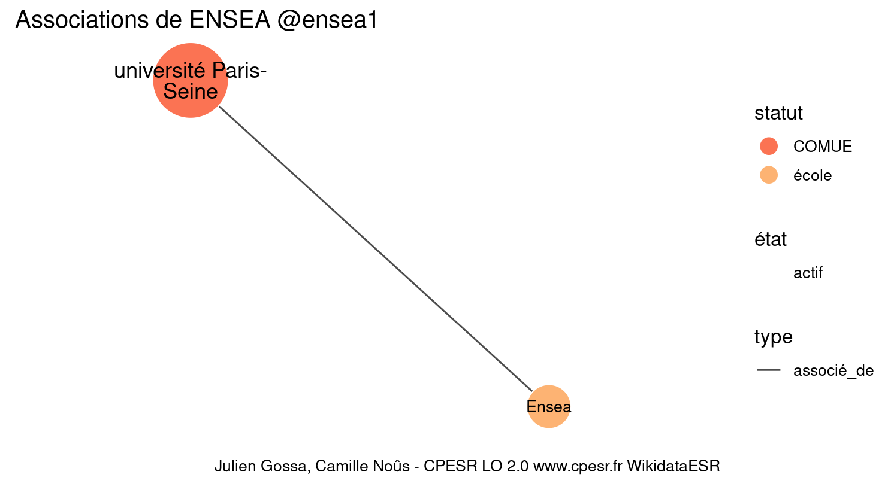 

Avertissements et édition : [logs](plots/etablissements/Q2707341.md) 

### ISAE-ENSMA @isae_ensma : Histoire.     Edition des données : https://github.com/cpesr/wikidataESR/blob/master/plots/etablissements/Q391044.md 


Erreur : les données sont probablement trop partielles.
```
Error in wdesr_ggplot_graph(df, node_size = node_size, label_sizes = label_sizes, : Empty ESR graph: something went wrong with the graph production parameters

``` 

Avertissements et édition : [logs](plots/etablissements/Q391044.md) 

### ISAE-ENSMA @isae_ensma : Composition.     Edition des données : https://github.com/cpesr/wikidataESR/blob/master/plots/etablissements/Q391044.md 

 

Avertissements et édition : [logs](plots/etablissements/Q391044.md) 

### ISAE-ENSMA @isae_ensma : Associations.     Edition des données : https://github.com/cpesr/wikidataESR/blob/master/plots/etablissements/Q391044.md 

 

Avertissements et édition : [logs](plots/etablissements/Q391044.md) 

### ENS2M @ENSMMOfficiel : Histoire.     Edition des données : https://github.com/cpesr/wikidataESR/blob/master/plots/etablissements/Q3578235.md 


Erreur : les données sont probablement trop partielles.
```
Error in wdesr_ggplot_graph(df, node_size = node_size, label_sizes = label_sizes, : Empty ESR graph: something went wrong with the graph production parameters

``` 

Avertissements et édition : [logs](plots/etablissements/Q3578235.md) 

### ENS2M @ENSMMOfficiel : Composition.     Edition des données : https://github.com/cpesr/wikidataESR/blob/master/plots/etablissements/Q3578235.md 

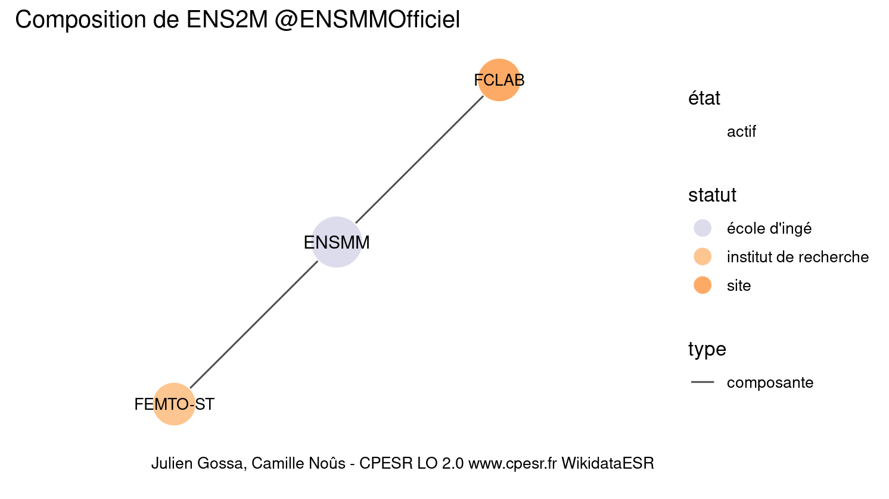 

Avertissements et édition : [logs](plots/etablissements/Q3578235.md) 

### ENS2M @ENSMMOfficiel : Associations.     Edition des données : https://github.com/cpesr/wikidataESR/blob/master/plots/etablissements/Q3578235.md 


Erreur : les données sont probablement trop partielles.
```
Error in wdesr_ggplot_graph(df, node_size = node_size, label_sizes = label_sizes, : Empty ESR graph: something went wrong with the graph production parameters

``` 

Avertissements et édition : [logs](plots/etablissements/Q3578235.md) 

### INSA CVL @insacvl : Histoire.     Edition des données : https://github.com/cpesr/wikidataESR/blob/master/plots/etablissements/Q15651478.md 


Erreur : les données sont probablement trop partielles.
```
Error in wdesr_ggplot_graph(df, node_size = node_size, label_sizes = label_sizes, : Empty ESR graph: something went wrong with the graph production parameters

``` 

Avertissements et édition : [logs](plots/etablissements/Q15651478.md) 

### INSA CVL @insacvl : Composition.     Edition des données : https://github.com/cpesr/wikidataESR/blob/master/plots/etablissements/Q15651478.md 


Erreur : les données sont probablement trop partielles.
```
Error in wdesr_ggplot_graph(df, node_size = node_size, label_sizes = label_sizes, : Empty ESR graph: something went wrong with the graph production parameters

``` 

Avertissements et édition : [logs](plots/etablissements/Q15651478.md) 

### INSA CVL @insacvl : Associations.     Edition des données : https://github.com/cpesr/wikidataESR/blob/master/plots/etablissements/Q15651478.md 


Erreur : les données sont probablement trop partielles.
```
Error in wdesr_ggplot_graph(df, node_size = node_size, label_sizes = label_sizes, : Empty ESR graph: something went wrong with the graph production parameters

``` 

Avertissements et édition : [logs](plots/etablissements/Q15651478.md) 

### INSA Lyon @insadelyon : Histoire.     Edition des données : https://github.com/cpesr/wikidataESR/blob/master/plots/etablissements/Q1633859.md 


Erreur : les données sont probablement trop partielles.
```
Error in wdesr_ggplot_graph(df, node_size = node_size, label_sizes = label_sizes, : Empty ESR graph: something went wrong with the graph production parameters

``` 

Avertissements et édition : [logs](plots/etablissements/Q1633859.md) 

### INSA Lyon @insadelyon : Composition.     Edition des données : https://github.com/cpesr/wikidataESR/blob/master/plots/etablissements/Q1633859.md 

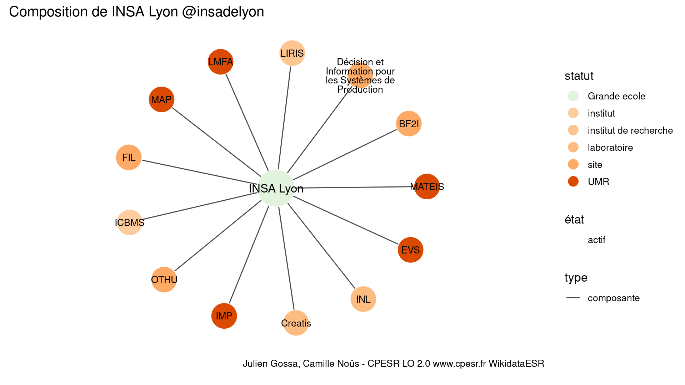 

Avertissements et édition : [logs](plots/etablissements/Q1633859.md) 

### INSA Lyon @insadelyon : Associations.     Edition des données : https://github.com/cpesr/wikidataESR/blob/master/plots/etablissements/Q1633859.md 

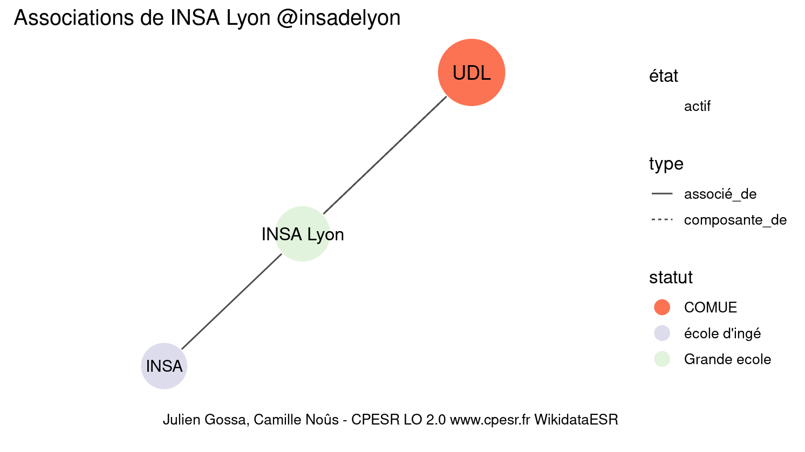 

Avertissements et édition : [logs](plots/etablissements/Q1633859.md) 

### INSA Rennes @INSA_Rennes : Histoire.     Edition des données : https://github.com/cpesr/wikidataESR/blob/master/plots/etablissements/Q1934614.md 


Erreur : les données sont probablement trop partielles.
```
Error in wdesr_ggplot_graph(df, node_size = node_size, label_sizes = label_sizes, : Empty ESR graph: something went wrong with the graph production parameters

``` 

Avertissements et édition : [logs](plots/etablissements/Q1934614.md) 

### INSA Rennes @INSA_Rennes : Composition.     Edition des données : https://github.com/cpesr/wikidataESR/blob/master/plots/etablissements/Q1934614.md 

 

Avertissements et édition : [logs](plots/etablissements/Q1934614.md) 

### INSA Rennes @INSA_Rennes : Associations.     Edition des données : https://github.com/cpesr/wikidataESR/blob/master/plots/etablissements/Q1934614.md 


Erreur : les données sont probablement trop partielles.
```
Error in wdesr_ggplot_graph(df, node_size = node_size, label_sizes = label_sizes, : Empty ESR graph: something went wrong with the graph production parameters

``` 

Avertissements et édition : [logs](plots/etablissements/Q1934614.md) 

### INSA Rouen Normandie @insarouen : Histoire.     Edition des données : https://github.com/cpesr/wikidataESR/blob/master/plots/etablissements/Q1665112.md 


Erreur : les données sont probablement trop partielles.
```
Error in wdesr_ggplot_graph(df, node_size = node_size, label_sizes = label_sizes, : Empty ESR graph: something went wrong with the graph production parameters

``` 

Avertissements et édition : [logs](plots/etablissements/Q1665112.md) 

### INSA Rouen Normandie @insarouen : Composition.     Edition des données : https://github.com/cpesr/wikidataESR/blob/master/plots/etablissements/Q1665112.md 

 

Avertissements et édition : [logs](plots/etablissements/Q1665112.md) 

### INSA Rouen Normandie @insarouen : Associations.     Edition des données : https://github.com/cpesr/wikidataESR/blob/master/plots/etablissements/Q1665112.md 

 

Avertissements et édition : [logs](plots/etablissements/Q1665112.md) 

### INSA Strasbourg @Insa_Strasbourg : Histoire.     Edition des données : https://github.com/cpesr/wikidataESR/blob/master/plots/etablissements/Q521036.md 


Erreur : les données sont probablement trop partielles.
```
Error in wdesr_ggplot_graph(df, node_size = node_size, label_sizes = label_sizes, : Empty ESR graph: something went wrong with the graph production parameters

``` 

Avertissements et édition : [logs](plots/etablissements/Q521036.md) 

### INSA Strasbourg @Insa_Strasbourg : Composition.     Edition des données : https://github.com/cpesr/wikidataESR/blob/master/plots/etablissements/Q521036.md 

 

Avertissements et édition : [logs](plots/etablissements/Q521036.md) 

### INSA Strasbourg @Insa_Strasbourg : Associations.     Edition des données : https://github.com/cpesr/wikidataESR/blob/master/plots/etablissements/Q521036.md 

 

Avertissements et édition : [logs](plots/etablissements/Q521036.md) 

### INSA Toulouse @INSAToulouse : Histoire.     Edition des données : https://github.com/cpesr/wikidataESR/blob/master/plots/etablissements/Q858979.md 


Erreur : les données sont probablement trop partielles.
```
Error in wdesr_ggplot_graph(df, node_size = node_size, label_sizes = label_sizes, : Empty ESR graph: something went wrong with the graph production parameters

``` 

Avertissements et édition : [logs](plots/etablissements/Q858979.md) 

### INSA Toulouse @INSAToulouse : Composition.     Edition des données : https://github.com/cpesr/wikidataESR/blob/master/plots/etablissements/Q858979.md 

 

Avertissements et édition : [logs](plots/etablissements/Q858979.md) 

### INSA Toulouse @INSAToulouse : Associations.     Edition des données : https://github.com/cpesr/wikidataESR/blob/master/plots/etablissements/Q858979.md 

 

Avertissements et édition : [logs](plots/etablissements/Q858979.md) 

### INPG NA : Histoire.     Edition des données : https://github.com/cpesr/wikidataESR/blob/master/plots/etablissements/Q1665121.md 


Erreur : les données sont probablement trop partielles.
```
Error in wdesr_ggplot_graph(df, node_size = node_size, label_sizes = label_sizes, : Empty ESR graph: something went wrong with the graph production parameters

``` 

Avertissements et édition : [logs](plots/etablissements/Q1665121.md) 

### INPG NA : Composition.     Edition des données : https://github.com/cpesr/wikidataESR/blob/master/plots/etablissements/Q1665121.md 

 

Avertissements et édition : [logs](plots/etablissements/Q1665121.md) 

### INPG NA : Associations.     Edition des données : https://github.com/cpesr/wikidataESR/blob/master/plots/etablissements/Q1665121.md 


Erreur : les données sont probablement trop partielles.
```
Error in wdesr_ggplot_graph(df, node_size = node_size, label_sizes = label_sizes, : Empty ESR graph: something went wrong with the graph production parameters

``` 

Avertissements et édition : [logs](plots/etablissements/Q1665121.md) 

### supméca @supmeca : Histoire.     Edition des données : https://github.com/cpesr/wikidataESR/blob/master/plots/etablissements/Q1267711.md 


Erreur : les données sont probablement trop partielles.
```
Error in wdesr_ggplot_graph(df, node_size = node_size, label_sizes = label_sizes, : Empty ESR graph: something went wrong with the graph production parameters

``` 

Avertissements et édition : [logs](plots/etablissements/Q1267711.md) 

### supméca @supmeca : Composition.     Edition des données : https://github.com/cpesr/wikidataESR/blob/master/plots/etablissements/Q1267711.md 


Erreur : les données sont probablement trop partielles.
```
Error in wdesr_ggplot_graph(df, node_size = node_size, label_sizes = label_sizes, : Empty ESR graph: something went wrong with the graph production parameters

``` 

Avertissements et édition : [logs](plots/etablissements/Q1267711.md) 

### supméca @supmeca : Associations.     Edition des données : https://github.com/cpesr/wikidataESR/blob/master/plots/etablissements/Q1267711.md 


Erreur : les données sont probablement trop partielles.
```
Error in wdesr_ggplot_graph(df, node_size = node_size, label_sizes = label_sizes, : Empty ESR graph: something went wrong with the graph production parameters

``` 

Avertissements et édition : [logs](plots/etablissements/Q1267711.md) 

### INPT @INP_Toulouse : Histoire.     Edition des données : https://github.com/cpesr/wikidataESR/blob/master/plots/etablissements/Q3152453.md 


Erreur : les données sont probablement trop partielles.
```
Error in wdesr_ggplot_graph(df, node_size = node_size, label_sizes = label_sizes, : Empty ESR graph: something went wrong with the graph production parameters

``` 

Avertissements et édition : [logs](plots/etablissements/Q3152453.md) 

### INPT @INP_Toulouse : Composition.     Edition des données : https://github.com/cpesr/wikidataESR/blob/master/plots/etablissements/Q3152453.md 

 

Avertissements et édition : [logs](plots/etablissements/Q3152453.md) 

### INPT @INP_Toulouse : Associations.     Edition des données : https://github.com/cpesr/wikidataESR/blob/master/plots/etablissements/Q3152453.md 


Erreur : les données sont probablement trop partielles.
```
Error in query(url, "pcontent", clean_response, query_param = query_param, : The API returned an error: missingtitle - The page you specified doesn't exist.

``` 

Avertissements et édition : [logs](plots/etablissements/Q3152453.md) 

### UTBM @utbm_fr : Histoire.     Edition des données : https://github.com/cpesr/wikidataESR/blob/master/plots/etablissements/Q2399264.md 


Erreur : les données sont probablement trop partielles.
```
Error in wdesr_ggplot_graph(df, node_size = node_size, label_sizes = label_sizes, : Empty ESR graph: something went wrong with the graph production parameters

``` 

Avertissements et édition : [logs](plots/etablissements/Q2399264.md) 

### UTBM @utbm_fr : Composition.     Edition des données : https://github.com/cpesr/wikidataESR/blob/master/plots/etablissements/Q2399264.md 

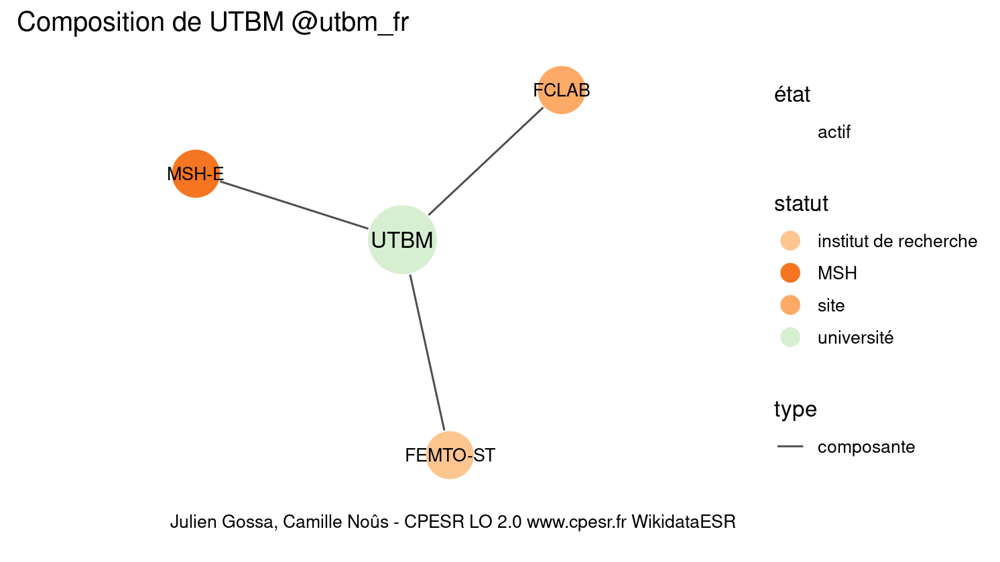 

Avertissements et édition : [logs](plots/etablissements/Q2399264.md) 

### UTBM @utbm_fr : Associations.     Edition des données : https://github.com/cpesr/wikidataESR/blob/master/plots/etablissements/Q2399264.md 


Erreur : les données sont probablement trop partielles.
```
Error in wdesr_ggplot_graph(df, node_size = node_size, label_sizes = label_sizes, : Empty ESR graph: something went wrong with the graph production parameters

``` 

Avertissements et édition : [logs](plots/etablissements/Q2399264.md) 

### UTC @utc_compiegne : Histoire.     Edition des données : https://github.com/cpesr/wikidataESR/blob/master/plots/etablissements/Q622906.md 


Erreur : les données sont probablement trop partielles.
```
Error in wdesr_ggplot_graph(df, node_size = node_size, label_sizes = label_sizes, : Empty ESR graph: something went wrong with the graph production parameters

``` 

Avertissements et édition : [logs](plots/etablissements/Q622906.md) 

### UTC @utc_compiegne : Composition.     Edition des données : https://github.com/cpesr/wikidataESR/blob/master/plots/etablissements/Q622906.md 

 

Avertissements et édition : [logs](plots/etablissements/Q622906.md) 

### UTC @utc_compiegne : Associations.     Edition des données : https://github.com/cpesr/wikidataESR/blob/master/plots/etablissements/Q622906.md 

 

Avertissements et édition : [logs](plots/etablissements/Q622906.md) 

### UTT @UTTroyes : Histoire.     Edition des données : https://github.com/cpesr/wikidataESR/blob/master/plots/etablissements/Q1037208.md 


Erreur : les données sont probablement trop partielles.
```
Error in wdesr_ggplot_graph(df, node_size = node_size, label_sizes = label_sizes, : Empty ESR graph: something went wrong with the graph production parameters

``` 

Avertissements et édition : [logs](plots/etablissements/Q1037208.md) 

### UTT @UTTroyes : Composition.     Edition des données : https://github.com/cpesr/wikidataESR/blob/master/plots/etablissements/Q1037208.md 

 

Avertissements et édition : [logs](plots/etablissements/Q1037208.md) 

### UTT @UTTroyes : Associations.     Edition des données : https://github.com/cpesr/wikidataESR/blob/master/plots/etablissements/Q1037208.md 

 

Avertissements et édition : [logs](plots/etablissements/Q1037208.md) 

