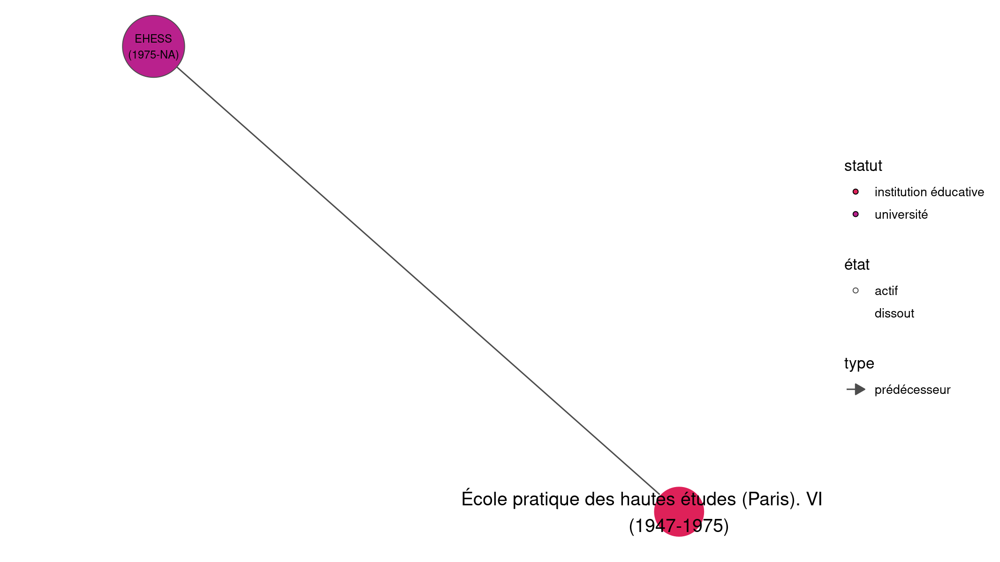
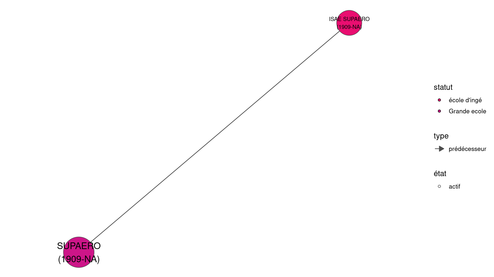

# Batches de représentation wikidataESR 

https://github.com/cpesr/WikidataESR 

```
  - twtexte:[#DataESR #HelpESR] Visualisation des organisations de l'#ESR.
  - twalt:@juliengossa LO 2.0 www.cpesr.fr
  - twurl:https://twitter.com/CPESR_/status/1457453241378148361
``` 

## Histoire, composition et association des Université actuels 

### Histoire Paris 1 @SorbonneParis1 https://www.wikidata.org/wiki/Q999763 

 

[Avertissements et édition](plots/etablissements/Paris_1_@SorbonneParis1-Q999763-histoire.log) 

### Composition Paris 1 @SorbonneParis1 https://www.wikidata.org/wiki/Q999763 

 

[Avertissements et édition](plots/etablissements/Paris_1_@SorbonneParis1-Q999763-composition.log) 

### Associations Paris 1 @SorbonneParis1 https://www.wikidata.org/wiki/Q999763 

 

[Avertissements et édition](plots/etablissements/Paris_1_@SorbonneParis1-Q999763-associations.log) 

### Histoire Sorbonne U @Sorbonne_Univ_ https://www.wikidata.org/wiki/Q41497113 

 

[Avertissements et édition](plots/etablissements/Sorbonne_U_@Sorbonne_Univ_-Q41497113-histoire.log) 

### Composition Sorbonne U @Sorbonne_Univ_ https://www.wikidata.org/wiki/Q41497113 

 

[Avertissements et édition](plots/etablissements/Sorbonne_U_@Sorbonne_Univ_-Q41497113-composition.log) 

### Associations Sorbonne U @Sorbonne_Univ_ https://www.wikidata.org/wiki/Q41497113 

 

[Avertissements et édition](plots/etablissements/Sorbonne_U_@Sorbonne_Univ_-Q41497113-associations.log) 

### Histoire UBx @univbordeaux https://www.wikidata.org/wiki/Q13344 

 

[Avertissements et édition](plots/etablissements/UBx_@univbordeaux-Q13344-histoire.log) 

### Composition UBx @univbordeaux https://www.wikidata.org/wiki/Q13344 

 

[Avertissements et édition](plots/etablissements/UBx_@univbordeaux-Q13344-composition.log) 

### Associations UBx @univbordeaux https://www.wikidata.org/wiki/Q13344 

 

[Avertissements et édition](plots/etablissements/UBx_@univbordeaux-Q13344-associations.log) 

### Histoire Université Gustave Eiffel @UGustaveEiffel https://www.wikidata.org/wiki/Q65153823 

 

[Avertissements et édition](plots/etablissements/Université_Gustave_Eiffel_@UGustaveEiffel-Q65153823-histoire.log) 

### Composition Université Gustave Eiffel @UGustaveEiffel https://www.wikidata.org/wiki/Q65153823 

 

[Avertissements et édition](plots/etablissements/Université_Gustave_Eiffel_@UGustaveEiffel-Q65153823-composition.log) 

### Associations Université Gustave Eiffel @UGustaveEiffel https://www.wikidata.org/wiki/Q65153823 

 

[Avertissements et édition](plots/etablissements/Université_Gustave_Eiffel_@UGustaveEiffel-Q65153823-associations.log) 

### Histoire Université de Poitiers @UnivPoitiers https://www.wikidata.org/wiki/Q661056 

 

[Avertissements et édition](plots/etablissements/Université_de_Poitiers_@UnivPoitiers-Q661056-histoire.log) 

### Composition Université de Poitiers @UnivPoitiers https://www.wikidata.org/wiki/Q661056 

 

[Avertissements et édition](plots/etablissements/Université_de_Poitiers_@UnivPoitiers-Q661056-composition.log) 

### Associations Université de Poitiers @UnivPoitiers https://www.wikidata.org/wiki/Q661056 

 

[Avertissements et édition](plots/etablissements/Université_de_Poitiers_@UnivPoitiers-Q661056-associations.log) 

### Histoire Université d'Artois @Univ_Artois https://www.wikidata.org/wiki/Q475504 

 

[Avertissements et édition](plots/etablissements/Université_d'Artois_@Univ_Artois-Q475504-histoire.log) 

### Composition Université d'Artois @Univ_Artois https://www.wikidata.org/wiki/Q475504 

 

[Avertissements et édition](plots/etablissements/Université_d'Artois_@Univ_Artois-Q475504-composition.log) 

### Associations Université d'Artois @Univ_Artois https://www.wikidata.org/wiki/Q475504 

 

[Avertissements et édition](plots/etablissements/Université_d'Artois_@Univ_Artois-Q475504-associations.log) 

### Histoire Université Paris 8 - Vincennes - Saint-Denis @UnivParis8 https://www.wikidata.org/wiki/Q1194988 

 

[Avertissements et édition](plots/etablissements/Université_Paris_8_-_Vincennes_-_Saint-Denis_@UnivParis8-Q1194988-histoire.log) 

### Composition Université Paris 8 - Vincennes - Saint-Denis @UnivParis8 https://www.wikidata.org/wiki/Q1194988 

 

[Avertissements et édition](plots/etablissements/Université_Paris_8_-_Vincennes_-_Saint-Denis_@UnivParis8-Q1194988-composition.log) 

### Associations Université Paris 8 - Vincennes - Saint-Denis @UnivParis8 https://www.wikidata.org/wiki/Q1194988 

 

[Avertissements et édition](plots/etablissements/Université_Paris_8_-_Vincennes_-_Saint-Denis_@UnivParis8-Q1194988-associations.log) 

### Histoire La Rochelle Université @UnivLaRochelle https://www.wikidata.org/wiki/Q1500822 

 

[Avertissements et édition](plots/etablissements/La_Rochelle_Université_@UnivLaRochelle-Q1500822-histoire.log) 

### Composition La Rochelle Université @UnivLaRochelle https://www.wikidata.org/wiki/Q1500822 

 

[Avertissements et édition](plots/etablissements/La_Rochelle_Université_@UnivLaRochelle-Q1500822-composition.log) 

### Associations La Rochelle Université @UnivLaRochelle https://www.wikidata.org/wiki/Q1500822 

 

[Avertissements et édition](plots/etablissements/La_Rochelle_Université_@UnivLaRochelle-Q1500822-associations.log) 

### Histoire Université Côte d'Azur @Univ_CotedAzur https://www.wikidata.org/wiki/Q80186910 

 

[Avertissements et édition](plots/etablissements/Université_Côte_d'Azur_@Univ_CotedAzur-Q80186910-histoire.log) 

### Composition Université Côte d'Azur @Univ_CotedAzur https://www.wikidata.org/wiki/Q80186910 

 

[Avertissements et édition](plots/etablissements/Université_Côte_d'Azur_@Univ_CotedAzur-Q80186910-composition.log) 

### Associations Université Côte d'Azur @Univ_CotedAzur https://www.wikidata.org/wiki/Q80186910 

 

[Avertissements et édition](plots/etablissements/Université_Côte_d'Azur_@Univ_CotedAzur-Q80186910-associations.log) 

### Histoire Université Le Havre Normandie  https://www.wikidata.org/wiki/Q1784954 

 

[Avertissements et édition](plots/etablissements/Université_Le_Havre_Normandie_-Q1784954-histoire.log) 

### Composition Université Le Havre Normandie  https://www.wikidata.org/wiki/Q1784954 

 

[Avertissements et édition](plots/etablissements/Université_Le_Havre_Normandie_-Q1784954-composition.log) 

### Associations Université Le Havre Normandie  https://www.wikidata.org/wiki/Q1784954 

 

[Avertissements et édition](plots/etablissements/Université_Le_Havre_Normandie_-Q1784954-associations.log) 

### Histoire Université Jean Monnet @Univ_St_Etienne https://www.wikidata.org/wiki/Q623154 

 

[Avertissements et édition](plots/etablissements/Université_Jean_Monnet_@Univ_St_Etienne-Q623154-histoire.log) 

### Composition Université Jean Monnet @Univ_St_Etienne https://www.wikidata.org/wiki/Q623154 

 

[Avertissements et édition](plots/etablissements/Université_Jean_Monnet_@Univ_St_Etienne-Q623154-composition.log) 

### Associations Université Jean Monnet @Univ_St_Etienne https://www.wikidata.org/wiki/Q623154 

 

[Avertissements et édition](plots/etablissements/Université_Jean_Monnet_@Univ_St_Etienne-Q623154-associations.log) 

### Histoire Université Rennes 2 @Univ_Rennes2 https://www.wikidata.org/wiki/Q459026 

 

[Avertissements et édition](plots/etablissements/Université_Rennes_2_@Univ_Rennes2-Q459026-histoire.log) 

### Composition Université Rennes 2 @Univ_Rennes2 https://www.wikidata.org/wiki/Q459026 

 

[Avertissements et édition](plots/etablissements/Université_Rennes_2_@Univ_Rennes2-Q459026-composition.log) 

### Associations Université Rennes 2 @Univ_Rennes2 https://www.wikidata.org/wiki/Q459026 

 

[Avertissements et édition](plots/etablissements/Université_Rennes_2_@Univ_Rennes2-Q459026-associations.log) 

### Histoire Université de Rennes 1 @UnivRennes1 https://www.wikidata.org/wiki/Q726595 

 

[Avertissements et édition](plots/etablissements/Université_de_Rennes_1_@UnivRennes1-Q726595-histoire.log) 

### Composition Université de Rennes 1 @UnivRennes1 https://www.wikidata.org/wiki/Q726595 

 

[Avertissements et édition](plots/etablissements/Université_de_Rennes_1_@UnivRennes1-Q726595-composition.log) 

### Associations Université de Rennes 1 @UnivRennes1 https://www.wikidata.org/wiki/Q726595 

 

[Avertissements et édition](plots/etablissements/Université_de_Rennes_1_@UnivRennes1-Q726595-associations.log) 

### Histoire UBM @UBMontaigne https://www.wikidata.org/wiki/Q13342 

 

[Avertissements et édition](plots/etablissements/UBM_@UBMontaigne-Q13342-histoire.log) 

### Composition UBM @UBMontaigne https://www.wikidata.org/wiki/Q13342 

 

[Avertissements et édition](plots/etablissements/UBM_@UBMontaigne-Q13342-composition.log) 

### Associations UBM @UBMontaigne https://www.wikidata.org/wiki/Q13342 

 

[Avertissements et édition](plots/etablissements/UBM_@UBMontaigne-Q13342-associations.log) 

### Histoire Université Paul-Valéry - Montpellier 3 @univpaulvalery https://www.wikidata.org/wiki/Q2912244 

 

[Avertissements et édition](plots/etablissements/Université_Paul-Valéry_-_Montpellier_3_@univpaulvalery-Q2912244-histoire.log) 

### Composition Université Paul-Valéry - Montpellier 3 @univpaulvalery https://www.wikidata.org/wiki/Q2912244 

 

[Avertissements et édition](plots/etablissements/Université_Paul-Valéry_-_Montpellier_3_@univpaulvalery-Q2912244-composition.log) 

### Associations Université Paul-Valéry - Montpellier 3 @univpaulvalery https://www.wikidata.org/wiki/Q2912244 

 

[Avertissements et édition](plots/etablissements/Université_Paul-Valéry_-_Montpellier_3_@univpaulvalery-Q2912244-associations.log) 

### Histoire Université de Paris @Univ_Paris https://www.wikidata.org/wiki/Q55849612 

 

[Avertissements et édition](plots/etablissements/Université_de_Paris_@Univ_Paris-Q55849612-histoire.log) 

### Composition Université de Paris @Univ_Paris https://www.wikidata.org/wiki/Q55849612 

 

[Avertissements et édition](plots/etablissements/Université_de_Paris_@Univ_Paris-Q55849612-composition.log) 

### Associations Université de Paris @Univ_Paris https://www.wikidata.org/wiki/Q55849612 

 

[Avertissements et édition](plots/etablissements/Université_de_Paris_@Univ_Paris-Q55849612-associations.log) 

### Histoire Université de Pau et des Pays de l'Adour @universite_uppa https://www.wikidata.org/wiki/Q572968 

 

[Avertissements et édition](plots/etablissements/Université_de_Pau_et_des_Pays_de_l'Adour_@universite_uppa-Q572968-histoire.log) 

### Composition Université de Pau et des Pays de l'Adour @universite_uppa https://www.wikidata.org/wiki/Q572968 

 

[Avertissements et édition](plots/etablissements/Université_de_Pau_et_des_Pays_de_l'Adour_@universite_uppa-Q572968-composition.log) 

### Associations Université de Pau et des Pays de l'Adour @universite_uppa https://www.wikidata.org/wiki/Q572968 

 

[Avertissements et édition](plots/etablissements/Université_de_Pau_et_des_Pays_de_l'Adour_@universite_uppa-Q572968-associations.log) 

### Histoire AMU @univamu https://www.wikidata.org/wiki/Q2302586 

 

[Avertissements et édition](plots/etablissements/AMU_@univamu-Q2302586-histoire.log) 

### Composition AMU @univamu https://www.wikidata.org/wiki/Q2302586 

 

[Avertissements et édition](plots/etablissements/AMU_@univamu-Q2302586-composition.log) 

### Associations AMU @univamu https://www.wikidata.org/wiki/Q2302586 

 

[Avertissements et édition](plots/etablissements/AMU_@univamu-Q2302586-associations.log) 

### Histoire Université de Haute-Alsace @UHA68 https://www.wikidata.org/wiki/Q280183 

 

[Avertissements et édition](plots/etablissements/Université_de_Haute-Alsace_@UHA68-Q280183-histoire.log) 

### Composition Université de Haute-Alsace @UHA68 https://www.wikidata.org/wiki/Q280183 

 

[Avertissements et édition](plots/etablissements/Université_de_Haute-Alsace_@UHA68-Q280183-composition.log) 

### Associations Université de Haute-Alsace @UHA68 https://www.wikidata.org/wiki/Q280183 

 

[Avertissements et édition](plots/etablissements/Université_de_Haute-Alsace_@UHA68-Q280183-associations.log) 

### Histoire Université de La Réunion @univ_reunion https://www.wikidata.org/wiki/Q834819 

 

[Avertissements et édition](plots/etablissements/Université_de_La_Réunion_@univ_reunion-Q834819-histoire.log) 

### Composition Université de La Réunion @univ_reunion https://www.wikidata.org/wiki/Q834819 

 

[Avertissements et édition](plots/etablissements/Université_de_La_Réunion_@univ_reunion-Q834819-composition.log) 

### Associations Université de La Réunion @univ_reunion https://www.wikidata.org/wiki/Q834819 

 

[Avertissements et édition](plots/etablissements/Université_de_La_Réunion_@univ_reunion-Q834819-associations.log) 

### Histoire Université Toulouse III - Paul Sabatier @UT3PaulSabatier https://www.wikidata.org/wiki/Q1273188 

 

[Avertissements et édition](plots/etablissements/Université_Toulouse_III_-_Paul_Sabatier_@UT3PaulSabatier-Q1273188-histoire.log) 

### Composition Université Toulouse III - Paul Sabatier @UT3PaulSabatier https://www.wikidata.org/wiki/Q1273188 

 

[Avertissements et édition](plots/etablissements/Université_Toulouse_III_-_Paul_Sabatier_@UT3PaulSabatier-Q1273188-composition.log) 

### Associations Université Toulouse III - Paul Sabatier @UT3PaulSabatier https://www.wikidata.org/wiki/Q1273188 

 

[Avertissements et édition](plots/etablissements/Université_Toulouse_III_-_Paul_Sabatier_@UT3PaulSabatier-Q1273188-associations.log) 

### Histoire Université d'Orléans @Univ_Orleans https://www.wikidata.org/wiki/Q13334 

 

[Avertissements et édition](plots/etablissements/Université_d'Orléans_@Univ_Orleans-Q13334-histoire.log) 

### Composition Université d'Orléans @Univ_Orleans https://www.wikidata.org/wiki/Q13334 

 

[Avertissements et édition](plots/etablissements/Université_d'Orléans_@Univ_Orleans-Q13334-composition.log) 

### Associations Université d'Orléans @Univ_Orleans https://www.wikidata.org/wiki/Q13334 

 

[Avertissements et édition](plots/etablissements/Université_d'Orléans_@Univ_Orleans-Q13334-associations.log) 

### Histoire CY Cergy Paris Université @UniversiteCergy https://www.wikidata.org/wiki/Q74452784 

 

[Avertissements et édition](plots/etablissements/CY_Cergy_Paris_Université_@UniversiteCergy-Q74452784-histoire.log) 

### Composition CY Cergy Paris Université @UniversiteCergy https://www.wikidata.org/wiki/Q74452784 

 

[Avertissements et édition](plots/etablissements/CY_Cergy_Paris_Université_@UniversiteCergy-Q74452784-composition.log) 

### Associations CY Cergy Paris Université @UniversiteCergy https://www.wikidata.org/wiki/Q74452784 

 

[Avertissements et édition](plots/etablissements/CY_Cergy_Paris_Université_@UniversiteCergy-Q74452784-associations.log) 

### Histoire Université de la Polynésie Française @univpf https://www.wikidata.org/wiki/Q1695245 

 

[Avertissements et édition](plots/etablissements/Université_de_la_Polynésie_Française_@univpf-Q1695245-histoire.log) 

### Composition Université de la Polynésie Française @univpf https://www.wikidata.org/wiki/Q1695245 

 

[Avertissements et édition](plots/etablissements/Université_de_la_Polynésie_Française_@univpf-Q1695245-composition.log) 

### Associations Université de la Polynésie Française @univpf https://www.wikidata.org/wiki/Q1695245 

 

[Avertissements et édition](plots/etablissements/Université_de_la_Polynésie_Française_@univpf-Q1695245-associations.log) 

### Histoire Université Panthéon-Assas @AssasParis2 https://www.wikidata.org/wiki/Q662976 

 

[Avertissements et édition](plots/etablissements/Université_Panthéon-Assas_@AssasParis2-Q662976-histoire.log) 

### Composition Université Panthéon-Assas @AssasParis2 https://www.wikidata.org/wiki/Q662976 

 

[Avertissements et édition](plots/etablissements/Université_Panthéon-Assas_@AssasParis2-Q662976-composition.log) 

### Associations Université Panthéon-Assas @AssasParis2 https://www.wikidata.org/wiki/Q662976 

 

[Avertissements et édition](plots/etablissements/Université_Panthéon-Assas_@AssasParis2-Q662976-associations.log) 

### Histoire Université Paris Nanterre @uparisnanterre https://www.wikidata.org/wiki/Q1394262 

 

[Avertissements et édition](plots/etablissements/Université_Paris_Nanterre_@uparisnanterre-Q1394262-histoire.log) 

### Composition Université Paris Nanterre @uparisnanterre https://www.wikidata.org/wiki/Q1394262 

 

[Avertissements et édition](plots/etablissements/Université_Paris_Nanterre_@uparisnanterre-Q1394262-composition.log) 

### Associations Université Paris Nanterre @uparisnanterre https://www.wikidata.org/wiki/Q1394262 

 

[Avertissements et édition](plots/etablissements/Université_Paris_Nanterre_@uparisnanterre-Q1394262-associations.log) 

### Histoire Université Savoie Mont Blanc @Univ_Savoie https://www.wikidata.org/wiki/Q2496158 

 

[Avertissements et édition](plots/etablissements/Université_Savoie_Mont_Blanc_@Univ_Savoie-Q2496158-histoire.log) 

### Composition Université Savoie Mont Blanc @Univ_Savoie https://www.wikidata.org/wiki/Q2496158 

 

[Avertissements et édition](plots/etablissements/Université_Savoie_Mont_Blanc_@Univ_Savoie-Q2496158-composition.log) 

### Associations Université Savoie Mont Blanc @Univ_Savoie https://www.wikidata.org/wiki/Q2496158 

 

[Avertissements et édition](plots/etablissements/Université_Savoie_Mont_Blanc_@Univ_Savoie-Q2496158-associations.log) 

### Histoire Le Mans Université @LeMansUniv https://www.wikidata.org/wiki/Q834825 

 

[Avertissements et édition](plots/etablissements/Le_Mans_Université_@LeMansUniv-Q834825-histoire.log) 

### Composition Le Mans Université @LeMansUniv https://www.wikidata.org/wiki/Q834825 

 

[Avertissements et édition](plots/etablissements/Le_Mans_Université_@LeMansUniv-Q834825-composition.log) 

### Associations Le Mans Université @LeMansUniv https://www.wikidata.org/wiki/Q834825 

 

[Avertissements et édition](plots/etablissements/Le_Mans_Université_@LeMansUniv-Q834825-associations.log) 

### Histoire UNICAEN @universite_caen https://www.wikidata.org/wiki/Q568554 

 

[Avertissements et édition](plots/etablissements/UNICAEN_@universite_caen-Q568554-histoire.log) 

### Composition UNICAEN @universite_caen https://www.wikidata.org/wiki/Q568554 

 

[Avertissements et édition](plots/etablissements/UNICAEN_@universite_caen-Q568554-composition.log) 

### Associations UNICAEN @universite_caen https://www.wikidata.org/wiki/Q568554 

 

[Avertissements et édition](plots/etablissements/UNICAEN_@universite_caen-Q568554-associations.log) 

### Histoire Université de Strasbourg @unistra https://www.wikidata.org/wiki/Q157575 

 

[Avertissements et édition](plots/etablissements/Université_de_Strasbourg_@unistra-Q157575-histoire.log) 

### Composition Université de Strasbourg @unistra https://www.wikidata.org/wiki/Q157575 

 

[Avertissements et édition](plots/etablissements/Université_de_Strasbourg_@unistra-Q157575-composition.log) 

### Associations Université de Strasbourg @unistra https://www.wikidata.org/wiki/Q157575 

 

[Avertissements et édition](plots/etablissements/Université_de_Strasbourg_@unistra-Q157575-associations.log) 

### Histoire Université d'Évry-Val-d'Essonne @UnivEvry https://www.wikidata.org/wiki/Q1531014 

 

[Avertissements et édition](plots/etablissements/Université_d'Évry-Val-d'Essonne_@UnivEvry-Q1531014-histoire.log) 

### Composition Université d'Évry-Val-d'Essonne @UnivEvry https://www.wikidata.org/wiki/Q1531014 

 

[Avertissements et édition](plots/etablissements/Université_d'Évry-Val-d'Essonne_@UnivEvry-Q1531014-composition.log) 

### Associations Université d'Évry-Val-d'Essonne @UnivEvry https://www.wikidata.org/wiki/Q1531014 

 

[Avertissements et édition](plots/etablissements/Université_d'Évry-Val-d'Essonne_@UnivEvry-Q1531014-associations.log) 

### Histoire Université Grenoble Alpes @UGrenobleAlpes https://www.wikidata.org/wiki/Q945876 

 

[Avertissements et édition](plots/etablissements/Université_Grenoble_Alpes_@UGrenobleAlpes-Q945876-histoire.log) 

### Composition Université Grenoble Alpes @UGrenobleAlpes https://www.wikidata.org/wiki/Q945876 

 

[Avertissements et édition](plots/etablissements/Université_Grenoble_Alpes_@UGrenobleAlpes-Q945876-composition.log) 

### Associations Université Grenoble Alpes @UGrenobleAlpes https://www.wikidata.org/wiki/Q945876 

 

[Avertissements et édition](plots/etablissements/Université_Grenoble_Alpes_@UGrenobleAlpes-Q945876-associations.log) 

### Histoire URCA @universitereims https://www.wikidata.org/wiki/Q2496149 

 

[Avertissements et édition](plots/etablissements/URCA_@universitereims-Q2496149-histoire.log) 

### Composition URCA @universitereims https://www.wikidata.org/wiki/Q2496149 

 

[Avertissements et édition](plots/etablissements/URCA_@universitereims-Q2496149-composition.log) 

### Associations URCA @universitereims https://www.wikidata.org/wiki/Q2496149 

 

[Avertissements et édition](plots/etablissements/URCA_@universitereims-Q2496149-associations.log) 

### Histoire Université de Toulon @univtoulon https://www.wikidata.org/wiki/Q1816857 

 

[Avertissements et édition](plots/etablissements/Université_de_Toulon_@univtoulon-Q1816857-histoire.log) 

### Composition Université de Toulon @univtoulon https://www.wikidata.org/wiki/Q1816857 

 

[Avertissements et édition](plots/etablissements/Université_de_Toulon_@univtoulon-Q1816857-composition.log) 

### Associations Université de Toulon @univtoulon https://www.wikidata.org/wiki/Q1816857 

 

[Avertissements et édition](plots/etablissements/Université_de_Toulon_@univtoulon-Q1816857-associations.log) 

### Histoire Université de Guyane @univguyane https://www.wikidata.org/wiki/Q16682067 

 

[Avertissements et édition](plots/etablissements/Université_de_Guyane_@univguyane-Q16682067-histoire.log) 

### Composition Université de Guyane @univguyane https://www.wikidata.org/wiki/Q16682067 

 

[Avertissements et édition](plots/etablissements/Université_de_Guyane_@univguyane-Q16682067-composition.log) 

### Associations Université de Guyane @univguyane https://www.wikidata.org/wiki/Q16682067 

 

[Avertissements et édition](plots/etablissements/Université_de_Guyane_@univguyane-Q16682067-associations.log) 

### Histoire UVSQ @uvsq https://www.wikidata.org/wiki/Q186638 

 

[Avertissements et édition](plots/etablissements/UVSQ_@uvsq-Q186638-histoire.log) 

### Composition UVSQ @uvsq https://www.wikidata.org/wiki/Q186638 

 

[Avertissements et édition](plots/etablissements/UVSQ_@uvsq-Q186638-composition.log) 

### Associations UVSQ @uvsq https://www.wikidata.org/wiki/Q186638 

 

[Avertissements et édition](plots/etablissements/UVSQ_@uvsq-Q186638-associations.log) 

### Histoire ULCO @ULCO_Univ https://www.wikidata.org/wiki/Q3551755 

 

[Avertissements et édition](plots/etablissements/ULCO_@ULCO_Univ-Q3551755-histoire.log) 

### Composition ULCO @ULCO_Univ https://www.wikidata.org/wiki/Q3551755 

 

[Avertissements et édition](plots/etablissements/ULCO_@ULCO_Univ-Q3551755-composition.log) 

### Associations ULCO @ULCO_Univ https://www.wikidata.org/wiki/Q3551755 

 

[Avertissements et édition](plots/etablissements/ULCO_@ULCO_Univ-Q3551755-associations.log) 

### Histoire UFC @fc_univ https://www.wikidata.org/wiki/Q829449 

 

[Avertissements et édition](plots/etablissements/UFC_@fc_univ-Q829449-histoire.log) 

### Composition UFC @fc_univ https://www.wikidata.org/wiki/Q829449 

 

[Avertissements et édition](plots/etablissements/UFC_@fc_univ-Q829449-composition.log) 

### Associations UFC @fc_univ https://www.wikidata.org/wiki/Q829449 

 

[Avertissements et édition](plots/etablissements/UFC_@fc_univ-Q829449-associations.log) 

### Histoire Université Sorbonne Nouvelle - Paris 3 @SorbonneParis3 https://www.wikidata.org/wiki/Q571293 

 

[Avertissements et édition](plots/etablissements/Université_Sorbonne_Nouvelle_-_Paris_3_@SorbonneParis3-Q571293-histoire.log) 

### Composition Université Sorbonne Nouvelle - Paris 3 @SorbonneParis3 https://www.wikidata.org/wiki/Q571293 

 

[Avertissements et édition](plots/etablissements/Université_Sorbonne_Nouvelle_-_Paris_3_@SorbonneParis3-Q571293-composition.log) 

### Associations Université Sorbonne Nouvelle - Paris 3 @SorbonneParis3 https://www.wikidata.org/wiki/Q571293 

 

[Avertissements et édition](plots/etablissements/Université_Sorbonne_Nouvelle_-_Paris_3_@SorbonneParis3-Q571293-associations.log) 

### Histoire UT1 @UT1Capitole https://www.wikidata.org/wiki/Q590201 

 

[Avertissements et édition](plots/etablissements/UT1_@UT1Capitole-Q590201-histoire.log) 

### Composition UT1 @UT1Capitole https://www.wikidata.org/wiki/Q590201 

 

[Avertissements et édition](plots/etablissements/UT1_@UT1Capitole-Q590201-composition.log) 

### Associations UT1 @UT1Capitole https://www.wikidata.org/wiki/Q590201 

 

[Avertissements et édition](plots/etablissements/UT1_@UT1Capitole-Q590201-associations.log) 

### Histoire Université de Picardie Jules-Verne @UPJV_Univ https://www.wikidata.org/wiki/Q947747 

 

[Avertissements et édition](plots/etablissements/Université_de_Picardie_Jules-Verne_@UPJV_Univ-Q947747-histoire.log) 

### Composition Université de Picardie Jules-Verne @UPJV_Univ https://www.wikidata.org/wiki/Q947747 

 

[Avertissements et édition](plots/etablissements/Université_de_Picardie_Jules-Verne_@UPJV_Univ-Q947747-composition.log) 

### Associations Université de Picardie Jules-Verne @UPJV_Univ https://www.wikidata.org/wiki/Q947747 

 

[Avertissements et édition](plots/etablissements/Université_de_Picardie_Jules-Verne_@UPJV_Univ-Q947747-associations.log) 

### Histoire Université PSL @psl_univ https://www.wikidata.org/wiki/Q1163431 

 

[Avertissements et édition](plots/etablissements/Université_PSL_@psl_univ-Q1163431-histoire.log) 

### Composition Université PSL @psl_univ https://www.wikidata.org/wiki/Q1163431 

 

[Avertissements et édition](plots/etablissements/Université_PSL_@psl_univ-Q1163431-composition.log) 

### Associations Université PSL @psl_univ https://www.wikidata.org/wiki/Q1163431 

 

[Avertissements et édition](plots/etablissements/Université_PSL_@psl_univ-Q1163431-associations.log) 

### Histoire Université Paris-Est Créteil @UPECactus https://www.wikidata.org/wiki/Q980688 

 

[Avertissements et édition](plots/etablissements/Université_Paris-Est_Créteil_@UPECactus-Q980688-histoire.log) 

### Composition Université Paris-Est Créteil @UPECactus https://www.wikidata.org/wiki/Q980688 

 

[Avertissements et édition](plots/etablissements/Université_Paris-Est_Créteil_@UPECactus-Q980688-composition.log) 

### Associations Université Paris-Est Créteil @UPECactus https://www.wikidata.org/wiki/Q980688 

 

[Avertissements et édition](plots/etablissements/Université_Paris-Est_Créteil_@UPECactus-Q980688-associations.log) 

### Histoire UNÎMES @unimesfr https://www.wikidata.org/wiki/Q2496121 

 

[Avertissements et édition](plots/etablissements/UNÎMES_@unimesfr-Q2496121-histoire.log) 

### Composition UNÎMES @unimesfr https://www.wikidata.org/wiki/Q2496121 

 

[Avertissements et édition](plots/etablissements/UNÎMES_@unimesfr-Q2496121-composition.log) 

### Associations UNÎMES @unimesfr https://www.wikidata.org/wiki/Q2496121 

 

[Avertissements et édition](plots/etablissements/UNÎMES_@unimesfr-Q2496121-associations.log) 

### Histoire Université Sorbonne Paris Nord @univ_spn https://www.wikidata.org/wiki/Q1780212 

 

[Avertissements et édition](plots/etablissements/Université_Sorbonne_Paris_Nord_@univ_spn-Q1780212-histoire.log) 

### Composition Université Sorbonne Paris Nord @univ_spn https://www.wikidata.org/wiki/Q1780212 

 

[Avertissements et édition](plots/etablissements/Université_Sorbonne_Paris_Nord_@univ_spn-Q1780212-composition.log) 

### Associations Université Sorbonne Paris Nord @univ_spn https://www.wikidata.org/wiki/Q1780212 

 

[Avertissements et édition](plots/etablissements/Université_Sorbonne_Paris_Nord_@univ_spn-Q1780212-associations.log) 

### Histoire Université Claude Bernard - Lyon 1 @UnivLyon1 https://www.wikidata.org/wiki/Q4032 

 

[Avertissements et édition](plots/etablissements/Université_Claude_Bernard_-_Lyon_1_@UnivLyon1-Q4032-histoire.log) 

### Composition Université Claude Bernard - Lyon 1 @UnivLyon1 https://www.wikidata.org/wiki/Q4032 

 

[Avertissements et édition](plots/etablissements/Université_Claude_Bernard_-_Lyon_1_@UnivLyon1-Q4032-composition.log) 

### Associations Université Claude Bernard - Lyon 1 @UnivLyon1 https://www.wikidata.org/wiki/Q4032 

 

[Avertissements et édition](plots/etablissements/Université_Claude_Bernard_-_Lyon_1_@UnivLyon1-Q4032-associations.log) 

### Histoire Université de Corse Pasquale Paoli @univcorse https://www.wikidata.org/wiki/Q335841 

 

[Avertissements et édition](plots/etablissements/Université_de_Corse_Pasquale_Paoli_@univcorse-Q335841-histoire.log) 

### Composition Université de Corse Pasquale Paoli @univcorse https://www.wikidata.org/wiki/Q335841 

 

[Avertissements et édition](plots/etablissements/Université_de_Corse_Pasquale_Paoli_@univcorse-Q335841-composition.log) 

### Associations Université de Corse Pasquale Paoli @univcorse https://www.wikidata.org/wiki/Q335841 

 

[Avertissements et édition](plots/etablissements/Université_de_Corse_Pasquale_Paoli_@univcorse-Q335841-associations.log) 

### Histoire Université de Perpignan Via Domitia @upvd1 https://www.wikidata.org/wiki/Q304872 

 

[Avertissements et édition](plots/etablissements/Université_de_Perpignan_Via_Domitia_@upvd1-Q304872-histoire.log) 

### Composition Université de Perpignan Via Domitia @upvd1 https://www.wikidata.org/wiki/Q304872 

 

[Avertissements et édition](plots/etablissements/Université_de_Perpignan_Via_Domitia_@upvd1-Q304872-composition.log) 

### Associations Université de Perpignan Via Domitia @upvd1 https://www.wikidata.org/wiki/Q304872 

 

[Avertissements et édition](plots/etablissements/Université_de_Perpignan_Via_Domitia_@upvd1-Q304872-associations.log) 

### Histoire Université Paris-Saclay @UnivParisSaclay https://www.wikidata.org/wiki/Q13531686 

 

[Avertissements et édition](plots/etablissements/Université_Paris-Saclay_@UnivParisSaclay-Q13531686-histoire.log) 

### Composition Université Paris-Saclay @UnivParisSaclay https://www.wikidata.org/wiki/Q13531686 

 

[Avertissements et édition](plots/etablissements/Université_Paris-Saclay_@UnivParisSaclay-Q13531686-composition.log) 

### Associations Université Paris-Saclay @UnivParisSaclay https://www.wikidata.org/wiki/Q13531686 

 

[Avertissements et édition](plots/etablissements/Université_Paris-Saclay_@UnivParisSaclay-Q13531686-associations.log) 

### Histoire Université de la Nouvelle-Calédonie @unc_nc https://www.wikidata.org/wiki/Q734332 

 

[Avertissements et édition](plots/etablissements/Université_de_la_Nouvelle-Calédonie_@unc_nc-Q734332-histoire.log) 

### Composition Université de la Nouvelle-Calédonie @unc_nc https://www.wikidata.org/wiki/Q734332 

 

[Avertissements et édition](plots/etablissements/Université_de_la_Nouvelle-Calédonie_@unc_nc-Q734332-composition.log) 

### Associations Université de la Nouvelle-Calédonie @unc_nc https://www.wikidata.org/wiki/Q734332 

 

[Avertissements et édition](plots/etablissements/Université_de_la_Nouvelle-Calédonie_@unc_nc-Q734332-associations.log) 

### Histoire Université de Limoges @unilim https://www.wikidata.org/wiki/Q2661290 

 

[Avertissements et édition](plots/etablissements/Université_de_Limoges_@unilim-Q2661290-histoire.log) 

### Composition Université de Limoges @unilim https://www.wikidata.org/wiki/Q2661290 

 

[Avertissements et édition](plots/etablissements/Université_de_Limoges_@unilim-Q2661290-composition.log) 

### Associations Université de Limoges @unilim https://www.wikidata.org/wiki/Q2661290 

 

[Avertissements et édition](plots/etablissements/Université_de_Limoges_@unilim-Q2661290-associations.log) 

### Histoire Université de Tours @UnivTours https://www.wikidata.org/wiki/Q494335 

 

[Avertissements et édition](plots/etablissements/Université_de_Tours_@UnivTours-Q494335-histoire.log) 

### Composition Université de Tours @UnivTours https://www.wikidata.org/wiki/Q494335 

 

[Avertissements et édition](plots/etablissements/Université_de_Tours_@UnivTours-Q494335-composition.log) 

### Associations Université de Tours @UnivTours https://www.wikidata.org/wiki/Q494335 

 

[Avertissements et édition](plots/etablissements/Université_de_Tours_@UnivTours-Q494335-associations.log) 

### Histoire Université des Antilles @UnivAntilles https://www.wikidata.org/wiki/Q16682075 

 

[Avertissements et édition](plots/etablissements/Université_des_Antilles_@UnivAntilles-Q16682075-histoire.log) 

### Composition Université des Antilles @UnivAntilles https://www.wikidata.org/wiki/Q16682075 

 

[Avertissements et édition](plots/etablissements/Université_des_Antilles_@UnivAntilles-Q16682075-composition.log) 

### Associations Université des Antilles @UnivAntilles https://www.wikidata.org/wiki/Q16682075 

 

[Avertissements et édition](plots/etablissements/Université_des_Antilles_@UnivAntilles-Q16682075-associations.log) 

### Histoire Université Lumière - Lyon 2 @univ_lyon2 https://www.wikidata.org/wiki/Q4041 

 

[Avertissements et édition](plots/etablissements/Université_Lumière_-_Lyon_2_@univ_lyon2-Q4041-histoire.log) 

### Composition Université Lumière - Lyon 2 @univ_lyon2 https://www.wikidata.org/wiki/Q4041 

 

[Avertissements et édition](plots/etablissements/Université_Lumière_-_Lyon_2_@univ_lyon2-Q4041-composition.log) 

### Associations Université Lumière - Lyon 2 @univ_lyon2 https://www.wikidata.org/wiki/Q4041 

 

[Avertissements et édition](plots/etablissements/Université_Lumière_-_Lyon_2_@univ_lyon2-Q4041-associations.log) 

### Histoire Université Jean Moulin - Lyon 3 @UJML https://www.wikidata.org/wiki/Q4027 

 

[Avertissements et édition](plots/etablissements/Université_Jean_Moulin_-_Lyon_3_@UJML-Q4027-histoire.log) 

### Composition Université Jean Moulin - Lyon 3 @UJML https://www.wikidata.org/wiki/Q4027 

 

[Avertissements et édition](plots/etablissements/Université_Jean_Moulin_-_Lyon_3_@UJML-Q4027-composition.log) 

### Associations Université Jean Moulin - Lyon 3 @UJML https://www.wikidata.org/wiki/Q4027 

 

[Avertissements et édition](plots/etablissements/Université_Jean_Moulin_-_Lyon_3_@UJML-Q4027-associations.log) 

### Histoire AU @univavignon https://www.wikidata.org/wiki/Q2033119 

 

[Avertissements et édition](plots/etablissements/AU_@univavignon-Q2033119-histoire.log) 

### Composition AU @univavignon https://www.wikidata.org/wiki/Q2033119 

 

[Avertissements et édition](plots/etablissements/AU_@univavignon-Q2033119-composition.log) 

### Associations AU @univavignon https://www.wikidata.org/wiki/Q2033119 

 

[Avertissements et édition](plots/etablissements/AU_@univavignon-Q2033119-associations.log) 

### Histoire Université d'Angers @UnivAngers https://www.wikidata.org/wiki/Q1538727 

 

[Avertissements et édition](plots/etablissements/Université_d'Angers_@UnivAngers-Q1538727-histoire.log) 

### Composition Université d'Angers @UnivAngers https://www.wikidata.org/wiki/Q1538727 

 

[Avertissements et édition](plots/etablissements/Université_d'Angers_@UnivAngers-Q1538727-composition.log) 

### Associations Université d'Angers @UnivAngers https://www.wikidata.org/wiki/Q1538727 

 

[Avertissements et édition](plots/etablissements/Université_d'Angers_@UnivAngers-Q1538727-associations.log) 

### Histoire Université de Bourgogne @univbourgogne https://www.wikidata.org/wiki/Q287072 

 

[Avertissements et édition](plots/etablissements/Université_de_Bourgogne_@univbourgogne-Q287072-histoire.log) 

### Composition Université de Bourgogne @univbourgogne https://www.wikidata.org/wiki/Q287072 

 

[Avertissements et édition](plots/etablissements/Université_de_Bourgogne_@univbourgogne-Q287072-composition.log) 

### Associations Université de Bourgogne @univbourgogne https://www.wikidata.org/wiki/Q287072 

 

[Avertissements et édition](plots/etablissements/Université_de_Bourgogne_@univbourgogne-Q287072-associations.log) 

### Histoire UBS @ubs_universite https://www.wikidata.org/wiki/Q1125958 

 

[Avertissements et édition](plots/etablissements/UBS_@ubs_universite-Q1125958-histoire.log) 

### Composition UBS @ubs_universite https://www.wikidata.org/wiki/Q1125958 

 

[Avertissements et édition](plots/etablissements/UBS_@ubs_universite-Q1125958-composition.log) 

### Associations UBS @ubs_universite https://www.wikidata.org/wiki/Q1125958 

 

[Avertissements et édition](plots/etablissements/UBS_@ubs_universite-Q1125958-associations.log) 

### Histoire Université de Rouen Normandie  https://www.wikidata.org/wiki/Q494247 

 

[Avertissements et édition](plots/etablissements/Université_de_Rouen_Normandie_-Q494247-histoire.log) 

### Composition Université de Rouen Normandie  https://www.wikidata.org/wiki/Q494247 

 

[Avertissements et édition](plots/etablissements/Université_de_Rouen_Normandie_-Q494247-composition.log) 

### Associations Université de Rouen Normandie  https://www.wikidata.org/wiki/Q494247 

 

[Avertissements et édition](plots/etablissements/Université_de_Rouen_Normandie_-Q494247-associations.log) 

### Histoire Université de Bretagne Occidentale @UBO_UnivBrest https://www.wikidata.org/wiki/Q1857334 

 

[Avertissements et édition](plots/etablissements/Université_de_Bretagne_Occidentale_@UBO_UnivBrest-Q1857334-histoire.log) 

### Composition Université de Bretagne Occidentale @UBO_UnivBrest https://www.wikidata.org/wiki/Q1857334 

 

[Avertissements et édition](plots/etablissements/Université_de_Bretagne_Occidentale_@UBO_UnivBrest-Q1857334-composition.log) 

### Associations Université de Bretagne Occidentale @UBO_UnivBrest https://www.wikidata.org/wiki/Q1857334 

 

[Avertissements et édition](plots/etablissements/Université_de_Bretagne_Occidentale_@UBO_UnivBrest-Q1857334-associations.log) 

### Histoire Université Toulouse - Jean Jaurès @UTJeanJaures https://www.wikidata.org/wiki/Q1933558 

 

[Avertissements et édition](plots/etablissements/Université_Toulouse_-_Jean_Jaurès_@UTJeanJaures-Q1933558-histoire.log) 

### Composition Université Toulouse - Jean Jaurès @UTJeanJaures https://www.wikidata.org/wiki/Q1933558 

 

[Avertissements et édition](plots/etablissements/Université_Toulouse_-_Jean_Jaurès_@UTJeanJaures-Q1933558-composition.log) 

### Associations Université Toulouse - Jean Jaurès @UTJeanJaures https://www.wikidata.org/wiki/Q1933558 

 

[Avertissements et édition](plots/etablissements/Université_Toulouse_-_Jean_Jaurès_@UTJeanJaures-Q1933558-associations.log) 

## Histoire, composition et association des Grand établissement actuels 

### Histoire CNAM @LeCnam https://www.wikidata.org/wiki/Q524289 

 

[Avertissements et édition](plots/etablissements/CNAM_@LeCnam-Q524289-histoire.log) 

### Composition CNAM @LeCnam https://www.wikidata.org/wiki/Q524289 

 

[Avertissements et édition](plots/etablissements/CNAM_@LeCnam-Q524289-composition.log) 

### Associations CNAM @LeCnam https://www.wikidata.org/wiki/Q524289 

 

[Avertissements et édition](plots/etablissements/CNAM_@LeCnam-Q524289-associations.log) 

### Histoire IEP de Paris @sciencespo https://www.wikidata.org/wiki/Q859363 

 

[Avertissements et édition](plots/etablissements/IEP_de_Paris_@sciencespo-Q859363-histoire.log) 

### Composition IEP de Paris @sciencespo https://www.wikidata.org/wiki/Q859363 

 

[Avertissements et édition](plots/etablissements/IEP_de_Paris_@sciencespo-Q859363-composition.log) 

### Associations IEP de Paris @sciencespo https://www.wikidata.org/wiki/Q859363 

 

[Avertissements et édition](plots/etablissements/IEP_de_Paris_@sciencespo-Q859363-associations.log) 

### Histoire Agrosup Dijon @AgroSupDijon https://www.wikidata.org/wiki/Q8077943 

 

[Avertissements et édition](plots/etablissements/Agrosup_Dijon_@AgroSupDijon-Q8077943-histoire.log) 

### Composition Agrosup Dijon @AgroSupDijon https://www.wikidata.org/wiki/Q8077943 

 

[Avertissements et édition](plots/etablissements/Agrosup_Dijon_@AgroSupDijon-Q8077943-composition.log) 

### Associations Agrosup Dijon @AgroSupDijon https://www.wikidata.org/wiki/Q8077943 

 

[Avertissements et édition](plots/etablissements/Agrosup_Dijon_@AgroSupDijon-Q8077943-associations.log) 

### Histoire Ecole de l'air et de l'espace  https://www.wikidata.org/wiki/Q3577870 

 

[Avertissements et édition](plots/etablissements/Ecole_de_l'air_et_de_l'espace_-Q3577870-histoire.log) 

### Composition Ecole de l'air et de l'espace  https://www.wikidata.org/wiki/Q3577870 

 

[Avertissements et édition](plots/etablissements/Ecole_de_l'air_et_de_l'espace_-Q3577870-composition.log) 

### Associations Ecole de l'air et de l'espace  https://www.wikidata.org/wiki/Q3577870 

 

[Avertissements et édition](plots/etablissements/Ecole_de_l'air_et_de_l'espace_-Q3577870-associations.log) 

### Histoire ENAC @enacfrance https://www.wikidata.org/wiki/Q174335 

 

[Avertissements et édition](plots/etablissements/ENAC_@enacfrance-Q174335-histoire.log) 

### Composition ENAC @enacfrance https://www.wikidata.org/wiki/Q174335 

 

[Avertissements et édition](plots/etablissements/ENAC_@enacfrance-Q174335-composition.log) 

### Associations ENAC @enacfrance https://www.wikidata.org/wiki/Q174335 

 

[Avertissements et édition](plots/etablissements/ENAC_@enacfrance-Q174335-associations.log) 

### Histoire École nationale des ponts et chaussées @EcoledesPonts https://www.wikidata.org/wiki/Q273523 

 

[Avertissements et édition](plots/etablissements/École_nationale_des_ponts_et_chaussées_@EcoledesPonts-Q273523-histoire.log) 

### Composition École nationale des ponts et chaussées @EcoledesPonts https://www.wikidata.org/wiki/Q273523 

 

[Avertissements et édition](plots/etablissements/École_nationale_des_ponts_et_chaussées_@EcoledesPonts-Q273523-composition.log) 

### Associations École nationale des ponts et chaussées @EcoledesPonts https://www.wikidata.org/wiki/Q273523 

 

[Avertissements et édition](plots/etablissements/École_nationale_des_ponts_et_chaussées_@EcoledesPonts-Q273523-associations.log) 

### Histoire EHESP @EHESP https://www.wikidata.org/wiki/Q1587855 

 

[Avertissements et édition](plots/etablissements/EHESP_@EHESP-Q1587855-histoire.log) 

### Composition EHESP @EHESP https://www.wikidata.org/wiki/Q1587855 

 

[Avertissements et édition](plots/etablissements/EHESP_@EHESP-Q1587855-composition.log) 

### Associations EHESP @EHESP https://www.wikidata.org/wiki/Q1587855 

 

[Avertissements et édition](plots/etablissements/EHESP_@EHESP-Q1587855-associations.log) 

### Histoire Collège de France @cdf1530 https://www.wikidata.org/wiki/Q202660 

 

[Avertissements et édition](plots/etablissements/Collège_de_France_@cdf1530-Q202660-histoire.log) 

### Composition Collège de France @cdf1530 https://www.wikidata.org/wiki/Q202660 

 

[Avertissements et édition](plots/etablissements/Collège_de_France_@cdf1530-Q202660-composition.log) 

### Associations Collège de France @cdf1530 https://www.wikidata.org/wiki/Q202660 

 

[Avertissements et édition](plots/etablissements/Collège_de_France_@cdf1530-Q202660-associations.log) 

### Histoire EHESS @EHESS_fr https://www.wikidata.org/wiki/Q273518 

 

[Avertissements et édition](plots/etablissements/EHESS_@EHESS_fr-Q273518-histoire.log) 

### Composition EHESS @EHESS_fr https://www.wikidata.org/wiki/Q273518 

 

[Avertissements et édition](plots/etablissements/EHESS_@EHESS_fr-Q273518-composition.log) 

### Associations EHESS @EHESS_fr https://www.wikidata.org/wiki/Q273518 

 

[Avertissements et édition](plots/etablissements/EHESS_@EHESS_fr-Q273518-associations.log) 

### Histoire École nationale vétérinaire, agroalimentaire et de l'alimentation, Nantes-Atlantique  https://www.wikidata.org/wiki/Q3578268 

 

[Avertissements et édition](plots/etablissements/École_nationale_vétérinaire,_agroalimentaire_et_de_l'alimentation,_Nantes-Atlantique_-Q3578268-histoire.log) 

### Composition École nationale vétérinaire, agroalimentaire et de l'alimentation, Nantes-Atlantique  https://www.wikidata.org/wiki/Q3578268 

 

[Avertissements et édition](plots/etablissements/École_nationale_vétérinaire,_agroalimentaire_et_de_l'alimentation,_Nantes-Atlantique_-Q3578268-composition.log) 

### Associations École nationale vétérinaire, agroalimentaire et de l'alimentation, Nantes-Atlantique  https://www.wikidata.org/wiki/Q3578268 

 

[Avertissements et édition](plots/etablissements/École_nationale_vétérinaire,_agroalimentaire_et_de_l'alimentation,_Nantes-Atlantique_-Q3578268-associations.log) 

### Histoire Bordeaux INP @BordeauxINP https://www.wikidata.org/wiki/Q3152470 

 

[Avertissements et édition](plots/etablissements/Bordeaux_INP_@BordeauxINP-Q3152470-histoire.log) 

### Composition Bordeaux INP @BordeauxINP https://www.wikidata.org/wiki/Q3152470 

 

[Avertissements et édition](plots/etablissements/Bordeaux_INP_@BordeauxINP-Q3152470-composition.log) 

### Associations Bordeaux INP @BordeauxINP https://www.wikidata.org/wiki/Q3152470 

 

[Avertissements et édition](plots/etablissements/Bordeaux_INP_@BordeauxINP-Q3152470-associations.log) 

### Histoire École navale @Ecole_navale https://www.wikidata.org/wiki/Q974394 

 

[Avertissements et édition](plots/etablissements/École_navale_@Ecole_navale-Q974394-histoire.log) 

### Composition École navale @Ecole_navale https://www.wikidata.org/wiki/Q974394 

 

[Avertissements et édition](plots/etablissements/École_navale_@Ecole_navale-Q974394-composition.log) 

### Associations École navale @Ecole_navale https://www.wikidata.org/wiki/Q974394 

 

[Avertissements et édition](plots/etablissements/École_navale_@Ecole_navale-Q974394-associations.log) 

### Histoire INALCO @Inalco https://www.wikidata.org/wiki/Q1430113 

 

[Avertissements et édition](plots/etablissements/INALCO_@Inalco-Q1430113-histoire.log) 

### Composition INALCO @Inalco https://www.wikidata.org/wiki/Q1430113 

 

[Avertissements et édition](plots/etablissements/INALCO_@Inalco-Q1430113-composition.log) 

### Associations INALCO @Inalco https://www.wikidata.org/wiki/Q1430113 

 

[Avertissements et édition](plots/etablissements/INALCO_@Inalco-Q1430113-associations.log) 

### Histoire Institut national d'histoire de l'art @INHA_Fr https://www.wikidata.org/wiki/Q3152376 

 

[Avertissements et édition](plots/etablissements/Institut_national_d'histoire_de_l'art_@INHA_Fr-Q3152376-histoire.log) 

### Composition Institut national d'histoire de l'art @INHA_Fr https://www.wikidata.org/wiki/Q3152376 

 

[Avertissements et édition](plots/etablissements/Institut_national_d'histoire_de_l'art_@INHA_Fr-Q3152376-composition.log) 

### Associations Institut national d'histoire de l'art @INHA_Fr https://www.wikidata.org/wiki/Q3152376 

 

[Avertissements et édition](plots/etablissements/Institut_national_d'histoire_de_l'art_@INHA_Fr-Q3152376-associations.log) 

### Histoire Muséum national d'histoire naturelle @Le_Museum https://www.wikidata.org/wiki/Q838691 

 

[Avertissements et édition](plots/etablissements/Muséum_national_d'histoire_naturelle_@Le_Museum-Q838691-histoire.log) 

### Composition Muséum national d'histoire naturelle @Le_Museum https://www.wikidata.org/wiki/Q838691 

 

[Avertissements et édition](plots/etablissements/Muséum_national_d'histoire_naturelle_@Le_Museum-Q838691-composition.log) 

### Associations Muséum national d'histoire naturelle @Le_Museum https://www.wikidata.org/wiki/Q838691 

 

[Avertissements et édition](plots/etablissements/Muséum_national_d'histoire_naturelle_@Le_Museum-Q838691-associations.log) 

### Histoire Institut Agro  https://www.wikidata.org/wiki/Q81433122 

 

[Avertissements et édition](plots/etablissements/Institut_Agro_-Q81433122-histoire.log) 

### Composition Institut Agro  https://www.wikidata.org/wiki/Q81433122 

 

[Avertissements et édition](plots/etablissements/Institut_Agro_-Q81433122-composition.log) 

### Associations Institut Agro  https://www.wikidata.org/wiki/Q81433122 

 

[Avertissements et édition](plots/etablissements/Institut_Agro_-Q81433122-associations.log) 

### Histoire Université de Lorraine @Univ_Lorraine https://www.wikidata.org/wiki/Q4173330 

 

[Avertissements et édition](plots/etablissements/Université_de_Lorraine_@Univ_Lorraine-Q4173330-histoire.log) 

### Composition Université de Lorraine @Univ_Lorraine https://www.wikidata.org/wiki/Q4173330 

 

[Avertissements et édition](plots/etablissements/Université_de_Lorraine_@Univ_Lorraine-Q4173330-composition.log) 

### Associations Université de Lorraine @Univ_Lorraine https://www.wikidata.org/wiki/Q4173330 

 

[Avertissements et édition](plots/etablissements/Université_de_Lorraine_@Univ_Lorraine-Q4173330-associations.log) 

### Histoire Institut Mines-Télécom, au périmètre des écoles IMT Atlantique, Lille Douai, Albi, Alès, Mines Saint-Étienne et Institut Mines-Télécom Business school @IMTFrance https://www.wikidata.org/wiki/Q7885718 

 

[Avertissements et édition](plots/etablissements/Institut_Mines-Télécom,_au_périmètre_des_écoles_IMT_Atlantique,_Lille_Douai,_Albi,_Alès,_Mines_Saint-Étienne_et_Institut_Mines-Télécom_Business_school_@IMTFrance-Q7885718-histoire.log) 

### Composition Institut Mines-Télécom, au périmètre des écoles IMT Atlantique, Lille Douai, Albi, Alès, Mines Saint-Étienne et Institut Mines-Télécom Business school @IMTFrance https://www.wikidata.org/wiki/Q7885718 

 

[Avertissements et édition](plots/etablissements/Institut_Mines-Télécom,_au_périmètre_des_écoles_IMT_Atlantique,_Lille_Douai,_Albi,_Alès,_Mines_Saint-Étienne_et_Institut_Mines-Télécom_Business_school_@IMTFrance-Q7885718-composition.log) 

### Associations Institut Mines-Télécom, au périmètre des écoles IMT Atlantique, Lille Douai, Albi, Alès, Mines Saint-Étienne et Institut Mines-Télécom Business school @IMTFrance https://www.wikidata.org/wiki/Q7885718 

 

[Avertissements et édition](plots/etablissements/Institut_Mines-Télécom,_au_périmètre_des_écoles_IMT_Atlantique,_Lille_Douai,_Albi,_Alès,_Mines_Saint-Étienne_et_Institut_Mines-Télécom_Business_school_@IMTFrance-Q7885718-associations.log) 

### Histoire École nationale supérieure maritime @ENSM https://www.wikidata.org/wiki/Q3578264 

 

[Avertissements et édition](plots/etablissements/École_nationale_supérieure_maritime_@ENSM-Q3578264-histoire.log) 

### Composition École nationale supérieure maritime @ENSM https://www.wikidata.org/wiki/Q3578264 

 

[Avertissements et édition](plots/etablissements/École_nationale_supérieure_maritime_@ENSM-Q3578264-composition.log) 

### Associations École nationale supérieure maritime @ENSM https://www.wikidata.org/wiki/Q3578264 

 

[Avertissements et édition](plots/etablissements/École_nationale_supérieure_maritime_@ENSM-Q3578264-associations.log) 

### Histoire Vet Agro Sup @VetAgroSup https://www.wikidata.org/wiki/Q3151920 

 

[Avertissements et édition](plots/etablissements/Vet_Agro_Sup_@VetAgroSup-Q3151920-histoire.log) 

### Composition Vet Agro Sup @VetAgroSup https://www.wikidata.org/wiki/Q3151920 

 

[Avertissements et édition](plots/etablissements/Vet_Agro_Sup_@VetAgroSup-Q3151920-composition.log) 

### Associations Vet Agro Sup @VetAgroSup https://www.wikidata.org/wiki/Q3151920 

 

[Avertissements et édition](plots/etablissements/Vet_Agro_Sup_@VetAgroSup-Q3151920-associations.log) 

### Histoire ISAE-SUPAERO @ISAE_officiel https://www.wikidata.org/wiki/Q155446 

 

[Avertissements et édition](plots/etablissements/ISAE-SUPAERO_@ISAE_officiel-Q155446-histoire.log) 

### Composition ISAE-SUPAERO @ISAE_officiel https://www.wikidata.org/wiki/Q155446 

 

[Avertissements et édition](plots/etablissements/ISAE-SUPAERO_@ISAE_officiel-Q155446-composition.log) 

### Associations ISAE-SUPAERO @ISAE_officiel https://www.wikidata.org/wiki/Q155446 

 

[Avertissements et édition](plots/etablissements/ISAE-SUPAERO_@ISAE_officiel-Q155446-associations.log) 

### Histoire École nationale supérieure des sciences de l'information et des bibliothèques @enssib https://www.wikidata.org/wiki/Q2791269 

 

[Avertissements et édition](plots/etablissements/École_nationale_supérieure_des_sciences_de_l'information_et_des_bibliothèques_@enssib-Q2791269-histoire.log) 

### Composition École nationale supérieure des sciences de l'information et des bibliothèques @enssib https://www.wikidata.org/wiki/Q2791269 

 

[Avertissements et édition](plots/etablissements/École_nationale_supérieure_des_sciences_de_l'information_et_des_bibliothèques_@enssib-Q2791269-composition.log) 

### Associations École nationale supérieure des sciences de l'information et des bibliothèques @enssib https://www.wikidata.org/wiki/Q2791269 

 

[Avertissements et édition](plots/etablissements/École_nationale_supérieure_des_sciences_de_l'information_et_des_bibliothèques_@enssib-Q2791269-associations.log) 

### Histoire Institut national du sport, de l'expertise et de la performance @INSEP_PARIS https://www.wikidata.org/wiki/Q3152447 

 

[Avertissements et édition](plots/etablissements/Institut_national_du_sport,_de_l'expertise_et_de_la_performance_@INSEP_PARIS-Q3152447-histoire.log) 

### Composition Institut national du sport, de l'expertise et de la performance @INSEP_PARIS https://www.wikidata.org/wiki/Q3152447 

 

[Avertissements et édition](plots/etablissements/Institut_national_du_sport,_de_l'expertise_et_de_la_performance_@INSEP_PARIS-Q3152447-composition.log) 

### Associations Institut national du sport, de l'expertise et de la performance @INSEP_PARIS https://www.wikidata.org/wiki/Q3152447 

 

[Avertissements et édition](plots/etablissements/Institut_national_du_sport,_de_l'expertise_et_de_la_performance_@INSEP_PARIS-Q3152447-associations.log) 

### Histoire Arts et Métiers @ArtsetMetiers_ https://www.wikidata.org/wiki/Q2570220 

 

[Avertissements et édition](plots/etablissements/Arts_et_Métiers_@ArtsetMetiers_-Q2570220-histoire.log) 

### Composition Arts et Métiers @ArtsetMetiers_ https://www.wikidata.org/wiki/Q2570220 

 

[Avertissements et édition](plots/etablissements/Arts_et_Métiers_@ArtsetMetiers_-Q2570220-composition.log) 

### Associations Arts et Métiers @ArtsetMetiers_ https://www.wikidata.org/wiki/Q2570220 

 

[Avertissements et édition](plots/etablissements/Arts_et_Métiers_@ArtsetMetiers_-Q2570220-associations.log) 

## Regroupements 

### Regroupement-Court COMUE d'Aquitaine https://www.wikidata.org/wiki/Q16541346 

 

[Avertissements et édition](plots/regroupements/COMUE_d'Aquitaine-Q16541346-regroupement-court.log) 

### Regroupement-Etendu COMUE d'Aquitaine https://www.wikidata.org/wiki/Q16541346 

 

[Avertissements et édition](plots/regroupements/COMUE_d'Aquitaine-Q16541346-regroupement-etendu.log) 

### Regroupement-Superetendu COMUE d'Aquitaine https://www.wikidata.org/wiki/Q16541346 

 

[Avertissements et édition](plots/regroupements/COMUE_d'Aquitaine-Q16541346-regroupement-superetendu.log) 

### Regroupement-Court COMUE d'Aquitaine https://www.wikidata.org/wiki/Q13344 

 

[Avertissements et édition](plots/regroupements/COMUE_d'Aquitaine-Q13344-regroupement-court.log) 

### Regroupement-Etendu COMUE d'Aquitaine https://www.wikidata.org/wiki/Q13344 

 

[Avertissements et édition](plots/regroupements/COMUE_d'Aquitaine-Q13344-regroupement-etendu.log) 

### Regroupement-Superetendu COMUE d'Aquitaine https://www.wikidata.org/wiki/Q13344 

 

[Avertissements et édition](plots/regroupements/COMUE_d'Aquitaine-Q13344-regroupement-superetendu.log) 

### Regroupement-Court COMUE Centre Val de Loire https://www.wikidata.org/wiki/Q2944885 

 

[Avertissements et édition](plots/regroupements/COMUE_Centre_Val_de_Loire-Q2944885-regroupement-court.log) 

### Regroupement-Etendu COMUE Centre Val de Loire https://www.wikidata.org/wiki/Q2944885 

 

[Avertissements et édition](plots/regroupements/COMUE_Centre_Val_de_Loire-Q2944885-regroupement-etendu.log) 

### Regroupement-Superetendu COMUE Centre Val de Loire https://www.wikidata.org/wiki/Q2944885 

 

[Avertissements et édition](plots/regroupements/COMUE_Centre_Val_de_Loire-Q2944885-regroupement-superetendu.log) 

### Regroupement-Court Comue de Bourgogne Franche Comté https://www.wikidata.org/wiki/Q3359833 

 

[Avertissements et édition](plots/regroupements/Comue_de_Bourgogne_Franche_Comté-Q3359833-regroupement-court.log) 

### Regroupement-Etendu Comue de Bourgogne Franche Comté https://www.wikidata.org/wiki/Q3359833 

 

[Avertissements et édition](plots/regroupements/Comue_de_Bourgogne_Franche_Comté-Q3359833-regroupement-etendu.log) 

### Regroupement-Superetendu Comue de Bourgogne Franche Comté https://www.wikidata.org/wiki/Q3359833 

 

[Avertissements et édition](plots/regroupements/Comue_de_Bourgogne_Franche_Comté-Q3359833-regroupement-superetendu.log) 

### Regroupement-Court Comue de Toulouse https://www.wikidata.org/wiki/Q20669873 

 

[Avertissements et édition](plots/regroupements/Comue_de_Toulouse-Q20669873-regroupement-court.log) 

### Regroupement-Etendu Comue de Toulouse https://www.wikidata.org/wiki/Q20669873 

 

[Avertissements et édition](plots/regroupements/Comue_de_Toulouse-Q20669873-regroupement-etendu.log) 

### Regroupement-Superetendu Comue de Toulouse https://www.wikidata.org/wiki/Q20669873 

 

[Avertissements et édition](plots/regroupements/Comue_de_Toulouse-Q20669873-regroupement-superetendu.log) 

### Regroupement-Court Comue UCA https://www.wikidata.org/wiki/Q19370961 

 

[Avertissements et édition](plots/regroupements/Comue_UCA-Q19370961-regroupement-court.log) 

### Regroupement-Etendu Comue UCA https://www.wikidata.org/wiki/Q19370961 

 

[Avertissements et édition](plots/regroupements/Comue_UCA-Q19370961-regroupement-etendu.log) 

### Regroupement-Superetendu Comue UCA https://www.wikidata.org/wiki/Q19370961 

 

[Avertissements et édition](plots/regroupements/Comue_UCA-Q19370961-regroupement-superetendu.log) 

### Regroupement-Court Comue UGA https://www.wikidata.org/wiki/Q3551589 

 

[Avertissements et édition](plots/regroupements/Comue_UGA-Q3551589-regroupement-court.log) 

### Regroupement-Etendu Comue UGA https://www.wikidata.org/wiki/Q3551589 

 

[Avertissements et édition](plots/regroupements/Comue_UGA-Q3551589-regroupement-etendu.log) 

### Regroupement-Superetendu Comue UGA https://www.wikidata.org/wiki/Q3551589 

 

[Avertissements et édition](plots/regroupements/Comue_UGA-Q3551589-regroupement-superetendu.log) 

### Regroupement-Court HESAM https://www.wikidata.org/wiki/Q3128622 

 

[Avertissements et édition](plots/regroupements/HESAM-Q3128622-regroupement-court.log) 

### Regroupement-Etendu HESAM https://www.wikidata.org/wiki/Q3128622 

 

[Avertissements et édition](plots/regroupements/HESAM-Q3128622-regroupement-etendu.log) 

### Regroupement-Superetendu HESAM https://www.wikidata.org/wiki/Q3128622 

 

[Avertissements et édition](plots/regroupements/HESAM-Q3128622-regroupement-superetendu.log) 

### Regroupement-Court Languedoc Roussillon Universités https://www.wikidata.org/wiki/Q2476558 

 

[Avertissements et édition](plots/regroupements/Languedoc_Roussillon_Universités-Q2476558-regroupement-court.log) 

### Regroupement-Etendu Languedoc Roussillon Universités https://www.wikidata.org/wiki/Q2476558 

 

[Avertissements et édition](plots/regroupements/Languedoc_Roussillon_Universités-Q2476558-regroupement-etendu.log) 

### Regroupement-Superetendu Languedoc Roussillon Universités https://www.wikidata.org/wiki/Q2476558 

 

[Avertissements et édition](plots/regroupements/Languedoc_Roussillon_Universités-Q2476558-regroupement-superetendu.log) 

### Regroupement-Court Normandie Université https://www.wikidata.org/wiki/Q3343880 

 

[Avertissements et édition](plots/regroupements/Normandie_Université-Q3343880-regroupement-court.log) 

### Regroupement-Etendu Normandie Université https://www.wikidata.org/wiki/Q3343880 

 

[Avertissements et édition](plots/regroupements/Normandie_Université-Q3343880-regroupement-etendu.log) 

### Regroupement-Superetendu Normandie Université https://www.wikidata.org/wiki/Q3343880 

 

[Avertissements et édition](plots/regroupements/Normandie_Université-Q3343880-regroupement-superetendu.log) 

### Regroupement-Court Picardie Universités https://www.wikidata.org/wiki/Q61716197 

 

[Avertissements et édition](plots/regroupements/Picardie_Universités-Q61716197-regroupement-court.log) 

### Regroupement-Etendu Picardie Universités https://www.wikidata.org/wiki/Q61716197 

 

[Avertissements et édition](plots/regroupements/Picardie_Universités-Q61716197-regroupement-etendu.log) 

### Regroupement-Superetendu Picardie Universités https://www.wikidata.org/wiki/Q61716197 

 

[Avertissements et édition](plots/regroupements/Picardie_Universités-Q61716197-regroupement-superetendu.log) 

### Regroupement-Court PSL https://www.wikidata.org/wiki/Q1163431 

 

[Avertissements et édition](plots/regroupements/PSL-Q1163431-regroupement-court.log) 

### Regroupement-Etendu PSL https://www.wikidata.org/wiki/Q1163431 

 

[Avertissements et édition](plots/regroupements/PSL-Q1163431-regroupement-etendu.log) 

### Regroupement-Superetendu PSL https://www.wikidata.org/wiki/Q1163431 

 

[Avertissements et édition](plots/regroupements/PSL-Q1163431-regroupement-superetendu.log) 

### Regroupement-Court Site alsacien https://www.wikidata.org/wiki/Q61716176 

 

[Avertissements et édition](plots/regroupements/Site_alsacien-Q61716176-regroupement-court.log) 

### Regroupement-Etendu Site alsacien https://www.wikidata.org/wiki/Q61716176 

 

[Avertissements et édition](plots/regroupements/Site_alsacien-Q61716176-regroupement-etendu.log) 

### Regroupement-Superetendu Site alsacien https://www.wikidata.org/wiki/Q61716176 

 

[Avertissements et édition](plots/regroupements/Site_alsacien-Q61716176-regroupement-superetendu.log) 

### Regroupement-Court Site AMPM https://www.wikidata.org/wiki/Q61716142 

 

[Avertissements et édition](plots/regroupements/Site_AMPM-Q61716142-regroupement-court.log) 

### Regroupement-Etendu Site AMPM https://www.wikidata.org/wiki/Q61716142 

 

[Avertissements et édition](plots/regroupements/Site_AMPM-Q61716142-regroupement-etendu.log) 

### Regroupement-Superetendu Site AMPM https://www.wikidata.org/wiki/Q61716142 

 

[Avertissements et édition](plots/regroupements/Site_AMPM-Q61716142-regroupement-superetendu.log) 

### Regroupement-Court Site champenois https://www.wikidata.org/wiki/Q61716216 

 

[Avertissements et édition](plots/regroupements/Site_champenois-Q61716216-regroupement-court.log) 

### Regroupement-Etendu Site champenois https://www.wikidata.org/wiki/Q61716216 

 

[Avertissements et édition](plots/regroupements/Site_champenois-Q61716216-regroupement-etendu.log) 

### Regroupement-Superetendu Site champenois https://www.wikidata.org/wiki/Q61716216 

 

[Avertissements et édition](plots/regroupements/Site_champenois-Q61716216-regroupement-superetendu.log) 

### Regroupement-Court Sorbonne Paris Cité https://www.wikidata.org/wiki/Q3491149 

 

[Avertissements et édition](plots/regroupements/Sorbonne_Paris_Cité-Q3491149-regroupement-court.log) 

### Regroupement-Etendu Sorbonne Paris Cité https://www.wikidata.org/wiki/Q3491149 

 

[Avertissements et édition](plots/regroupements/Sorbonne_Paris_Cité-Q3491149-regroupement-etendu.log) 

### Regroupement-Superetendu Sorbonne Paris Cité https://www.wikidata.org/wiki/Q3491149 

 

[Avertissements et édition](plots/regroupements/Sorbonne_Paris_Cité-Q3491149-regroupement-superetendu.log) 

### Regroupement-Court Sorbonne Université https://www.wikidata.org/wiki/Q61716212 

 

[Avertissements et édition](plots/regroupements/Sorbonne_Université-Q61716212-regroupement-court.log) 

### Regroupement-Etendu Sorbonne Université https://www.wikidata.org/wiki/Q61716212 

 

[Avertissements et édition](plots/regroupements/Sorbonne_Université-Q61716212-regroupement-etendu.log) 

### Regroupement-Superetendu Sorbonne Université https://www.wikidata.org/wiki/Q61716212 

 

[Avertissements et édition](plots/regroupements/Sorbonne_Université-Q61716212-regroupement-superetendu.log) 

### Regroupement-Court UBL https://www.wikidata.org/wiki/Q21994834 

 

[Avertissements et édition](plots/regroupements/UBL-Q21994834-regroupement-court.log) 

### Regroupement-Etendu UBL https://www.wikidata.org/wiki/Q21994834 

 

[Avertissements et édition](plots/regroupements/UBL-Q21994834-regroupement-etendu.log) 

### Regroupement-Superetendu UBL https://www.wikidata.org/wiki/Q21994834 

 

[Avertissements et édition](plots/regroupements/UBL-Q21994834-regroupement-superetendu.log) 

### Regroupement-Court UCA https://www.wikidata.org/wiki/Q61716190 

 

[Avertissements et édition](plots/regroupements/UCA-Q61716190-regroupement-court.log) 

### Regroupement-Etendu UCA https://www.wikidata.org/wiki/Q61716190 

 

[Avertissements et édition](plots/regroupements/UCA-Q61716190-regroupement-etendu.log) 

### Regroupement-Superetendu UCA https://www.wikidata.org/wiki/Q61716190 

 

[Avertissements et édition](plots/regroupements/UCA-Q61716190-regroupement-superetendu.log) 

### Regroupement-Court UDL https://www.wikidata.org/wiki/Q10176 

 

[Avertissements et édition](plots/regroupements/UDL-Q10176-regroupement-court.log) 

### Regroupement-Etendu UDL https://www.wikidata.org/wiki/Q10176 

 

[Avertissements et édition](plots/regroupements/UDL-Q10176-regroupement-etendu.log) 

### Regroupement-Superetendu UDL https://www.wikidata.org/wiki/Q10176 

 

[Avertissements et édition](plots/regroupements/UDL-Q10176-regroupement-superetendu.log) 

### Regroupement-Court Université confédérale Léonard-de-Vinci https://www.wikidata.org/wiki/Q20735682 

 

[Avertissements et édition](plots/regroupements/Université_confédérale_Léonard-de-Vinci-Q20735682-regroupement-court.log) 

### Regroupement-Etendu Université confédérale Léonard-de-Vinci https://www.wikidata.org/wiki/Q20735682 

 

[Avertissements et édition](plots/regroupements/Université_confédérale_Léonard-de-Vinci-Q20735682-regroupement-etendu.log) 

### Regroupement-Superetendu Université confédérale Léonard-de-Vinci https://www.wikidata.org/wiki/Q20735682 

 

[Avertissements et édition](plots/regroupements/Université_confédérale_Léonard-de-Vinci-Q20735682-regroupement-superetendu.log) 

### Regroupement-Court Université de Lille https://www.wikidata.org/wiki/Q1322289 

 

[Avertissements et édition](plots/regroupements/Université_de_Lille-Q1322289-regroupement-court.log) 

### Regroupement-Etendu Université de Lille https://www.wikidata.org/wiki/Q1322289 

 

[Avertissements et édition](plots/regroupements/Université_de_Lille-Q1322289-regroupement-etendu.log) 

### Regroupement-Superetendu Université de Lille https://www.wikidata.org/wiki/Q1322289 

 

[Avertissements et édition](plots/regroupements/Université_de_Lille-Q1322289-regroupement-superetendu.log) 

### Regroupement-Court PRES Université de Lorraine https://www.wikidata.org/wiki/Q64590454 

 

[Avertissements et édition](plots/regroupements/PRES_Université_de_Lorraine-Q64590454-regroupement-court.log) 

### Regroupement-Etendu PRES Université de Lorraine https://www.wikidata.org/wiki/Q64590454 

 

[Avertissements et édition](plots/regroupements/PRES_Université_de_Lorraine-Q64590454-regroupement-etendu.log) 

### Regroupement-Superetendu PRES Université de Lorraine https://www.wikidata.org/wiki/Q64590454 

 

[Avertissements et édition](plots/regroupements/PRES_Université_de_Lorraine-Q64590454-regroupement-superetendu.log) 

### Regroupement-Court Association Université de Lorraine https://www.wikidata.org/wiki/Q61718100 

 

[Avertissements et édition](plots/regroupements/Association_Université_de_Lorraine-Q61718100-regroupement-court.log) 

### Regroupement-Etendu Association Université de Lorraine https://www.wikidata.org/wiki/Q61718100 

 

[Avertissements et édition](plots/regroupements/Association_Université_de_Lorraine-Q61718100-regroupement-etendu.log) 

### Regroupement-Superetendu Association Université de Lorraine https://www.wikidata.org/wiki/Q61718100 

 

[Avertissements et édition](plots/regroupements/Association_Université_de_Lorraine-Q61718100-regroupement-superetendu.log) 

### Regroupement-Court Université fédérale de Toulouse Midi-Pyrénées https://www.wikidata.org/wiki/Q578023 

 

[Avertissements et édition](plots/regroupements/Université_fédérale_de_Toulouse_Midi-Pyrénées-Q578023-regroupement-court.log) 

### Regroupement-Etendu Université fédérale de Toulouse Midi-Pyrénées https://www.wikidata.org/wiki/Q578023 

 

[Avertissements et édition](plots/regroupements/Université_fédérale_de_Toulouse_Midi-Pyrénées-Q578023-regroupement-etendu.log) 

### Regroupement-Superetendu Université fédérale de Toulouse Midi-Pyrénées https://www.wikidata.org/wiki/Q578023 

 

[Avertissements et édition](plots/regroupements/Université_fédérale_de_Toulouse_Midi-Pyrénées-Q578023-regroupement-superetendu.log) 

### Regroupement-Court université Paris Lumières https://www.wikidata.org/wiki/Q3551474 

 

[Avertissements et édition](plots/regroupements/université_Paris_Lumières-Q3551474-regroupement-court.log) 

### Regroupement-Etendu université Paris Lumières https://www.wikidata.org/wiki/Q3551474 

 

[Avertissements et édition](plots/regroupements/université_Paris_Lumières-Q3551474-regroupement-etendu.log) 

### Regroupement-Superetendu université Paris Lumières https://www.wikidata.org/wiki/Q3551474 

 

[Avertissements et édition](plots/regroupements/université_Paris_Lumières-Q3551474-regroupement-superetendu.log) 

### Regroupement-Court Université Paris-Est https://www.wikidata.org/wiki/Q3551472 

 

[Avertissements et édition](plots/regroupements/Université_Paris-Est-Q3551472-regroupement-court.log) 

### Regroupement-Etendu Université Paris-Est https://www.wikidata.org/wiki/Q3551472 

 

[Avertissements et édition](plots/regroupements/Université_Paris-Est-Q3551472-regroupement-etendu.log) 

### Regroupement-Superetendu Université Paris-Est https://www.wikidata.org/wiki/Q3551472 

 

[Avertissements et édition](plots/regroupements/Université_Paris-Est-Q3551472-regroupement-superetendu.log) 

### Regroupement-Court PRES UniverSud Paris https://www.wikidata.org/wiki/Q3248808 

 

[Avertissements et édition](plots/regroupements/PRES_UniverSud_Paris-Q3248808-regroupement-court.log) 

### Regroupement-Etendu PRES UniverSud Paris https://www.wikidata.org/wiki/Q3248808 

 

[Avertissements et édition](plots/regroupements/PRES_UniverSud_Paris-Q3248808-regroupement-etendu.log) 

### Regroupement-Superetendu PRES UniverSud Paris https://www.wikidata.org/wiki/Q3248808 

 

[Avertissements et édition](plots/regroupements/PRES_UniverSud_Paris-Q3248808-regroupement-superetendu.log) 

### Regroupement-Court Université Paris-Seine https://www.wikidata.org/wiki/Q3247880 

 

[Avertissements et édition](plots/regroupements/Université_Paris-Seine-Q3247880-regroupement-court.log) 

### Regroupement-Etendu Université Paris-Seine https://www.wikidata.org/wiki/Q3247880 

 

[Avertissements et édition](plots/regroupements/Université_Paris-Seine-Q3247880-regroupement-etendu.log) 

### Regroupement-Superetendu Université Paris-Seine https://www.wikidata.org/wiki/Q3247880 

 

[Avertissements et édition](plots/regroupements/Université_Paris-Seine-Q3247880-regroupement-superetendu.log) 

### Regroupement-Court COMUE Université Paris-Saclay https://www.wikidata.org/wiki/Q13531686 

 

[Avertissements et édition](plots/regroupements/COMUE_Université_Paris-Saclay-Q13531686-regroupement-court.log) 

### Regroupement-Etendu COMUE Université Paris-Saclay https://www.wikidata.org/wiki/Q13531686 

 

[Avertissements et édition](plots/regroupements/COMUE_Université_Paris-Saclay-Q13531686-regroupement-etendu.log) 

### Regroupement-Superetendu COMUE Université Paris-Saclay https://www.wikidata.org/wiki/Q13531686 

 

[Avertissements et édition](plots/regroupements/COMUE_Université_Paris-Saclay-Q13531686-regroupement-superetendu.log) 

### Regroupement-Court Union des universités de la Méditerranée https://www.wikidata.org/wiki/Q850927 

 

[Avertissements et édition](plots/regroupements/Union_des_universités_de_la_Méditerranée-Q850927-regroupement-court.log) 

### Regroupement-Etendu Union des universités de la Méditerranée https://www.wikidata.org/wiki/Q850927 

 

[Avertissements et édition](plots/regroupements/Union_des_universités_de_la_Méditerranée-Q850927-regroupement-etendu.log) 

### Regroupement-Superetendu Union des universités de la Méditerranée https://www.wikidata.org/wiki/Q850927 

 

[Avertissements et édition](plots/regroupements/Union_des_universités_de_la_Méditerranée-Q850927-regroupement-superetendu.log) 

### Regroupement-Court Sorbonne Universités https://www.wikidata.org/wiki/Q3491150 

 

[Avertissements et édition](plots/regroupements/Sorbonne_Universités-Q3491150-regroupement-court.log) 

### Regroupement-Etendu Sorbonne Universités https://www.wikidata.org/wiki/Q3491150 

 

[Avertissements et édition](plots/regroupements/Sorbonne_Universités-Q3491150-regroupement-etendu.log) 

### Regroupement-Superetendu Sorbonne Universités https://www.wikidata.org/wiki/Q3491150 

 

[Avertissements et édition](plots/regroupements/Sorbonne_Universités-Q3491150-regroupement-superetendu.log) 

### Regroupement-Court COMUE Angers-Le Mans https://www.wikidata.org/wiki/Q104621964 

 

[Avertissements et édition](plots/regroupements/COMUE_Angers-Le_Mans-Q104621964-regroupement-court.log) 

### Regroupement-Etendu COMUE Angers-Le Mans https://www.wikidata.org/wiki/Q104621964 

 

[Avertissements et édition](plots/regroupements/COMUE_Angers-Le_Mans-Q104621964-regroupement-etendu.log) 

### Regroupement-Superetendu COMUE Angers-Le Mans https://www.wikidata.org/wiki/Q104621964 

 

[Avertissements et édition](plots/regroupements/COMUE_Angers-Le_Mans-Q104621964-regroupement-superetendu.log) 

## Histoire des universités historiques 

### Histoire université de Clermont-Ferrand https://www.wikidata.org/wiki/Q3551576 

 

[Avertissements et édition](plots/histoire/université_de_Clermont-Ferrand-Q3551576-histoire.log) 

### Histoire université de Bordeaux https://www.wikidata.org/wiki/Q20791505 

 

[Avertissements et édition](plots/histoire/université_de_Bordeaux-Q20791505-histoire.log) 

### Histoire Université de Paris https://www.wikidata.org/wiki/Q209842 

 

[Avertissements et édition](plots/histoire/Université_de_Paris-Q209842-histoire.log) 

### Histoire université de Lille https://www.wikidata.org/wiki/Q3551621 

 

[Avertissements et édition](plots/histoire/université_de_Lille-Q3551621-histoire.log) 

### Histoire université de Lyon (1896-1969) https://www.wikidata.org/wiki/Q2383462 

-Q2383462-histoire.png) 

[Avertissements et édition](plots/histoire/université_de_Lyon_(1896-1969)-Q2383462-histoire.log) 

### Histoire ancienne université d'Orléans https://www.wikidata.org/wiki/Q23197733 

 

[Avertissements et édition](plots/histoire/ancienne_université_d'Orléans-Q23197733-histoire.log) 

### Histoire Université de Montpellier https://www.wikidata.org/wiki/Q64690423 

 

[Avertissements et édition](plots/histoire/Université_de_Montpellier-Q64690423-histoire.log) 

### Histoire université de Rennes https://www.wikidata.org/wiki/Q1987282 

 

[Avertissements et édition](plots/histoire/université_de_Rennes-Q1987282-histoire.log) 

### Histoire École royale de dessin (Paris) https://www.wikidata.org/wiki/Q20774688 

-Q20774688-histoire.png) 

[Avertissements et édition](plots/histoire/École_royale_de_dessin_(Paris)-Q20774688-histoire.log) 

### Histoire Ancienne université de Toulouse https://www.wikidata.org/wiki/Q578023 

 

[Avertissements et édition](plots/histoire/Ancienne_université_de_Toulouse-Q578023-histoire.log) 

### Histoire Academia argentinensis https://www.wikidata.org/wiki/Q20808141 

 

[Avertissements et édition](plots/histoire/Academia_argentinensis-Q20808141-histoire.log) 

### Histoire université d'Aix-Marseille (1896-1971) https://www.wikidata.org/wiki/Q21592577 

-Q21592577-histoire.png) 

[Avertissements et édition](plots/histoire/université_d'Aix-Marseille_(1896-1971)-Q21592577-histoire.log) 

