Batches de représentation wikidataESR
================

 

14/11/2021 

https://github.com/cpesr/WikidataESR 

```
  - twtexte:[#DataESR #HelpESR] Visualisation des organisations de l'#ESR.
  - twalt:@juliengossa LO 2.0 www.cpesr.fr
  - twurl:https://twitter.com/CPESR_/status/1457453241378148361
``` 

## Histoire, composition et association actuelles des Université 

Twitters manquants :
```
 - Université Le Havre Normandie
 - Université de Rouen Normandie
``` 

### Paris 1 @SorbonneParis1 : Histoire.     Edition des données : https://github.com/cpesr/wikidataESR/blob/master/plots/etablissements/Q999763.md 

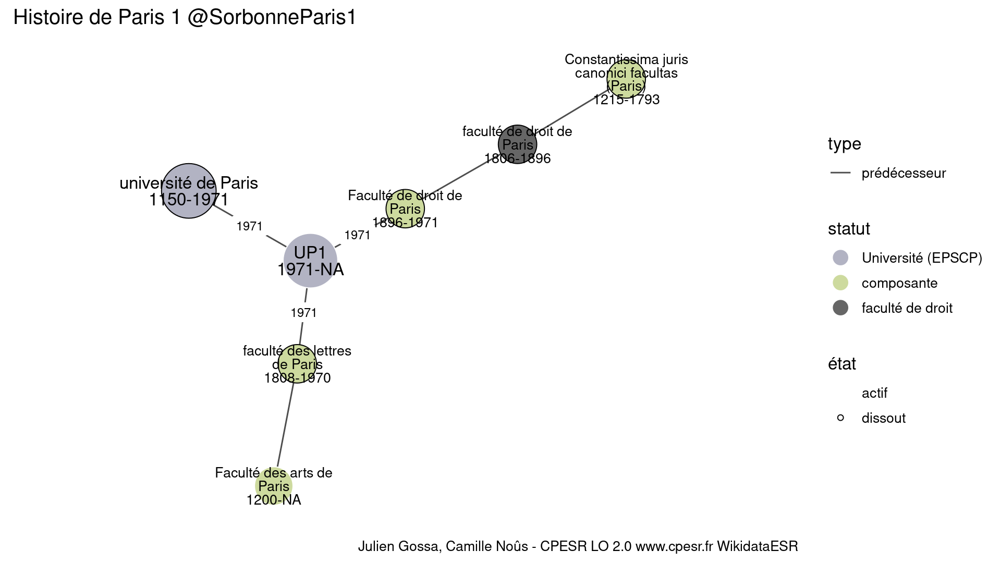 

Avertissements et édition : [logs](plots/etablissements/Q999763.md) 

### Paris 1 @SorbonneParis1 : Composition.     Edition des données : https://github.com/cpesr/wikidataESR/blob/master/plots/etablissements/Q999763.md 

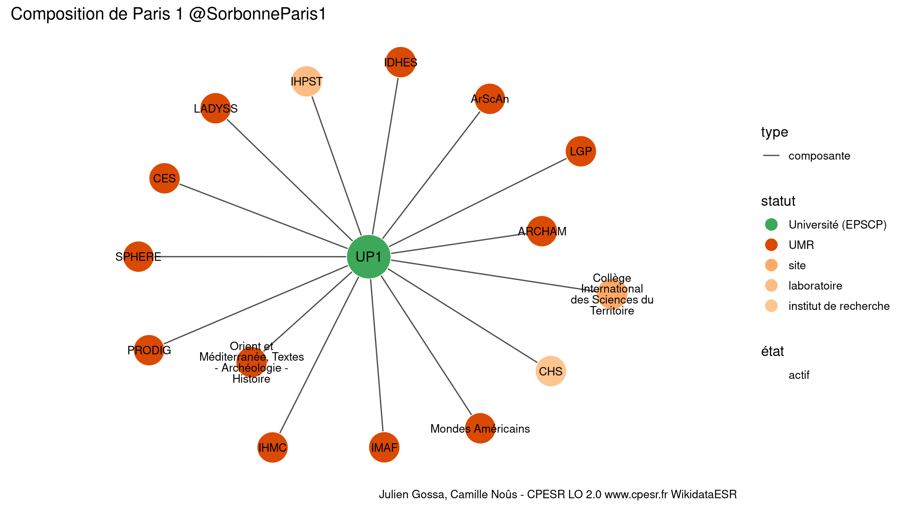 

Avertissements et édition : [logs](plots/etablissements/Q999763.md) 

### Paris 1 @SorbonneParis1 : Associations.     Edition des données : https://github.com/cpesr/wikidataESR/blob/master/plots/etablissements/Q999763.md 

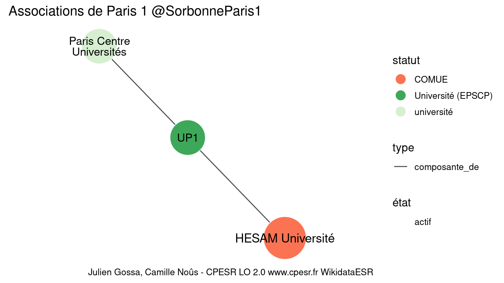 

Avertissements et édition : [logs](plots/etablissements/Q999763.md) 

### Sorbonne U @Sorbonne_Univ_ : Histoire.     Edition des données : https://github.com/cpesr/wikidataESR/blob/master/plots/etablissements/Q41497113.md 

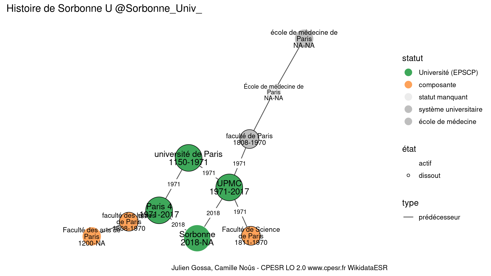 

Avertissements et édition : [logs](plots/etablissements/Q41497113.md) 

### Sorbonne U @Sorbonne_Univ_ : Composition.     Edition des données : https://github.com/cpesr/wikidataESR/blob/master/plots/etablissements/Q41497113.md 

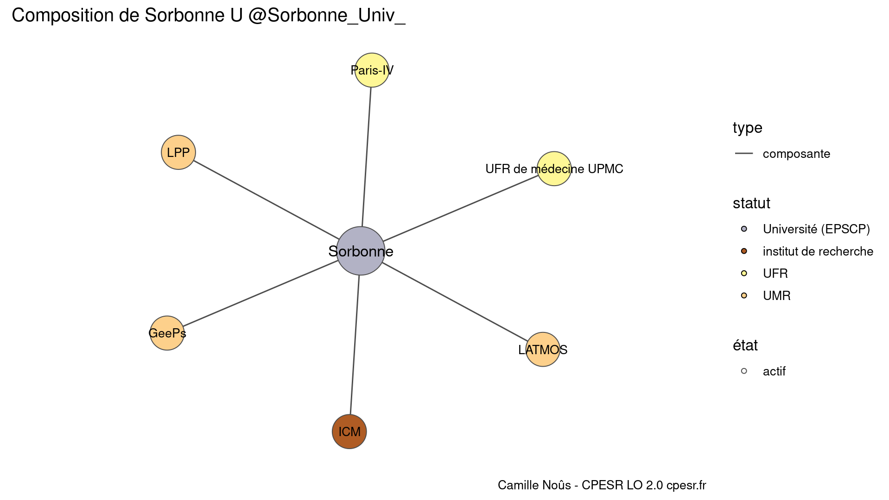 

Avertissements et édition : [logs](plots/etablissements/Q41497113.md) 

### Sorbonne U @Sorbonne_Univ_ : Associations.     Edition des données : https://github.com/cpesr/wikidataESR/blob/master/plots/etablissements/Q41497113.md 

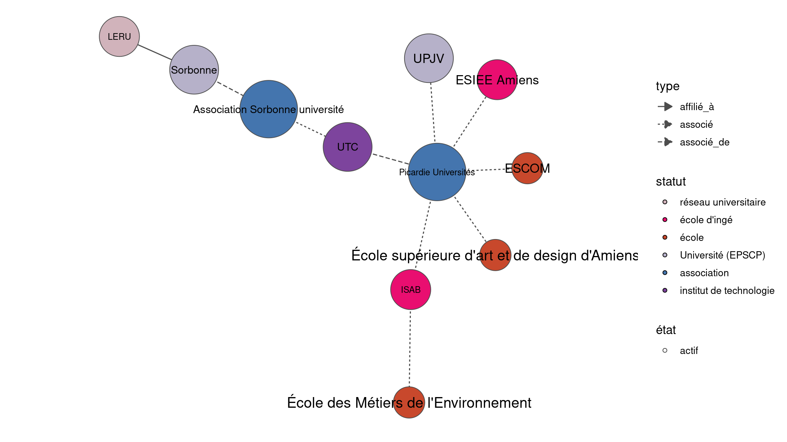 

Avertissements et édition : [logs](plots/etablissements/Q41497113.md) 

### UBx @univbordeaux : Histoire.     Edition des données : https://github.com/cpesr/wikidataESR/blob/master/plots/etablissements/Q13344.md 

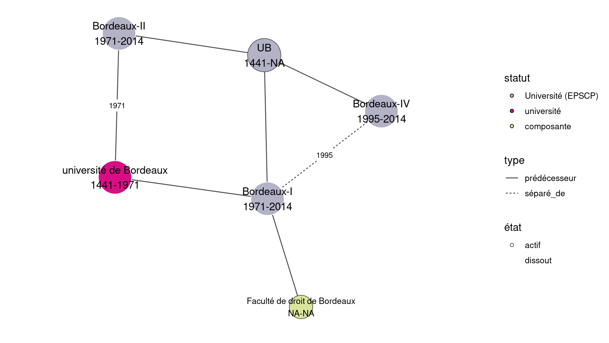 

Avertissements et édition : [logs](plots/etablissements/Q13344.md) 

### UBx @univbordeaux : Composition.     Edition des données : https://github.com/cpesr/wikidataESR/blob/master/plots/etablissements/Q13344.md 

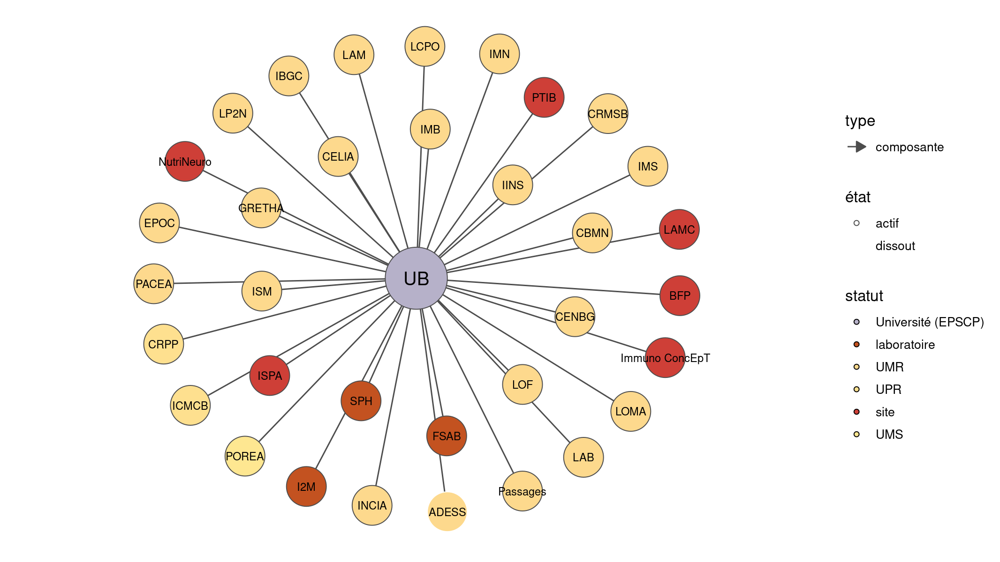 

Avertissements et édition : [logs](plots/etablissements/Q13344.md) 

### UBx @univbordeaux : Associations.     Edition des données : https://github.com/cpesr/wikidataESR/blob/master/plots/etablissements/Q13344.md 


Erreur : les données sont probablement trop partielles.
```
Error in wdesr_ggplot_graph(df, node_size = node_size, label_sizes = label_sizes, : Empty ESR graph: something went wrong with the graph production parameters

``` 

Avertissements et édition : [logs](plots/etablissements/Q13344.md) 

### Université Gustave Eiffel @UGustaveEiffel : Histoire.     Edition des données : https://github.com/cpesr/wikidataESR/blob/master/plots/etablissements/Q65153823.md 

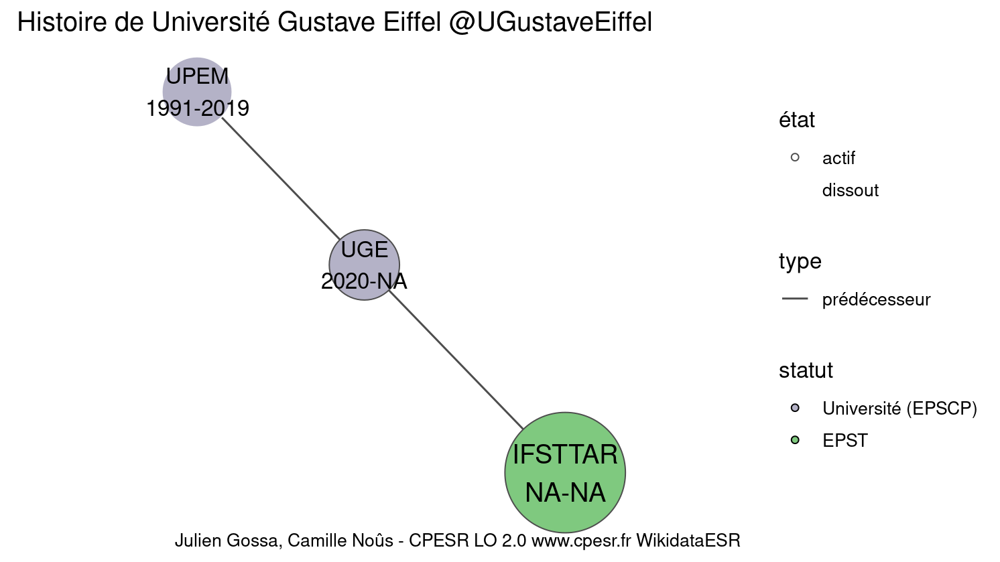 

Avertissements et édition : [logs](plots/etablissements/Q65153823.md) 

### Université Gustave Eiffel @UGustaveEiffel : Composition.     Edition des données : https://github.com/cpesr/wikidataESR/blob/master/plots/etablissements/Q65153823.md 


Erreur : les données sont probablement trop partielles.
```
Error in wdesr_ggplot_graph(df, node_size = node_size, label_sizes = label_sizes, : Empty ESR graph: something went wrong with the graph production parameters

``` 

Avertissements et édition : [logs](plots/etablissements/Q65153823.md) 

### Université Gustave Eiffel @UGustaveEiffel : Associations.     Edition des données : https://github.com/cpesr/wikidataESR/blob/master/plots/etablissements/Q65153823.md 


Erreur : les données sont probablement trop partielles.
```
Error in wdesr_ggplot_graph(df, node_size = node_size, label_sizes = label_sizes, : Empty ESR graph: something went wrong with the graph production parameters

``` 

Avertissements et édition : [logs](plots/etablissements/Q65153823.md) 

### Université de Poitiers @UnivPoitiers : Histoire.     Edition des données : https://github.com/cpesr/wikidataESR/blob/master/plots/etablissements/Q661056.md 


Erreur : les données sont probablement trop partielles.
```
Error in wdesr_ggplot_graph(df, node_size = node_size, label_sizes = label_sizes, : Empty ESR graph: something went wrong with the graph production parameters

``` 

Avertissements et édition : [logs](plots/etablissements/Q661056.md) 

### Université de Poitiers @UnivPoitiers : Composition.     Edition des données : https://github.com/cpesr/wikidataESR/blob/master/plots/etablissements/Q661056.md 

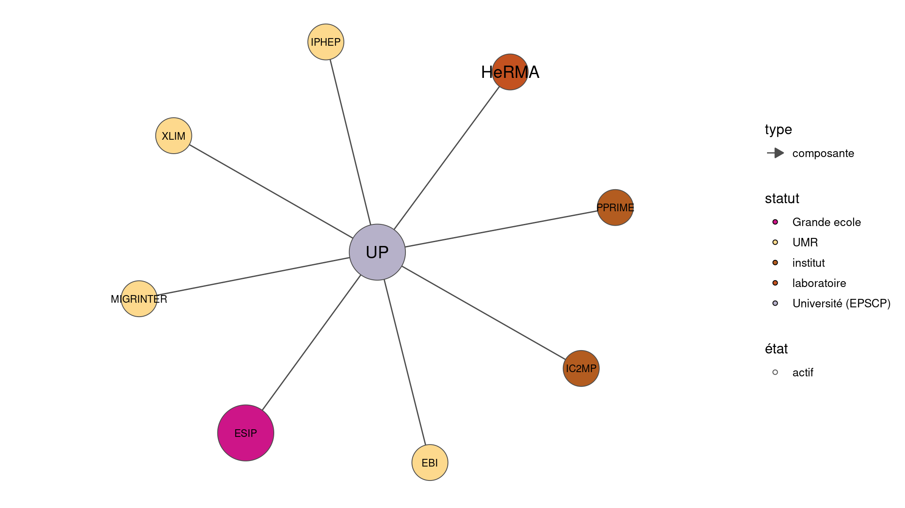 

Avertissements et édition : [logs](plots/etablissements/Q661056.md) 

### Université de Poitiers @UnivPoitiers : Associations.     Edition des données : https://github.com/cpesr/wikidataESR/blob/master/plots/etablissements/Q661056.md 

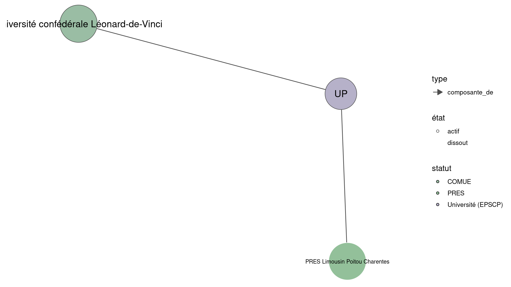 

Avertissements et édition : [logs](plots/etablissements/Q661056.md) 

### Université d'Artois @Univ_Artois : Histoire.     Edition des données : https://github.com/cpesr/wikidataESR/blob/master/plots/etablissements/Q475504.md 


Erreur : les données sont probablement trop partielles.
```
Error in wdesr_ggplot_graph(df, node_size = node_size, label_sizes = label_sizes, : Empty ESR graph: something went wrong with the graph production parameters

``` 

Avertissements et édition : [logs](plots/etablissements/Q475504.md) 

### Université d'Artois @Univ_Artois : Composition.     Edition des données : https://github.com/cpesr/wikidataESR/blob/master/plots/etablissements/Q475504.md 

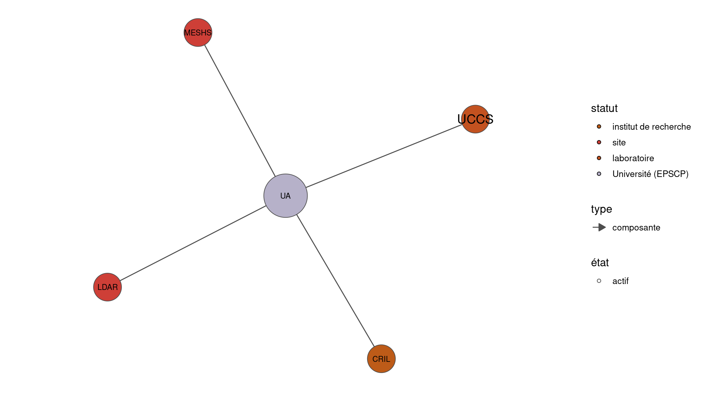 

Avertissements et édition : [logs](plots/etablissements/Q475504.md) 

### Université d'Artois @Univ_Artois : Associations.     Edition des données : https://github.com/cpesr/wikidataESR/blob/master/plots/etablissements/Q475504.md 


Erreur : les données sont probablement trop partielles.
```
Error in wdesr_ggplot_graph(df, node_size = node_size, label_sizes = label_sizes, : Empty ESR graph: something went wrong with the graph production parameters

``` 

Avertissements et édition : [logs](plots/etablissements/Q475504.md) 

### Université Paris 8 - Vincennes - Saint-Denis @UnivParis8 : Histoire.     Edition des données : https://github.com/cpesr/wikidataESR/blob/master/plots/etablissements/Q1194988.md 

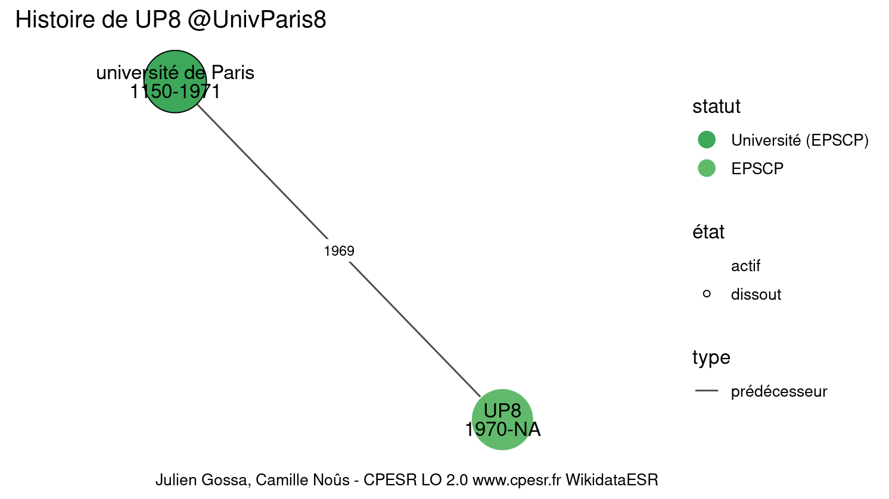 

Avertissements et édition : [logs](plots/etablissements/Q1194988.md) 

### Université Paris 8 - Vincennes - Saint-Denis @UnivParis8 : Composition.     Edition des données : https://github.com/cpesr/wikidataESR/blob/master/plots/etablissements/Q1194988.md 

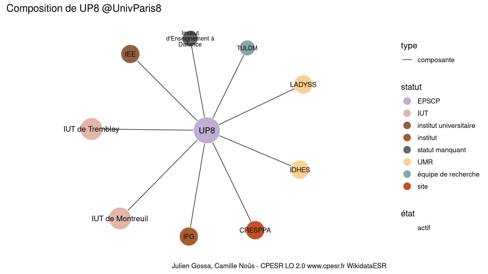 

Avertissements et édition : [logs](plots/etablissements/Q1194988.md) 

### Université Paris 8 - Vincennes - Saint-Denis @UnivParis8 : Associations.     Edition des données : https://github.com/cpesr/wikidataESR/blob/master/plots/etablissements/Q1194988.md 

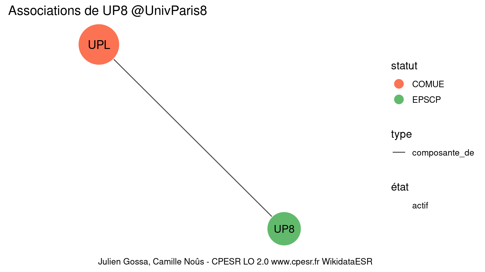 

Avertissements et édition : [logs](plots/etablissements/Q1194988.md) 

### La Rochelle Université @UnivLaRochelle : Histoire.     Edition des données : https://github.com/cpesr/wikidataESR/blob/master/plots/etablissements/Q1500822.md 

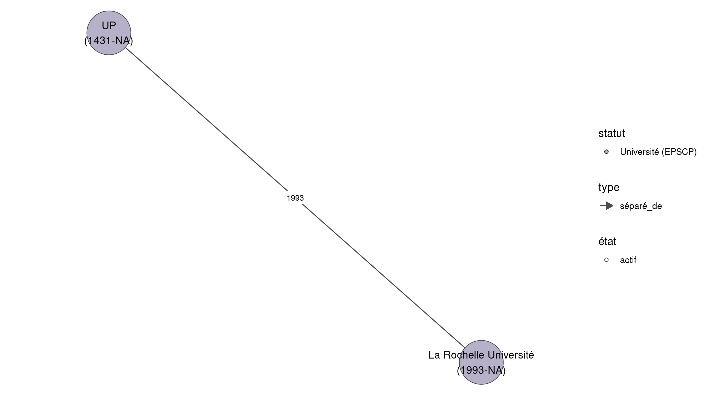 

Avertissements et édition : [logs](plots/etablissements/Q1500822.md) 

### La Rochelle Université @UnivLaRochelle : Composition.     Edition des données : https://github.com/cpesr/wikidataESR/blob/master/plots/etablissements/Q1500822.md 

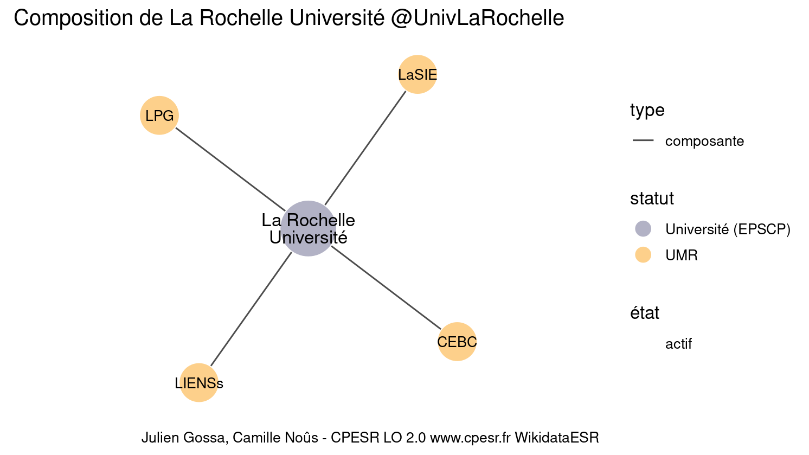 

Avertissements et édition : [logs](plots/etablissements/Q1500822.md) 

### La Rochelle Université @UnivLaRochelle : Associations.     Edition des données : https://github.com/cpesr/wikidataESR/blob/master/plots/etablissements/Q1500822.md 

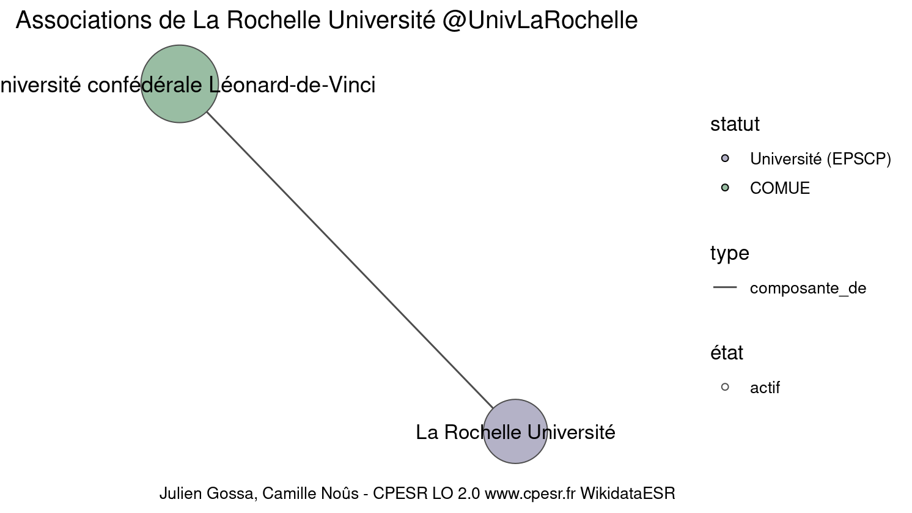 

Avertissements et édition : [logs](plots/etablissements/Q1500822.md) 

### Université Côte d'Azur @Univ_CotedAzur : Histoire.     Edition des données : https://github.com/cpesr/wikidataESR/blob/master/plots/etablissements/Q80186910.md 

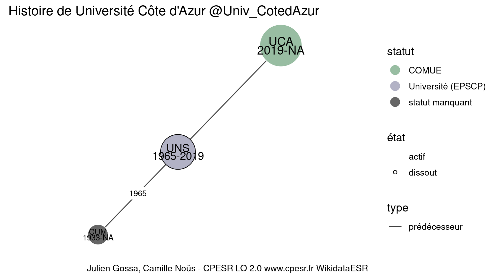 

Avertissements et édition : [logs](plots/etablissements/Q80186910.md) 

### Université Côte d'Azur @Univ_CotedAzur : Composition.     Edition des données : https://github.com/cpesr/wikidataESR/blob/master/plots/etablissements/Q80186910.md 

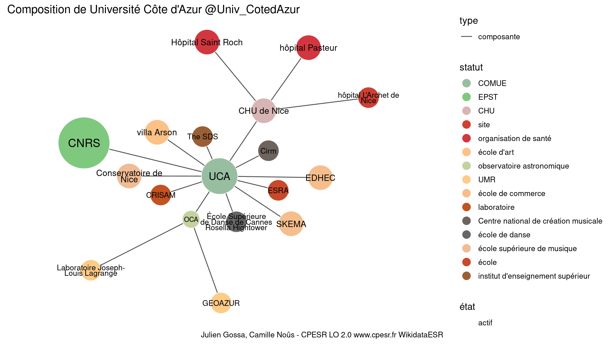 

Avertissements et édition : [logs](plots/etablissements/Q80186910.md) 

### Université Côte d'Azur @Univ_CotedAzur : Associations.     Edition des données : https://github.com/cpesr/wikidataESR/blob/master/plots/etablissements/Q80186910.md 

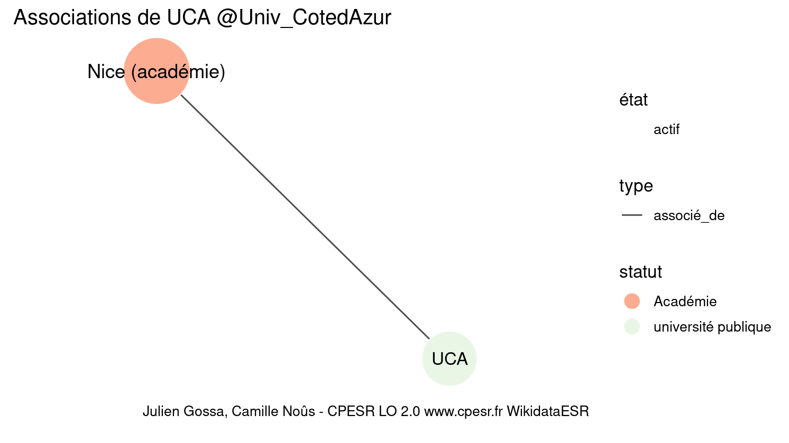 

Avertissements et édition : [logs](plots/etablissements/Q80186910.md) 

### Université Le Havre Normandie  : Histoire.     Edition des données : https://github.com/cpesr/wikidataESR/blob/master/plots/etablissements/Q1784954.md 


Erreur : les données sont probablement trop partielles.
```
Error in wdesr_ggplot_graph(df, node_size = node_size, label_sizes = label_sizes, : Empty ESR graph: something went wrong with the graph production parameters

``` 

Avertissements et édition : [logs](plots/etablissements/Q1784954.md) 

### Université Le Havre Normandie  : Composition.     Edition des données : https://github.com/cpesr/wikidataESR/blob/master/plots/etablissements/Q1784954.md 

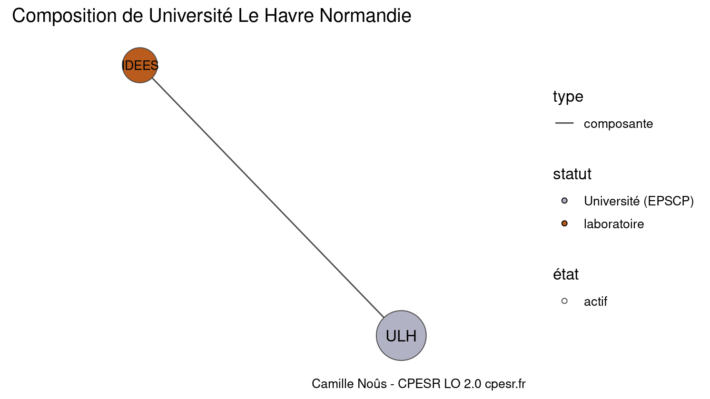 

Avertissements et édition : [logs](plots/etablissements/Q1784954.md) 

### Université Le Havre Normandie  : Associations.     Edition des données : https://github.com/cpesr/wikidataESR/blob/master/plots/etablissements/Q1784954.md 

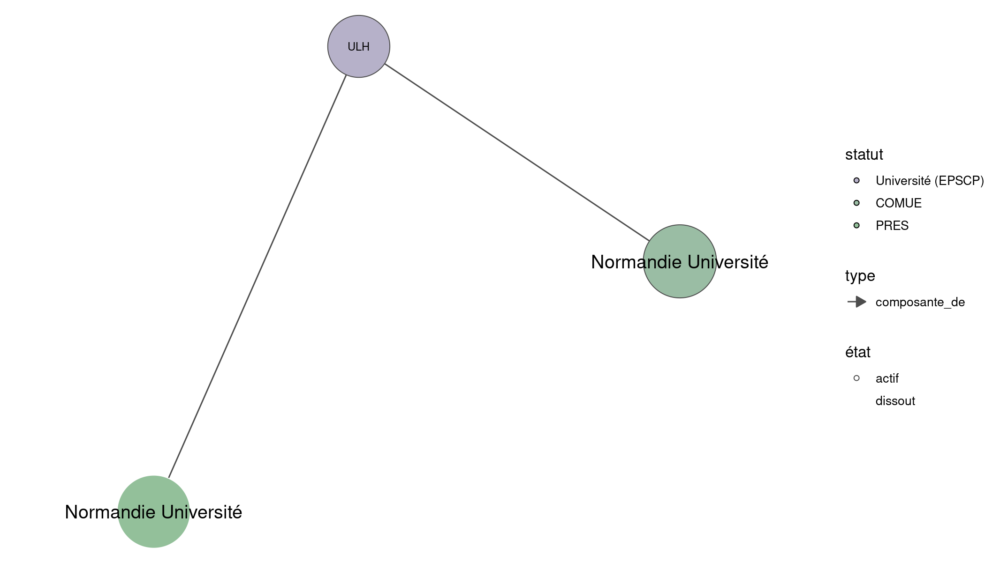 

Avertissements et édition : [logs](plots/etablissements/Q1784954.md) 

### Université Jean Monnet @Univ_St_Etienne : Histoire.     Edition des données : https://github.com/cpesr/wikidataESR/blob/master/plots/etablissements/Q623154.md 


Erreur : les données sont probablement trop partielles.
```
Error in wdesr_ggplot_graph(df, node_size = node_size, label_sizes = label_sizes, : Empty ESR graph: something went wrong with the graph production parameters

``` 

Avertissements et édition : [logs](plots/etablissements/Q623154.md) 

### Université Jean Monnet @Univ_St_Etienne : Composition.     Edition des données : https://github.com/cpesr/wikidataESR/blob/master/plots/etablissements/Q623154.md 

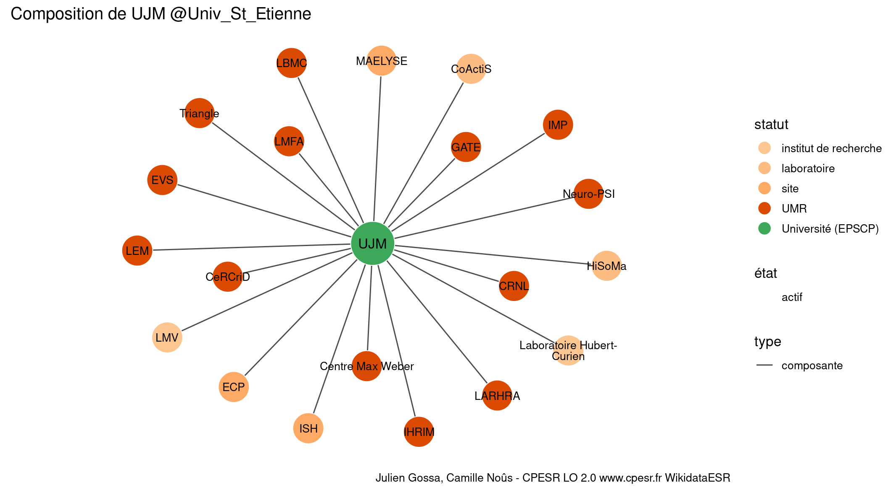 

Avertissements et édition : [logs](plots/etablissements/Q623154.md) 

### Université Jean Monnet @Univ_St_Etienne : Associations.     Edition des données : https://github.com/cpesr/wikidataESR/blob/master/plots/etablissements/Q623154.md 

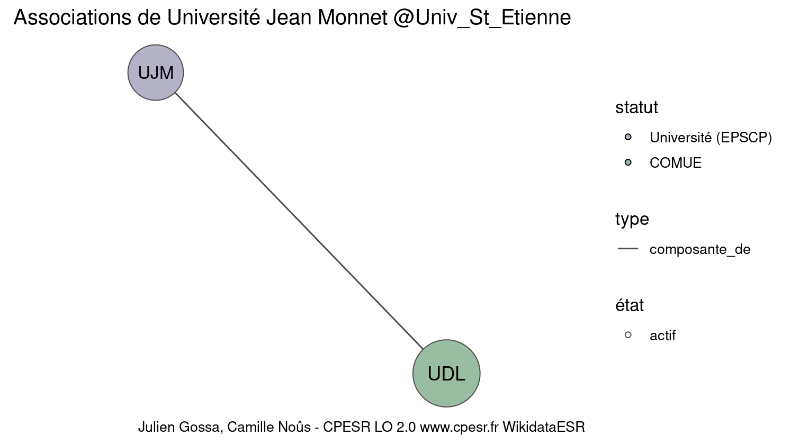 

Avertissements et édition : [logs](plots/etablissements/Q623154.md) 

### Université Rennes 2 @Univ_Rennes2 : Histoire.     Edition des données : https://github.com/cpesr/wikidataESR/blob/master/plots/etablissements/Q459026.md 

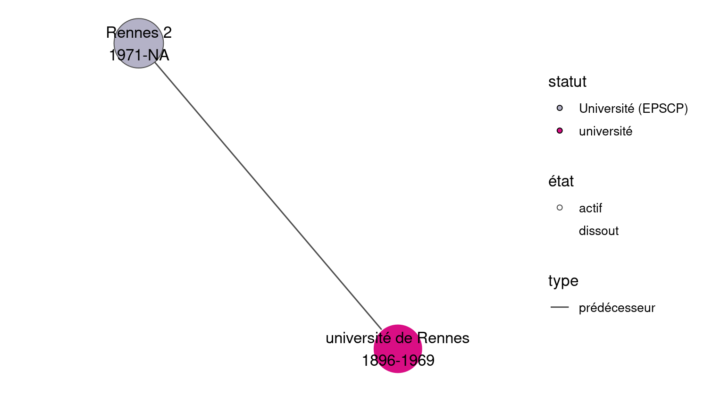 

Avertissements et édition : [logs](plots/etablissements/Q459026.md) 

### Université Rennes 2 @Univ_Rennes2 : Composition.     Edition des données : https://github.com/cpesr/wikidataESR/blob/master/plots/etablissements/Q459026.md 

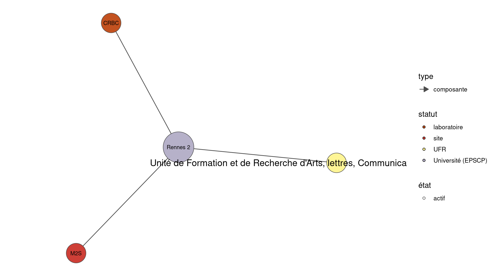 

Avertissements et édition : [logs](plots/etablissements/Q459026.md) 

### Université Rennes 2 @Univ_Rennes2 : Associations.     Edition des données : https://github.com/cpesr/wikidataESR/blob/master/plots/etablissements/Q459026.md 

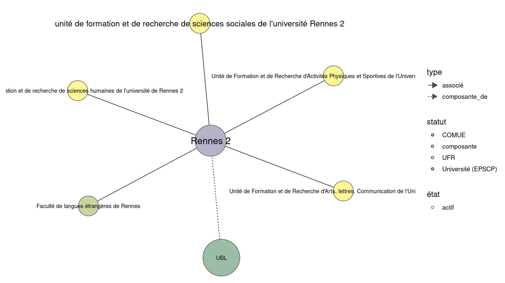 

Avertissements et édition : [logs](plots/etablissements/Q459026.md) 

### Université de Rennes 1 @UnivRennes1 : Histoire.     Edition des données : https://github.com/cpesr/wikidataESR/blob/master/plots/etablissements/Q726595.md 

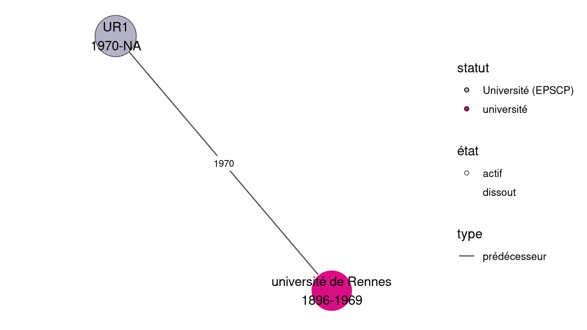 

Avertissements et édition : [logs](plots/etablissements/Q726595.md) 

### Université de Rennes 1 @UnivRennes1 : Composition.     Edition des données : https://github.com/cpesr/wikidataESR/blob/master/plots/etablissements/Q726595.md 

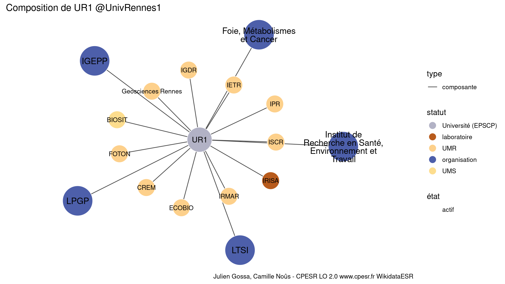 

Avertissements et édition : [logs](plots/etablissements/Q726595.md) 

### Université de Rennes 1 @UnivRennes1 : Associations.     Edition des données : https://github.com/cpesr/wikidataESR/blob/master/plots/etablissements/Q726595.md 

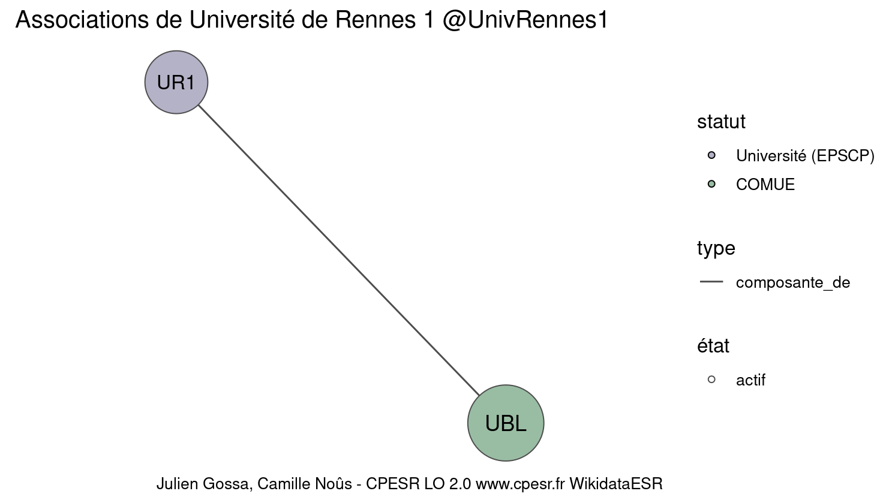 

Avertissements et édition : [logs](plots/etablissements/Q726595.md) 

### UBM @UBMontaigne : Histoire.     Edition des données : https://github.com/cpesr/wikidataESR/blob/master/plots/etablissements/Q13342.md 

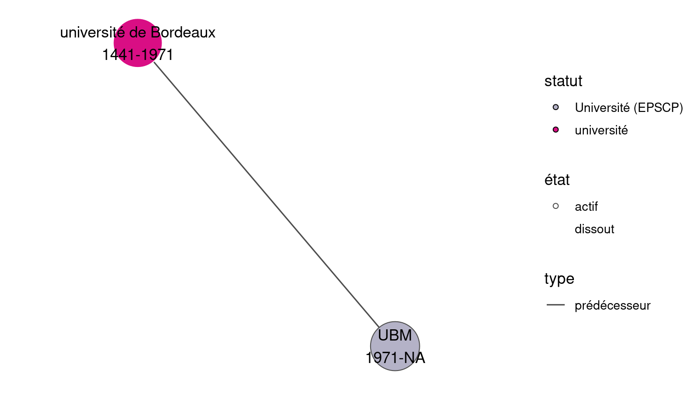 

Avertissements et édition : [logs](plots/etablissements/Q13342.md) 

### UBM @UBMontaigne : Composition.     Edition des données : https://github.com/cpesr/wikidataESR/blob/master/plots/etablissements/Q13342.md 

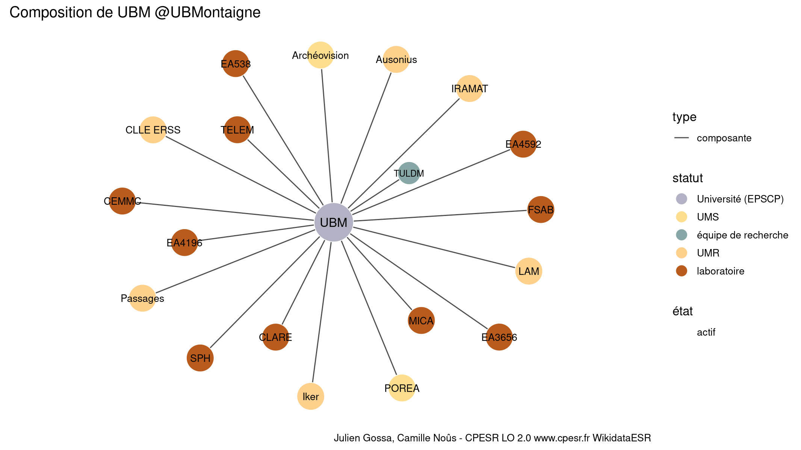 

Avertissements et édition : [logs](plots/etablissements/Q13342.md) 

### UBM @UBMontaigne : Associations.     Edition des données : https://github.com/cpesr/wikidataESR/blob/master/plots/etablissements/Q13342.md 


Erreur : les données sont probablement trop partielles.
```
Error in wdesr_ggplot_graph(df, node_size = node_size, label_sizes = label_sizes, : Empty ESR graph: something went wrong with the graph production parameters

``` 

Avertissements et édition : [logs](plots/etablissements/Q13342.md) 

### Université Paul-Valéry - Montpellier 3 @univpaulvalery : Histoire.     Edition des données : https://github.com/cpesr/wikidataESR/blob/master/plots/etablissements/Q2912244.md 

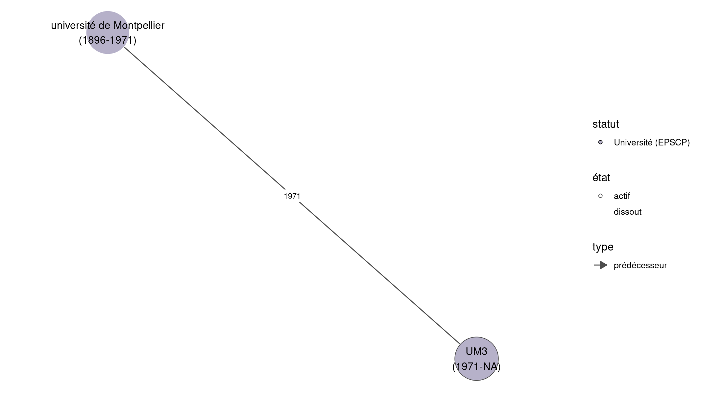 

Avertissements et édition : [logs](plots/etablissements/Q2912244.md) 

### Université Paul-Valéry - Montpellier 3 @univpaulvalery : Composition.     Edition des données : https://github.com/cpesr/wikidataESR/blob/master/plots/etablissements/Q2912244.md 

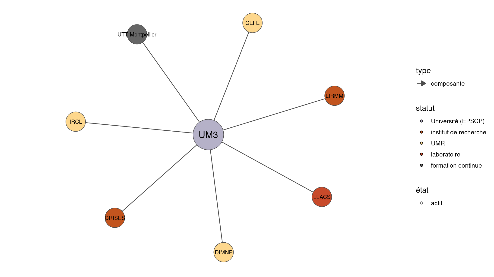 

Avertissements et édition : [logs](plots/etablissements/Q2912244.md) 

### Université Paul-Valéry - Montpellier 3 @univpaulvalery : Associations.     Edition des données : https://github.com/cpesr/wikidataESR/blob/master/plots/etablissements/Q2912244.md 

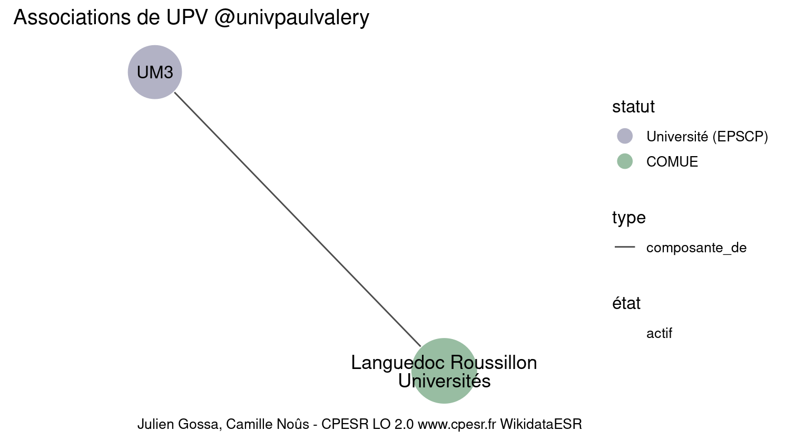 

Avertissements et édition : [logs](plots/etablissements/Q2912244.md) 

### Université de Paris @Univ_Paris : Histoire.     Edition des données : https://github.com/cpesr/wikidataESR/blob/master/plots/etablissements/Q55849612.md 

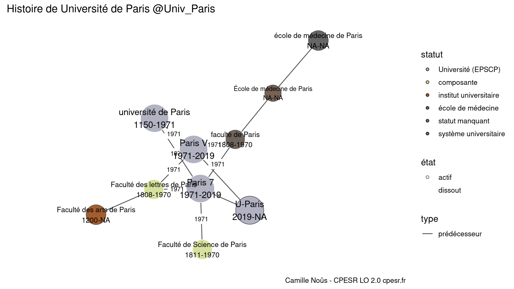 

Avertissements et édition : [logs](plots/etablissements/Q55849612.md) 

### Université de Paris @Univ_Paris : Composition.     Edition des données : https://github.com/cpesr/wikidataESR/blob/master/plots/etablissements/Q55849612.md 

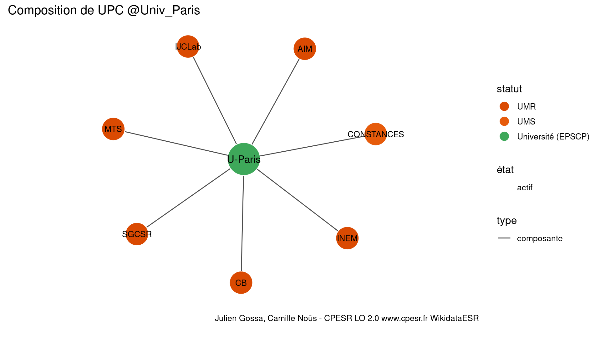 

Avertissements et édition : [logs](plots/etablissements/Q55849612.md) 

### Université de Paris @Univ_Paris : Associations.     Edition des données : https://github.com/cpesr/wikidataESR/blob/master/plots/etablissements/Q55849612.md 


Erreur : les données sont probablement trop partielles.
```
Error in wdesr_ggplot_graph(df, node_size = node_size, label_sizes = label_sizes, : Empty ESR graph: something went wrong with the graph production parameters

``` 

Avertissements et édition : [logs](plots/etablissements/Q55849612.md) 

### Université de Pau et des Pays de l'Adour @universite_uppa : Histoire.     Edition des données : https://github.com/cpesr/wikidataESR/blob/master/plots/etablissements/Q572968.md 


Erreur : les données sont probablement trop partielles.
```
Error in wdesr_ggplot_graph(df, node_size = node_size, label_sizes = label_sizes, : Empty ESR graph: something went wrong with the graph production parameters

``` 

Avertissements et édition : [logs](plots/etablissements/Q572968.md) 

### Université de Pau et des Pays de l'Adour @universite_uppa : Composition.     Edition des données : https://github.com/cpesr/wikidataESR/blob/master/plots/etablissements/Q572968.md 

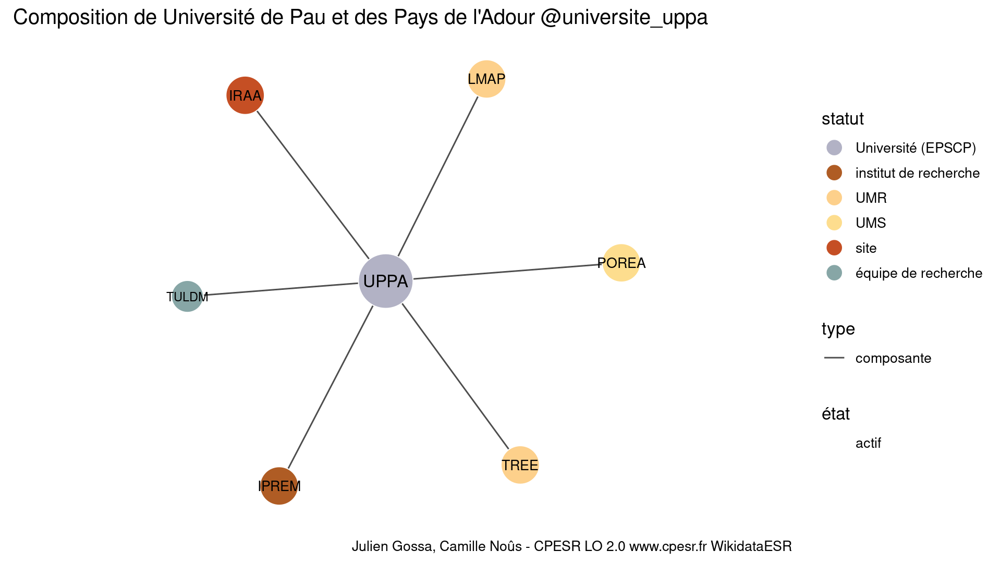 

Avertissements et édition : [logs](plots/etablissements/Q572968.md) 

### Université de Pau et des Pays de l'Adour @universite_uppa : Associations.     Edition des données : https://github.com/cpesr/wikidataESR/blob/master/plots/etablissements/Q572968.md 


Erreur : les données sont probablement trop partielles.
```
Error in wdesr_ggplot_graph(df, node_size = node_size, label_sizes = label_sizes, : Empty ESR graph: something went wrong with the graph production parameters

``` 

Avertissements et édition : [logs](plots/etablissements/Q572968.md) 

### AMU @univamu : Histoire.     Edition des données : https://github.com/cpesr/wikidataESR/blob/master/plots/etablissements/Q2302586.md 

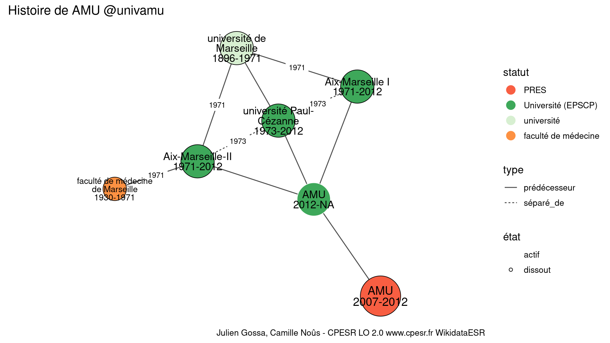 

Avertissements et édition : [logs](plots/etablissements/Q2302586.md) 

### AMU @univamu : Composition.     Edition des données : https://github.com/cpesr/wikidataESR/blob/master/plots/etablissements/Q2302586.md 

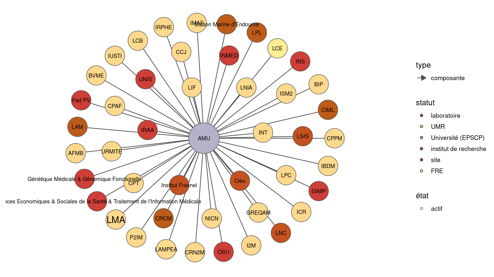 

Avertissements et édition : [logs](plots/etablissements/Q2302586.md) 

### AMU @univamu : Associations.     Edition des données : https://github.com/cpesr/wikidataESR/blob/master/plots/etablissements/Q2302586.md 

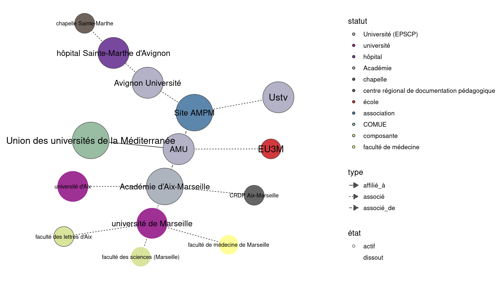 

Avertissements et édition : [logs](plots/etablissements/Q2302586.md) 

### Université de Haute-Alsace @UHA68 : Histoire.     Edition des données : https://github.com/cpesr/wikidataESR/blob/master/plots/etablissements/Q280183.md 


Erreur : les données sont probablement trop partielles.
```
Error in wdesr_ggplot_graph(df, node_size = node_size, label_sizes = label_sizes, : Empty ESR graph: something went wrong with the graph production parameters

``` 

Avertissements et édition : [logs](plots/etablissements/Q280183.md) 

### Université de Haute-Alsace @UHA68 : Composition.     Edition des données : https://github.com/cpesr/wikidataESR/blob/master/plots/etablissements/Q280183.md 

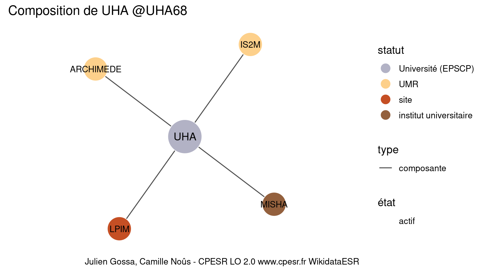 

Avertissements et édition : [logs](plots/etablissements/Q280183.md) 

### Université de Haute-Alsace @UHA68 : Associations.     Edition des données : https://github.com/cpesr/wikidataESR/blob/master/plots/etablissements/Q280183.md 

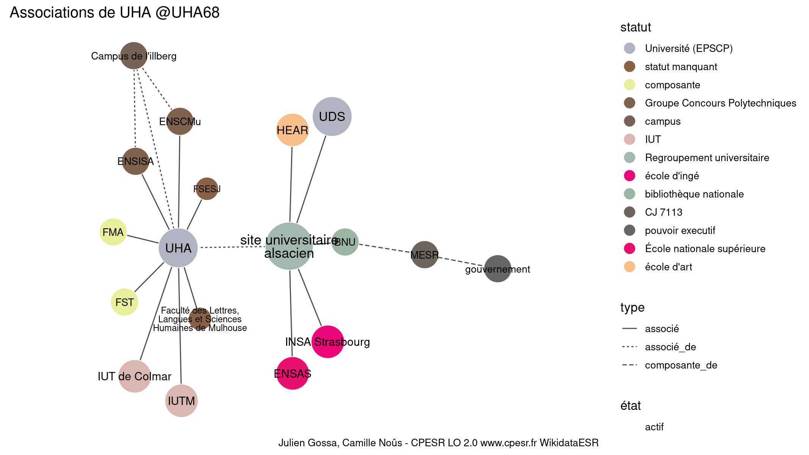 

Avertissements et édition : [logs](plots/etablissements/Q280183.md) 

### Université de La Réunion @univ_reunion : Histoire.     Edition des données : https://github.com/cpesr/wikidataESR/blob/master/plots/etablissements/Q834819.md 


Erreur : les données sont probablement trop partielles.
```
Error in wdesr_ggplot_graph(df, node_size = node_size, label_sizes = label_sizes, : Empty ESR graph: something went wrong with the graph production parameters

``` 

Avertissements et édition : [logs](plots/etablissements/Q834819.md) 

### Université de La Réunion @univ_reunion : Composition.     Edition des données : https://github.com/cpesr/wikidataESR/blob/master/plots/etablissements/Q834819.md 

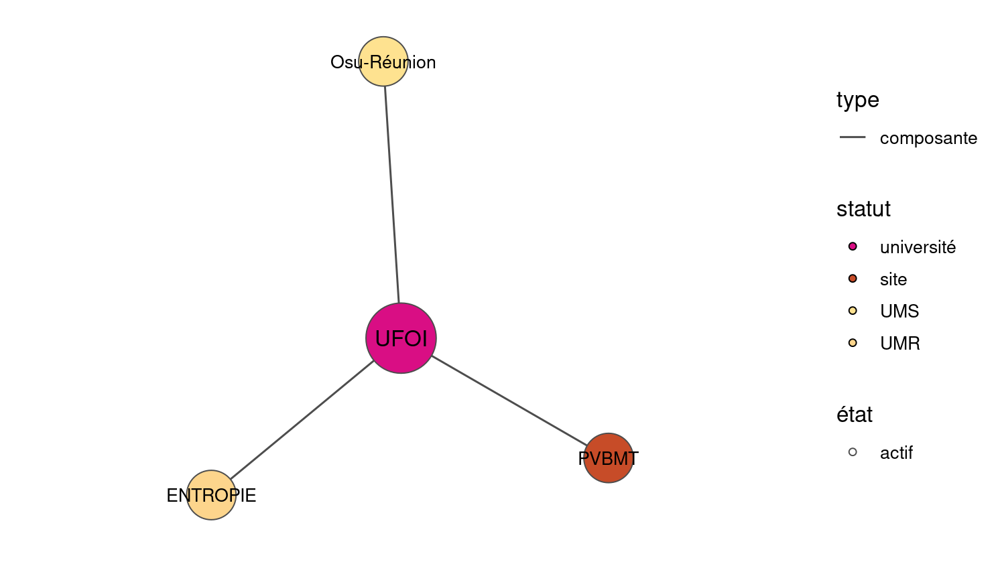 

Avertissements et édition : [logs](plots/etablissements/Q834819.md) 

### Université de La Réunion @univ_reunion : Associations.     Edition des données : https://github.com/cpesr/wikidataESR/blob/master/plots/etablissements/Q834819.md 


Erreur : les données sont probablement trop partielles.
```
Error in wdesr_ggplot_graph(df, node_size = node_size, label_sizes = label_sizes, : Empty ESR graph: something went wrong with the graph production parameters

``` 

Avertissements et édition : [logs](plots/etablissements/Q834819.md) 

### Université Toulouse III - Paul Sabatier @UT3PaulSabatier : Histoire.     Edition des données : https://github.com/cpesr/wikidataESR/blob/master/plots/etablissements/Q1273188.md 

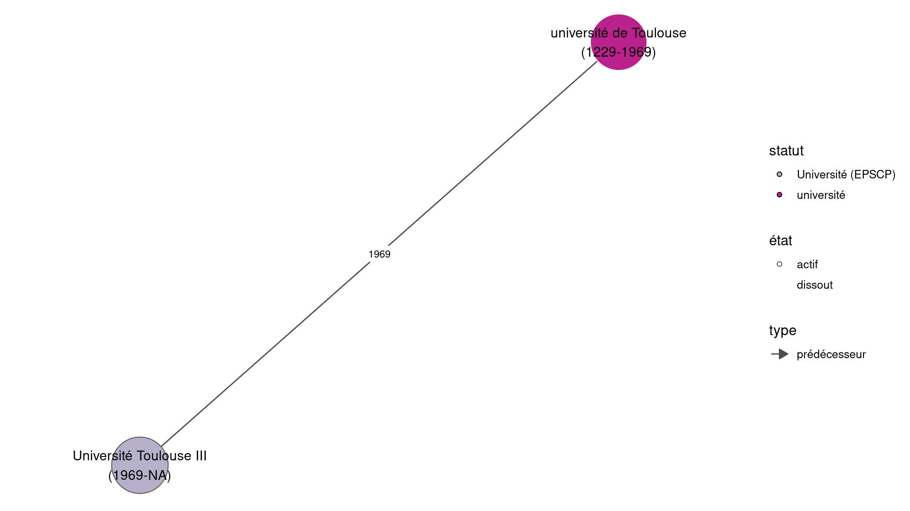 

Avertissements et édition : [logs](plots/etablissements/Q1273188.md) 

### Université Toulouse III - Paul Sabatier @UT3PaulSabatier : Composition.     Edition des données : https://github.com/cpesr/wikidataESR/blob/master/plots/etablissements/Q1273188.md 

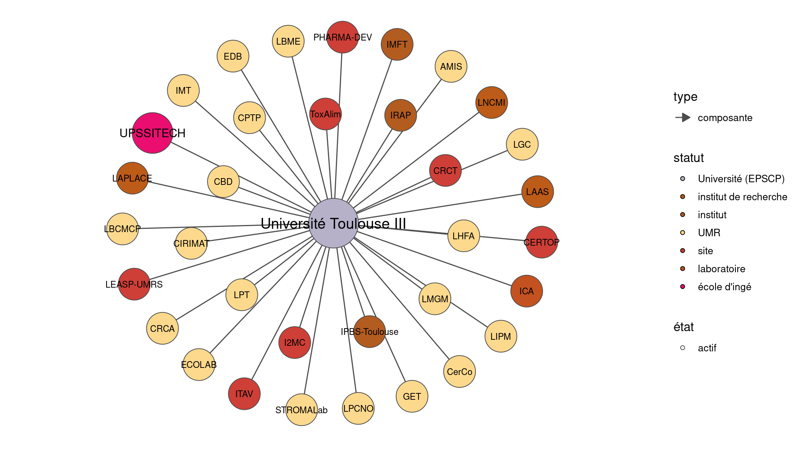 

Avertissements et édition : [logs](plots/etablissements/Q1273188.md) 

### Université Toulouse III - Paul Sabatier @UT3PaulSabatier : Associations.     Edition des données : https://github.com/cpesr/wikidataESR/blob/master/plots/etablissements/Q1273188.md 

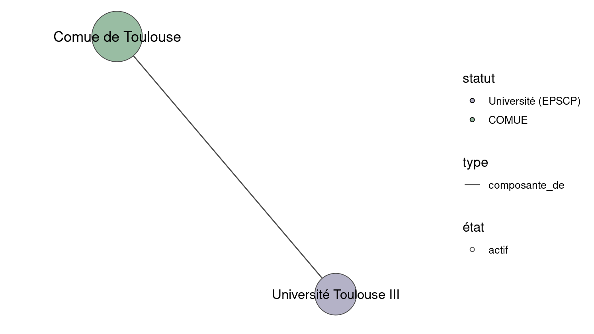 

Avertissements et édition : [logs](plots/etablissements/Q1273188.md) 

### Université d'Orléans @Univ_Orleans : Histoire.     Edition des données : https://github.com/cpesr/wikidataESR/blob/master/plots/etablissements/Q13334.md 

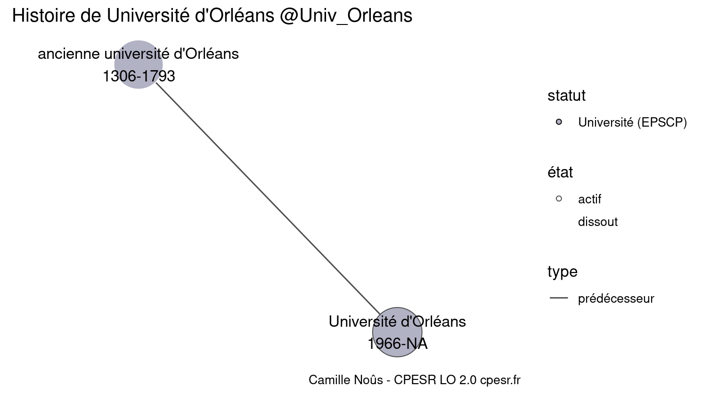 

Avertissements et édition : [logs](plots/etablissements/Q13334.md) 

### Université d'Orléans @Univ_Orleans : Composition.     Edition des données : https://github.com/cpesr/wikidataESR/blob/master/plots/etablissements/Q13334.md 

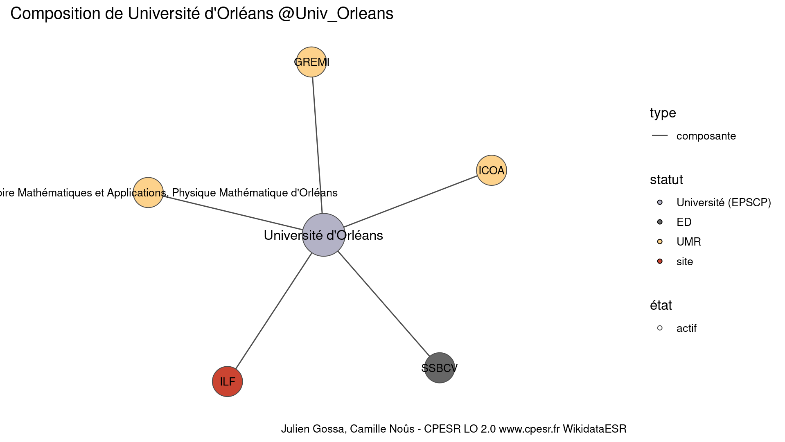 

Avertissements et édition : [logs](plots/etablissements/Q13334.md) 

### Université d'Orléans @Univ_Orleans : Associations.     Edition des données : https://github.com/cpesr/wikidataESR/blob/master/plots/etablissements/Q13334.md 

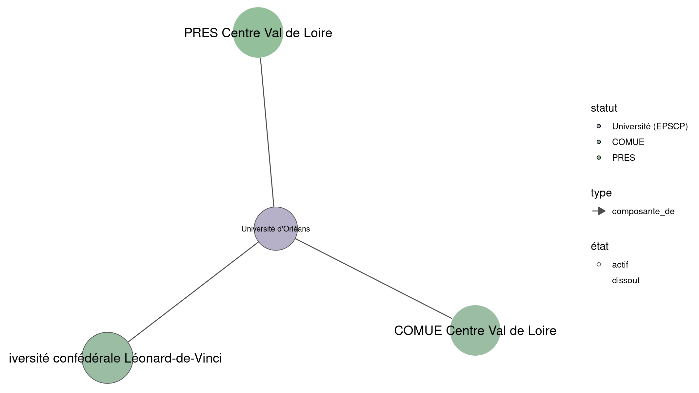 

Avertissements et édition : [logs](plots/etablissements/Q13334.md) 

### CY Cergy Paris Université @UniversiteCergy : Histoire.     Edition des données : https://github.com/cpesr/wikidataESR/blob/master/plots/etablissements/Q74452784.md 


Erreur : les données sont probablement trop partielles.
```
Error in wdesr_ggplot_graph(df, node_size = node_size, label_sizes = label_sizes, : Empty ESR graph: something went wrong with the graph production parameters

``` 

Avertissements et édition : [logs](plots/etablissements/Q74452784.md) 

### CY Cergy Paris Université @UniversiteCergy : Composition.     Edition des données : https://github.com/cpesr/wikidataESR/blob/master/plots/etablissements/Q74452784.md 

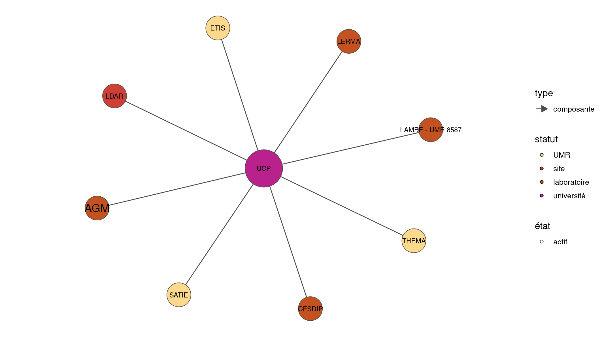 

Avertissements et édition : [logs](plots/etablissements/Q74452784.md) 

### CY Cergy Paris Université @UniversiteCergy : Associations.     Edition des données : https://github.com/cpesr/wikidataESR/blob/master/plots/etablissements/Q74452784.md 

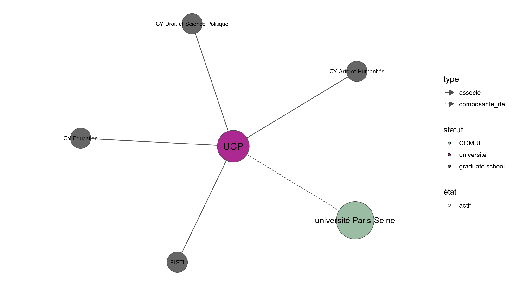 

Avertissements et édition : [logs](plots/etablissements/Q74452784.md) 

### Université de la Polynésie Française @univpf : Histoire.     Edition des données : https://github.com/cpesr/wikidataESR/blob/master/plots/etablissements/Q1695245.md 


Erreur : les données sont probablement trop partielles.
```
Error in wdesr_ggplot_graph(df, node_size = node_size, label_sizes = label_sizes, : Empty ESR graph: something went wrong with the graph production parameters

``` 

Avertissements et édition : [logs](plots/etablissements/Q1695245.md) 

### Université de la Polynésie Française @univpf : Composition.     Edition des données : https://github.com/cpesr/wikidataESR/blob/master/plots/etablissements/Q1695245.md 


Erreur : les données sont probablement trop partielles.
```
Error in wdesr_ggplot_graph(df, node_size = node_size, label_sizes = label_sizes, : Empty ESR graph: something went wrong with the graph production parameters

``` 

Avertissements et édition : [logs](plots/etablissements/Q1695245.md) 

### Université de la Polynésie Française @univpf : Associations.     Edition des données : https://github.com/cpesr/wikidataESR/blob/master/plots/etablissements/Q1695245.md 


Erreur : les données sont probablement trop partielles.
```
Error in wdesr_ggplot_graph(df, node_size = node_size, label_sizes = label_sizes, : Empty ESR graph: something went wrong with the graph production parameters

``` 

Avertissements et édition : [logs](plots/etablissements/Q1695245.md) 

### Université Panthéon-Assas @AssasParis2 : Histoire.     Edition des données : https://github.com/cpesr/wikidataESR/blob/master/plots/etablissements/Q662976.md 

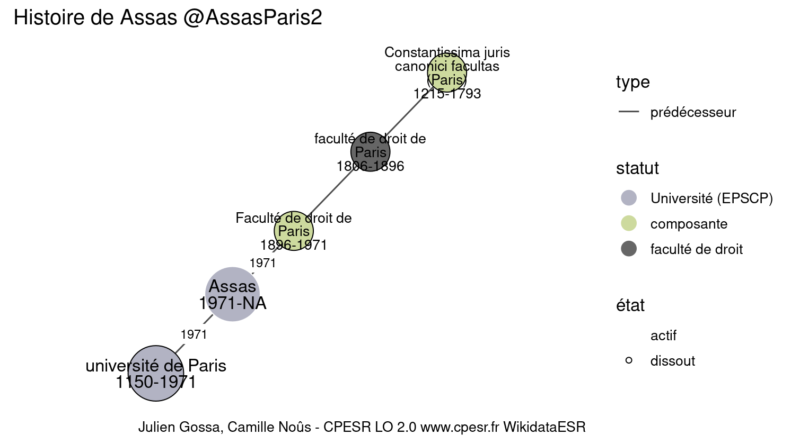 

Avertissements et édition : [logs](plots/etablissements/Q662976.md) 

### Université Panthéon-Assas @AssasParis2 : Composition.     Edition des données : https://github.com/cpesr/wikidataESR/blob/master/plots/etablissements/Q662976.md 

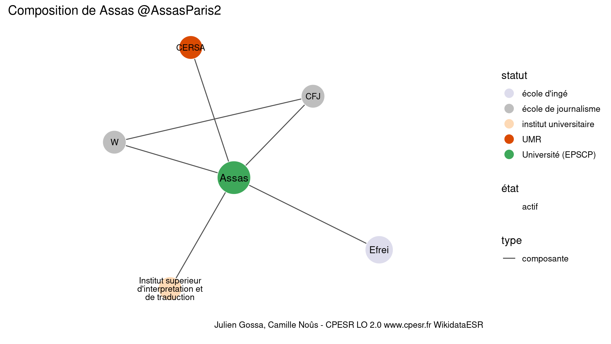 

Avertissements et édition : [logs](plots/etablissements/Q662976.md) 

### Université Panthéon-Assas @AssasParis2 : Associations.     Edition des données : https://github.com/cpesr/wikidataESR/blob/master/plots/etablissements/Q662976.md 

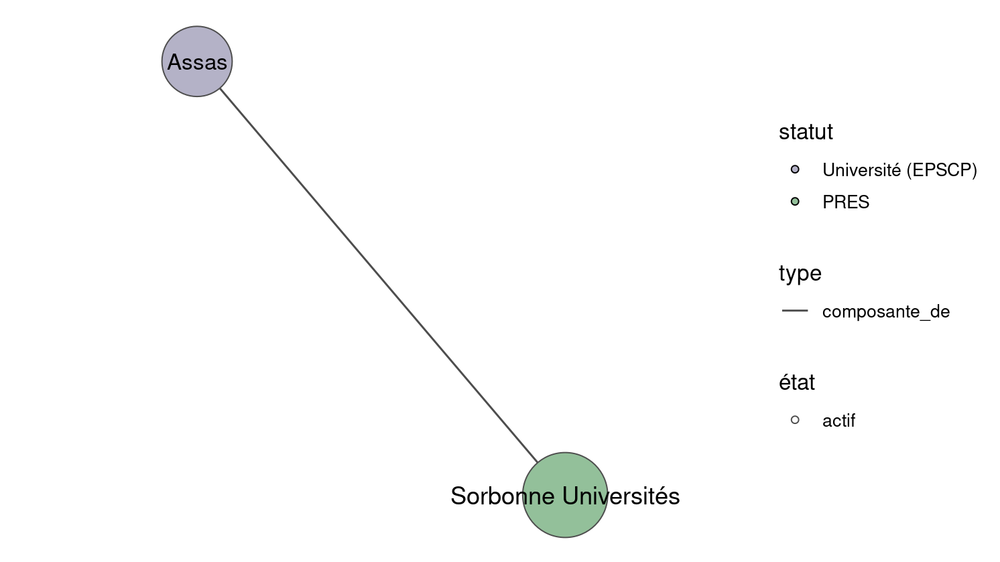 

Avertissements et édition : [logs](plots/etablissements/Q662976.md) 

### Université Paris Nanterre @uparisnanterre : Histoire.     Edition des données : https://github.com/cpesr/wikidataESR/blob/master/plots/etablissements/Q1394262.md 

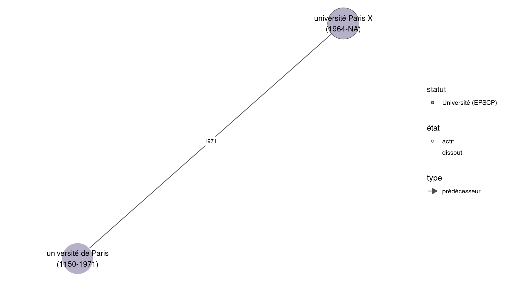 

Avertissements et édition : [logs](plots/etablissements/Q1394262.md) 

### Université Paris Nanterre @uparisnanterre : Composition.     Edition des données : https://github.com/cpesr/wikidataESR/blob/master/plots/etablissements/Q1394262.md 

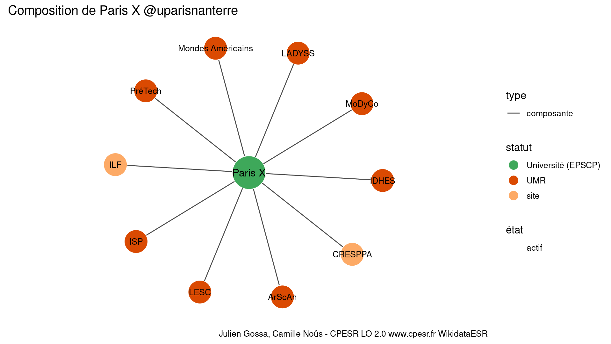 

Avertissements et édition : [logs](plots/etablissements/Q1394262.md) 

### Université Paris Nanterre @uparisnanterre : Associations.     Edition des données : https://github.com/cpesr/wikidataESR/blob/master/plots/etablissements/Q1394262.md 

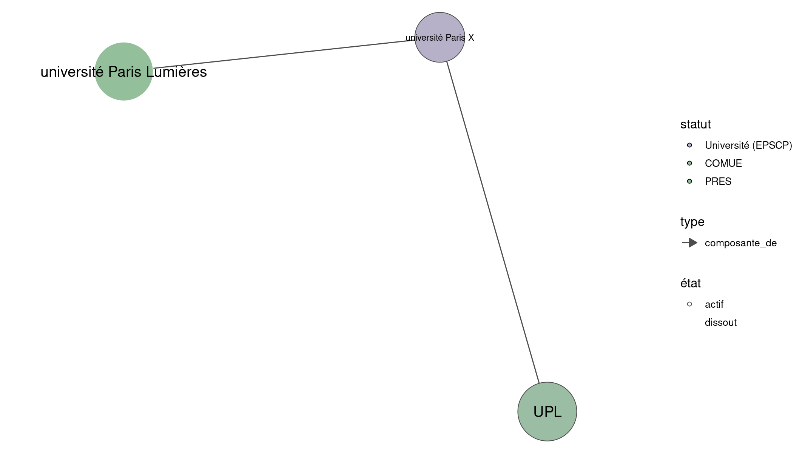 

Avertissements et édition : [logs](plots/etablissements/Q1394262.md) 

### Université Savoie Mont Blanc @Univ_Savoie : Histoire.     Edition des données : https://github.com/cpesr/wikidataESR/blob/master/plots/etablissements/Q2496158.md 


Erreur : les données sont probablement trop partielles.
```
Error in wdesr_ggplot_graph(df, node_size = node_size, label_sizes = label_sizes, : Empty ESR graph: something went wrong with the graph production parameters

``` 

Avertissements et édition : [logs](plots/etablissements/Q2496158.md) 

### Université Savoie Mont Blanc @Univ_Savoie : Composition.     Edition des données : https://github.com/cpesr/wikidataESR/blob/master/plots/etablissements/Q2496158.md 

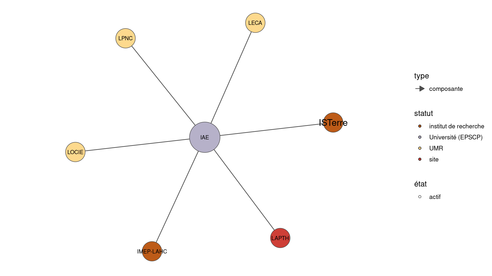 

Avertissements et édition : [logs](plots/etablissements/Q2496158.md) 

### Université Savoie Mont Blanc @Univ_Savoie : Associations.     Edition des données : https://github.com/cpesr/wikidataESR/blob/master/plots/etablissements/Q2496158.md 


Erreur : les données sont probablement trop partielles.
```
Error in wdesr_ggplot_graph(df, node_size = node_size, label_sizes = label_sizes, : Empty ESR graph: something went wrong with the graph production parameters

``` 

Avertissements et édition : [logs](plots/etablissements/Q2496158.md) 

### Le Mans Université @LeMansUniv : Histoire.     Edition des données : https://github.com/cpesr/wikidataESR/blob/master/plots/etablissements/Q834825.md 


Erreur : les données sont probablement trop partielles.
```
Error in wdesr_ggplot_graph(df, node_size = node_size, label_sizes = label_sizes, : Empty ESR graph: something went wrong with the graph production parameters

``` 

Avertissements et édition : [logs](plots/etablissements/Q834825.md) 

### Le Mans Université @LeMansUniv : Composition.     Edition des données : https://github.com/cpesr/wikidataESR/blob/master/plots/etablissements/Q834825.md 

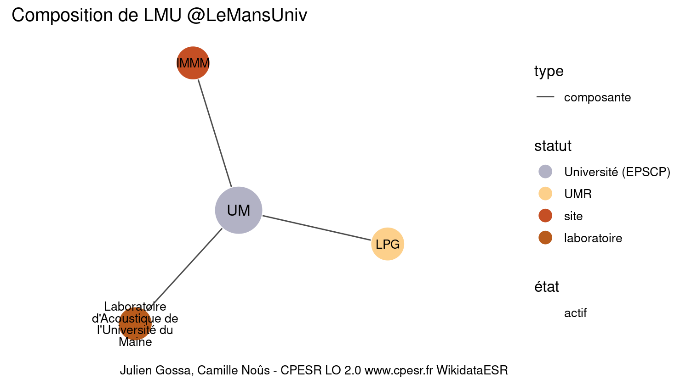 

Avertissements et édition : [logs](plots/etablissements/Q834825.md) 

### Le Mans Université @LeMansUniv : Associations.     Edition des données : https://github.com/cpesr/wikidataESR/blob/master/plots/etablissements/Q834825.md 

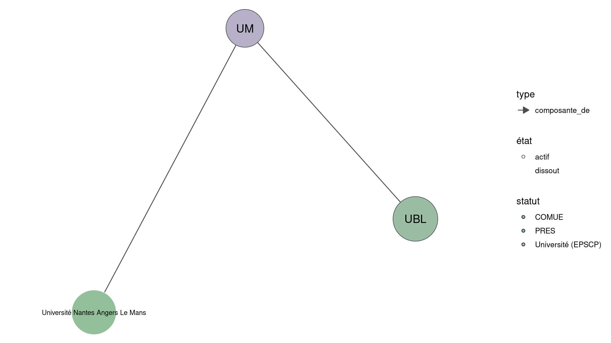 

Avertissements et édition : [logs](plots/etablissements/Q834825.md) 

### UNICAEN @universite_caen : Histoire.     Edition des données : https://github.com/cpesr/wikidataESR/blob/master/plots/etablissements/Q568554.md 


Erreur : les données sont probablement trop partielles.
```
Error in wdesr_ggplot_graph(df, node_size = node_size, label_sizes = label_sizes, : Empty ESR graph: something went wrong with the graph production parameters

``` 

Avertissements et édition : [logs](plots/etablissements/Q568554.md) 

### UNICAEN @universite_caen : Composition.     Edition des données : https://github.com/cpesr/wikidataESR/blob/master/plots/etablissements/Q568554.md 

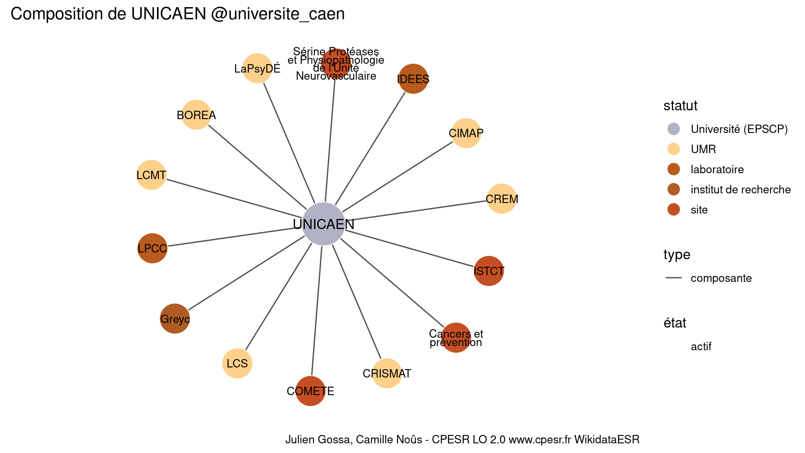 

Avertissements et édition : [logs](plots/etablissements/Q568554.md) 

### UNICAEN @universite_caen : Associations.     Edition des données : https://github.com/cpesr/wikidataESR/blob/master/plots/etablissements/Q568554.md 

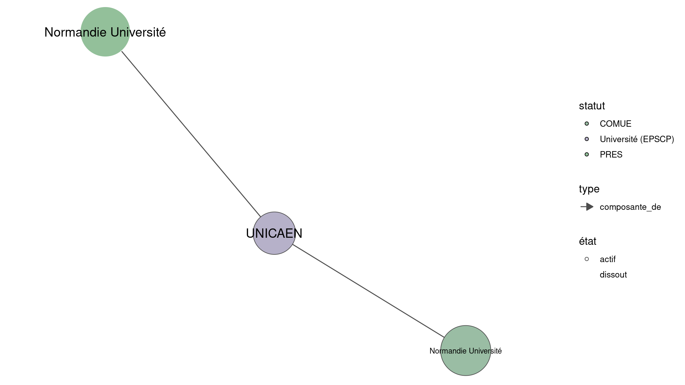 

Avertissements et édition : [logs](plots/etablissements/Q568554.md) 

### Université de Strasbourg @unistra : Histoire.     Edition des données : https://github.com/cpesr/wikidataESR/blob/master/plots/etablissements/Q157575.md 

 

Avertissements et édition : [logs](plots/etablissements/Q157575.md) 

### Université de Strasbourg @unistra : Composition.     Edition des données : https://github.com/cpesr/wikidataESR/blob/master/plots/etablissements/Q157575.md 

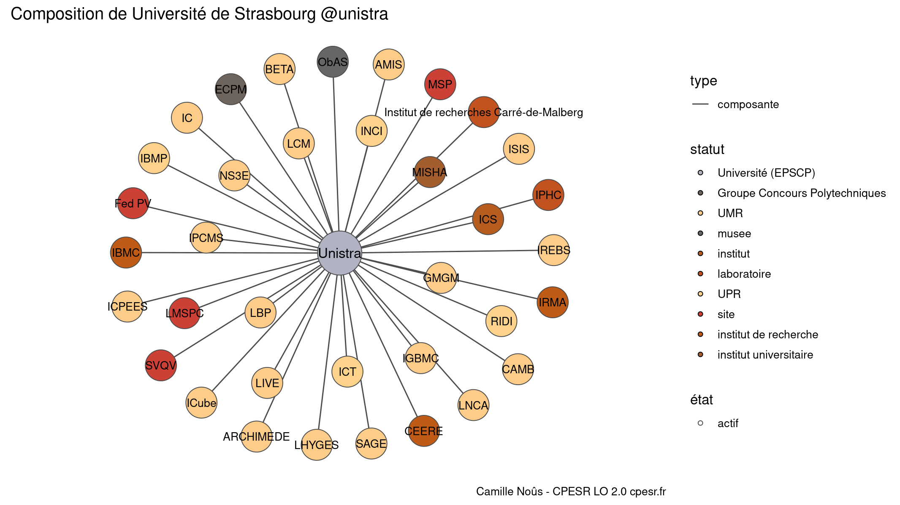 

Avertissements et édition : [logs](plots/etablissements/Q157575.md) 

### Université de Strasbourg @unistra : Associations.     Edition des données : https://github.com/cpesr/wikidataESR/blob/master/plots/etablissements/Q157575.md 

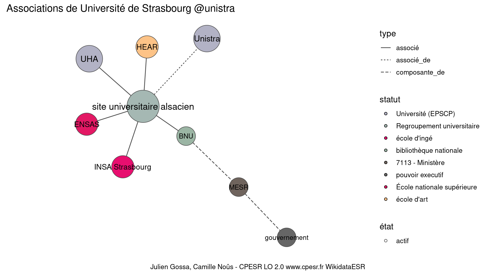 

Avertissements et édition : [logs](plots/etablissements/Q157575.md) 

### Université d'Évry-Val-d'Essonne @UnivEvry : Histoire.     Edition des données : https://github.com/cpesr/wikidataESR/blob/master/plots/etablissements/Q1531014.md 


Erreur : les données sont probablement trop partielles.
```
Error in wdesr_ggplot_graph(df, node_size = node_size, label_sizes = label_sizes, : Empty ESR graph: something went wrong with the graph production parameters

``` 

Avertissements et édition : [logs](plots/etablissements/Q1531014.md) 

### Université d'Évry-Val-d'Essonne @UnivEvry : Composition.     Edition des données : https://github.com/cpesr/wikidataESR/blob/master/plots/etablissements/Q1531014.md 

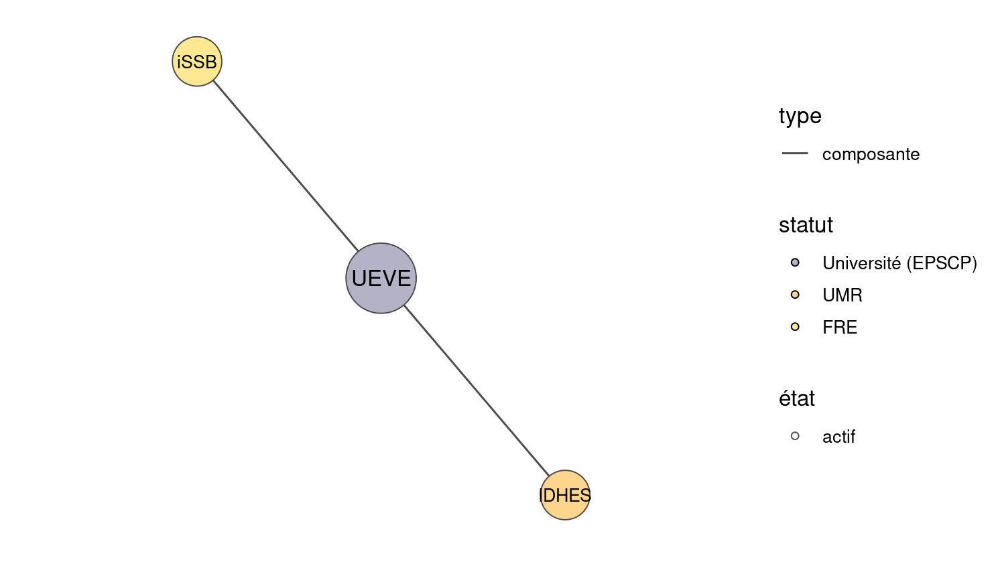 

Avertissements et édition : [logs](plots/etablissements/Q1531014.md) 

### Université d'Évry-Val-d'Essonne @UnivEvry : Associations.     Edition des données : https://github.com/cpesr/wikidataESR/blob/master/plots/etablissements/Q1531014.md 

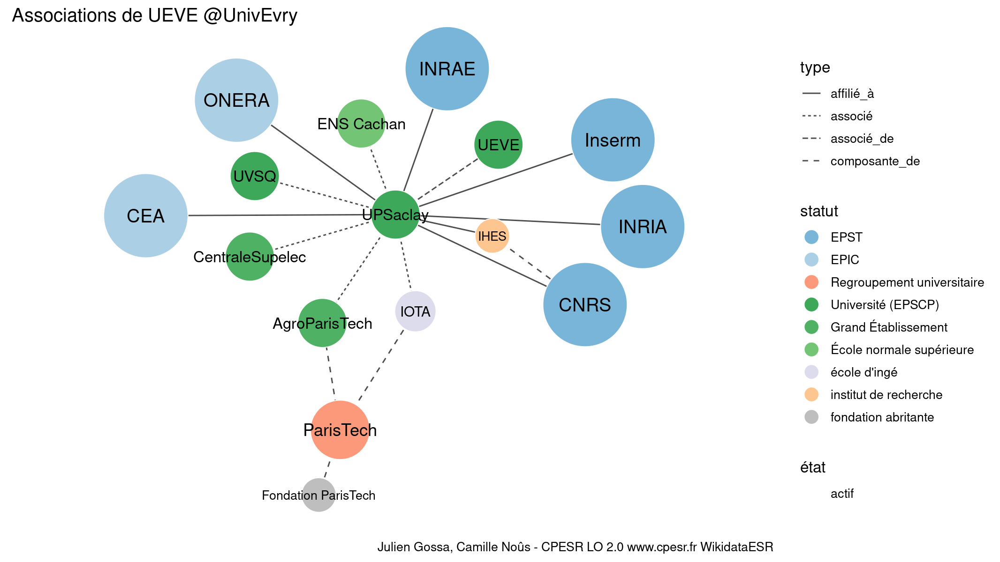 

Avertissements et édition : [logs](plots/etablissements/Q1531014.md) 

### Université Grenoble Alpes @UGrenobleAlpes : Histoire.     Edition des données : https://github.com/cpesr/wikidataESR/blob/master/plots/etablissements/Q945876.md 

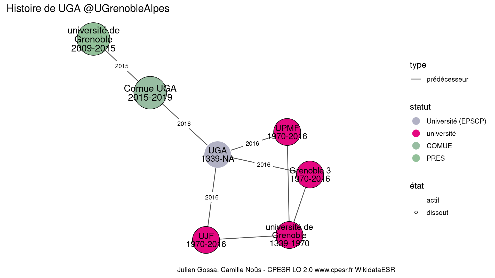 

Avertissements et édition : [logs](plots/etablissements/Q945876.md) 

### Université Grenoble Alpes @UGrenobleAlpes : Composition.     Edition des données : https://github.com/cpesr/wikidataESR/blob/master/plots/etablissements/Q945876.md 

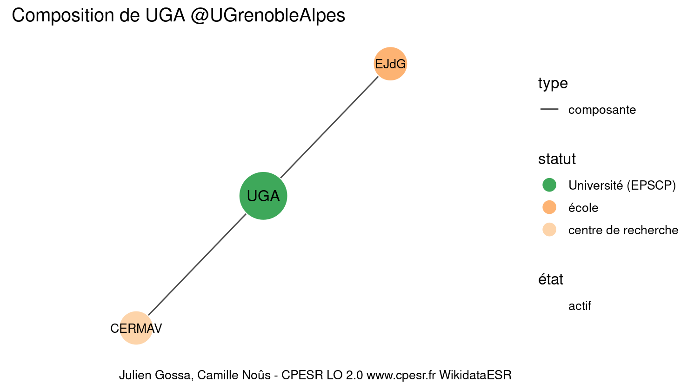 

Avertissements et édition : [logs](plots/etablissements/Q945876.md) 

### Université Grenoble Alpes @UGrenobleAlpes : Associations.     Edition des données : https://github.com/cpesr/wikidataESR/blob/master/plots/etablissements/Q945876.md 


Erreur : les données sont probablement trop partielles.
```
Error in wdesr_ggplot_graph(df, node_size = node_size, label_sizes = label_sizes, : Empty ESR graph: something went wrong with the graph production parameters

``` 

Avertissements et édition : [logs](plots/etablissements/Q945876.md) 

### URCA @universitereims : Histoire.     Edition des données : https://github.com/cpesr/wikidataESR/blob/master/plots/etablissements/Q2496149.md 


Erreur : les données sont probablement trop partielles.
```
Error in wdesr_ggplot_graph(df, node_size = node_size, label_sizes = label_sizes, : Empty ESR graph: something went wrong with the graph production parameters

``` 

Avertissements et édition : [logs](plots/etablissements/Q2496149.md) 

### URCA @universitereims : Composition.     Edition des données : https://github.com/cpesr/wikidataESR/blob/master/plots/etablissements/Q2496149.md 

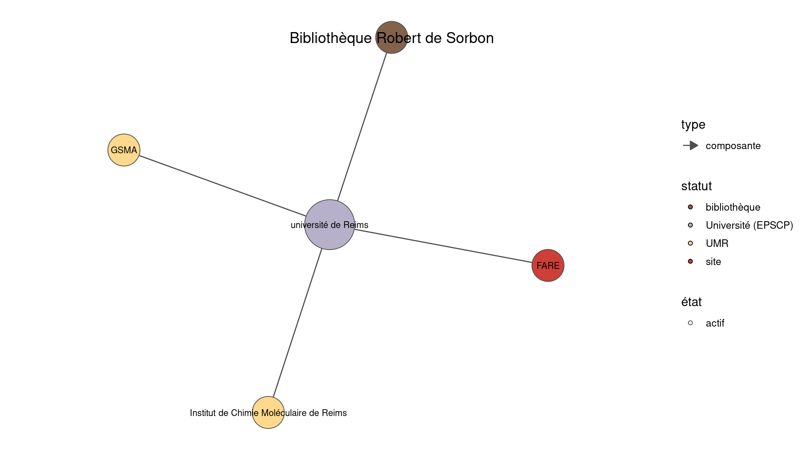 

Avertissements et édition : [logs](plots/etablissements/Q2496149.md) 

### URCA @universitereims : Associations.     Edition des données : https://github.com/cpesr/wikidataESR/blob/master/plots/etablissements/Q2496149.md 

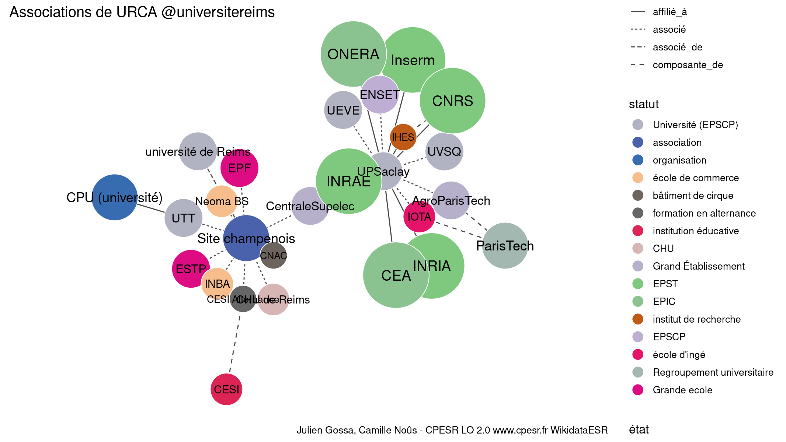 

Avertissements et édition : [logs](plots/etablissements/Q2496149.md) 

### Université de Toulon @univtoulon : Histoire.     Edition des données : https://github.com/cpesr/wikidataESR/blob/master/plots/etablissements/Q1816857.md 


Erreur : les données sont probablement trop partielles.
```
Error in wdesr_ggplot_graph(df, node_size = node_size, label_sizes = label_sizes, : Empty ESR graph: something went wrong with the graph production parameters

``` 

Avertissements et édition : [logs](plots/etablissements/Q1816857.md) 

### Université de Toulon @univtoulon : Composition.     Edition des données : https://github.com/cpesr/wikidataESR/blob/master/plots/etablissements/Q1816857.md 

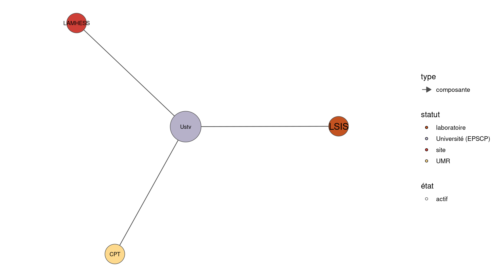 

Avertissements et édition : [logs](plots/etablissements/Q1816857.md) 

### Université de Toulon @univtoulon : Associations.     Edition des données : https://github.com/cpesr/wikidataESR/blob/master/plots/etablissements/Q1816857.md 

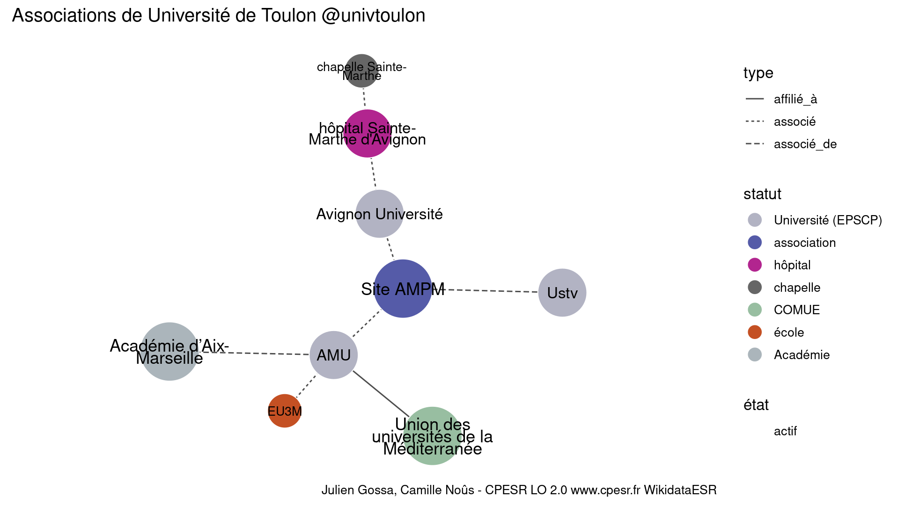 

Avertissements et édition : [logs](plots/etablissements/Q1816857.md) 

### Université de Guyane @univguyane : Histoire.     Edition des données : https://github.com/cpesr/wikidataESR/blob/master/plots/etablissements/Q16682067.md 


Erreur : les données sont probablement trop partielles.
```
Error in wdesr_ggplot_graph(df, node_size = node_size, label_sizes = label_sizes, : Empty ESR graph: something went wrong with the graph production parameters

``` 

Avertissements et édition : [logs](plots/etablissements/Q16682067.md) 

### Université de Guyane @univguyane : Composition.     Edition des données : https://github.com/cpesr/wikidataESR/blob/master/plots/etablissements/Q16682067.md 

 

Avertissements et édition : [logs](plots/etablissements/Q16682067.md) 

### Université de Guyane @univguyane : Associations.     Edition des données : https://github.com/cpesr/wikidataESR/blob/master/plots/etablissements/Q16682067.md 


Erreur : les données sont probablement trop partielles.
```
Error in wdesr_ggplot_graph(df, node_size = node_size, label_sizes = label_sizes, : Empty ESR graph: something went wrong with the graph production parameters

``` 

Avertissements et édition : [logs](plots/etablissements/Q16682067.md) 

### UVSQ @uvsq : Histoire.     Edition des données : https://github.com/cpesr/wikidataESR/blob/master/plots/etablissements/Q186638.md 


Erreur : les données sont probablement trop partielles.
```
Error in wdesr_ggplot_graph(df, node_size = node_size, label_sizes = label_sizes, : Empty ESR graph: something went wrong with the graph production parameters

``` 

Avertissements et édition : [logs](plots/etablissements/Q186638.md) 

### UVSQ @uvsq : Composition.     Edition des données : https://github.com/cpesr/wikidataESR/blob/master/plots/etablissements/Q186638.md 

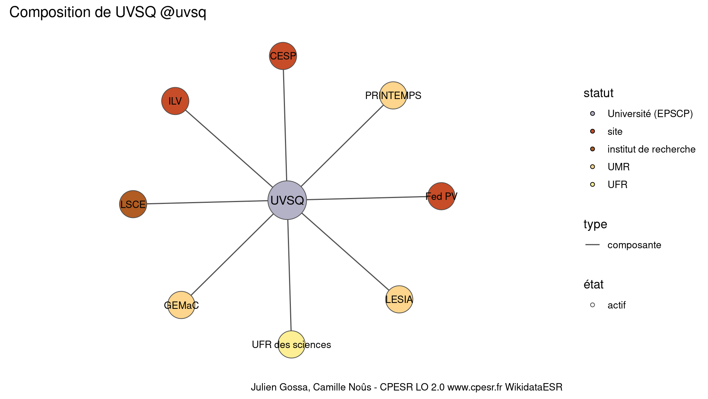 

Avertissements et édition : [logs](plots/etablissements/Q186638.md) 

### UVSQ @uvsq : Associations.     Edition des données : https://github.com/cpesr/wikidataESR/blob/master/plots/etablissements/Q186638.md 

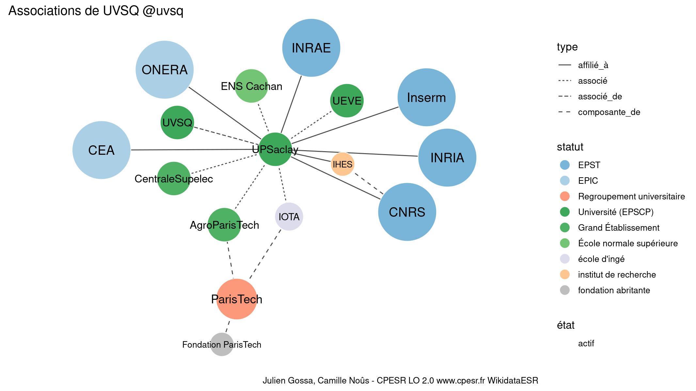 

Avertissements et édition : [logs](plots/etablissements/Q186638.md) 

### ULCO @ULCO_Univ : Histoire.     Edition des données : https://github.com/cpesr/wikidataESR/blob/master/plots/etablissements/Q3551755.md 


Erreur : les données sont probablement trop partielles.
```
Error in wdesr_ggplot_graph(df, node_size = node_size, label_sizes = label_sizes, : Empty ESR graph: something went wrong with the graph production parameters

``` 

Avertissements et édition : [logs](plots/etablissements/Q3551755.md) 

### ULCO @ULCO_Univ : Composition.     Edition des données : https://github.com/cpesr/wikidataESR/blob/master/plots/etablissements/Q3551755.md 

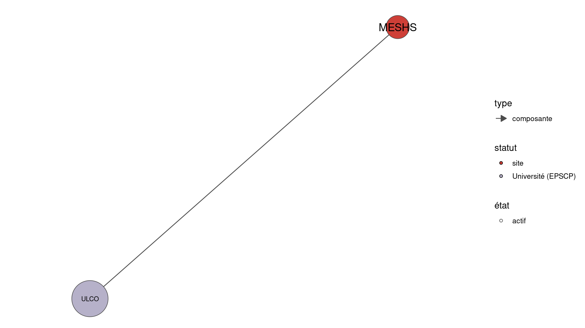 

Avertissements et édition : [logs](plots/etablissements/Q3551755.md) 

### ULCO @ULCO_Univ : Associations.     Edition des données : https://github.com/cpesr/wikidataESR/blob/master/plots/etablissements/Q3551755.md 


Erreur : les données sont probablement trop partielles.
```
Error in wdesr_ggplot_graph(df, node_size = node_size, label_sizes = label_sizes, : Empty ESR graph: something went wrong with the graph production parameters

``` 

Avertissements et édition : [logs](plots/etablissements/Q3551755.md) 

### UFC @fc_univ : Histoire.     Edition des données : https://github.com/cpesr/wikidataESR/blob/master/plots/etablissements/Q829449.md 


Erreur : les données sont probablement trop partielles.
```
Error in wdesr_ggplot_graph(df, node_size = node_size, label_sizes = label_sizes, : Empty ESR graph: something went wrong with the graph production parameters

``` 

Avertissements et édition : [logs](plots/etablissements/Q829449.md) 

### UFC @fc_univ : Composition.     Edition des données : https://github.com/cpesr/wikidataESR/blob/master/plots/etablissements/Q829449.md 

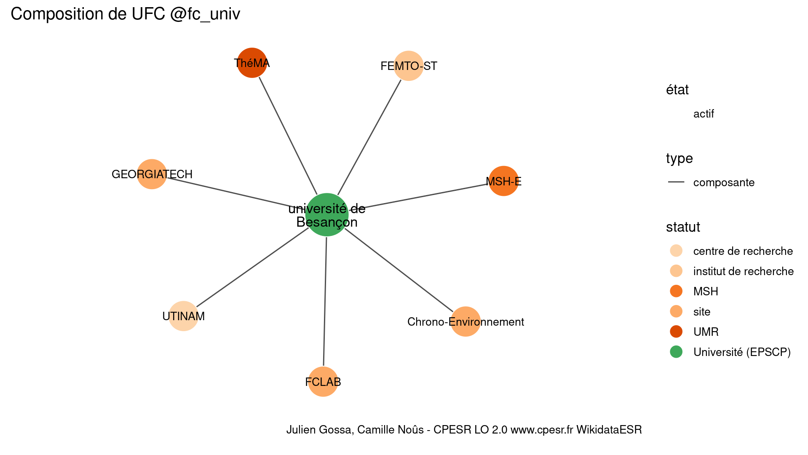 

Avertissements et édition : [logs](plots/etablissements/Q829449.md) 

### UFC @fc_univ : Associations.     Edition des données : https://github.com/cpesr/wikidataESR/blob/master/plots/etablissements/Q829449.md 

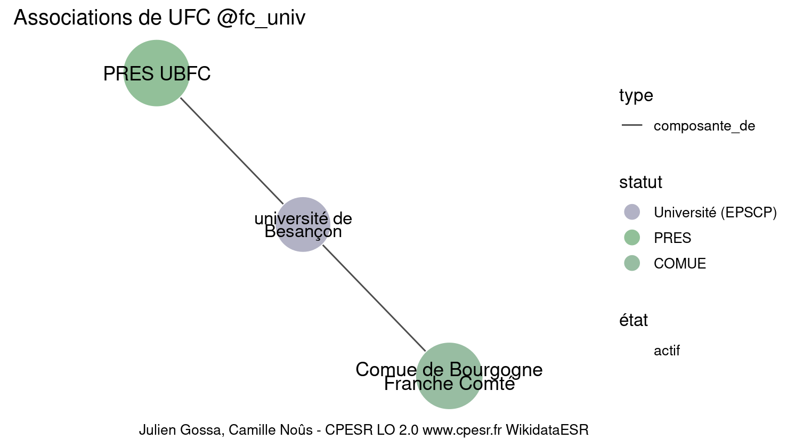 

Avertissements et édition : [logs](plots/etablissements/Q829449.md) 

### Université Sorbonne Nouvelle - Paris 3 @SorbonneParis3 : Histoire.     Edition des données : https://github.com/cpesr/wikidataESR/blob/master/plots/etablissements/Q571293.md 

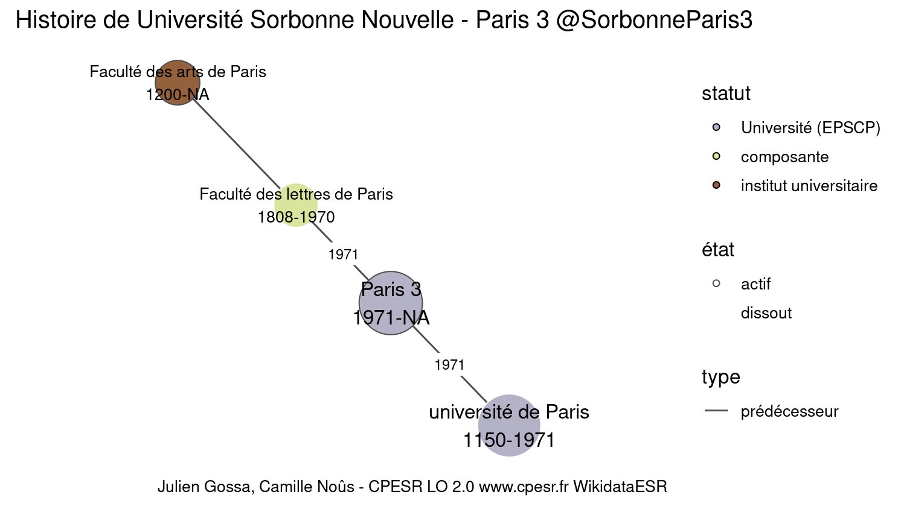 

Avertissements et édition : [logs](plots/etablissements/Q571293.md) 

### Université Sorbonne Nouvelle - Paris 3 @SorbonneParis3 : Composition.     Edition des données : https://github.com/cpesr/wikidataESR/blob/master/plots/etablissements/Q571293.md 

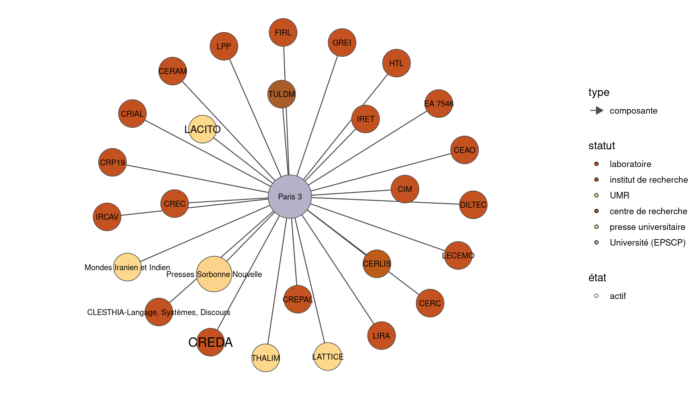 

Avertissements et édition : [logs](plots/etablissements/Q571293.md) 

### Université Sorbonne Nouvelle - Paris 3 @SorbonneParis3 : Associations.     Edition des données : https://github.com/cpesr/wikidataESR/blob/master/plots/etablissements/Q571293.md 


Erreur : les données sont probablement trop partielles.
```
Error in wdesr_ggplot_graph(df, node_size = node_size, label_sizes = label_sizes, : Empty ESR graph: something went wrong with the graph production parameters

``` 

Avertissements et édition : [logs](plots/etablissements/Q571293.md) 

### UT1 @UT1Capitole : Histoire.     Edition des données : https://github.com/cpesr/wikidataESR/blob/master/plots/etablissements/Q590201.md 

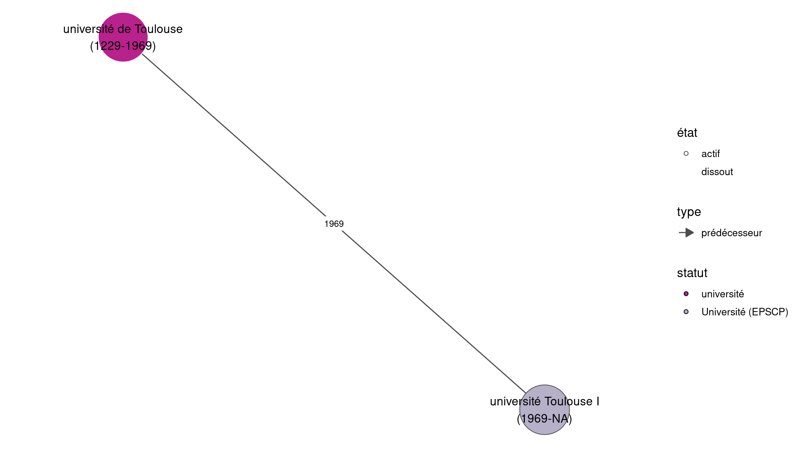 

Avertissements et édition : [logs](plots/etablissements/Q590201.md) 

### UT1 @UT1Capitole : Composition.     Edition des données : https://github.com/cpesr/wikidataESR/blob/master/plots/etablissements/Q590201.md 

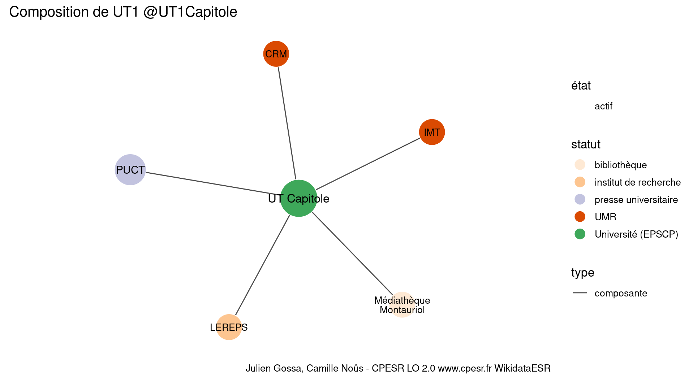 

Avertissements et édition : [logs](plots/etablissements/Q590201.md) 

### UT1 @UT1Capitole : Associations.     Edition des données : https://github.com/cpesr/wikidataESR/blob/master/plots/etablissements/Q590201.md 

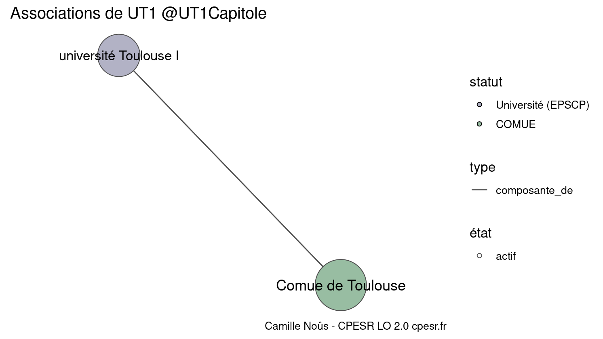 

Avertissements et édition : [logs](plots/etablissements/Q590201.md) 

### Université de Picardie Jules-Verne @UPJV_Univ : Histoire.     Edition des données : https://github.com/cpesr/wikidataESR/blob/master/plots/etablissements/Q947747.md 


Erreur : les données sont probablement trop partielles.
```
Error in wdesr_ggplot_graph(df, node_size = node_size, label_sizes = label_sizes, : Empty ESR graph: something went wrong with the graph production parameters

``` 

Avertissements et édition : [logs](plots/etablissements/Q947747.md) 

### Université de Picardie Jules-Verne @UPJV_Univ : Composition.     Edition des données : https://github.com/cpesr/wikidataESR/blob/master/plots/etablissements/Q947747.md 


Erreur : les données sont probablement trop partielles.
```
Error in wdesr_ggplot_graph(df, node_size = node_size, label_sizes = label_sizes, : Empty ESR graph: something went wrong with the graph production parameters

``` 

Avertissements et édition : [logs](plots/etablissements/Q947747.md) 

### Université de Picardie Jules-Verne @UPJV_Univ : Associations.     Edition des données : https://github.com/cpesr/wikidataESR/blob/master/plots/etablissements/Q947747.md 


Erreur : les données sont probablement trop partielles.
```
Error in wdesr_ggplot_graph(df, node_size = node_size, label_sizes = label_sizes, : Empty ESR graph: something went wrong with the graph production parameters

``` 

Avertissements et édition : [logs](plots/etablissements/Q947747.md) 

### Université PSL @psl_univ : Histoire.     Edition des données : https://github.com/cpesr/wikidataESR/blob/master/plots/etablissements/Q1163431.md 

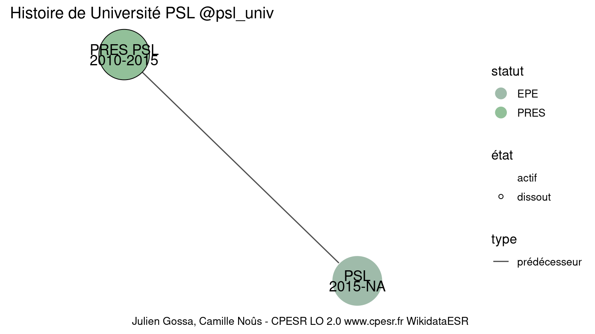 

Avertissements et édition : [logs](plots/etablissements/Q1163431.md) 

### Université PSL @psl_univ : Composition.     Edition des données : https://github.com/cpesr/wikidataESR/blob/master/plots/etablissements/Q1163431.md 

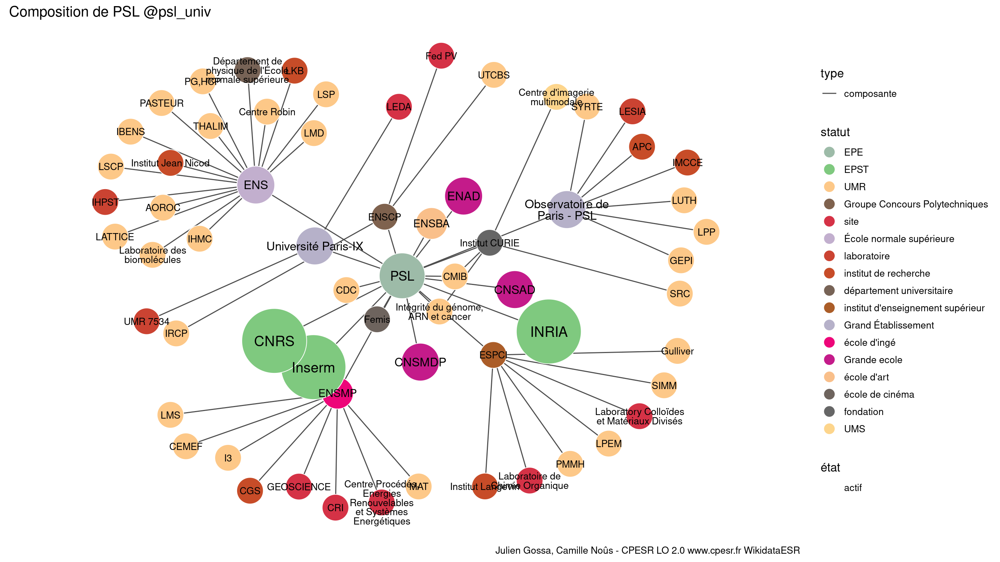 

Avertissements et édition : [logs](plots/etablissements/Q1163431.md) 

### Université PSL @psl_univ : Associations.     Edition des données : https://github.com/cpesr/wikidataESR/blob/master/plots/etablissements/Q1163431.md 


Erreur : les données sont probablement trop partielles.
```
Error in wdesr_ggplot_graph(df, node_size = node_size, label_sizes = label_sizes, : Empty ESR graph: something went wrong with the graph production parameters

``` 

Avertissements et édition : [logs](plots/etablissements/Q1163431.md) 

### Université Paris-Est Créteil @UPECactus : Histoire.     Edition des données : https://github.com/cpesr/wikidataESR/blob/master/plots/etablissements/Q980688.md 

 

Avertissements et édition : [logs](plots/etablissements/Q980688.md) 

### Université Paris-Est Créteil @UPECactus : Composition.     Edition des données : https://github.com/cpesr/wikidataESR/blob/master/plots/etablissements/Q980688.md 

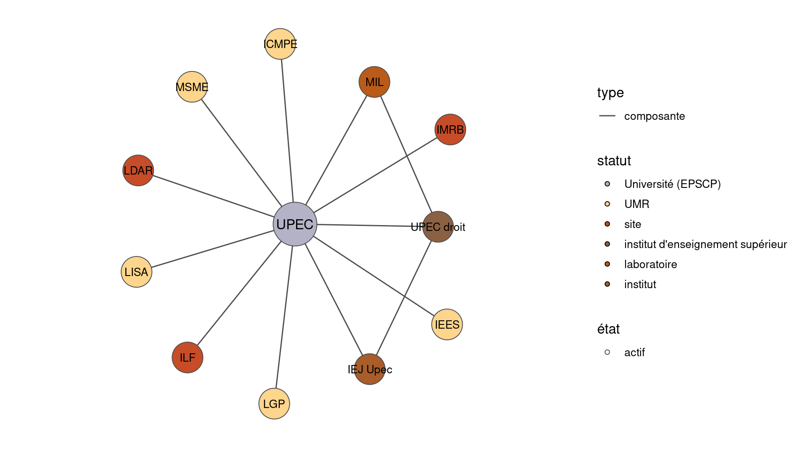 

Avertissements et édition : [logs](plots/etablissements/Q980688.md) 

### Université Paris-Est Créteil @UPECactus : Associations.     Edition des données : https://github.com/cpesr/wikidataESR/blob/master/plots/etablissements/Q980688.md 

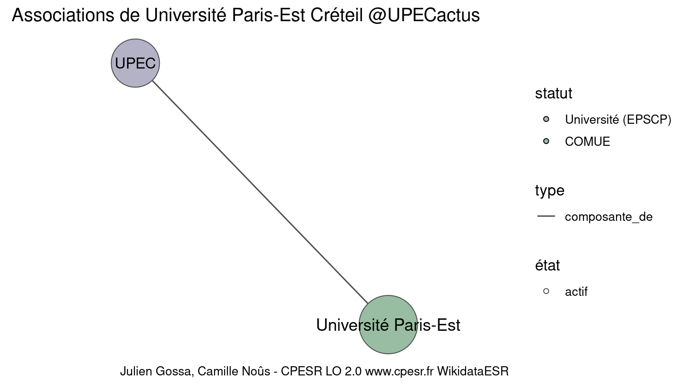 

Avertissements et édition : [logs](plots/etablissements/Q980688.md) 

### UNÎMES @unimesfr : Histoire.     Edition des données : https://github.com/cpesr/wikidataESR/blob/master/plots/etablissements/Q2496121.md 


Erreur : les données sont probablement trop partielles.
```
Error in wdesr_ggplot_graph(df, node_size = node_size, label_sizes = label_sizes, : Empty ESR graph: something went wrong with the graph production parameters

``` 

Avertissements et édition : [logs](plots/etablissements/Q2496121.md) 

### UNÎMES @unimesfr : Composition.     Edition des données : https://github.com/cpesr/wikidataESR/blob/master/plots/etablissements/Q2496121.md 

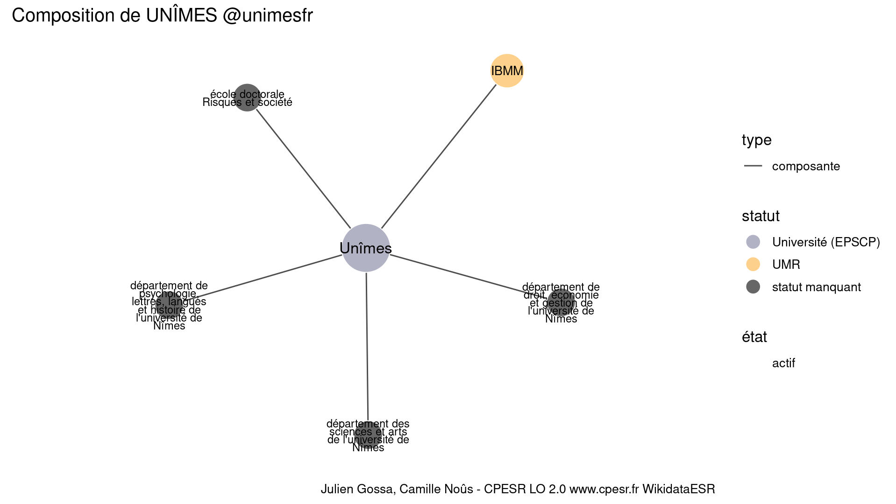 

Avertissements et édition : [logs](plots/etablissements/Q2496121.md) 

### UNÎMES @unimesfr : Associations.     Edition des données : https://github.com/cpesr/wikidataESR/blob/master/plots/etablissements/Q2496121.md 

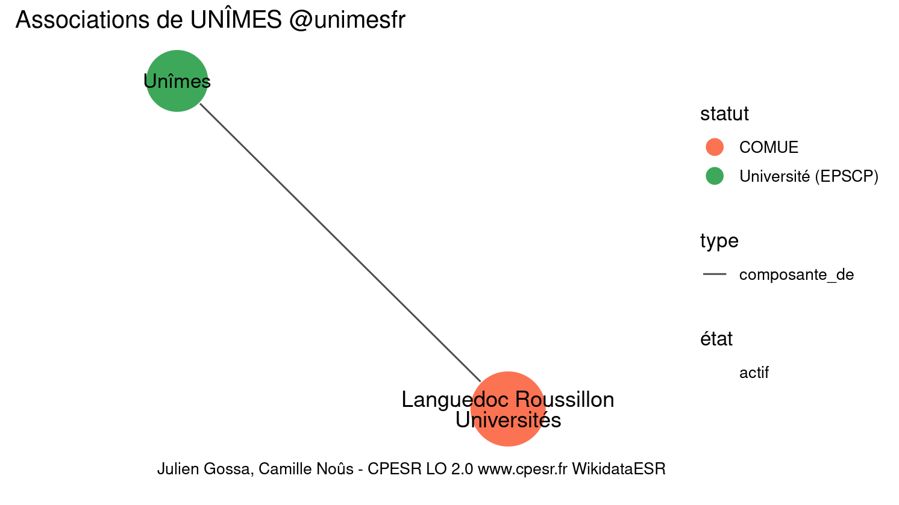 

Avertissements et édition : [logs](plots/etablissements/Q2496121.md) 

### Université Sorbonne Paris Nord @univ_spn : Histoire.     Edition des données : https://github.com/cpesr/wikidataESR/blob/master/plots/etablissements/Q1780212.md 

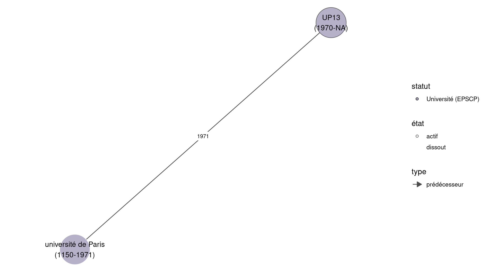 

Avertissements et édition : [logs](plots/etablissements/Q1780212.md) 

### Université Sorbonne Paris Nord @univ_spn : Composition.     Edition des données : https://github.com/cpesr/wikidataESR/blob/master/plots/etablissements/Q1780212.md 

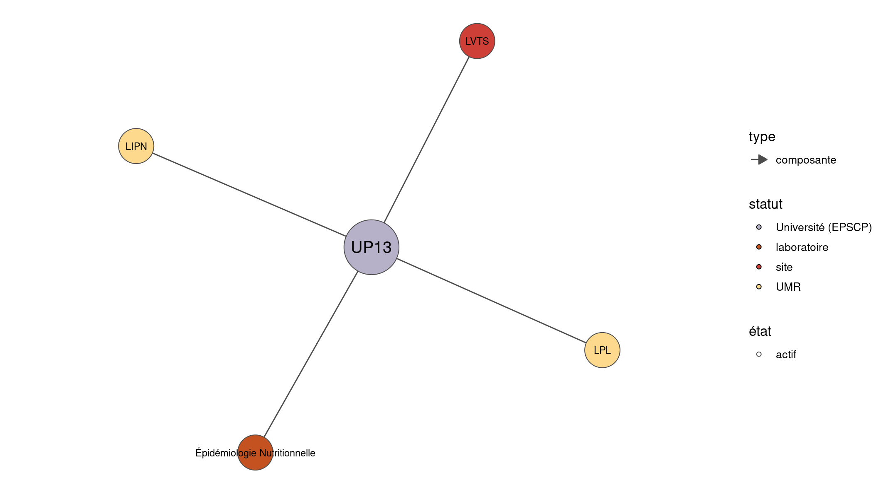 

Avertissements et édition : [logs](plots/etablissements/Q1780212.md) 

### Université Sorbonne Paris Nord @univ_spn : Associations.     Edition des données : https://github.com/cpesr/wikidataESR/blob/master/plots/etablissements/Q1780212.md 


Erreur : les données sont probablement trop partielles.
```
Error in wdesr_ggplot_graph(df, node_size = node_size, label_sizes = label_sizes, : Empty ESR graph: something went wrong with the graph production parameters

``` 

Avertissements et édition : [logs](plots/etablissements/Q1780212.md) 

### Université Claude Bernard - Lyon 1 @UnivLyon1 : Histoire.     Edition des données : https://github.com/cpesr/wikidataESR/blob/master/plots/etablissements/Q4032.md 

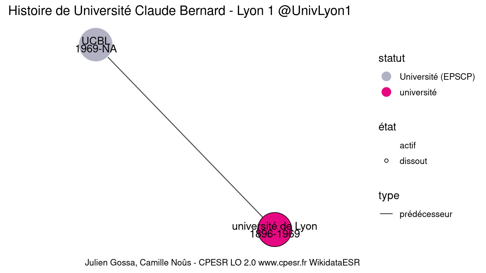 

Avertissements et édition : [logs](plots/etablissements/Q4032.md) 

### Université Claude Bernard - Lyon 1 @UnivLyon1 : Composition.     Edition des données : https://github.com/cpesr/wikidataESR/blob/master/plots/etablissements/Q4032.md 

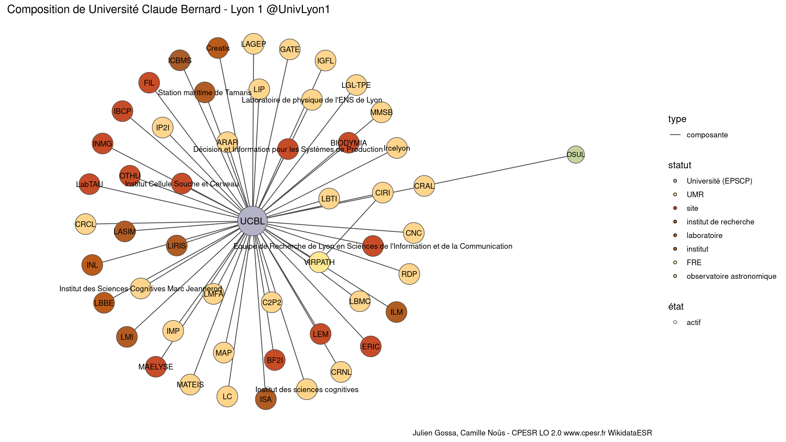 

Avertissements et édition : [logs](plots/etablissements/Q4032.md) 

### Université Claude Bernard - Lyon 1 @UnivLyon1 : Associations.     Edition des données : https://github.com/cpesr/wikidataESR/blob/master/plots/etablissements/Q4032.md 

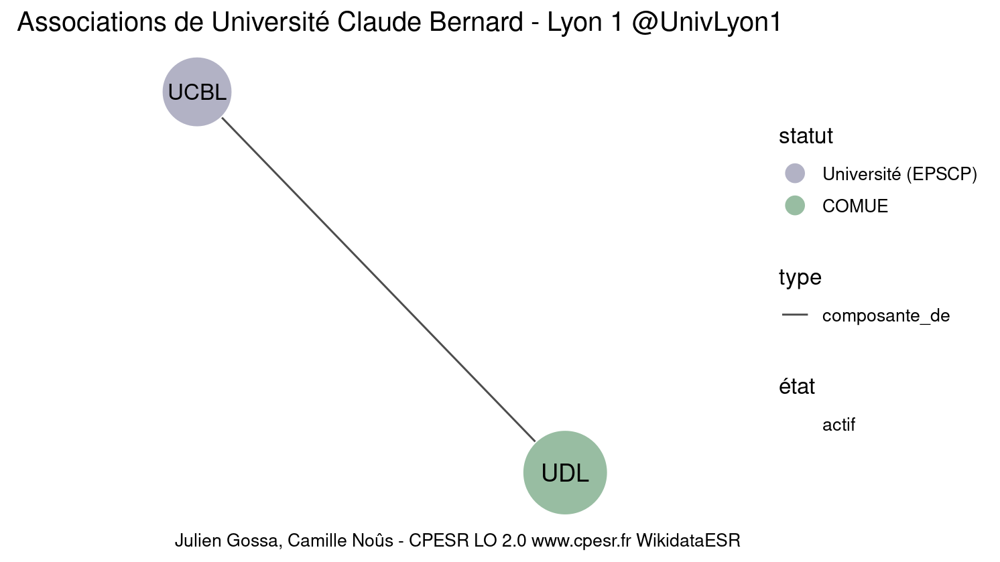 

Avertissements et édition : [logs](plots/etablissements/Q4032.md) 

### Université de Corse Pasquale Paoli @univcorse : Histoire.     Edition des données : https://github.com/cpesr/wikidataESR/blob/master/plots/etablissements/Q335841.md 


Erreur : les données sont probablement trop partielles.
```
Error in wdesr_ggplot_graph(df, node_size = node_size, label_sizes = label_sizes, : Empty ESR graph: something went wrong with the graph production parameters

``` 

Avertissements et édition : [logs](plots/etablissements/Q335841.md) 

### Université de Corse Pasquale Paoli @univcorse : Composition.     Edition des données : https://github.com/cpesr/wikidataESR/blob/master/plots/etablissements/Q335841.md 


Erreur : les données sont probablement trop partielles.
```
Error in wdesr_ggplot_graph(df, node_size = node_size, label_sizes = label_sizes, : Empty ESR graph: something went wrong with the graph production parameters

``` 

Avertissements et édition : [logs](plots/etablissements/Q335841.md) 

### Université de Corse Pasquale Paoli @univcorse : Associations.     Edition des données : https://github.com/cpesr/wikidataESR/blob/master/plots/etablissements/Q335841.md 


Erreur : les données sont probablement trop partielles.
```
Error in wdesr_ggplot_graph(df, node_size = node_size, label_sizes = label_sizes, : Empty ESR graph: something went wrong with the graph production parameters

``` 

Avertissements et édition : [logs](plots/etablissements/Q335841.md) 

### Université de Perpignan Via Domitia @upvd1 : Histoire.     Edition des données : https://github.com/cpesr/wikidataESR/blob/master/plots/etablissements/Q304872.md 

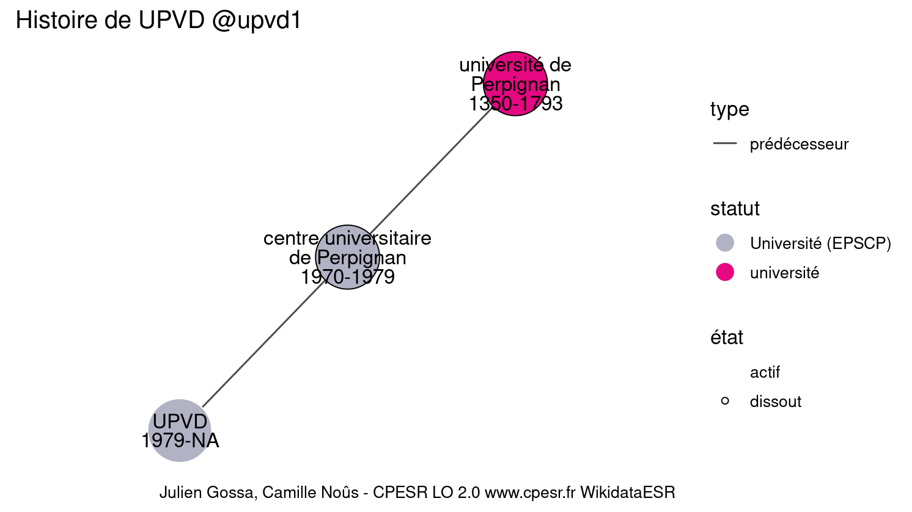 

Avertissements et édition : [logs](plots/etablissements/Q304872.md) 

### Université de Perpignan Via Domitia @upvd1 : Composition.     Edition des données : https://github.com/cpesr/wikidataESR/blob/master/plots/etablissements/Q304872.md 

 

Avertissements et édition : [logs](plots/etablissements/Q304872.md) 

### Université de Perpignan Via Domitia @upvd1 : Associations.     Edition des données : https://github.com/cpesr/wikidataESR/blob/master/plots/etablissements/Q304872.md 

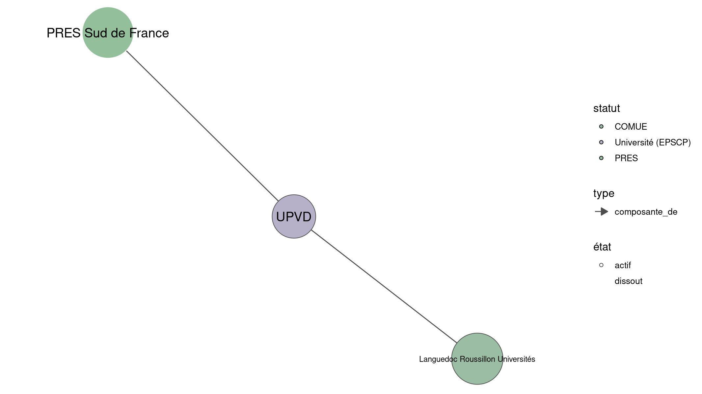 

Avertissements et édition : [logs](plots/etablissements/Q304872.md) 

### Université Paris-Saclay @UnivParisSaclay : Histoire.     Edition des données : https://github.com/cpesr/wikidataESR/blob/master/plots/etablissements/Q13531686.md 

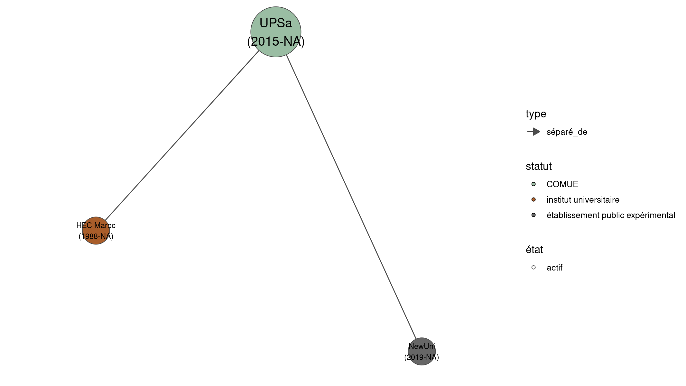 

Avertissements et édition : [logs](plots/etablissements/Q13531686.md) 

### Université Paris-Saclay @UnivParisSaclay : Composition.     Edition des données : https://github.com/cpesr/wikidataESR/blob/master/plots/etablissements/Q13531686.md 

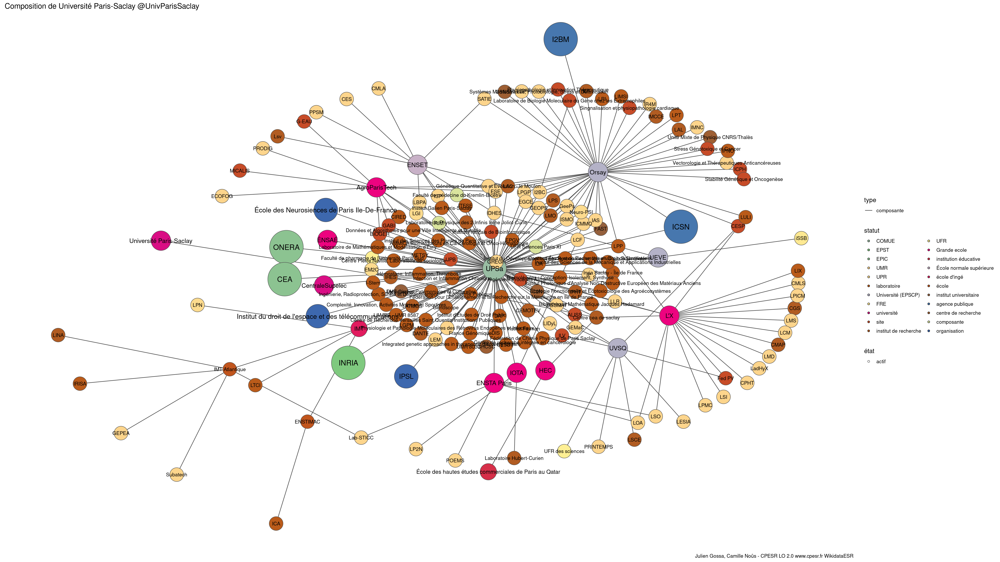 

Avertissements et édition : [logs](plots/etablissements/Q13531686.md) 

### Université Paris-Saclay @UnivParisSaclay : Associations.     Edition des données : https://github.com/cpesr/wikidataESR/blob/master/plots/etablissements/Q13531686.md 

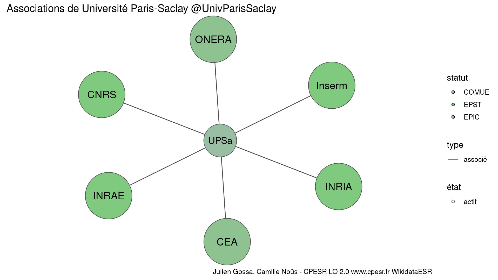 

Avertissements et édition : [logs](plots/etablissements/Q13531686.md) 

### Université de la Nouvelle-Calédonie @unc_nc : Histoire.     Edition des données : https://github.com/cpesr/wikidataESR/blob/master/plots/etablissements/Q734332.md 


Erreur : les données sont probablement trop partielles.
```
Error in wdesr_ggplot_graph(df, node_size = node_size, label_sizes = label_sizes, : Empty ESR graph: something went wrong with the graph production parameters

``` 

Avertissements et édition : [logs](plots/etablissements/Q734332.md) 

### Université de la Nouvelle-Calédonie @unc_nc : Composition.     Edition des données : https://github.com/cpesr/wikidataESR/blob/master/plots/etablissements/Q734332.md 

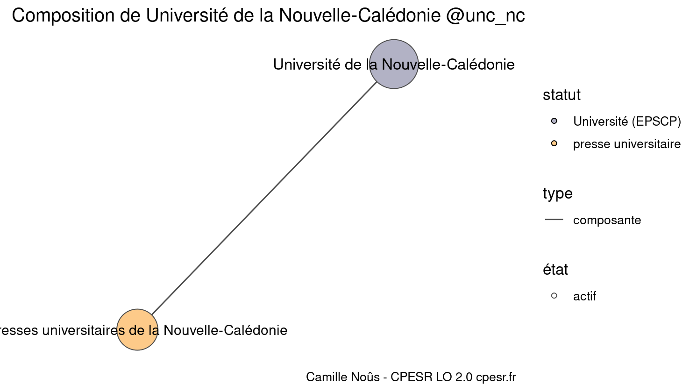 

Avertissements et édition : [logs](plots/etablissements/Q734332.md) 

### Université de la Nouvelle-Calédonie @unc_nc : Associations.     Edition des données : https://github.com/cpesr/wikidataESR/blob/master/plots/etablissements/Q734332.md 


Erreur : les données sont probablement trop partielles.
```
Error in wdesr_ggplot_graph(df, node_size = node_size, label_sizes = label_sizes, : Empty ESR graph: something went wrong with the graph production parameters

``` 

Avertissements et édition : [logs](plots/etablissements/Q734332.md) 

### Université de Limoges @unilim : Histoire.     Edition des données : https://github.com/cpesr/wikidataESR/blob/master/plots/etablissements/Q2661290.md 


Erreur : les données sont probablement trop partielles.
```
Error in wdesr_ggplot_graph(df, node_size = node_size, label_sizes = label_sizes, : Empty ESR graph: something went wrong with the graph production parameters

``` 

Avertissements et édition : [logs](plots/etablissements/Q2661290.md) 

### Université de Limoges @unilim : Composition.     Edition des données : https://github.com/cpesr/wikidataESR/blob/master/plots/etablissements/Q2661290.md 

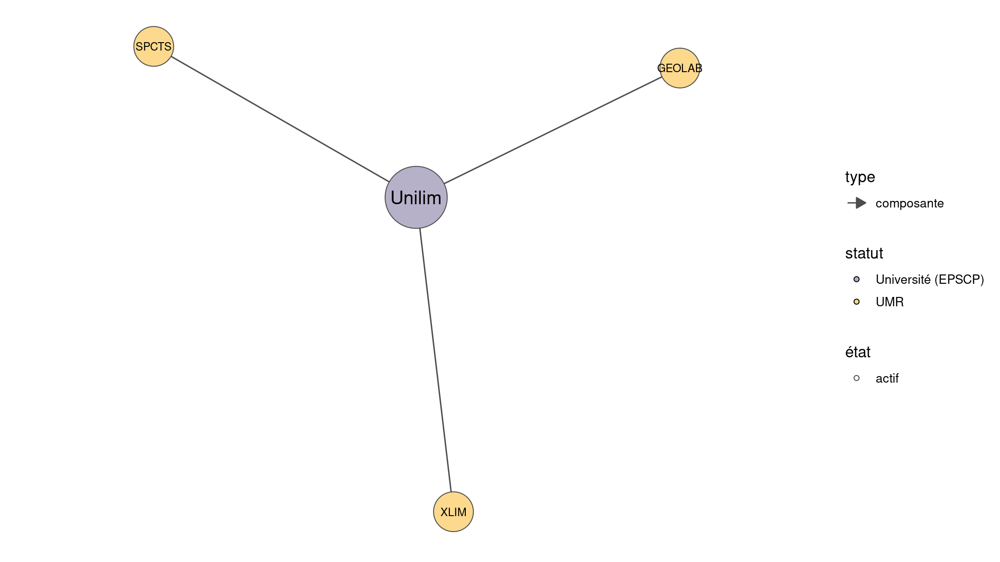 

Avertissements et édition : [logs](plots/etablissements/Q2661290.md) 

### Université de Limoges @unilim : Associations.     Edition des données : https://github.com/cpesr/wikidataESR/blob/master/plots/etablissements/Q2661290.md 

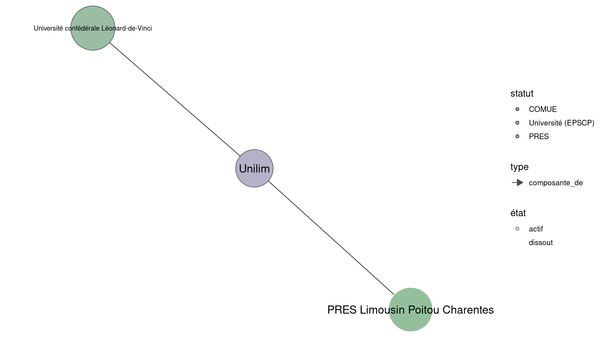 

Avertissements et édition : [logs](plots/etablissements/Q2661290.md) 

### Université de Tours @UnivTours : Histoire.     Edition des données : https://github.com/cpesr/wikidataESR/blob/master/plots/etablissements/Q494335.md 

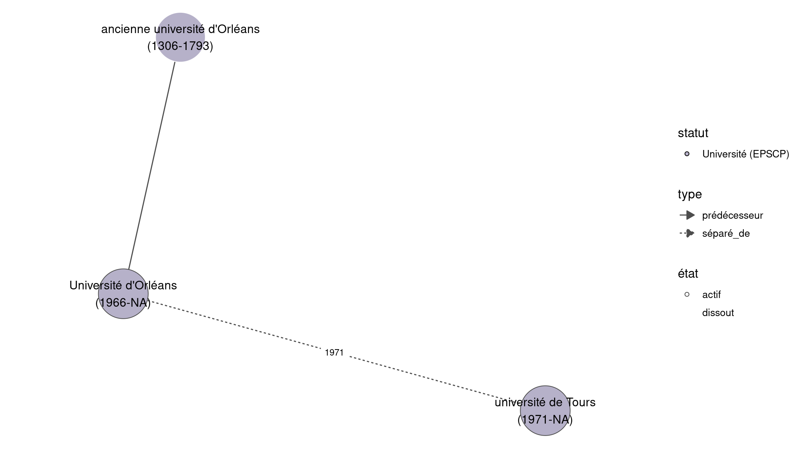 

Avertissements et édition : [logs](plots/etablissements/Q494335.md) 

### Université de Tours @UnivTours : Composition.     Edition des données : https://github.com/cpesr/wikidataESR/blob/master/plots/etablissements/Q494335.md 

 

Avertissements et édition : [logs](plots/etablissements/Q494335.md) 

### Université de Tours @UnivTours : Associations.     Edition des données : https://github.com/cpesr/wikidataESR/blob/master/plots/etablissements/Q494335.md 

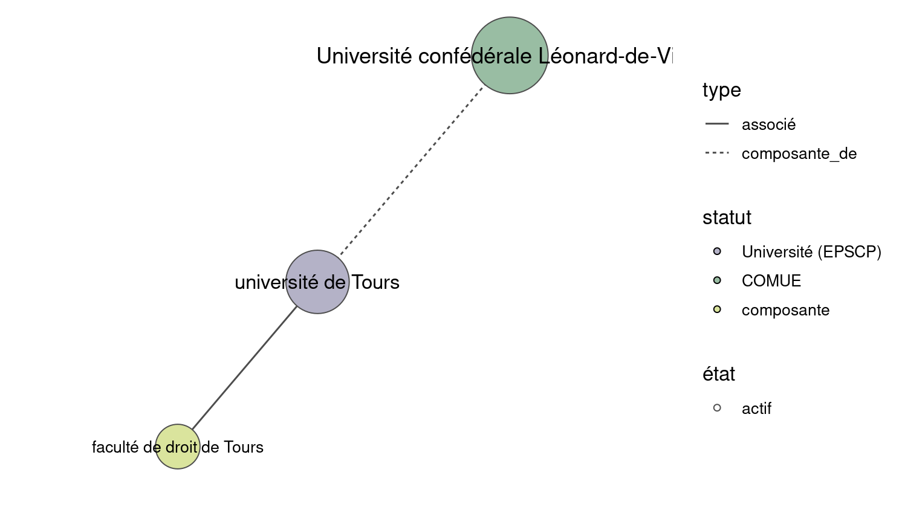 

Avertissements et édition : [logs](plots/etablissements/Q494335.md) 

### Université des Antilles @UnivAntilles : Histoire.     Edition des données : https://github.com/cpesr/wikidataESR/blob/master/plots/etablissements/Q16682075.md 


Erreur : les données sont probablement trop partielles.
```
Error in wdesr_ggplot_graph(df, node_size = node_size, label_sizes = label_sizes, : Empty ESR graph: something went wrong with the graph production parameters

``` 

Avertissements et édition : [logs](plots/etablissements/Q16682075.md) 

### Université des Antilles @UnivAntilles : Composition.     Edition des données : https://github.com/cpesr/wikidataESR/blob/master/plots/etablissements/Q16682075.md 


Erreur : les données sont probablement trop partielles.
```
Error in wdesr_ggplot_graph(df, node_size = node_size, label_sizes = label_sizes, : Empty ESR graph: something went wrong with the graph production parameters

``` 

Avertissements et édition : [logs](plots/etablissements/Q16682075.md) 

### Université des Antilles @UnivAntilles : Associations.     Edition des données : https://github.com/cpesr/wikidataESR/blob/master/plots/etablissements/Q16682075.md 


Erreur : les données sont probablement trop partielles.
```
Error in wdesr_ggplot_graph(df, node_size = node_size, label_sizes = label_sizes, : Empty ESR graph: something went wrong with the graph production parameters

``` 

Avertissements et édition : [logs](plots/etablissements/Q16682075.md) 

### Université Lumière - Lyon 2 @univ_lyon2 : Histoire.     Edition des données : https://github.com/cpesr/wikidataESR/blob/master/plots/etablissements/Q4041.md 

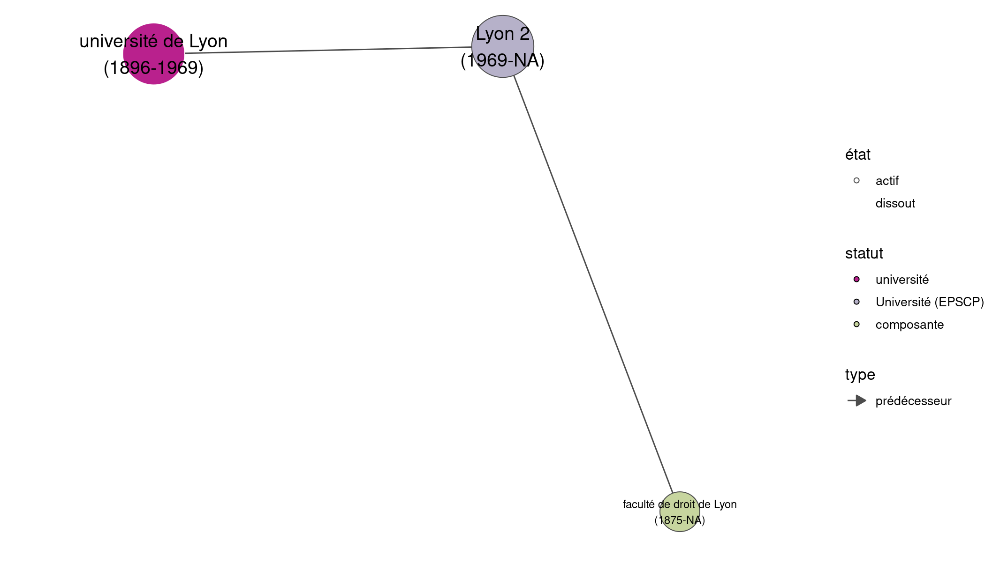 

Avertissements et édition : [logs](plots/etablissements/Q4041.md) 

### Université Lumière - Lyon 2 @univ_lyon2 : Composition.     Edition des données : https://github.com/cpesr/wikidataESR/blob/master/plots/etablissements/Q4041.md 

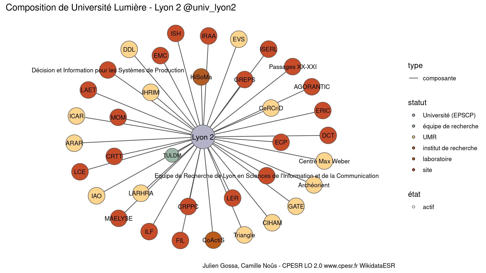 

Avertissements et édition : [logs](plots/etablissements/Q4041.md) 

### Université Lumière - Lyon 2 @univ_lyon2 : Associations.     Edition des données : https://github.com/cpesr/wikidataESR/blob/master/plots/etablissements/Q4041.md 

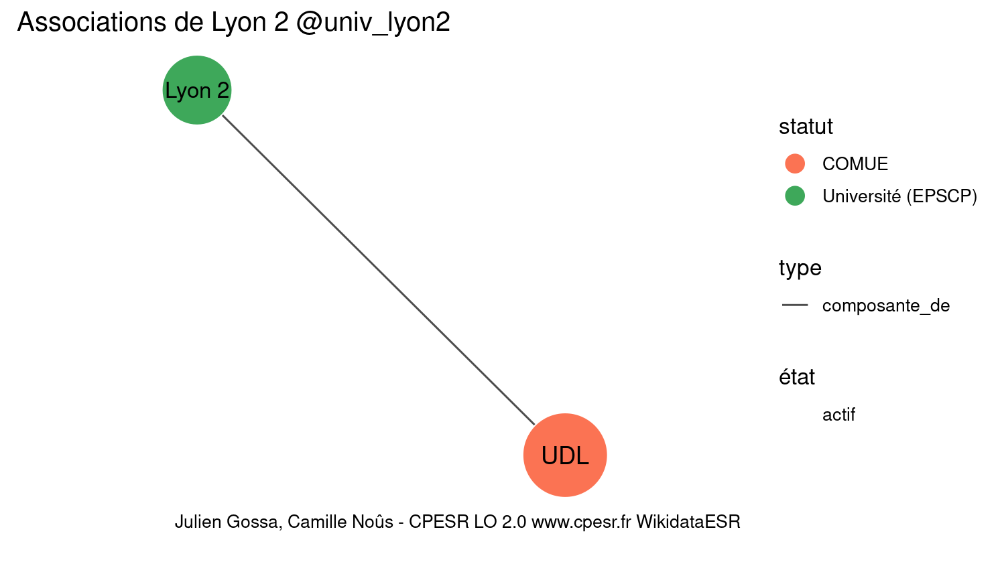 

Avertissements et édition : [logs](plots/etablissements/Q4041.md) 

### Université Jean Moulin - Lyon 3 @UJML : Histoire.     Edition des données : https://github.com/cpesr/wikidataESR/blob/master/plots/etablissements/Q4027.md 

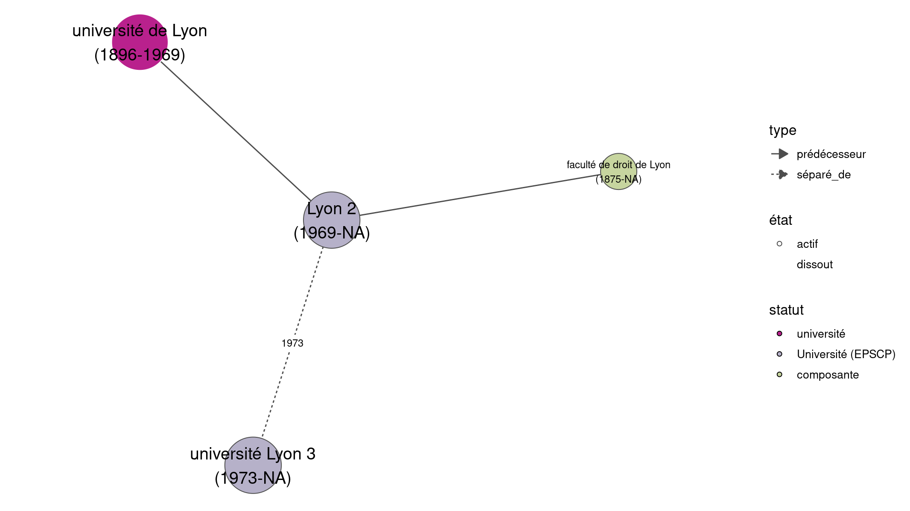 

Avertissements et édition : [logs](plots/etablissements/Q4027.md) 

### Université Jean Moulin - Lyon 3 @UJML : Composition.     Edition des données : https://github.com/cpesr/wikidataESR/blob/master/plots/etablissements/Q4027.md 

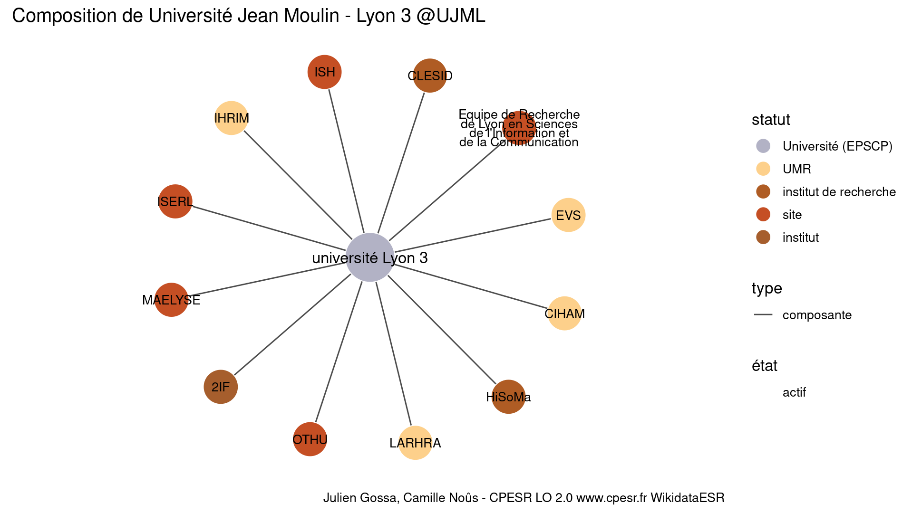 

Avertissements et édition : [logs](plots/etablissements/Q4027.md) 

### Université Jean Moulin - Lyon 3 @UJML : Associations.     Edition des données : https://github.com/cpesr/wikidataESR/blob/master/plots/etablissements/Q4027.md 

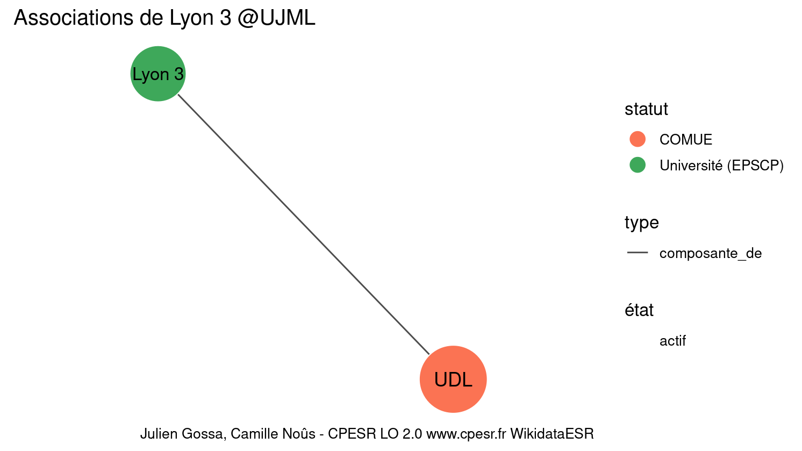 

Avertissements et édition : [logs](plots/etablissements/Q4027.md) 

### AU @univavignon : Histoire.     Edition des données : https://github.com/cpesr/wikidataESR/blob/master/plots/etablissements/Q2033119.md 


Erreur : les données sont probablement trop partielles.
```
Error in wdesr_ggplot_graph(df, node_size = node_size, label_sizes = label_sizes, : Empty ESR graph: something went wrong with the graph production parameters

``` 

Avertissements et édition : [logs](plots/etablissements/Q2033119.md) 

### AU @univavignon : Composition.     Edition des données : https://github.com/cpesr/wikidataESR/blob/master/plots/etablissements/Q2033119.md 

 

Avertissements et édition : [logs](plots/etablissements/Q2033119.md) 

### AU @univavignon : Associations.     Edition des données : https://github.com/cpesr/wikidataESR/blob/master/plots/etablissements/Q2033119.md 

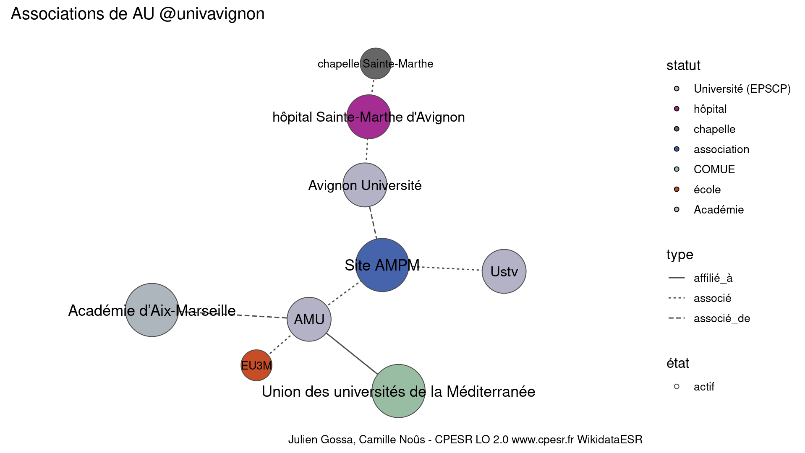 

Avertissements et édition : [logs](plots/etablissements/Q2033119.md) 

### Université d'Angers @UnivAngers : Histoire.     Edition des données : https://github.com/cpesr/wikidataESR/blob/master/plots/etablissements/Q1538727.md 


Erreur : les données sont probablement trop partielles.
```
Error in wdesr_ggplot_graph(df, node_size = node_size, label_sizes = label_sizes, : Empty ESR graph: something went wrong with the graph production parameters

``` 

Avertissements et édition : [logs](plots/etablissements/Q1538727.md) 

### Université d'Angers @UnivAngers : Composition.     Edition des données : https://github.com/cpesr/wikidataESR/blob/master/plots/etablissements/Q1538727.md 

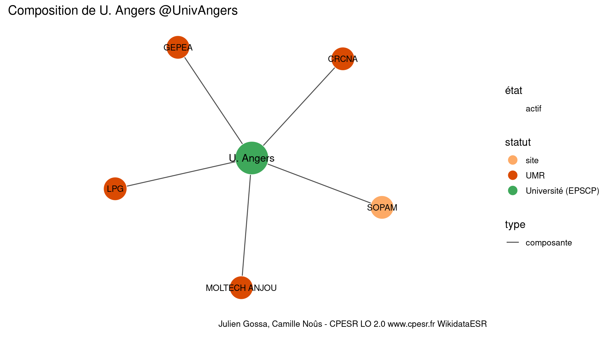 

Avertissements et édition : [logs](plots/etablissements/Q1538727.md) 

### Université d'Angers @UnivAngers : Associations.     Edition des données : https://github.com/cpesr/wikidataESR/blob/master/plots/etablissements/Q1538727.md 

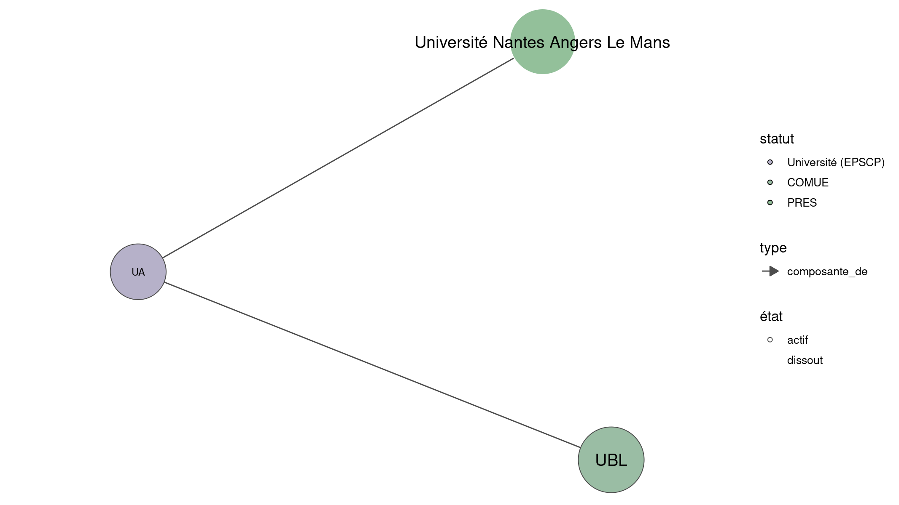 

Avertissements et édition : [logs](plots/etablissements/Q1538727.md) 

### Université de Bourgogne @univbourgogne : Histoire.     Edition des données : https://github.com/cpesr/wikidataESR/blob/master/plots/etablissements/Q287072.md 


Erreur : les données sont probablement trop partielles.
```
Error in wdesr_ggplot_graph(df, node_size = node_size, label_sizes = label_sizes, : Empty ESR graph: something went wrong with the graph production parameters

``` 

Avertissements et édition : [logs](plots/etablissements/Q287072.md) 

### Université de Bourgogne @univbourgogne : Composition.     Edition des données : https://github.com/cpesr/wikidataESR/blob/master/plots/etablissements/Q287072.md 

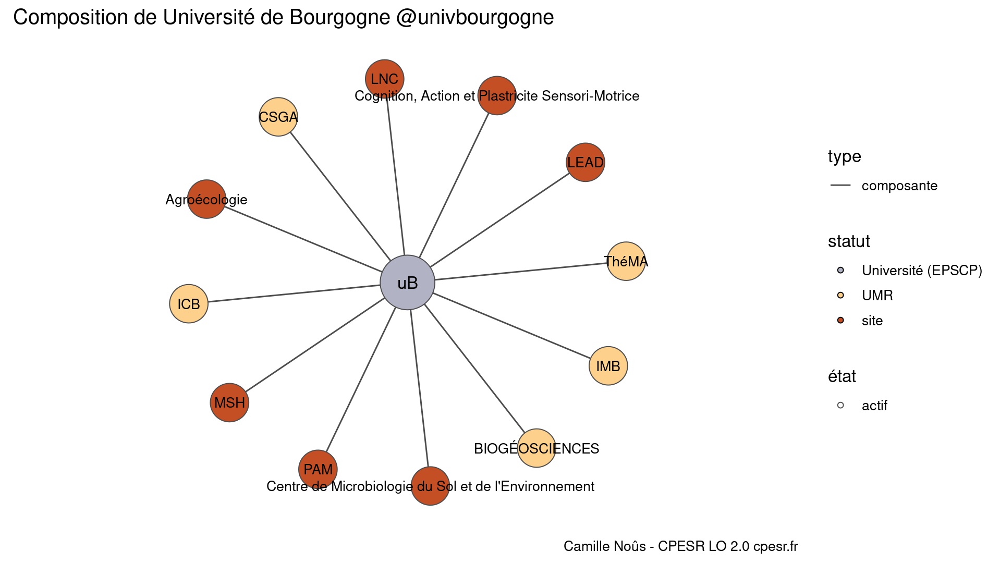 

Avertissements et édition : [logs](plots/etablissements/Q287072.md) 

### Université de Bourgogne @univbourgogne : Associations.     Edition des données : https://github.com/cpesr/wikidataESR/blob/master/plots/etablissements/Q287072.md 

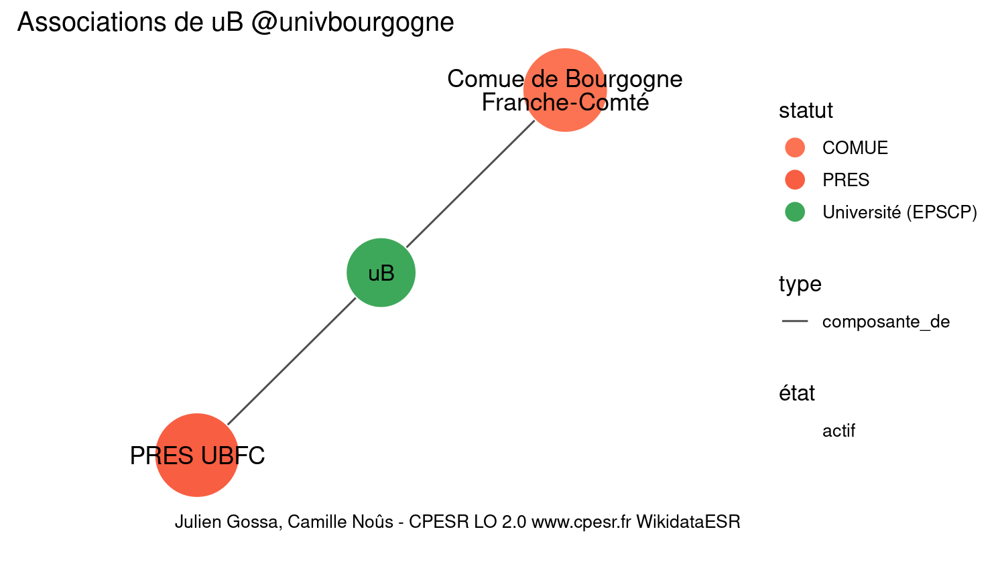 

Avertissements et édition : [logs](plots/etablissements/Q287072.md) 

### UBS @ubs_universite : Histoire.     Edition des données : https://github.com/cpesr/wikidataESR/blob/master/plots/etablissements/Q1125958.md 


Erreur : les données sont probablement trop partielles.
```
Error in wdesr_ggplot_graph(df, node_size = node_size, label_sizes = label_sizes, : Empty ESR graph: something went wrong with the graph production parameters

``` 

Avertissements et édition : [logs](plots/etablissements/Q1125958.md) 

### UBS @ubs_universite : Composition.     Edition des données : https://github.com/cpesr/wikidataESR/blob/master/plots/etablissements/Q1125958.md 

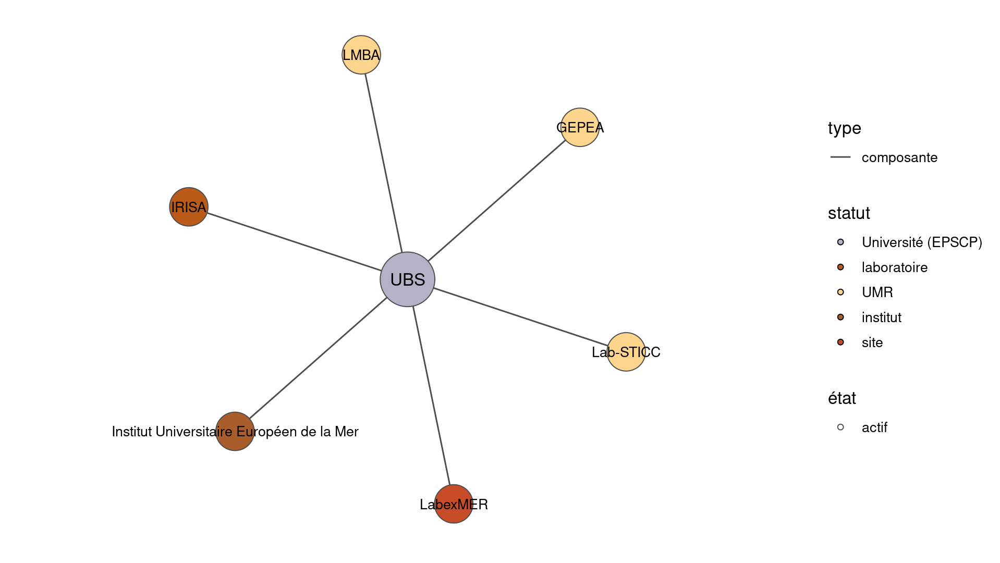 

Avertissements et édition : [logs](plots/etablissements/Q1125958.md) 

### UBS @ubs_universite : Associations.     Edition des données : https://github.com/cpesr/wikidataESR/blob/master/plots/etablissements/Q1125958.md 


Erreur : les données sont probablement trop partielles.
```
Error in wdesr_ggplot_graph(df, node_size = node_size, label_sizes = label_sizes, : Empty ESR graph: something went wrong with the graph production parameters

``` 

Avertissements et édition : [logs](plots/etablissements/Q1125958.md) 

### Université de Rouen Normandie  : Histoire.     Edition des données : https://github.com/cpesr/wikidataESR/blob/master/plots/etablissements/Q494247.md 


Erreur : les données sont probablement trop partielles.
```
Error in wdesr_ggplot_graph(df, node_size = node_size, label_sizes = label_sizes, : Empty ESR graph: something went wrong with the graph production parameters

``` 

Avertissements et édition : [logs](plots/etablissements/Q494247.md) 

### Université de Rouen Normandie  : Composition.     Edition des données : https://github.com/cpesr/wikidataESR/blob/master/plots/etablissements/Q494247.md 

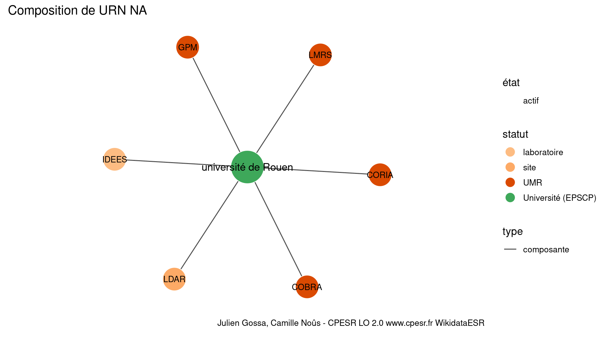 

Avertissements et édition : [logs](plots/etablissements/Q494247.md) 

### Université de Rouen Normandie  : Associations.     Edition des données : https://github.com/cpesr/wikidataESR/blob/master/plots/etablissements/Q494247.md 

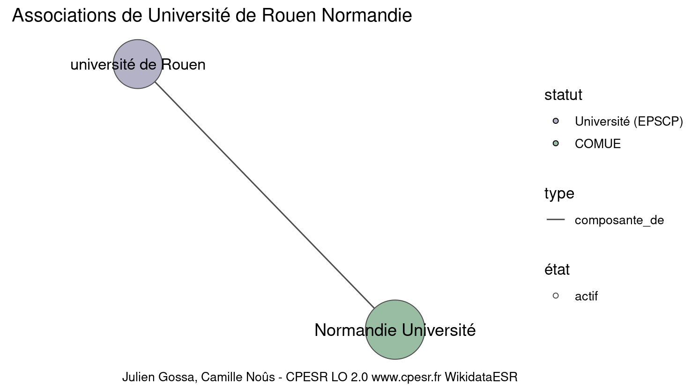 

Avertissements et édition : [logs](plots/etablissements/Q494247.md) 

### Université de Bretagne Occidentale @UBO_UnivBrest : Histoire.     Edition des données : https://github.com/cpesr/wikidataESR/blob/master/plots/etablissements/Q1857334.md 


Erreur : les données sont probablement trop partielles.
```
Error in wdesr_ggplot_graph(df, node_size = node_size, label_sizes = label_sizes, : Empty ESR graph: something went wrong with the graph production parameters

``` 

Avertissements et édition : [logs](plots/etablissements/Q1857334.md) 

### Université de Bretagne Occidentale @UBO_UnivBrest : Composition.     Edition des données : https://github.com/cpesr/wikidataESR/blob/master/plots/etablissements/Q1857334.md 

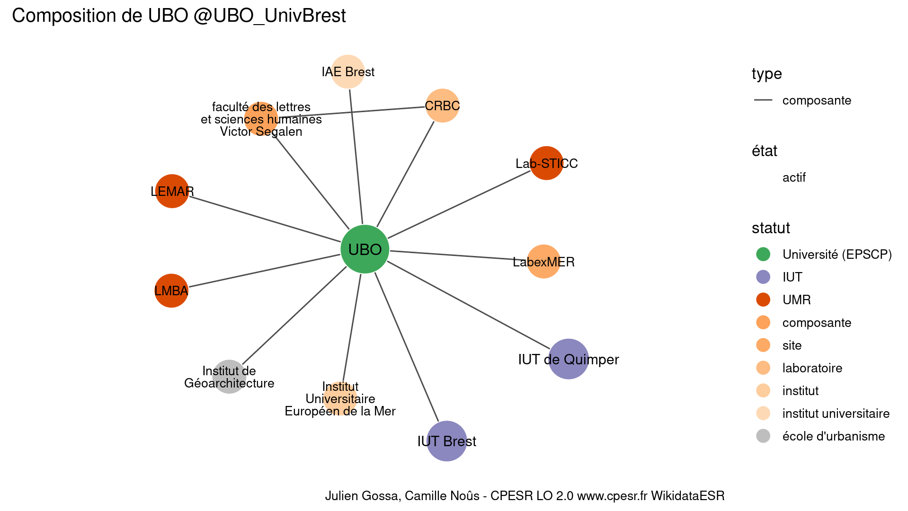 

Avertissements et édition : [logs](plots/etablissements/Q1857334.md) 

### Université de Bretagne Occidentale @UBO_UnivBrest : Associations.     Edition des données : https://github.com/cpesr/wikidataESR/blob/master/plots/etablissements/Q1857334.md 


Erreur : les données sont probablement trop partielles.
```
Error in wdesr_ggplot_graph(df, node_size = node_size, label_sizes = label_sizes, : Empty ESR graph: something went wrong with the graph production parameters

``` 

Avertissements et édition : [logs](plots/etablissements/Q1857334.md) 

### Université Toulouse - Jean Jaurès @UTJeanJaures : Histoire.     Edition des données : https://github.com/cpesr/wikidataESR/blob/master/plots/etablissements/Q1933558.md 

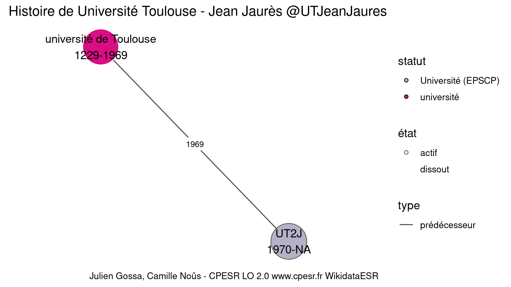 

Avertissements et édition : [logs](plots/etablissements/Q1933558.md) 

### Université Toulouse - Jean Jaurès @UTJeanJaures : Composition.     Edition des données : https://github.com/cpesr/wikidataESR/blob/master/plots/etablissements/Q1933558.md 

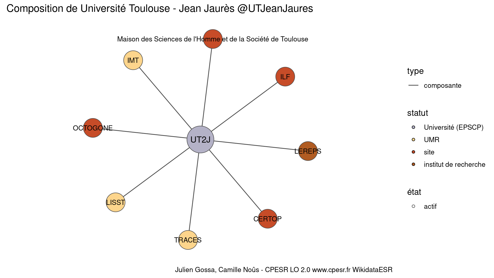 

Avertissements et édition : [logs](plots/etablissements/Q1933558.md) 

### Université Toulouse - Jean Jaurès @UTJeanJaures : Associations.     Edition des données : https://github.com/cpesr/wikidataESR/blob/master/plots/etablissements/Q1933558.md 

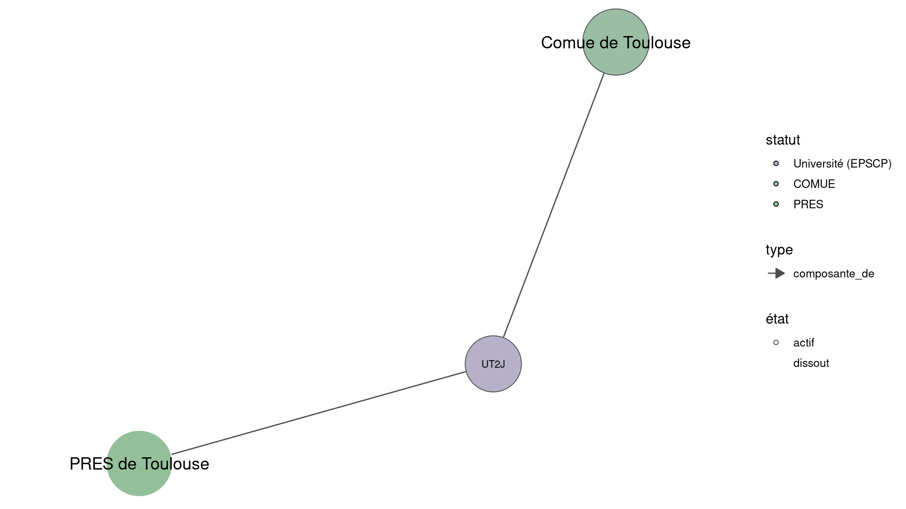 

Avertissements et édition : [logs](plots/etablissements/Q1933558.md) 

## Histoire, composition et association actuelles des Grand établissement 

Twitters manquants :
```
 - Ecole de l'air et de l'espace
 - École nationale vétérinaire, agroalimentaire et de l'alimentation, Nantes-Atlantique
 - Institut Agro
``` 

### CNAM @LeCnam : Histoire.     Edition des données : https://github.com/cpesr/wikidataESR/blob/master/plots/etablissements/Q524289.md 


Erreur : les données sont probablement trop partielles.
```
Error in wdesr_ggplot_graph(df, node_size = node_size, label_sizes = label_sizes, : Empty ESR graph: something went wrong with the graph production parameters

``` 

Avertissements et édition : [logs](plots/etablissements/Q524289.md) 

### CNAM @LeCnam : Composition.     Edition des données : https://github.com/cpesr/wikidataESR/blob/master/plots/etablissements/Q524289.md 

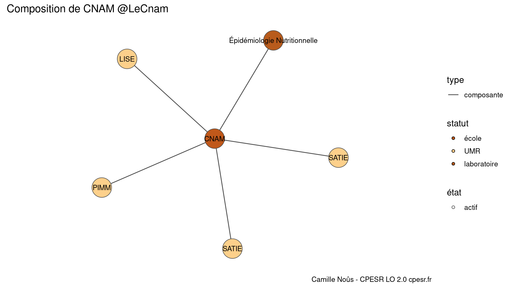 

Avertissements et édition : [logs](plots/etablissements/Q524289.md) 

### CNAM @LeCnam : Associations.     Edition des données : https://github.com/cpesr/wikidataESR/blob/master/plots/etablissements/Q524289.md 

 

Avertissements et édition : [logs](plots/etablissements/Q524289.md) 

### IEP de Paris @sciencespo : Histoire.     Edition des données : https://github.com/cpesr/wikidataESR/blob/master/plots/etablissements/Q859363.md 

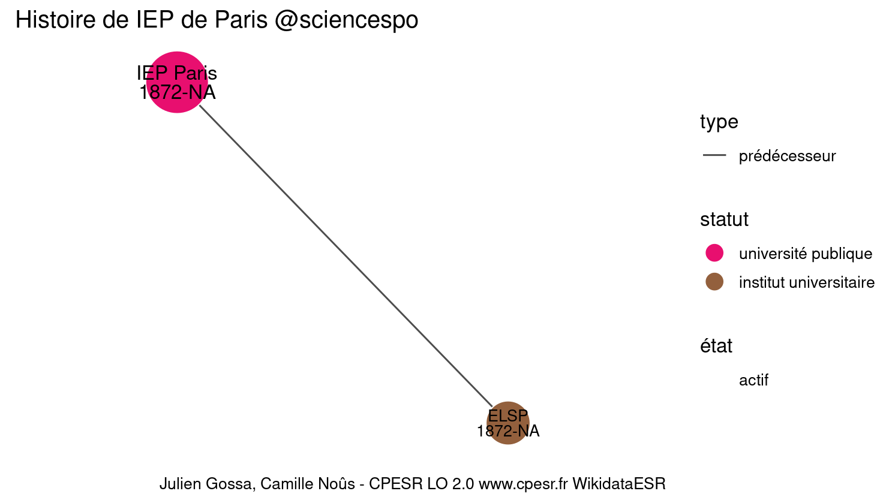 

Avertissements et édition : [logs](plots/etablissements/Q859363.md) 

### IEP de Paris @sciencespo : Composition.     Edition des données : https://github.com/cpesr/wikidataESR/blob/master/plots/etablissements/Q859363.md 

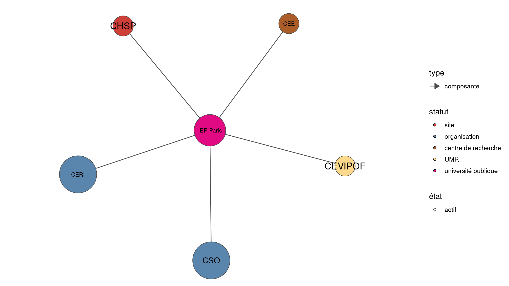 

Avertissements et édition : [logs](plots/etablissements/Q859363.md) 

### IEP de Paris @sciencespo : Associations.     Edition des données : https://github.com/cpesr/wikidataESR/blob/master/plots/etablissements/Q859363.md 

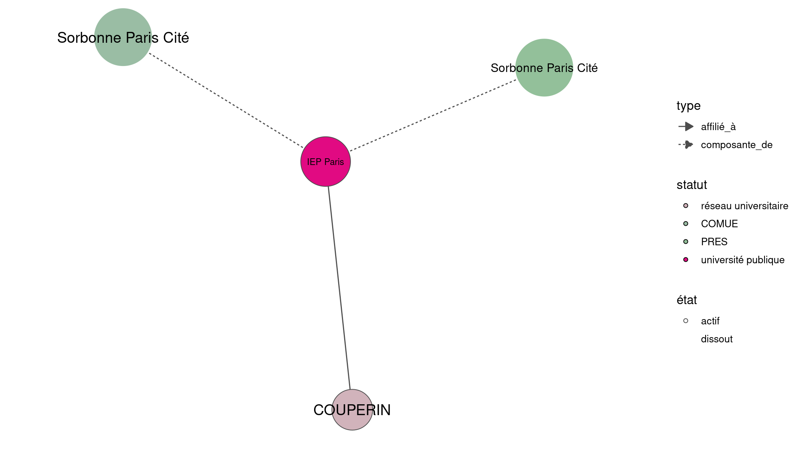 

Avertissements et édition : [logs](plots/etablissements/Q859363.md) 

### Agrosup Dijon @AgroSupDijon : Histoire.     Edition des données : https://github.com/cpesr/wikidataESR/blob/master/plots/etablissements/Q8077943.md 


Erreur : les données sont probablement trop partielles.
```
Error in wdesr_ggplot_graph(df, node_size = node_size, label_sizes = label_sizes, : Empty ESR graph: something went wrong with the graph production parameters

``` 

Avertissements et édition : [logs](plots/etablissements/Q8077943.md) 

### Agrosup Dijon @AgroSupDijon : Composition.     Edition des données : https://github.com/cpesr/wikidataESR/blob/master/plots/etablissements/Q8077943.md 

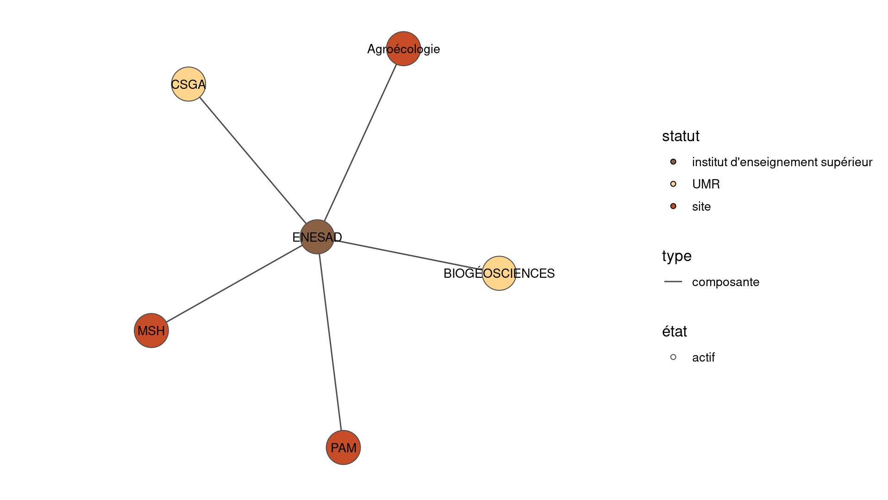 

Avertissements et édition : [logs](plots/etablissements/Q8077943.md) 

### Agrosup Dijon @AgroSupDijon : Associations.     Edition des données : https://github.com/cpesr/wikidataESR/blob/master/plots/etablissements/Q8077943.md 


Erreur : les données sont probablement trop partielles.
```
Error in wdesr_ggplot_graph(df, node_size = node_size, label_sizes = label_sizes, : Empty ESR graph: something went wrong with the graph production parameters

``` 

Avertissements et édition : [logs](plots/etablissements/Q8077943.md) 

### Ecole de l'air et de l'espace  : Histoire.     Edition des données : https://github.com/cpesr/wikidataESR/blob/master/plots/etablissements/Q3577870.md 


Erreur : les données sont probablement trop partielles.
```
Error in wdesr_ggplot_graph(df, node_size = node_size, label_sizes = label_sizes, : Empty ESR graph: something went wrong with the graph production parameters

``` 

Avertissements et édition : [logs](plots/etablissements/Q3577870.md) 

### Ecole de l'air et de l'espace  : Composition.     Edition des données : https://github.com/cpesr/wikidataESR/blob/master/plots/etablissements/Q3577870.md 


Erreur : les données sont probablement trop partielles.
```
Error in wdesr_ggplot_graph(df, node_size = node_size, label_sizes = label_sizes, : Empty ESR graph: something went wrong with the graph production parameters

``` 

Avertissements et édition : [logs](plots/etablissements/Q3577870.md) 

### Ecole de l'air et de l'espace  : Associations.     Edition des données : https://github.com/cpesr/wikidataESR/blob/master/plots/etablissements/Q3577870.md 

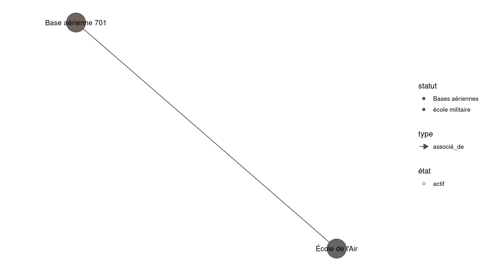 

Avertissements et édition : [logs](plots/etablissements/Q3577870.md) 

### ENAC @enacfrance : Histoire.     Edition des données : https://github.com/cpesr/wikidataESR/blob/master/plots/etablissements/Q174335.md 


Erreur : les données sont probablement trop partielles.
```
Error in wdesr_ggplot_graph(df, node_size = node_size, label_sizes = label_sizes, : Empty ESR graph: something went wrong with the graph production parameters

``` 

Avertissements et édition : [logs](plots/etablissements/Q174335.md) 

### ENAC @enacfrance : Composition.     Edition des données : https://github.com/cpesr/wikidataESR/blob/master/plots/etablissements/Q174335.md 


Erreur : les données sont probablement trop partielles.
```
Error in wdesr_ggplot_graph(df, node_size = node_size, label_sizes = label_sizes, : Empty ESR graph: something went wrong with the graph production parameters

``` 

Avertissements et édition : [logs](plots/etablissements/Q174335.md) 

### ENAC @enacfrance : Associations.     Edition des données : https://github.com/cpesr/wikidataESR/blob/master/plots/etablissements/Q174335.md 

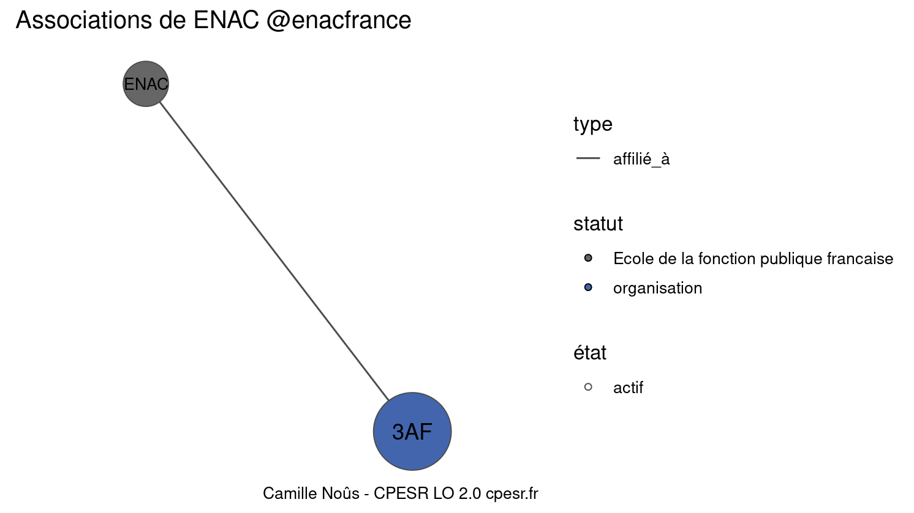 

Avertissements et édition : [logs](plots/etablissements/Q174335.md) 

### École nationale des ponts et chaussées @EcoledesPonts : Histoire.     Edition des données : https://github.com/cpesr/wikidataESR/blob/master/plots/etablissements/Q273523.md 


Erreur : les données sont probablement trop partielles.
```
Error in wdesr_ggplot_graph(df, node_size = node_size, label_sizes = label_sizes, : Empty ESR graph: something went wrong with the graph production parameters

``` 

Avertissements et édition : [logs](plots/etablissements/Q273523.md) 

### École nationale des ponts et chaussées @EcoledesPonts : Composition.     Edition des données : https://github.com/cpesr/wikidataESR/blob/master/plots/etablissements/Q273523.md 

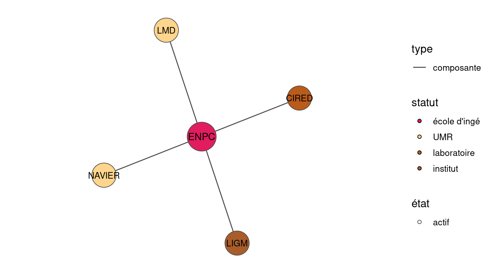 

Avertissements et édition : [logs](plots/etablissements/Q273523.md) 

### École nationale des ponts et chaussées @EcoledesPonts : Associations.     Edition des données : https://github.com/cpesr/wikidataESR/blob/master/plots/etablissements/Q273523.md 

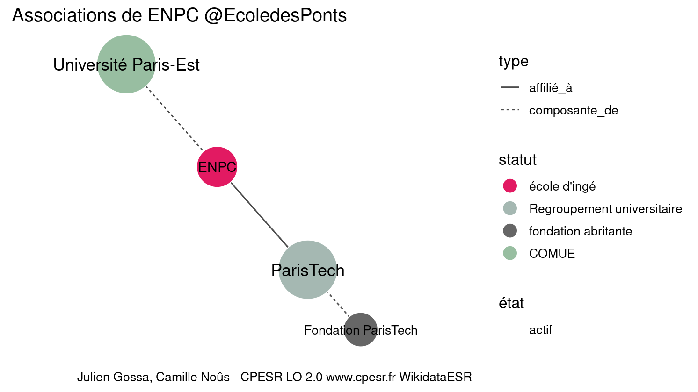 

Avertissements et édition : [logs](plots/etablissements/Q273523.md) 

### EHESP @EHESP : Histoire.     Edition des données : https://github.com/cpesr/wikidataESR/blob/master/plots/etablissements/Q1587855.md 


Erreur : les données sont probablement trop partielles.
```
Error in wdesr_ggplot_graph(df, node_size = node_size, label_sizes = label_sizes, : Empty ESR graph: something went wrong with the graph production parameters

``` 

Avertissements et édition : [logs](plots/etablissements/Q1587855.md) 

### EHESP @EHESP : Composition.     Edition des données : https://github.com/cpesr/wikidataESR/blob/master/plots/etablissements/Q1587855.md 


Erreur : les données sont probablement trop partielles.
```
Error in wdesr_ggplot_graph(df, node_size = node_size, label_sizes = label_sizes, : Empty ESR graph: something went wrong with the graph production parameters

``` 

Avertissements et édition : [logs](plots/etablissements/Q1587855.md) 

### EHESP @EHESP : Associations.     Edition des données : https://github.com/cpesr/wikidataESR/blob/master/plots/etablissements/Q1587855.md 


Erreur : les données sont probablement trop partielles.
```
Error in wdesr_ggplot_graph(df, node_size = node_size, label_sizes = label_sizes, : Empty ESR graph: something went wrong with the graph production parameters

``` 

Avertissements et édition : [logs](plots/etablissements/Q1587855.md) 

### Collège de France @cdf1530 : Histoire.     Edition des données : https://github.com/cpesr/wikidataESR/blob/master/plots/etablissements/Q202660.md 

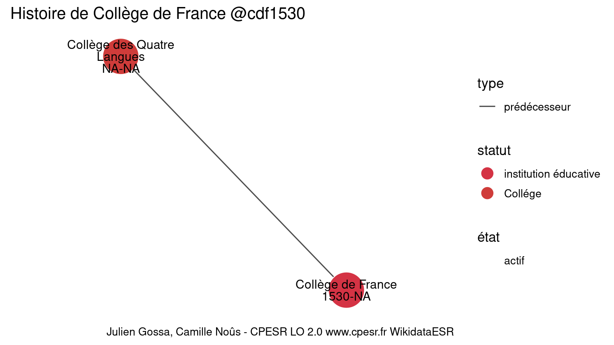 

Avertissements et édition : [logs](plots/etablissements/Q202660.md) 

### Collège de France @cdf1530 : Composition.     Edition des données : https://github.com/cpesr/wikidataESR/blob/master/plots/etablissements/Q202660.md 

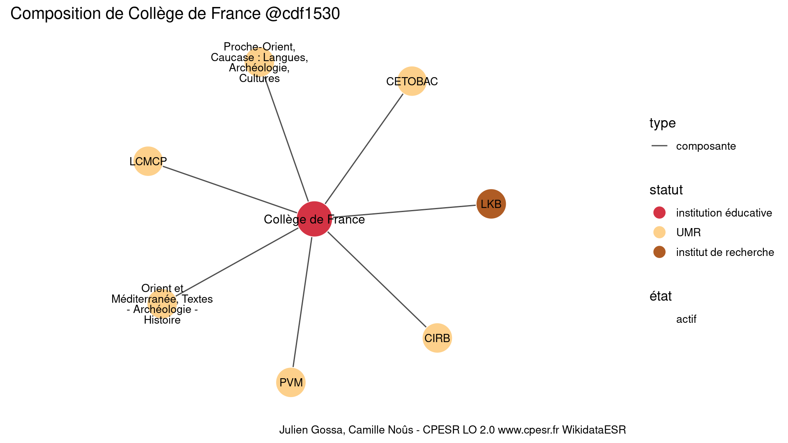 

Avertissements et édition : [logs](plots/etablissements/Q202660.md) 

### Collège de France @cdf1530 : Associations.     Edition des données : https://github.com/cpesr/wikidataESR/blob/master/plots/etablissements/Q202660.md 


Erreur : les données sont probablement trop partielles.
```
Error in wdesr_ggplot_graph(df, node_size = node_size, label_sizes = label_sizes, : Empty ESR graph: something went wrong with the graph production parameters

``` 

Avertissements et édition : [logs](plots/etablissements/Q202660.md) 

### EHESS @EHESS_fr : Histoire.     Edition des données : https://github.com/cpesr/wikidataESR/blob/master/plots/etablissements/Q273518.md 

 

Avertissements et édition : [logs](plots/etablissements/Q273518.md) 

### EHESS @EHESS_fr : Composition.     Edition des données : https://github.com/cpesr/wikidataESR/blob/master/plots/etablissements/Q273518.md 

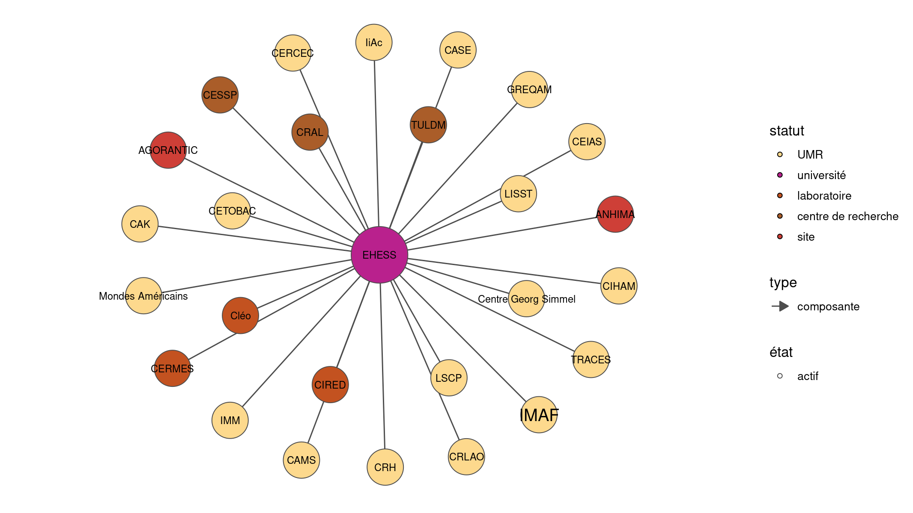 

Avertissements et édition : [logs](plots/etablissements/Q273518.md) 

### EHESS @EHESS_fr : Associations.     Edition des données : https://github.com/cpesr/wikidataESR/blob/master/plots/etablissements/Q273518.md 

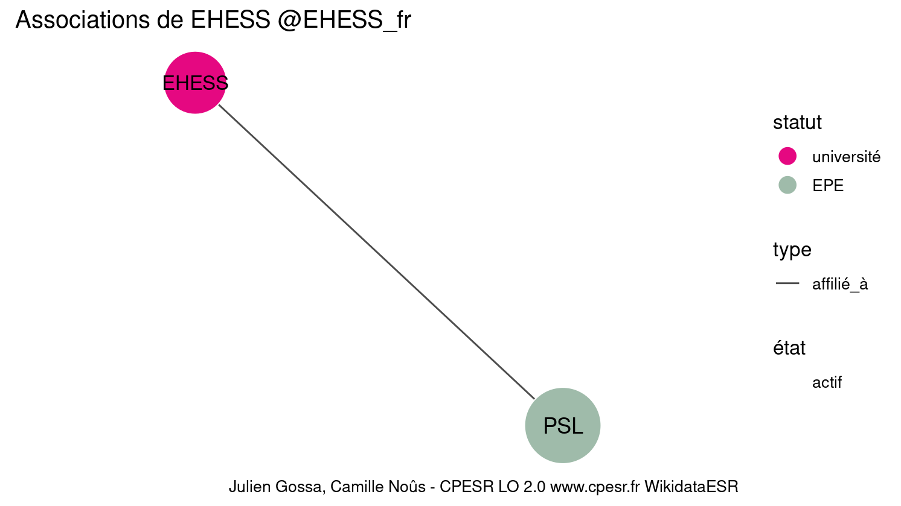 

Avertissements et édition : [logs](plots/etablissements/Q273518.md) 

### École nationale vétérinaire, agroalimentaire et de l'alimentation, Nantes-Atlantique  : Histoire.     Edition des données : https://github.com/cpesr/wikidataESR/blob/master/plots/etablissements/Q3578268.md 


Erreur : les données sont probablement trop partielles.
```
Error in wdesr_ggplot_graph(df, node_size = node_size, label_sizes = label_sizes, : Empty ESR graph: something went wrong with the graph production parameters

``` 

Avertissements et édition : [logs](plots/etablissements/Q3578268.md) 

### École nationale vétérinaire, agroalimentaire et de l'alimentation, Nantes-Atlantique  : Composition.     Edition des données : https://github.com/cpesr/wikidataESR/blob/master/plots/etablissements/Q3578268.md 

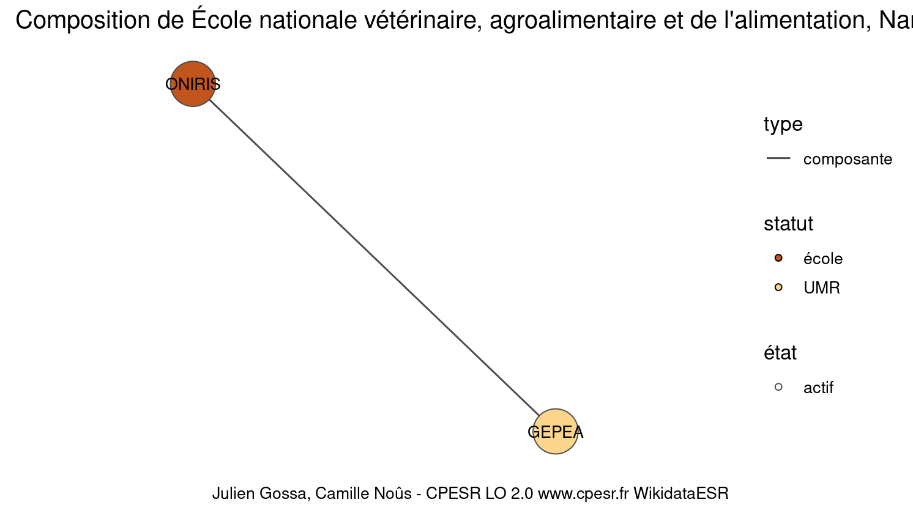 

Avertissements et édition : [logs](plots/etablissements/Q3578268.md) 

### École nationale vétérinaire, agroalimentaire et de l'alimentation, Nantes-Atlantique  : Associations.     Edition des données : https://github.com/cpesr/wikidataESR/blob/master/plots/etablissements/Q3578268.md 


Erreur : les données sont probablement trop partielles.
```
Error in wdesr_ggplot_graph(df, node_size = node_size, label_sizes = label_sizes, : Empty ESR graph: something went wrong with the graph production parameters

``` 

Avertissements et édition : [logs](plots/etablissements/Q3578268.md) 

### Bordeaux INP @BordeauxINP : Histoire.     Edition des données : https://github.com/cpesr/wikidataESR/blob/master/plots/etablissements/Q3152470.md 


Erreur : les données sont probablement trop partielles.
```
Error in wdesr_ggplot_graph(df, node_size = node_size, label_sizes = label_sizes, : Empty ESR graph: something went wrong with the graph production parameters

``` 

Avertissements et édition : [logs](plots/etablissements/Q3152470.md) 

### Bordeaux INP @BordeauxINP : Composition.     Edition des données : https://github.com/cpesr/wikidataESR/blob/master/plots/etablissements/Q3152470.md 

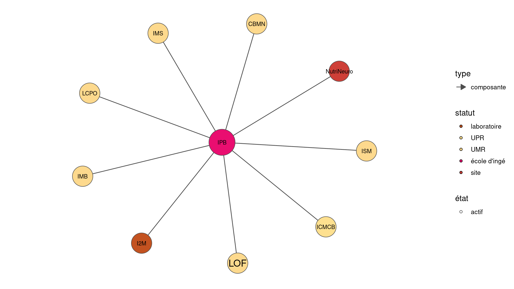 

Avertissements et édition : [logs](plots/etablissements/Q3152470.md) 

### Bordeaux INP @BordeauxINP : Associations.     Edition des données : https://github.com/cpesr/wikidataESR/blob/master/plots/etablissements/Q3152470.md 


Erreur : les données sont probablement trop partielles.
```
Error in wdesr_ggplot_graph(df, node_size = node_size, label_sizes = label_sizes, : Empty ESR graph: something went wrong with the graph production parameters

``` 

Avertissements et édition : [logs](plots/etablissements/Q3152470.md) 

### École navale @Ecole_navale : Histoire.     Edition des données : https://github.com/cpesr/wikidataESR/blob/master/plots/etablissements/Q974394.md 


Erreur : les données sont probablement trop partielles.
```
Error in wdesr_ggplot_graph(df, node_size = node_size, label_sizes = label_sizes, : Empty ESR graph: something went wrong with the graph production parameters

``` 

Avertissements et édition : [logs](plots/etablissements/Q974394.md) 

### École navale @Ecole_navale : Composition.     Edition des données : https://github.com/cpesr/wikidataESR/blob/master/plots/etablissements/Q974394.md 

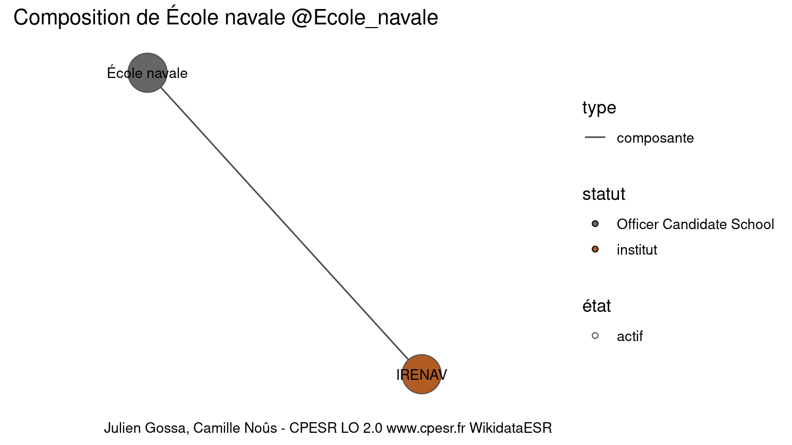 

Avertissements et édition : [logs](plots/etablissements/Q974394.md) 

### École navale @Ecole_navale : Associations.     Edition des données : https://github.com/cpesr/wikidataESR/blob/master/plots/etablissements/Q974394.md 

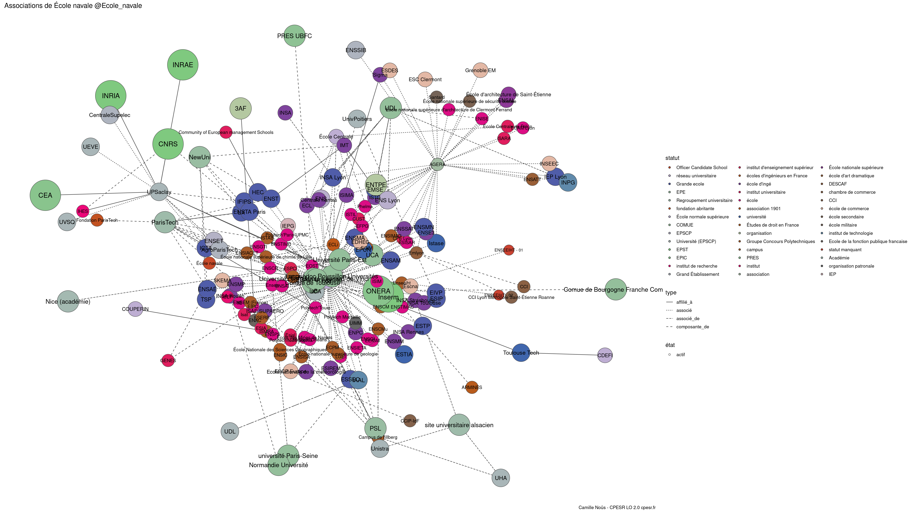 

Avertissements et édition : [logs](plots/etablissements/Q974394.md) 

### INALCO @Inalco : Histoire.     Edition des données : https://github.com/cpesr/wikidataESR/blob/master/plots/etablissements/Q1430113.md 

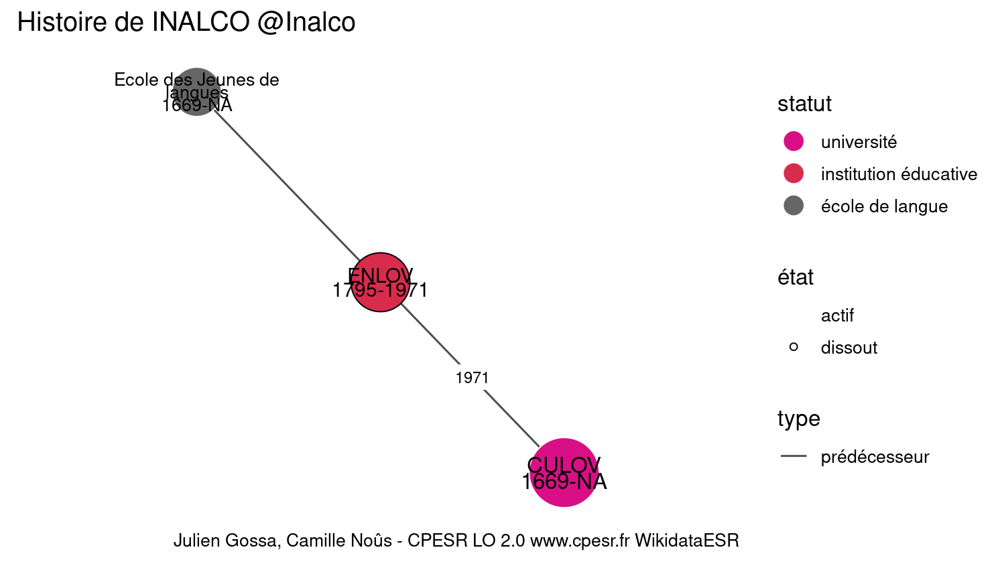 

Avertissements et édition : [logs](plots/etablissements/Q1430113.md) 

### INALCO @Inalco : Composition.     Edition des données : https://github.com/cpesr/wikidataESR/blob/master/plots/etablissements/Q1430113.md 

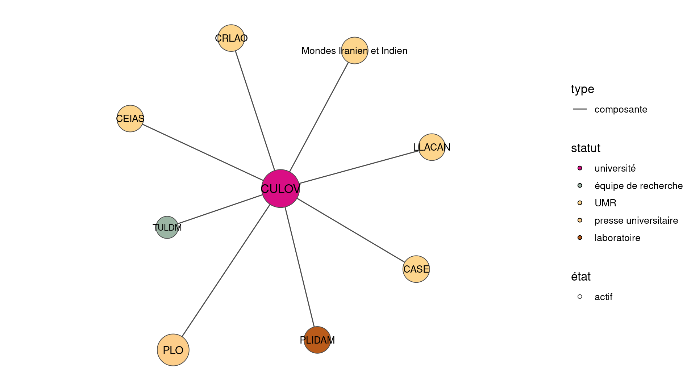 

Avertissements et édition : [logs](plots/etablissements/Q1430113.md) 

### INALCO @Inalco : Associations.     Edition des données : https://github.com/cpesr/wikidataESR/blob/master/plots/etablissements/Q1430113.md 


Erreur : les données sont probablement trop partielles.
```
Error in wdesr_ggplot_graph(df, node_size = node_size, label_sizes = label_sizes, : Empty ESR graph: something went wrong with the graph production parameters

``` 

Avertissements et édition : [logs](plots/etablissements/Q1430113.md) 

### Institut national d'histoire de l'art @INHA_Fr : Histoire.     Edition des données : https://github.com/cpesr/wikidataESR/blob/master/plots/etablissements/Q3152376.md 


Erreur : les données sont probablement trop partielles.
```
Error in wdesr_ggplot_graph(df, node_size = node_size, label_sizes = label_sizes, : Empty ESR graph: something went wrong with the graph production parameters

``` 

Avertissements et édition : [logs](plots/etablissements/Q3152376.md) 

### Institut national d'histoire de l'art @INHA_Fr : Composition.     Edition des données : https://github.com/cpesr/wikidataESR/blob/master/plots/etablissements/Q3152376.md 


Erreur : les données sont probablement trop partielles.
```
Error in wdesr_ggplot_graph(df, node_size = node_size, label_sizes = label_sizes, : Empty ESR graph: something went wrong with the graph production parameters

``` 

Avertissements et édition : [logs](plots/etablissements/Q3152376.md) 

### Institut national d'histoire de l'art @INHA_Fr : Associations.     Edition des données : https://github.com/cpesr/wikidataESR/blob/master/plots/etablissements/Q3152376.md 


Erreur : les données sont probablement trop partielles.
```
Error in wdesr_ggplot_graph(df, node_size = node_size, label_sizes = label_sizes, : Empty ESR graph: something went wrong with the graph production parameters

``` 

Avertissements et édition : [logs](plots/etablissements/Q3152376.md) 

### Muséum national d'histoire naturelle @Le_Museum : Histoire.     Edition des données : https://github.com/cpesr/wikidataESR/blob/master/plots/etablissements/Q838691.md 


Erreur : les données sont probablement trop partielles.
```
Error in wdesr_ggplot_graph(df, node_size = node_size, label_sizes = label_sizes, : Empty ESR graph: something went wrong with the graph production parameters

``` 

Avertissements et édition : [logs](plots/etablissements/Q838691.md) 

### Muséum national d'histoire naturelle @Le_Museum : Composition.     Edition des données : https://github.com/cpesr/wikidataESR/blob/master/plots/etablissements/Q838691.md 

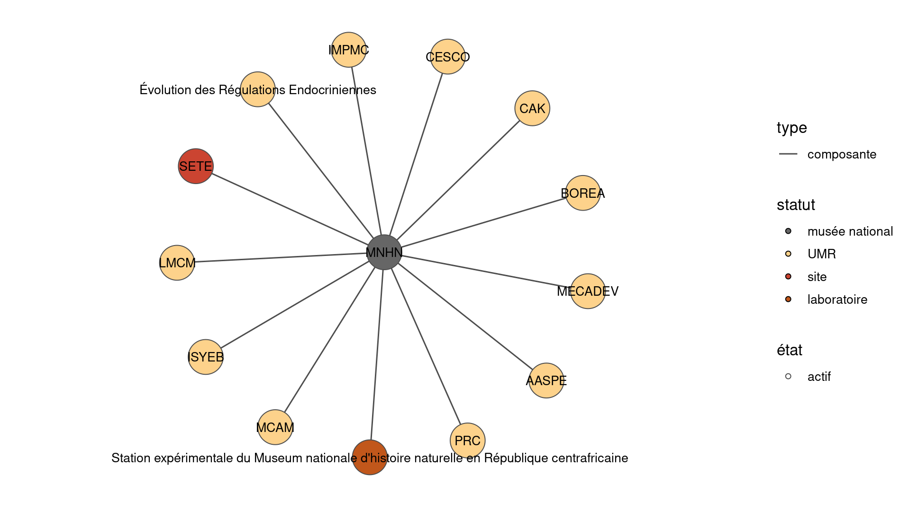 

Avertissements et édition : [logs](plots/etablissements/Q838691.md) 

### Muséum national d'histoire naturelle @Le_Museum : Associations.     Edition des données : https://github.com/cpesr/wikidataESR/blob/master/plots/etablissements/Q838691.md 

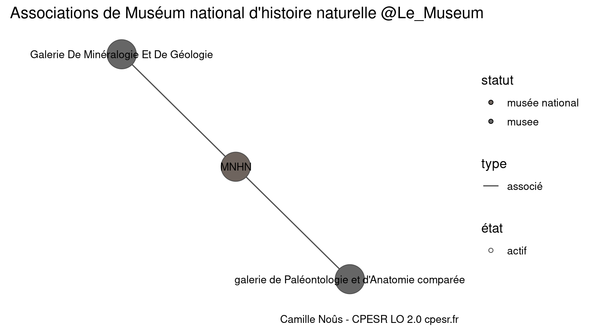 

Avertissements et édition : [logs](plots/etablissements/Q838691.md) 

### Institut Agro  : Histoire.     Edition des données : https://github.com/cpesr/wikidataESR/blob/master/plots/etablissements/Q81433122.md 

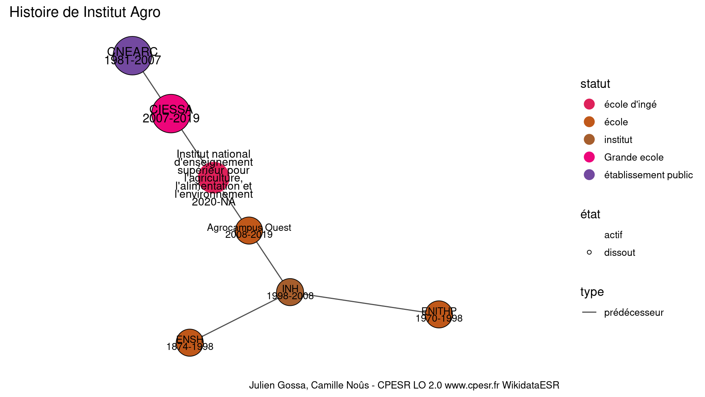 

Avertissements et édition : [logs](plots/etablissements/Q81433122.md) 

### Institut Agro  : Composition.     Edition des données : https://github.com/cpesr/wikidataESR/blob/master/plots/etablissements/Q81433122.md 


Erreur : les données sont probablement trop partielles.
```
Error in wdesr_ggplot_graph(df, node_size = node_size, label_sizes = label_sizes, : Empty ESR graph: something went wrong with the graph production parameters

``` 

Avertissements et édition : [logs](plots/etablissements/Q81433122.md) 

### Institut Agro  : Associations.     Edition des données : https://github.com/cpesr/wikidataESR/blob/master/plots/etablissements/Q81433122.md 


Erreur : les données sont probablement trop partielles.
```
Error in wdesr_ggplot_graph(df, node_size = node_size, label_sizes = label_sizes, : Empty ESR graph: something went wrong with the graph production parameters

``` 

Avertissements et édition : [logs](plots/etablissements/Q81433122.md) 

### Université de Lorraine @Univ_Lorraine : Histoire.     Edition des données : https://github.com/cpesr/wikidataESR/blob/master/plots/etablissements/Q4173330.md 

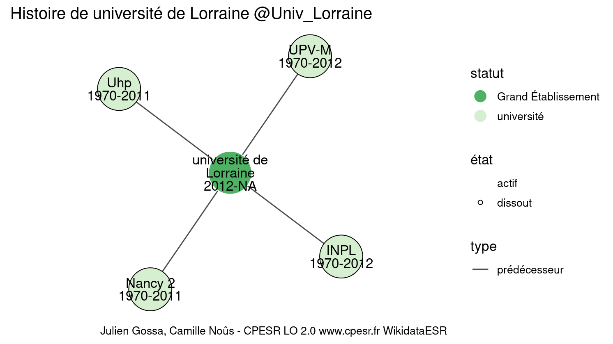 

Avertissements et édition : [logs](plots/etablissements/Q4173330.md) 

### Université de Lorraine @Univ_Lorraine : Composition.     Edition des données : https://github.com/cpesr/wikidataESR/blob/master/plots/etablissements/Q4173330.md 

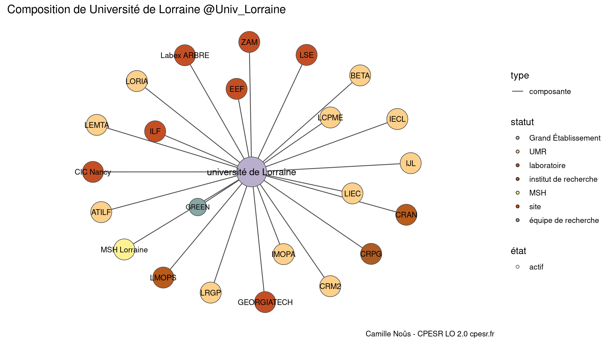 

Avertissements et édition : [logs](plots/etablissements/Q4173330.md) 

### Université de Lorraine @Univ_Lorraine : Associations.     Edition des données : https://github.com/cpesr/wikidataESR/blob/master/plots/etablissements/Q4173330.md 

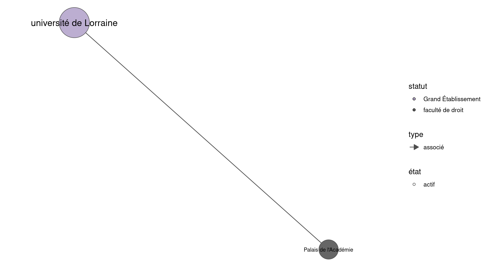 

Avertissements et édition : [logs](plots/etablissements/Q4173330.md) 

### Institut Mines-Télécom, au périmètre des écoles IMT Atlantique, Lille Douai, Albi, Alès, Mines Saint-Étienne et Institut Mines-Télécom Business school @IMTFrance : Histoire.     Edition des données : https://github.com/cpesr/wikidataESR/blob/master/plots/etablissements/Q7885718.md 


Erreur : les données sont probablement trop partielles.
```
Error in wdesr_ggplot_graph(df, node_size = node_size, label_sizes = label_sizes, : Empty ESR graph: something went wrong with the graph production parameters

``` 

Avertissements et édition : [logs](plots/etablissements/Q7885718.md) 

### Institut Mines-Télécom, au périmètre des écoles IMT Atlantique, Lille Douai, Albi, Alès, Mines Saint-Étienne et Institut Mines-Télécom Business school @IMTFrance : Composition.     Edition des données : https://github.com/cpesr/wikidataESR/blob/master/plots/etablissements/Q7885718.md 

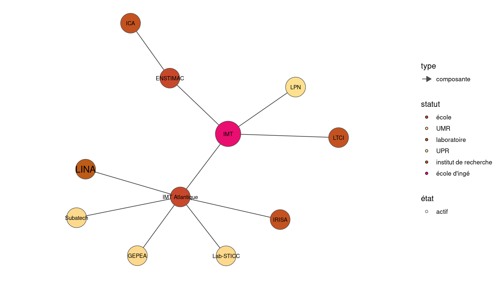 

Avertissements et édition : [logs](plots/etablissements/Q7885718.md) 

### Institut Mines-Télécom, au périmètre des écoles IMT Atlantique, Lille Douai, Albi, Alès, Mines Saint-Étienne et Institut Mines-Télécom Business school @IMTFrance : Associations.     Edition des données : https://github.com/cpesr/wikidataESR/blob/master/plots/etablissements/Q7885718.md 

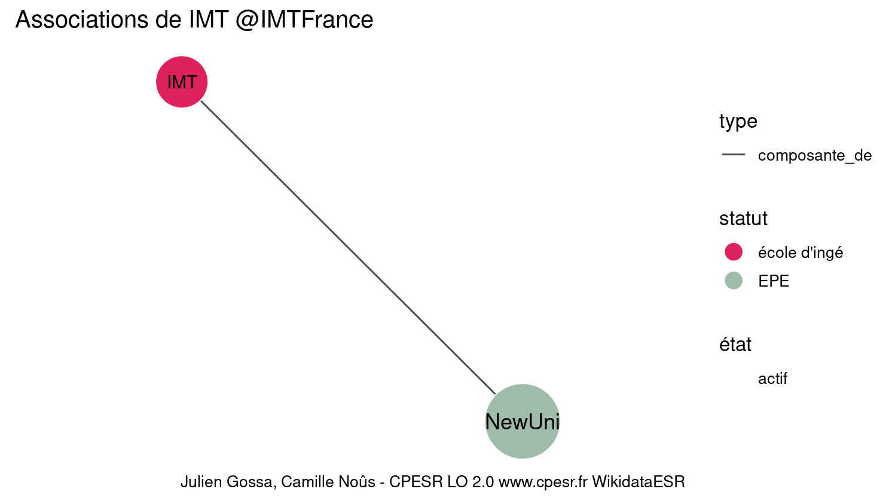 

Avertissements et édition : [logs](plots/etablissements/Q7885718.md) 

### École nationale supérieure maritime @ENSM : Histoire.     Edition des données : https://github.com/cpesr/wikidataESR/blob/master/plots/etablissements/Q3578264.md 


Erreur : les données sont probablement trop partielles.
```
Error in wdesr_ggplot_graph(df, node_size = node_size, label_sizes = label_sizes, : Empty ESR graph: something went wrong with the graph production parameters

``` 

Avertissements et édition : [logs](plots/etablissements/Q3578264.md) 

### École nationale supérieure maritime @ENSM : Composition.     Edition des données : https://github.com/cpesr/wikidataESR/blob/master/plots/etablissements/Q3578264.md 


Erreur : les données sont probablement trop partielles.
```
Error in wdesr_ggplot_graph(df, node_size = node_size, label_sizes = label_sizes, : Empty ESR graph: something went wrong with the graph production parameters

``` 

Avertissements et édition : [logs](plots/etablissements/Q3578264.md) 

### École nationale supérieure maritime @ENSM : Associations.     Edition des données : https://github.com/cpesr/wikidataESR/blob/master/plots/etablissements/Q3578264.md 

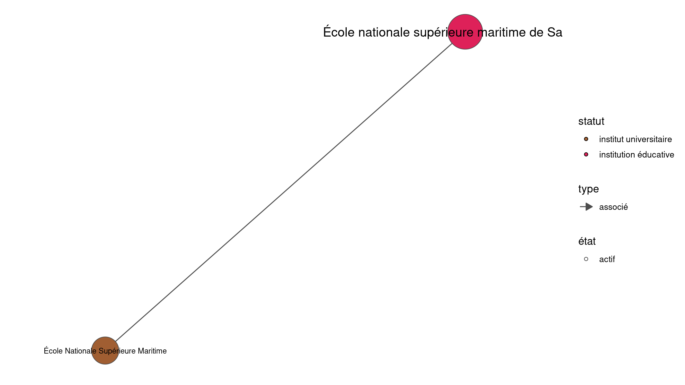 

Avertissements et édition : [logs](plots/etablissements/Q3578264.md) 

### Vet Agro Sup @VetAgroSup : Histoire.     Edition des données : https://github.com/cpesr/wikidataESR/blob/master/plots/etablissements/Q3151920.md 

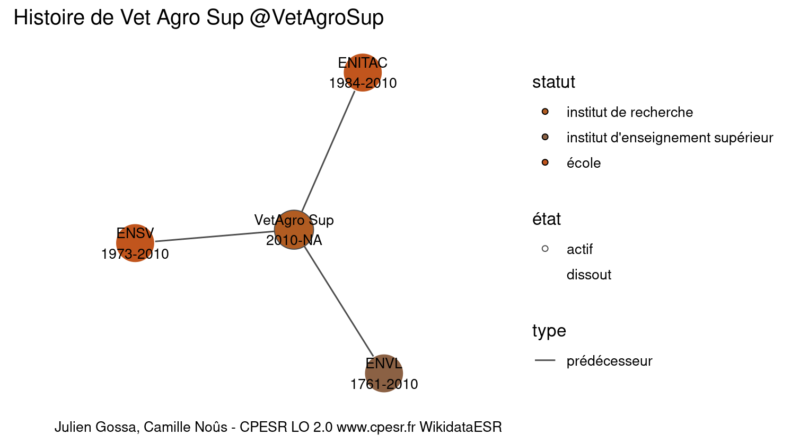 

Avertissements et édition : [logs](plots/etablissements/Q3151920.md) 

### Vet Agro Sup @VetAgroSup : Composition.     Edition des données : https://github.com/cpesr/wikidataESR/blob/master/plots/etablissements/Q3151920.md 

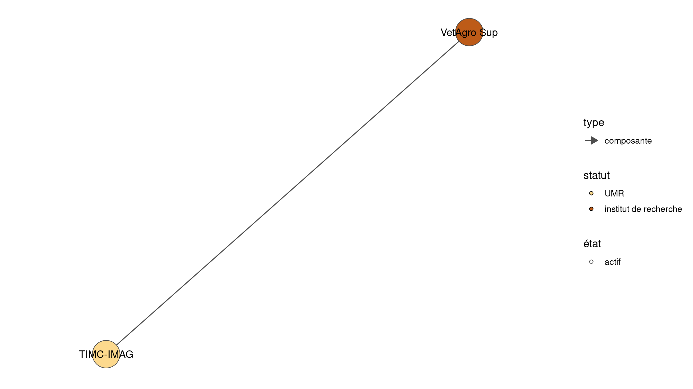 

Avertissements et édition : [logs](plots/etablissements/Q3151920.md) 

### Vet Agro Sup @VetAgroSup : Associations.     Edition des données : https://github.com/cpesr/wikidataESR/blob/master/plots/etablissements/Q3151920.md 


Erreur : les données sont probablement trop partielles.
```
Error in wdesr_ggplot_graph(df, node_size = node_size, label_sizes = label_sizes, : Empty ESR graph: something went wrong with the graph production parameters

``` 

Avertissements et édition : [logs](plots/etablissements/Q3151920.md) 

### ISAE-SUPAERO @ISAE_officiel : Histoire.     Edition des données : https://github.com/cpesr/wikidataESR/blob/master/plots/etablissements/Q155446.md 

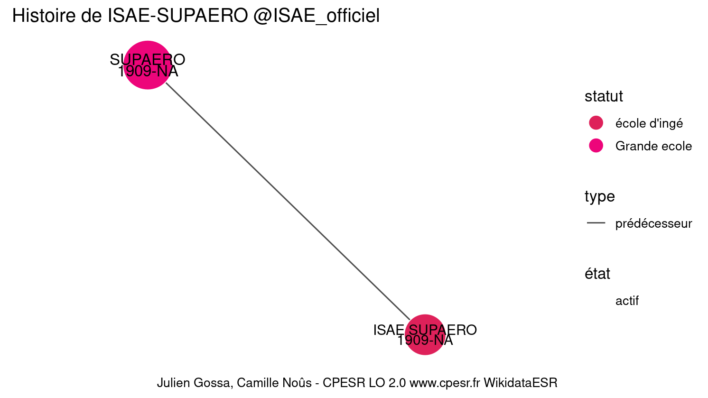 

Avertissements et édition : [logs](plots/etablissements/Q155446.md) 

### ISAE-SUPAERO @ISAE_officiel : Composition.     Edition des données : https://github.com/cpesr/wikidataESR/blob/master/plots/etablissements/Q155446.md 

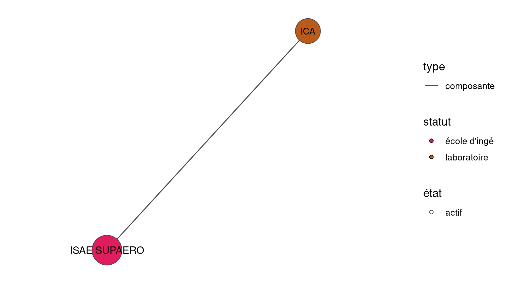 

Avertissements et édition : [logs](plots/etablissements/Q155446.md) 

### ISAE-SUPAERO @ISAE_officiel : Associations.     Edition des données : https://github.com/cpesr/wikidataESR/blob/master/plots/etablissements/Q155446.md 


Erreur : les données sont probablement trop partielles.
```
Error in wdesr_ggplot_graph(df, node_size = node_size, label_sizes = label_sizes, : Empty ESR graph: something went wrong with the graph production parameters

``` 

Avertissements et édition : [logs](plots/etablissements/Q155446.md) 

### École nationale supérieure des sciences de l'information et des bibliothèques @enssib : Histoire.     Edition des données : https://github.com/cpesr/wikidataESR/blob/master/plots/etablissements/Q2791269.md 


Erreur : les données sont probablement trop partielles.
```
Error in wdesr_ggplot_graph(df, node_size = node_size, label_sizes = label_sizes, : Empty ESR graph: something went wrong with the graph production parameters

``` 

Avertissements et édition : [logs](plots/etablissements/Q2791269.md) 

### École nationale supérieure des sciences de l'information et des bibliothèques @enssib : Composition.     Edition des données : https://github.com/cpesr/wikidataESR/blob/master/plots/etablissements/Q2791269.md 

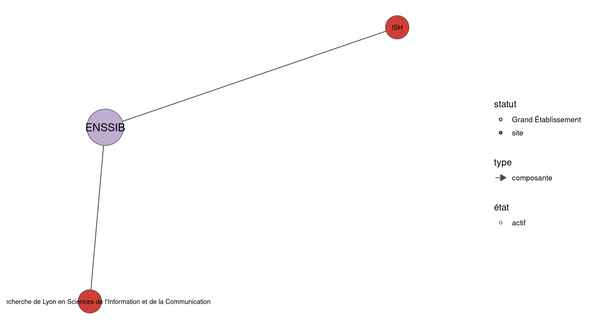 

Avertissements et édition : [logs](plots/etablissements/Q2791269.md) 

### École nationale supérieure des sciences de l'information et des bibliothèques @enssib : Associations.     Edition des données : https://github.com/cpesr/wikidataESR/blob/master/plots/etablissements/Q2791269.md 


Erreur : les données sont probablement trop partielles.
```
Error in wdesr_ggplot_graph(df, node_size = node_size, label_sizes = label_sizes, : Empty ESR graph: something went wrong with the graph production parameters

``` 

Avertissements et édition : [logs](plots/etablissements/Q2791269.md) 

### Institut national du sport, de l'expertise et de la performance @INSEP_PARIS : Histoire.     Edition des données : https://github.com/cpesr/wikidataESR/blob/master/plots/etablissements/Q3152447.md 

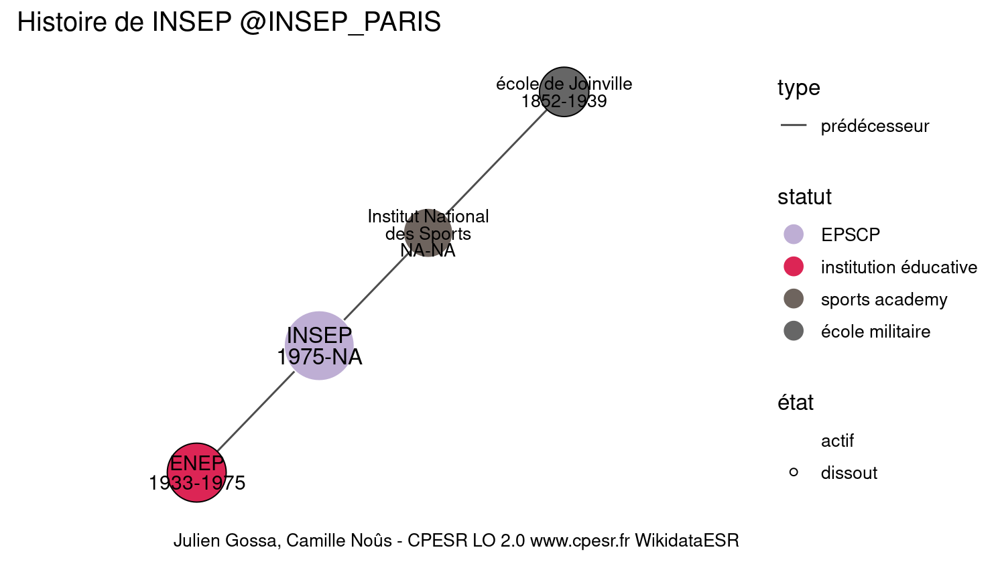 

Avertissements et édition : [logs](plots/etablissements/Q3152447.md) 

### Institut national du sport, de l'expertise et de la performance @INSEP_PARIS : Composition.     Edition des données : https://github.com/cpesr/wikidataESR/blob/master/plots/etablissements/Q3152447.md 


Erreur : les données sont probablement trop partielles.
```
Error in wdesr_ggplot_graph(df, node_size = node_size, label_sizes = label_sizes, : Empty ESR graph: something went wrong with the graph production parameters

``` 

Avertissements et édition : [logs](plots/etablissements/Q3152447.md) 

### Institut national du sport, de l'expertise et de la performance @INSEP_PARIS : Associations.     Edition des données : https://github.com/cpesr/wikidataESR/blob/master/plots/etablissements/Q3152447.md 


Erreur : les données sont probablement trop partielles.
```
Error in wdesr_ggplot_graph(df, node_size = node_size, label_sizes = label_sizes, : Empty ESR graph: something went wrong with the graph production parameters

``` 

Avertissements et édition : [logs](plots/etablissements/Q3152447.md) 

### Arts et Métiers @ArtsetMetiers_ : Histoire.     Edition des données : https://github.com/cpesr/wikidataESR/blob/master/plots/etablissements/Q2570220.md 


Erreur : les données sont probablement trop partielles.
```
Error in wdesr_ggplot_graph(df, node_size = node_size, label_sizes = label_sizes, : Empty ESR graph: something went wrong with the graph production parameters

``` 

Avertissements et édition : [logs](plots/etablissements/Q2570220.md) 

### Arts et Métiers @ArtsetMetiers_ : Composition.     Edition des données : https://github.com/cpesr/wikidataESR/blob/master/plots/etablissements/Q2570220.md 

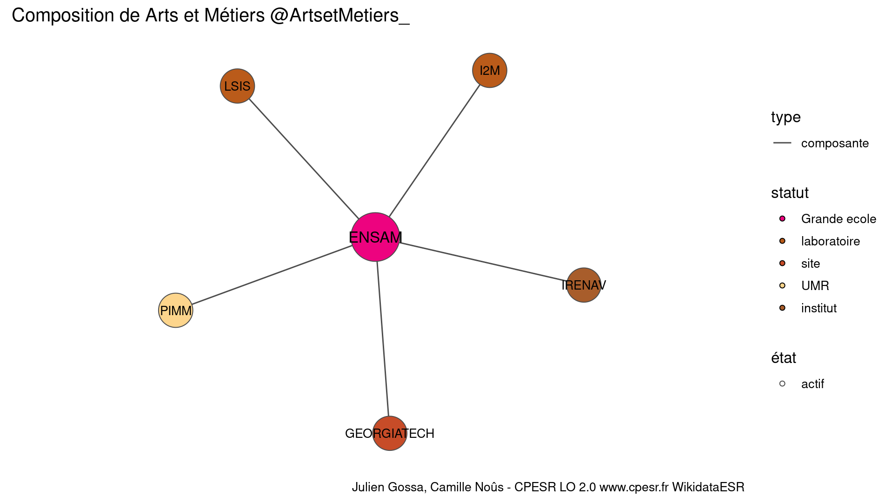 

Avertissements et édition : [logs](plots/etablissements/Q2570220.md) 

### Arts et Métiers @ArtsetMetiers_ : Associations.     Edition des données : https://github.com/cpesr/wikidataESR/blob/master/plots/etablissements/Q2570220.md 

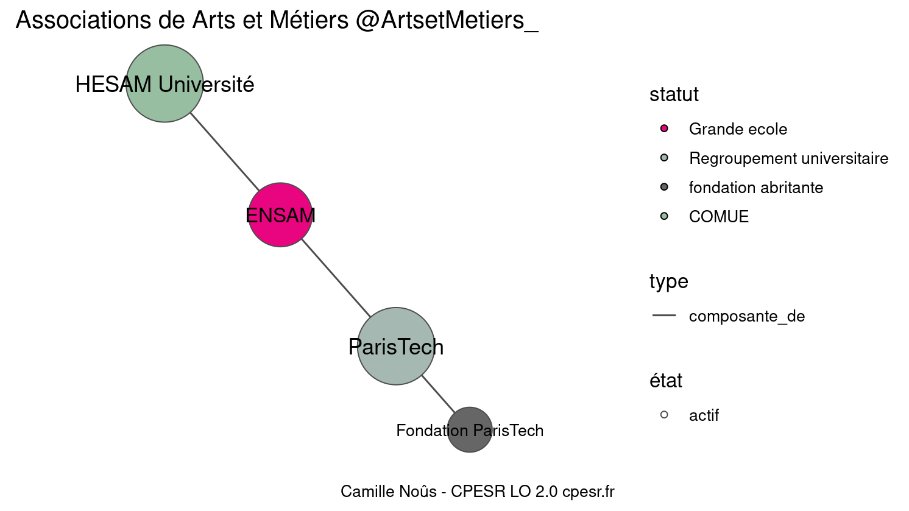 

Avertissements et édition : [logs](plots/etablissements/Q2570220.md) 

## Regroupements 

### COMUE d'Aquitaine : Regroupement Court.     Edition des données : https://github.com/cpesr/wikidataESR/blob/master/plots/regroupements/Q16541346.md 

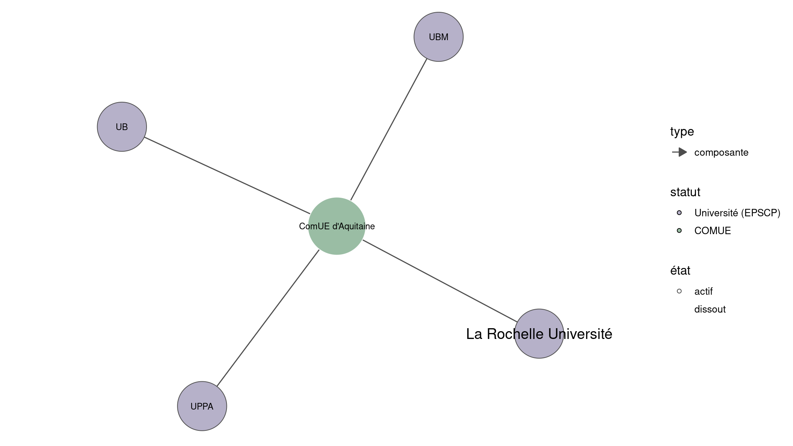 

Avertissements et édition : [logs](plots/regroupements/Q16541346.md) 

### COMUE d'Aquitaine : Regroupement Etendu.     Edition des données : https://github.com/cpesr/wikidataESR/blob/master/plots/regroupements/Q16541346.md 

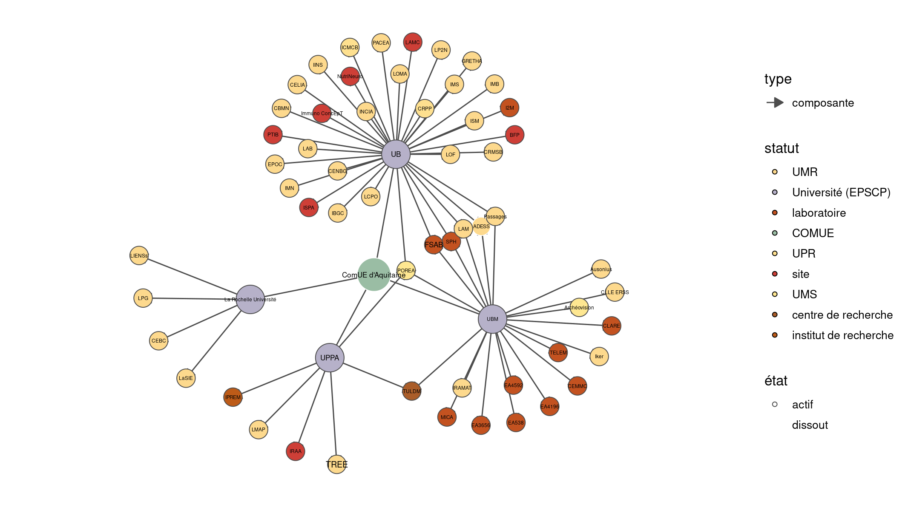 

Avertissements et édition : [logs](plots/regroupements/Q16541346.md) 

### COMUE d'Aquitaine : Regroupement Superetendu.     Edition des données : https://github.com/cpesr/wikidataESR/blob/master/plots/regroupements/Q16541346.md 

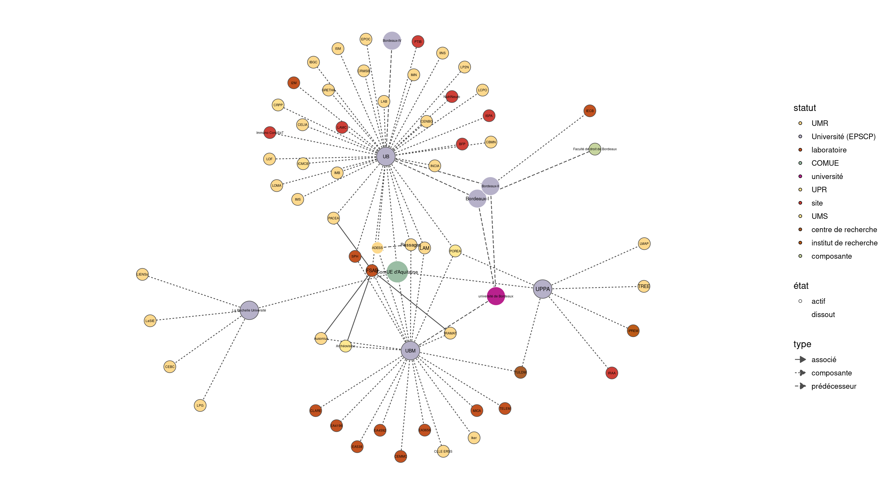 

Avertissements et édition : [logs](plots/regroupements/Q16541346.md) 

### COMUE d'Aquitaine : Regroupement Court.     Edition des données : https://github.com/cpesr/wikidataESR/blob/master/plots/regroupements/Q13344.md 

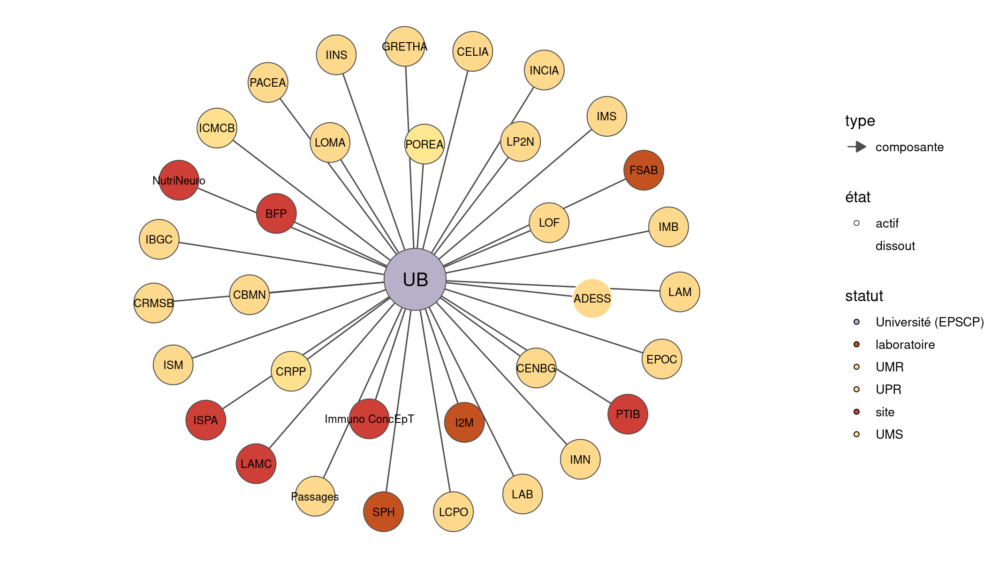 

Avertissements et édition : [logs](plots/regroupements/Q13344.md) 

### COMUE d'Aquitaine : Regroupement Etendu.     Edition des données : https://github.com/cpesr/wikidataESR/blob/master/plots/regroupements/Q13344.md 

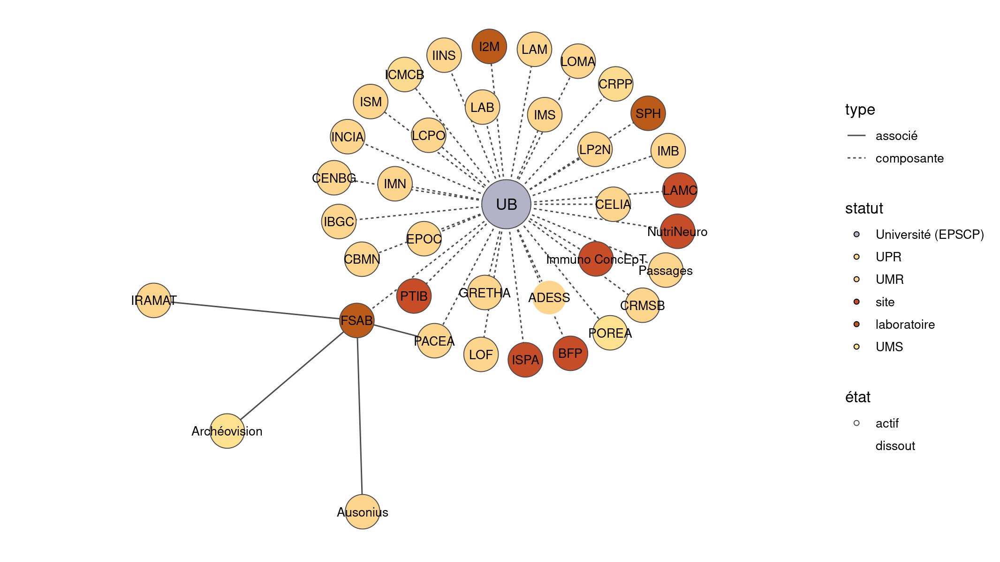 

Avertissements et édition : [logs](plots/regroupements/Q13344.md) 

### COMUE d'Aquitaine : Regroupement Superetendu.     Edition des données : https://github.com/cpesr/wikidataESR/blob/master/plots/regroupements/Q13344.md 

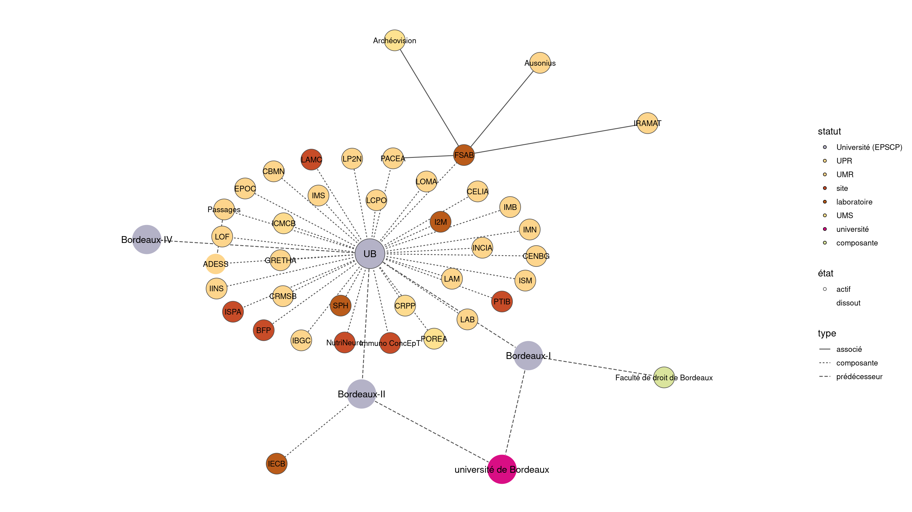 

Avertissements et édition : [logs](plots/regroupements/Q13344.md) 

### COMUE Centre Val de Loire : Regroupement Court.     Edition des données : https://github.com/cpesr/wikidataESR/blob/master/plots/regroupements/Q2944885.md 

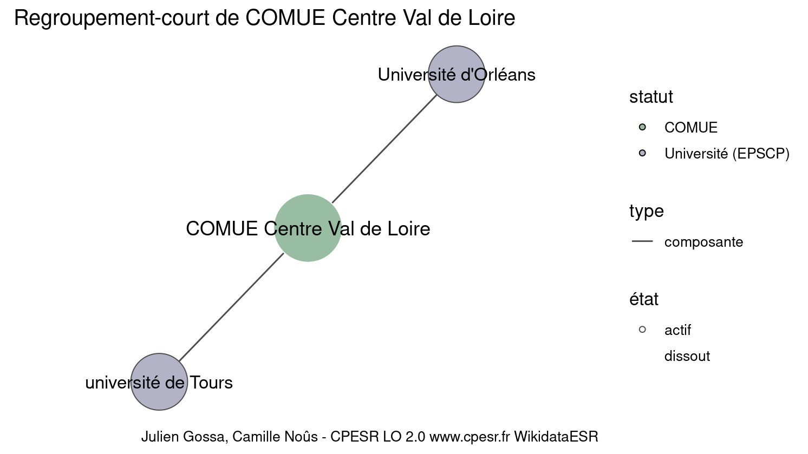 

Avertissements et édition : [logs](plots/regroupements/Q2944885.md) 

### COMUE Centre Val de Loire : Regroupement Etendu.     Edition des données : https://github.com/cpesr/wikidataESR/blob/master/plots/regroupements/Q2944885.md 

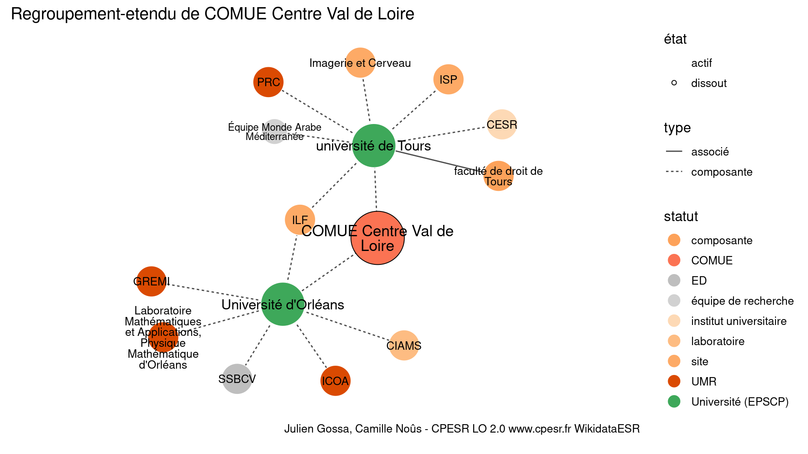 

Avertissements et édition : [logs](plots/regroupements/Q2944885.md) 

### COMUE Centre Val de Loire : Regroupement Superetendu.     Edition des données : https://github.com/cpesr/wikidataESR/blob/master/plots/regroupements/Q2944885.md 

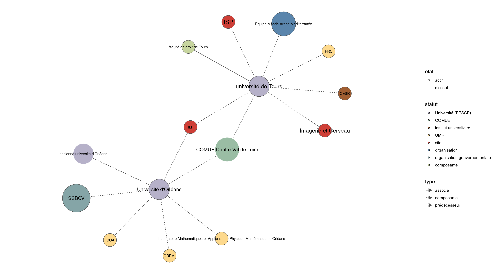 

Avertissements et édition : [logs](plots/regroupements/Q2944885.md) 

### Comue de Bourgogne Franche Comté : Regroupement Court.     Edition des données : https://github.com/cpesr/wikidataESR/blob/master/plots/regroupements/Q3359833.md 

 

Avertissements et édition : [logs](plots/regroupements/Q3359833.md) 

### Comue de Bourgogne Franche Comté : Regroupement Etendu.     Edition des données : https://github.com/cpesr/wikidataESR/blob/master/plots/regroupements/Q3359833.md 

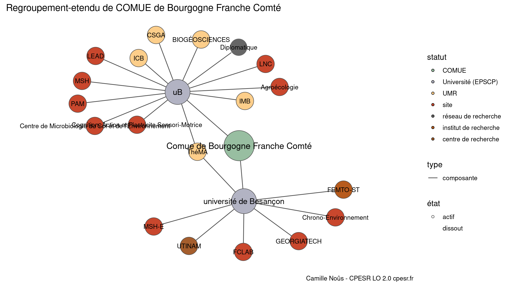 

Avertissements et édition : [logs](plots/regroupements/Q3359833.md) 

### Comue de Bourgogne Franche Comté : Regroupement Superetendu.     Edition des données : https://github.com/cpesr/wikidataESR/blob/master/plots/regroupements/Q3359833.md 

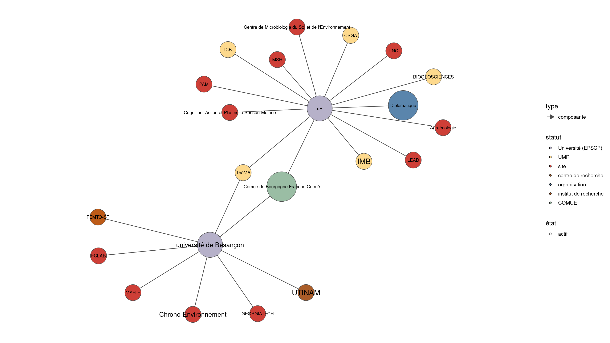 

Avertissements et édition : [logs](plots/regroupements/Q3359833.md) 

### Comue de Toulouse : Regroupement Court.     Edition des données : https://github.com/cpesr/wikidataESR/blob/master/plots/regroupements/Q20669873.md 

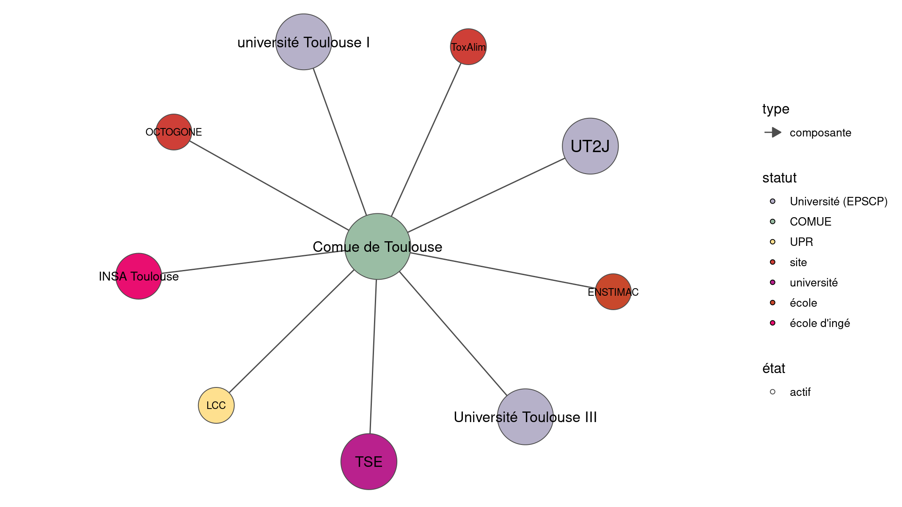 

Avertissements et édition : [logs](plots/regroupements/Q20669873.md) 

### Comue de Toulouse : Regroupement Etendu.     Edition des données : https://github.com/cpesr/wikidataESR/blob/master/plots/regroupements/Q20669873.md 

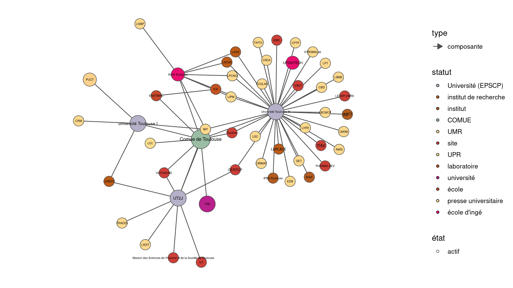 

Avertissements et édition : [logs](plots/regroupements/Q20669873.md) 

### Comue de Toulouse : Regroupement Superetendu.     Edition des données : https://github.com/cpesr/wikidataESR/blob/master/plots/regroupements/Q20669873.md 

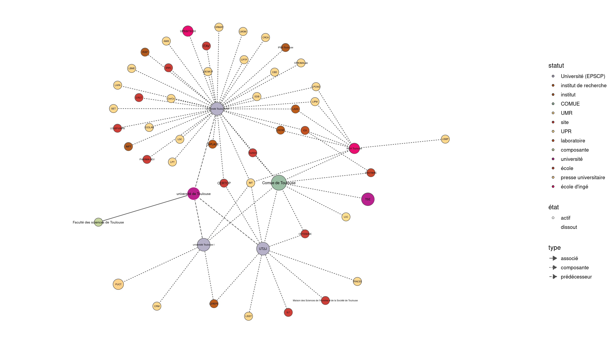 

Avertissements et édition : [logs](plots/regroupements/Q20669873.md) 

### Comue UCA : Regroupement Court.     Edition des données : https://github.com/cpesr/wikidataESR/blob/master/plots/regroupements/Q19370961.md 

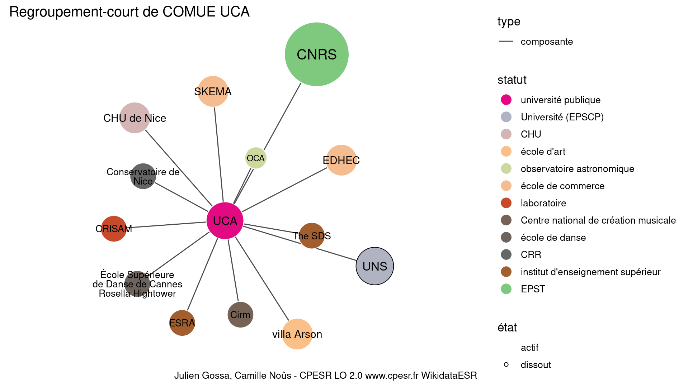 

Avertissements et édition : [logs](plots/regroupements/Q19370961.md) 

### Comue UCA : Regroupement Etendu.     Edition des données : https://github.com/cpesr/wikidataESR/blob/master/plots/regroupements/Q19370961.md 

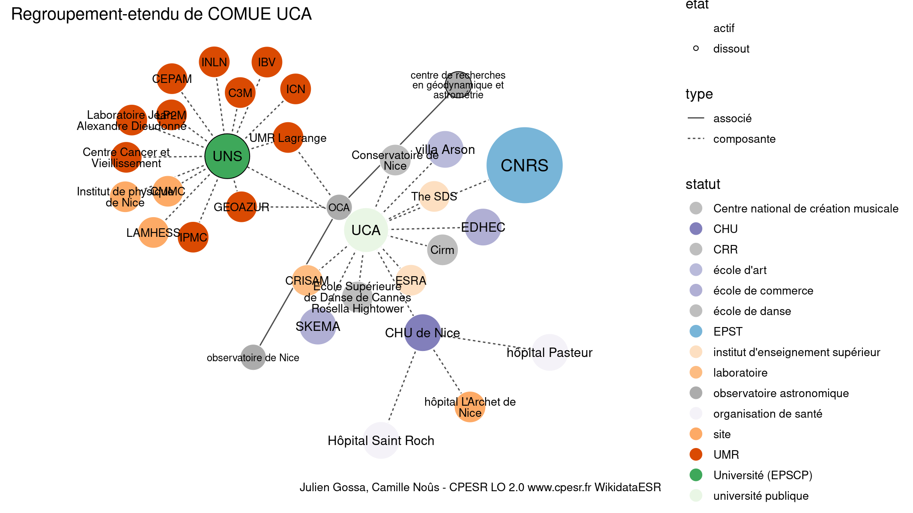 

Avertissements et édition : [logs](plots/regroupements/Q19370961.md) 

### Comue UCA : Regroupement Superetendu.     Edition des données : https://github.com/cpesr/wikidataESR/blob/master/plots/regroupements/Q19370961.md 

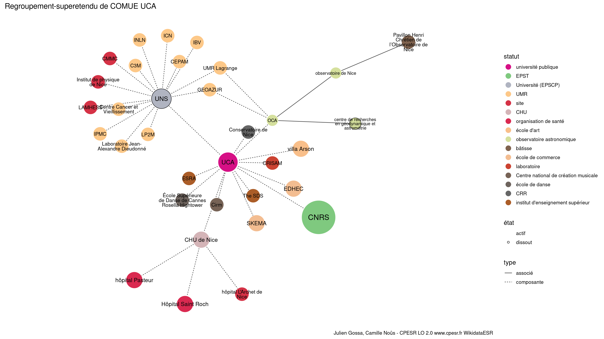 

Avertissements et édition : [logs](plots/regroupements/Q19370961.md) 

### Comue UGA : Regroupement Court.     Edition des données : https://github.com/cpesr/wikidataESR/blob/master/plots/regroupements/Q3551589.md 

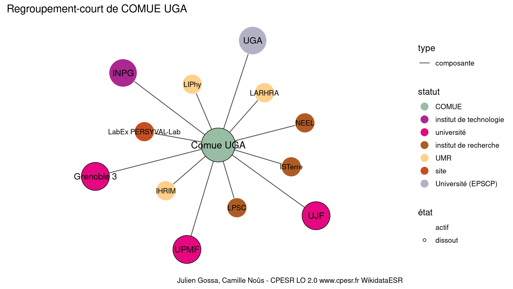 

Avertissements et édition : [logs](plots/regroupements/Q3551589.md) 

### Comue UGA : Regroupement Etendu.     Edition des données : https://github.com/cpesr/wikidataESR/blob/master/plots/regroupements/Q3551589.md 

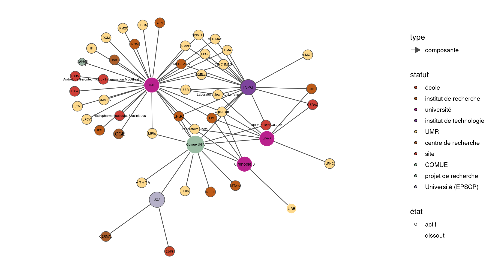 

Avertissements et édition : [logs](plots/regroupements/Q3551589.md) 

### Comue UGA : Regroupement Superetendu.     Edition des données : https://github.com/cpesr/wikidataESR/blob/master/plots/regroupements/Q3551589.md 

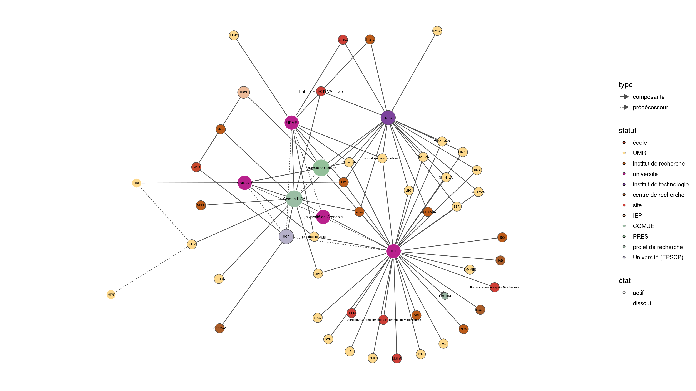 

Avertissements et édition : [logs](plots/regroupements/Q3551589.md) 

### HESAM : Regroupement Court.     Edition des données : https://github.com/cpesr/wikidataESR/blob/master/plots/regroupements/Q3128622.md 

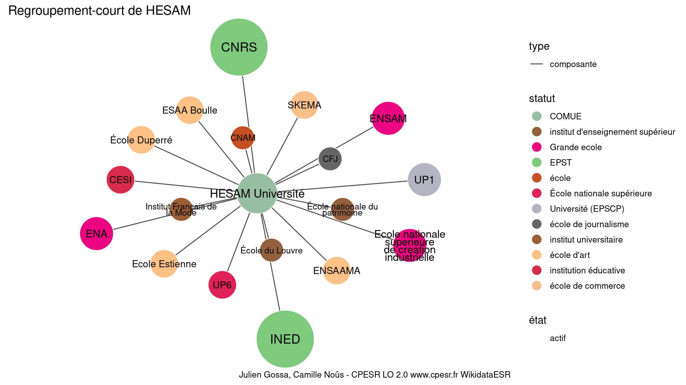 

Avertissements et édition : [logs](plots/regroupements/Q3128622.md) 

### HESAM : Regroupement Etendu.     Edition des données : https://github.com/cpesr/wikidataESR/blob/master/plots/regroupements/Q3128622.md 

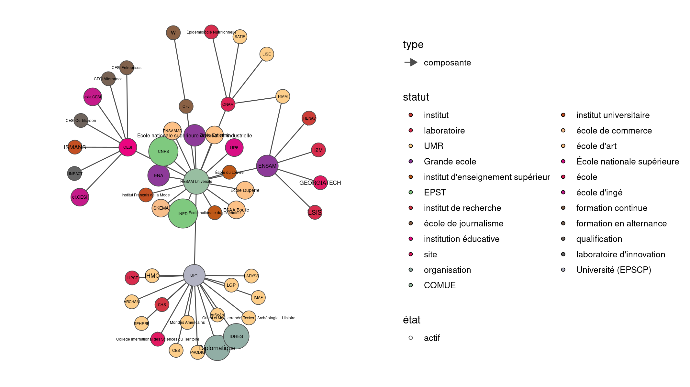 

Avertissements et édition : [logs](plots/regroupements/Q3128622.md) 

### HESAM : Regroupement Superetendu.     Edition des données : https://github.com/cpesr/wikidataESR/blob/master/plots/regroupements/Q3128622.md 

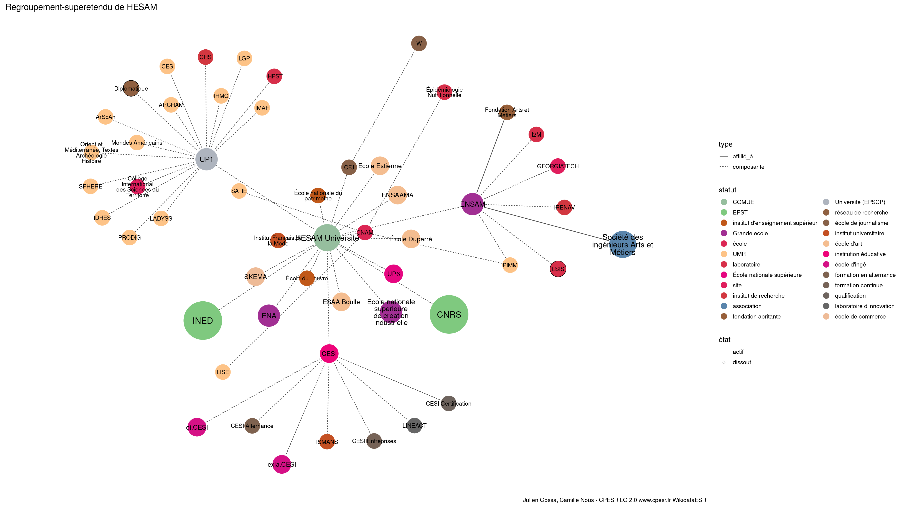 

Avertissements et édition : [logs](plots/regroupements/Q3128622.md) 

### Languedoc Roussillon Universités : Regroupement Court.     Edition des données : https://github.com/cpesr/wikidataESR/blob/master/plots/regroupements/Q2476558.md 

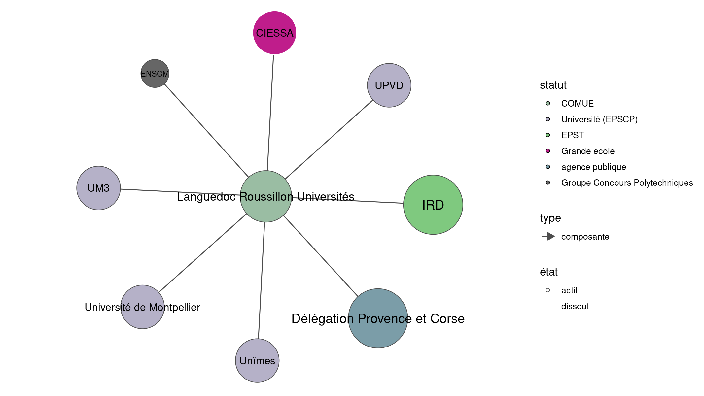 

Avertissements et édition : [logs](plots/regroupements/Q2476558.md) 

### Languedoc Roussillon Universités : Regroupement Etendu.     Edition des données : https://github.com/cpesr/wikidataESR/blob/master/plots/regroupements/Q2476558.md 

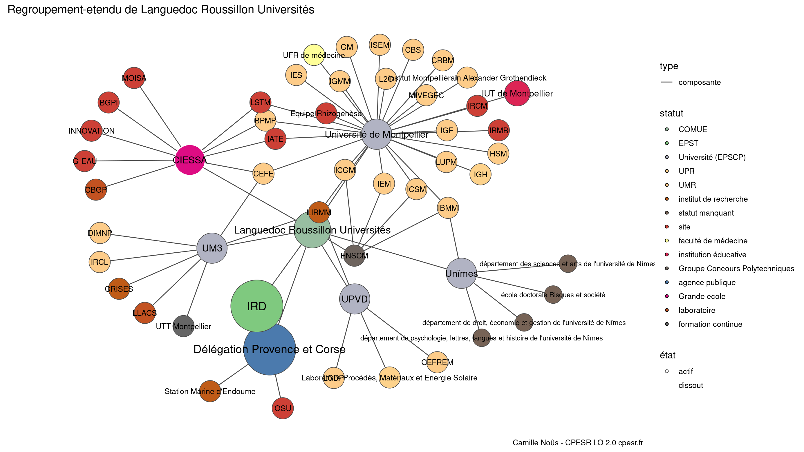 

Avertissements et édition : [logs](plots/regroupements/Q2476558.md) 

### Languedoc Roussillon Universités : Regroupement Superetendu.     Edition des données : https://github.com/cpesr/wikidataESR/blob/master/plots/regroupements/Q2476558.md 

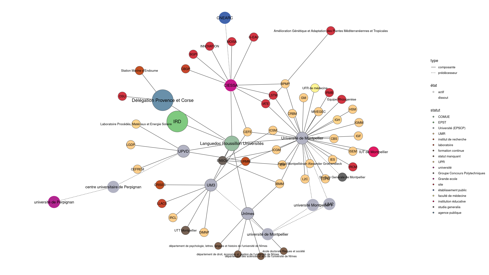 

Avertissements et édition : [logs](plots/regroupements/Q2476558.md) 

### Normandie Université : Regroupement Court.     Edition des données : https://github.com/cpesr/wikidataESR/blob/master/plots/regroupements/Q3343880.md 

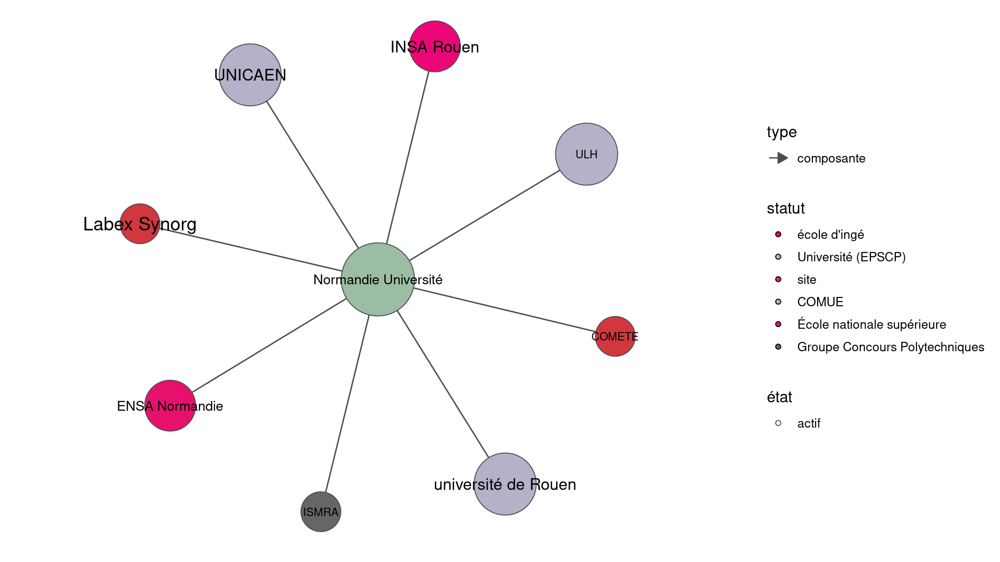 

Avertissements et édition : [logs](plots/regroupements/Q3343880.md) 

### Normandie Université : Regroupement Etendu.     Edition des données : https://github.com/cpesr/wikidataESR/blob/master/plots/regroupements/Q3343880.md 

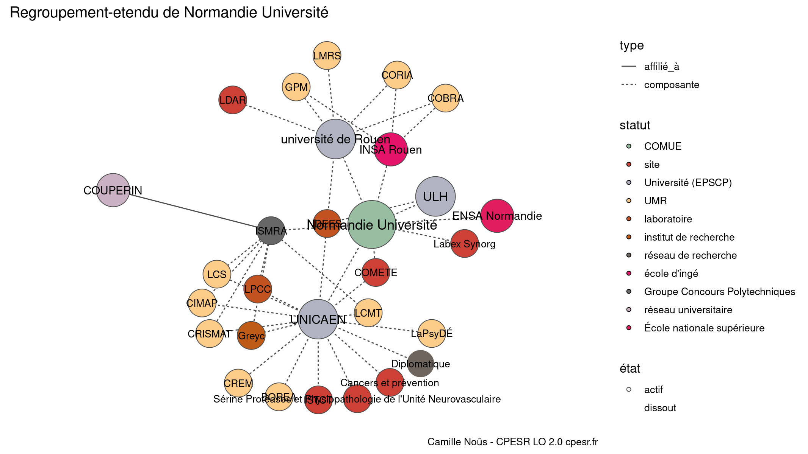 

Avertissements et édition : [logs](plots/regroupements/Q3343880.md) 

### Normandie Université : Regroupement Superetendu.     Edition des données : https://github.com/cpesr/wikidataESR/blob/master/plots/regroupements/Q3343880.md 

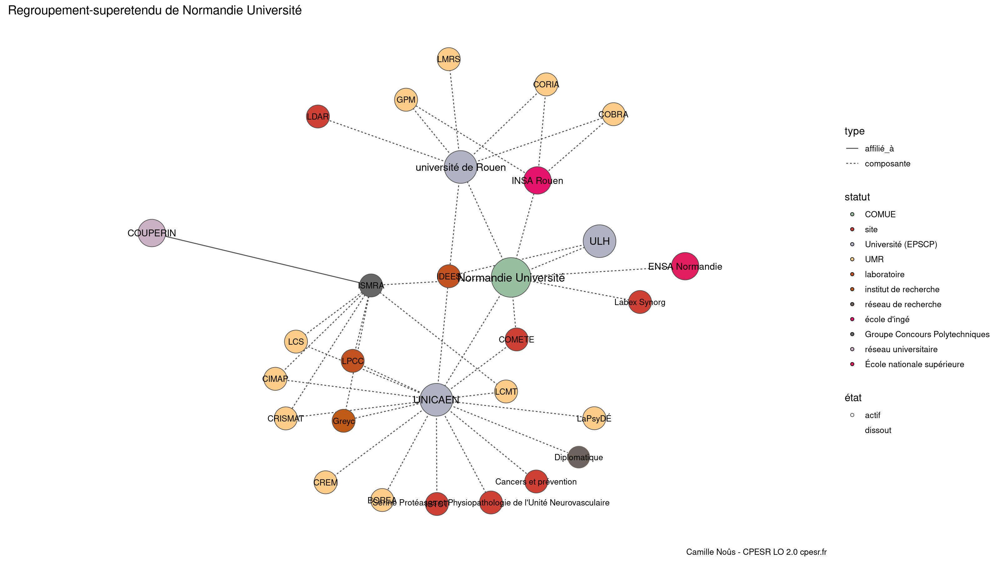 

Avertissements et édition : [logs](plots/regroupements/Q3343880.md) 

### Picardie Universités : Regroupement Court.     Edition des données : https://github.com/cpesr/wikidataESR/blob/master/plots/regroupements/Q61716197.md 

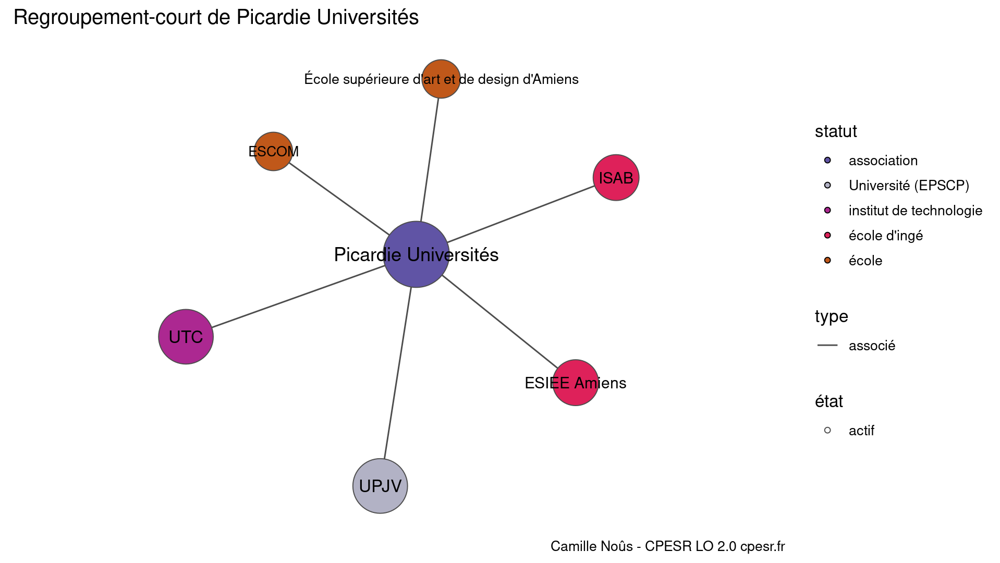 

Avertissements et édition : [logs](plots/regroupements/Q61716197.md) 

### Picardie Universités : Regroupement Etendu.     Edition des données : https://github.com/cpesr/wikidataESR/blob/master/plots/regroupements/Q61716197.md 

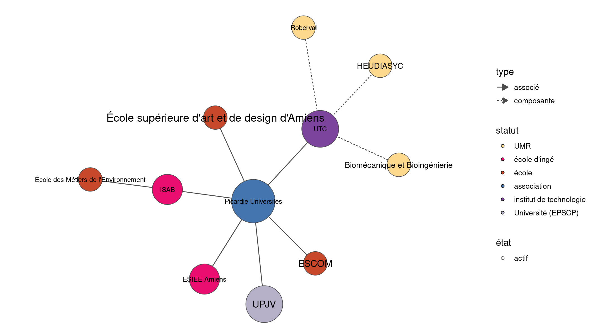 

Avertissements et édition : [logs](plots/regroupements/Q61716197.md) 

### Picardie Universités : Regroupement Superetendu.     Edition des données : https://github.com/cpesr/wikidataESR/blob/master/plots/regroupements/Q61716197.md 

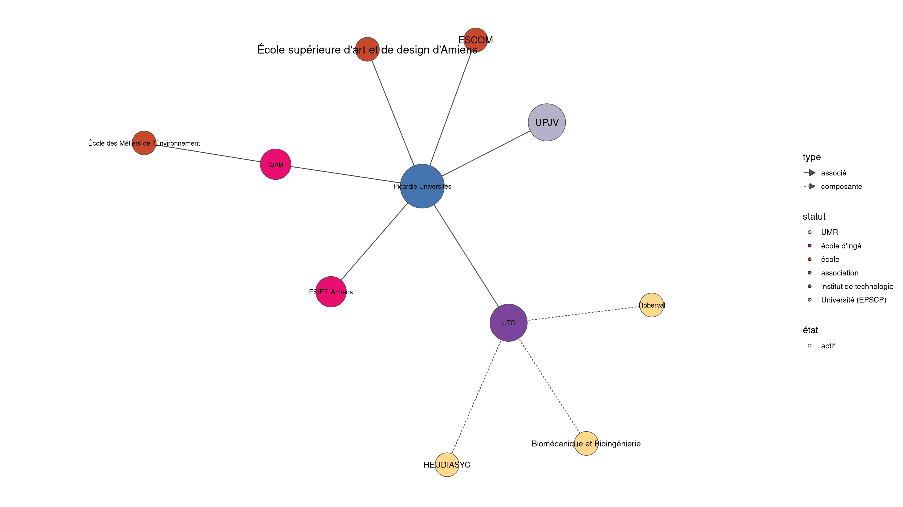 

Avertissements et édition : [logs](plots/regroupements/Q61716197.md) 

### PSL : Regroupement Court.     Edition des données : https://github.com/cpesr/wikidataESR/blob/master/plots/regroupements/Q1163431.md 

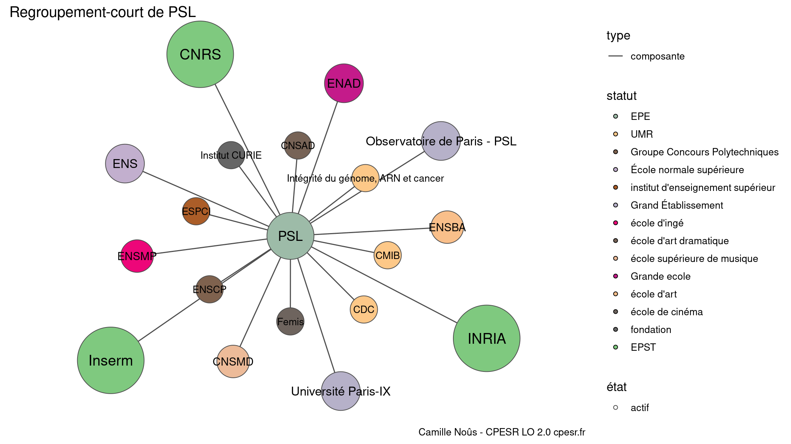 

Avertissements et édition : [logs](plots/regroupements/Q1163431.md) 

### PSL : Regroupement Etendu.     Edition des données : https://github.com/cpesr/wikidataESR/blob/master/plots/regroupements/Q1163431.md 

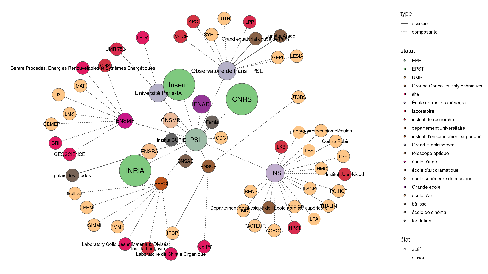 

Avertissements et édition : [logs](plots/regroupements/Q1163431.md) 

### PSL : Regroupement Superetendu.     Edition des données : https://github.com/cpesr/wikidataESR/blob/master/plots/regroupements/Q1163431.md 

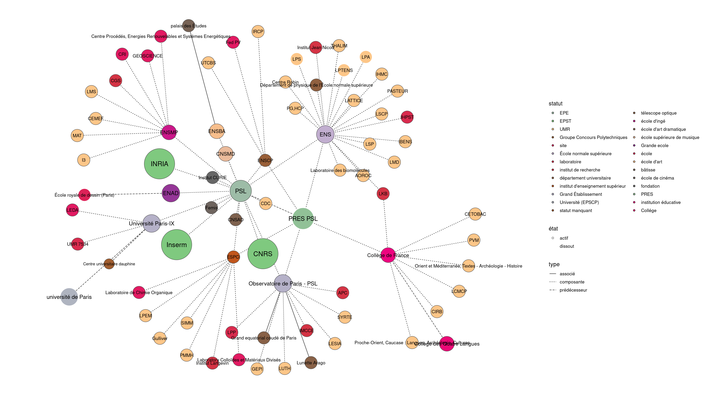 

Avertissements et édition : [logs](plots/regroupements/Q1163431.md) 

### Site alsacien : Regroupement Court.     Edition des données : https://github.com/cpesr/wikidataESR/blob/master/plots/regroupements/Q61716176.md 

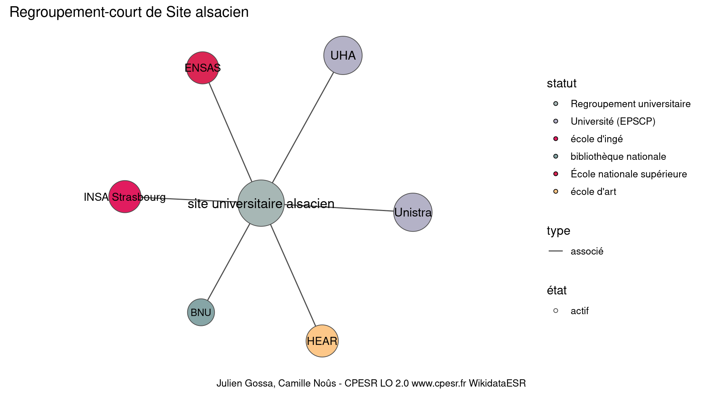 

Avertissements et édition : [logs](plots/regroupements/Q61716176.md) 

### Site alsacien : Regroupement Etendu.     Edition des données : https://github.com/cpesr/wikidataESR/blob/master/plots/regroupements/Q61716176.md 

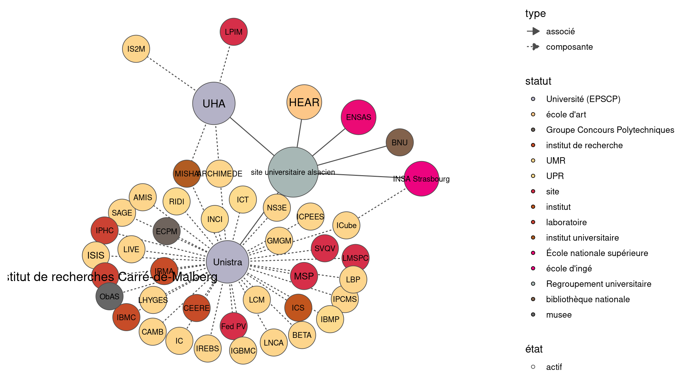 

Avertissements et édition : [logs](plots/regroupements/Q61716176.md) 

### Site alsacien : Regroupement Superetendu.     Edition des données : https://github.com/cpesr/wikidataESR/blob/master/plots/regroupements/Q61716176.md 

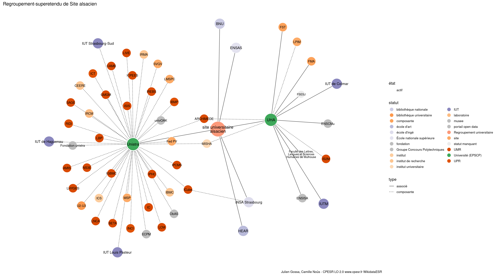 

Avertissements et édition : [logs](plots/regroupements/Q61716176.md) 

### Site AMPM : Regroupement Court.     Edition des données : https://github.com/cpesr/wikidataESR/blob/master/plots/regroupements/Q61716142.md 

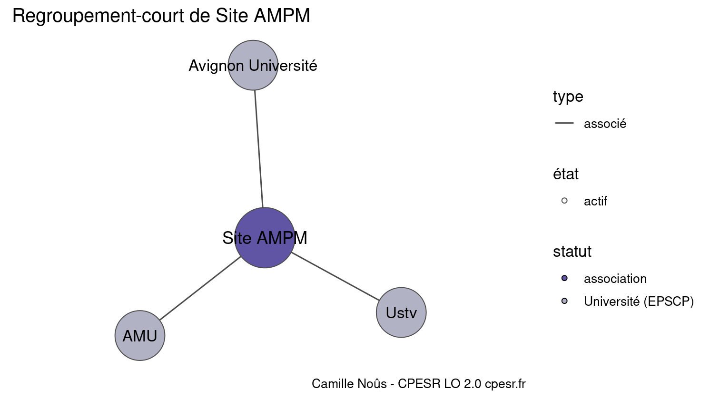 

Avertissements et édition : [logs](plots/regroupements/Q61716142.md) 

### Site AMPM : Regroupement Etendu.     Edition des données : https://github.com/cpesr/wikidataESR/blob/master/plots/regroupements/Q61716142.md 

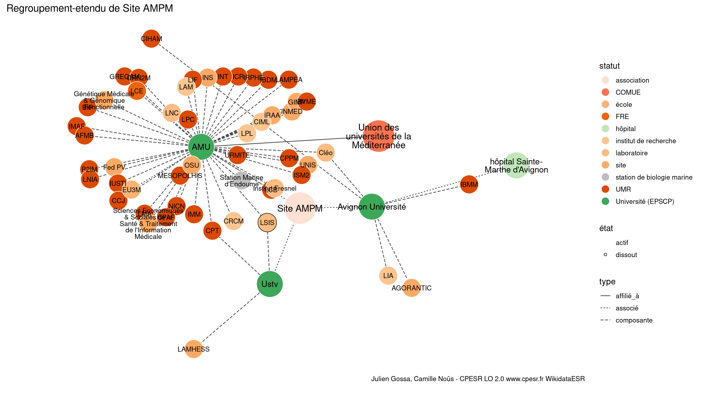 

Avertissements et édition : [logs](plots/regroupements/Q61716142.md) 

### Site AMPM : Regroupement Superetendu.     Edition des données : https://github.com/cpesr/wikidataESR/blob/master/plots/regroupements/Q61716142.md 

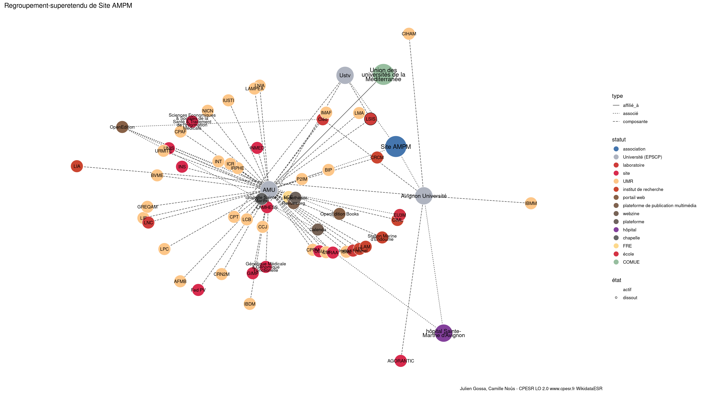 

Avertissements et édition : [logs](plots/regroupements/Q61716142.md) 

### Site champenois : Regroupement Court.     Edition des données : https://github.com/cpesr/wikidataESR/blob/master/plots/regroupements/Q61716216.md 

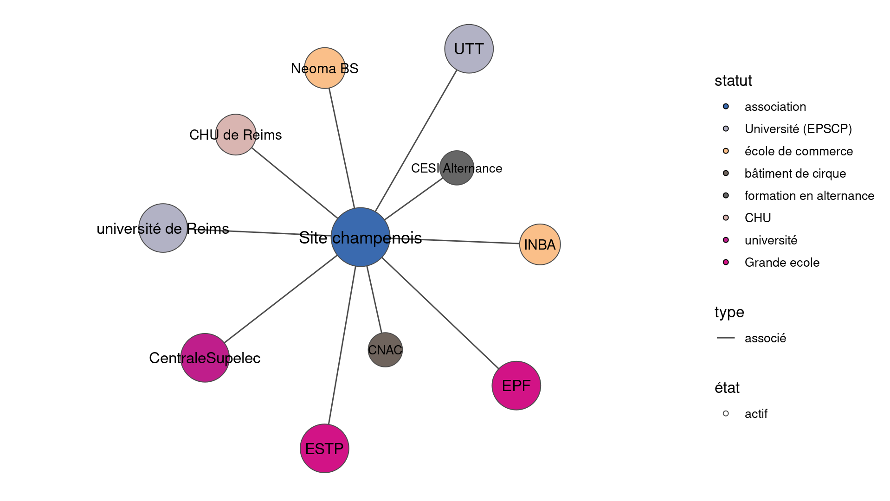 

Avertissements et édition : [logs](plots/regroupements/Q61716216.md) 

### Site champenois : Regroupement Etendu.     Edition des données : https://github.com/cpesr/wikidataESR/blob/master/plots/regroupements/Q61716216.md 

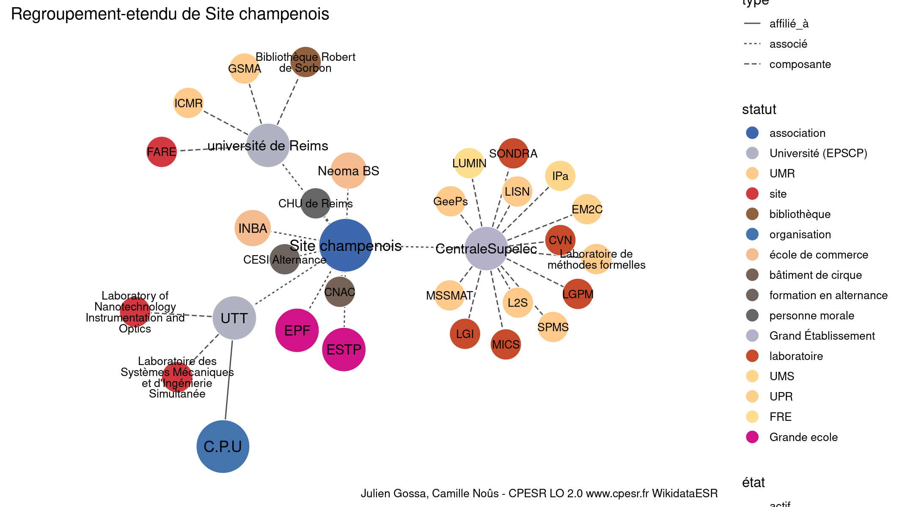 

Avertissements et édition : [logs](plots/regroupements/Q61716216.md) 

### Site champenois : Regroupement Superetendu.     Edition des données : https://github.com/cpesr/wikidataESR/blob/master/plots/regroupements/Q61716216.md 

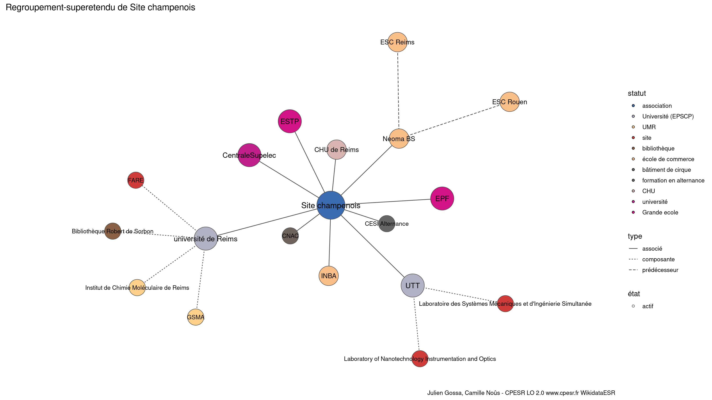 

Avertissements et édition : [logs](plots/regroupements/Q61716216.md) 

### Sorbonne Paris Cité : Regroupement Court.     Edition des données : https://github.com/cpesr/wikidataESR/blob/master/plots/regroupements/Q3491149.md 

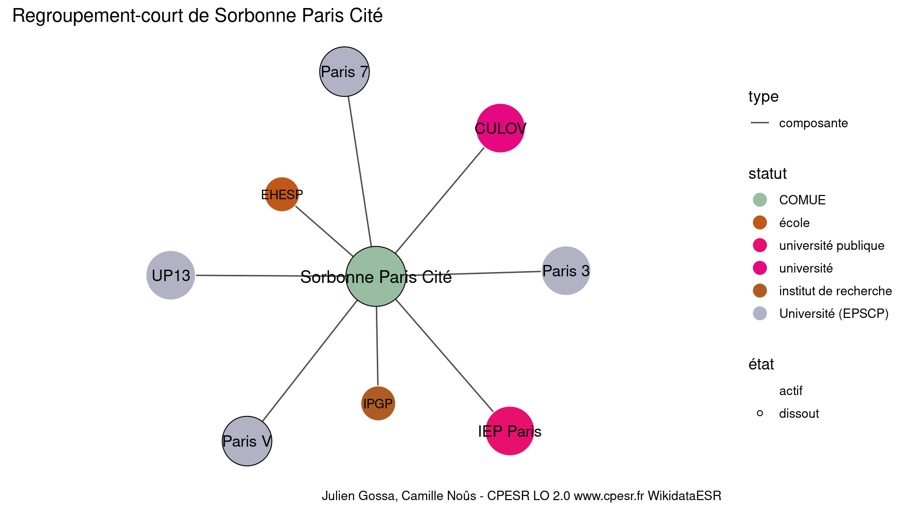 

Avertissements et édition : [logs](plots/regroupements/Q3491149.md) 

### Sorbonne Paris Cité : Regroupement Etendu.     Edition des données : https://github.com/cpesr/wikidataESR/blob/master/plots/regroupements/Q3491149.md 

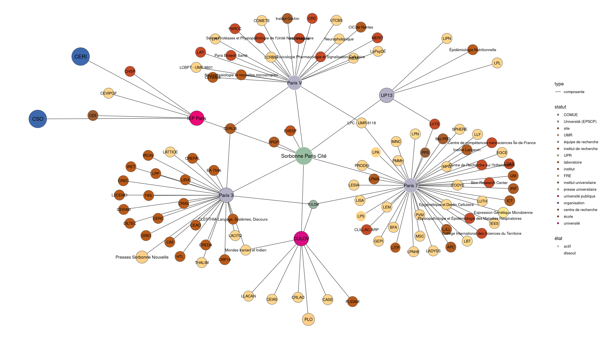 

Avertissements et édition : [logs](plots/regroupements/Q3491149.md) 

### Sorbonne Paris Cité : Regroupement Superetendu.     Edition des données : https://github.com/cpesr/wikidataESR/blob/master/plots/regroupements/Q3491149.md 

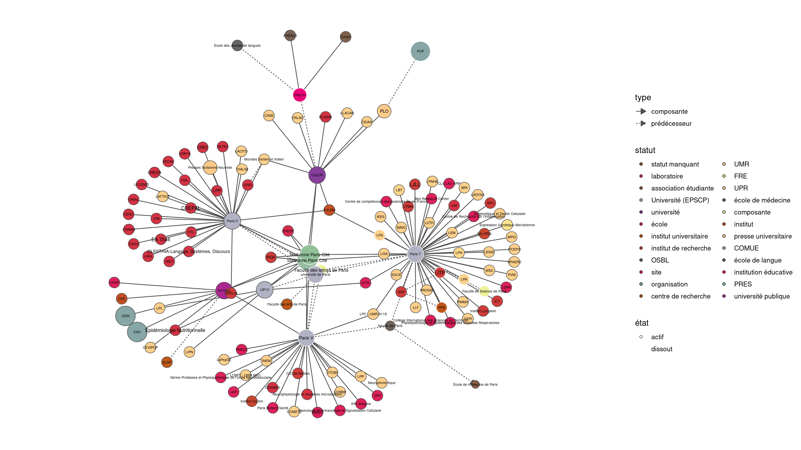 

Avertissements et édition : [logs](plots/regroupements/Q3491149.md) 

### Sorbonne Université : Regroupement Court.     Edition des données : https://github.com/cpesr/wikidataESR/blob/master/plots/regroupements/Q61716212.md 

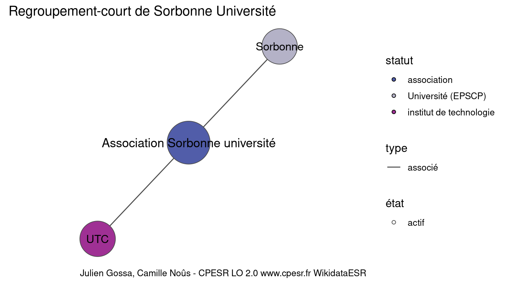 

Avertissements et édition : [logs](plots/regroupements/Q61716212.md) 

### Sorbonne Université : Regroupement Etendu.     Edition des données : https://github.com/cpesr/wikidataESR/blob/master/plots/regroupements/Q61716212.md 

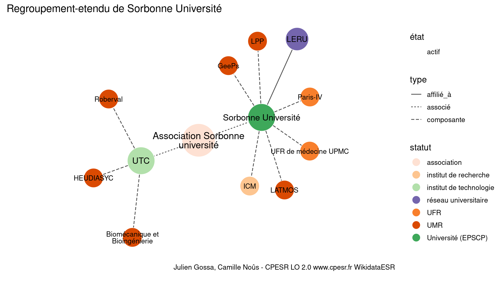 

Avertissements et édition : [logs](plots/regroupements/Q61716212.md) 

### Sorbonne Université : Regroupement Superetendu.     Edition des données : https://github.com/cpesr/wikidataESR/blob/master/plots/regroupements/Q61716212.md 

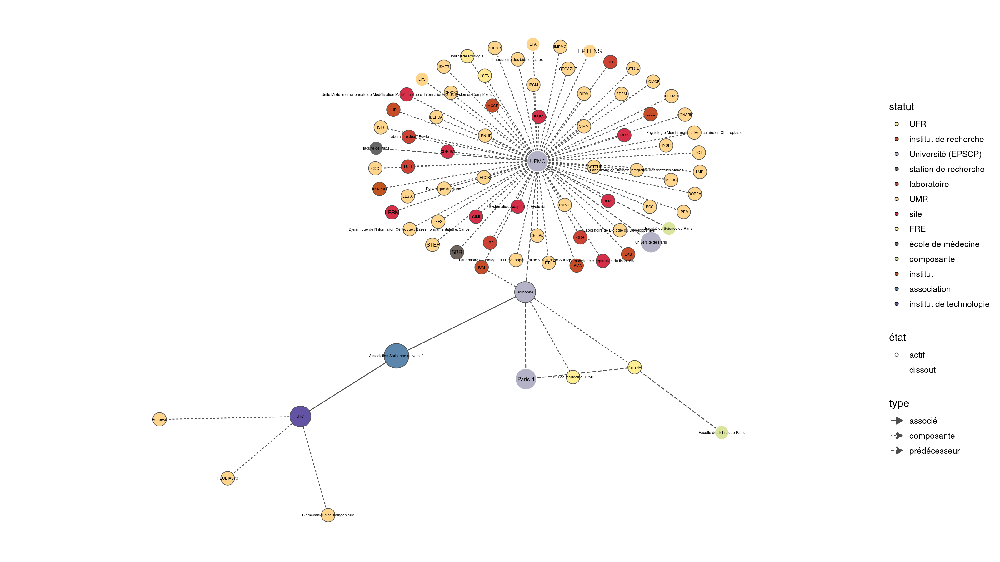 

Avertissements et édition : [logs](plots/regroupements/Q61716212.md) 

### UBL : Regroupement Court.     Edition des données : https://github.com/cpesr/wikidataESR/blob/master/plots/regroupements/Q21994834.md 

 

Avertissements et édition : [logs](plots/regroupements/Q21994834.md) 

### UBL : Regroupement Etendu.     Edition des données : https://github.com/cpesr/wikidataESR/blob/master/plots/regroupements/Q21994834.md 

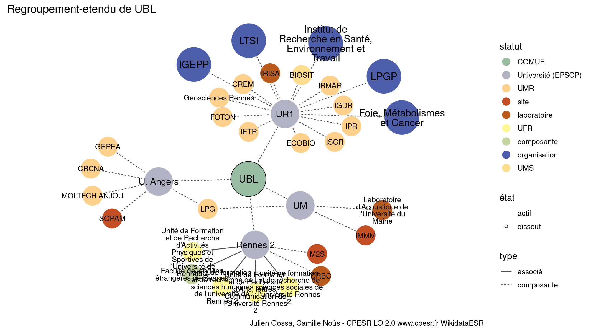 

Avertissements et édition : [logs](plots/regroupements/Q21994834.md) 

### UBL : Regroupement Superetendu.     Edition des données : https://github.com/cpesr/wikidataESR/blob/master/plots/regroupements/Q21994834.md 

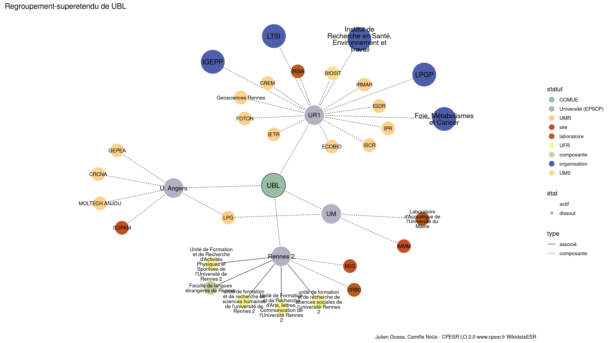 

Avertissements et édition : [logs](plots/regroupements/Q21994834.md) 

### UCA : Regroupement Court.     Edition des données : https://github.com/cpesr/wikidataESR/blob/master/plots/regroupements/Q61716190.md 

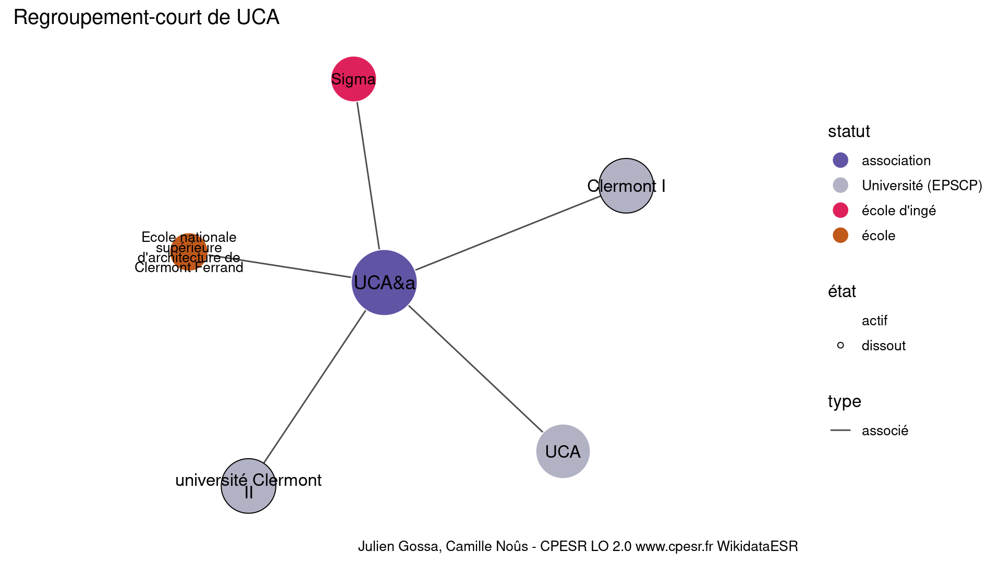 

Avertissements et édition : [logs](plots/regroupements/Q61716190.md) 

### UCA : Regroupement Etendu.     Edition des données : https://github.com/cpesr/wikidataESR/blob/master/plots/regroupements/Q61716190.md 

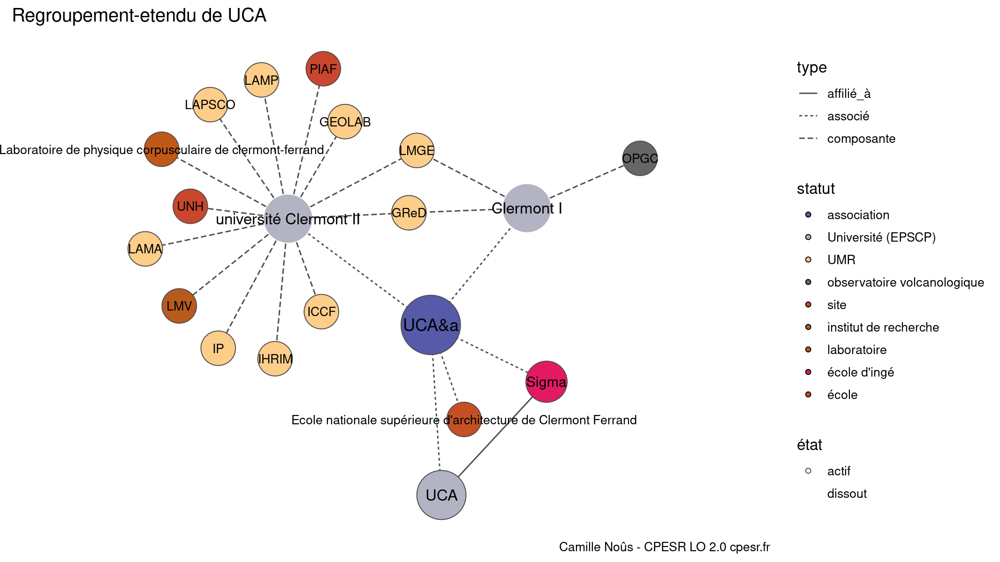 

Avertissements et édition : [logs](plots/regroupements/Q61716190.md) 

### UCA : Regroupement Superetendu.     Edition des données : https://github.com/cpesr/wikidataESR/blob/master/plots/regroupements/Q61716190.md 

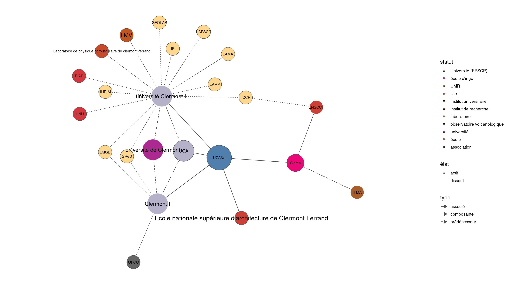 

Avertissements et édition : [logs](plots/regroupements/Q61716190.md) 

### UDL : Regroupement Court.     Edition des données : https://github.com/cpesr/wikidataESR/blob/master/plots/regroupements/Q10176.md 

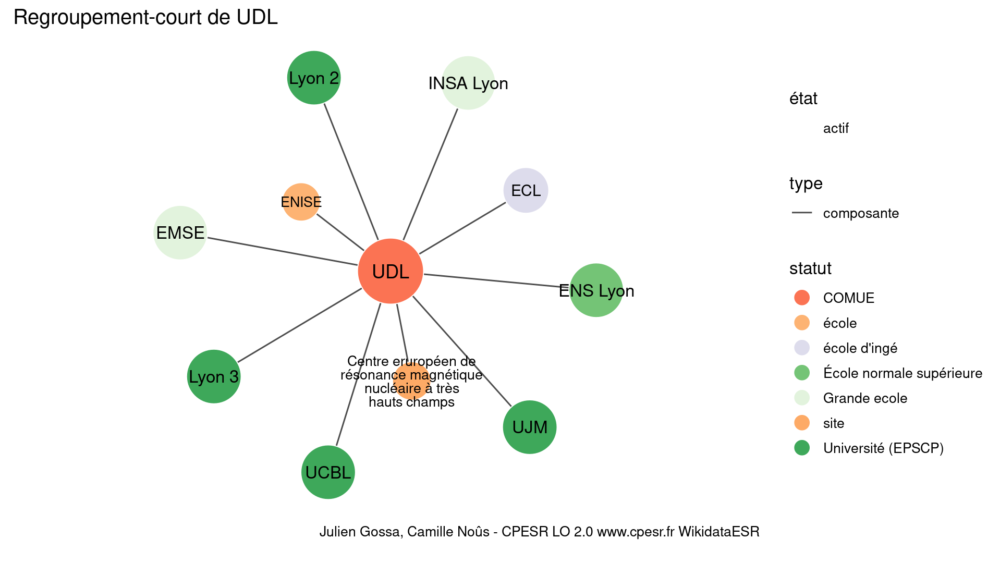 

Avertissements et édition : [logs](plots/regroupements/Q10176.md) 

### UDL : Regroupement Etendu.     Edition des données : https://github.com/cpesr/wikidataESR/blob/master/plots/regroupements/Q10176.md 

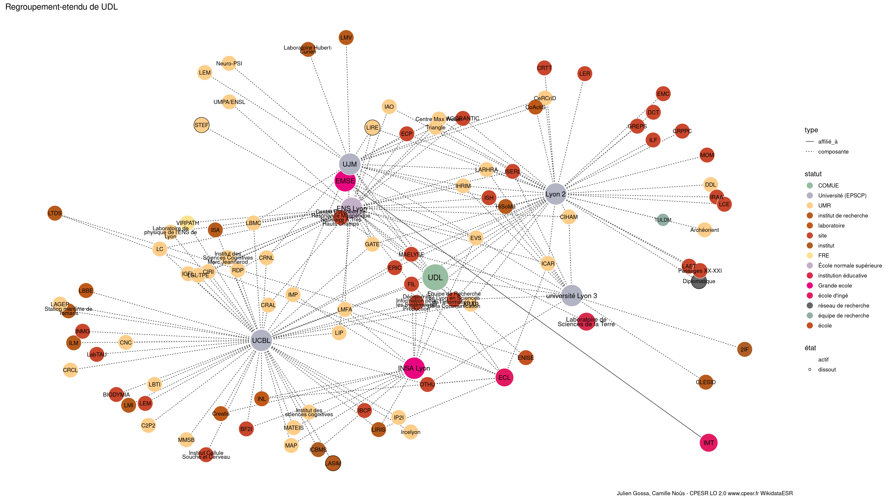 

Avertissements et édition : [logs](plots/regroupements/Q10176.md) 

### UDL : Regroupement Superetendu.     Edition des données : https://github.com/cpesr/wikidataESR/blob/master/plots/regroupements/Q10176.md 

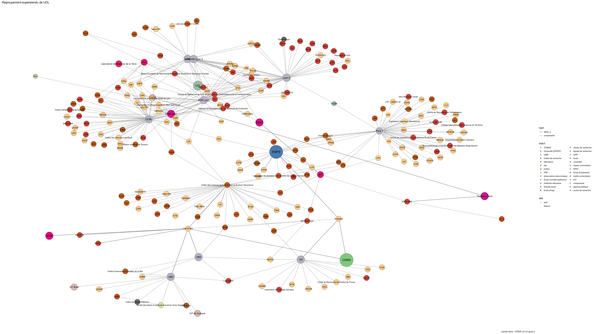 

Avertissements et édition : [logs](plots/regroupements/Q10176.md) 

### Université confédérale Léonard-de-Vinci : Regroupement Court.     Edition des données : https://github.com/cpesr/wikidataESR/blob/master/plots/regroupements/Q20735682.md 

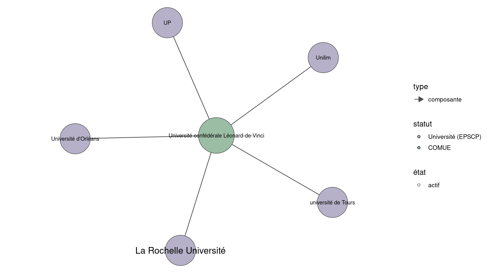 

Avertissements et édition : [logs](plots/regroupements/Q20735682.md) 

### Université confédérale Léonard-de-Vinci : Regroupement Etendu.     Edition des données : https://github.com/cpesr/wikidataESR/blob/master/plots/regroupements/Q20735682.md 

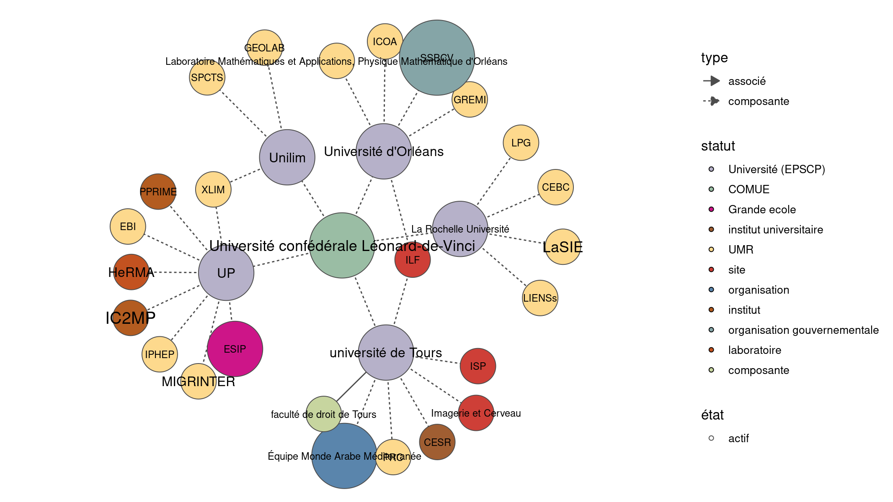 

Avertissements et édition : [logs](plots/regroupements/Q20735682.md) 

### Université confédérale Léonard-de-Vinci : Regroupement Superetendu.     Edition des données : https://github.com/cpesr/wikidataESR/blob/master/plots/regroupements/Q20735682.md 

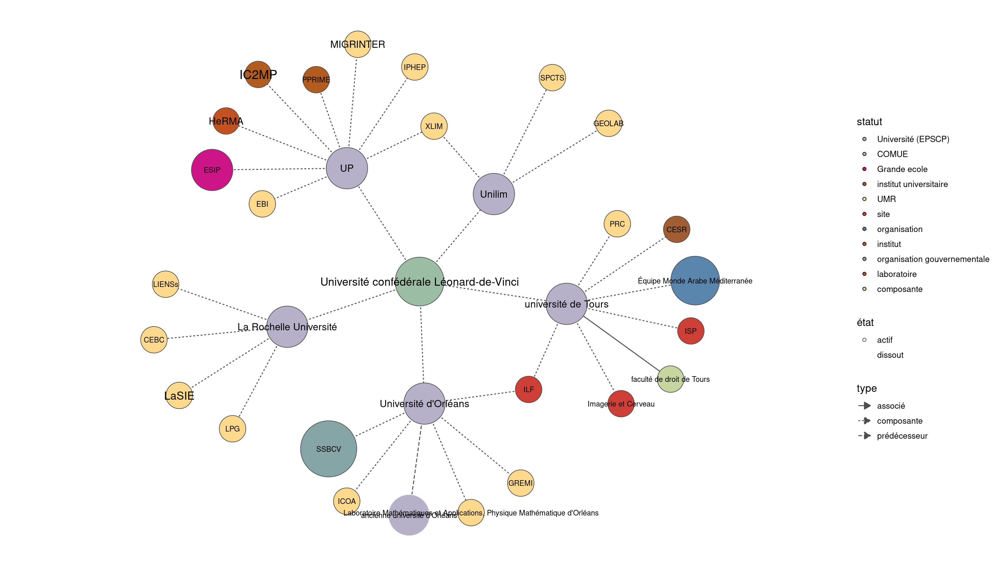 

Avertissements et édition : [logs](plots/regroupements/Q20735682.md) 

### Université de Lille : Regroupement Court.     Edition des données : https://github.com/cpesr/wikidataESR/blob/master/plots/regroupements/Q1322289.md 

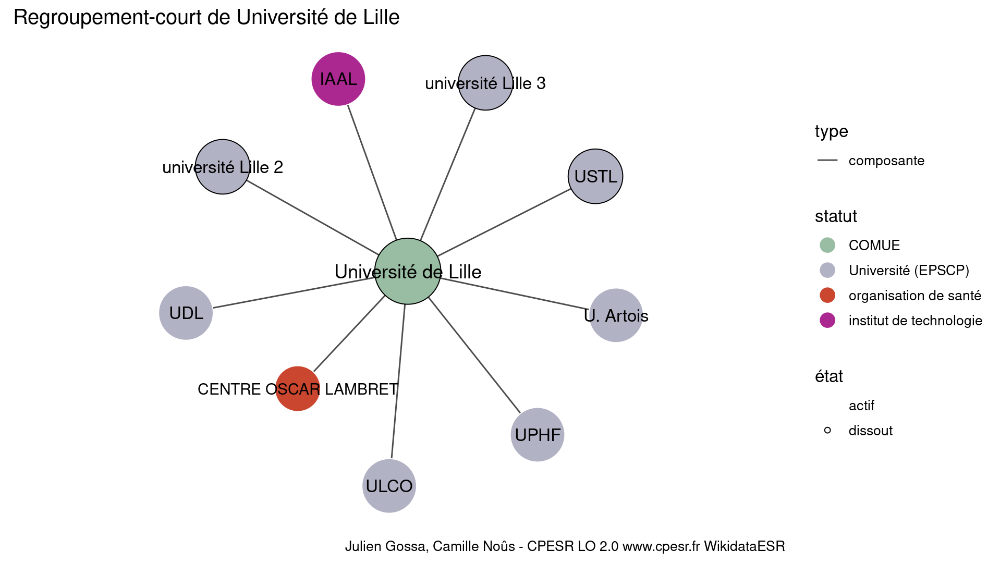 

Avertissements et édition : [logs](plots/regroupements/Q1322289.md) 

### Université de Lille : Regroupement Etendu.     Edition des données : https://github.com/cpesr/wikidataESR/blob/master/plots/regroupements/Q1322289.md 

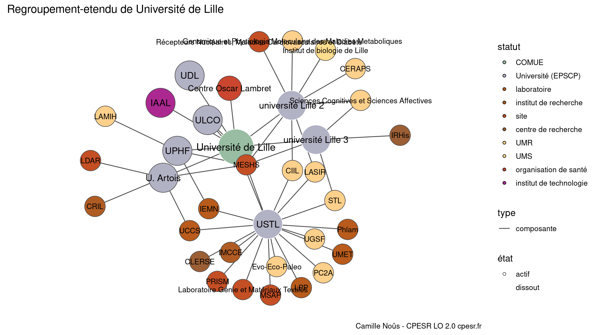 

Avertissements et édition : [logs](plots/regroupements/Q1322289.md) 

### Université de Lille : Regroupement Superetendu.     Edition des données : https://github.com/cpesr/wikidataESR/blob/master/plots/regroupements/Q1322289.md 

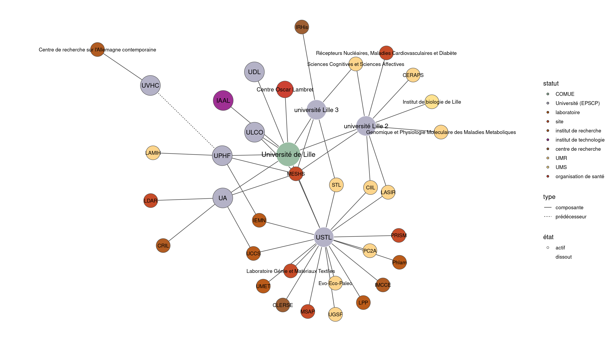 

Avertissements et édition : [logs](plots/regroupements/Q1322289.md) 

### PRES Université de Lorraine : Regroupement Court.     Edition des données : https://github.com/cpesr/wikidataESR/blob/master/plots/regroupements/Q64590454.md 

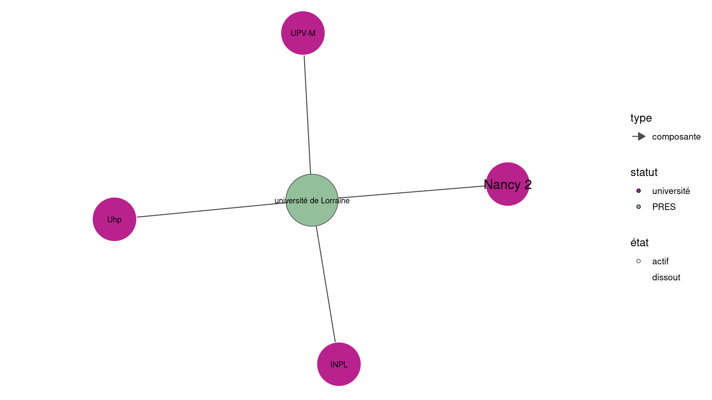 

Avertissements et édition : [logs](plots/regroupements/Q64590454.md) 

### PRES Université de Lorraine : Regroupement Etendu.     Edition des données : https://github.com/cpesr/wikidataESR/blob/master/plots/regroupements/Q64590454.md 

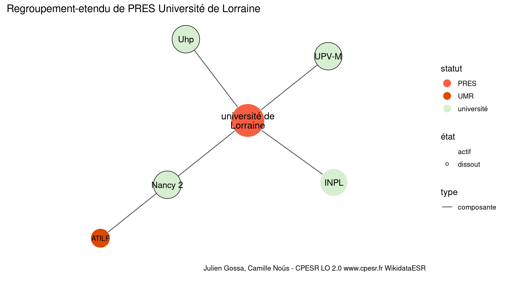 

Avertissements et édition : [logs](plots/regroupements/Q64590454.md) 

### PRES Université de Lorraine : Regroupement Superetendu.     Edition des données : https://github.com/cpesr/wikidataESR/blob/master/plots/regroupements/Q64590454.md 

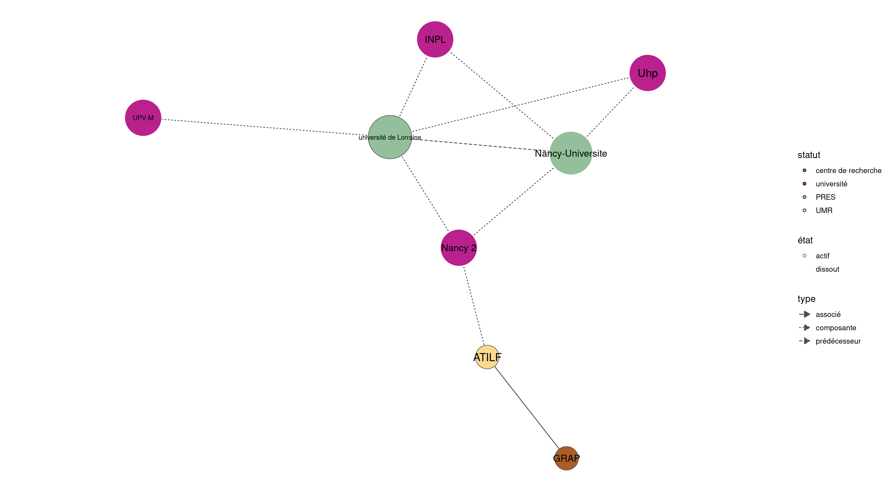 

Avertissements et édition : [logs](plots/regroupements/Q64590454.md) 

### Association Université de Lorraine : Regroupement Court.     Edition des données : https://github.com/cpesr/wikidataESR/blob/master/plots/regroupements/Q61718100.md 

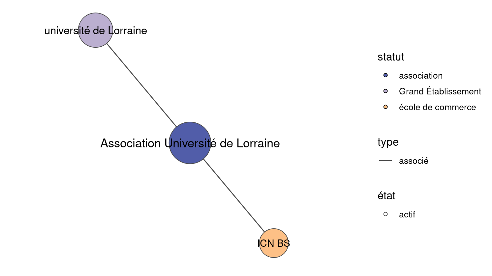 

Avertissements et édition : [logs](plots/regroupements/Q61718100.md) 

### Association Université de Lorraine : Regroupement Etendu.     Edition des données : https://github.com/cpesr/wikidataESR/blob/master/plots/regroupements/Q61718100.md 

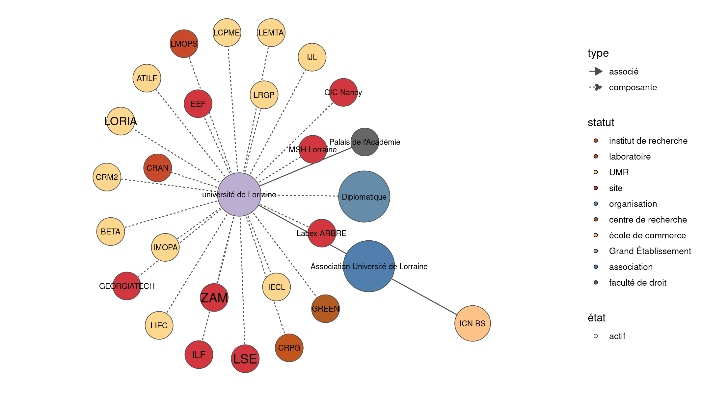 

Avertissements et édition : [logs](plots/regroupements/Q61718100.md) 

### Association Université de Lorraine : Regroupement Superetendu.     Edition des données : https://github.com/cpesr/wikidataESR/blob/master/plots/regroupements/Q61718100.md 

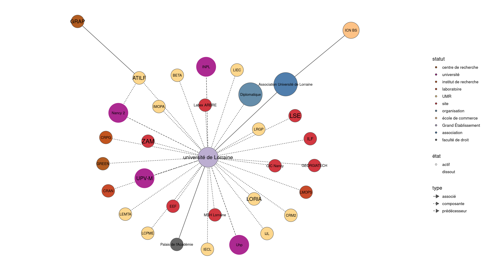 

Avertissements et édition : [logs](plots/regroupements/Q61718100.md) 

### Université fédérale de Toulouse Midi-Pyrénées : Regroupement Court.     Edition des données : https://github.com/cpesr/wikidataESR/blob/master/plots/regroupements/Q578023.md 

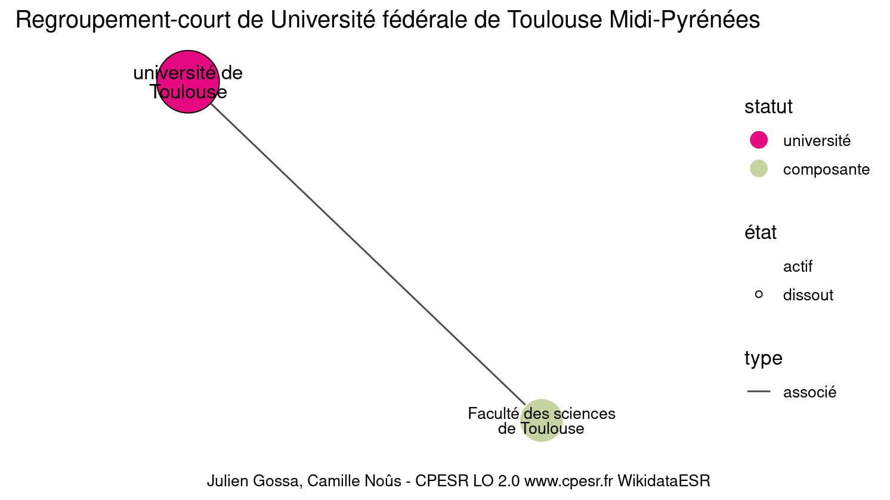 

Avertissements et édition : [logs](plots/regroupements/Q578023.md) 

### Université fédérale de Toulouse Midi-Pyrénées : Regroupement Etendu.     Edition des données : https://github.com/cpesr/wikidataESR/blob/master/plots/regroupements/Q578023.md 

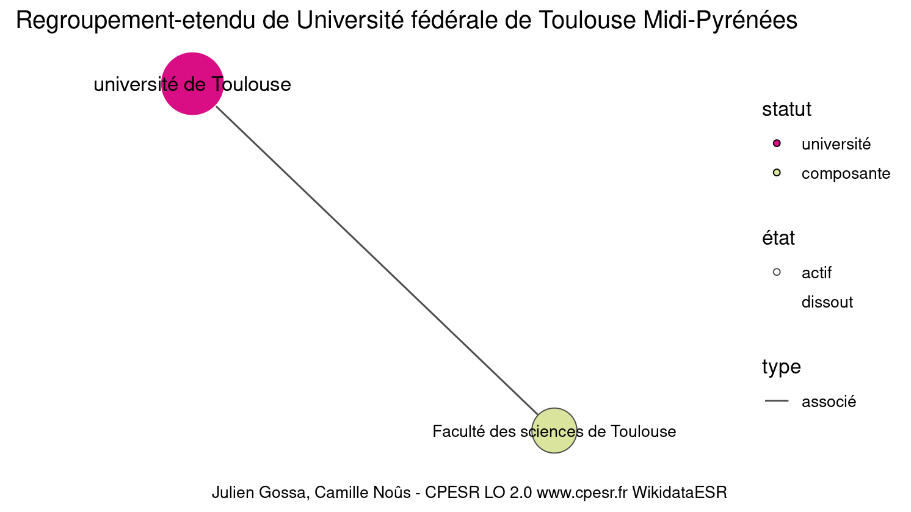 

Avertissements et édition : [logs](plots/regroupements/Q578023.md) 

### Université fédérale de Toulouse Midi-Pyrénées : Regroupement Superetendu.     Edition des données : https://github.com/cpesr/wikidataESR/blob/master/plots/regroupements/Q578023.md 

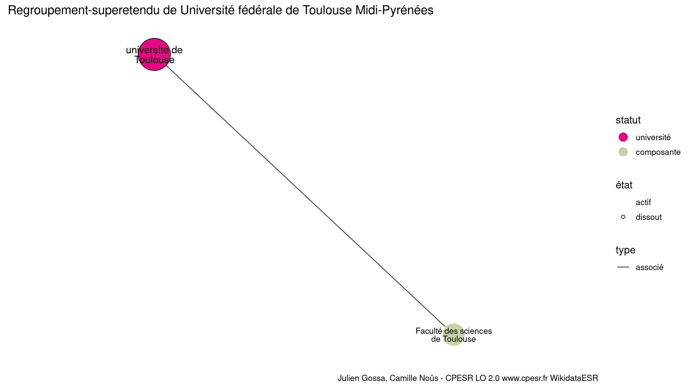 

Avertissements et édition : [logs](plots/regroupements/Q578023.md) 

### université Paris Lumières : Regroupement Court.     Edition des données : https://github.com/cpesr/wikidataESR/blob/master/plots/regroupements/Q3551474.md 

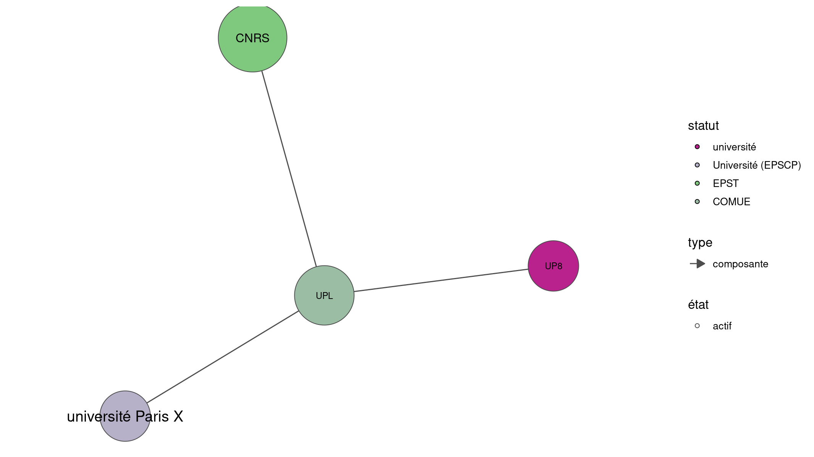 

Avertissements et édition : [logs](plots/regroupements/Q3551474.md) 

### université Paris Lumières : Regroupement Etendu.     Edition des données : https://github.com/cpesr/wikidataESR/blob/master/plots/regroupements/Q3551474.md 

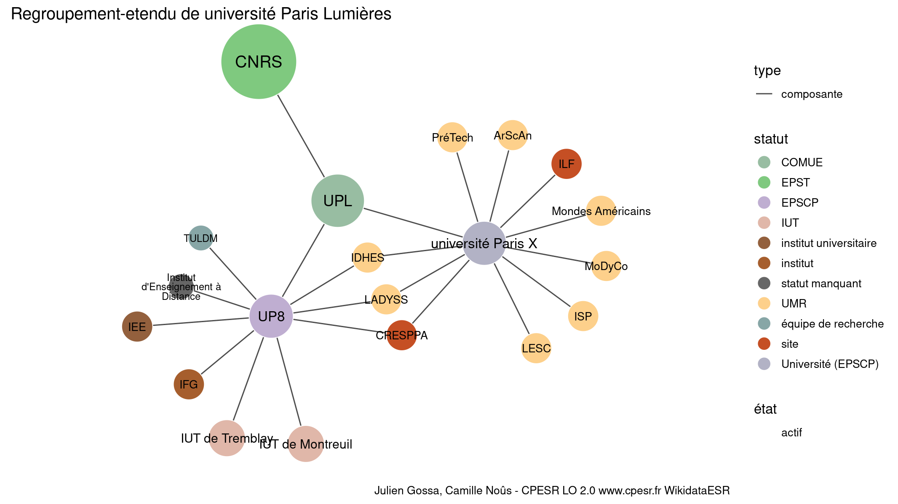 

Avertissements et édition : [logs](plots/regroupements/Q3551474.md) 

### université Paris Lumières : Regroupement Superetendu.     Edition des données : https://github.com/cpesr/wikidataESR/blob/master/plots/regroupements/Q3551474.md 

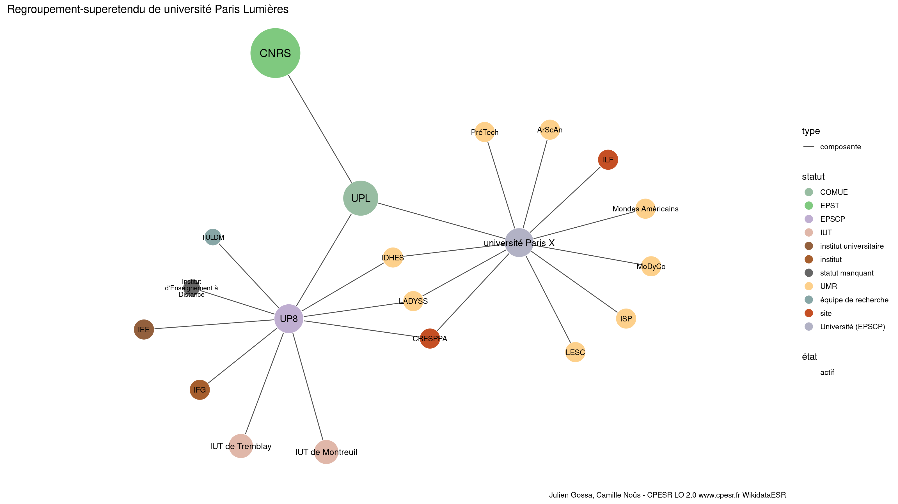 

Avertissements et édition : [logs](plots/regroupements/Q3551474.md) 

### Université Paris-Est : Regroupement Court.     Edition des données : https://github.com/cpesr/wikidataESR/blob/master/plots/regroupements/Q3551472.md 

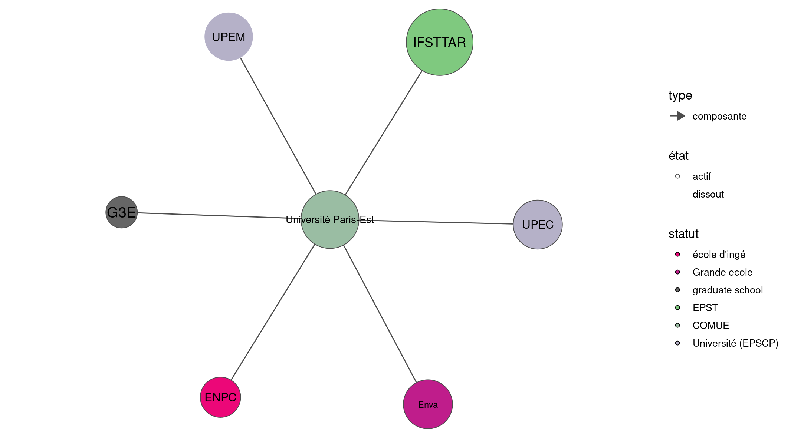 

Avertissements et édition : [logs](plots/regroupements/Q3551472.md) 

### Université Paris-Est : Regroupement Etendu.     Edition des données : https://github.com/cpesr/wikidataESR/blob/master/plots/regroupements/Q3551472.md 

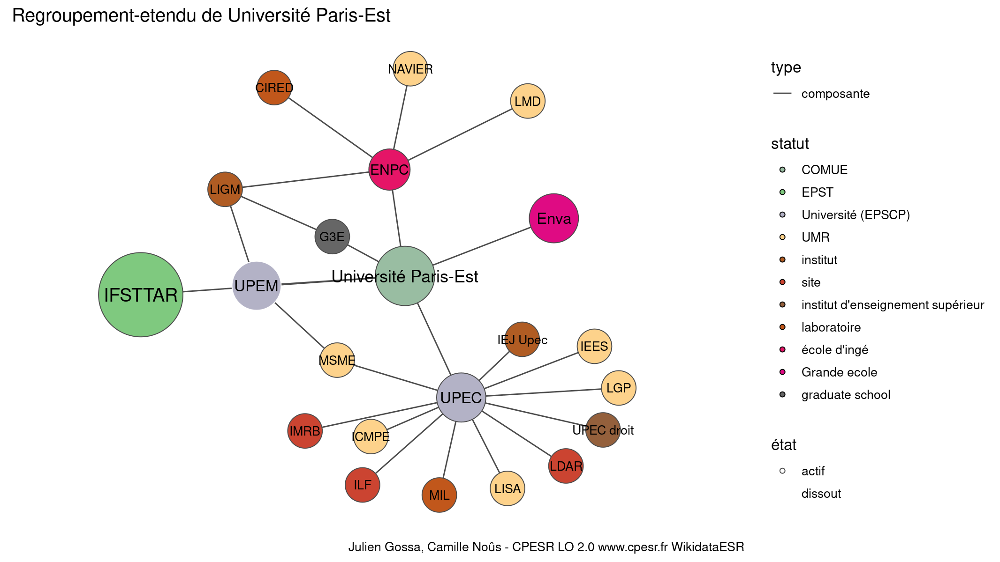 

Avertissements et édition : [logs](plots/regroupements/Q3551472.md) 

### Université Paris-Est : Regroupement Superetendu.     Edition des données : https://github.com/cpesr/wikidataESR/blob/master/plots/regroupements/Q3551472.md 

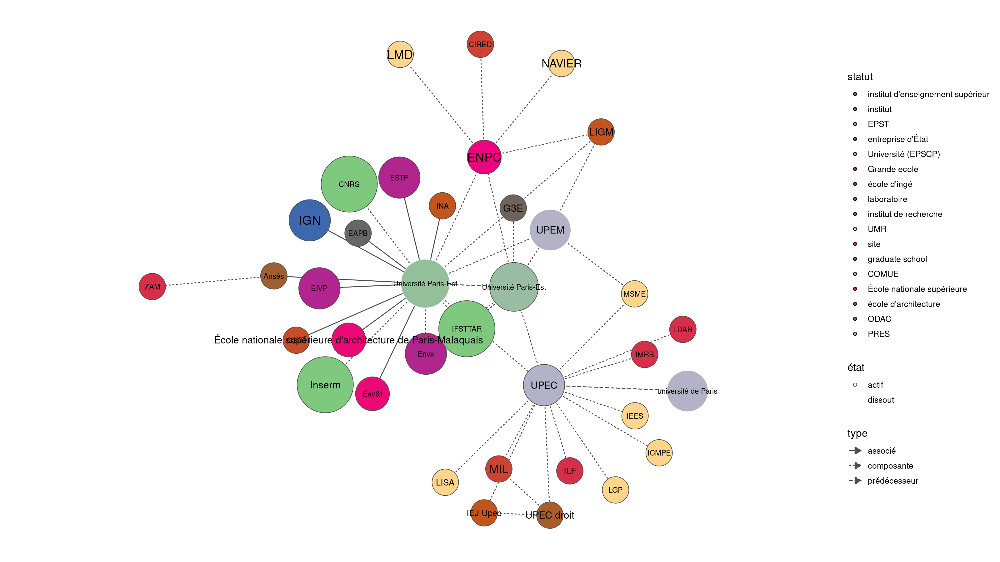 

Avertissements et édition : [logs](plots/regroupements/Q3551472.md) 

### PRES UniverSud Paris : Regroupement Court.     Edition des données : https://github.com/cpesr/wikidataESR/blob/master/plots/regroupements/Q3248808.md 

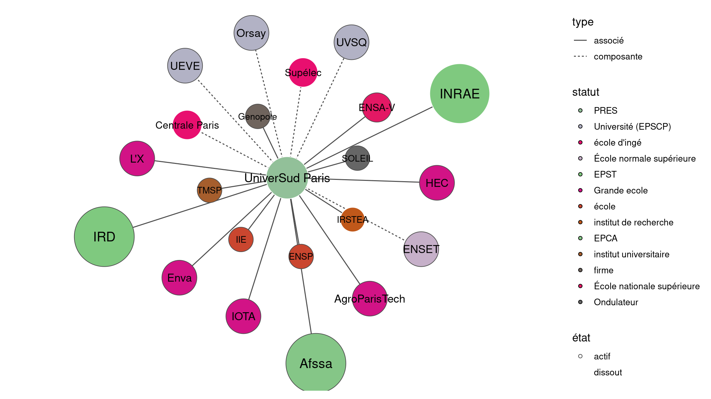 

Avertissements et édition : [logs](plots/regroupements/Q3248808.md) 

### PRES UniverSud Paris : Regroupement Etendu.     Edition des données : https://github.com/cpesr/wikidataESR/blob/master/plots/regroupements/Q3248808.md 

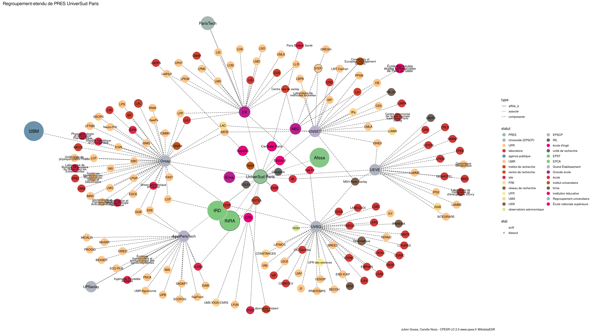 

Avertissements et édition : [logs](plots/regroupements/Q3248808.md) 

### PRES UniverSud Paris : Regroupement Superetendu.     Edition des données : https://github.com/cpesr/wikidataESR/blob/master/plots/regroupements/Q3248808.md 

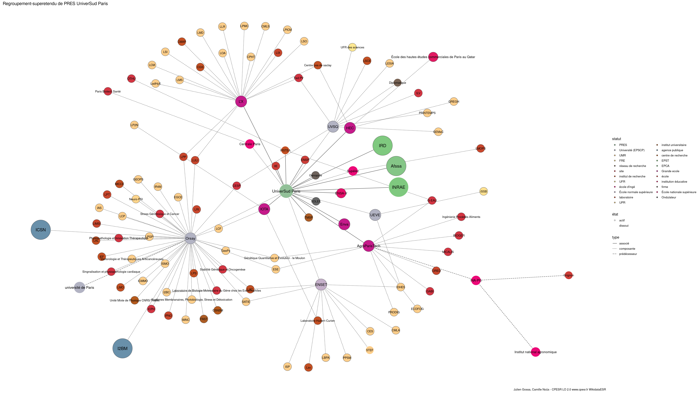 

Avertissements et édition : [logs](plots/regroupements/Q3248808.md) 

### Université Paris-Seine : Regroupement Court.     Edition des données : https://github.com/cpesr/wikidataESR/blob/master/plots/regroupements/Q3247880.md 

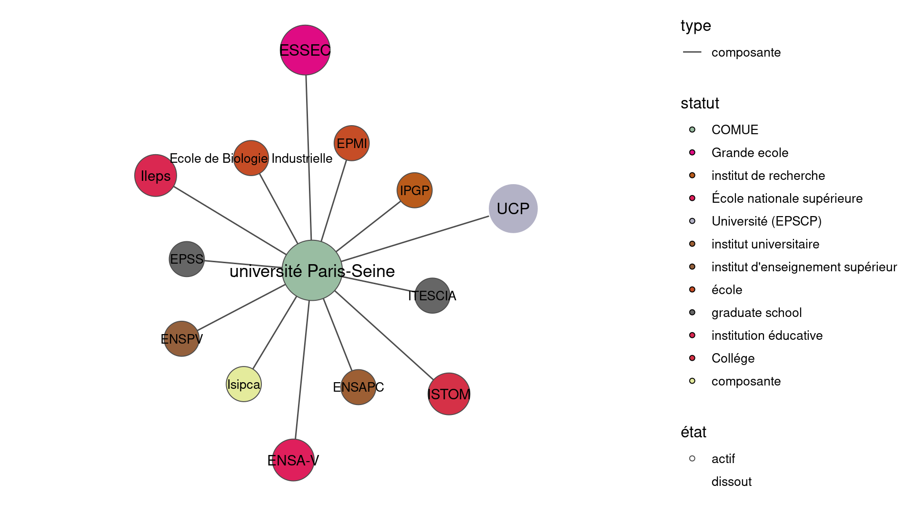 

Avertissements et édition : [logs](plots/regroupements/Q3247880.md) 

### Université Paris-Seine : Regroupement Etendu.     Edition des données : https://github.com/cpesr/wikidataESR/blob/master/plots/regroupements/Q3247880.md 

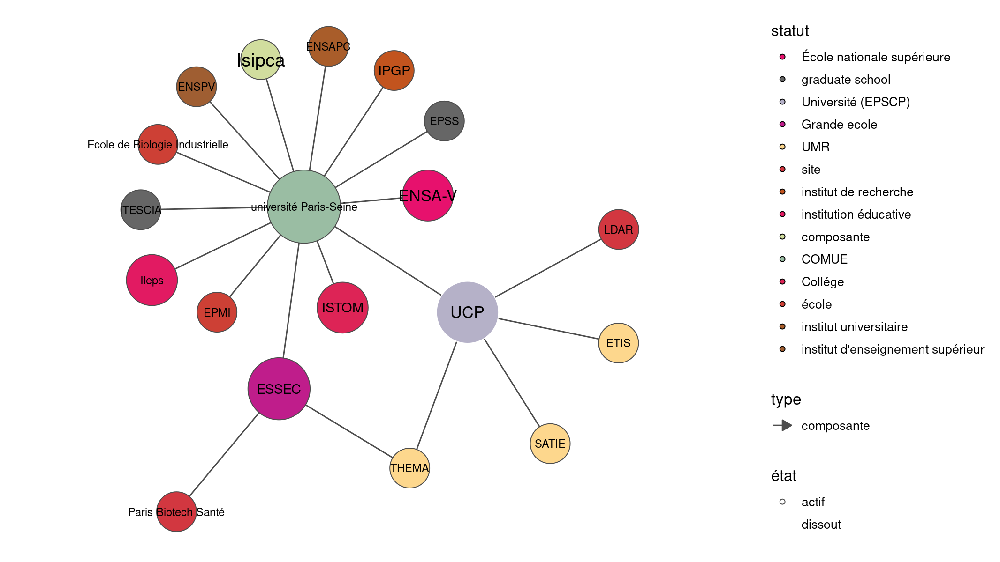 

Avertissements et édition : [logs](plots/regroupements/Q3247880.md) 

### Université Paris-Seine : Regroupement Superetendu.     Edition des données : https://github.com/cpesr/wikidataESR/blob/master/plots/regroupements/Q3247880.md 

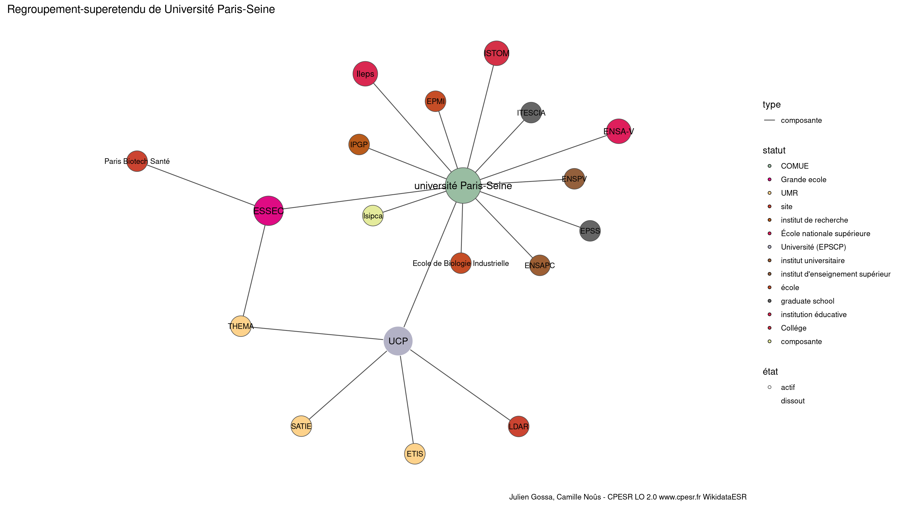 

Avertissements et édition : [logs](plots/regroupements/Q3247880.md) 

### COMUE Université Paris-Saclay : Regroupement Court.     Edition des données : https://github.com/cpesr/wikidataESR/blob/master/plots/regroupements/Q13531686.md 

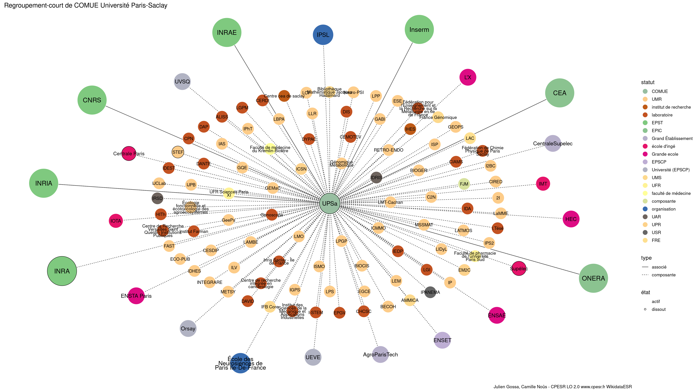 

Avertissements et édition : [logs](plots/regroupements/Q13531686.md) 

### COMUE Université Paris-Saclay : Regroupement Etendu.     Edition des données : https://github.com/cpesr/wikidataESR/blob/master/plots/regroupements/Q13531686.md 

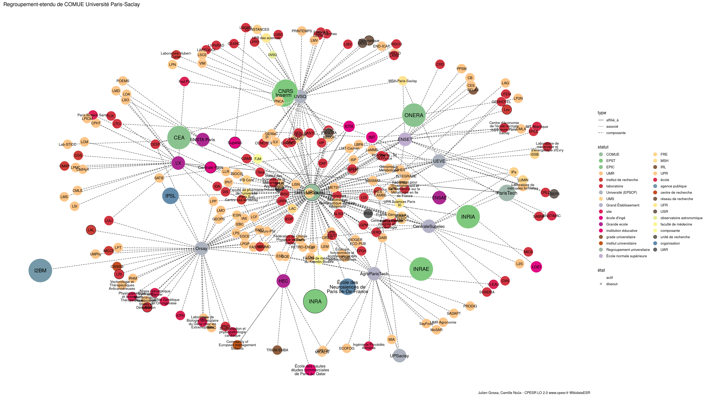 

Avertissements et édition : [logs](plots/regroupements/Q13531686.md) 

### COMUE Université Paris-Saclay : Regroupement Superetendu.     Edition des données : https://github.com/cpesr/wikidataESR/blob/master/plots/regroupements/Q13531686.md 

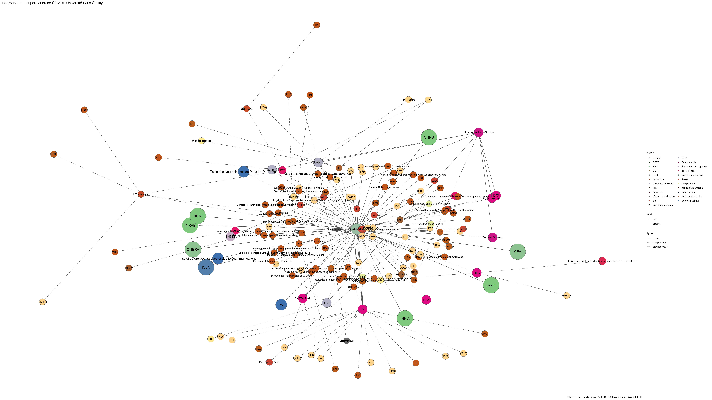 

Avertissements et édition : [logs](plots/regroupements/Q13531686.md) 

### Union des universités de la Méditerranée : Regroupement Court.     Edition des données : https://github.com/cpesr/wikidataESR/blob/master/plots/regroupements/Q850927.md 


Erreur : les données sont probablement trop partielles.
```
Error in wdesr_ggplot_graph(df, node_size = node_size, label_sizes = label_sizes, : Empty ESR graph: something went wrong with the graph production parameters

``` 

Avertissements et édition : [logs](plots/regroupements/Q850927.md) 

### Union des universités de la Méditerranée : Regroupement Etendu.     Edition des données : https://github.com/cpesr/wikidataESR/blob/master/plots/regroupements/Q850927.md 


Erreur : les données sont probablement trop partielles.
```
Error in wdesr_ggplot_graph(df, node_size = node_size, label_sizes = label_sizes, : Empty ESR graph: something went wrong with the graph production parameters

``` 

Avertissements et édition : [logs](plots/regroupements/Q850927.md) 

### Union des universités de la Méditerranée : Regroupement Superetendu.     Edition des données : https://github.com/cpesr/wikidataESR/blob/master/plots/regroupements/Q850927.md 


Erreur : les données sont probablement trop partielles.
```
Error in wdesr_ggplot_graph(df, node_size = node_size, label_sizes = label_sizes, : Empty ESR graph: something went wrong with the graph production parameters

``` 

Avertissements et édition : [logs](plots/regroupements/Q850927.md) 

### Sorbonne Universités : Regroupement Court.     Edition des données : https://github.com/cpesr/wikidataESR/blob/master/plots/regroupements/Q3491150.md 

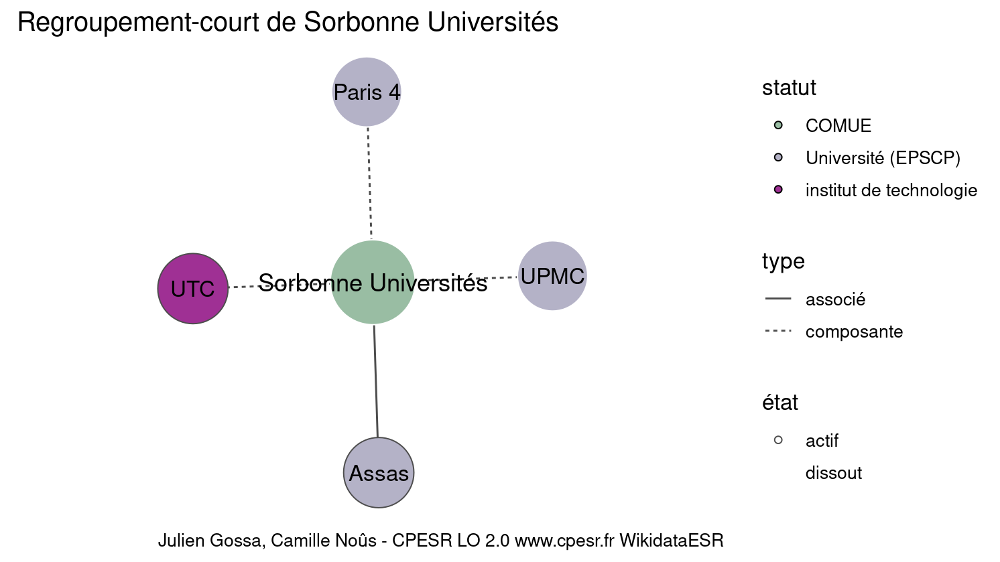 

Avertissements et édition : [logs](plots/regroupements/Q3491150.md) 

### Sorbonne Universités : Regroupement Etendu.     Edition des données : https://github.com/cpesr/wikidataESR/blob/master/plots/regroupements/Q3491150.md 

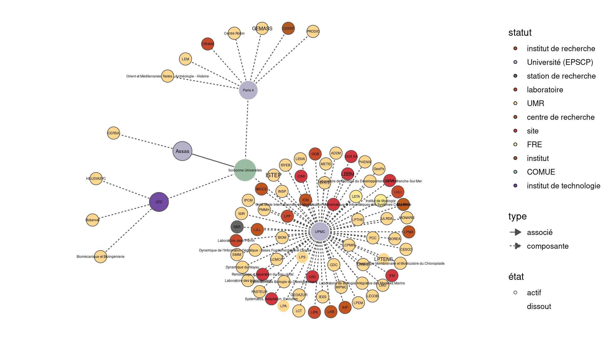 

Avertissements et édition : [logs](plots/regroupements/Q3491150.md) 

### Sorbonne Universités : Regroupement Superetendu.     Edition des données : https://github.com/cpesr/wikidataESR/blob/master/plots/regroupements/Q3491150.md 

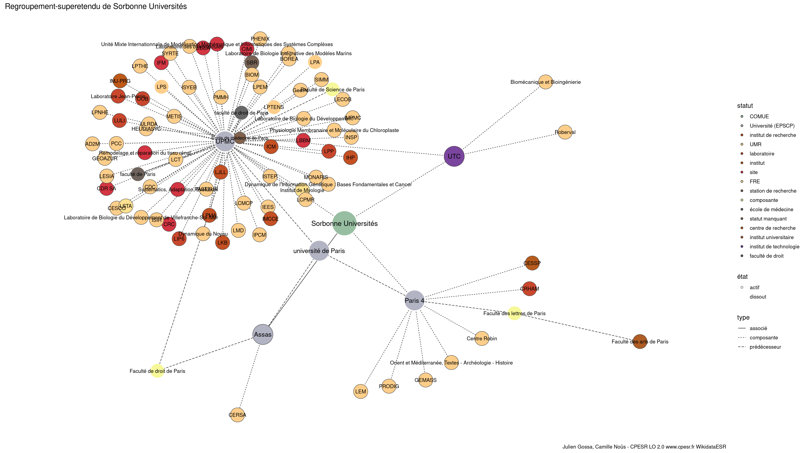 

Avertissements et édition : [logs](plots/regroupements/Q3491150.md) 

### COMUE Angers-Le Mans : Regroupement Court.     Edition des données : https://github.com/cpesr/wikidataESR/blob/master/plots/regroupements/Q104621964.md 


Erreur : les données sont probablement trop partielles.
```
Error in wdesr_ggplot_graph(df, node_size = node_size, label_sizes = label_sizes, : Empty ESR graph: something went wrong with the graph production parameters

``` 

Avertissements et édition : [logs](plots/regroupements/Q104621964.md) 

### COMUE Angers-Le Mans : Regroupement Etendu.     Edition des données : https://github.com/cpesr/wikidataESR/blob/master/plots/regroupements/Q104621964.md 


Erreur : les données sont probablement trop partielles.
```
Error in wdesr_ggplot_graph(df, node_size = node_size, label_sizes = label_sizes, : Empty ESR graph: something went wrong with the graph production parameters

``` 

Avertissements et édition : [logs](plots/regroupements/Q104621964.md) 

### COMUE Angers-Le Mans : Regroupement Superetendu.     Edition des données : https://github.com/cpesr/wikidataESR/blob/master/plots/regroupements/Q104621964.md 


Erreur : les données sont probablement trop partielles.
```
Error in wdesr_ggplot_graph(df, node_size = node_size, label_sizes = label_sizes, : Empty ESR graph: something went wrong with the graph production parameters

``` 

Avertissements et édition : [logs](plots/regroupements/Q104621964.md) 

## Histoire des universités historiques 

### université de Clermont-Ferrand : Histoire.     Edition des données : https://github.com/cpesr/wikidataESR/blob/master/plots/histoire/Q3551576.md 

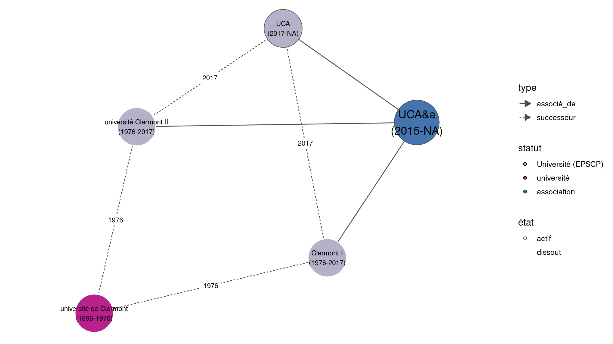 

Avertissements et édition : [logs](plots/histoire/Q3551576.md) 

### université de Bordeaux : Histoire.     Edition des données : https://github.com/cpesr/wikidataESR/blob/master/plots/histoire/Q20791505.md 

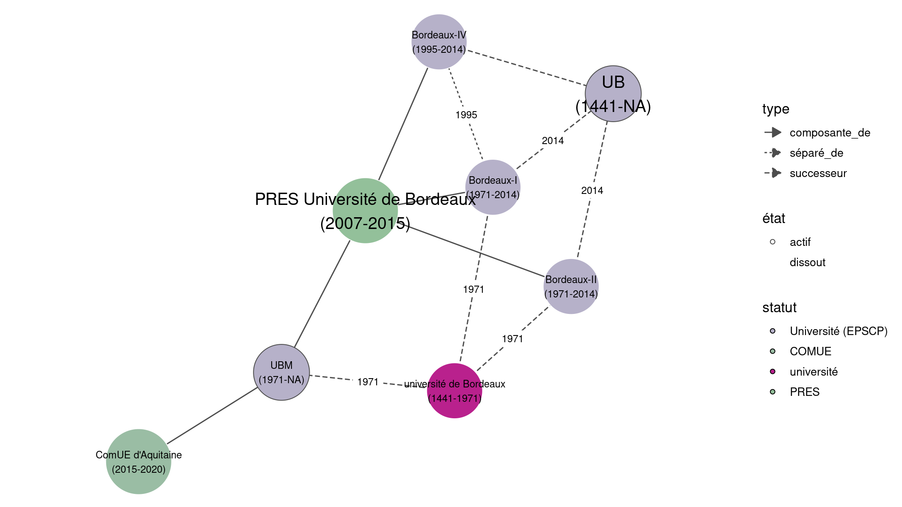 

Avertissements et édition : [logs](plots/histoire/Q20791505.md) 

### Université de Paris : Histoire.     Edition des données : https://github.com/cpesr/wikidataESR/blob/master/plots/histoire/Q209842.md 

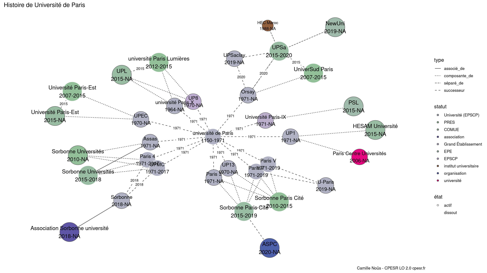 

Avertissements et édition : [logs](plots/histoire/Q209842.md) 

### université de Lille : Histoire.     Edition des données : https://github.com/cpesr/wikidataESR/blob/master/plots/histoire/Q3551621.md 


Erreur : les données sont probablement trop partielles.
```
Error in wdesr_ggplot_graph(df, node_size = node_size, label_sizes = label_sizes, : Empty ESR graph: something went wrong with the graph production parameters

``` 

Avertissements et édition : [logs](plots/histoire/Q3551621.md) 

### université de Lyon (1896-1969) : Histoire.     Edition des données : https://github.com/cpesr/wikidataESR/blob/master/plots/histoire/Q2383462.md 

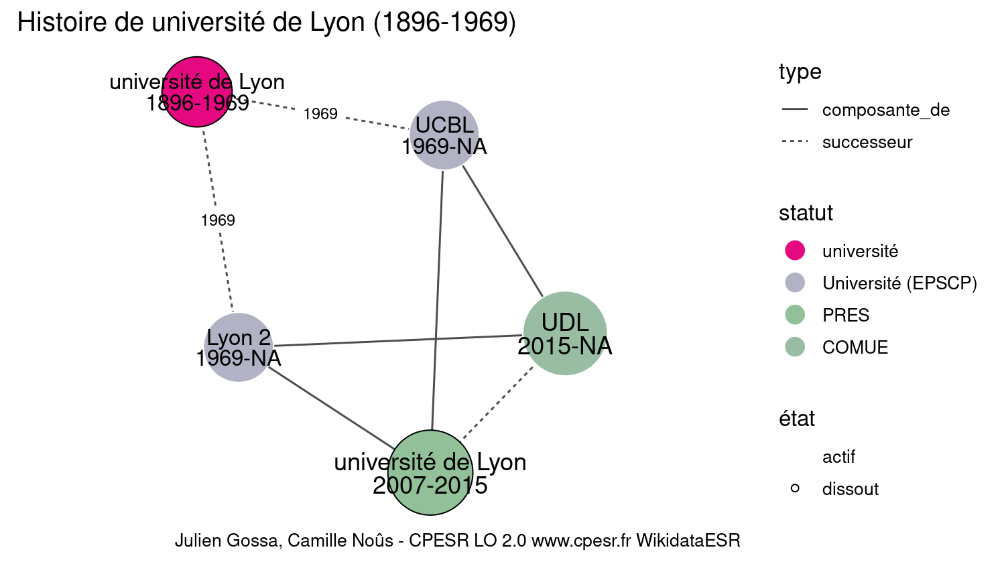 

Avertissements et édition : [logs](plots/histoire/Q2383462.md) 

### ancienne université d'Orléans : Histoire.     Edition des données : https://github.com/cpesr/wikidataESR/blob/master/plots/histoire/Q23197733.md 

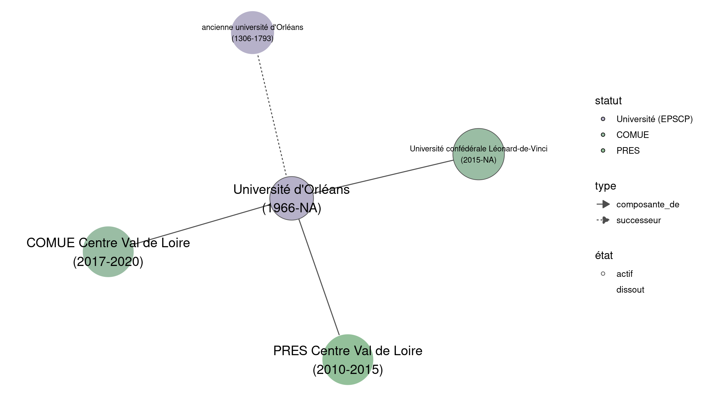 

Avertissements et édition : [logs](plots/histoire/Q23197733.md) 

### Université de Montpellier : Histoire.     Edition des données : https://github.com/cpesr/wikidataESR/blob/master/plots/histoire/Q64690423.md 

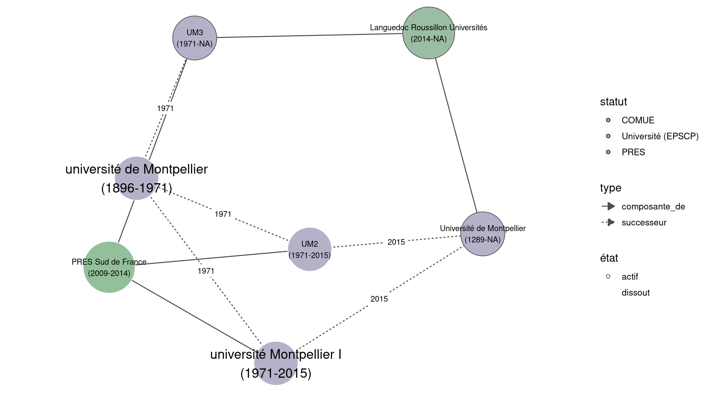 

Avertissements et édition : [logs](plots/histoire/Q64690423.md) 

### université de Rennes : Histoire.     Edition des données : https://github.com/cpesr/wikidataESR/blob/master/plots/histoire/Q1987282.md 

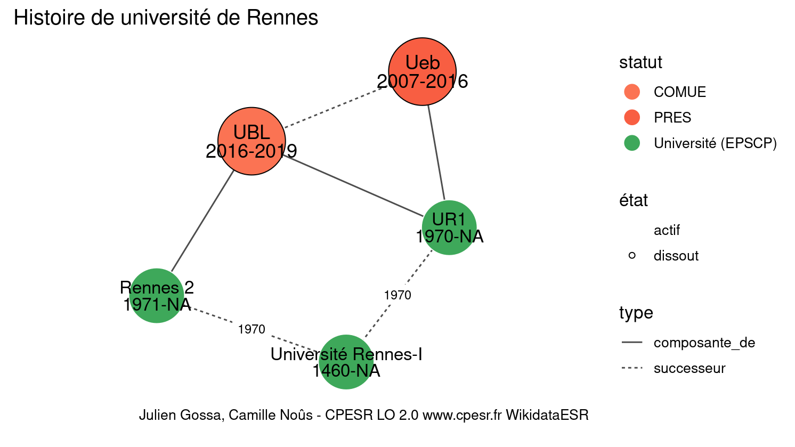 

Avertissements et édition : [logs](plots/histoire/Q1987282.md) 

### École royale de dessin (Paris) : Histoire.     Edition des données : https://github.com/cpesr/wikidataESR/blob/master/plots/histoire/Q20774688.md 

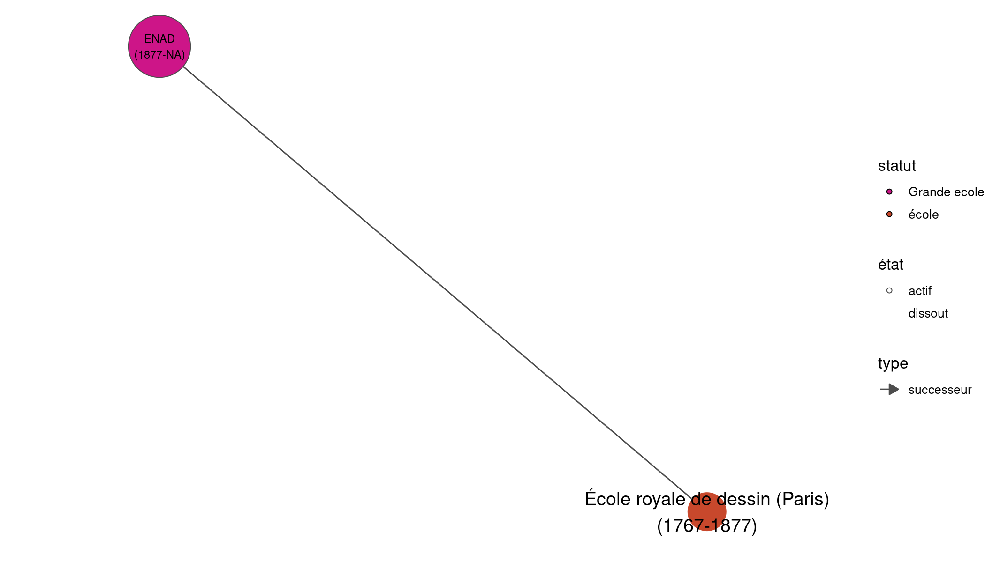 

Avertissements et édition : [logs](plots/histoire/Q20774688.md) 

### Ancienne université de Toulouse : Histoire.     Edition des données : https://github.com/cpesr/wikidataESR/blob/master/plots/histoire/Q578023.md 

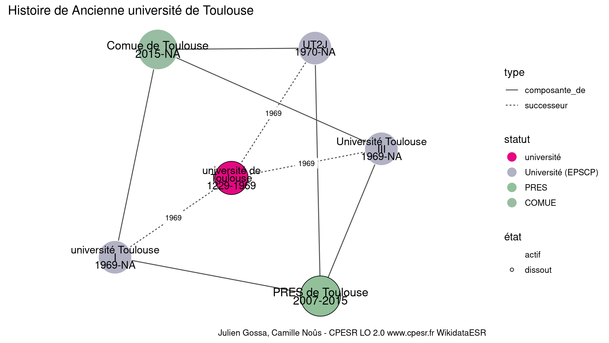 

Avertissements et édition : [logs](plots/histoire/Q578023.md) 

### Academia argentinensis : Histoire.     Edition des données : https://github.com/cpesr/wikidataESR/blob/master/plots/histoire/Q20808141.md 

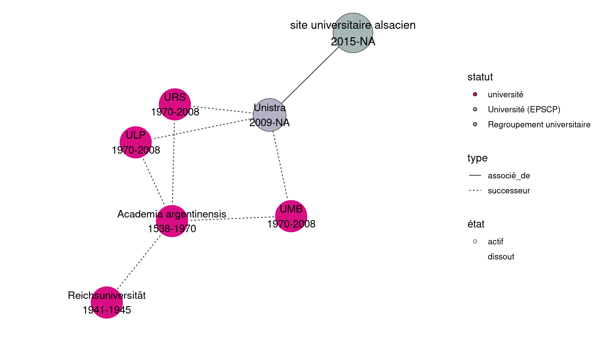 

Avertissements et édition : [logs](plots/histoire/Q20808141.md) 

### université d'Aix-Marseille (1896-1971) : Histoire.     Edition des données : https://github.com/cpesr/wikidataESR/blob/master/plots/histoire/Q21592577.md 

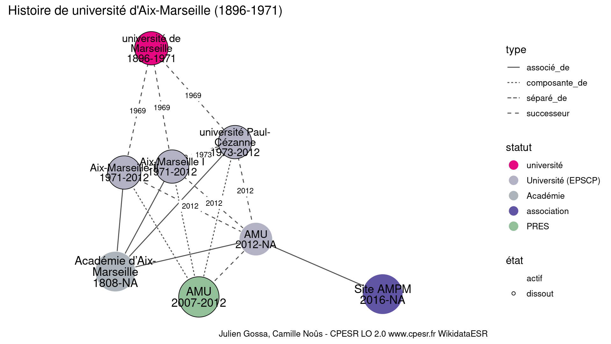 

Avertissements et édition : [logs](plots/histoire/Q21592577.md) 

