Batches de représentation wikidataESR
================

 

01/09/2022 

https://github.com/cpesr/WikidataESR 

```
  - twtexte:[#DataESR #HelpESR] Visualisation des @wikidata de l'#ESR.
  - twalt:@juliengossa LO 2.0 www.cpesr.fr
  - twurl:https://twitter.com/CPESR_/status/1457453241378148361
``` 

## Histoire, composition et association actuelles des Universités et assimilés 

Twitters manquants :
```
 - CU de Mayotte
 - UCA
 - UDL
 - Université de Montpellier
 - URN
 - ULH
``` 

### AMU @univamu : Histoire.     Edition des données : https://github.com/cpesr/wikidataESR/blob/master/plots/etablissements/Q2302586.md 

 

Avertissements et édition : [logs](plots/etablissements/Q2302586.md) 

### AMU @univamu : Composition.     Edition des données : https://github.com/cpesr/wikidataESR/blob/master/plots/etablissements/Q2302586.md 

 

Avertissements et édition : [logs](plots/etablissements/Q2302586.md) 

### AMU @univamu : Associations.     Edition des données : https://github.com/cpesr/wikidataESR/blob/master/plots/etablissements/Q2302586.md 

 

Avertissements et édition : [logs](plots/etablissements/Q2302586.md) 

### AU @univavignon : Histoire.     Edition des données : https://github.com/cpesr/wikidataESR/blob/master/plots/etablissements/Q2033119.md 


Erreur : les données sont probablement trop partielles.
```
Error in wdesr_ggplot_graph(df, node_size = node_size, label_sizes = label_sizes, : Empty ESR graph: something went wrong with the graph production parameters

``` 

Avertissements et édition : [logs](plots/etablissements/Q2033119.md) 

### AU @univavignon : Composition.     Edition des données : https://github.com/cpesr/wikidataESR/blob/master/plots/etablissements/Q2033119.md 

 

Avertissements et édition : [logs](plots/etablissements/Q2033119.md) 

### AU @univavignon : Associations.     Edition des données : https://github.com/cpesr/wikidataESR/blob/master/plots/etablissements/Q2033119.md 

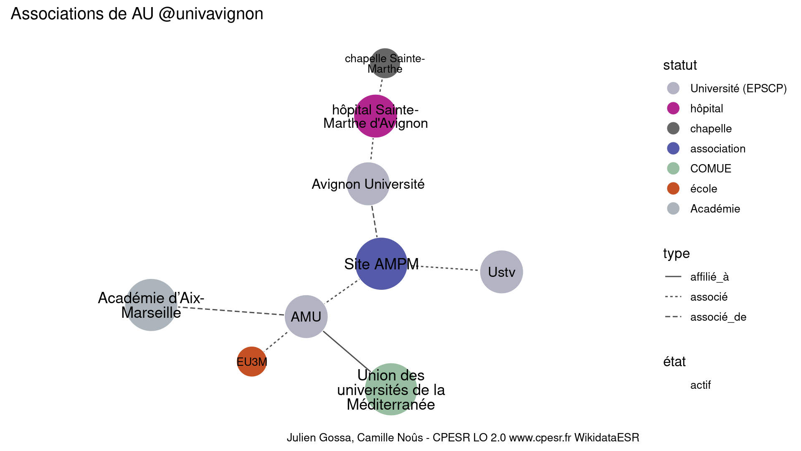 

Avertissements et édition : [logs](plots/etablissements/Q2033119.md) 

### CU de Mayotte NA : Histoire.     Edition des données : https://github.com/cpesr/wikidataESR/blob/master/plots/etablissements/Q2946102.md 


Erreur : les données sont probablement trop partielles.
```
Error in wdesr_ggplot_graph(df, node_size = node_size, label_sizes = label_sizes, : Empty ESR graph: something went wrong with the graph production parameters

``` 

Avertissements et édition : [logs](plots/etablissements/Q2946102.md) 

### CU de Mayotte NA : Composition.     Edition des données : https://github.com/cpesr/wikidataESR/blob/master/plots/etablissements/Q2946102.md 


Erreur : les données sont probablement trop partielles.
```
Error in wdesr_ggplot_graph(df, node_size = node_size, label_sizes = label_sizes, : Empty ESR graph: something went wrong with the graph production parameters

``` 

Avertissements et édition : [logs](plots/etablissements/Q2946102.md) 

### CU de Mayotte NA : Associations.     Edition des données : https://github.com/cpesr/wikidataESR/blob/master/plots/etablissements/Q2946102.md 


Erreur : les données sont probablement trop partielles.
```
Error in wdesr_ggplot_graph(df, node_size = node_size, label_sizes = label_sizes, : Empty ESR graph: something went wrong with the graph production parameters

``` 

Avertissements et édition : [logs](plots/etablissements/Q2946102.md) 

### UCP @UniversiteCergy : Histoire.     Edition des données : https://github.com/cpesr/wikidataESR/blob/master/plots/etablissements/Q74452784.md 


Erreur : les données sont probablement trop partielles.
```
Error in wdesr_ggplot_graph(df, node_size = node_size, label_sizes = label_sizes, : Empty ESR graph: something went wrong with the graph production parameters

``` 

Avertissements et édition : [logs](plots/etablissements/Q74452784.md) 

### UCP @UniversiteCergy : Composition.     Edition des données : https://github.com/cpesr/wikidataESR/blob/master/plots/etablissements/Q74452784.md 

 

Avertissements et édition : [logs](plots/etablissements/Q74452784.md) 

### UCP @UniversiteCergy : Associations.     Edition des données : https://github.com/cpesr/wikidataESR/blob/master/plots/etablissements/Q74452784.md 

 

Avertissements et édition : [logs](plots/etablissements/Q74452784.md) 

### La Rochelle Université @UnivLaRochelle : Histoire.     Edition des données : https://github.com/cpesr/wikidataESR/blob/master/plots/etablissements/Q1500822.md 

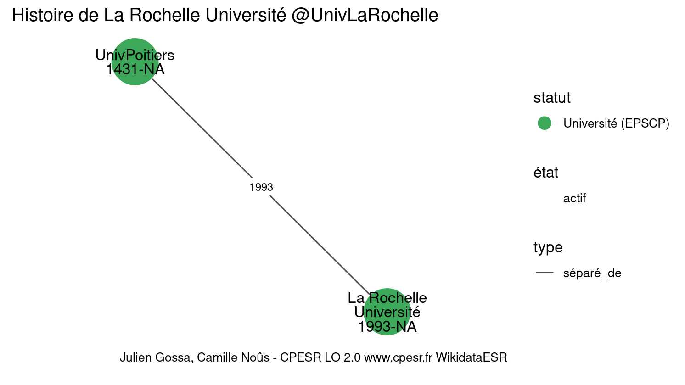 

Avertissements et édition : [logs](plots/etablissements/Q1500822.md) 

### La Rochelle Université @UnivLaRochelle : Composition.     Edition des données : https://github.com/cpesr/wikidataESR/blob/master/plots/etablissements/Q1500822.md 

 

Avertissements et édition : [logs](plots/etablissements/Q1500822.md) 

### La Rochelle Université @UnivLaRochelle : Associations.     Edition des données : https://github.com/cpesr/wikidataESR/blob/master/plots/etablissements/Q1500822.md 


Erreur : les données sont probablement trop partielles.
```
Error in wdesr_ggplot_graph(df, node_size = node_size, label_sizes = label_sizes, : Empty ESR graph: something went wrong with the graph production parameters

``` 

Avertissements et édition : [logs](plots/etablissements/Q1500822.md) 

### LMU @LeMansUniv : Histoire.     Edition des données : https://github.com/cpesr/wikidataESR/blob/master/plots/etablissements/Q834825.md 


Erreur : les données sont probablement trop partielles.
```
Error in wdesr_ggplot_graph(df, node_size = node_size, label_sizes = label_sizes, : Empty ESR graph: something went wrong with the graph production parameters

``` 

Avertissements et édition : [logs](plots/etablissements/Q834825.md) 

### LMU @LeMansUniv : Composition.     Edition des données : https://github.com/cpesr/wikidataESR/blob/master/plots/etablissements/Q834825.md 

 

Avertissements et édition : [logs](plots/etablissements/Q834825.md) 

### LMU @LeMansUniv : Associations.     Edition des données : https://github.com/cpesr/wikidataESR/blob/master/plots/etablissements/Q834825.md 


Erreur : les données sont probablement trop partielles.
```
Error in wdesr_ggplot_graph(df, node_size = node_size, label_sizes = label_sizes, : Empty ESR graph: something went wrong with the graph production parameters

``` 

Avertissements et édition : [logs](plots/etablissements/Q834825.md) 

### UN @NantesUniv : Histoire.     Edition des données : https://github.com/cpesr/wikidataESR/blob/master/plots/etablissements/Q259388.md 


Erreur : les données sont probablement trop partielles.
```
Error in wdesr_ggplot_graph(df, node_size = node_size, label_sizes = label_sizes, : Empty ESR graph: something went wrong with the graph production parameters

``` 

Avertissements et édition : [logs](plots/etablissements/Q259388.md) 

### UN @NantesUniv : Composition.     Edition des données : https://github.com/cpesr/wikidataESR/blob/master/plots/etablissements/Q259388.md 

 

Avertissements et édition : [logs](plots/etablissements/Q259388.md) 

### UN @NantesUniv : Associations.     Edition des données : https://github.com/cpesr/wikidataESR/blob/master/plots/etablissements/Q259388.md 


Erreur : les données sont probablement trop partielles.
```
Error in wdesr_ggplot_graph(df, node_size = node_size, label_sizes = label_sizes, : Empty ESR graph: something went wrong with the graph production parameters

``` 

Avertissements et édition : [logs](plots/etablissements/Q259388.md) 

### Sorbonne U @Sorbonne_Univ_ : Histoire.     Edition des données : https://github.com/cpesr/wikidataESR/blob/master/plots/etablissements/Q41497113.md 

 

Avertissements et édition : [logs](plots/etablissements/Q41497113.md) 

### Sorbonne U @Sorbonne_Univ_ : Composition.     Edition des données : https://github.com/cpesr/wikidataESR/blob/master/plots/etablissements/Q41497113.md 

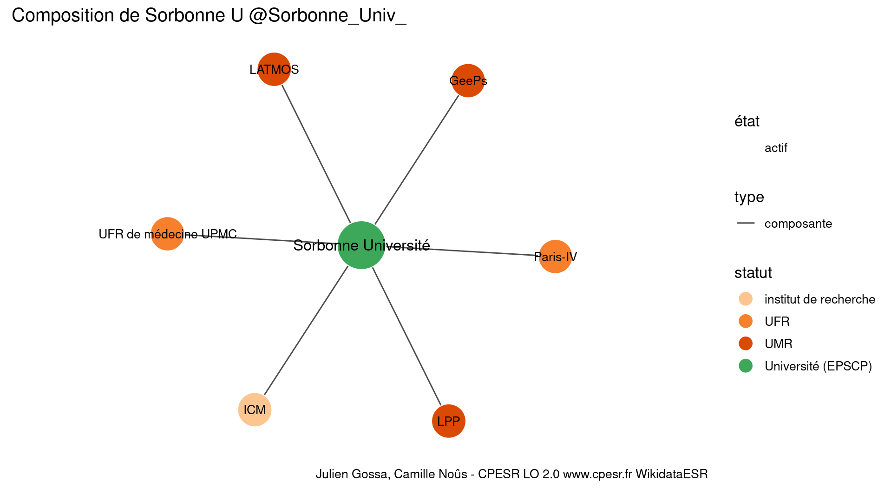 

Avertissements et édition : [logs](plots/etablissements/Q41497113.md) 

### Sorbonne U @Sorbonne_Univ_ : Associations.     Edition des données : https://github.com/cpesr/wikidataESR/blob/master/plots/etablissements/Q41497113.md 

 

Avertissements et édition : [logs](plots/etablissements/Q41497113.md) 

### UBM @UBMontaigne : Histoire.     Edition des données : https://github.com/cpesr/wikidataESR/blob/master/plots/etablissements/Q13342.md 

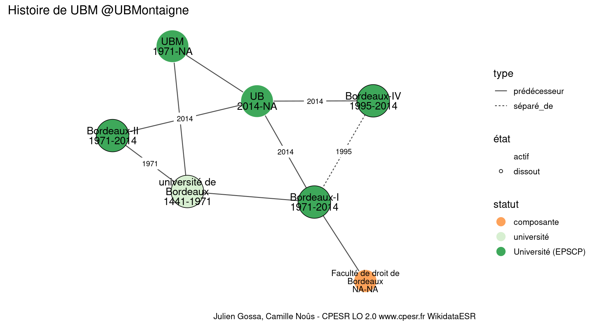 

Avertissements et édition : [logs](plots/etablissements/Q13342.md) 

### UBM @UBMontaigne : Composition.     Edition des données : https://github.com/cpesr/wikidataESR/blob/master/plots/etablissements/Q13342.md 

 

Avertissements et édition : [logs](plots/etablissements/Q13342.md) 

### UBM @UBMontaigne : Associations.     Edition des données : https://github.com/cpesr/wikidataESR/blob/master/plots/etablissements/Q13342.md 


Erreur : les données sont probablement trop partielles.
```
Error in wdesr_ggplot_graph(df, node_size = node_size, label_sizes = label_sizes, : Empty ESR graph: something went wrong with the graph production parameters

``` 

Avertissements et édition : [logs](plots/etablissements/Q13342.md) 

### UBS @ubs_universite : Histoire.     Edition des données : https://github.com/cpesr/wikidataESR/blob/master/plots/etablissements/Q1125958.md 


Erreur : les données sont probablement trop partielles.
```
Error in wdesr_ggplot_graph(df, node_size = node_size, label_sizes = label_sizes, : Empty ESR graph: something went wrong with the graph production parameters

``` 

Avertissements et édition : [logs](plots/etablissements/Q1125958.md) 

### UBS @ubs_universite : Composition.     Edition des données : https://github.com/cpesr/wikidataESR/blob/master/plots/etablissements/Q1125958.md 

 

Avertissements et édition : [logs](plots/etablissements/Q1125958.md) 

### UBS @ubs_universite : Associations.     Edition des données : https://github.com/cpesr/wikidataESR/blob/master/plots/etablissements/Q1125958.md 


Erreur : les données sont probablement trop partielles.
```
Error in wdesr_ggplot_graph(df, node_size = node_size, label_sizes = label_sizes, : Empty ESR graph: something went wrong with the graph production parameters

``` 

Avertissements et édition : [logs](plots/etablissements/Q1125958.md) 

### UCBL @UnivLyon1 : Histoire.     Edition des données : https://github.com/cpesr/wikidataESR/blob/master/plots/etablissements/Q4032.md 

 

Avertissements et édition : [logs](plots/etablissements/Q4032.md) 

### UCBL @UnivLyon1 : Composition.     Edition des données : https://github.com/cpesr/wikidataESR/blob/master/plots/etablissements/Q4032.md 

 

Avertissements et édition : [logs](plots/etablissements/Q4032.md) 

### UCBL @UnivLyon1 : Associations.     Edition des données : https://github.com/cpesr/wikidataESR/blob/master/plots/etablissements/Q4032.md 

 

Avertissements et édition : [logs](plots/etablissements/Q4032.md) 

### UCA NA : Histoire.     Edition des données : https://github.com/cpesr/wikidataESR/blob/master/plots/etablissements/Q1319786.md 

 

Avertissements et édition : [logs](plots/etablissements/Q1319786.md) 

### UCA NA : Composition.     Edition des données : https://github.com/cpesr/wikidataESR/blob/master/plots/etablissements/Q1319786.md 

 

Avertissements et édition : [logs](plots/etablissements/Q1319786.md) 

### UCA NA : Associations.     Edition des données : https://github.com/cpesr/wikidataESR/blob/master/plots/etablissements/Q1319786.md 

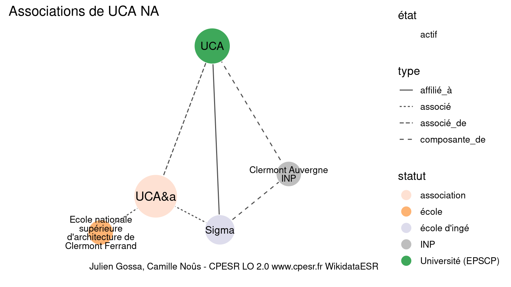 

Avertissements et édition : [logs](plots/etablissements/Q1319786.md) 

### UCA @Univ_CotedAzur : Histoire.     Edition des données : https://github.com/cpesr/wikidataESR/blob/master/plots/etablissements/Q80186910.md 

 

Avertissements et édition : [logs](plots/etablissements/Q80186910.md) 

### UCA @Univ_CotedAzur : Composition.     Edition des données : https://github.com/cpesr/wikidataESR/blob/master/plots/etablissements/Q80186910.md 

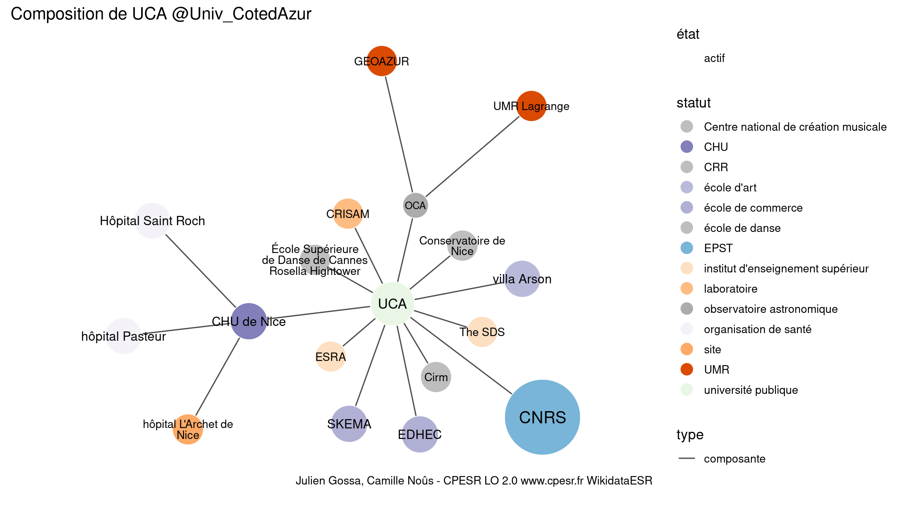 

Avertissements et édition : [logs](plots/etablissements/Q80186910.md) 

### UCA @Univ_CotedAzur : Associations.     Edition des données : https://github.com/cpesr/wikidataESR/blob/master/plots/etablissements/Q80186910.md 

 

Avertissements et édition : [logs](plots/etablissements/Q80186910.md) 

### U. Angers @UnivAngers : Histoire.     Edition des données : https://github.com/cpesr/wikidataESR/blob/master/plots/etablissements/Q1538727.md 


Erreur : les données sont probablement trop partielles.
```
Error in wdesr_ggplot_graph(df, node_size = node_size, label_sizes = label_sizes, : Empty ESR graph: something went wrong with the graph production parameters

``` 

Avertissements et édition : [logs](plots/etablissements/Q1538727.md) 

### U. Angers @UnivAngers : Composition.     Edition des données : https://github.com/cpesr/wikidataESR/blob/master/plots/etablissements/Q1538727.md 

 

Avertissements et édition : [logs](plots/etablissements/Q1538727.md) 

### U. Angers @UnivAngers : Associations.     Edition des données : https://github.com/cpesr/wikidataESR/blob/master/plots/etablissements/Q1538727.md 


Erreur : les données sont probablement trop partielles.
```
Error in wdesr_ggplot_graph(df, node_size = node_size, label_sizes = label_sizes, : Empty ESR graph: something went wrong with the graph production parameters

``` 

Avertissements et édition : [logs](plots/etablissements/Q1538727.md) 

### U. Artois @Univ_Artois : Histoire.     Edition des données : https://github.com/cpesr/wikidataESR/blob/master/plots/etablissements/Q475504.md 


Erreur : les données sont probablement trop partielles.
```
Error in wdesr_ggplot_graph(df, node_size = node_size, label_sizes = label_sizes, : Empty ESR graph: something went wrong with the graph production parameters

``` 

Avertissements et édition : [logs](plots/etablissements/Q475504.md) 

### U. Artois @Univ_Artois : Composition.     Edition des données : https://github.com/cpesr/wikidataESR/blob/master/plots/etablissements/Q475504.md 


Erreur : les données sont probablement trop partielles.
```
Error in wdesr_ggplot_graph(df, node_size = node_size, label_sizes = label_sizes, : Empty ESR graph: something went wrong with the graph production parameters

``` 

Avertissements et édition : [logs](plots/etablissements/Q475504.md) 

### U. Artois @Univ_Artois : Associations.     Edition des données : https://github.com/cpesr/wikidataESR/blob/master/plots/etablissements/Q475504.md 


Erreur : les données sont probablement trop partielles.
```
Error in wdesr_ggplot_graph(df, node_size = node_size, label_sizes = label_sizes, : Empty ESR graph: something went wrong with the graph production parameters

``` 

Avertissements et édition : [logs](plots/etablissements/Q475504.md) 

### UEVE @UnivEvry : Histoire.     Edition des données : https://github.com/cpesr/wikidataESR/blob/master/plots/etablissements/Q1531014.md 


Erreur : les données sont probablement trop partielles.
```
Error in wdesr_ggplot_graph(df, node_size = node_size, label_sizes = label_sizes, : Empty ESR graph: something went wrong with the graph production parameters

``` 

Avertissements et édition : [logs](plots/etablissements/Q1531014.md) 

### UEVE @UnivEvry : Composition.     Edition des données : https://github.com/cpesr/wikidataESR/blob/master/plots/etablissements/Q1531014.md 

 

Avertissements et édition : [logs](plots/etablissements/Q1531014.md) 

### UEVE @UnivEvry : Associations.     Edition des données : https://github.com/cpesr/wikidataESR/blob/master/plots/etablissements/Q1531014.md 

 

Avertissements et édition : [logs](plots/etablissements/Q1531014.md) 

### Université d'Orléans @Univ_Orleans : Histoire.     Edition des données : https://github.com/cpesr/wikidataESR/blob/master/plots/etablissements/Q13334.md 

 

Avertissements et édition : [logs](plots/etablissements/Q13334.md) 

### Université d'Orléans @Univ_Orleans : Composition.     Edition des données : https://github.com/cpesr/wikidataESR/blob/master/plots/etablissements/Q13334.md 

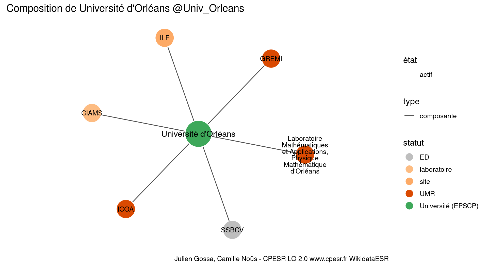 

Avertissements et édition : [logs](plots/etablissements/Q13334.md) 

### Université d'Orléans @Univ_Orleans : Associations.     Edition des données : https://github.com/cpesr/wikidataESR/blob/master/plots/etablissements/Q13334.md 


Erreur : les données sont probablement trop partielles.
```
Error in wdesr_ggplot_graph(df, node_size = node_size, label_sizes = label_sizes, : Empty ESR graph: something went wrong with the graph production parameters

``` 

Avertissements et édition : [logs](plots/etablissements/Q13334.md) 

### UBx @univbordeaux : Histoire.     Edition des données : https://github.com/cpesr/wikidataESR/blob/master/plots/etablissements/Q13344.md 

 

Avertissements et édition : [logs](plots/etablissements/Q13344.md) 

### UBx @univbordeaux : Composition.     Edition des données : https://github.com/cpesr/wikidataESR/blob/master/plots/etablissements/Q13344.md 

 

Avertissements et édition : [logs](plots/etablissements/Q13344.md) 

### UBx @univbordeaux : Associations.     Edition des données : https://github.com/cpesr/wikidataESR/blob/master/plots/etablissements/Q13344.md 


Erreur : les données sont probablement trop partielles.
```
Error in wdesr_ggplot_graph(df, node_size = node_size, label_sizes = label_sizes, : Empty ESR graph: something went wrong with the graph production parameters

``` 

Avertissements et édition : [logs](plots/etablissements/Q13344.md) 

### uB @univbourgogne : Histoire.     Edition des données : https://github.com/cpesr/wikidataESR/blob/master/plots/etablissements/Q287072.md 


Erreur : les données sont probablement trop partielles.
```
Error in wdesr_ggplot_graph(df, node_size = node_size, label_sizes = label_sizes, : Empty ESR graph: something went wrong with the graph production parameters

``` 

Avertissements et édition : [logs](plots/etablissements/Q287072.md) 

### uB @univbourgogne : Composition.     Edition des données : https://github.com/cpesr/wikidataESR/blob/master/plots/etablissements/Q287072.md 

 

Avertissements et édition : [logs](plots/etablissements/Q287072.md) 

### uB @univbourgogne : Associations.     Edition des données : https://github.com/cpesr/wikidataESR/blob/master/plots/etablissements/Q287072.md 

 

Avertissements et édition : [logs](plots/etablissements/Q287072.md) 

### UBO @UBO_UnivBrest : Histoire.     Edition des données : https://github.com/cpesr/wikidataESR/blob/master/plots/etablissements/Q1857334.md 


Erreur : les données sont probablement trop partielles.
```
Error in wdesr_ggplot_graph(df, node_size = node_size, label_sizes = label_sizes, : Empty ESR graph: something went wrong with the graph production parameters

``` 

Avertissements et édition : [logs](plots/etablissements/Q1857334.md) 

### UBO @UBO_UnivBrest : Composition.     Edition des données : https://github.com/cpesr/wikidataESR/blob/master/plots/etablissements/Q1857334.md 

 

Avertissements et édition : [logs](plots/etablissements/Q1857334.md) 

### UBO @UBO_UnivBrest : Associations.     Edition des données : https://github.com/cpesr/wikidataESR/blob/master/plots/etablissements/Q1857334.md 


Erreur : les données sont probablement trop partielles.
```
Error in wdesr_ggplot_graph(df, node_size = node_size, label_sizes = label_sizes, : Empty ESR graph: something went wrong with the graph production parameters

``` 

Avertissements et édition : [logs](plots/etablissements/Q1857334.md) 

### UNICAEN @universite_caen : Histoire.     Edition des données : https://github.com/cpesr/wikidataESR/blob/master/plots/etablissements/Q568554.md 


Erreur : les données sont probablement trop partielles.
```
Error in wdesr_ggplot_graph(df, node_size = node_size, label_sizes = label_sizes, : Empty ESR graph: something went wrong with the graph production parameters

``` 

Avertissements et édition : [logs](plots/etablissements/Q568554.md) 

### UNICAEN @universite_caen : Composition.     Edition des données : https://github.com/cpesr/wikidataESR/blob/master/plots/etablissements/Q568554.md 

 

Avertissements et édition : [logs](plots/etablissements/Q568554.md) 

### UNICAEN @universite_caen : Associations.     Edition des données : https://github.com/cpesr/wikidataESR/blob/master/plots/etablissements/Q568554.md 

 

Avertissements et édition : [logs](plots/etablissements/Q568554.md) 

### université de Corse @univcorse : Histoire.     Edition des données : https://github.com/cpesr/wikidataESR/blob/master/plots/etablissements/Q335841.md 


Erreur : les données sont probablement trop partielles.
```
Error in wdesr_ggplot_graph(df, node_size = node_size, label_sizes = label_sizes, : Empty ESR graph: something went wrong with the graph production parameters

``` 

Avertissements et édition : [logs](plots/etablissements/Q335841.md) 

### université de Corse @univcorse : Composition.     Edition des données : https://github.com/cpesr/wikidataESR/blob/master/plots/etablissements/Q335841.md 


Erreur : les données sont probablement trop partielles.
```
Error in wdesr_ggplot_graph(df, node_size = node_size, label_sizes = label_sizes, : Empty ESR graph: something went wrong with the graph production parameters

``` 

Avertissements et édition : [logs](plots/etablissements/Q335841.md) 

### université de Corse @univcorse : Associations.     Edition des données : https://github.com/cpesr/wikidataESR/blob/master/plots/etablissements/Q335841.md 


Erreur : les données sont probablement trop partielles.
```
Error in wdesr_ggplot_graph(df, node_size = node_size, label_sizes = label_sizes, : Empty ESR graph: something went wrong with the graph production parameters

``` 

Avertissements et édition : [logs](plots/etablissements/Q335841.md) 

### UFC @fc_univ : Histoire.     Edition des données : https://github.com/cpesr/wikidataESR/blob/master/plots/etablissements/Q829449.md 


Erreur : les données sont probablement trop partielles.
```
Error in wdesr_ggplot_graph(df, node_size = node_size, label_sizes = label_sizes, : Empty ESR graph: something went wrong with the graph production parameters

``` 

Avertissements et édition : [logs](plots/etablissements/Q829449.md) 

### UFC @fc_univ : Composition.     Edition des données : https://github.com/cpesr/wikidataESR/blob/master/plots/etablissements/Q829449.md 

 

Avertissements et édition : [logs](plots/etablissements/Q829449.md) 

### UFC @fc_univ : Associations.     Edition des données : https://github.com/cpesr/wikidataESR/blob/master/plots/etablissements/Q829449.md 

 

Avertissements et édition : [logs](plots/etablissements/Q829449.md) 

### Université de Guyane @univguyane : Histoire.     Edition des données : https://github.com/cpesr/wikidataESR/blob/master/plots/etablissements/Q16682067.md 


Erreur : les données sont probablement trop partielles.
```
Error in wdesr_ggplot_graph(df, node_size = node_size, label_sizes = label_sizes, : Empty ESR graph: something went wrong with the graph production parameters

``` 

Avertissements et édition : [logs](plots/etablissements/Q16682067.md) 

### Université de Guyane @univguyane : Composition.     Edition des données : https://github.com/cpesr/wikidataESR/blob/master/plots/etablissements/Q16682067.md 

 

Avertissements et édition : [logs](plots/etablissements/Q16682067.md) 

### Université de Guyane @univguyane : Associations.     Edition des données : https://github.com/cpesr/wikidataESR/blob/master/plots/etablissements/Q16682067.md 


Erreur : les données sont probablement trop partielles.
```
Error in wdesr_ggplot_graph(df, node_size = node_size, label_sizes = label_sizes, : Empty ESR graph: something went wrong with the graph production parameters

``` 

Avertissements et édition : [logs](plots/etablissements/Q16682067.md) 

### UHA @UHA68 : Histoire.     Edition des données : https://github.com/cpesr/wikidataESR/blob/master/plots/etablissements/Q280183.md 


Erreur : les données sont probablement trop partielles.
```
Error in wdesr_ggplot_graph(df, node_size = node_size, label_sizes = label_sizes, : Empty ESR graph: something went wrong with the graph production parameters

``` 

Avertissements et édition : [logs](plots/etablissements/Q280183.md) 

### UHA @UHA68 : Composition.     Edition des données : https://github.com/cpesr/wikidataESR/blob/master/plots/etablissements/Q280183.md 

 

Avertissements et édition : [logs](plots/etablissements/Q280183.md) 

### UHA @UHA68 : Associations.     Edition des données : https://github.com/cpesr/wikidataESR/blob/master/plots/etablissements/Q280183.md 

 

Avertissements et édition : [logs](plots/etablissements/Q280183.md) 

### Université de la Nouvelle-Calédonie @unc_nc : Histoire.     Edition des données : https://github.com/cpesr/wikidataESR/blob/master/plots/etablissements/Q734332.md 


Erreur : les données sont probablement trop partielles.
```
Error in wdesr_ggplot_graph(df, node_size = node_size, label_sizes = label_sizes, : Empty ESR graph: something went wrong with the graph production parameters

``` 

Avertissements et édition : [logs](plots/etablissements/Q734332.md) 

### Université de la Nouvelle-Calédonie @unc_nc : Composition.     Edition des données : https://github.com/cpesr/wikidataESR/blob/master/plots/etablissements/Q734332.md 

 

Avertissements et édition : [logs](plots/etablissements/Q734332.md) 

### Université de la Nouvelle-Calédonie @unc_nc : Associations.     Edition des données : https://github.com/cpesr/wikidataESR/blob/master/plots/etablissements/Q734332.md 


Erreur : les données sont probablement trop partielles.
```
Error in wdesr_ggplot_graph(df, node_size = node_size, label_sizes = label_sizes, : Empty ESR graph: something went wrong with the graph production parameters

``` 

Avertissements et édition : [logs](plots/etablissements/Q734332.md) 

### UPF @univpf : Histoire.     Edition des données : https://github.com/cpesr/wikidataESR/blob/master/plots/etablissements/Q1695245.md 


Erreur : les données sont probablement trop partielles.
```
Error in wdesr_ggplot_graph(df, node_size = node_size, label_sizes = label_sizes, : Empty ESR graph: something went wrong with the graph production parameters

``` 

Avertissements et édition : [logs](plots/etablissements/Q1695245.md) 

### UPF @univpf : Composition.     Edition des données : https://github.com/cpesr/wikidataESR/blob/master/plots/etablissements/Q1695245.md 


Erreur : les données sont probablement trop partielles.
```
Error in wdesr_ggplot_graph(df, node_size = node_size, label_sizes = label_sizes, : Empty ESR graph: something went wrong with the graph production parameters

``` 

Avertissements et édition : [logs](plots/etablissements/Q1695245.md) 

### UPF @univpf : Associations.     Edition des données : https://github.com/cpesr/wikidataESR/blob/master/plots/etablissements/Q1695245.md 


Erreur : les données sont probablement trop partielles.
```
Error in wdesr_ggplot_graph(df, node_size = node_size, label_sizes = label_sizes, : Empty ESR graph: something went wrong with the graph production parameters

``` 

Avertissements et édition : [logs](plots/etablissements/Q1695245.md) 

### UFOI @univ_reunion : Histoire.     Edition des données : https://github.com/cpesr/wikidataESR/blob/master/plots/etablissements/Q834819.md 


Erreur : les données sont probablement trop partielles.
```
Error in wdesr_ggplot_graph(df, node_size = node_size, label_sizes = label_sizes, : Empty ESR graph: something went wrong with the graph production parameters

``` 

Avertissements et édition : [logs](plots/etablissements/Q834819.md) 

### UFOI @univ_reunion : Composition.     Edition des données : https://github.com/cpesr/wikidataESR/blob/master/plots/etablissements/Q834819.md 

 

Avertissements et édition : [logs](plots/etablissements/Q834819.md) 

### UFOI @univ_reunion : Associations.     Edition des données : https://github.com/cpesr/wikidataESR/blob/master/plots/etablissements/Q834819.md 


Erreur : les données sont probablement trop partielles.
```
Error in wdesr_ggplot_graph(df, node_size = node_size, label_sizes = label_sizes, : Empty ESR graph: something went wrong with the graph production parameters

``` 

Avertissements et édition : [logs](plots/etablissements/Q834819.md) 

### UDL NA : Histoire.     Edition des données : https://github.com/cpesr/wikidataESR/blob/master/plots/etablissements/Q3551621.md 


Erreur : les données sont probablement trop partielles.
```
Error in wdesr_ggplot_graph(df, node_size = node_size, label_sizes = label_sizes, : Empty ESR graph: something went wrong with the graph production parameters

``` 

Avertissements et édition : [logs](plots/etablissements/Q3551621.md) 

### UDL NA : Composition.     Edition des données : https://github.com/cpesr/wikidataESR/blob/master/plots/etablissements/Q3551621.md 


Erreur : les données sont probablement trop partielles.
```
Error in wdesr_ggplot_graph(df, node_size = node_size, label_sizes = label_sizes, : Empty ESR graph: something went wrong with the graph production parameters

``` 

Avertissements et édition : [logs](plots/etablissements/Q3551621.md) 

### UDL NA : Associations.     Edition des données : https://github.com/cpesr/wikidataESR/blob/master/plots/etablissements/Q3551621.md 


Erreur : les données sont probablement trop partielles.
```
Error in wdesr_ggplot_graph(df, node_size = node_size, label_sizes = label_sizes, : Empty ESR graph: something went wrong with the graph production parameters

``` 

Avertissements et édition : [logs](plots/etablissements/Q3551621.md) 

### Unilim @unilim : Histoire.     Edition des données : https://github.com/cpesr/wikidataESR/blob/master/plots/etablissements/Q2661290.md 


Erreur : les données sont probablement trop partielles.
```
Error in wdesr_ggplot_graph(df, node_size = node_size, label_sizes = label_sizes, : Empty ESR graph: something went wrong with the graph production parameters

``` 

Avertissements et édition : [logs](plots/etablissements/Q2661290.md) 

### Unilim @unilim : Composition.     Edition des données : https://github.com/cpesr/wikidataESR/blob/master/plots/etablissements/Q2661290.md 

 

Avertissements et édition : [logs](plots/etablissements/Q2661290.md) 

### Unilim @unilim : Associations.     Edition des données : https://github.com/cpesr/wikidataESR/blob/master/plots/etablissements/Q2661290.md 


Erreur : les données sont probablement trop partielles.
```
Error in wdesr_ggplot_graph(df, node_size = node_size, label_sizes = label_sizes, : Empty ESR graph: something went wrong with the graph production parameters

``` 

Avertissements et édition : [logs](plots/etablissements/Q2661290.md) 

### université de Lorraine @Univ_Lorraine : Histoire.     Edition des données : https://github.com/cpesr/wikidataESR/blob/master/plots/etablissements/Q4173330.md 

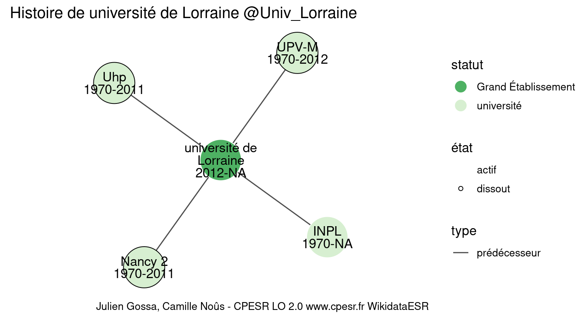 

Avertissements et édition : [logs](plots/etablissements/Q4173330.md) 

### université de Lorraine @Univ_Lorraine : Composition.     Edition des données : https://github.com/cpesr/wikidataESR/blob/master/plots/etablissements/Q4173330.md 

 

Avertissements et édition : [logs](plots/etablissements/Q4173330.md) 

### université de Lorraine @Univ_Lorraine : Associations.     Edition des données : https://github.com/cpesr/wikidataESR/blob/master/plots/etablissements/Q4173330.md 

 

Avertissements et édition : [logs](plots/etablissements/Q4173330.md) 

### Université de Montpellier NA : Histoire.     Edition des données : https://github.com/cpesr/wikidataESR/blob/master/plots/etablissements/Q776223.md 

 

Avertissements et édition : [logs](plots/etablissements/Q776223.md) 

### Université de Montpellier NA : Composition.     Edition des données : https://github.com/cpesr/wikidataESR/blob/master/plots/etablissements/Q776223.md 

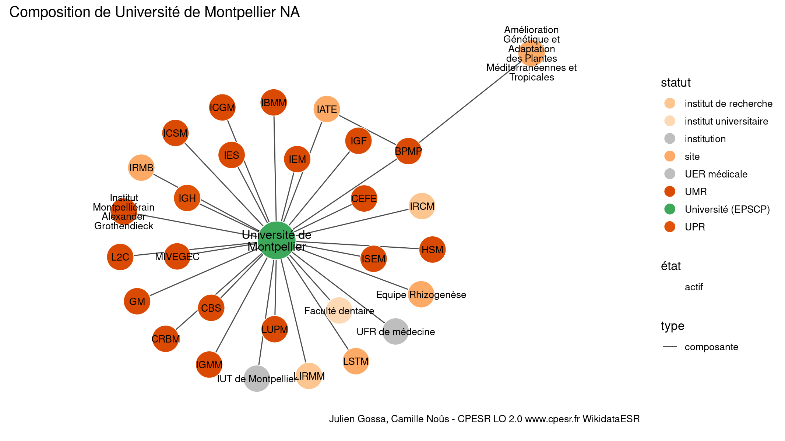 

Avertissements et édition : [logs](plots/etablissements/Q776223.md) 

### Université de Montpellier NA : Associations.     Edition des données : https://github.com/cpesr/wikidataESR/blob/master/plots/etablissements/Q776223.md 

 

Avertissements et édition : [logs](plots/etablissements/Q776223.md) 

### UNÎMES @unimesfr : Histoire.     Edition des données : https://github.com/cpesr/wikidataESR/blob/master/plots/etablissements/Q2496121.md 


Erreur : les données sont probablement trop partielles.
```
Error in wdesr_ggplot_graph(df, node_size = node_size, label_sizes = label_sizes, : Empty ESR graph: something went wrong with the graph production parameters

``` 

Avertissements et édition : [logs](plots/etablissements/Q2496121.md) 

### UNÎMES @unimesfr : Composition.     Edition des données : https://github.com/cpesr/wikidataESR/blob/master/plots/etablissements/Q2496121.md 

 

Avertissements et édition : [logs](plots/etablissements/Q2496121.md) 

### UNÎMES @unimesfr : Associations.     Edition des données : https://github.com/cpesr/wikidataESR/blob/master/plots/etablissements/Q2496121.md 

 

Avertissements et édition : [logs](plots/etablissements/Q2496121.md) 

### U-Paris @Univ_Paris : Histoire.     Edition des données : https://github.com/cpesr/wikidataESR/blob/master/plots/etablissements/Q55849612.md 

 

Avertissements et édition : [logs](plots/etablissements/Q55849612.md) 

### U-Paris @Univ_Paris : Composition.     Edition des données : https://github.com/cpesr/wikidataESR/blob/master/plots/etablissements/Q55849612.md 

 

Avertissements et édition : [logs](plots/etablissements/Q55849612.md) 

### U-Paris @Univ_Paris : Associations.     Edition des données : https://github.com/cpesr/wikidataESR/blob/master/plots/etablissements/Q55849612.md 

 

Avertissements et édition : [logs](plots/etablissements/Q55849612.md) 

### UPPA @universite_uppa : Histoire.     Edition des données : https://github.com/cpesr/wikidataESR/blob/master/plots/etablissements/Q572968.md 


Erreur : les données sont probablement trop partielles.
```
Error in wdesr_ggplot_graph(df, node_size = node_size, label_sizes = label_sizes, : Empty ESR graph: something went wrong with the graph production parameters

``` 

Avertissements et édition : [logs](plots/etablissements/Q572968.md) 

### UPPA @universite_uppa : Composition.     Edition des données : https://github.com/cpesr/wikidataESR/blob/master/plots/etablissements/Q572968.md 

 

Avertissements et édition : [logs](plots/etablissements/Q572968.md) 

### UPPA @universite_uppa : Associations.     Edition des données : https://github.com/cpesr/wikidataESR/blob/master/plots/etablissements/Q572968.md 


Erreur : les données sont probablement trop partielles.
```
Error in wdesr_ggplot_graph(df, node_size = node_size, label_sizes = label_sizes, : Empty ESR graph: something went wrong with the graph production parameters

``` 

Avertissements et édition : [logs](plots/etablissements/Q572968.md) 

### UPVD @upvd1 : Histoire.     Edition des données : https://github.com/cpesr/wikidataESR/blob/master/plots/etablissements/Q304872.md 

 

Avertissements et édition : [logs](plots/etablissements/Q304872.md) 

### UPVD @upvd1 : Composition.     Edition des données : https://github.com/cpesr/wikidataESR/blob/master/plots/etablissements/Q304872.md 

 

Avertissements et édition : [logs](plots/etablissements/Q304872.md) 

### UPVD @upvd1 : Associations.     Edition des données : https://github.com/cpesr/wikidataESR/blob/master/plots/etablissements/Q304872.md 

 

Avertissements et édition : [logs](plots/etablissements/Q304872.md) 

### UPJV @UPJV_Univ : Histoire.     Edition des données : https://github.com/cpesr/wikidataESR/blob/master/plots/etablissements/Q947747.md 


Erreur : les données sont probablement trop partielles.
```
Error in wdesr_ggplot_graph(df, node_size = node_size, label_sizes = label_sizes, : Empty ESR graph: something went wrong with the graph production parameters

``` 

Avertissements et édition : [logs](plots/etablissements/Q947747.md) 

### UPJV @UPJV_Univ : Composition.     Edition des données : https://github.com/cpesr/wikidataESR/blob/master/plots/etablissements/Q947747.md 


Erreur : les données sont probablement trop partielles.
```
Error in wdesr_ggplot_graph(df, node_size = node_size, label_sizes = label_sizes, : Empty ESR graph: something went wrong with the graph production parameters

``` 

Avertissements et édition : [logs](plots/etablissements/Q947747.md) 

### UPJV @UPJV_Univ : Associations.     Edition des données : https://github.com/cpesr/wikidataESR/blob/master/plots/etablissements/Q947747.md 


Erreur : les données sont probablement trop partielles.
```
Error in wdesr_ggplot_graph(df, node_size = node_size, label_sizes = label_sizes, : Empty ESR graph: something went wrong with the graph production parameters

``` 

Avertissements et édition : [logs](plots/etablissements/Q947747.md) 

### UnivPoitiers @UnivPoitiers : Histoire.     Edition des données : https://github.com/cpesr/wikidataESR/blob/master/plots/etablissements/Q661056.md 


Erreur : les données sont probablement trop partielles.
```
Error in wdesr_ggplot_graph(df, node_size = node_size, label_sizes = label_sizes, : Empty ESR graph: something went wrong with the graph production parameters

``` 

Avertissements et édition : [logs](plots/etablissements/Q661056.md) 

### UnivPoitiers @UnivPoitiers : Composition.     Edition des données : https://github.com/cpesr/wikidataESR/blob/master/plots/etablissements/Q661056.md 

 

Avertissements et édition : [logs](plots/etablissements/Q661056.md) 

### UnivPoitiers @UnivPoitiers : Associations.     Edition des données : https://github.com/cpesr/wikidataESR/blob/master/plots/etablissements/Q661056.md 


Erreur : les données sont probablement trop partielles.
```
Error in wdesr_ggplot_graph(df, node_size = node_size, label_sizes = label_sizes, : Empty ESR graph: something went wrong with the graph production parameters

``` 

Avertissements et édition : [logs](plots/etablissements/Q661056.md) 

### URCA @universitereims : Histoire.     Edition des données : https://github.com/cpesr/wikidataESR/blob/master/plots/etablissements/Q2496149.md 


Erreur : les données sont probablement trop partielles.
```
Error in wdesr_ggplot_graph(df, node_size = node_size, label_sizes = label_sizes, : Empty ESR graph: something went wrong with the graph production parameters

``` 

Avertissements et édition : [logs](plots/etablissements/Q2496149.md) 

### URCA @universitereims : Composition.     Edition des données : https://github.com/cpesr/wikidataESR/blob/master/plots/etablissements/Q2496149.md 

 

Avertissements et édition : [logs](plots/etablissements/Q2496149.md) 

### URCA @universitereims : Associations.     Edition des données : https://github.com/cpesr/wikidataESR/blob/master/plots/etablissements/Q2496149.md 

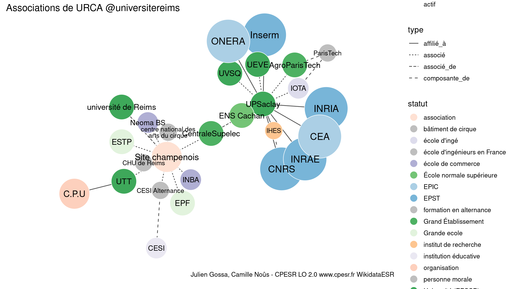 

Avertissements et édition : [logs](plots/etablissements/Q2496149.md) 

### UR1 @UnivRennes1 : Histoire.     Edition des données : https://github.com/cpesr/wikidataESR/blob/master/plots/etablissements/Q726595.md 

 

Avertissements et édition : [logs](plots/etablissements/Q726595.md) 

### UR1 @UnivRennes1 : Composition.     Edition des données : https://github.com/cpesr/wikidataESR/blob/master/plots/etablissements/Q726595.md 

 

Avertissements et édition : [logs](plots/etablissements/Q726595.md) 

### UR1 @UnivRennes1 : Associations.     Edition des données : https://github.com/cpesr/wikidataESR/blob/master/plots/etablissements/Q726595.md 


Erreur : les données sont probablement trop partielles.
```
Error in wdesr_ggplot_graph(df, node_size = node_size, label_sizes = label_sizes, : Empty ESR graph: something went wrong with the graph production parameters

``` 

Avertissements et édition : [logs](plots/etablissements/Q726595.md) 

### URN NA : Histoire.     Edition des données : https://github.com/cpesr/wikidataESR/blob/master/plots/etablissements/Q494247.md 


Erreur : les données sont probablement trop partielles.
```
Error in wdesr_ggplot_graph(df, node_size = node_size, label_sizes = label_sizes, : Empty ESR graph: something went wrong with the graph production parameters

``` 

Avertissements et édition : [logs](plots/etablissements/Q494247.md) 

### URN NA : Composition.     Edition des données : https://github.com/cpesr/wikidataESR/blob/master/plots/etablissements/Q494247.md 

 

Avertissements et édition : [logs](plots/etablissements/Q494247.md) 

### URN NA : Associations.     Edition des données : https://github.com/cpesr/wikidataESR/blob/master/plots/etablissements/Q494247.md 

 

Avertissements et édition : [logs](plots/etablissements/Q494247.md) 

### Unistra @unistra : Histoire.     Edition des données : https://github.com/cpesr/wikidataESR/blob/master/plots/etablissements/Q157575.md 

 

Avertissements et édition : [logs](plots/etablissements/Q157575.md) 

### Unistra @unistra : Composition.     Edition des données : https://github.com/cpesr/wikidataESR/blob/master/plots/etablissements/Q157575.md 

 

Avertissements et édition : [logs](plots/etablissements/Q157575.md) 

### Unistra @unistra : Associations.     Edition des données : https://github.com/cpesr/wikidataESR/blob/master/plots/etablissements/Q157575.md 

 

Avertissements et édition : [logs](plots/etablissements/Q157575.md) 

### Ustv @univtoulon : Histoire.     Edition des données : https://github.com/cpesr/wikidataESR/blob/master/plots/etablissements/Q1816857.md 


Erreur : les données sont probablement trop partielles.
```
Error in wdesr_ggplot_graph(df, node_size = node_size, label_sizes = label_sizes, : Empty ESR graph: something went wrong with the graph production parameters

``` 

Avertissements et édition : [logs](plots/etablissements/Q1816857.md) 

### Ustv @univtoulon : Composition.     Edition des données : https://github.com/cpesr/wikidataESR/blob/master/plots/etablissements/Q1816857.md 

 

Avertissements et édition : [logs](plots/etablissements/Q1816857.md) 

### Ustv @univtoulon : Associations.     Edition des données : https://github.com/cpesr/wikidataESR/blob/master/plots/etablissements/Q1816857.md 

 

Avertissements et édition : [logs](plots/etablissements/Q1816857.md) 

### université de Tours @UnivTours : Histoire.     Edition des données : https://github.com/cpesr/wikidataESR/blob/master/plots/etablissements/Q494335.md 

 

Avertissements et édition : [logs](plots/etablissements/Q494335.md) 

### université de Tours @UnivTours : Composition.     Edition des données : https://github.com/cpesr/wikidataESR/blob/master/plots/etablissements/Q494335.md 

 

Avertissements et édition : [logs](plots/etablissements/Q494335.md) 

### université de Tours @UnivTours : Associations.     Edition des données : https://github.com/cpesr/wikidataESR/blob/master/plots/etablissements/Q494335.md 

 

Avertissements et édition : [logs](plots/etablissements/Q494335.md) 

### UVSQ @uvsq : Histoire.     Edition des données : https://github.com/cpesr/wikidataESR/blob/master/plots/etablissements/Q186638.md 


Erreur : les données sont probablement trop partielles.
```
Error in wdesr_ggplot_graph(df, node_size = node_size, label_sizes = label_sizes, : Empty ESR graph: something went wrong with the graph production parameters

``` 

Avertissements et édition : [logs](plots/etablissements/Q186638.md) 

### UVSQ @uvsq : Composition.     Edition des données : https://github.com/cpesr/wikidataESR/blob/master/plots/etablissements/Q186638.md 

 

Avertissements et édition : [logs](plots/etablissements/Q186638.md) 

### UVSQ @uvsq : Associations.     Edition des données : https://github.com/cpesr/wikidataESR/blob/master/plots/etablissements/Q186638.md 

 

Avertissements et édition : [logs](plots/etablissements/Q186638.md) 

### université des Antilles @UnivAntilles : Histoire.     Edition des données : https://github.com/cpesr/wikidataESR/blob/master/plots/etablissements/Q16682075.md 


Erreur : les données sont probablement trop partielles.
```
Error in wdesr_ggplot_graph(df, node_size = node_size, label_sizes = label_sizes, : Empty ESR graph: something went wrong with the graph production parameters

``` 

Avertissements et édition : [logs](plots/etablissements/Q16682075.md) 

### université des Antilles @UnivAntilles : Composition.     Edition des données : https://github.com/cpesr/wikidataESR/blob/master/plots/etablissements/Q16682075.md 


Erreur : les données sont probablement trop partielles.
```
Error in wdesr_ggplot_graph(df, node_size = node_size, label_sizes = label_sizes, : Empty ESR graph: something went wrong with the graph production parameters

``` 

Avertissements et édition : [logs](plots/etablissements/Q16682075.md) 

### université des Antilles @UnivAntilles : Associations.     Edition des données : https://github.com/cpesr/wikidataESR/blob/master/plots/etablissements/Q16682075.md 


Erreur : les données sont probablement trop partielles.
```
Error in wdesr_ggplot_graph(df, node_size = node_size, label_sizes = label_sizes, : Empty ESR graph: something went wrong with the graph production parameters

``` 

Avertissements et édition : [logs](plots/etablissements/Q16682075.md) 

### ULCO @ULCO_Univ : Histoire.     Edition des données : https://github.com/cpesr/wikidataESR/blob/master/plots/etablissements/Q3551755.md 


Erreur : les données sont probablement trop partielles.
```
Error in wdesr_ggplot_graph(df, node_size = node_size, label_sizes = label_sizes, : Empty ESR graph: something went wrong with the graph production parameters

``` 

Avertissements et édition : [logs](plots/etablissements/Q3551755.md) 

### ULCO @ULCO_Univ : Composition.     Edition des données : https://github.com/cpesr/wikidataESR/blob/master/plots/etablissements/Q3551755.md 

 

Avertissements et édition : [logs](plots/etablissements/Q3551755.md) 

### ULCO @ULCO_Univ : Associations.     Edition des données : https://github.com/cpesr/wikidataESR/blob/master/plots/etablissements/Q3551755.md 


Erreur : les données sont probablement trop partielles.
```
Error in wdesr_ggplot_graph(df, node_size = node_size, label_sizes = label_sizes, : Empty ESR graph: something went wrong with the graph production parameters

``` 

Avertissements et édition : [logs](plots/etablissements/Q3551755.md) 

### UGA @UGrenobleAlpes : Histoire.     Edition des données : https://github.com/cpesr/wikidataESR/blob/master/plots/etablissements/Q945876.md 

 

Avertissements et édition : [logs](plots/etablissements/Q945876.md) 

### UGA @UGrenobleAlpes : Composition.     Edition des données : https://github.com/cpesr/wikidataESR/blob/master/plots/etablissements/Q945876.md 

 

Avertissements et édition : [logs](plots/etablissements/Q945876.md) 

### UGA @UGrenobleAlpes : Associations.     Edition des données : https://github.com/cpesr/wikidataESR/blob/master/plots/etablissements/Q945876.md 


Erreur : les données sont probablement trop partielles.
```
Error in wdesr_ggplot_graph(df, node_size = node_size, label_sizes = label_sizes, : Empty ESR graph: something went wrong with the graph production parameters

``` 

Avertissements et édition : [logs](plots/etablissements/Q945876.md) 

### UGE @UGustaveEiffel : Histoire.     Edition des données : https://github.com/cpesr/wikidataESR/blob/master/plots/etablissements/Q65153823.md 

 

Avertissements et édition : [logs](plots/etablissements/Q65153823.md) 

### UGE @UGustaveEiffel : Composition.     Edition des données : https://github.com/cpesr/wikidataESR/blob/master/plots/etablissements/Q65153823.md 

 

Avertissements et édition : [logs](plots/etablissements/Q65153823.md) 

### UGE @UGustaveEiffel : Associations.     Edition des données : https://github.com/cpesr/wikidataESR/blob/master/plots/etablissements/Q65153823.md 


Erreur : les données sont probablement trop partielles.
```
Error in wdesr_ggplot_graph(df, node_size = node_size, label_sizes = label_sizes, : Empty ESR graph: something went wrong with the graph production parameters

``` 

Avertissements et édition : [logs](plots/etablissements/Q65153823.md) 

### UJM @Univ_St_Etienne : Histoire.     Edition des données : https://github.com/cpesr/wikidataESR/blob/master/plots/etablissements/Q623154.md 


Erreur : les données sont probablement trop partielles.
```
Error in wdesr_ggplot_graph(df, node_size = node_size, label_sizes = label_sizes, : Empty ESR graph: something went wrong with the graph production parameters

``` 

Avertissements et édition : [logs](plots/etablissements/Q623154.md) 

### UJM @Univ_St_Etienne : Composition.     Edition des données : https://github.com/cpesr/wikidataESR/blob/master/plots/etablissements/Q623154.md 

 

Avertissements et édition : [logs](plots/etablissements/Q623154.md) 

### UJM @Univ_St_Etienne : Associations.     Edition des données : https://github.com/cpesr/wikidataESR/blob/master/plots/etablissements/Q623154.md 

 

Avertissements et édition : [logs](plots/etablissements/Q623154.md) 

### université Lyon 3 @UJML : Histoire.     Edition des données : https://github.com/cpesr/wikidataESR/blob/master/plots/etablissements/Q4027.md 

 

Avertissements et édition : [logs](plots/etablissements/Q4027.md) 

### université Lyon 3 @UJML : Composition.     Edition des données : https://github.com/cpesr/wikidataESR/blob/master/plots/etablissements/Q4027.md 

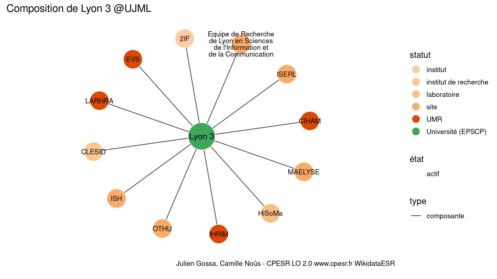 

Avertissements et édition : [logs](plots/etablissements/Q4027.md) 

### université Lyon 3 @UJML : Associations.     Edition des données : https://github.com/cpesr/wikidataESR/blob/master/plots/etablissements/Q4027.md 

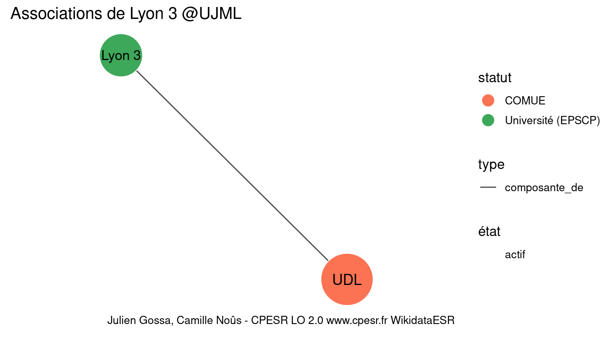 

Avertissements et édition : [logs](plots/etablissements/Q4027.md) 

### ULH NA : Histoire.     Edition des données : https://github.com/cpesr/wikidataESR/blob/master/plots/etablissements/Q1784954.md 


Erreur : les données sont probablement trop partielles.
```
Error in wdesr_ggplot_graph(df, node_size = node_size, label_sizes = label_sizes, : Empty ESR graph: something went wrong with the graph production parameters

``` 

Avertissements et édition : [logs](plots/etablissements/Q1784954.md) 

### ULH NA : Composition.     Edition des données : https://github.com/cpesr/wikidataESR/blob/master/plots/etablissements/Q1784954.md 

 

Avertissements et édition : [logs](plots/etablissements/Q1784954.md) 

### ULH NA : Associations.     Edition des données : https://github.com/cpesr/wikidataESR/blob/master/plots/etablissements/Q1784954.md 

 

Avertissements et édition : [logs](plots/etablissements/Q1784954.md) 

### Lyon 2 @univ_lyon2 : Histoire.     Edition des données : https://github.com/cpesr/wikidataESR/blob/master/plots/etablissements/Q4041.md 

 

Avertissements et édition : [logs](plots/etablissements/Q4041.md) 

### Lyon 2 @univ_lyon2 : Composition.     Edition des données : https://github.com/cpesr/wikidataESR/blob/master/plots/etablissements/Q4041.md 

 

Avertissements et édition : [logs](plots/etablissements/Q4041.md) 

### Lyon 2 @univ_lyon2 : Associations.     Edition des données : https://github.com/cpesr/wikidataESR/blob/master/plots/etablissements/Q4041.md 

 

Avertissements et édition : [logs](plots/etablissements/Q4041.md) 

### Assas @AssasParis2 : Histoire.     Edition des données : https://github.com/cpesr/wikidataESR/blob/master/plots/etablissements/Q662976.md 

 

Avertissements et édition : [logs](plots/etablissements/Q662976.md) 

### Assas @AssasParis2 : Composition.     Edition des données : https://github.com/cpesr/wikidataESR/blob/master/plots/etablissements/Q662976.md 

 

Avertissements et édition : [logs](plots/etablissements/Q662976.md) 

### Assas @AssasParis2 : Associations.     Edition des données : https://github.com/cpesr/wikidataESR/blob/master/plots/etablissements/Q662976.md 

 

Avertissements et édition : [logs](plots/etablissements/Q662976.md) 

### Paris 1 @SorbonneParis1 : Histoire.     Edition des données : https://github.com/cpesr/wikidataESR/blob/master/plots/etablissements/Q999763.md 

 

Avertissements et édition : [logs](plots/etablissements/Q999763.md) 

### Paris 1 @SorbonneParis1 : Composition.     Edition des données : https://github.com/cpesr/wikidataESR/blob/master/plots/etablissements/Q999763.md 

 

Avertissements et édition : [logs](plots/etablissements/Q999763.md) 

### Paris 1 @SorbonneParis1 : Associations.     Edition des données : https://github.com/cpesr/wikidataESR/blob/master/plots/etablissements/Q999763.md 

 

Avertissements et édition : [logs](plots/etablissements/Q999763.md) 

### UP8 @UnivParis8 : Histoire.     Edition des données : https://github.com/cpesr/wikidataESR/blob/master/plots/etablissements/Q1194988.md 

 

Avertissements et édition : [logs](plots/etablissements/Q1194988.md) 

### UP8 @UnivParis8 : Composition.     Edition des données : https://github.com/cpesr/wikidataESR/blob/master/plots/etablissements/Q1194988.md 

 

Avertissements et édition : [logs](plots/etablissements/Q1194988.md) 

### UP8 @UnivParis8 : Associations.     Edition des données : https://github.com/cpesr/wikidataESR/blob/master/plots/etablissements/Q1194988.md 

 

Avertissements et édition : [logs](plots/etablissements/Q1194988.md) 

### université Paris X @uparisnanterre : Histoire.     Edition des données : https://github.com/cpesr/wikidataESR/blob/master/plots/etablissements/Q1394262.md 

 

Avertissements et édition : [logs](plots/etablissements/Q1394262.md) 

### université Paris X @uparisnanterre : Composition.     Edition des données : https://github.com/cpesr/wikidataESR/blob/master/plots/etablissements/Q1394262.md 

 

Avertissements et édition : [logs](plots/etablissements/Q1394262.md) 

### université Paris X @uparisnanterre : Associations.     Edition des données : https://github.com/cpesr/wikidataESR/blob/master/plots/etablissements/Q1394262.md 

 

Avertissements et édition : [logs](plots/etablissements/Q1394262.md) 

### PSL @psl_univ : Histoire.     Edition des données : https://github.com/cpesr/wikidataESR/blob/master/plots/etablissements/Q1163431.md 

 

Avertissements et édition : [logs](plots/etablissements/Q1163431.md) 

### PSL @psl_univ : Composition.     Edition des données : https://github.com/cpesr/wikidataESR/blob/master/plots/etablissements/Q1163431.md 

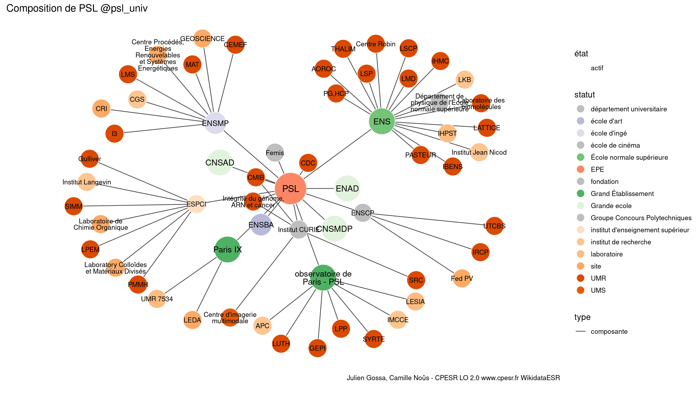 

Avertissements et édition : [logs](plots/etablissements/Q1163431.md) 

### PSL @psl_univ : Associations.     Edition des données : https://github.com/cpesr/wikidataESR/blob/master/plots/etablissements/Q1163431.md 


Erreur : les données sont probablement trop partielles.
```
Error in wdesr_ggplot_graph(df, node_size = node_size, label_sizes = label_sizes, : Empty ESR graph: something went wrong with the graph production parameters

``` 

Avertissements et édition : [logs](plots/etablissements/Q1163431.md) 

### UPEC @UPECactus : Histoire.     Edition des données : https://github.com/cpesr/wikidataESR/blob/master/plots/etablissements/Q980688.md 

 

Avertissements et édition : [logs](plots/etablissements/Q980688.md) 

### UPEC @UPECactus : Composition.     Edition des données : https://github.com/cpesr/wikidataESR/blob/master/plots/etablissements/Q980688.md 

 

Avertissements et édition : [logs](plots/etablissements/Q980688.md) 

### UPEC @UPECactus : Associations.     Edition des données : https://github.com/cpesr/wikidataESR/blob/master/plots/etablissements/Q980688.md 

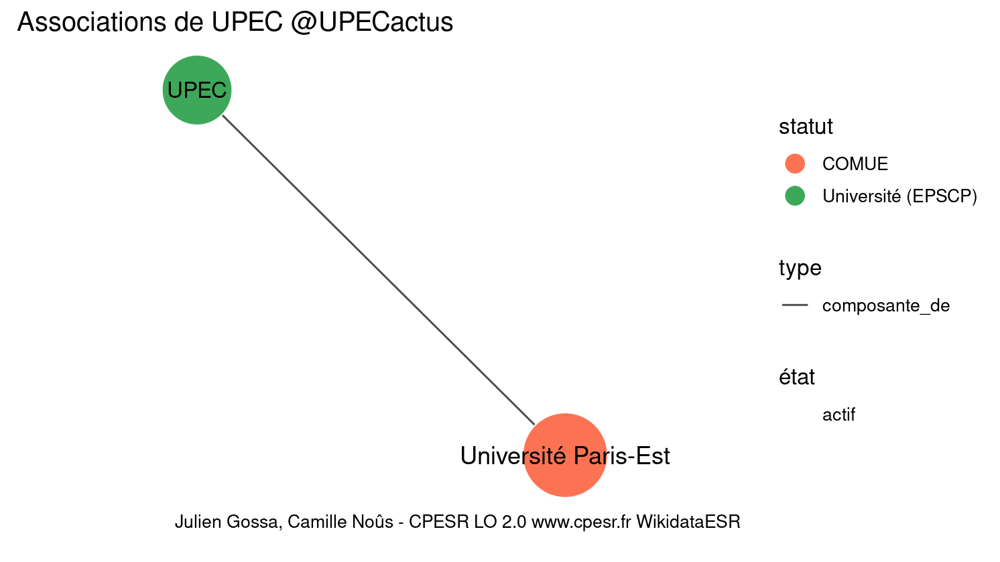 

Avertissements et édition : [logs](plots/etablissements/Q980688.md) 

### UPSa @UnivParisSaclay : Histoire.     Edition des données : https://github.com/cpesr/wikidataESR/blob/master/plots/etablissements/Q109409389.md 

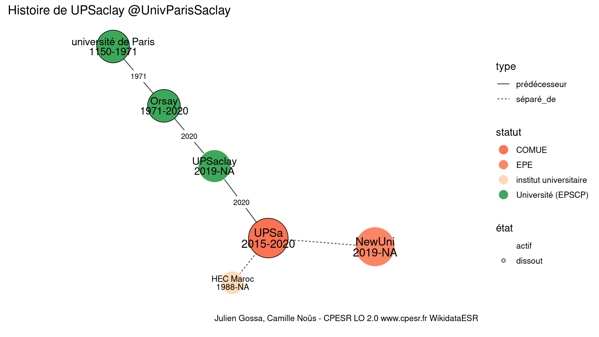 

Avertissements et édition : [logs](plots/etablissements/Q109409389.md) 

### UPSa @UnivParisSaclay : Composition.     Edition des données : https://github.com/cpesr/wikidataESR/blob/master/plots/etablissements/Q109409389.md 

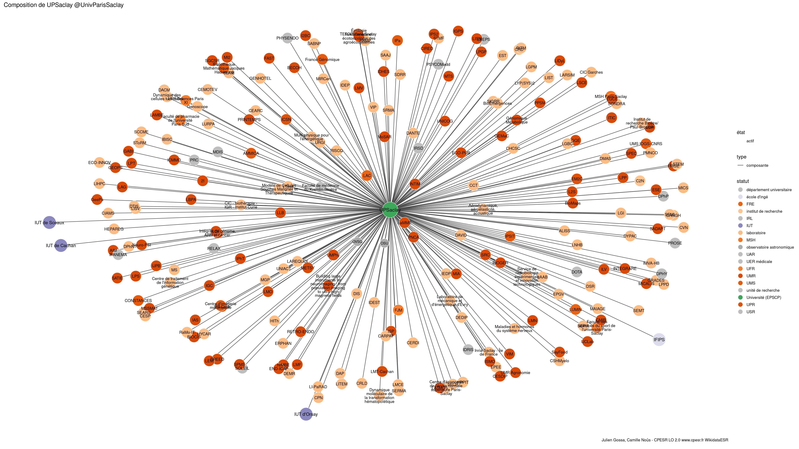 

Avertissements et édition : [logs](plots/etablissements/Q109409389.md) 

### UPSa @UnivParisSaclay : Associations.     Edition des données : https://github.com/cpesr/wikidataESR/blob/master/plots/etablissements/Q109409389.md 

 

Avertissements et édition : [logs](plots/etablissements/Q109409389.md) 

### UPV @univpaulvalery : Histoire.     Edition des données : https://github.com/cpesr/wikidataESR/blob/master/plots/etablissements/Q2912244.md 

 

Avertissements et édition : [logs](plots/etablissements/Q2912244.md) 

### UPV @univpaulvalery : Composition.     Edition des données : https://github.com/cpesr/wikidataESR/blob/master/plots/etablissements/Q2912244.md 

 

Avertissements et édition : [logs](plots/etablissements/Q2912244.md) 

### UPV @univpaulvalery : Associations.     Edition des données : https://github.com/cpesr/wikidataESR/blob/master/plots/etablissements/Q2912244.md 

 

Avertissements et édition : [logs](plots/etablissements/Q2912244.md) 

### UPHF @UphfOfficiel : Histoire.     Edition des données : https://github.com/cpesr/wikidataESR/blob/master/plots/etablissements/Q1548539.md 

 

Avertissements et édition : [logs](plots/etablissements/Q1548539.md) 

### UPHF @UphfOfficiel : Composition.     Edition des données : https://github.com/cpesr/wikidataESR/blob/master/plots/etablissements/Q1548539.md 

 

Avertissements et édition : [logs](plots/etablissements/Q1548539.md) 

### UPHF @UphfOfficiel : Associations.     Edition des données : https://github.com/cpesr/wikidataESR/blob/master/plots/etablissements/Q1548539.md 


Erreur : les données sont probablement trop partielles.
```
Error in wdesr_ggplot_graph(df, node_size = node_size, label_sizes = label_sizes, : Empty ESR graph: something went wrong with the graph production parameters

``` 

Avertissements et édition : [logs](plots/etablissements/Q1548539.md) 

### Rennes 2 @Univ_Rennes2 : Histoire.     Edition des données : https://github.com/cpesr/wikidataESR/blob/master/plots/etablissements/Q459026.md 

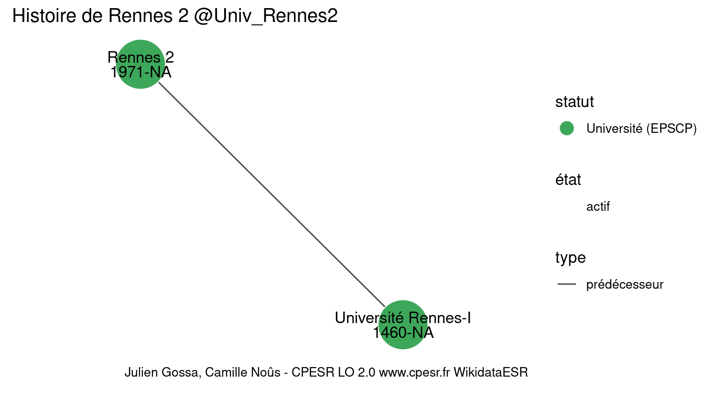 

Avertissements et édition : [logs](plots/etablissements/Q459026.md) 

### Rennes 2 @Univ_Rennes2 : Composition.     Edition des données : https://github.com/cpesr/wikidataESR/blob/master/plots/etablissements/Q459026.md 

 

Avertissements et édition : [logs](plots/etablissements/Q459026.md) 

### Rennes 2 @Univ_Rennes2 : Associations.     Edition des données : https://github.com/cpesr/wikidataESR/blob/master/plots/etablissements/Q459026.md 

 

Avertissements et édition : [logs](plots/etablissements/Q459026.md) 

### USMB @Univ_Savoie : Histoire.     Edition des données : https://github.com/cpesr/wikidataESR/blob/master/plots/etablissements/Q2496158.md 


Erreur : les données sont probablement trop partielles.
```
Error in wdesr_ggplot_graph(df, node_size = node_size, label_sizes = label_sizes, : Empty ESR graph: something went wrong with the graph production parameters

``` 

Avertissements et édition : [logs](plots/etablissements/Q2496158.md) 

### USMB @Univ_Savoie : Composition.     Edition des données : https://github.com/cpesr/wikidataESR/blob/master/plots/etablissements/Q2496158.md 

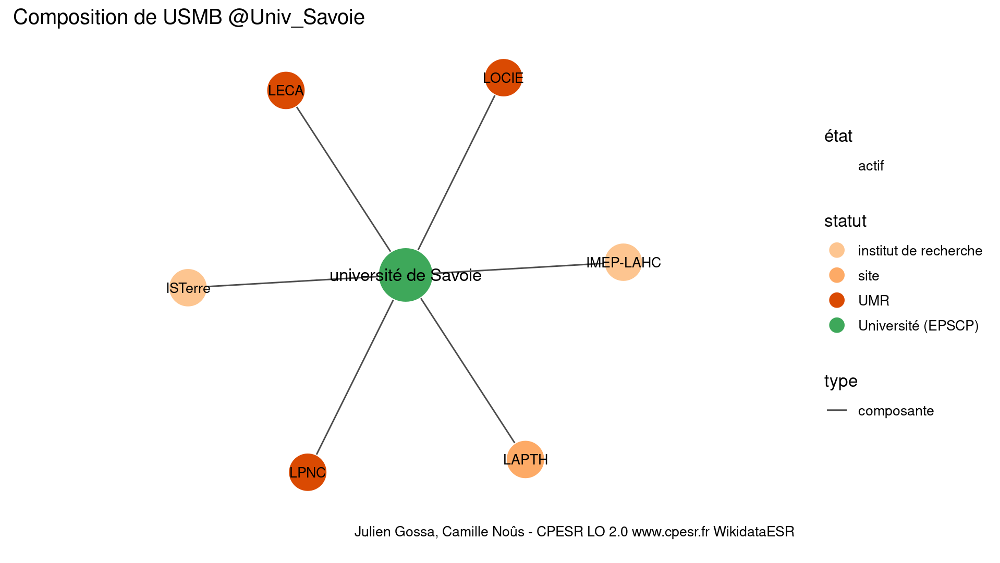 

Avertissements et édition : [logs](plots/etablissements/Q2496158.md) 

### USMB @Univ_Savoie : Associations.     Edition des données : https://github.com/cpesr/wikidataESR/blob/master/plots/etablissements/Q2496158.md 


Erreur : les données sont probablement trop partielles.
```
Error in wdesr_ggplot_graph(df, node_size = node_size, label_sizes = label_sizes, : Empty ESR graph: something went wrong with the graph production parameters

``` 

Avertissements et édition : [logs](plots/etablissements/Q2496158.md) 

### Paris 3 @SorbonneParis3 : Histoire.     Edition des données : https://github.com/cpesr/wikidataESR/blob/master/plots/etablissements/Q571293.md 

 

Avertissements et édition : [logs](plots/etablissements/Q571293.md) 

### Paris 3 @SorbonneParis3 : Composition.     Edition des données : https://github.com/cpesr/wikidataESR/blob/master/plots/etablissements/Q571293.md 

 

Avertissements et édition : [logs](plots/etablissements/Q571293.md) 

### Paris 3 @SorbonneParis3 : Associations.     Edition des données : https://github.com/cpesr/wikidataESR/blob/master/plots/etablissements/Q571293.md 


Erreur : les données sont probablement trop partielles.
```
Error in wdesr_ggplot_graph(df, node_size = node_size, label_sizes = label_sizes, : Empty ESR graph: something went wrong with the graph production parameters

``` 

Avertissements et édition : [logs](plots/etablissements/Q571293.md) 

### UP13 @univ_spn : Histoire.     Edition des données : https://github.com/cpesr/wikidataESR/blob/master/plots/etablissements/Q1780212.md 

 

Avertissements et édition : [logs](plots/etablissements/Q1780212.md) 

### UP13 @univ_spn : Composition.     Edition des données : https://github.com/cpesr/wikidataESR/blob/master/plots/etablissements/Q1780212.md 

 

Avertissements et édition : [logs](plots/etablissements/Q1780212.md) 

### UP13 @univ_spn : Associations.     Edition des données : https://github.com/cpesr/wikidataESR/blob/master/plots/etablissements/Q1780212.md 


Erreur : les données sont probablement trop partielles.
```
Error in wdesr_ggplot_graph(df, node_size = node_size, label_sizes = label_sizes, : Empty ESR graph: something went wrong with the graph production parameters

``` 

Avertissements et édition : [logs](plots/etablissements/Q1780212.md) 

### UT2 @UTJeanJaures : Histoire.     Edition des données : https://github.com/cpesr/wikidataESR/blob/master/plots/etablissements/Q1933558.md 

 

Avertissements et édition : [logs](plots/etablissements/Q1933558.md) 

### UT2 @UTJeanJaures : Composition.     Edition des données : https://github.com/cpesr/wikidataESR/blob/master/plots/etablissements/Q1933558.md 

 

Avertissements et édition : [logs](plots/etablissements/Q1933558.md) 

### UT2 @UTJeanJaures : Associations.     Edition des données : https://github.com/cpesr/wikidataESR/blob/master/plots/etablissements/Q1933558.md 

 

Avertissements et édition : [logs](plots/etablissements/Q1933558.md) 

### UT1 @UT1Capitole : Histoire.     Edition des données : https://github.com/cpesr/wikidataESR/blob/master/plots/etablissements/Q590201.md 

 

Avertissements et édition : [logs](plots/etablissements/Q590201.md) 

### UT1 @UT1Capitole : Composition.     Edition des données : https://github.com/cpesr/wikidataESR/blob/master/plots/etablissements/Q590201.md 

 

Avertissements et édition : [logs](plots/etablissements/Q590201.md) 

### UT1 @UT1Capitole : Associations.     Edition des données : https://github.com/cpesr/wikidataESR/blob/master/plots/etablissements/Q590201.md 

 

Avertissements et édition : [logs](plots/etablissements/Q590201.md) 

### Université Toulouse III @UT3PaulSabatier : Histoire.     Edition des données : https://github.com/cpesr/wikidataESR/blob/master/plots/etablissements/Q1273188.md 

 

Avertissements et édition : [logs](plots/etablissements/Q1273188.md) 

### Université Toulouse III @UT3PaulSabatier : Composition.     Edition des données : https://github.com/cpesr/wikidataESR/blob/master/plots/etablissements/Q1273188.md 

 

Avertissements et édition : [logs](plots/etablissements/Q1273188.md) 

### Université Toulouse III @UT3PaulSabatier : Associations.     Edition des données : https://github.com/cpesr/wikidataESR/blob/master/plots/etablissements/Q1273188.md 

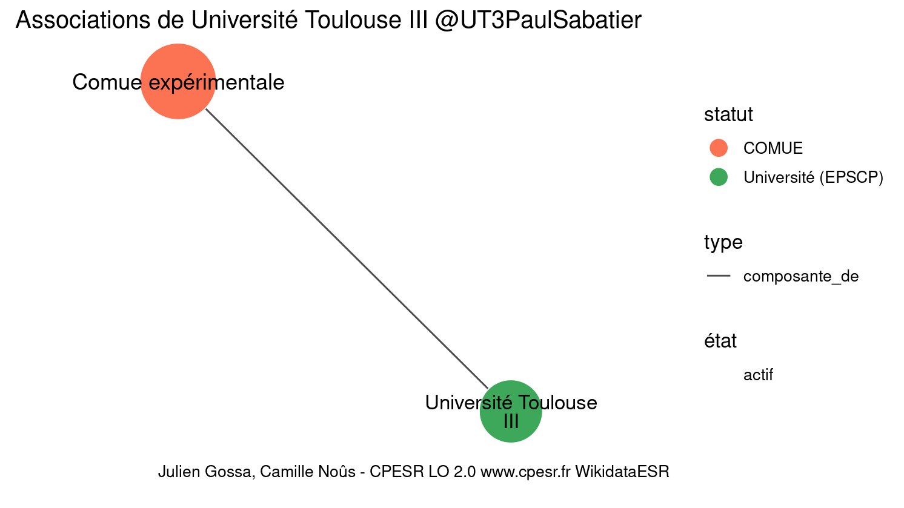 

Avertissements et édition : [logs](plots/etablissements/Q1273188.md) 

## Histoire, composition et association actuelles des Grands établissements (hors écoles) 

Twitters manquants :
```
 - ENSP
``` 

### Collège de France @cdf1530 : Histoire.     Edition des données : https://github.com/cpesr/wikidataESR/blob/master/plots/etablissements/Q202660.md 

 

Avertissements et édition : [logs](plots/etablissements/Q202660.md) 

### Collège de France @cdf1530 : Composition.     Edition des données : https://github.com/cpesr/wikidataESR/blob/master/plots/etablissements/Q202660.md 

 

Avertissements et édition : [logs](plots/etablissements/Q202660.md) 

### Collège de France @cdf1530 : Associations.     Edition des données : https://github.com/cpesr/wikidataESR/blob/master/plots/etablissements/Q202660.md 


Erreur : les données sont probablement trop partielles.
```
Error in wdesr_ggplot_graph(df, node_size = node_size, label_sizes = label_sizes, : Empty ESR graph: something went wrong with the graph production parameters

``` 

Avertissements et édition : [logs](plots/etablissements/Q202660.md) 

### EHESP @EHESP : Histoire.     Edition des données : https://github.com/cpesr/wikidataESR/blob/master/plots/etablissements/Q1587855.md 


Erreur : les données sont probablement trop partielles.
```
Error in wdesr_ggplot_graph(df, node_size = node_size, label_sizes = label_sizes, : Empty ESR graph: something went wrong with the graph production parameters

``` 

Avertissements et édition : [logs](plots/etablissements/Q1587855.md) 

### EHESP @EHESP : Composition.     Edition des données : https://github.com/cpesr/wikidataESR/blob/master/plots/etablissements/Q1587855.md 


Erreur : les données sont probablement trop partielles.
```
Error in wdesr_ggplot_graph(df, node_size = node_size, label_sizes = label_sizes, : Empty ESR graph: something went wrong with the graph production parameters

``` 

Avertissements et édition : [logs](plots/etablissements/Q1587855.md) 

### EHESP @EHESP : Associations.     Edition des données : https://github.com/cpesr/wikidataESR/blob/master/plots/etablissements/Q1587855.md 


Erreur : les données sont probablement trop partielles.
```
Error in wdesr_ggplot_graph(df, node_size = node_size, label_sizes = label_sizes, : Empty ESR graph: something went wrong with the graph production parameters

``` 

Avertissements et édition : [logs](plots/etablissements/Q1587855.md) 

### EHESS @EHESS_fr : Histoire.     Edition des données : https://github.com/cpesr/wikidataESR/blob/master/plots/etablissements/Q273518.md 

 

Avertissements et édition : [logs](plots/etablissements/Q273518.md) 

### EHESS @EHESS_fr : Composition.     Edition des données : https://github.com/cpesr/wikidataESR/blob/master/plots/etablissements/Q273518.md 

 

Avertissements et édition : [logs](plots/etablissements/Q273518.md) 

### EHESS @EHESS_fr : Associations.     Edition des données : https://github.com/cpesr/wikidataESR/blob/master/plots/etablissements/Q273518.md 

 

Avertissements et édition : [logs](plots/etablissements/Q273518.md) 

### EDL @EcoleduLouvre : Histoire.     Edition des données : https://github.com/cpesr/wikidataESR/blob/master/plots/etablissements/Q273534.md 


Erreur : les données sont probablement trop partielles.
```
Error in wdesr_ggplot_graph(df, node_size = node_size, label_sizes = label_sizes, : Empty ESR graph: something went wrong with the graph production parameters

``` 

Avertissements et édition : [logs](plots/etablissements/Q273534.md) 

### EDL @EcoleduLouvre : Composition.     Edition des données : https://github.com/cpesr/wikidataESR/blob/master/plots/etablissements/Q273534.md 


Erreur : les données sont probablement trop partielles.
```
Error in wdesr_ggplot_graph(df, node_size = node_size, label_sizes = label_sizes, : Empty ESR graph: something went wrong with the graph production parameters

``` 

Avertissements et édition : [logs](plots/etablissements/Q273534.md) 

### EDL @EcoleduLouvre : Associations.     Edition des données : https://github.com/cpesr/wikidataESR/blob/master/plots/etablissements/Q273534.md 

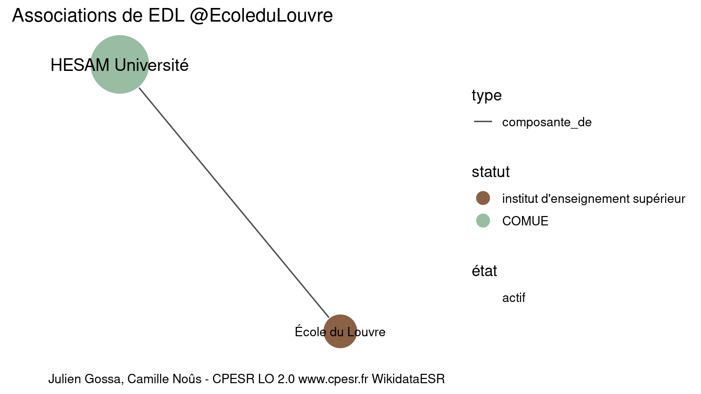 

Avertissements et édition : [logs](plots/etablissements/Q273534.md) 

### ENA @ena_fr : Histoire.     Edition des données : https://github.com/cpesr/wikidataESR/blob/master/plots/etablissements/Q273579.md 


Erreur : les données sont probablement trop partielles.
```
Error in wdesr_ggplot_graph(df, node_size = node_size, label_sizes = label_sizes, : Empty ESR graph: something went wrong with the graph production parameters

``` 

Avertissements et édition : [logs](plots/etablissements/Q273579.md) 

### ENA @ena_fr : Composition.     Edition des données : https://github.com/cpesr/wikidataESR/blob/master/plots/etablissements/Q273579.md 


Erreur : les données sont probablement trop partielles.
```
Error in wdesr_ggplot_graph(df, node_size = node_size, label_sizes = label_sizes, : Empty ESR graph: something went wrong with the graph production parameters

``` 

Avertissements et édition : [logs](plots/etablissements/Q273579.md) 

### ENA @ena_fr : Associations.     Edition des données : https://github.com/cpesr/wikidataESR/blob/master/plots/etablissements/Q273579.md 

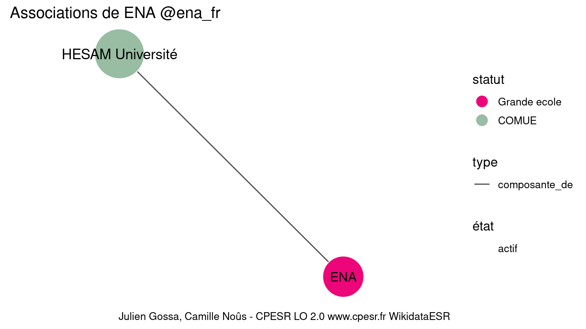 

Avertissements et édition : [logs](plots/etablissements/Q273579.md) 

### ENSFEA @ENSFEA_Toulouse : Histoire.     Edition des données : https://github.com/cpesr/wikidataESR/blob/master/plots/etablissements/Q3578119.md 


Erreur : les données sont probablement trop partielles.
```
Error in wdesr_ggplot_graph(df, node_size = node_size, label_sizes = label_sizes, : Empty ESR graph: something went wrong with the graph production parameters

``` 

Avertissements et édition : [logs](plots/etablissements/Q3578119.md) 

### ENSFEA @ENSFEA_Toulouse : Composition.     Edition des données : https://github.com/cpesr/wikidataESR/blob/master/plots/etablissements/Q3578119.md 


Erreur : les données sont probablement trop partielles.
```
Error in wdesr_ggplot_graph(df, node_size = node_size, label_sizes = label_sizes, : Empty ESR graph: something went wrong with the graph production parameters

``` 

Avertissements et édition : [logs](plots/etablissements/Q3578119.md) 

### ENSFEA @ENSFEA_Toulouse : Associations.     Edition des données : https://github.com/cpesr/wikidataESR/blob/master/plots/etablissements/Q3578119.md 


Erreur : les données sont probablement trop partielles.
```
Error in wdesr_ggplot_graph(df, node_size = node_size, label_sizes = label_sizes, : Empty ESR graph: something went wrong with the graph production parameters

``` 

Avertissements et édition : [logs](plots/etablissements/Q3578119.md) 

### ENSP NA : Histoire.     Edition des données : https://github.com/cpesr/wikidataESR/blob/master/plots/etablissements/Q3578260.md 


Erreur : les données sont probablement trop partielles.
```
Error in wdesr_ggplot_graph(df, node_size = node_size, label_sizes = label_sizes, : Empty ESR graph: something went wrong with the graph production parameters

``` 

Avertissements et édition : [logs](plots/etablissements/Q3578260.md) 

### ENSP NA : Composition.     Edition des données : https://github.com/cpesr/wikidataESR/blob/master/plots/etablissements/Q3578260.md 


Erreur : les données sont probablement trop partielles.
```
Error in wdesr_ggplot_graph(df, node_size = node_size, label_sizes = label_sizes, : Empty ESR graph: something went wrong with the graph production parameters

``` 

Avertissements et édition : [logs](plots/etablissements/Q3578260.md) 

### ENSP NA : Associations.     Edition des données : https://github.com/cpesr/wikidataESR/blob/master/plots/etablissements/Q3578260.md 


Erreur : les données sont probablement trop partielles.
```
Error in wdesr_ggplot_graph(df, node_size = node_size, label_sizes = label_sizes, : Empty ESR graph: something went wrong with the graph production parameters

``` 

Avertissements et édition : [logs](plots/etablissements/Q3578260.md) 

### ENSSIB @enssib : Histoire.     Edition des données : https://github.com/cpesr/wikidataESR/blob/master/plots/etablissements/Q2791269.md 


Erreur : les données sont probablement trop partielles.
```
Error in wdesr_ggplot_graph(df, node_size = node_size, label_sizes = label_sizes, : Empty ESR graph: something went wrong with the graph production parameters

``` 

Avertissements et édition : [logs](plots/etablissements/Q2791269.md) 

### ENSSIB @enssib : Composition.     Edition des données : https://github.com/cpesr/wikidataESR/blob/master/plots/etablissements/Q2791269.md 

 

Avertissements et édition : [logs](plots/etablissements/Q2791269.md) 

### ENSSIB @enssib : Associations.     Edition des données : https://github.com/cpesr/wikidataESR/blob/master/plots/etablissements/Q2791269.md 


Erreur : les données sont probablement trop partielles.
```
Error in wdesr_ggplot_graph(df, node_size = node_size, label_sizes = label_sizes, : Empty ESR graph: something went wrong with the graph production parameters

``` 

Avertissements et édition : [logs](plots/etablissements/Q2791269.md) 

### INHA @INHA_Fr : Histoire.     Edition des données : https://github.com/cpesr/wikidataESR/blob/master/plots/etablissements/Q3152376.md 


Erreur : les données sont probablement trop partielles.
```
Error in wdesr_ggplot_graph(df, node_size = node_size, label_sizes = label_sizes, : Empty ESR graph: something went wrong with the graph production parameters

``` 

Avertissements et édition : [logs](plots/etablissements/Q3152376.md) 

### INHA @INHA_Fr : Composition.     Edition des données : https://github.com/cpesr/wikidataESR/blob/master/plots/etablissements/Q3152376.md 


Erreur : les données sont probablement trop partielles.
```
Error in wdesr_ggplot_graph(df, node_size = node_size, label_sizes = label_sizes, : Empty ESR graph: something went wrong with the graph production parameters

``` 

Avertissements et édition : [logs](plots/etablissements/Q3152376.md) 

### INHA @INHA_Fr : Associations.     Edition des données : https://github.com/cpesr/wikidataESR/blob/master/plots/etablissements/Q3152376.md 


Erreur : les données sont probablement trop partielles.
```
Error in wdesr_ggplot_graph(df, node_size = node_size, label_sizes = label_sizes, : Empty ESR graph: something went wrong with the graph production parameters

``` 

Avertissements et édition : [logs](plots/etablissements/Q3152376.md) 

### INALCO @Inalco : Histoire.     Edition des données : https://github.com/cpesr/wikidataESR/blob/master/plots/etablissements/Q1430113.md 

 

Avertissements et édition : [logs](plots/etablissements/Q1430113.md) 

### INALCO @Inalco : Composition.     Edition des données : https://github.com/cpesr/wikidataESR/blob/master/plots/etablissements/Q1430113.md 

 

Avertissements et édition : [logs](plots/etablissements/Q1430113.md) 

### INALCO @Inalco : Associations.     Edition des données : https://github.com/cpesr/wikidataESR/blob/master/plots/etablissements/Q1430113.md 


Erreur : les données sont probablement trop partielles.
```
Error in wdesr_ggplot_graph(df, node_size = node_size, label_sizes = label_sizes, : Empty ESR graph: something went wrong with the graph production parameters

``` 

Avertissements et édition : [logs](plots/etablissements/Q1430113.md) 

### Inp @Inp_patrimoine : Histoire.     Edition des données : https://github.com/cpesr/wikidataESR/blob/master/plots/etablissements/Q3152445.md 


Erreur : les données sont probablement trop partielles.
```
Error in wdesr_ggplot_graph(df, node_size = node_size, label_sizes = label_sizes, : Empty ESR graph: something went wrong with the graph production parameters

``` 

Avertissements et édition : [logs](plots/etablissements/Q3152445.md) 

### Inp @Inp_patrimoine : Composition.     Edition des données : https://github.com/cpesr/wikidataESR/blob/master/plots/etablissements/Q3152445.md 


Erreur : les données sont probablement trop partielles.
```
Error in wdesr_ggplot_graph(df, node_size = node_size, label_sizes = label_sizes, : Empty ESR graph: something went wrong with the graph production parameters

``` 

Avertissements et édition : [logs](plots/etablissements/Q3152445.md) 

### Inp @Inp_patrimoine : Associations.     Edition des données : https://github.com/cpesr/wikidataESR/blob/master/plots/etablissements/Q3152445.md 

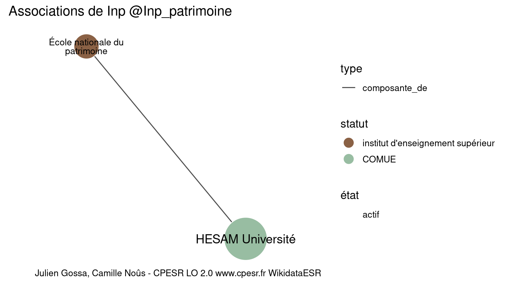 

Avertissements et édition : [logs](plots/etablissements/Q3152445.md) 

### INSEP @INSEP_PARIS : Histoire.     Edition des données : https://github.com/cpesr/wikidataESR/blob/master/plots/etablissements/Q3152447.md 

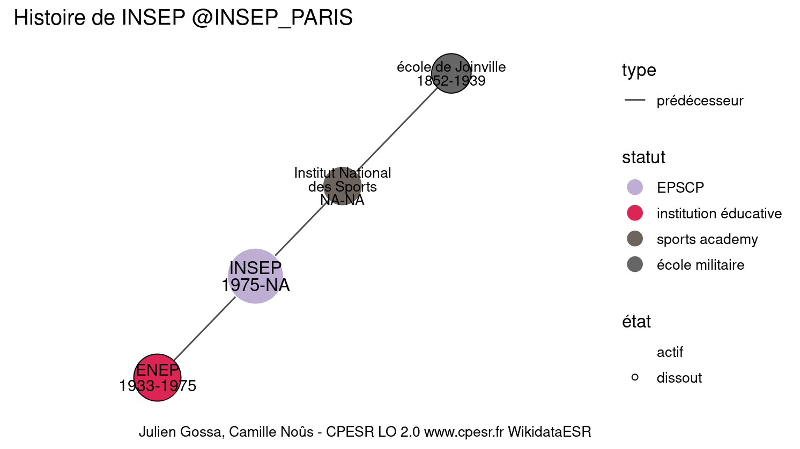 

Avertissements et édition : [logs](plots/etablissements/Q3152447.md) 

### INSEP @INSEP_PARIS : Composition.     Edition des données : https://github.com/cpesr/wikidataESR/blob/master/plots/etablissements/Q3152447.md 


Erreur : les données sont probablement trop partielles.
```
Error in wdesr_ggplot_graph(df, node_size = node_size, label_sizes = label_sizes, : Empty ESR graph: something went wrong with the graph production parameters

``` 

Avertissements et édition : [logs](plots/etablissements/Q3152447.md) 

### INSEP @INSEP_PARIS : Associations.     Edition des données : https://github.com/cpesr/wikidataESR/blob/master/plots/etablissements/Q3152447.md 


Erreur : les données sont probablement trop partielles.
```
Error in wdesr_ggplot_graph(df, node_size = node_size, label_sizes = label_sizes, : Empty ESR graph: something went wrong with the graph production parameters

``` 

Avertissements et édition : [logs](plots/etablissements/Q3152447.md) 

### INS HEA @ins_hea : Histoire.     Edition des données : https://github.com/cpesr/wikidataESR/blob/master/plots/etablissements/Q3152454.md 


Erreur : les données sont probablement trop partielles.
```
Error in wdesr_ggplot_graph(df, node_size = node_size, label_sizes = label_sizes, : Empty ESR graph: something went wrong with the graph production parameters

``` 

Avertissements et édition : [logs](plots/etablissements/Q3152454.md) 

### INS HEA @ins_hea : Composition.     Edition des données : https://github.com/cpesr/wikidataESR/blob/master/plots/etablissements/Q3152454.md 


Erreur : les données sont probablement trop partielles.
```
Error in wdesr_ggplot_graph(df, node_size = node_size, label_sizes = label_sizes, : Empty ESR graph: something went wrong with the graph production parameters

``` 

Avertissements et édition : [logs](plots/etablissements/Q3152454.md) 

### INS HEA @ins_hea : Associations.     Edition des données : https://github.com/cpesr/wikidataESR/blob/master/plots/etablissements/Q3152454.md 


Erreur : les données sont probablement trop partielles.
```
Error in wdesr_ggplot_graph(df, node_size = node_size, label_sizes = label_sizes, : Empty ESR graph: something went wrong with the graph production parameters

``` 

Avertissements et édition : [logs](plots/etablissements/Q3152454.md) 

### MNHN @Le_Museum : Histoire.     Edition des données : https://github.com/cpesr/wikidataESR/blob/master/plots/etablissements/Q838691.md 


Erreur : les données sont probablement trop partielles.
```
Error in wdesr_ggplot_graph(df, node_size = node_size, label_sizes = label_sizes, : Empty ESR graph: something went wrong with the graph production parameters

``` 

Avertissements et édition : [logs](plots/etablissements/Q838691.md) 

### MNHN @Le_Museum : Composition.     Edition des données : https://github.com/cpesr/wikidataESR/blob/master/plots/etablissements/Q838691.md 

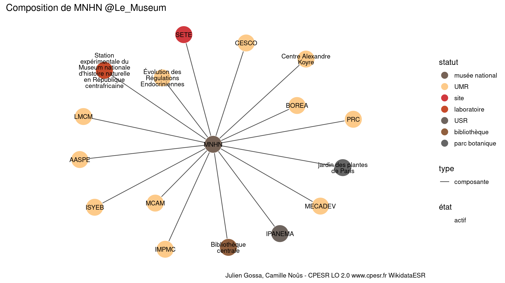 

Avertissements et édition : [logs](plots/etablissements/Q838691.md) 

### MNHN @Le_Museum : Associations.     Edition des données : https://github.com/cpesr/wikidataESR/blob/master/plots/etablissements/Q838691.md 

 

Avertissements et édition : [logs](plots/etablissements/Q838691.md) 

## Histoire, composition et association actuelles des Ecoles d'ingénieurs (CTI) 

Twitters manquants :
```
 - ECAM-EPMI
 - ECE
 - Ecole de l'air et de l'espace
 - ENM
 - ENSG-Géomatique
 - ENTPE
 - ONIRIS
 - ESM ST CYR
 - ESITC Metz
 - ESTACA
 - ESB
 - EPF
 - Institut Agro
 - INSTN
 - ISBA-TP MARS
 - ITECH
 - Yncréa Méditerranée
``` 

### Agrosup Dijon @AgroSupDijon : Histoire.     Edition des données : https://github.com/cpesr/wikidataESR/blob/master/plots/etablissements/Q8077943.md 


Erreur : les données sont probablement trop partielles.
```
Error in wdesr_ggplot_graph(df, node_size = node_size, label_sizes = label_sizes, : Empty ESR graph: something went wrong with the graph production parameters

``` 

Avertissements et édition : [logs](plots/etablissements/Q8077943.md) 

### Agrosup Dijon @AgroSupDijon : Composition.     Edition des données : https://github.com/cpesr/wikidataESR/blob/master/plots/etablissements/Q8077943.md 

 

Avertissements et édition : [logs](plots/etablissements/Q8077943.md) 

### Agrosup Dijon @AgroSupDijon : Associations.     Edition des données : https://github.com/cpesr/wikidataESR/blob/master/plots/etablissements/Q8077943.md 


Erreur : les données sont probablement trop partielles.
```
Error in wdesr_ggplot_graph(df, node_size = node_size, label_sizes = label_sizes, : Empty ESR graph: something went wrong with the graph production parameters

``` 

Avertissements et édition : [logs](plots/etablissements/Q8077943.md) 

### Arts et Métiers @ArtsetMetiers_ : Histoire.     Edition des données : https://github.com/cpesr/wikidataESR/blob/master/plots/etablissements/Q2570220.md 


Erreur : les données sont probablement trop partielles.
```
Error in wdesr_ggplot_graph(df, node_size = node_size, label_sizes = label_sizes, : Empty ESR graph: something went wrong with the graph production parameters

``` 

Avertissements et édition : [logs](plots/etablissements/Q2570220.md) 

### Arts et Métiers @ArtsetMetiers_ : Composition.     Edition des données : https://github.com/cpesr/wikidataESR/blob/master/plots/etablissements/Q2570220.md 

 

Avertissements et édition : [logs](plots/etablissements/Q2570220.md) 

### Arts et Métiers @ArtsetMetiers_ : Associations.     Edition des données : https://github.com/cpesr/wikidataESR/blob/master/plots/etablissements/Q2570220.md 

 

Avertissements et édition : [logs](plots/etablissements/Q2570220.md) 

### IPB @BordeauxINP : Histoire.     Edition des données : https://github.com/cpesr/wikidataESR/blob/master/plots/etablissements/Q3152470.md 


Erreur : les données sont probablement trop partielles.
```
Error in wdesr_ggplot_graph(df, node_size = node_size, label_sizes = label_sizes, : Empty ESR graph: something went wrong with the graph production parameters

``` 

Avertissements et édition : [logs](plots/etablissements/Q3152470.md) 

### IPB @BordeauxINP : Composition.     Edition des données : https://github.com/cpesr/wikidataESR/blob/master/plots/etablissements/Q3152470.md 

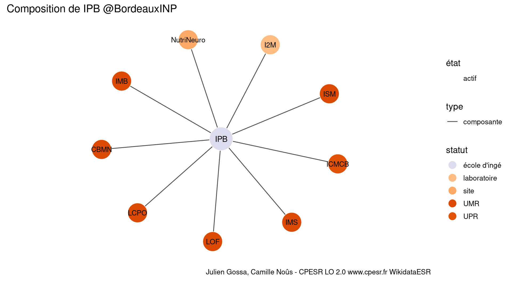 

Avertissements et édition : [logs](plots/etablissements/Q3152470.md) 

### IPB @BordeauxINP : Associations.     Edition des données : https://github.com/cpesr/wikidataESR/blob/master/plots/etablissements/Q3152470.md 


Erreur : les données sont probablement trop partielles.
```
Error in wdesr_ggplot_graph(df, node_size = node_size, label_sizes = label_sizes, : Empty ESR graph: something went wrong with the graph production parameters

``` 

Avertissements et édition : [logs](plots/etablissements/Q3152470.md) 

### CLI @Centralelille : Histoire.     Edition des données : https://github.com/cpesr/wikidataESR/blob/master/plots/etablissements/Q273461.md 


Erreur : les données sont probablement trop partielles.
```
Error in wdesr_ggplot_graph(df, node_size = node_size, label_sizes = label_sizes, : Empty ESR graph: something went wrong with the graph production parameters

``` 

Avertissements et édition : [logs](plots/etablissements/Q273461.md) 

### CLI @Centralelille : Composition.     Edition des données : https://github.com/cpesr/wikidataESR/blob/master/plots/etablissements/Q273461.md 

 

Avertissements et édition : [logs](plots/etablissements/Q273461.md) 

### CLI @Centralelille : Associations.     Edition des données : https://github.com/cpesr/wikidataESR/blob/master/plots/etablissements/Q273461.md 

 

Avertissements et édition : [logs](plots/etablissements/Q273461.md) 

### EC Lyon @CentraleLyon : Histoire.     Edition des données : https://github.com/cpesr/wikidataESR/blob/master/plots/etablissements/Q10177.md 


Erreur : les données sont probablement trop partielles.
```
Error in wdesr_ggplot_graph(df, node_size = node_size, label_sizes = label_sizes, : Empty ESR graph: something went wrong with the graph production parameters

``` 

Avertissements et édition : [logs](plots/etablissements/Q10177.md) 

### EC Lyon @CentraleLyon : Composition.     Edition des données : https://github.com/cpesr/wikidataESR/blob/master/plots/etablissements/Q10177.md 

 

Avertissements et édition : [logs](plots/etablissements/Q10177.md) 

### EC Lyon @CentraleLyon : Associations.     Edition des données : https://github.com/cpesr/wikidataESR/blob/master/plots/etablissements/Q10177.md 

 

Avertissements et édition : [logs](plots/etablissements/Q10177.md) 

### ECM @CentraleMars : Histoire.     Edition des données : https://github.com/cpesr/wikidataESR/blob/master/plots/etablissements/Q273454.md 

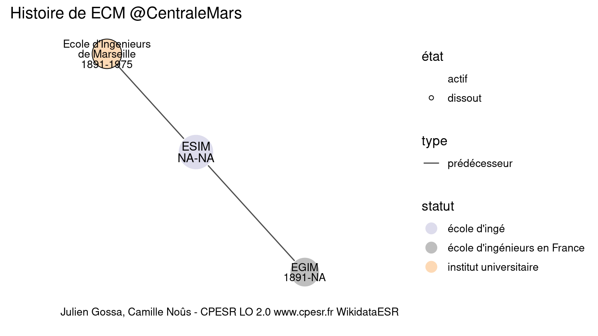 

Avertissements et édition : [logs](plots/etablissements/Q273454.md) 

### ECM @CentraleMars : Composition.     Edition des données : https://github.com/cpesr/wikidataESR/blob/master/plots/etablissements/Q273454.md 

 

Avertissements et édition : [logs](plots/etablissements/Q273454.md) 

### ECM @CentraleMars : Associations.     Edition des données : https://github.com/cpesr/wikidataESR/blob/master/plots/etablissements/Q273454.md 

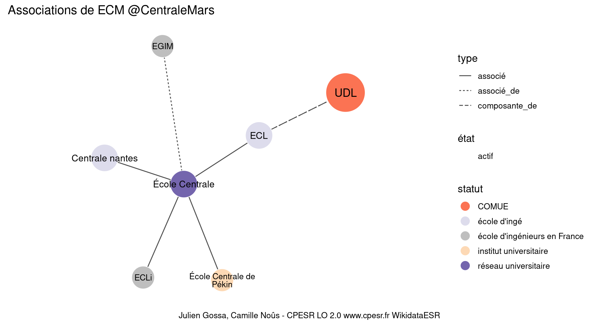 

Avertissements et édition : [logs](plots/etablissements/Q273454.md) 

### Centrale nantes @CentraleNantes : Histoire.     Edition des données : https://github.com/cpesr/wikidataESR/blob/master/plots/etablissements/Q273458.md 


Erreur : les données sont probablement trop partielles.
```
Error in wdesr_ggplot_graph(df, node_size = node_size, label_sizes = label_sizes, : Empty ESR graph: something went wrong with the graph production parameters

``` 

Avertissements et édition : [logs](plots/etablissements/Q273458.md) 

### Centrale nantes @CentraleNantes : Composition.     Edition des données : https://github.com/cpesr/wikidataESR/blob/master/plots/etablissements/Q273458.md 

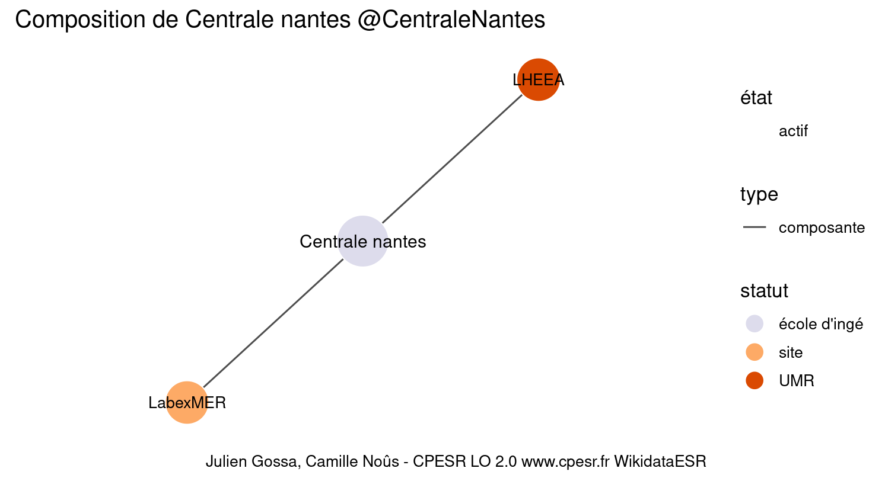 

Avertissements et édition : [logs](plots/etablissements/Q273458.md) 

### Centrale nantes @CentraleNantes : Associations.     Edition des données : https://github.com/cpesr/wikidataESR/blob/master/plots/etablissements/Q273458.md 

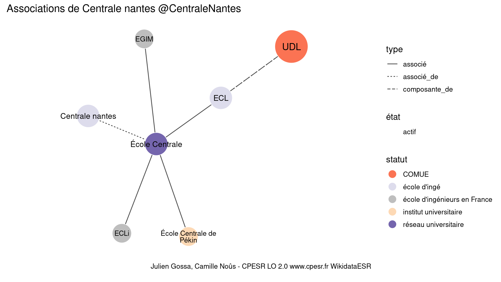 

Avertissements et édition : [logs](plots/etablissements/Q273458.md) 

### CESI @GroupeCESI : Histoire.     Edition des données : https://github.com/cpesr/wikidataESR/blob/master/plots/etablissements/Q30255548.md 


Erreur : les données sont probablement trop partielles.
```
Error in wdesr_ggplot_graph(df, node_size = node_size, label_sizes = label_sizes, : Empty ESR graph: something went wrong with the graph production parameters

``` 

Avertissements et édition : [logs](plots/etablissements/Q30255548.md) 

### CESI @GroupeCESI : Composition.     Edition des données : https://github.com/cpesr/wikidataESR/blob/master/plots/etablissements/Q30255548.md 

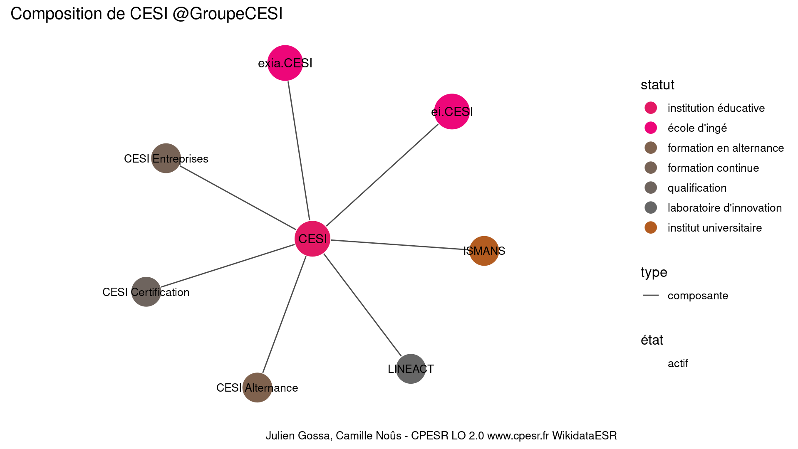 

Avertissements et édition : [logs](plots/etablissements/Q30255548.md) 

### CESI @GroupeCESI : Associations.     Edition des données : https://github.com/cpesr/wikidataESR/blob/master/plots/etablissements/Q30255548.md 


Erreur : les données sont probablement trop partielles.
```
Error in wdesr_ggplot_graph(df, node_size = node_size, label_sizes = label_sizes, : Empty ESR graph: something went wrong with the graph production parameters

``` 

Avertissements et édition : [logs](plots/etablissements/Q30255548.md) 

### CNAM @LeCnam : Histoire.     Edition des données : https://github.com/cpesr/wikidataESR/blob/master/plots/etablissements/Q524289.md 


Erreur : les données sont probablement trop partielles.
```
Error in wdesr_ggplot_graph(df, node_size = node_size, label_sizes = label_sizes, : Empty ESR graph: something went wrong with the graph production parameters

``` 

Avertissements et édition : [logs](plots/etablissements/Q524289.md) 

### CNAM @LeCnam : Composition.     Edition des données : https://github.com/cpesr/wikidataESR/blob/master/plots/etablissements/Q524289.md 

 

Avertissements et édition : [logs](plots/etablissements/Q524289.md) 

### CNAM @LeCnam : Associations.     Edition des données : https://github.com/cpesr/wikidataESR/blob/master/plots/etablissements/Q524289.md 

 

Avertissements et édition : [logs](plots/etablissements/Q524289.md) 

### ECAM Rennes @ECAMRennes : Histoire.     Edition des données : https://github.com/cpesr/wikidataESR/blob/master/plots/etablissements/Q3045829.md 


Erreur : les données sont probablement trop partielles.
```
Error in wdesr_ggplot_graph(df, node_size = node_size, label_sizes = label_sizes, : Empty ESR graph: something went wrong with the graph production parameters

``` 

Avertissements et édition : [logs](plots/etablissements/Q3045829.md) 

### ECAM Rennes @ECAMRennes : Composition.     Edition des données : https://github.com/cpesr/wikidataESR/blob/master/plots/etablissements/Q3045829.md 


Erreur : les données sont probablement trop partielles.
```
Error in wdesr_ggplot_graph(df, node_size = node_size, label_sizes = label_sizes, : Empty ESR graph: something went wrong with the graph production parameters

``` 

Avertissements et édition : [logs](plots/etablissements/Q3045829.md) 

### ECAM Rennes @ECAMRennes : Associations.     Edition des données : https://github.com/cpesr/wikidataESR/blob/master/plots/etablissements/Q3045829.md 


Erreur : les données sont probablement trop partielles.
```
Error in wdesr_ggplot_graph(df, node_size = node_size, label_sizes = label_sizes, : Empty ESR graph: something went wrong with the graph production parameters

``` 

Avertissements et édition : [logs](plots/etablissements/Q3045829.md) 

### ECAM-EPMI NA : Histoire.     Edition des données : https://github.com/cpesr/wikidataESR/blob/master/plots/etablissements/Q3577775.md 


Erreur : les données sont probablement trop partielles.
```
Error in wdesr_ggplot_graph(df, node_size = node_size, label_sizes = label_sizes, : Empty ESR graph: something went wrong with the graph production parameters

``` 

Avertissements et édition : [logs](plots/etablissements/Q3577775.md) 

### ECAM-EPMI NA : Composition.     Edition des données : https://github.com/cpesr/wikidataESR/blob/master/plots/etablissements/Q3577775.md 


Erreur : les données sont probablement trop partielles.
```
Error in wdesr_ggplot_graph(df, node_size = node_size, label_sizes = label_sizes, : Empty ESR graph: something went wrong with the graph production parameters

``` 

Avertissements et édition : [logs](plots/etablissements/Q3577775.md) 

### ECAM-EPMI NA : Associations.     Edition des données : https://github.com/cpesr/wikidataESR/blob/master/plots/etablissements/Q3577775.md 

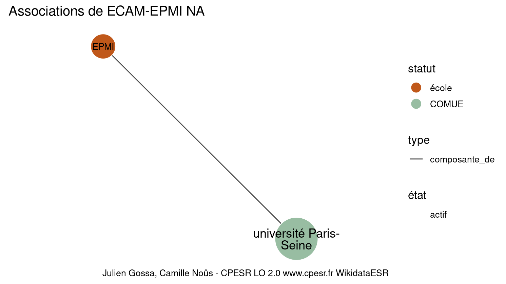 

Avertissements et édition : [logs](plots/etablissements/Q3577775.md) 

### ECAM Lasalle @ecamlyon : Histoire.     Edition des données : https://github.com/cpesr/wikidataESR/blob/master/plots/etablissements/Q3577727.md 


Erreur : les données sont probablement trop partielles.
```
Error in wdesr_ggplot_graph(df, node_size = node_size, label_sizes = label_sizes, : Empty ESR graph: something went wrong with the graph production parameters

``` 

Avertissements et édition : [logs](plots/etablissements/Q3577727.md) 

### ECAM Lasalle @ecamlyon : Composition.     Edition des données : https://github.com/cpesr/wikidataESR/blob/master/plots/etablissements/Q3577727.md 


Erreur : les données sont probablement trop partielles.
```
Error in wdesr_ggplot_graph(df, node_size = node_size, label_sizes = label_sizes, : Empty ESR graph: something went wrong with the graph production parameters

``` 

Avertissements et édition : [logs](plots/etablissements/Q3577727.md) 

### ECAM Lasalle @ecamlyon : Associations.     Edition des données : https://github.com/cpesr/wikidataESR/blob/master/plots/etablissements/Q3577727.md 


Erreur : les données sont probablement trop partielles.
```
Error in wdesr_ggplot_graph(df, node_size = node_size, label_sizes = label_sizes, : Empty ESR graph: something went wrong with the graph production parameters

``` 

Avertissements et édition : [logs](plots/etablissements/Q3577727.md) 

### ECE NA : Histoire.     Edition des données : https://github.com/cpesr/wikidataESR/blob/master/plots/etablissements/Q3577731.md 


Erreur : les données sont probablement trop partielles.
```
Error in wdesr_ggplot_graph(df, node_size = node_size, label_sizes = label_sizes, : Empty ESR graph: something went wrong with the graph production parameters

``` 

Avertissements et édition : [logs](plots/etablissements/Q3577731.md) 

### ECE NA : Composition.     Edition des données : https://github.com/cpesr/wikidataESR/blob/master/plots/etablissements/Q3577731.md 


Erreur : les données sont probablement trop partielles.
```
Error in wdesr_ggplot_graph(df, node_size = node_size, label_sizes = label_sizes, : Empty ESR graph: something went wrong with the graph production parameters

``` 

Avertissements et édition : [logs](plots/etablissements/Q3577731.md) 

### ECE NA : Associations.     Edition des données : https://github.com/cpesr/wikidataESR/blob/master/plots/etablissements/Q3577731.md 


Erreur : les données sont probablement trop partielles.
```
Error in wdesr_ggplot_graph(df, node_size = node_size, label_sizes = label_sizes, : Empty ESR graph: something went wrong with the graph production parameters

``` 

Avertissements et édition : [logs](plots/etablissements/Q3577731.md) 

### ISTOM @istomingenieur : Histoire.     Edition des données : https://github.com/cpesr/wikidataESR/blob/master/plots/etablissements/Q3577763.md 


Erreur : les données sont probablement trop partielles.
```
Error in wdesr_ggplot_graph(df, node_size = node_size, label_sizes = label_sizes, : Empty ESR graph: something went wrong with the graph production parameters

``` 

Avertissements et édition : [logs](plots/etablissements/Q3577763.md) 

### ISTOM @istomingenieur : Composition.     Edition des données : https://github.com/cpesr/wikidataESR/blob/master/plots/etablissements/Q3577763.md 


Erreur : les données sont probablement trop partielles.
```
Error in wdesr_ggplot_graph(df, node_size = node_size, label_sizes = label_sizes, : Empty ESR graph: something went wrong with the graph production parameters

``` 

Avertissements et édition : [logs](plots/etablissements/Q3577763.md) 

### ISTOM @istomingenieur : Associations.     Edition des données : https://github.com/cpesr/wikidataESR/blob/master/plots/etablissements/Q3577763.md 

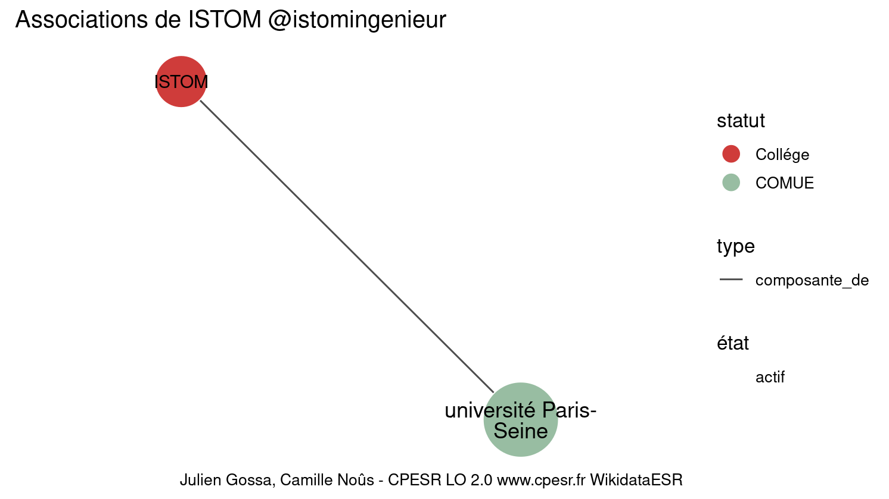 

Avertissements et édition : [logs](plots/etablissements/Q3577763.md) 

### EFREI Paris @Efrei_Paris : Histoire.     Edition des données : https://github.com/cpesr/wikidataESR/blob/master/plots/etablissements/Q3578001.md 


Erreur : les données sont probablement trop partielles.
```
Error in wdesr_ggplot_graph(df, node_size = node_size, label_sizes = label_sizes, : Empty ESR graph: something went wrong with the graph production parameters

``` 

Avertissements et édition : [logs](plots/etablissements/Q3578001.md) 

### EFREI Paris @Efrei_Paris : Composition.     Edition des données : https://github.com/cpesr/wikidataESR/blob/master/plots/etablissements/Q3578001.md 


Erreur : les données sont probablement trop partielles.
```
Error in wdesr_ggplot_graph(df, node_size = node_size, label_sizes = label_sizes, : Empty ESR graph: something went wrong with the graph production parameters

``` 

Avertissements et édition : [logs](plots/etablissements/Q3578001.md) 

### EFREI Paris @Efrei_Paris : Associations.     Edition des données : https://github.com/cpesr/wikidataESR/blob/master/plots/etablissements/Q3578001.md 

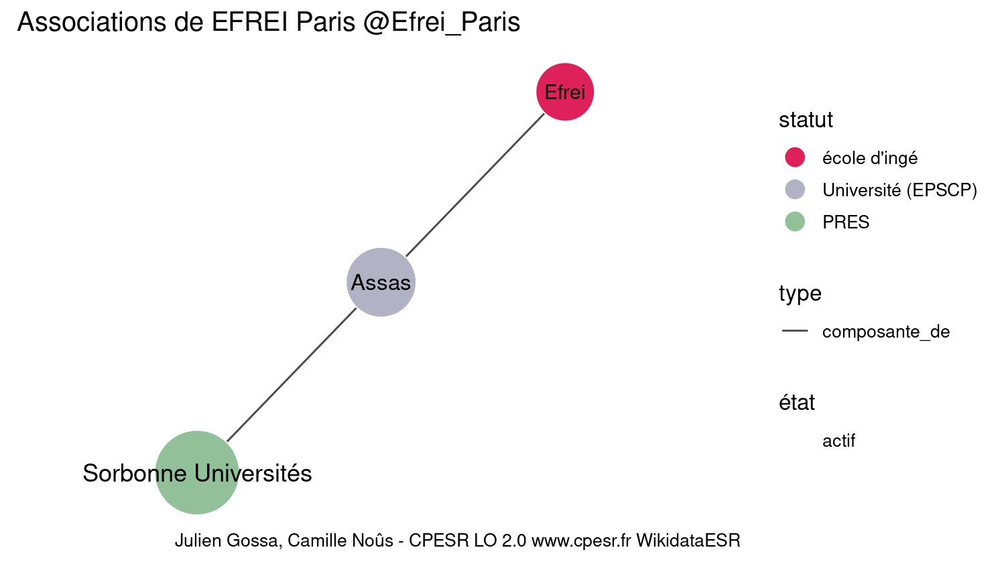 

Avertissements et édition : [logs](plots/etablissements/Q3578001.md) 

### EIP @EcoledePURPAN : Histoire.     Edition des données : https://github.com/cpesr/wikidataESR/blob/master/plots/etablissements/Q3577767.md 


Erreur : les données sont probablement trop partielles.
```
Error in wdesr_ggplot_graph(df, node_size = node_size, label_sizes = label_sizes, : Empty ESR graph: something went wrong with the graph production parameters

``` 

Avertissements et édition : [logs](plots/etablissements/Q3577767.md) 

### EIP @EcoledePURPAN : Composition.     Edition des données : https://github.com/cpesr/wikidataESR/blob/master/plots/etablissements/Q3577767.md 


Erreur : les données sont probablement trop partielles.
```
Error in wdesr_ggplot_graph(df, node_size = node_size, label_sizes = label_sizes, : Empty ESR graph: something went wrong with the graph production parameters

``` 

Avertissements et édition : [logs](plots/etablissements/Q3577767.md) 

### EIP @EcoledePURPAN : Associations.     Edition des données : https://github.com/cpesr/wikidataESR/blob/master/plots/etablissements/Q3577767.md 


Erreur : les données sont probablement trop partielles.
```
Error in wdesr_ggplot_graph(df, node_size = node_size, label_sizes = label_sizes, : Empty ESR graph: something went wrong with the graph production parameters

``` 

Avertissements et édition : [logs](plots/etablissements/Q3577767.md) 

### ELISA @ELISAerospace : Histoire.     Edition des données : https://github.com/cpesr/wikidataESR/blob/master/plots/etablissements/Q65162999.md 


Erreur : les données sont probablement trop partielles.
```
Error in wdesr_ggplot_graph(df, node_size = node_size, label_sizes = label_sizes, : Empty ESR graph: something went wrong with the graph production parameters

``` 

Avertissements et édition : [logs](plots/etablissements/Q65162999.md) 

### ELISA @ELISAerospace : Composition.     Edition des données : https://github.com/cpesr/wikidataESR/blob/master/plots/etablissements/Q65162999.md 


Erreur : les données sont probablement trop partielles.
```
Error in wdesr_ggplot_graph(df, node_size = node_size, label_sizes = label_sizes, : Empty ESR graph: something went wrong with the graph production parameters

``` 

Avertissements et édition : [logs](plots/etablissements/Q65162999.md) 

### ELISA @ELISAerospace : Associations.     Edition des données : https://github.com/cpesr/wikidataESR/blob/master/plots/etablissements/Q65162999.md 


Erreur : les données sont probablement trop partielles.
```
Error in wdesr_ggplot_graph(df, node_size = node_size, label_sizes = label_sizes, : Empty ESR graph: something went wrong with the graph production parameters

``` 

Avertissements et édition : [logs](plots/etablissements/Q65162999.md) 

### EBI @ebicergy : Histoire.     Edition des données : https://github.com/cpesr/wikidataESR/blob/master/plots/etablissements/Q3577829.md 


Erreur : les données sont probablement trop partielles.
```
Error in wdesr_ggplot_graph(df, node_size = node_size, label_sizes = label_sizes, : Empty ESR graph: something went wrong with the graph production parameters

``` 

Avertissements et édition : [logs](plots/etablissements/Q3577829.md) 

### EBI @ebicergy : Composition.     Edition des données : https://github.com/cpesr/wikidataESR/blob/master/plots/etablissements/Q3577829.md 


Erreur : les données sont probablement trop partielles.
```
Error in wdesr_ggplot_graph(df, node_size = node_size, label_sizes = label_sizes, : Empty ESR graph: something went wrong with the graph production parameters

``` 

Avertissements et édition : [logs](plots/etablissements/Q3577829.md) 

### EBI @ebicergy : Associations.     Edition des données : https://github.com/cpesr/wikidataESR/blob/master/plots/etablissements/Q3577829.md 

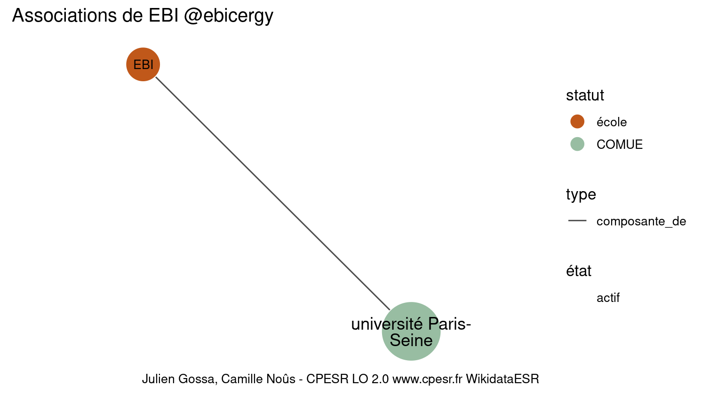 

Avertissements et édition : [logs](plots/etablissements/Q3577829.md) 

### Ecole de l'air et de l'espace NA : Histoire.     Edition des données : https://github.com/cpesr/wikidataESR/blob/master/plots/etablissements/Q3577870.md 


Erreur : les données sont probablement trop partielles.
```
Error in wdesr_ggplot_graph(df, node_size = node_size, label_sizes = label_sizes, : Empty ESR graph: something went wrong with the graph production parameters

``` 

Avertissements et édition : [logs](plots/etablissements/Q3577870.md) 

### Ecole de l'air et de l'espace NA : Composition.     Edition des données : https://github.com/cpesr/wikidataESR/blob/master/plots/etablissements/Q3577870.md 


Erreur : les données sont probablement trop partielles.
```
Error in wdesr_ggplot_graph(df, node_size = node_size, label_sizes = label_sizes, : Empty ESR graph: something went wrong with the graph production parameters

``` 

Avertissements et édition : [logs](plots/etablissements/Q3577870.md) 

### Ecole de l'air et de l'espace NA : Associations.     Edition des données : https://github.com/cpesr/wikidataESR/blob/master/plots/etablissements/Q3577870.md 

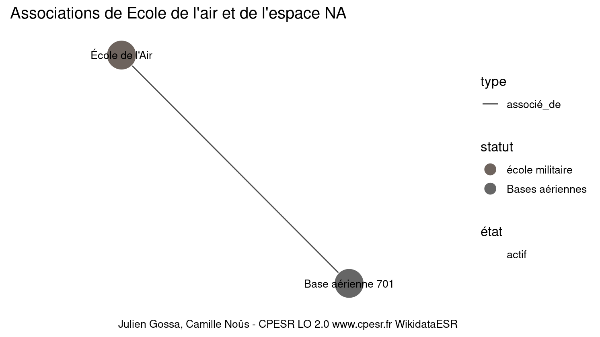 

Avertissements et édition : [logs](plots/etablissements/Q3577870.md) 

### ENIB @ENIB_INFO : Histoire.     Edition des données : https://github.com/cpesr/wikidataESR/blob/master/plots/etablissements/Q273564.md 


Erreur : les données sont probablement trop partielles.
```
Error in wdesr_ggplot_graph(df, node_size = node_size, label_sizes = label_sizes, : Empty ESR graph: something went wrong with the graph production parameters

``` 

Avertissements et édition : [logs](plots/etablissements/Q273564.md) 

### ENIB @ENIB_INFO : Composition.     Edition des données : https://github.com/cpesr/wikidataESR/blob/master/plots/etablissements/Q273564.md 

 

Avertissements et édition : [logs](plots/etablissements/Q273564.md) 

### ENIB @ENIB_INFO : Associations.     Edition des données : https://github.com/cpesr/wikidataESR/blob/master/plots/etablissements/Q273564.md 


Erreur : les données sont probablement trop partielles.
```
Error in wdesr_ggplot_graph(df, node_size = node_size, label_sizes = label_sizes, : Empty ESR graph: something went wrong with the graph production parameters

``` 

Avertissements et édition : [logs](plots/etablissements/Q273564.md) 

### ENI Tarbes @ENITarbes : Histoire.     Edition des données : https://github.com/cpesr/wikidataESR/blob/master/plots/etablissements/Q3578096.md 


Erreur : les données sont probablement trop partielles.
```
Error in wdesr_ggplot_graph(df, node_size = node_size, label_sizes = label_sizes, : Empty ESR graph: something went wrong with the graph production parameters

``` 

Avertissements et édition : [logs](plots/etablissements/Q3578096.md) 

### ENI Tarbes @ENITarbes : Composition.     Edition des données : https://github.com/cpesr/wikidataESR/blob/master/plots/etablissements/Q3578096.md 

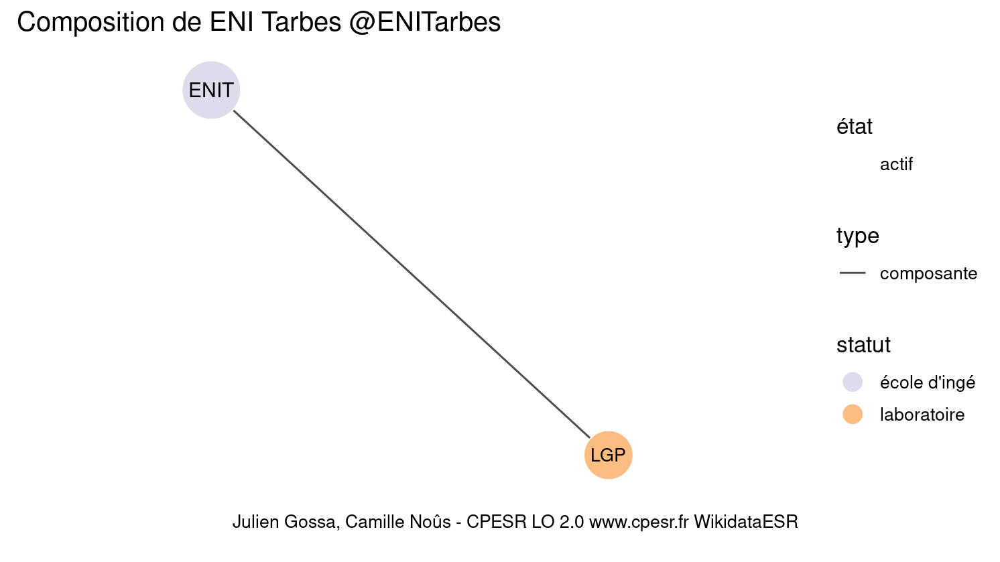 

Avertissements et édition : [logs](plots/etablissements/Q3578096.md) 

### ENI Tarbes @ENITarbes : Associations.     Edition des données : https://github.com/cpesr/wikidataESR/blob/master/plots/etablissements/Q3578096.md 


Erreur : les données sont probablement trop partielles.
```
Error in wdesr_ggplot_graph(df, node_size = node_size, label_sizes = label_sizes, : Empty ESR graph: something went wrong with the graph production parameters

``` 

Avertissements et édition : [logs](plots/etablissements/Q3578096.md) 

### ENAC @enacfrance : Histoire.     Edition des données : https://github.com/cpesr/wikidataESR/blob/master/plots/etablissements/Q174335.md 


Erreur : les données sont probablement trop partielles.
```
Error in wdesr_ggplot_graph(df, node_size = node_size, label_sizes = label_sizes, : Empty ESR graph: something went wrong with the graph production parameters

``` 

Avertissements et édition : [logs](plots/etablissements/Q174335.md) 

### ENAC @enacfrance : Composition.     Edition des données : https://github.com/cpesr/wikidataESR/blob/master/plots/etablissements/Q174335.md 


Erreur : les données sont probablement trop partielles.
```
Error in wdesr_ggplot_graph(df, node_size = node_size, label_sizes = label_sizes, : Empty ESR graph: something went wrong with the graph production parameters

``` 

Avertissements et édition : [logs](plots/etablissements/Q174335.md) 

### ENAC @enacfrance : Associations.     Edition des données : https://github.com/cpesr/wikidataESR/blob/master/plots/etablissements/Q174335.md 

 

Avertissements et édition : [logs](plots/etablissements/Q174335.md) 

### ENM NA : Histoire.     Edition des données : https://github.com/cpesr/wikidataESR/blob/master/plots/etablissements/Q3578126.md 


Erreur : les données sont probablement trop partielles.
```
Error in wdesr_ggplot_graph(df, node_size = node_size, label_sizes = label_sizes, : Empty ESR graph: something went wrong with the graph production parameters

``` 

Avertissements et édition : [logs](plots/etablissements/Q3578126.md) 

### ENM NA : Composition.     Edition des données : https://github.com/cpesr/wikidataESR/blob/master/plots/etablissements/Q3578126.md 


Erreur : les données sont probablement trop partielles.
```
Error in wdesr_ggplot_graph(df, node_size = node_size, label_sizes = label_sizes, : Empty ESR graph: something went wrong with the graph production parameters

``` 

Avertissements et édition : [logs](plots/etablissements/Q3578126.md) 

### ENM NA : Associations.     Edition des données : https://github.com/cpesr/wikidataESR/blob/master/plots/etablissements/Q3578126.md 


Erreur : les données sont probablement trop partielles.
```
Error in wdesr_ggplot_graph(df, node_size = node_size, label_sizes = label_sizes, : Empty ESR graph: something went wrong with the graph production parameters

``` 

Avertissements et édition : [logs](plots/etablissements/Q3578126.md) 

### ENPC @EcoledesPonts : Histoire.     Edition des données : https://github.com/cpesr/wikidataESR/blob/master/plots/etablissements/Q273523.md 


Erreur : les données sont probablement trop partielles.
```
Error in wdesr_ggplot_graph(df, node_size = node_size, label_sizes = label_sizes, : Empty ESR graph: something went wrong with the graph production parameters

``` 

Avertissements et édition : [logs](plots/etablissements/Q273523.md) 

### ENPC @EcoledesPonts : Composition.     Edition des données : https://github.com/cpesr/wikidataESR/blob/master/plots/etablissements/Q273523.md 

 

Avertissements et édition : [logs](plots/etablissements/Q273523.md) 

### ENPC @EcoledesPonts : Associations.     Edition des données : https://github.com/cpesr/wikidataESR/blob/master/plots/etablissements/Q273523.md 

 

Avertissements et édition : [logs](plots/etablissements/Q273523.md) 

### ENSG-Géomatique NA : Histoire.     Edition des données : https://github.com/cpesr/wikidataESR/blob/master/plots/etablissements/Q3578152.md 


Erreur : les données sont probablement trop partielles.
```
Error in wdesr_ggplot_graph(df, node_size = node_size, label_sizes = label_sizes, : Empty ESR graph: something went wrong with the graph production parameters

``` 

Avertissements et édition : [logs](plots/etablissements/Q3578152.md) 

### ENSG-Géomatique NA : Composition.     Edition des données : https://github.com/cpesr/wikidataESR/blob/master/plots/etablissements/Q3578152.md 


Erreur : les données sont probablement trop partielles.
```
Error in wdesr_ggplot_graph(df, node_size = node_size, label_sizes = label_sizes, : Empty ESR graph: something went wrong with the graph production parameters

``` 

Avertissements et édition : [logs](plots/etablissements/Q3578152.md) 

### ENSG-Géomatique NA : Associations.     Edition des données : https://github.com/cpesr/wikidataESR/blob/master/plots/etablissements/Q3578152.md 


Erreur : les données sont probablement trop partielles.
```
Error in wdesr_ggplot_graph(df, node_size = node_size, label_sizes = label_sizes, : Empty ESR graph: something went wrong with the graph production parameters

``` 

Avertissements et édition : [logs](plots/etablissements/Q3578152.md) 

### ENTPE NA : Histoire.     Edition des données : https://github.com/cpesr/wikidataESR/blob/master/plots/etablissements/Q3578157.md 


Erreur : les données sont probablement trop partielles.
```
Error in wdesr_ggplot_graph(df, node_size = node_size, label_sizes = label_sizes, : Empty ESR graph: something went wrong with the graph production parameters

``` 

Avertissements et édition : [logs](plots/etablissements/Q3578157.md) 

### ENTPE NA : Composition.     Edition des données : https://github.com/cpesr/wikidataESR/blob/master/plots/etablissements/Q3578157.md 

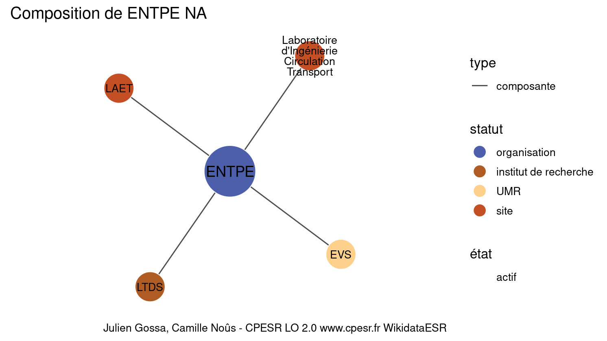 

Avertissements et édition : [logs](plots/etablissements/Q3578157.md) 

### ENTPE NA : Associations.     Edition des données : https://github.com/cpesr/wikidataESR/blob/master/plots/etablissements/Q3578157.md 

 

Avertissements et édition : [logs](plots/etablissements/Q3578157.md) 

### ENGEES @engees_ecole : Histoire.     Edition des données : https://github.com/cpesr/wikidataESR/blob/master/plots/etablissements/Q3578160.md 


Erreur : les données sont probablement trop partielles.
```
Error in wdesr_ggplot_graph(df, node_size = node_size, label_sizes = label_sizes, : Empty ESR graph: something went wrong with the graph production parameters

``` 

Avertissements et édition : [logs](plots/etablissements/Q3578160.md) 

### ENGEES @engees_ecole : Composition.     Edition des données : https://github.com/cpesr/wikidataESR/blob/master/plots/etablissements/Q3578160.md 

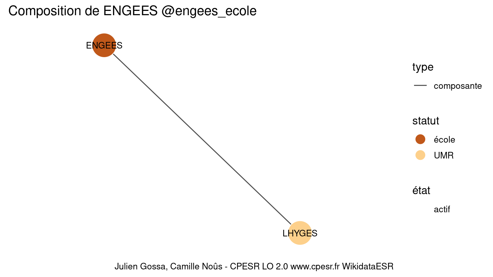 

Avertissements et édition : [logs](plots/etablissements/Q3578160.md) 

### ENGEES @engees_ecole : Associations.     Edition des données : https://github.com/cpesr/wikidataESR/blob/master/plots/etablissements/Q3578160.md 


Erreur : les données sont probablement trop partielles.
```
Error in wdesr_ggplot_graph(df, node_size = node_size, label_sizes = label_sizes, : Empty ESR graph: something went wrong with the graph production parameters

``` 

Avertissements et édition : [logs](plots/etablissements/Q3578160.md) 

### ENSIIE @ensiie : Histoire.     Edition des données : https://github.com/cpesr/wikidataESR/blob/master/plots/etablissements/Q3578204.md 


Erreur : les données sont probablement trop partielles.
```
Error in wdesr_ggplot_graph(df, node_size = node_size, label_sizes = label_sizes, : Empty ESR graph: something went wrong with the graph production parameters

``` 

Avertissements et édition : [logs](plots/etablissements/Q3578204.md) 

### ENSIIE @ensiie : Composition.     Edition des données : https://github.com/cpesr/wikidataESR/blob/master/plots/etablissements/Q3578204.md 

 

Avertissements et édition : [logs](plots/etablissements/Q3578204.md) 

### ENSIIE @ensiie : Associations.     Edition des données : https://github.com/cpesr/wikidataESR/blob/master/plots/etablissements/Q3578204.md 


Erreur : les données sont probablement trop partielles.
```
Error in wdesr_ggplot_graph(df, node_size = node_size, label_sizes = label_sizes, : Empty ESR graph: something went wrong with the graph production parameters

``` 

Avertissements et édition : [logs](plots/etablissements/Q3578204.md) 

### ENSI Caen @ENSICAEN : Histoire.     Edition des données : https://github.com/cpesr/wikidataESR/blob/master/plots/etablissements/Q3578208.md 


Erreur : les données sont probablement trop partielles.
```
Error in wdesr_ggplot_graph(df, node_size = node_size, label_sizes = label_sizes, : Empty ESR graph: something went wrong with the graph production parameters

``` 

Avertissements et édition : [logs](plots/etablissements/Q3578208.md) 

### ENSI Caen @ENSICAEN : Composition.     Edition des données : https://github.com/cpesr/wikidataESR/blob/master/plots/etablissements/Q3578208.md 

 

Avertissements et édition : [logs](plots/etablissements/Q3578208.md) 

### ENSI Caen @ENSICAEN : Associations.     Edition des données : https://github.com/cpesr/wikidataESR/blob/master/plots/etablissements/Q3578208.md 

 

Avertissements et édition : [logs](plots/etablissements/Q3578208.md) 

### ENS Chimie Montpellier @enscmchimiemtp : Histoire.     Edition des données : https://github.com/cpesr/wikidataESR/blob/master/plots/etablissements/Q948420.md 


Erreur : les données sont probablement trop partielles.
```
Error in wdesr_ggplot_graph(df, node_size = node_size, label_sizes = label_sizes, : Empty ESR graph: something went wrong with the graph production parameters

``` 

Avertissements et édition : [logs](plots/etablissements/Q948420.md) 

### ENS Chimie Montpellier @enscmchimiemtp : Composition.     Edition des données : https://github.com/cpesr/wikidataESR/blob/master/plots/etablissements/Q948420.md 

 

Avertissements et édition : [logs](plots/etablissements/Q948420.md) 

### ENS Chimie Montpellier @enscmchimiemtp : Associations.     Edition des données : https://github.com/cpesr/wikidataESR/blob/master/plots/etablissements/Q948420.md 

 

Avertissements et édition : [logs](plots/etablissements/Q948420.md) 

### ENSCR @ENSCR : Histoire.     Edition des données : https://github.com/cpesr/wikidataESR/blob/master/plots/etablissements/Q3578223.md 


Erreur : les données sont probablement trop partielles.
```
Error in wdesr_ggplot_graph(df, node_size = node_size, label_sizes = label_sizes, : Empty ESR graph: something went wrong with the graph production parameters

``` 

Avertissements et édition : [logs](plots/etablissements/Q3578223.md) 

### ENSCR @ENSCR : Composition.     Edition des données : https://github.com/cpesr/wikidataESR/blob/master/plots/etablissements/Q3578223.md 

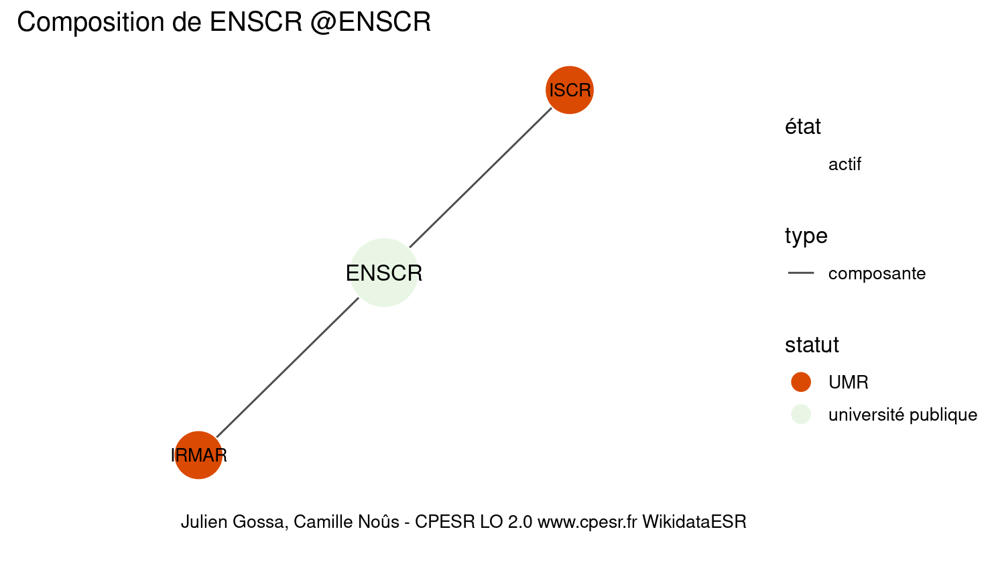 

Avertissements et édition : [logs](plots/etablissements/Q3578223.md) 

### ENSCR @ENSCR : Associations.     Edition des données : https://github.com/cpesr/wikidataESR/blob/master/plots/etablissements/Q3578223.md 


Erreur : les données sont probablement trop partielles.
```
Error in wdesr_ggplot_graph(df, node_size = node_size, label_sizes = label_sizes, : Empty ESR graph: something went wrong with the graph production parameters

``` 

Avertissements et édition : [logs](plots/etablissements/Q3578223.md) 

### ENSEA @ensea1 : Histoire.     Edition des données : https://github.com/cpesr/wikidataESR/blob/master/plots/etablissements/Q2707341.md 


Erreur : les données sont probablement trop partielles.
```
Error in wdesr_ggplot_graph(df, node_size = node_size, label_sizes = label_sizes, : Empty ESR graph: something went wrong with the graph production parameters

``` 

Avertissements et édition : [logs](plots/etablissements/Q2707341.md) 

### ENSEA @ensea1 : Composition.     Edition des données : https://github.com/cpesr/wikidataESR/blob/master/plots/etablissements/Q2707341.md 

 

Avertissements et édition : [logs](plots/etablissements/Q2707341.md) 

### ENSEA @ensea1 : Associations.     Edition des données : https://github.com/cpesr/wikidataESR/blob/master/plots/etablissements/Q2707341.md 

 

Avertissements et édition : [logs](plots/etablissements/Q2707341.md) 

### ISAE-ENSMA @isae_ensma : Histoire.     Edition des données : https://github.com/cpesr/wikidataESR/blob/master/plots/etablissements/Q391044.md 


Erreur : les données sont probablement trop partielles.
```
Error in wdesr_ggplot_graph(df, node_size = node_size, label_sizes = label_sizes, : Empty ESR graph: something went wrong with the graph production parameters

``` 

Avertissements et édition : [logs](plots/etablissements/Q391044.md) 

### ISAE-ENSMA @isae_ensma : Composition.     Edition des données : https://github.com/cpesr/wikidataESR/blob/master/plots/etablissements/Q391044.md 

 

Avertissements et édition : [logs](plots/etablissements/Q391044.md) 

### ISAE-ENSMA @isae_ensma : Associations.     Edition des données : https://github.com/cpesr/wikidataESR/blob/master/plots/etablissements/Q391044.md 

 

Avertissements et édition : [logs](plots/etablissements/Q391044.md) 

### ENS2M @ENSMMOfficiel : Histoire.     Edition des données : https://github.com/cpesr/wikidataESR/blob/master/plots/etablissements/Q3578235.md 


Erreur : les données sont probablement trop partielles.
```
Error in wdesr_ggplot_graph(df, node_size = node_size, label_sizes = label_sizes, : Empty ESR graph: something went wrong with the graph production parameters

``` 

Avertissements et édition : [logs](plots/etablissements/Q3578235.md) 

### ENS2M @ENSMMOfficiel : Composition.     Edition des données : https://github.com/cpesr/wikidataESR/blob/master/plots/etablissements/Q3578235.md 

 

Avertissements et édition : [logs](plots/etablissements/Q3578235.md) 

### ENS2M @ENSMMOfficiel : Associations.     Edition des données : https://github.com/cpesr/wikidataESR/blob/master/plots/etablissements/Q3578235.md 


Erreur : les données sont probablement trop partielles.
```
Error in wdesr_ggplot_graph(df, node_size = node_size, label_sizes = label_sizes, : Empty ESR graph: something went wrong with the graph production parameters

``` 

Avertissements et édition : [logs](plots/etablissements/Q3578235.md) 

### ENSTA Bretagne @ENSTABretagne : Histoire.     Edition des données : https://github.com/cpesr/wikidataESR/blob/master/plots/etablissements/Q3578240.md 


Erreur : les données sont probablement trop partielles.
```
Error in wdesr_ggplot_graph(df, node_size = node_size, label_sizes = label_sizes, : Empty ESR graph: something went wrong with the graph production parameters

``` 

Avertissements et édition : [logs](plots/etablissements/Q3578240.md) 

### ENSTA Bretagne @ENSTABretagne : Composition.     Edition des données : https://github.com/cpesr/wikidataESR/blob/master/plots/etablissements/Q3578240.md 


Erreur : les données sont probablement trop partielles.
```
Error in wdesr_ggplot_graph(df, node_size = node_size, label_sizes = label_sizes, : Empty ESR graph: something went wrong with the graph production parameters

``` 

Avertissements et édition : [logs](plots/etablissements/Q3578240.md) 

### ENSTA Bretagne @ENSTABretagne : Associations.     Edition des données : https://github.com/cpesr/wikidataESR/blob/master/plots/etablissements/Q3578240.md 


Erreur : les données sont probablement trop partielles.
```
Error in wdesr_ggplot_graph(df, node_size = node_size, label_sizes = label_sizes, : Empty ESR graph: something went wrong with the graph production parameters

``` 

Avertissements et édition : [logs](plots/etablissements/Q3578240.md) 

### BSA https://www.agro-bordeaux.fr/ : Histoire.     Edition des données : https://github.com/cpesr/wikidataESR/blob/master/plots/etablissements/Q3578255.md 


Erreur : les données sont probablement trop partielles.
```
Error in wdesr_ggplot_graph(df, node_size = node_size, label_sizes = label_sizes, : Empty ESR graph: something went wrong with the graph production parameters

``` 

Avertissements et édition : [logs](plots/etablissements/Q3578255.md) 

### BSA https://www.agro-bordeaux.fr/ : Composition.     Edition des données : https://github.com/cpesr/wikidataESR/blob/master/plots/etablissements/Q3578255.md 

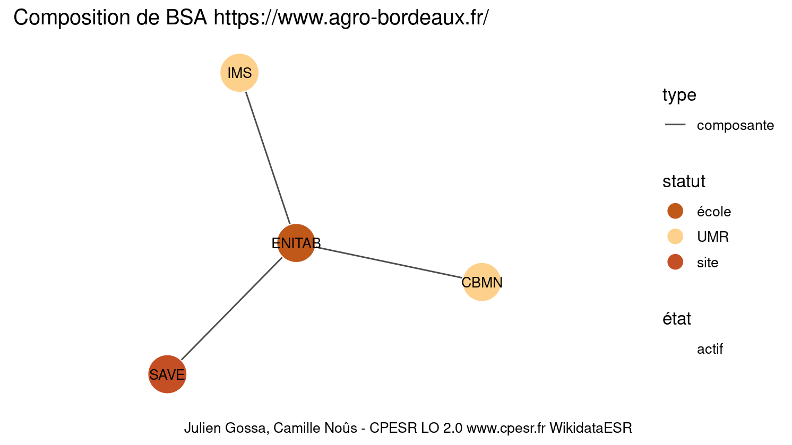 

Avertissements et édition : [logs](plots/etablissements/Q3578255.md) 

### BSA https://www.agro-bordeaux.fr/ : Associations.     Edition des données : https://github.com/cpesr/wikidataESR/blob/master/plots/etablissements/Q3578255.md 


Erreur : les données sont probablement trop partielles.
```
Error in wdesr_ggplot_graph(df, node_size = node_size, label_sizes = label_sizes, : Empty ESR graph: something went wrong with the graph production parameters

``` 

Avertissements et édition : [logs](plots/etablissements/Q3578255.md) 

### IFP school @ifpschool : Histoire.     Edition des données : https://github.com/cpesr/wikidataESR/blob/master/plots/etablissements/Q2732297.md 


Erreur : les données sont probablement trop partielles.
```
Error in wdesr_ggplot_graph(df, node_size = node_size, label_sizes = label_sizes, : Empty ESR graph: something went wrong with the graph production parameters

``` 

Avertissements et édition : [logs](plots/etablissements/Q2732297.md) 

### IFP school @ifpschool : Composition.     Edition des données : https://github.com/cpesr/wikidataESR/blob/master/plots/etablissements/Q2732297.md 


Erreur : les données sont probablement trop partielles.
```
Error in wdesr_ggplot_graph(df, node_size = node_size, label_sizes = label_sizes, : Empty ESR graph: something went wrong with the graph production parameters

``` 

Avertissements et édition : [logs](plots/etablissements/Q2732297.md) 

### IFP school @ifpschool : Associations.     Edition des données : https://github.com/cpesr/wikidataESR/blob/master/plots/etablissements/Q2732297.md 


Erreur : les données sont probablement trop partielles.
```
Error in wdesr_ggplot_graph(df, node_size = node_size, label_sizes = label_sizes, : Empty ESR graph: something went wrong with the graph production parameters

``` 

Avertissements et édition : [logs](plots/etablissements/Q2732297.md) 

### ENSM @ENSM : Histoire.     Edition des données : https://github.com/cpesr/wikidataESR/blob/master/plots/etablissements/Q3578264.md 


Erreur : les données sont probablement trop partielles.
```
Error in wdesr_ggplot_graph(df, node_size = node_size, label_sizes = label_sizes, : Empty ESR graph: something went wrong with the graph production parameters

``` 

Avertissements et édition : [logs](plots/etablissements/Q3578264.md) 

### ENSM @ENSM : Composition.     Edition des données : https://github.com/cpesr/wikidataESR/blob/master/plots/etablissements/Q3578264.md 


Erreur : les données sont probablement trop partielles.
```
Error in wdesr_ggplot_graph(df, node_size = node_size, label_sizes = label_sizes, : Empty ESR graph: something went wrong with the graph production parameters

``` 

Avertissements et édition : [logs](plots/etablissements/Q3578264.md) 

### ENSM @ENSM : Associations.     Edition des données : https://github.com/cpesr/wikidataESR/blob/master/plots/etablissements/Q3578264.md 

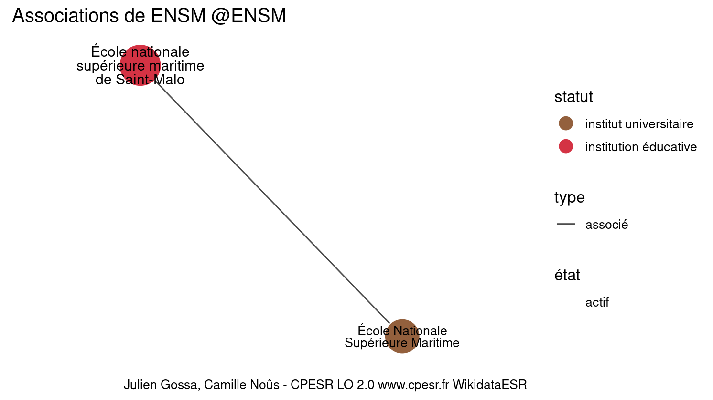 

Avertissements et édition : [logs](plots/etablissements/Q3578264.md) 

### ONIRIS NA : Histoire.     Edition des données : https://github.com/cpesr/wikidataESR/blob/master/plots/etablissements/Q3578268.md 


Erreur : les données sont probablement trop partielles.
```
Error in wdesr_ggplot_graph(df, node_size = node_size, label_sizes = label_sizes, : Empty ESR graph: something went wrong with the graph production parameters

``` 

Avertissements et édition : [logs](plots/etablissements/Q3578268.md) 

### ONIRIS NA : Composition.     Edition des données : https://github.com/cpesr/wikidataESR/blob/master/plots/etablissements/Q3578268.md 

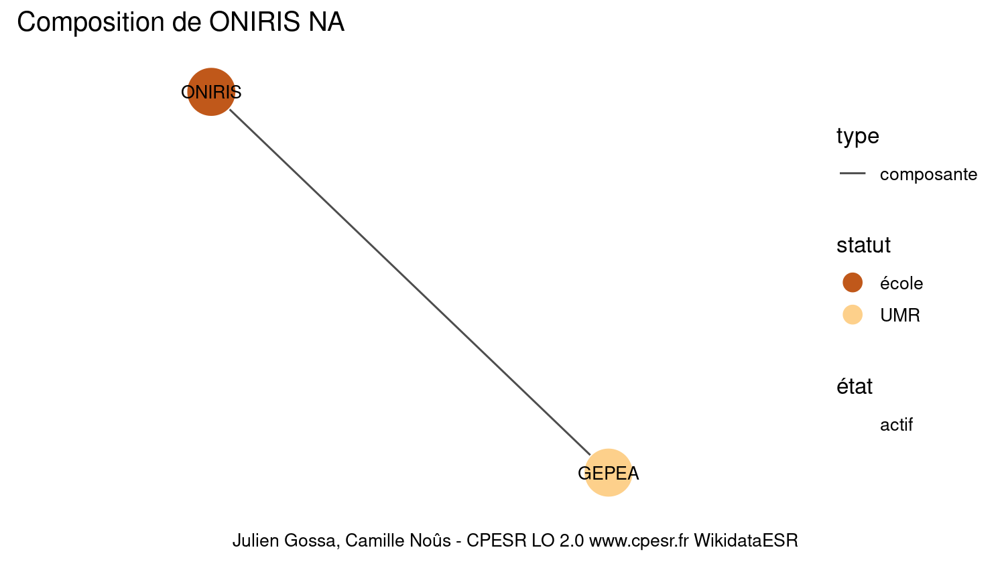 

Avertissements et édition : [logs](plots/etablissements/Q3578268.md) 

### ONIRIS NA : Associations.     Edition des données : https://github.com/cpesr/wikidataESR/blob/master/plots/etablissements/Q3578268.md 


Erreur : les données sont probablement trop partielles.
```
Error in wdesr_ggplot_graph(df, node_size = node_size, label_sizes = label_sizes, : Empty ESR graph: something went wrong with the graph production parameters

``` 

Avertissements et édition : [logs](plots/etablissements/Q3578268.md) 

### EN @Ecole_navale : Histoire.     Edition des données : https://github.com/cpesr/wikidataESR/blob/master/plots/etablissements/Q974394.md 


Erreur : les données sont probablement trop partielles.
```
Error in wdesr_ggplot_graph(df, node_size = node_size, label_sizes = label_sizes, : Empty ESR graph: something went wrong with the graph production parameters

``` 

Avertissements et édition : [logs](plots/etablissements/Q974394.md) 

### EN @Ecole_navale : Composition.     Edition des données : https://github.com/cpesr/wikidataESR/blob/master/plots/etablissements/Q974394.md 

 

Avertissements et édition : [logs](plots/etablissements/Q974394.md) 

### EN @Ecole_navale : Associations.     Edition des données : https://github.com/cpesr/wikidataESR/blob/master/plots/etablissements/Q974394.md 


Erreur : les données sont probablement trop partielles.
```
Error in query(url, "pcontent", clean_response, query_param = query_param, : The API returned an error: missingtitle - The page you specified doesn't exist.

``` 

Avertissements et édition : [logs](plots/etablissements/Q974394.md) 

### EPITA @epita : Histoire.     Edition des données : https://github.com/cpesr/wikidataESR/blob/master/plots/etablissements/Q1702850.md 


Erreur : les données sont probablement trop partielles.
```
Error in wdesr_ggplot_graph(df, node_size = node_size, label_sizes = label_sizes, : Empty ESR graph: something went wrong with the graph production parameters

``` 

Avertissements et édition : [logs](plots/etablissements/Q1702850.md) 

### EPITA @epita : Composition.     Edition des données : https://github.com/cpesr/wikidataESR/blob/master/plots/etablissements/Q1702850.md 


Erreur : les données sont probablement trop partielles.
```
Error in wdesr_ggplot_graph(df, node_size = node_size, label_sizes = label_sizes, : Empty ESR graph: something went wrong with the graph production parameters

``` 

Avertissements et édition : [logs](plots/etablissements/Q1702850.md) 

### EPITA @epita : Associations.     Edition des données : https://github.com/cpesr/wikidataESR/blob/master/plots/etablissements/Q1702850.md 

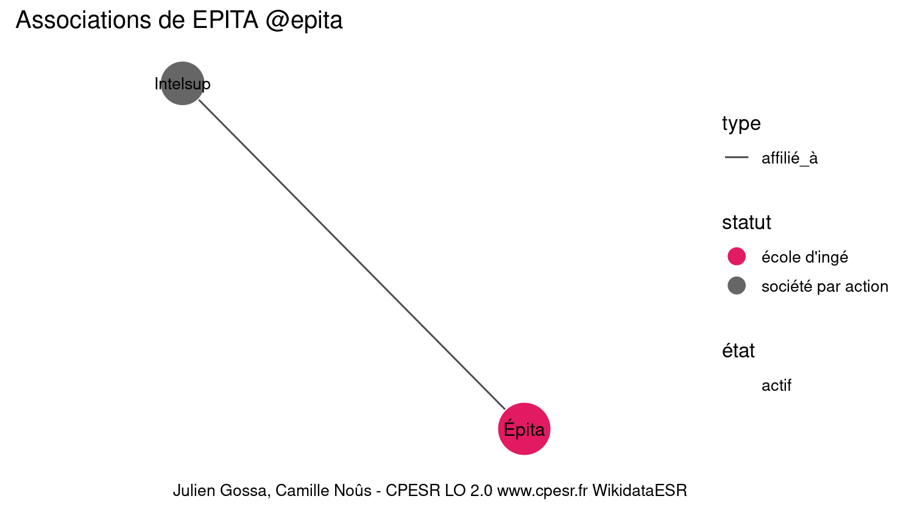 

Avertissements et édition : [logs](plots/etablissements/Q1702850.md) 

### ESME @ESMESudria : Histoire.     Edition des données : https://github.com/cpesr/wikidataESR/blob/master/plots/etablissements/Q1572655.md 


Erreur : les données sont probablement trop partielles.
```
Error in wdesr_ggplot_graph(df, node_size = node_size, label_sizes = label_sizes, : Empty ESR graph: something went wrong with the graph production parameters

``` 

Avertissements et édition : [logs](plots/etablissements/Q1572655.md) 

### ESME @ESMESudria : Composition.     Edition des données : https://github.com/cpesr/wikidataESR/blob/master/plots/etablissements/Q1572655.md 


Erreur : les données sont probablement trop partielles.
```
Error in wdesr_ggplot_graph(df, node_size = node_size, label_sizes = label_sizes, : Empty ESR graph: something went wrong with the graph production parameters

``` 

Avertissements et édition : [logs](plots/etablissements/Q1572655.md) 

### ESME @ESMESudria : Associations.     Edition des données : https://github.com/cpesr/wikidataESR/blob/master/plots/etablissements/Q1572655.md 

 

Avertissements et édition : [logs](plots/etablissements/Q1572655.md) 

### ESTP @estpparis : Histoire.     Edition des données : https://github.com/cpesr/wikidataESR/blob/master/plots/etablissements/Q273483.md 


Erreur : les données sont probablement trop partielles.
```
Error in wdesr_ggplot_graph(df, node_size = node_size, label_sizes = label_sizes, : Empty ESR graph: something went wrong with the graph production parameters

``` 

Avertissements et édition : [logs](plots/etablissements/Q273483.md) 

### ESTP @estpparis : Composition.     Edition des données : https://github.com/cpesr/wikidataESR/blob/master/plots/etablissements/Q273483.md 


Erreur : les données sont probablement trop partielles.
```
Error in wdesr_ggplot_graph(df, node_size = node_size, label_sizes = label_sizes, : Empty ESR graph: something went wrong with the graph production parameters

``` 

Avertissements et édition : [logs](plots/etablissements/Q273483.md) 

### ESTP @estpparis : Associations.     Edition des données : https://github.com/cpesr/wikidataESR/blob/master/plots/etablissements/Q273483.md 


Erreur : les données sont probablement trop partielles.
```
Error in wdesr_ggplot_graph(df, node_size = node_size, label_sizes = label_sizes, : Empty ESR graph: something went wrong with the graph production parameters

``` 

Avertissements et édition : [logs](plots/etablissements/Q273483.md) 

### ESM ST CYR NA : Histoire.     Edition des données : https://github.com/cpesr/wikidataESR/blob/master/plots/etablissements/Q1132066.md 


Erreur : les données sont probablement trop partielles.
```
Error in wdesr_ggplot_graph(df, node_size = node_size, label_sizes = label_sizes, : Empty ESR graph: something went wrong with the graph production parameters

``` 

Avertissements et édition : [logs](plots/etablissements/Q1132066.md) 

### ESM ST CYR NA : Composition.     Edition des données : https://github.com/cpesr/wikidataESR/blob/master/plots/etablissements/Q1132066.md 


Erreur : les données sont probablement trop partielles.
```
Error in wdesr_ggplot_graph(df, node_size = node_size, label_sizes = label_sizes, : Empty ESR graph: something went wrong with the graph production parameters

``` 

Avertissements et édition : [logs](plots/etablissements/Q1132066.md) 

### ESM ST CYR NA : Associations.     Edition des données : https://github.com/cpesr/wikidataESR/blob/master/plots/etablissements/Q1132066.md 


Erreur : les données sont probablement trop partielles.
```
Error in wdesr_ggplot_graph(df, node_size = node_size, label_sizes = label_sizes, : Empty ESR graph: something went wrong with the graph production parameters

``` 

Avertissements et édition : [logs](plots/etablissements/Q1132066.md) 

### ESAIP @groupeesaip : Histoire.     Edition des données : https://github.com/cpesr/wikidataESR/blob/master/plots/etablissements/Q3578372.md 


Erreur : les données sont probablement trop partielles.
```
Error in wdesr_ggplot_graph(df, node_size = node_size, label_sizes = label_sizes, : Empty ESR graph: something went wrong with the graph production parameters

``` 

Avertissements et édition : [logs](plots/etablissements/Q3578372.md) 

### ESAIP @groupeesaip : Composition.     Edition des données : https://github.com/cpesr/wikidataESR/blob/master/plots/etablissements/Q3578372.md 


Erreur : les données sont probablement trop partielles.
```
Error in wdesr_ggplot_graph(df, node_size = node_size, label_sizes = label_sizes, : Empty ESR graph: something went wrong with the graph production parameters

``` 

Avertissements et édition : [logs](plots/etablissements/Q3578372.md) 

### ESAIP @groupeesaip : Associations.     Edition des données : https://github.com/cpesr/wikidataESR/blob/master/plots/etablissements/Q3578372.md 


Erreur : les données sont probablement trop partielles.
```
Error in wdesr_ggplot_graph(df, node_size = node_size, label_sizes = label_sizes, : Empty ESR graph: something went wrong with the graph production parameters

``` 

Avertissements et édition : [logs](plots/etablissements/Q3578372.md) 

### ESEO @Groupe_ESEO : Histoire.     Edition des données : https://github.com/cpesr/wikidataESR/blob/master/plots/etablissements/Q3578422.md 


Erreur : les données sont probablement trop partielles.
```
Error in wdesr_ggplot_graph(df, node_size = node_size, label_sizes = label_sizes, : Empty ESR graph: something went wrong with the graph production parameters

``` 

Avertissements et édition : [logs](plots/etablissements/Q3578422.md) 

### ESEO @Groupe_ESEO : Composition.     Edition des données : https://github.com/cpesr/wikidataESR/blob/master/plots/etablissements/Q3578422.md 


Erreur : les données sont probablement trop partielles.
```
Error in wdesr_ggplot_graph(df, node_size = node_size, label_sizes = label_sizes, : Empty ESR graph: something went wrong with the graph production parameters

``` 

Avertissements et édition : [logs](plots/etablissements/Q3578422.md) 

### ESEO @Groupe_ESEO : Associations.     Edition des données : https://github.com/cpesr/wikidataESR/blob/master/plots/etablissements/Q3578422.md 


Erreur : les données sont probablement trop partielles.
```
Error in wdesr_ggplot_graph(df, node_size = node_size, label_sizes = label_sizes, : Empty ESR graph: something went wrong with the graph production parameters

``` 

Avertissements et édition : [logs](plots/etablissements/Q3578422.md) 

### ESIEA @GroupeESIEA : Histoire.     Edition des données : https://github.com/cpesr/wikidataESR/blob/master/plots/etablissements/Q3578402.md 


Erreur : les données sont probablement trop partielles.
```
Error in wdesr_ggplot_graph(df, node_size = node_size, label_sizes = label_sizes, : Empty ESR graph: something went wrong with the graph production parameters

``` 

Avertissements et édition : [logs](plots/etablissements/Q3578402.md) 

### ESIEA @GroupeESIEA : Composition.     Edition des données : https://github.com/cpesr/wikidataESR/blob/master/plots/etablissements/Q3578402.md 


Erreur : les données sont probablement trop partielles.
```
Error in wdesr_ggplot_graph(df, node_size = node_size, label_sizes = label_sizes, : Empty ESR graph: something went wrong with the graph production parameters

``` 

Avertissements et édition : [logs](plots/etablissements/Q3578402.md) 

### ESIEA @GroupeESIEA : Associations.     Edition des données : https://github.com/cpesr/wikidataESR/blob/master/plots/etablissements/Q3578402.md 


Erreur : les données sont probablement trop partielles.
```
Error in wdesr_ggplot_graph(df, node_size = node_size, label_sizes = label_sizes, : Empty ESR graph: something went wrong with the graph production parameters

``` 

Avertissements et édition : [logs](plots/etablissements/Q3578402.md) 

### ESITC Caen @search?q=esitc%20caen&src=typd&lang=fr : Histoire.     Edition des données : https://github.com/cpesr/wikidataESR/blob/master/plots/etablissements/Q3578414.md 


Erreur : les données sont probablement trop partielles.
```
Error in wdesr_ggplot_graph(df, node_size = node_size, label_sizes = label_sizes, : Empty ESR graph: something went wrong with the graph production parameters

``` 

Avertissements et édition : [logs](plots/etablissements/Q3578414.md) 

### ESITC Caen @search?q=esitc%20caen&src=typd&lang=fr : Composition.     Edition des données : https://github.com/cpesr/wikidataESR/blob/master/plots/etablissements/Q3578414.md 


Erreur : les données sont probablement trop partielles.
```
Error in wdesr_ggplot_graph(df, node_size = node_size, label_sizes = label_sizes, : Empty ESR graph: something went wrong with the graph production parameters

``` 

Avertissements et édition : [logs](plots/etablissements/Q3578414.md) 

### ESITC Caen @search?q=esitc%20caen&src=typd&lang=fr : Associations.     Edition des données : https://github.com/cpesr/wikidataESR/blob/master/plots/etablissements/Q3578414.md 


Erreur : les données sont probablement trop partielles.
```
Error in wdesr_ggplot_graph(df, node_size = node_size, label_sizes = label_sizes, : Empty ESR graph: something went wrong with the graph production parameters

``` 

Avertissements et édition : [logs](plots/etablissements/Q3578414.md) 

### ESITC Metz NA : Histoire.     Edition des données : https://github.com/cpesr/wikidataESR/blob/master/plots/etablissements/Q3578417.md 


Erreur : les données sont probablement trop partielles.
```
Error in wdesr_ggplot_graph(df, node_size = node_size, label_sizes = label_sizes, : Empty ESR graph: something went wrong with the graph production parameters

``` 

Avertissements et édition : [logs](plots/etablissements/Q3578417.md) 

### ESITC Metz NA : Composition.     Edition des données : https://github.com/cpesr/wikidataESR/blob/master/plots/etablissements/Q3578417.md 


Erreur : les données sont probablement trop partielles.
```
Error in wdesr_ggplot_graph(df, node_size = node_size, label_sizes = label_sizes, : Empty ESR graph: something went wrong with the graph production parameters

``` 

Avertissements et édition : [logs](plots/etablissements/Q3578417.md) 

### ESITC Metz NA : Associations.     Edition des données : https://github.com/cpesr/wikidataESR/blob/master/plots/etablissements/Q3578417.md 


Erreur : les données sont probablement trop partielles.
```
Error in wdesr_ggplot_graph(df, node_size = node_size, label_sizes = label_sizes, : Empty ESR graph: something went wrong with the graph production parameters

``` 

Avertissements et édition : [logs](plots/etablissements/Q3578417.md) 

### ESITC Paris @esitcparis : Histoire.     Edition des données : https://github.com/cpesr/wikidataESR/blob/master/plots/etablissements/Q3578412.md 


Erreur : les données sont probablement trop partielles.
```
Error in wdesr_ggplot_graph(df, node_size = node_size, label_sizes = label_sizes, : Empty ESR graph: something went wrong with the graph production parameters

``` 

Avertissements et édition : [logs](plots/etablissements/Q3578412.md) 

### ESITC Paris @esitcparis : Composition.     Edition des données : https://github.com/cpesr/wikidataESR/blob/master/plots/etablissements/Q3578412.md 


Erreur : les données sont probablement trop partielles.
```
Error in wdesr_ggplot_graph(df, node_size = node_size, label_sizes = label_sizes, : Empty ESR graph: something went wrong with the graph production parameters

``` 

Avertissements et édition : [logs](plots/etablissements/Q3578412.md) 

### ESITC Paris @esitcparis : Associations.     Edition des données : https://github.com/cpesr/wikidataESR/blob/master/plots/etablissements/Q3578412.md 


Erreur : les données sont probablement trop partielles.
```
Error in wdesr_ggplot_graph(df, node_size = node_size, label_sizes = label_sizes, : Empty ESR graph: something went wrong with the graph production parameters

``` 

Avertissements et édition : [logs](plots/etablissements/Q3578412.md) 

### ESIEE Amiens @esieeamiens : Histoire.     Edition des données : https://github.com/cpesr/wikidataESR/blob/master/plots/etablissements/Q3046116.md 


Erreur : les données sont probablement trop partielles.
```
Error in wdesr_ggplot_graph(df, node_size = node_size, label_sizes = label_sizes, : Empty ESR graph: something went wrong with the graph production parameters

``` 

Avertissements et édition : [logs](plots/etablissements/Q3046116.md) 

### ESIEE Amiens @esieeamiens : Composition.     Edition des données : https://github.com/cpesr/wikidataESR/blob/master/plots/etablissements/Q3046116.md 


Erreur : les données sont probablement trop partielles.
```
Error in wdesr_ggplot_graph(df, node_size = node_size, label_sizes = label_sizes, : Empty ESR graph: something went wrong with the graph production parameters

``` 

Avertissements et édition : [logs](plots/etablissements/Q3046116.md) 

### ESIEE Amiens @esieeamiens : Associations.     Edition des données : https://github.com/cpesr/wikidataESR/blob/master/plots/etablissements/Q3046116.md 

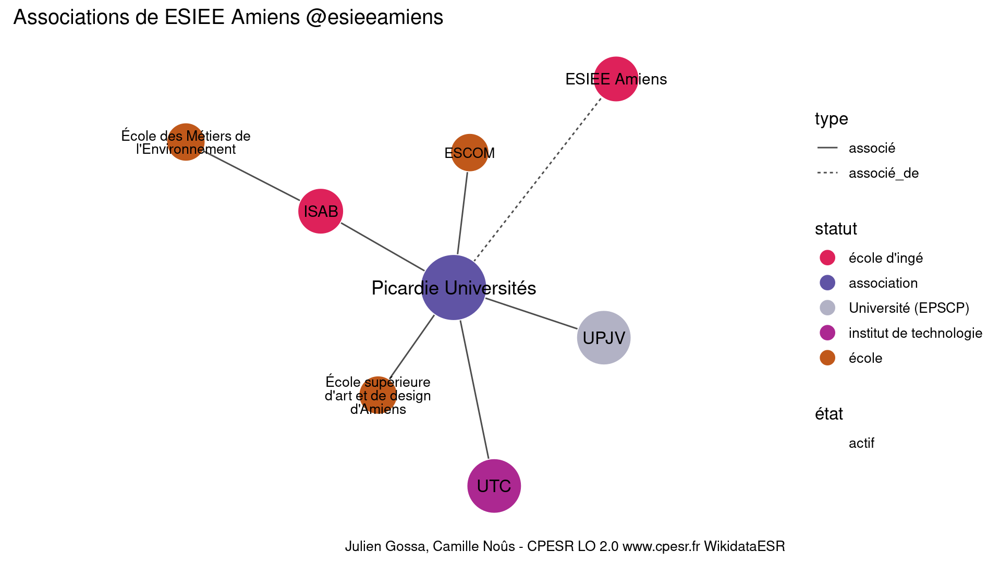 

Avertissements et édition : [logs](plots/etablissements/Q3046116.md) 

### ESIGELEC @GroupeESIGELEC : Histoire.     Edition des données : https://github.com/cpesr/wikidataESR/blob/master/plots/etablissements/Q17672767.md 


Erreur : les données sont probablement trop partielles.
```
Error in wdesr_ggplot_graph(df, node_size = node_size, label_sizes = label_sizes, : Empty ESR graph: something went wrong with the graph production parameters

``` 

Avertissements et édition : [logs](plots/etablissements/Q17672767.md) 

### ESIGELEC @GroupeESIGELEC : Composition.     Edition des données : https://github.com/cpesr/wikidataESR/blob/master/plots/etablissements/Q17672767.md 


Erreur : les données sont probablement trop partielles.
```
Error in wdesr_ggplot_graph(df, node_size = node_size, label_sizes = label_sizes, : Empty ESR graph: something went wrong with the graph production parameters

``` 

Avertissements et édition : [logs](plots/etablissements/Q17672767.md) 

### ESIGELEC @GroupeESIGELEC : Associations.     Edition des données : https://github.com/cpesr/wikidataESR/blob/master/plots/etablissements/Q17672767.md 


Erreur : les données sont probablement trop partielles.
```
Error in wdesr_ggplot_graph(df, node_size = node_size, label_sizes = label_sizes, : Empty ESR graph: something went wrong with the graph production parameters

``` 

Avertissements et édition : [logs](plots/etablissements/Q17672767.md) 

### ESILV @esilvparis : Histoire.     Edition des données : https://github.com/cpesr/wikidataESR/blob/master/plots/etablissements/Q3578408.md 


Erreur : les données sont probablement trop partielles.
```
Error in wdesr_ggplot_graph(df, node_size = node_size, label_sizes = label_sizes, : Empty ESR graph: something went wrong with the graph production parameters

``` 

Avertissements et édition : [logs](plots/etablissements/Q3578408.md) 

### ESILV @esilvparis : Composition.     Edition des données : https://github.com/cpesr/wikidataESR/blob/master/plots/etablissements/Q3578408.md 


Erreur : les données sont probablement trop partielles.
```
Error in wdesr_ggplot_graph(df, node_size = node_size, label_sizes = label_sizes, : Empty ESR graph: something went wrong with the graph production parameters

``` 

Avertissements et édition : [logs](plots/etablissements/Q3578408.md) 

### ESILV @esilvparis : Associations.     Edition des données : https://github.com/cpesr/wikidataESR/blob/master/plots/etablissements/Q3578408.md 


Erreur : les données sont probablement trop partielles.
```
Error in wdesr_ggplot_graph(df, node_size = node_size, label_sizes = label_sizes, : Empty ESR graph: something went wrong with the graph production parameters

``` 

Avertissements et édition : [logs](plots/etablissements/Q3578408.md) 

### ESA @Groupe_ESA : Histoire.     Edition des données : https://github.com/cpesr/wikidataESR/blob/master/plots/etablissements/Q3578375.md 


Erreur : les données sont probablement trop partielles.
```
Error in wdesr_ggplot_graph(df, node_size = node_size, label_sizes = label_sizes, : Empty ESR graph: something went wrong with the graph production parameters

``` 

Avertissements et édition : [logs](plots/etablissements/Q3578375.md) 

### ESA @Groupe_ESA : Composition.     Edition des données : https://github.com/cpesr/wikidataESR/blob/master/plots/etablissements/Q3578375.md 


Erreur : les données sont probablement trop partielles.
```
Error in wdesr_ggplot_graph(df, node_size = node_size, label_sizes = label_sizes, : Empty ESR graph: something went wrong with the graph production parameters

``` 

Avertissements et édition : [logs](plots/etablissements/Q3578375.md) 

### ESA @Groupe_ESA : Associations.     Edition des données : https://github.com/cpesr/wikidataESR/blob/master/plots/etablissements/Q3578375.md 


Erreur : les données sont probablement trop partielles.
```
Error in wdesr_ggplot_graph(df, node_size = node_size, label_sizes = label_sizes, : Empty ESR graph: something went wrong with the graph production parameters

``` 

Avertissements et édition : [logs](plots/etablissements/Q3578375.md) 

### ESCOM @escom_chimie : Histoire.     Edition des données : https://github.com/cpesr/wikidataESR/blob/master/plots/etablissements/Q3578426.md 


Erreur : les données sont probablement trop partielles.
```
Error in wdesr_ggplot_graph(df, node_size = node_size, label_sizes = label_sizes, : Empty ESR graph: something went wrong with the graph production parameters

``` 

Avertissements et édition : [logs](plots/etablissements/Q3578426.md) 

### ESCOM @escom_chimie : Composition.     Edition des données : https://github.com/cpesr/wikidataESR/blob/master/plots/etablissements/Q3578426.md 


Erreur : les données sont probablement trop partielles.
```
Error in wdesr_ggplot_graph(df, node_size = node_size, label_sizes = label_sizes, : Empty ESR graph: something went wrong with the graph production parameters

``` 

Avertissements et édition : [logs](plots/etablissements/Q3578426.md) 

### ESCOM @escom_chimie : Associations.     Edition des données : https://github.com/cpesr/wikidataESR/blob/master/plots/etablissements/Q3578426.md 

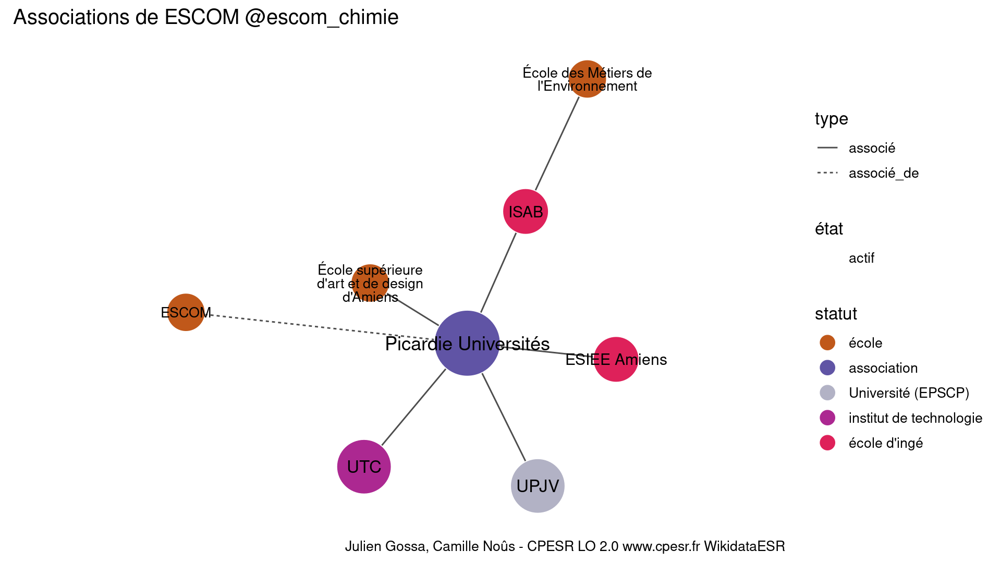 

Avertissements et édition : [logs](plots/etablissements/Q3578426.md) 

### CPE Lyon @CPELyon : Histoire.     Edition des données : https://github.com/cpesr/wikidataESR/blob/master/plots/etablissements/Q10178.md 


Erreur : les données sont probablement trop partielles.
```
Error in wdesr_ggplot_graph(df, node_size = node_size, label_sizes = label_sizes, : Empty ESR graph: something went wrong with the graph production parameters

``` 

Avertissements et édition : [logs](plots/etablissements/Q10178.md) 

### CPE Lyon @CPELyon : Composition.     Edition des données : https://github.com/cpesr/wikidataESR/blob/master/plots/etablissements/Q10178.md 

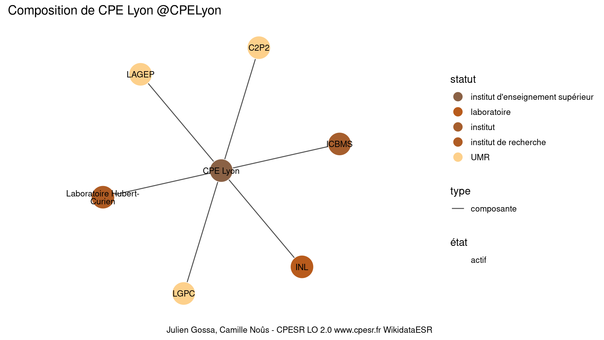 

Avertissements et édition : [logs](plots/etablissements/Q10178.md) 

### CPE Lyon @CPELyon : Associations.     Edition des données : https://github.com/cpesr/wikidataESR/blob/master/plots/etablissements/Q10178.md 


Erreur : les données sont probablement trop partielles.
```
Error in wdesr_ggplot_graph(df, node_size = node_size, label_sizes = label_sizes, : Empty ESR graph: something went wrong with the graph production parameters

``` 

Avertissements et édition : [logs](plots/etablissements/Q10178.md) 

### ESFF @SupDeuxF : Histoire.     Edition des données : https://github.com/cpesr/wikidataESR/blob/master/plots/etablissements/Q3578445.md 


Erreur : les données sont probablement trop partielles.
```
Error in wdesr_ggplot_graph(df, node_size = node_size, label_sizes = label_sizes, : Empty ESR graph: something went wrong with the graph production parameters

``` 

Avertissements et édition : [logs](plots/etablissements/Q3578445.md) 

### ESFF @SupDeuxF : Composition.     Edition des données : https://github.com/cpesr/wikidataESR/blob/master/plots/etablissements/Q3578445.md 


Erreur : les données sont probablement trop partielles.
```
Error in wdesr_ggplot_graph(df, node_size = node_size, label_sizes = label_sizes, : Empty ESR graph: something went wrong with the graph production parameters

``` 

Avertissements et édition : [logs](plots/etablissements/Q3578445.md) 

### ESFF @SupDeuxF : Associations.     Edition des données : https://github.com/cpesr/wikidataESR/blob/master/plots/etablissements/Q3578445.md 


Erreur : les données sont probablement trop partielles.
```
Error in wdesr_ggplot_graph(df, node_size = node_size, label_sizes = label_sizes, : Empty ESR graph: something went wrong with the graph production parameters

``` 

Avertissements et édition : [logs](plots/etablissements/Q3578445.md) 

### ESTACA NA : Histoire.     Edition des données : https://github.com/cpesr/wikidataESR/blob/master/plots/etablissements/Q3578506.md 


Erreur : les données sont probablement trop partielles.
```
Error in wdesr_ggplot_graph(df, node_size = node_size, label_sizes = label_sizes, : Empty ESR graph: something went wrong with the graph production parameters

``` 

Avertissements et édition : [logs](plots/etablissements/Q3578506.md) 

### ESTACA NA : Composition.     Edition des données : https://github.com/cpesr/wikidataESR/blob/master/plots/etablissements/Q3578506.md 


Erreur : les données sont probablement trop partielles.
```
Error in wdesr_ggplot_graph(df, node_size = node_size, label_sizes = label_sizes, : Empty ESR graph: something went wrong with the graph production parameters

``` 

Avertissements et édition : [logs](plots/etablissements/Q3578506.md) 

### ESTACA NA : Associations.     Edition des données : https://github.com/cpesr/wikidataESR/blob/master/plots/etablissements/Q3578506.md 


Erreur : les données sont probablement trop partielles.
```
Error in wdesr_ggplot_graph(df, node_size = node_size, label_sizes = label_sizes, : Empty ESR graph: something went wrong with the graph production parameters

``` 

Avertissements et édition : [logs](plots/etablissements/Q3578506.md) 

### ESTIA @EstiaOfficiel : Histoire.     Edition des données : https://github.com/cpesr/wikidataESR/blob/master/plots/etablissements/Q3578510.md 


Erreur : les données sont probablement trop partielles.
```
Error in wdesr_ggplot_graph(df, node_size = node_size, label_sizes = label_sizes, : Empty ESR graph: something went wrong with the graph production parameters

``` 

Avertissements et édition : [logs](plots/etablissements/Q3578510.md) 

### ESTIA @EstiaOfficiel : Composition.     Edition des données : https://github.com/cpesr/wikidataESR/blob/master/plots/etablissements/Q3578510.md 


Erreur : les données sont probablement trop partielles.
```
Error in wdesr_ggplot_graph(df, node_size = node_size, label_sizes = label_sizes, : Empty ESR graph: something went wrong with the graph production parameters

``` 

Avertissements et édition : [logs](plots/etablissements/Q3578510.md) 

### ESTIA @EstiaOfficiel : Associations.     Edition des données : https://github.com/cpesr/wikidataESR/blob/master/plots/etablissements/Q3578510.md 


Erreur : les données sont probablement trop partielles.
```
Error in wdesr_ggplot_graph(df, node_size = node_size, label_sizes = label_sizes, : Empty ESR graph: something went wrong with the graph production parameters

``` 

Avertissements et édition : [logs](plots/etablissements/Q3578510.md) 

### ESB NA : Histoire.     Edition des données : https://github.com/cpesr/wikidataESR/blob/master/plots/etablissements/Q3578509.md 


Erreur : les données sont probablement trop partielles.
```
Error in wdesr_ggplot_graph(df, node_size = node_size, label_sizes = label_sizes, : Empty ESR graph: something went wrong with the graph production parameters

``` 

Avertissements et édition : [logs](plots/etablissements/Q3578509.md) 

### ESB NA : Composition.     Edition des données : https://github.com/cpesr/wikidataESR/blob/master/plots/etablissements/Q3578509.md 


Erreur : les données sont probablement trop partielles.
```
Error in wdesr_ggplot_graph(df, node_size = node_size, label_sizes = label_sizes, : Empty ESR graph: something went wrong with the graph production parameters

``` 

Avertissements et édition : [logs](plots/etablissements/Q3578509.md) 

### ESB NA : Associations.     Edition des données : https://github.com/cpesr/wikidataESR/blob/master/plots/etablissements/Q3578509.md 


Erreur : les données sont probablement trop partielles.
```
Error in wdesr_ggplot_graph(df, node_size = node_size, label_sizes = label_sizes, : Empty ESR graph: something went wrong with the graph production parameters

``` 

Avertissements et édition : [logs](plots/etablissements/Q3578509.md) 

### EIGSI @EIGSI : Histoire.     Edition des données : https://github.com/cpesr/wikidataESR/blob/master/plots/etablissements/Q3577771.md 


Erreur : les données sont probablement trop partielles.
```
Error in wdesr_ggplot_graph(df, node_size = node_size, label_sizes = label_sizes, : Empty ESR graph: something went wrong with the graph production parameters

``` 

Avertissements et édition : [logs](plots/etablissements/Q3577771.md) 

### EIGSI @EIGSI : Composition.     Edition des données : https://github.com/cpesr/wikidataESR/blob/master/plots/etablissements/Q3577771.md 


Erreur : les données sont probablement trop partielles.
```
Error in wdesr_ggplot_graph(df, node_size = node_size, label_sizes = label_sizes, : Empty ESR graph: something went wrong with the graph production parameters

``` 

Avertissements et édition : [logs](plots/etablissements/Q3577771.md) 

### EIGSI @EIGSI : Associations.     Edition des données : https://github.com/cpesr/wikidataESR/blob/master/plots/etablissements/Q3577771.md 


Erreur : les données sont probablement trop partielles.
```
Error in wdesr_ggplot_graph(df, node_size = node_size, label_sizes = label_sizes, : Empty ESR graph: something went wrong with the graph production parameters

``` 

Avertissements et édition : [logs](plots/etablissements/Q3577771.md) 

### EPF NA : Histoire.     Edition des données : https://github.com/cpesr/wikidataESR/blob/master/plots/etablissements/Q3046044.md 


Erreur : les données sont probablement trop partielles.
```
Error in wdesr_ggplot_graph(df, node_size = node_size, label_sizes = label_sizes, : Empty ESR graph: something went wrong with the graph production parameters

``` 

Avertissements et édition : [logs](plots/etablissements/Q3046044.md) 

### EPF NA : Composition.     Edition des données : https://github.com/cpesr/wikidataESR/blob/master/plots/etablissements/Q3046044.md 


Erreur : les données sont probablement trop partielles.
```
Error in wdesr_ggplot_graph(df, node_size = node_size, label_sizes = label_sizes, : Empty ESR graph: something went wrong with the graph production parameters

``` 

Avertissements et édition : [logs](plots/etablissements/Q3046044.md) 

### EPF NA : Associations.     Edition des données : https://github.com/cpesr/wikidataESR/blob/master/plots/etablissements/Q3046044.md 


Erreur : les données sont probablement trop partielles.
```
Error in wdesr_ggplot_graph(df, node_size = node_size, label_sizes = label_sizes, : Empty ESR graph: something went wrong with the graph production parameters

``` 

Avertissements et édition : [logs](plots/etablissements/Q3046044.md) 

### ESIEE Paris @ESIEEPARIS : Histoire.     Edition des données : https://github.com/cpesr/wikidataESR/blob/master/plots/etablissements/Q3046118.md 


Erreur : les données sont probablement trop partielles.
```
Error in wdesr_ggplot_graph(df, node_size = node_size, label_sizes = label_sizes, : Empty ESR graph: something went wrong with the graph production parameters

``` 

Avertissements et édition : [logs](plots/etablissements/Q3046118.md) 

### ESIEE Paris @ESIEEPARIS : Composition.     Edition des données : https://github.com/cpesr/wikidataESR/blob/master/plots/etablissements/Q3046118.md 

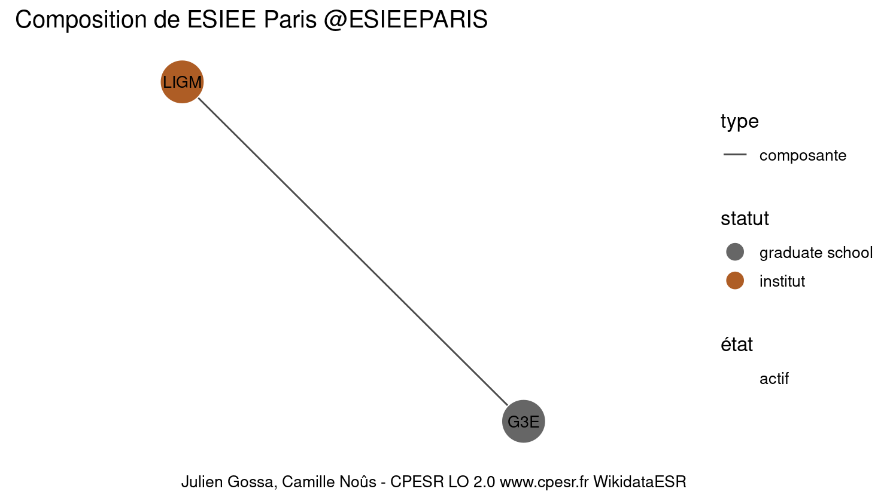 

Avertissements et édition : [logs](plots/etablissements/Q3046118.md) 

### ESIEE Paris @ESIEEPARIS : Associations.     Edition des données : https://github.com/cpesr/wikidataESR/blob/master/plots/etablissements/Q3046118.md 

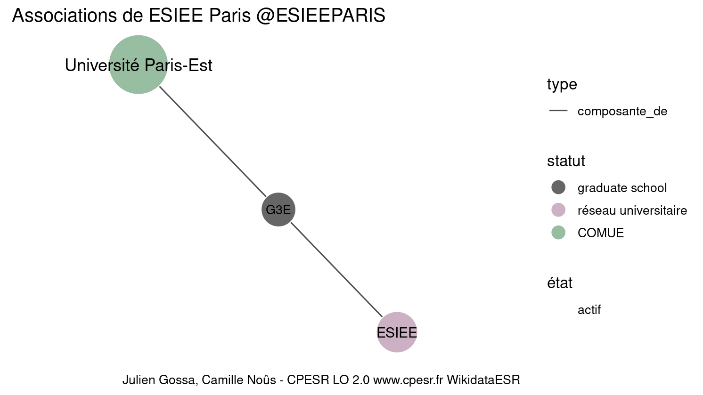 

Avertissements et édition : [logs](plots/etablissements/Q3046118.md) 

### HEI @EcoleHEI : Histoire.     Edition des données : https://github.com/cpesr/wikidataESR/blob/master/plots/etablissements/Q3128626.md 


Erreur : les données sont probablement trop partielles.
```
Error in wdesr_ggplot_graph(df, node_size = node_size, label_sizes = label_sizes, : Empty ESR graph: something went wrong with the graph production parameters

``` 

Avertissements et édition : [logs](plots/etablissements/Q3128626.md) 

### HEI @EcoleHEI : Composition.     Edition des données : https://github.com/cpesr/wikidataESR/blob/master/plots/etablissements/Q3128626.md 


Erreur : les données sont probablement trop partielles.
```
Error in wdesr_ggplot_graph(df, node_size = node_size, label_sizes = label_sizes, : Empty ESR graph: something went wrong with the graph production parameters

``` 

Avertissements et édition : [logs](plots/etablissements/Q3128626.md) 

### HEI @EcoleHEI : Associations.     Edition des données : https://github.com/cpesr/wikidataESR/blob/master/plots/etablissements/Q3128626.md 


Erreur : les données sont probablement trop partielles.
```
Error in wdesr_ggplot_graph(df, node_size = node_size, label_sizes = label_sizes, : Empty ESR graph: something went wrong with the graph production parameters

``` 

Avertissements et édition : [logs](plots/etablissements/Q3128626.md) 

### 3IL @3iL_Ingenieurs : Histoire.     Edition des données : https://github.com/cpesr/wikidataESR/blob/master/plots/etablissements/Q3151931.md 


Erreur : les données sont probablement trop partielles.
```
Error in wdesr_ggplot_graph(df, node_size = node_size, label_sizes = label_sizes, : Empty ESR graph: something went wrong with the graph production parameters

``` 

Avertissements et édition : [logs](plots/etablissements/Q3151931.md) 

### 3IL @3iL_Ingenieurs : Composition.     Edition des données : https://github.com/cpesr/wikidataESR/blob/master/plots/etablissements/Q3151931.md 


Erreur : les données sont probablement trop partielles.
```
Error in wdesr_ggplot_graph(df, node_size = node_size, label_sizes = label_sizes, : Empty ESR graph: something went wrong with the graph production parameters

``` 

Avertissements et édition : [logs](plots/etablissements/Q3151931.md) 

### 3IL @3iL_Ingenieurs : Associations.     Edition des données : https://github.com/cpesr/wikidataESR/blob/master/plots/etablissements/Q3151931.md 


Erreur : les données sont probablement trop partielles.
```
Error in wdesr_ggplot_graph(df, node_size = node_size, label_sizes = label_sizes, : Empty ESR graph: something went wrong with the graph production parameters

``` 

Avertissements et édition : [logs](plots/etablissements/Q3151931.md) 

### IMT @IMTFrance : Histoire.     Edition des données : https://github.com/cpesr/wikidataESR/blob/master/plots/etablissements/Q7885718.md 


Erreur : les données sont probablement trop partielles.
```
Error in wdesr_ggplot_graph(df, node_size = node_size, label_sizes = label_sizes, : Empty ESR graph: something went wrong with the graph production parameters

``` 

Avertissements et édition : [logs](plots/etablissements/Q7885718.md) 

### IMT @IMTFrance : Composition.     Edition des données : https://github.com/cpesr/wikidataESR/blob/master/plots/etablissements/Q7885718.md 

 

Avertissements et édition : [logs](plots/etablissements/Q7885718.md) 

### IMT @IMTFrance : Associations.     Edition des données : https://github.com/cpesr/wikidataESR/blob/master/plots/etablissements/Q7885718.md 

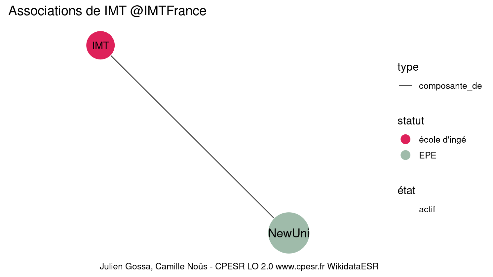 

Avertissements et édition : [logs](plots/etablissements/Q7885718.md) 

### Institut Agro NA : Histoire.     Edition des données : https://github.com/cpesr/wikidataESR/blob/master/plots/etablissements/Q81433122.md 

 

Avertissements et édition : [logs](plots/etablissements/Q81433122.md) 

### Institut Agro NA : Composition.     Edition des données : https://github.com/cpesr/wikidataESR/blob/master/plots/etablissements/Q81433122.md 


Erreur : les données sont probablement trop partielles.
```
Error in wdesr_ggplot_graph(df, node_size = node_size, label_sizes = label_sizes, : Empty ESR graph: something went wrong with the graph production parameters

``` 

Avertissements et édition : [logs](plots/etablissements/Q81433122.md) 

### Institut Agro NA : Associations.     Edition des données : https://github.com/cpesr/wikidataESR/blob/master/plots/etablissements/Q81433122.md 


Erreur : les données sont probablement trop partielles.
```
Error in wdesr_ggplot_graph(df, node_size = node_size, label_sizes = label_sizes, : Empty ESR graph: something went wrong with the graph production parameters

``` 

Avertissements et édition : [logs](plots/etablissements/Q81433122.md) 

### INSA CVL @insacvl : Histoire.     Edition des données : https://github.com/cpesr/wikidataESR/blob/master/plots/etablissements/Q15651478.md 


Erreur : les données sont probablement trop partielles.
```
Error in wdesr_ggplot_graph(df, node_size = node_size, label_sizes = label_sizes, : Empty ESR graph: something went wrong with the graph production parameters

``` 

Avertissements et édition : [logs](plots/etablissements/Q15651478.md) 

### INSA CVL @insacvl : Composition.     Edition des données : https://github.com/cpesr/wikidataESR/blob/master/plots/etablissements/Q15651478.md 


Erreur : les données sont probablement trop partielles.
```
Error in wdesr_ggplot_graph(df, node_size = node_size, label_sizes = label_sizes, : Empty ESR graph: something went wrong with the graph production parameters

``` 

Avertissements et édition : [logs](plots/etablissements/Q15651478.md) 

### INSA CVL @insacvl : Associations.     Edition des données : https://github.com/cpesr/wikidataESR/blob/master/plots/etablissements/Q15651478.md 


Erreur : les données sont probablement trop partielles.
```
Error in wdesr_ggplot_graph(df, node_size = node_size, label_sizes = label_sizes, : Empty ESR graph: something went wrong with the graph production parameters

``` 

Avertissements et édition : [logs](plots/etablissements/Q15651478.md) 

### INSA Lyon @insadelyon : Histoire.     Edition des données : https://github.com/cpesr/wikidataESR/blob/master/plots/etablissements/Q1633859.md 


Erreur : les données sont probablement trop partielles.
```
Error in wdesr_ggplot_graph(df, node_size = node_size, label_sizes = label_sizes, : Empty ESR graph: something went wrong with the graph production parameters

``` 

Avertissements et édition : [logs](plots/etablissements/Q1633859.md) 

### INSA Lyon @insadelyon : Composition.     Edition des données : https://github.com/cpesr/wikidataESR/blob/master/plots/etablissements/Q1633859.md 

 

Avertissements et édition : [logs](plots/etablissements/Q1633859.md) 

### INSA Lyon @insadelyon : Associations.     Edition des données : https://github.com/cpesr/wikidataESR/blob/master/plots/etablissements/Q1633859.md 

 

Avertissements et édition : [logs](plots/etablissements/Q1633859.md) 

### INSA Rennes @INSA_Rennes : Histoire.     Edition des données : https://github.com/cpesr/wikidataESR/blob/master/plots/etablissements/Q1934614.md 


Erreur : les données sont probablement trop partielles.
```
Error in wdesr_ggplot_graph(df, node_size = node_size, label_sizes = label_sizes, : Empty ESR graph: something went wrong with the graph production parameters

``` 

Avertissements et édition : [logs](plots/etablissements/Q1934614.md) 

### INSA Rennes @INSA_Rennes : Composition.     Edition des données : https://github.com/cpesr/wikidataESR/blob/master/plots/etablissements/Q1934614.md 

 

Avertissements et édition : [logs](plots/etablissements/Q1934614.md) 

### INSA Rennes @INSA_Rennes : Associations.     Edition des données : https://github.com/cpesr/wikidataESR/blob/master/plots/etablissements/Q1934614.md 


Erreur : les données sont probablement trop partielles.
```
Error in wdesr_ggplot_graph(df, node_size = node_size, label_sizes = label_sizes, : Empty ESR graph: something went wrong with the graph production parameters

``` 

Avertissements et édition : [logs](plots/etablissements/Q1934614.md) 

### INSA Rouen Normandie @insarouen : Histoire.     Edition des données : https://github.com/cpesr/wikidataESR/blob/master/plots/etablissements/Q1665112.md 


Erreur : les données sont probablement trop partielles.
```
Error in wdesr_ggplot_graph(df, node_size = node_size, label_sizes = label_sizes, : Empty ESR graph: something went wrong with the graph production parameters

``` 

Avertissements et édition : [logs](plots/etablissements/Q1665112.md) 

### INSA Rouen Normandie @insarouen : Composition.     Edition des données : https://github.com/cpesr/wikidataESR/blob/master/plots/etablissements/Q1665112.md 

 

Avertissements et édition : [logs](plots/etablissements/Q1665112.md) 

### INSA Rouen Normandie @insarouen : Associations.     Edition des données : https://github.com/cpesr/wikidataESR/blob/master/plots/etablissements/Q1665112.md 

 

Avertissements et édition : [logs](plots/etablissements/Q1665112.md) 

### INSA Strasbourg @Insa_Strasbourg : Histoire.     Edition des données : https://github.com/cpesr/wikidataESR/blob/master/plots/etablissements/Q521036.md 


Erreur : les données sont probablement trop partielles.
```
Error in wdesr_ggplot_graph(df, node_size = node_size, label_sizes = label_sizes, : Empty ESR graph: something went wrong with the graph production parameters

``` 

Avertissements et édition : [logs](plots/etablissements/Q521036.md) 

### INSA Strasbourg @Insa_Strasbourg : Composition.     Edition des données : https://github.com/cpesr/wikidataESR/blob/master/plots/etablissements/Q521036.md 

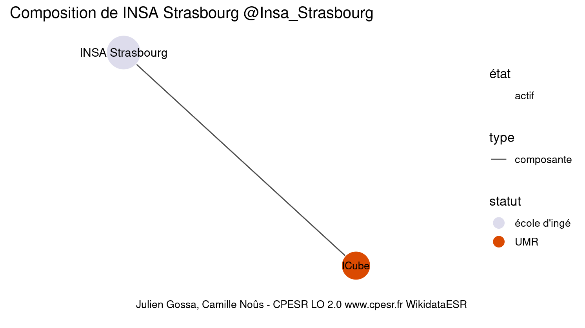 

Avertissements et édition : [logs](plots/etablissements/Q521036.md) 

### INSA Strasbourg @Insa_Strasbourg : Associations.     Edition des données : https://github.com/cpesr/wikidataESR/blob/master/plots/etablissements/Q521036.md 

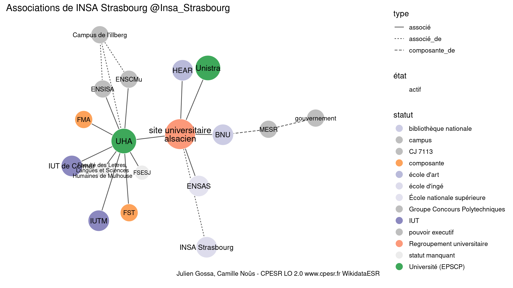 

Avertissements et édition : [logs](plots/etablissements/Q521036.md) 

### INSA Toulouse @INSAToulouse : Histoire.     Edition des données : https://github.com/cpesr/wikidataESR/blob/master/plots/etablissements/Q858979.md 


Erreur : les données sont probablement trop partielles.
```
Error in wdesr_ggplot_graph(df, node_size = node_size, label_sizes = label_sizes, : Empty ESR graph: something went wrong with the graph production parameters

``` 

Avertissements et édition : [logs](plots/etablissements/Q858979.md) 

### INSA Toulouse @INSAToulouse : Composition.     Edition des données : https://github.com/cpesr/wikidataESR/blob/master/plots/etablissements/Q858979.md 

 

Avertissements et édition : [logs](plots/etablissements/Q858979.md) 

### INSA Toulouse @INSAToulouse : Associations.     Edition des données : https://github.com/cpesr/wikidataESR/blob/master/plots/etablissements/Q858979.md 

 

Avertissements et édition : [logs](plots/etablissements/Q858979.md) 

### INSTN NA : Histoire.     Edition des données : https://github.com/cpesr/wikidataESR/blob/master/plots/etablissements/Q3152438.md 


Erreur : les données sont probablement trop partielles.
```
Error in wdesr_ggplot_graph(df, node_size = node_size, label_sizes = label_sizes, : Empty ESR graph: something went wrong with the graph production parameters

``` 

Avertissements et édition : [logs](plots/etablissements/Q3152438.md) 

### INSTN NA : Composition.     Edition des données : https://github.com/cpesr/wikidataESR/blob/master/plots/etablissements/Q3152438.md 


Erreur : les données sont probablement trop partielles.
```
Error in wdesr_ggplot_graph(df, node_size = node_size, label_sizes = label_sizes, : Empty ESR graph: something went wrong with the graph production parameters

``` 

Avertissements et édition : [logs](plots/etablissements/Q3152438.md) 

### INSTN NA : Associations.     Edition des données : https://github.com/cpesr/wikidataESR/blob/master/plots/etablissements/Q3152438.md 


Erreur : les données sont probablement trop partielles.
```
Error in wdesr_ggplot_graph(df, node_size = node_size, label_sizes = label_sizes, : Empty ESR graph: something went wrong with the graph production parameters

``` 

Avertissements et édition : [logs](plots/etablissements/Q3152438.md) 

### INUC @UnivChampollion : Histoire.     Edition des données : https://github.com/cpesr/wikidataESR/blob/master/plots/etablissements/Q929515.md 


Erreur : les données sont probablement trop partielles.
```
Error in wdesr_ggplot_graph(df, node_size = node_size, label_sizes = label_sizes, : Empty ESR graph: something went wrong with the graph production parameters

``` 

Avertissements et édition : [logs](plots/etablissements/Q929515.md) 

### INUC @UnivChampollion : Composition.     Edition des données : https://github.com/cpesr/wikidataESR/blob/master/plots/etablissements/Q929515.md 


Erreur : les données sont probablement trop partielles.
```
Error in wdesr_ggplot_graph(df, node_size = node_size, label_sizes = label_sizes, : Empty ESR graph: something went wrong with the graph production parameters

``` 

Avertissements et édition : [logs](plots/etablissements/Q929515.md) 

### INUC @UnivChampollion : Associations.     Edition des données : https://github.com/cpesr/wikidataESR/blob/master/plots/etablissements/Q929515.md 

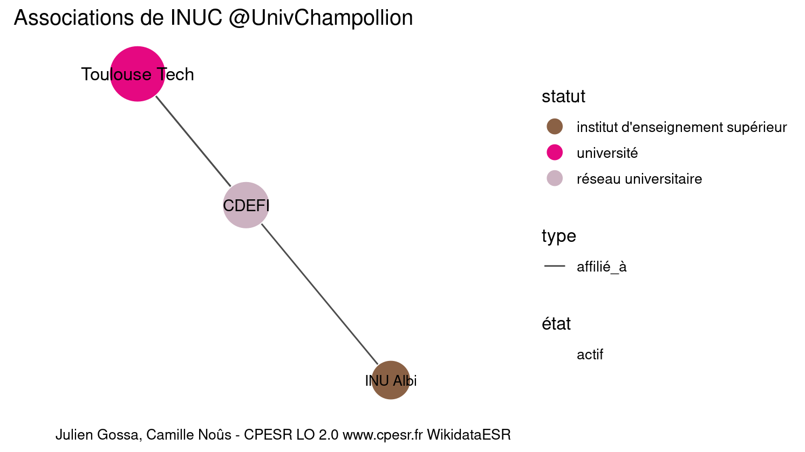 

Avertissements et édition : [logs](plots/etablissements/Q929515.md) 

### IP Paris @IP__Paris : Histoire.     Edition des données : https://github.com/cpesr/wikidataESR/blob/master/plots/etablissements/Q48759778.md 


Erreur : les données sont probablement trop partielles.
```
Error in wdesr_ggplot_graph(df, node_size = node_size, label_sizes = label_sizes, : Empty ESR graph: something went wrong with the graph production parameters

``` 

Avertissements et édition : [logs](plots/etablissements/Q48759778.md) 

### IP Paris @IP__Paris : Composition.     Edition des données : https://github.com/cpesr/wikidataESR/blob/master/plots/etablissements/Q48759778.md 

 

Avertissements et édition : [logs](plots/etablissements/Q48759778.md) 

### IP Paris @IP__Paris : Associations.     Edition des données : https://github.com/cpesr/wikidataESR/blob/master/plots/etablissements/Q48759778.md 


Erreur : les données sont probablement trop partielles.
```
Error in wdesr_ggplot_graph(df, node_size = node_size, label_sizes = label_sizes, : Empty ESR graph: something went wrong with the graph production parameters

``` 

Avertissements et édition : [logs](plots/etablissements/Q48759778.md) 

### IPSA @IPSA : Histoire.     Edition des données : https://github.com/cpesr/wikidataESR/blob/master/plots/etablissements/Q183213.md 


Erreur : les données sont probablement trop partielles.
```
Error in wdesr_ggplot_graph(df, node_size = node_size, label_sizes = label_sizes, : Empty ESR graph: something went wrong with the graph production parameters

``` 

Avertissements et édition : [logs](plots/etablissements/Q183213.md) 

### IPSA @IPSA : Composition.     Edition des données : https://github.com/cpesr/wikidataESR/blob/master/plots/etablissements/Q183213.md 


Erreur : les données sont probablement trop partielles.
```
Error in wdesr_ggplot_graph(df, node_size = node_size, label_sizes = label_sizes, : Empty ESR graph: something went wrong with the graph production parameters

``` 

Avertissements et édition : [logs](plots/etablissements/Q183213.md) 

### IPSA @IPSA : Associations.     Edition des données : https://github.com/cpesr/wikidataESR/blob/master/plots/etablissements/Q183213.md 

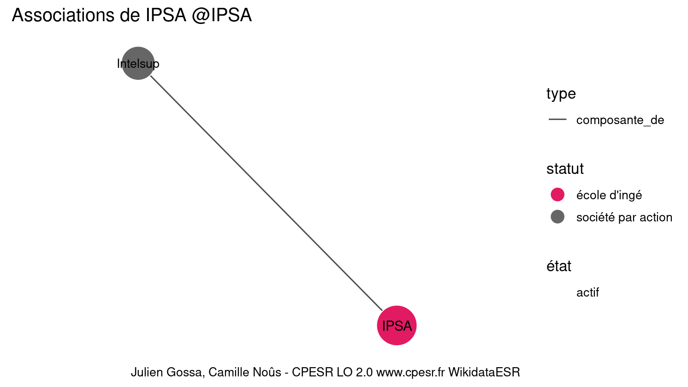 

Avertissements et édition : [logs](plots/etablissements/Q183213.md) 

### UniLaSalle @UniLaSalle_fr : Histoire.     Edition des données : https://github.com/cpesr/wikidataESR/blob/master/plots/etablissements/Q3152468.md 

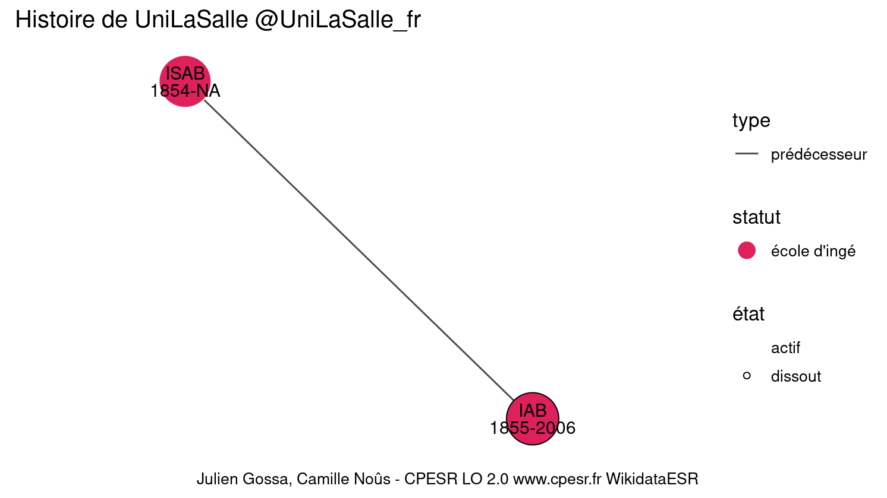 

Avertissements et édition : [logs](plots/etablissements/Q3152468.md) 

### UniLaSalle @UniLaSalle_fr : Composition.     Edition des données : https://github.com/cpesr/wikidataESR/blob/master/plots/etablissements/Q3152468.md 


Erreur : les données sont probablement trop partielles.
```
Error in wdesr_ggplot_graph(df, node_size = node_size, label_sizes = label_sizes, : Empty ESR graph: something went wrong with the graph production parameters

``` 

Avertissements et édition : [logs](plots/etablissements/Q3152468.md) 

### UniLaSalle @UniLaSalle_fr : Associations.     Edition des données : https://github.com/cpesr/wikidataESR/blob/master/plots/etablissements/Q3152468.md 

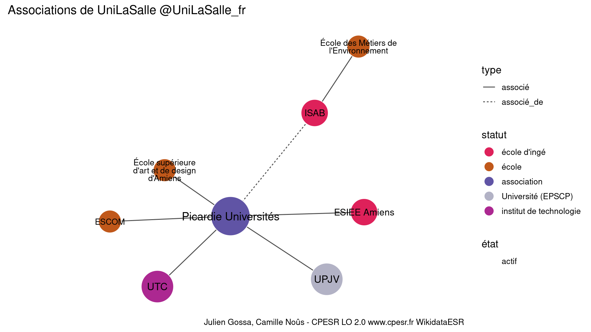 

Avertissements et édition : [logs](plots/etablissements/Q3152468.md) 

### ISBP @supbiotech : Histoire.     Edition des données : https://github.com/cpesr/wikidataESR/blob/master/plots/etablissements/Q1822570.md 


Erreur : les données sont probablement trop partielles.
```
Error in wdesr_ggplot_graph(df, node_size = node_size, label_sizes = label_sizes, : Empty ESR graph: something went wrong with the graph production parameters

``` 

Avertissements et édition : [logs](plots/etablissements/Q1822570.md) 

### ISBP @supbiotech : Composition.     Edition des données : https://github.com/cpesr/wikidataESR/blob/master/plots/etablissements/Q1822570.md 


Erreur : les données sont probablement trop partielles.
```
Error in wdesr_ggplot_graph(df, node_size = node_size, label_sizes = label_sizes, : Empty ESR graph: something went wrong with the graph production parameters

``` 

Avertissements et édition : [logs](plots/etablissements/Q1822570.md) 

### ISBP @supbiotech : Associations.     Edition des données : https://github.com/cpesr/wikidataESR/blob/master/plots/etablissements/Q1822570.md 

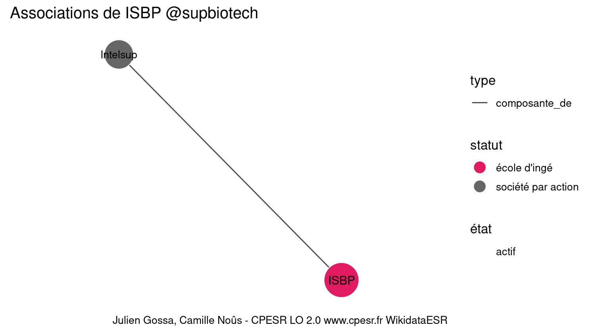 

Avertissements et édition : [logs](plots/etablissements/Q1822570.md) 

### ISA Lille @ISA_Lille : Histoire.     Edition des données : https://github.com/cpesr/wikidataESR/blob/master/plots/etablissements/Q3117452.md 


Erreur : les données sont probablement trop partielles.
```
Error in wdesr_ggplot_graph(df, node_size = node_size, label_sizes = label_sizes, : Empty ESR graph: something went wrong with the graph production parameters

``` 

Avertissements et édition : [logs](plots/etablissements/Q3117452.md) 

### ISA Lille @ISA_Lille : Composition.     Edition des données : https://github.com/cpesr/wikidataESR/blob/master/plots/etablissements/Q3117452.md 


Erreur : les données sont probablement trop partielles.
```
Error in wdesr_ggplot_graph(df, node_size = node_size, label_sizes = label_sizes, : Empty ESR graph: something went wrong with the graph production parameters

``` 

Avertissements et édition : [logs](plots/etablissements/Q3117452.md) 

### ISA Lille @ISA_Lille : Associations.     Edition des données : https://github.com/cpesr/wikidataESR/blob/master/plots/etablissements/Q3117452.md 


Erreur : les données sont probablement trop partielles.
```
Error in wdesr_ggplot_graph(df, node_size = node_size, label_sizes = label_sizes, : Empty ESR graph: something went wrong with the graph production parameters

``` 

Avertissements et édition : [logs](plots/etablissements/Q3117452.md) 

### ISEP @ISEP : Histoire.     Edition des données : https://github.com/cpesr/wikidataESR/blob/master/plots/etablissements/Q3152556.md 


Erreur : les données sont probablement trop partielles.
```
Error in wdesr_ggplot_graph(df, node_size = node_size, label_sizes = label_sizes, : Empty ESR graph: something went wrong with the graph production parameters

``` 

Avertissements et édition : [logs](plots/etablissements/Q3152556.md) 

### ISEP @ISEP : Composition.     Edition des données : https://github.com/cpesr/wikidataESR/blob/master/plots/etablissements/Q3152556.md 


Erreur : les données sont probablement trop partielles.
```
Error in wdesr_ggplot_graph(df, node_size = node_size, label_sizes = label_sizes, : Empty ESR graph: something went wrong with the graph production parameters

``` 

Avertissements et édition : [logs](plots/etablissements/Q3152556.md) 

### ISEP @ISEP : Associations.     Edition des données : https://github.com/cpesr/wikidataESR/blob/master/plots/etablissements/Q3152556.md 


Erreur : les données sont probablement trop partielles.
```
Error in wdesr_ggplot_graph(df, node_size = node_size, label_sizes = label_sizes, : Empty ESR graph: something went wrong with the graph production parameters

``` 

Avertissements et édition : [logs](plots/etablissements/Q3152556.md) 

### Isara-Lyon @isaralyon : Histoire.     Edition des données : https://github.com/cpesr/wikidataESR/blob/master/plots/etablissements/Q3152527.md 


Erreur : les données sont probablement trop partielles.
```
Error in wdesr_ggplot_graph(df, node_size = node_size, label_sizes = label_sizes, : Empty ESR graph: something went wrong with the graph production parameters

``` 

Avertissements et édition : [logs](plots/etablissements/Q3152527.md) 

### Isara-Lyon @isaralyon : Composition.     Edition des données : https://github.com/cpesr/wikidataESR/blob/master/plots/etablissements/Q3152527.md 

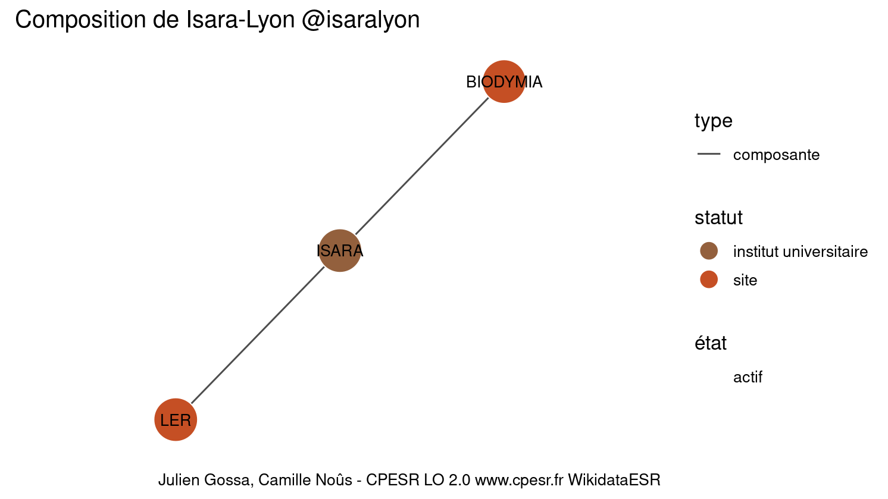 

Avertissements et édition : [logs](plots/etablissements/Q3152527.md) 

### Isara-Lyon @isaralyon : Associations.     Edition des données : https://github.com/cpesr/wikidataESR/blob/master/plots/etablissements/Q3152527.md 


Erreur : les données sont probablement trop partielles.
```
Error in wdesr_ggplot_graph(df, node_size = node_size, label_sizes = label_sizes, : Empty ESR graph: something went wrong with the graph production parameters

``` 

Avertissements et édition : [logs](plots/etablissements/Q3152527.md) 

### ISAE-SUPAERO @ISAE_officiel : Histoire.     Edition des données : https://github.com/cpesr/wikidataESR/blob/master/plots/etablissements/Q155446.md 

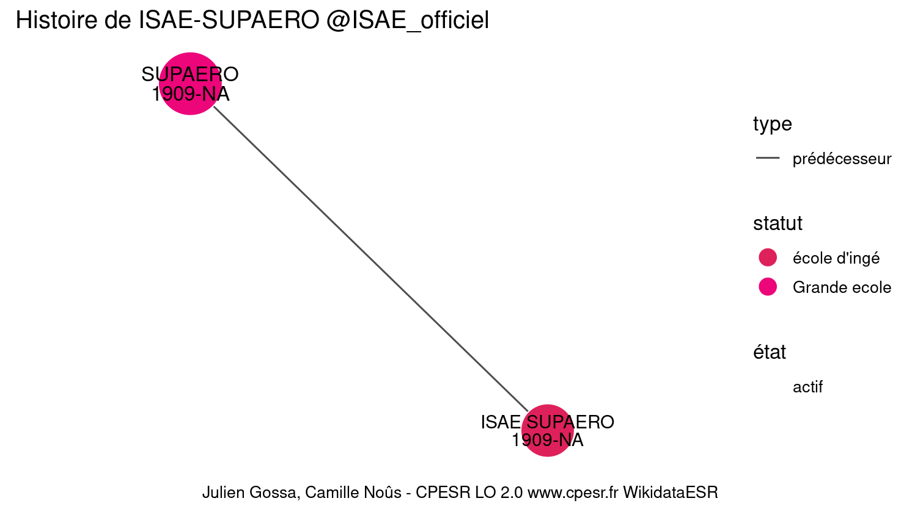 

Avertissements et édition : [logs](plots/etablissements/Q155446.md) 

### ISAE-SUPAERO @ISAE_officiel : Composition.     Edition des données : https://github.com/cpesr/wikidataESR/blob/master/plots/etablissements/Q155446.md 

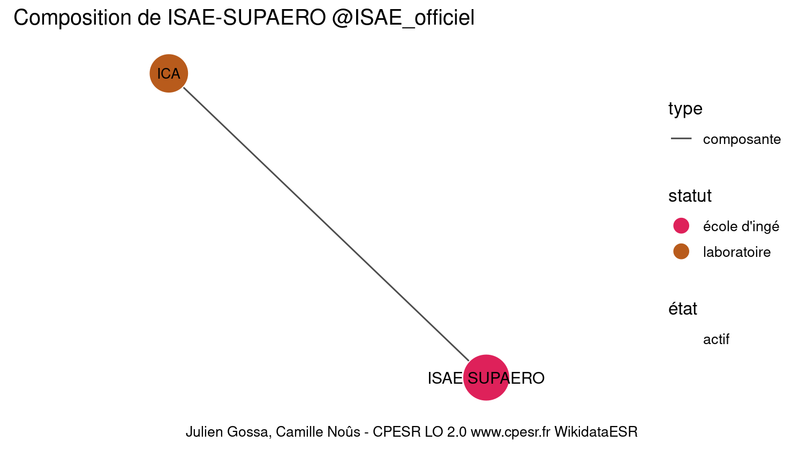 

Avertissements et édition : [logs](plots/etablissements/Q155446.md) 

### ISAE-SUPAERO @ISAE_officiel : Associations.     Edition des données : https://github.com/cpesr/wikidataESR/blob/master/plots/etablissements/Q155446.md 


Erreur : les données sont probablement trop partielles.
```
Error in wdesr_ggplot_graph(df, node_size = node_size, label_sizes = label_sizes, : Empty ESR graph: something went wrong with the graph production parameters

``` 

Avertissements et édition : [logs](plots/etablissements/Q155446.md) 

### Yncréa Ouest @isenbrest : Histoire.     Edition des données : https://github.com/cpesr/wikidataESR/blob/master/plots/etablissements/Q51648617.md 


Erreur : les données sont probablement trop partielles.
```
Error in wdesr_ggplot_graph(df, node_size = node_size, label_sizes = label_sizes, : Empty ESR graph: something went wrong with the graph production parameters

``` 

Avertissements et édition : [logs](plots/etablissements/Q51648617.md) 

### Yncréa Ouest @isenbrest : Composition.     Edition des données : https://github.com/cpesr/wikidataESR/blob/master/plots/etablissements/Q51648617.md 


Erreur : les données sont probablement trop partielles.
```
Error in wdesr_ggplot_graph(df, node_size = node_size, label_sizes = label_sizes, : Empty ESR graph: something went wrong with the graph production parameters

``` 

Avertissements et édition : [logs](plots/etablissements/Q51648617.md) 

### Yncréa Ouest @isenbrest : Associations.     Edition des données : https://github.com/cpesr/wikidataESR/blob/master/plots/etablissements/Q51648617.md 

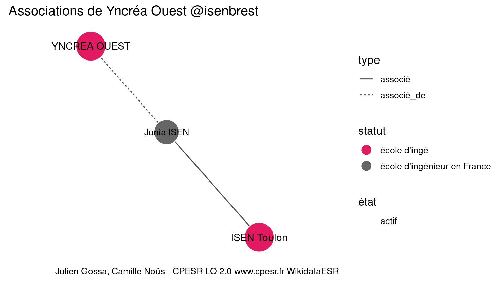 

Avertissements et édition : [logs](plots/etablissements/Q51648617.md) 

### ISBA-TP MARS NA : Histoire.     Edition des données : https://github.com/cpesr/wikidataESR/blob/master/plots/etablissements/Q60846049.md 


Erreur : les données sont probablement trop partielles.
```
Error in wdesr_ggplot_graph(df, node_size = node_size, label_sizes = label_sizes, : Empty ESR graph: something went wrong with the graph production parameters

``` 

Avertissements et édition : [logs](plots/etablissements/Q60846049.md) 

### ISBA-TP MARS NA : Composition.     Edition des données : https://github.com/cpesr/wikidataESR/blob/master/plots/etablissements/Q60846049.md 


Erreur : les données sont probablement trop partielles.
```
Error in wdesr_ggplot_graph(df, node_size = node_size, label_sizes = label_sizes, : Empty ESR graph: something went wrong with the graph production parameters

``` 

Avertissements et édition : [logs](plots/etablissements/Q60846049.md) 

### ISBA-TP MARS NA : Associations.     Edition des données : https://github.com/cpesr/wikidataESR/blob/master/plots/etablissements/Q60846049.md 


Erreur : les données sont probablement trop partielles.
```
Error in wdesr_ggplot_graph(df, node_size = node_size, label_sizes = label_sizes, : Empty ESR graph: something went wrong with the graph production parameters

``` 

Avertissements et édition : [logs](plots/etablissements/Q60846049.md) 

### ITECH NA : Histoire.     Edition des données : https://github.com/cpesr/wikidataESR/blob/master/plots/etablissements/Q3152645.md 


Erreur : les données sont probablement trop partielles.
```
Error in wdesr_ggplot_graph(df, node_size = node_size, label_sizes = label_sizes, : Empty ESR graph: something went wrong with the graph production parameters

``` 

Avertissements et édition : [logs](plots/etablissements/Q3152645.md) 

### ITECH NA : Composition.     Edition des données : https://github.com/cpesr/wikidataESR/blob/master/plots/etablissements/Q3152645.md 


Erreur : les données sont probablement trop partielles.
```
Error in wdesr_ggplot_graph(df, node_size = node_size, label_sizes = label_sizes, : Empty ESR graph: something went wrong with the graph production parameters

``` 

Avertissements et édition : [logs](plots/etablissements/Q3152645.md) 

### ITECH NA : Associations.     Edition des données : https://github.com/cpesr/wikidataESR/blob/master/plots/etablissements/Q3152645.md 


Erreur : les données sont probablement trop partielles.
```
Error in wdesr_ggplot_graph(df, node_size = node_size, label_sizes = label_sizes, : Empty ESR graph: something went wrong with the graph production parameters

``` 

Avertissements et édition : [logs](plots/etablissements/Q3152645.md) 

### supméca @supmeca : Histoire.     Edition des données : https://github.com/cpesr/wikidataESR/blob/master/plots/etablissements/Q1267711.md 


Erreur : les données sont probablement trop partielles.
```
Error in wdesr_ggplot_graph(df, node_size = node_size, label_sizes = label_sizes, : Empty ESR graph: something went wrong with the graph production parameters

``` 

Avertissements et édition : [logs](plots/etablissements/Q1267711.md) 

### supméca @supmeca : Composition.     Edition des données : https://github.com/cpesr/wikidataESR/blob/master/plots/etablissements/Q1267711.md 


Erreur : les données sont probablement trop partielles.
```
Error in wdesr_ggplot_graph(df, node_size = node_size, label_sizes = label_sizes, : Empty ESR graph: something went wrong with the graph production parameters

``` 

Avertissements et édition : [logs](plots/etablissements/Q1267711.md) 

### supméca @supmeca : Associations.     Edition des données : https://github.com/cpesr/wikidataESR/blob/master/plots/etablissements/Q1267711.md 


Erreur : les données sont probablement trop partielles.
```
Error in wdesr_ggplot_graph(df, node_size = node_size, label_sizes = label_sizes, : Empty ESR graph: something went wrong with the graph production parameters

``` 

Avertissements et édition : [logs](plots/etablissements/Q1267711.md) 

### ISMANS @ismanscesi : Histoire.     Edition des données : https://github.com/cpesr/wikidataESR/blob/master/plots/etablissements/Q3152596.md 


Erreur : les données sont probablement trop partielles.
```
Error in wdesr_ggplot_graph(df, node_size = node_size, label_sizes = label_sizes, : Empty ESR graph: something went wrong with the graph production parameters

``` 

Avertissements et édition : [logs](plots/etablissements/Q3152596.md) 

### ISMANS @ismanscesi : Composition.     Edition des données : https://github.com/cpesr/wikidataESR/blob/master/plots/etablissements/Q3152596.md 


Erreur : les données sont probablement trop partielles.
```
Error in wdesr_ggplot_graph(df, node_size = node_size, label_sizes = label_sizes, : Empty ESR graph: something went wrong with the graph production parameters

``` 

Avertissements et édition : [logs](plots/etablissements/Q3152596.md) 

### ISMANS @ismanscesi : Associations.     Edition des données : https://github.com/cpesr/wikidataESR/blob/master/plots/etablissements/Q3152596.md 

 

Avertissements et édition : [logs](plots/etablissements/Q3152596.md) 

### INPT @INP_Toulouse : Histoire.     Edition des données : https://github.com/cpesr/wikidataESR/blob/master/plots/etablissements/Q3152453.md 


Erreur : les données sont probablement trop partielles.
```
Error in wdesr_ggplot_graph(df, node_size = node_size, label_sizes = label_sizes, : Empty ESR graph: something went wrong with the graph production parameters

``` 

Avertissements et édition : [logs](plots/etablissements/Q3152453.md) 

### INPT @INP_Toulouse : Composition.     Edition des données : https://github.com/cpesr/wikidataESR/blob/master/plots/etablissements/Q3152453.md 

 

Avertissements et édition : [logs](plots/etablissements/Q3152453.md) 

### INPT @INP_Toulouse : Associations.     Edition des données : https://github.com/cpesr/wikidataESR/blob/master/plots/etablissements/Q3152453.md 


Erreur : les données sont probablement trop partielles.
```
Error in query(url, "pcontent", clean_response, query_param = query_param, : The API returned an error: missingtitle - The page you specified doesn't exist.

``` 

Avertissements et édition : [logs](plots/etablissements/Q3152453.md) 

### UTBM @utbm_fr : Histoire.     Edition des données : https://github.com/cpesr/wikidataESR/blob/master/plots/etablissements/Q2399264.md 


Erreur : les données sont probablement trop partielles.
```
Error in wdesr_ggplot_graph(df, node_size = node_size, label_sizes = label_sizes, : Empty ESR graph: something went wrong with the graph production parameters

``` 

Avertissements et édition : [logs](plots/etablissements/Q2399264.md) 

### UTBM @utbm_fr : Composition.     Edition des données : https://github.com/cpesr/wikidataESR/blob/master/plots/etablissements/Q2399264.md 

 

Avertissements et édition : [logs](plots/etablissements/Q2399264.md) 

### UTBM @utbm_fr : Associations.     Edition des données : https://github.com/cpesr/wikidataESR/blob/master/plots/etablissements/Q2399264.md 


Erreur : les données sont probablement trop partielles.
```
Error in wdesr_ggplot_graph(df, node_size = node_size, label_sizes = label_sizes, : Empty ESR graph: something went wrong with the graph production parameters

``` 

Avertissements et édition : [logs](plots/etablissements/Q2399264.md) 

### UTC @utc_compiegne : Histoire.     Edition des données : https://github.com/cpesr/wikidataESR/blob/master/plots/etablissements/Q622906.md 


Erreur : les données sont probablement trop partielles.
```
Error in wdesr_ggplot_graph(df, node_size = node_size, label_sizes = label_sizes, : Empty ESR graph: something went wrong with the graph production parameters

``` 

Avertissements et édition : [logs](plots/etablissements/Q622906.md) 

### UTC @utc_compiegne : Composition.     Edition des données : https://github.com/cpesr/wikidataESR/blob/master/plots/etablissements/Q622906.md 

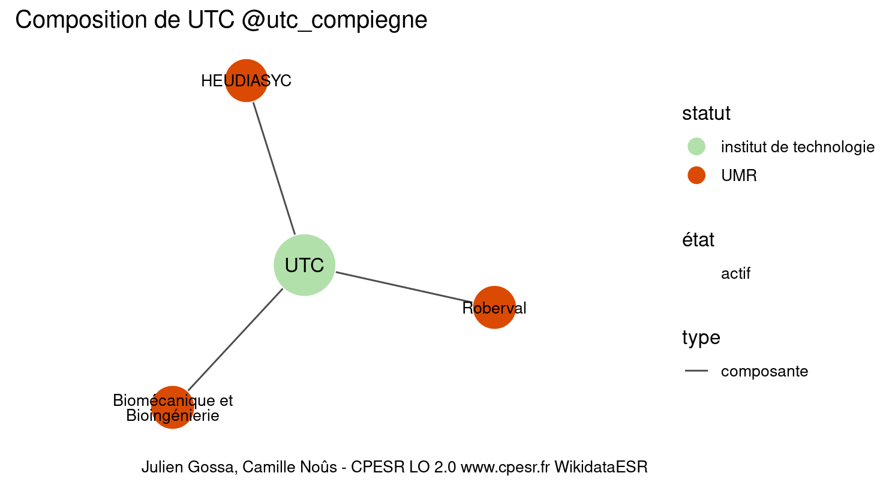 

Avertissements et édition : [logs](plots/etablissements/Q622906.md) 

### UTC @utc_compiegne : Associations.     Edition des données : https://github.com/cpesr/wikidataESR/blob/master/plots/etablissements/Q622906.md 

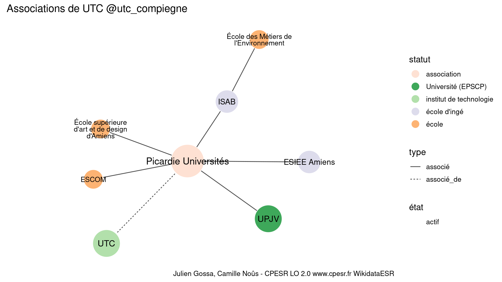 

Avertissements et édition : [logs](plots/etablissements/Q622906.md) 

### UTT @UTTroyes : Histoire.     Edition des données : https://github.com/cpesr/wikidataESR/blob/master/plots/etablissements/Q1037208.md 


Erreur : les données sont probablement trop partielles.
```
Error in wdesr_ggplot_graph(df, node_size = node_size, label_sizes = label_sizes, : Empty ESR graph: something went wrong with the graph production parameters

``` 

Avertissements et édition : [logs](plots/etablissements/Q1037208.md) 

### UTT @UTTroyes : Composition.     Edition des données : https://github.com/cpesr/wikidataESR/blob/master/plots/etablissements/Q1037208.md 

 

Avertissements et édition : [logs](plots/etablissements/Q1037208.md) 

### UTT @UTTroyes : Associations.     Edition des données : https://github.com/cpesr/wikidataESR/blob/master/plots/etablissements/Q1037208.md 

 

Avertissements et édition : [logs](plots/etablissements/Q1037208.md) 

### Vet Agro Sup @VetAgroSup : Histoire.     Edition des données : https://github.com/cpesr/wikidataESR/blob/master/plots/etablissements/Q3151920.md 

 

Avertissements et édition : [logs](plots/etablissements/Q3151920.md) 

### Vet Agro Sup @VetAgroSup : Composition.     Edition des données : https://github.com/cpesr/wikidataESR/blob/master/plots/etablissements/Q3151920.md 

 

Avertissements et édition : [logs](plots/etablissements/Q3151920.md) 

### Vet Agro Sup @VetAgroSup : Associations.     Edition des données : https://github.com/cpesr/wikidataESR/blob/master/plots/etablissements/Q3151920.md 


Erreur : les données sont probablement trop partielles.
```
Error in wdesr_ggplot_graph(df, node_size = node_size, label_sizes = label_sizes, : Empty ESR graph: something went wrong with the graph production parameters

``` 

Avertissements et édition : [logs](plots/etablissements/Q3151920.md) 

### Yncréa Méditerranée NA : Histoire.     Edition des données : https://github.com/cpesr/wikidataESR/blob/master/plots/etablissements/Q51652036.md 


Erreur : les données sont probablement trop partielles.
```
Error in wdesr_ggplot_graph(df, node_size = node_size, label_sizes = label_sizes, : Empty ESR graph: something went wrong with the graph production parameters

``` 

Avertissements et édition : [logs](plots/etablissements/Q51652036.md) 

### Yncréa Méditerranée NA : Composition.     Edition des données : https://github.com/cpesr/wikidataESR/blob/master/plots/etablissements/Q51652036.md 


Erreur : les données sont probablement trop partielles.
```
Error in wdesr_ggplot_graph(df, node_size = node_size, label_sizes = label_sizes, : Empty ESR graph: something went wrong with the graph production parameters

``` 

Avertissements et édition : [logs](plots/etablissements/Q51652036.md) 

### Yncréa Méditerranée NA : Associations.     Edition des données : https://github.com/cpesr/wikidataESR/blob/master/plots/etablissements/Q51652036.md 

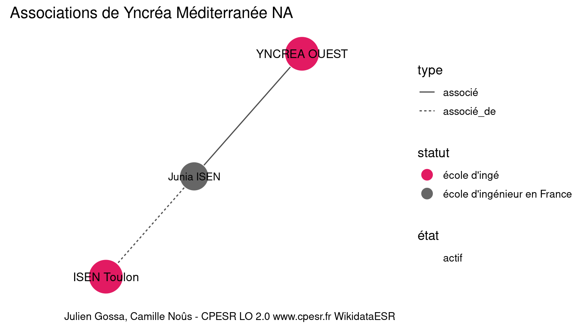 

Avertissements et édition : [logs](plots/etablissements/Q51652036.md) 

## Histoire, composition et association actuelles des Instituts d'études politiques 

Twitters manquants :
```
 - 
``` 

### IEP de Lille @ScPoLille : Histoire.     Edition des données : https://github.com/cpesr/wikidataESR/blob/master/plots/etablissements/Q3151958.md 


Erreur : les données sont probablement trop partielles.
```
Error in wdesr_ggplot_graph(df, node_size = node_size, label_sizes = label_sizes, : Empty ESR graph: something went wrong with the graph production parameters

``` 

Avertissements et édition : [logs](plots/etablissements/Q3151958.md) 

### IEP de Lille @ScPoLille : Composition.     Edition des données : https://github.com/cpesr/wikidataESR/blob/master/plots/etablissements/Q3151958.md 


Erreur : les données sont probablement trop partielles.
```
Error in wdesr_ggplot_graph(df, node_size = node_size, label_sizes = label_sizes, : Empty ESR graph: something went wrong with the graph production parameters

``` 

Avertissements et édition : [logs](plots/etablissements/Q3151958.md) 

### IEP de Lille @ScPoLille : Associations.     Edition des données : https://github.com/cpesr/wikidataESR/blob/master/plots/etablissements/Q3151958.md 

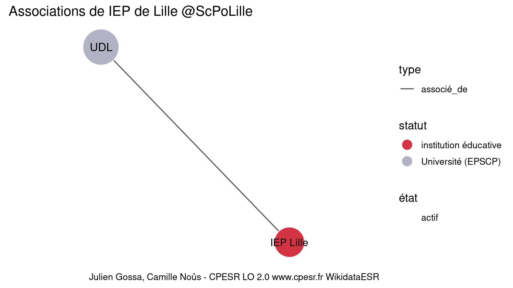 

Avertissements et édition : [logs](plots/etablissements/Q3151958.md) 

### IEP de Paris @sciencespo : Histoire.     Edition des données : https://github.com/cpesr/wikidataESR/blob/master/plots/etablissements/Q859363.md 

 

Avertissements et édition : [logs](plots/etablissements/Q859363.md) 

### IEP de Paris @sciencespo : Composition.     Edition des données : https://github.com/cpesr/wikidataESR/blob/master/plots/etablissements/Q859363.md 

 

Avertissements et édition : [logs](plots/etablissements/Q859363.md) 

### IEP de Paris @sciencespo : Associations.     Edition des données : https://github.com/cpesr/wikidataESR/blob/master/plots/etablissements/Q859363.md 

 

Avertissements et édition : [logs](plots/etablissements/Q859363.md) 

### IEP d'Aix-en-Provence @Sciences_Po_Aix : Histoire.     Edition des données : https://github.com/cpesr/wikidataESR/blob/master/plots/etablissements/Q1139065.md 


Erreur : les données sont probablement trop partielles.
```
Error in wdesr_ggplot_graph(df, node_size = node_size, label_sizes = label_sizes, : Empty ESR graph: something went wrong with the graph production parameters

``` 

Avertissements et édition : [logs](plots/etablissements/Q1139065.md) 

### IEP d'Aix-en-Provence @Sciences_Po_Aix : Composition.     Edition des données : https://github.com/cpesr/wikidataESR/blob/master/plots/etablissements/Q1139065.md 

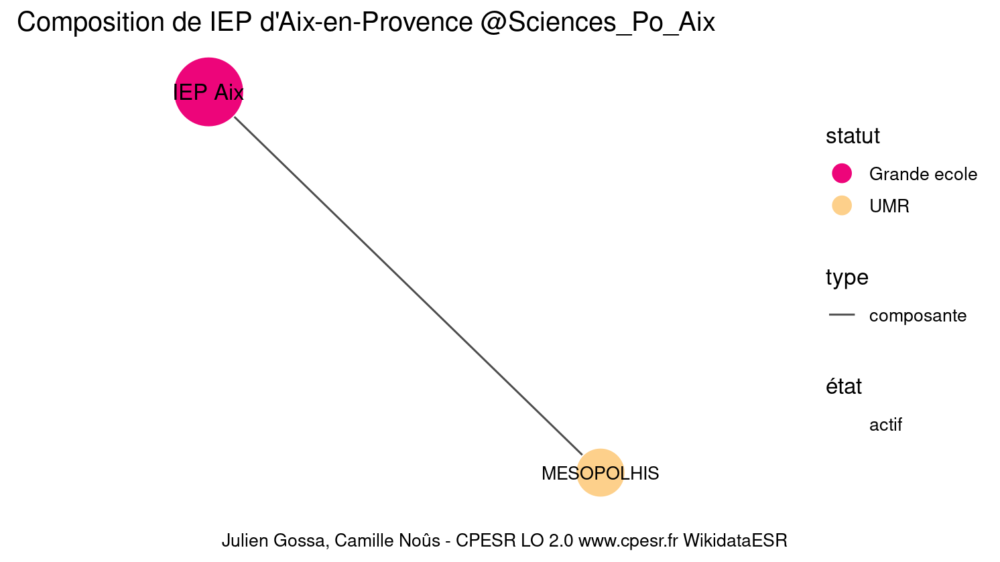 

Avertissements et édition : [logs](plots/etablissements/Q1139065.md) 

### IEP d'Aix-en-Provence @Sciences_Po_Aix : Associations.     Edition des données : https://github.com/cpesr/wikidataESR/blob/master/plots/etablissements/Q1139065.md 


Erreur : les données sont probablement trop partielles.
```
Error in wdesr_ggplot_graph(df, node_size = node_size, label_sizes = label_sizes, : Empty ESR graph: something went wrong with the graph production parameters

``` 

Avertissements et édition : [logs](plots/etablissements/Q1139065.md) 

### IEP Bordeaux @ScPoBx : Histoire.     Edition des données : https://github.com/cpesr/wikidataESR/blob/master/plots/etablissements/Q1252062.md 


Erreur : les données sont probablement trop partielles.
```
Error in wdesr_ggplot_graph(df, node_size = node_size, label_sizes = label_sizes, : Empty ESR graph: something went wrong with the graph production parameters

``` 

Avertissements et édition : [logs](plots/etablissements/Q1252062.md) 

### IEP Bordeaux @ScPoBx : Composition.     Edition des données : https://github.com/cpesr/wikidataESR/blob/master/plots/etablissements/Q1252062.md 

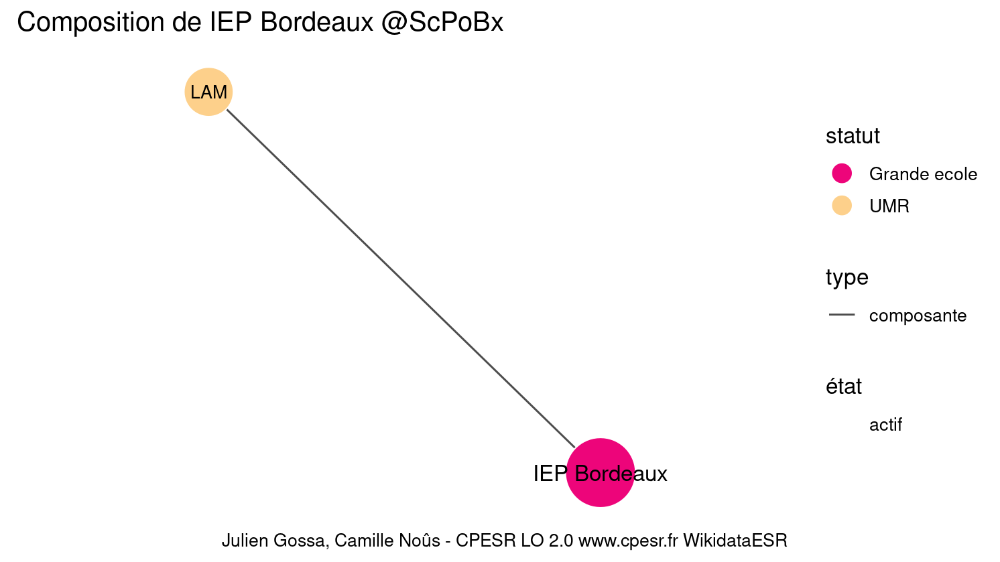 

Avertissements et édition : [logs](plots/etablissements/Q1252062.md) 

### IEP Bordeaux @ScPoBx : Associations.     Edition des données : https://github.com/cpesr/wikidataESR/blob/master/plots/etablissements/Q1252062.md 


Erreur : les données sont probablement trop partielles.
```
Error in wdesr_ggplot_graph(df, node_size = node_size, label_sizes = label_sizes, : Empty ESR graph: something went wrong with the graph production parameters

``` 

Avertissements et édition : [logs](plots/etablissements/Q1252062.md) 

### IEP de Lyon @scpolyon : Histoire.     Edition des données : https://github.com/cpesr/wikidataESR/blob/master/plots/etablissements/Q2253344.md 


Erreur : les données sont probablement trop partielles.
```
Error in wdesr_ggplot_graph(df, node_size = node_size, label_sizes = label_sizes, : Empty ESR graph: something went wrong with the graph production parameters

``` 

Avertissements et édition : [logs](plots/etablissements/Q2253344.md) 

### IEP de Lyon @scpolyon : Composition.     Edition des données : https://github.com/cpesr/wikidataESR/blob/master/plots/etablissements/Q2253344.md 

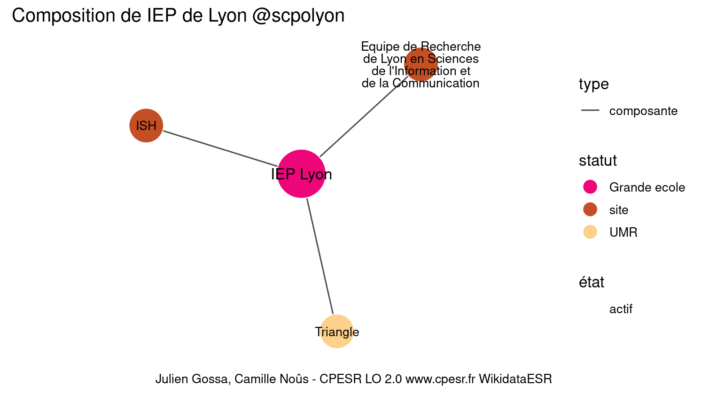 

Avertissements et édition : [logs](plots/etablissements/Q2253344.md) 

### IEP de Lyon @scpolyon : Associations.     Edition des données : https://github.com/cpesr/wikidataESR/blob/master/plots/etablissements/Q2253344.md 

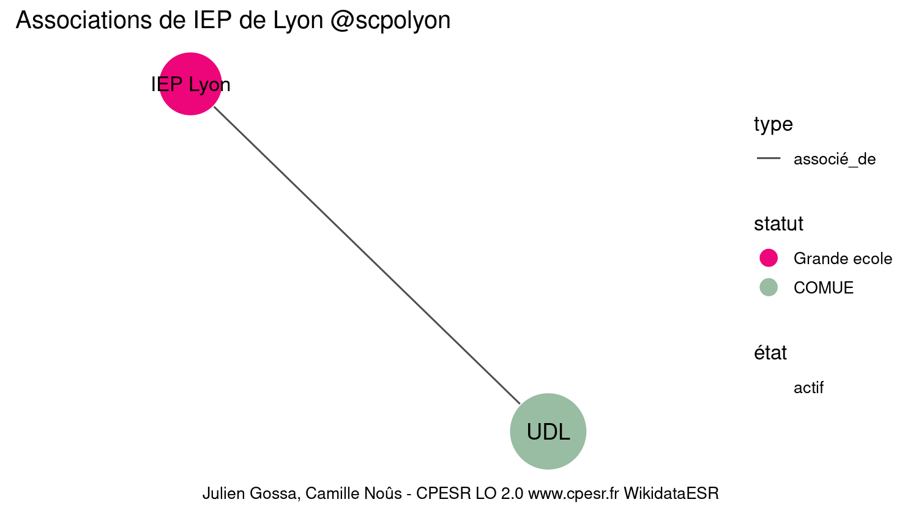 

Avertissements et édition : [logs](plots/etablissements/Q2253344.md) 

### IEP de Rennes @Sc_Po_Rennes : Histoire.     Edition des données : https://github.com/cpesr/wikidataESR/blob/master/plots/etablissements/Q3151965.md 


Erreur : les données sont probablement trop partielles.
```
Error in wdesr_ggplot_graph(df, node_size = node_size, label_sizes = label_sizes, : Empty ESR graph: something went wrong with the graph production parameters

``` 

Avertissements et édition : [logs](plots/etablissements/Q3151965.md) 

### IEP de Rennes @Sc_Po_Rennes : Composition.     Edition des données : https://github.com/cpesr/wikidataESR/blob/master/plots/etablissements/Q3151965.md 


Erreur : les données sont probablement trop partielles.
```
Error in wdesr_ggplot_graph(df, node_size = node_size, label_sizes = label_sizes, : Empty ESR graph: something went wrong with the graph production parameters

``` 

Avertissements et édition : [logs](plots/etablissements/Q3151965.md) 

### IEP de Rennes @Sc_Po_Rennes : Associations.     Edition des données : https://github.com/cpesr/wikidataESR/blob/master/plots/etablissements/Q3151965.md 


Erreur : les données sont probablement trop partielles.
```
Error in wdesr_ggplot_graph(df, node_size = node_size, label_sizes = label_sizes, : Empty ESR graph: something went wrong with the graph production parameters

``` 

Avertissements et édition : [logs](plots/etablissements/Q3151965.md) 

### IEP de Toulouse @SciencesPo_Tlse : Histoire.     Edition des données : https://github.com/cpesr/wikidataESR/blob/master/plots/etablissements/Q1664755.md 


Erreur : les données sont probablement trop partielles.
```
Error in wdesr_ggplot_graph(df, node_size = node_size, label_sizes = label_sizes, : Empty ESR graph: something went wrong with the graph production parameters

``` 

Avertissements et édition : [logs](plots/etablissements/Q1664755.md) 

### IEP de Toulouse @SciencesPo_Tlse : Composition.     Edition des données : https://github.com/cpesr/wikidataESR/blob/master/plots/etablissements/Q1664755.md 

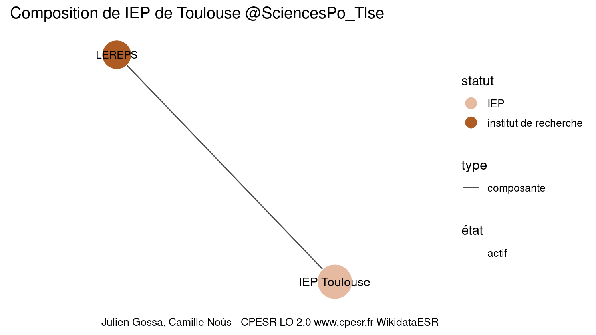 

Avertissements et édition : [logs](plots/etablissements/Q1664755.md) 

### IEP de Toulouse @SciencesPo_Tlse : Associations.     Edition des données : https://github.com/cpesr/wikidataESR/blob/master/plots/etablissements/Q1664755.md 


Erreur : les données sont probablement trop partielles.
```
Error in wdesr_ggplot_graph(df, node_size = node_size, label_sizes = label_sizes, : Empty ESR graph: something went wrong with the graph production parameters

``` 

Avertissements et édition : [logs](plots/etablissements/Q1664755.md) 

## Regroupements 

### Association Université de Lorraine : Histoire.     Edition des données : https://github.com/cpesr/wikidataESR/blob/master/plots/regroupements/Q61718100.md 


Erreur : les données sont probablement trop partielles.
```
Error in wdesr_ggplot_graph(df, node_size = node_size, label_sizes = label_sizes, : Empty ESR graph: something went wrong with the graph production parameters

``` 

Avertissements et édition : [logs](plots/regroupements/Q61718100.md) 

### Association Université de Lorraine : Regroupement Court.     Edition des données : https://github.com/cpesr/wikidataESR/blob/master/plots/regroupements/Q61718100.md 

 

Avertissements et édition : [logs](plots/regroupements/Q61718100.md) 

### Association Université de Lorraine : Regroupement Etendu.     Edition des données : https://github.com/cpesr/wikidataESR/blob/master/plots/regroupements/Q61718100.md 

 

Avertissements et édition : [logs](plots/regroupements/Q61718100.md) 

### Association Université de Lorraine : Regroupement Superetendu.     Edition des données : https://github.com/cpesr/wikidataESR/blob/master/plots/regroupements/Q61718100.md 

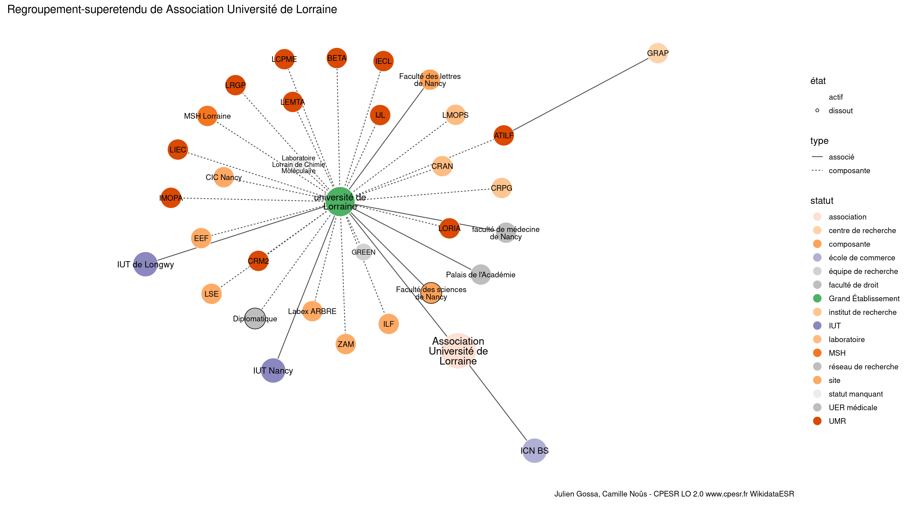 

Avertissements et édition : [logs](plots/regroupements/Q61718100.md) 

### Picardie Universités : Histoire.     Edition des données : https://github.com/cpesr/wikidataESR/blob/master/plots/regroupements/Q61716197.md 


Erreur : les données sont probablement trop partielles.
```
Error in wdesr_ggplot_graph(df, node_size = node_size, label_sizes = label_sizes, : Empty ESR graph: something went wrong with the graph production parameters

``` 

Avertissements et édition : [logs](plots/regroupements/Q61716197.md) 

### Picardie Universités : Regroupement Court.     Edition des données : https://github.com/cpesr/wikidataESR/blob/master/plots/regroupements/Q61716197.md 

 

Avertissements et édition : [logs](plots/regroupements/Q61716197.md) 

### Picardie Universités : Regroupement Etendu.     Edition des données : https://github.com/cpesr/wikidataESR/blob/master/plots/regroupements/Q61716197.md 

 

Avertissements et édition : [logs](plots/regroupements/Q61716197.md) 

### Picardie Universités : Regroupement Superetendu.     Edition des données : https://github.com/cpesr/wikidataESR/blob/master/plots/regroupements/Q61716197.md 

 

Avertissements et édition : [logs](plots/regroupements/Q61716197.md) 

### Site AMPM : Histoire.     Edition des données : https://github.com/cpesr/wikidataESR/blob/master/plots/regroupements/Q61716142.md 


Erreur : les données sont probablement trop partielles.
```
Error in wdesr_ggplot_graph(df, node_size = node_size, label_sizes = label_sizes, : Empty ESR graph: something went wrong with the graph production parameters

``` 

Avertissements et édition : [logs](plots/regroupements/Q61716142.md) 

### Site AMPM : Regroupement Court.     Edition des données : https://github.com/cpesr/wikidataESR/blob/master/plots/regroupements/Q61716142.md 

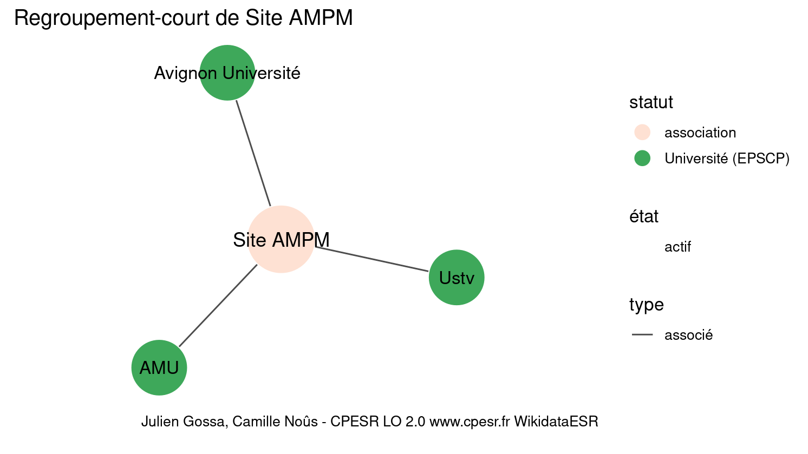 

Avertissements et édition : [logs](plots/regroupements/Q61716142.md) 

### Site AMPM : Regroupement Etendu.     Edition des données : https://github.com/cpesr/wikidataESR/blob/master/plots/regroupements/Q61716142.md 

 

Avertissements et édition : [logs](plots/regroupements/Q61716142.md) 

### Site AMPM : Regroupement Superetendu.     Edition des données : https://github.com/cpesr/wikidataESR/blob/master/plots/regroupements/Q61716142.md 

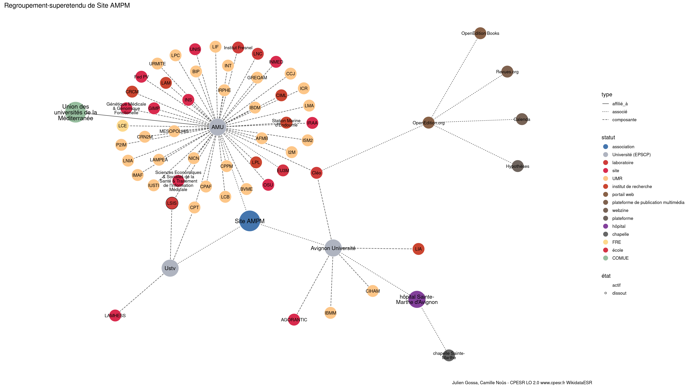 

Avertissements et édition : [logs](plots/regroupements/Q61716142.md) 

### Site champenois : Histoire.     Edition des données : https://github.com/cpesr/wikidataESR/blob/master/plots/regroupements/Q61716216.md 


Erreur : les données sont probablement trop partielles.
```
Error in wdesr_ggplot_graph(df, node_size = node_size, label_sizes = label_sizes, : Empty ESR graph: something went wrong with the graph production parameters

``` 

Avertissements et édition : [logs](plots/regroupements/Q61716216.md) 

### Site champenois : Regroupement Court.     Edition des données : https://github.com/cpesr/wikidataESR/blob/master/plots/regroupements/Q61716216.md 

 

Avertissements et édition : [logs](plots/regroupements/Q61716216.md) 

### Site champenois : Regroupement Etendu.     Edition des données : https://github.com/cpesr/wikidataESR/blob/master/plots/regroupements/Q61716216.md 

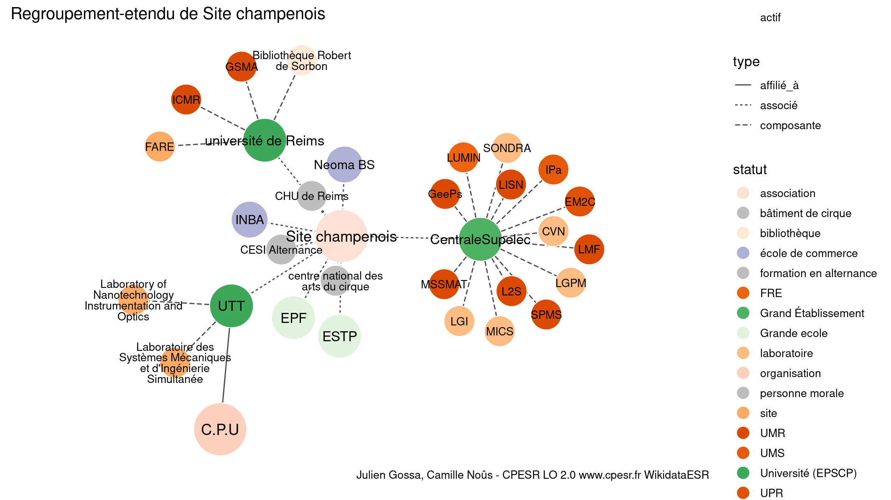 

Avertissements et édition : [logs](plots/regroupements/Q61716216.md) 

### Site champenois : Regroupement Superetendu.     Edition des données : https://github.com/cpesr/wikidataESR/blob/master/plots/regroupements/Q61716216.md 

 

Avertissements et édition : [logs](plots/regroupements/Q61716216.md) 

### Sorbonne Université : Histoire.     Edition des données : https://github.com/cpesr/wikidataESR/blob/master/plots/regroupements/Q61716212.md 


Erreur : les données sont probablement trop partielles.
```
Error in wdesr_ggplot_graph(df, node_size = node_size, label_sizes = label_sizes, : Empty ESR graph: something went wrong with the graph production parameters

``` 

Avertissements et édition : [logs](plots/regroupements/Q61716212.md) 

### Sorbonne Université : Regroupement Court.     Edition des données : https://github.com/cpesr/wikidataESR/blob/master/plots/regroupements/Q61716212.md 

 

Avertissements et édition : [logs](plots/regroupements/Q61716212.md) 

### Sorbonne Université : Regroupement Etendu.     Edition des données : https://github.com/cpesr/wikidataESR/blob/master/plots/regroupements/Q61716212.md 

 

Avertissements et édition : [logs](plots/regroupements/Q61716212.md) 

### Sorbonne Université : Regroupement Superetendu.     Edition des données : https://github.com/cpesr/wikidataESR/blob/master/plots/regroupements/Q61716212.md 

 

Avertissements et édition : [logs](plots/regroupements/Q61716212.md) 

### UCA : Histoire.     Edition des données : https://github.com/cpesr/wikidataESR/blob/master/plots/regroupements/Q61716190.md 


Erreur : les données sont probablement trop partielles.
```
Error in wdesr_ggplot_graph(df, node_size = node_size, label_sizes = label_sizes, : Empty ESR graph: something went wrong with the graph production parameters

``` 

Avertissements et édition : [logs](plots/regroupements/Q61716190.md) 

### UCA : Regroupement Court.     Edition des données : https://github.com/cpesr/wikidataESR/blob/master/plots/regroupements/Q61716190.md 

 

Avertissements et édition : [logs](plots/regroupements/Q61716190.md) 

### UCA : Regroupement Etendu.     Edition des données : https://github.com/cpesr/wikidataESR/blob/master/plots/regroupements/Q61716190.md 

 

Avertissements et édition : [logs](plots/regroupements/Q61716190.md) 

### UCA : Regroupement Superetendu.     Edition des données : https://github.com/cpesr/wikidataESR/blob/master/plots/regroupements/Q61716190.md 

 

Avertissements et édition : [logs](plots/regroupements/Q61716190.md) 

### COMUE Angers-Le Mans : Histoire.     Edition des données : https://github.com/cpesr/wikidataESR/blob/master/plots/regroupements/Q104621964.md 


Erreur : les données sont probablement trop partielles.
```
Error in wdesr_ggplot_graph(df, node_size = node_size, label_sizes = label_sizes, : Empty ESR graph: something went wrong with the graph production parameters

``` 

Avertissements et édition : [logs](plots/regroupements/Q104621964.md) 

### COMUE Angers-Le Mans : Regroupement Court.     Edition des données : https://github.com/cpesr/wikidataESR/blob/master/plots/regroupements/Q104621964.md 


Erreur : les données sont probablement trop partielles.
```
Error in wdesr_ggplot_graph(df, node_size = node_size, label_sizes = label_sizes, : Empty ESR graph: something went wrong with the graph production parameters

``` 

Avertissements et édition : [logs](plots/regroupements/Q104621964.md) 

### COMUE Angers-Le Mans : Regroupement Etendu.     Edition des données : https://github.com/cpesr/wikidataESR/blob/master/plots/regroupements/Q104621964.md 


Erreur : les données sont probablement trop partielles.
```
Error in wdesr_ggplot_graph(df, node_size = node_size, label_sizes = label_sizes, : Empty ESR graph: something went wrong with the graph production parameters

``` 

Avertissements et édition : [logs](plots/regroupements/Q104621964.md) 

### COMUE Angers-Le Mans : Regroupement Superetendu.     Edition des données : https://github.com/cpesr/wikidataESR/blob/master/plots/regroupements/Q104621964.md 


Erreur : les données sont probablement trop partielles.
```
Error in wdesr_ggplot_graph(df, node_size = node_size, label_sizes = label_sizes, : Empty ESR graph: something went wrong with the graph production parameters

``` 

Avertissements et édition : [logs](plots/regroupements/Q104621964.md) 

### COMUE Centre Val de Loire : Histoire.     Edition des données : https://github.com/cpesr/wikidataESR/blob/master/plots/regroupements/Q2944885.md 


Erreur : les données sont probablement trop partielles.
```
Error in wdesr_ggplot_graph(df, node_size = node_size, label_sizes = label_sizes, : Empty ESR graph: something went wrong with the graph production parameters

``` 

Avertissements et édition : [logs](plots/regroupements/Q2944885.md) 

### COMUE Centre Val de Loire : Regroupement Court.     Edition des données : https://github.com/cpesr/wikidataESR/blob/master/plots/regroupements/Q2944885.md 

 

Avertissements et édition : [logs](plots/regroupements/Q2944885.md) 

### COMUE Centre Val de Loire : Regroupement Etendu.     Edition des données : https://github.com/cpesr/wikidataESR/blob/master/plots/regroupements/Q2944885.md 

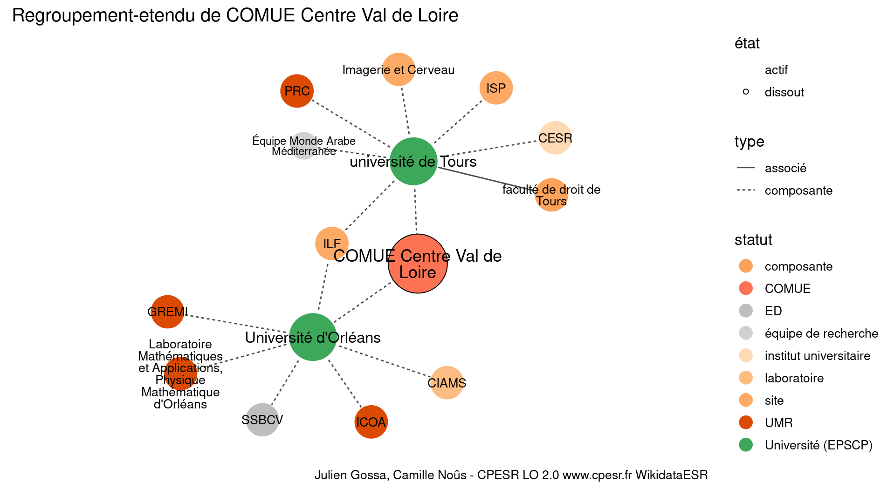 

Avertissements et édition : [logs](plots/regroupements/Q2944885.md) 

### COMUE Centre Val de Loire : Regroupement Superetendu.     Edition des données : https://github.com/cpesr/wikidataESR/blob/master/plots/regroupements/Q2944885.md 

 

Avertissements et édition : [logs](plots/regroupements/Q2944885.md) 

### COMUE de Bourgogne Franche Comté : Histoire.     Edition des données : https://github.com/cpesr/wikidataESR/blob/master/plots/regroupements/Q3359833.md 


Erreur : les données sont probablement trop partielles.
```
Error in wdesr_ggplot_graph(df, node_size = node_size, label_sizes = label_sizes, : Empty ESR graph: something went wrong with the graph production parameters

``` 

Avertissements et édition : [logs](plots/regroupements/Q3359833.md) 

### COMUE de Bourgogne Franche Comté : Regroupement Court.     Edition des données : https://github.com/cpesr/wikidataESR/blob/master/plots/regroupements/Q3359833.md 

 

Avertissements et édition : [logs](plots/regroupements/Q3359833.md) 

### COMUE de Bourgogne Franche Comté : Regroupement Etendu.     Edition des données : https://github.com/cpesr/wikidataESR/blob/master/plots/regroupements/Q3359833.md 

 

Avertissements et édition : [logs](plots/regroupements/Q3359833.md) 

### COMUE de Bourgogne Franche Comté : Regroupement Superetendu.     Edition des données : https://github.com/cpesr/wikidataESR/blob/master/plots/regroupements/Q3359833.md 

 

Avertissements et édition : [logs](plots/regroupements/Q3359833.md) 

### COMUE de Toulouse : Histoire.     Edition des données : https://github.com/cpesr/wikidataESR/blob/master/plots/regroupements/Q20669873.md 


Erreur : les données sont probablement trop partielles.
```
Error in wdesr_ggplot_graph(df, node_size = node_size, label_sizes = label_sizes, : Empty ESR graph: something went wrong with the graph production parameters

``` 

Avertissements et édition : [logs](plots/regroupements/Q20669873.md) 

### COMUE de Toulouse : Regroupement Court.     Edition des données : https://github.com/cpesr/wikidataESR/blob/master/plots/regroupements/Q20669873.md 

 

Avertissements et édition : [logs](plots/regroupements/Q20669873.md) 

### COMUE de Toulouse : Regroupement Etendu.     Edition des données : https://github.com/cpesr/wikidataESR/blob/master/plots/regroupements/Q20669873.md 

 

Avertissements et édition : [logs](plots/regroupements/Q20669873.md) 

### COMUE de Toulouse : Regroupement Superetendu.     Edition des données : https://github.com/cpesr/wikidataESR/blob/master/plots/regroupements/Q20669873.md 


Erreur : les données sont probablement trop partielles.
```
Error in query(url, "pcontent", clean_response, query_param = query_param, : The API returned an error: missingtitle - The page you specified doesn't exist.

``` 

Avertissements et édition : [logs](plots/regroupements/Q20669873.md) 

### COMUE UCA : Histoire.     Edition des données : https://github.com/cpesr/wikidataESR/blob/master/plots/regroupements/Q19370961.md 

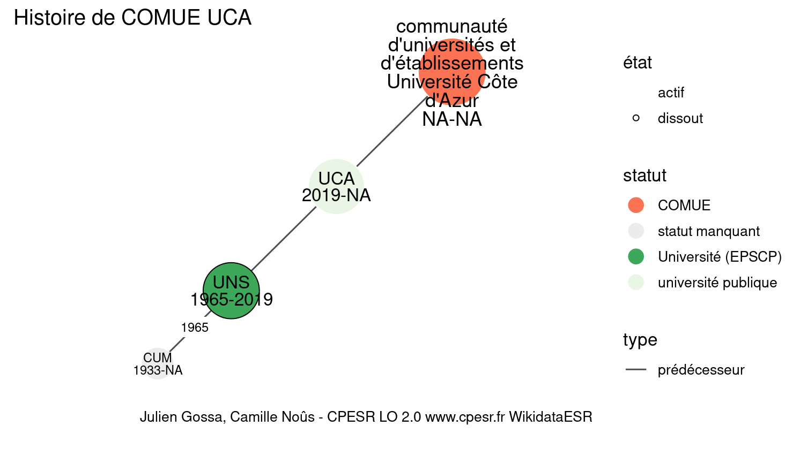 

Avertissements et édition : [logs](plots/regroupements/Q19370961.md) 

### COMUE UCA : Regroupement Court.     Edition des données : https://github.com/cpesr/wikidataESR/blob/master/plots/regroupements/Q19370961.md 

 

Avertissements et édition : [logs](plots/regroupements/Q19370961.md) 

### COMUE UCA : Regroupement Etendu.     Edition des données : https://github.com/cpesr/wikidataESR/blob/master/plots/regroupements/Q19370961.md 

 

Avertissements et édition : [logs](plots/regroupements/Q19370961.md) 

### COMUE UCA : Regroupement Superetendu.     Edition des données : https://github.com/cpesr/wikidataESR/blob/master/plots/regroupements/Q19370961.md 

 

Avertissements et édition : [logs](plots/regroupements/Q19370961.md) 

### COMUE UGA : Histoire.     Edition des données : https://github.com/cpesr/wikidataESR/blob/master/plots/regroupements/Q3551589.md 

 

Avertissements et édition : [logs](plots/regroupements/Q3551589.md) 

### COMUE UGA : Regroupement Court.     Edition des données : https://github.com/cpesr/wikidataESR/blob/master/plots/regroupements/Q3551589.md 

 

Avertissements et édition : [logs](plots/regroupements/Q3551589.md) 

### COMUE UGA : Regroupement Etendu.     Edition des données : https://github.com/cpesr/wikidataESR/blob/master/plots/regroupements/Q3551589.md 

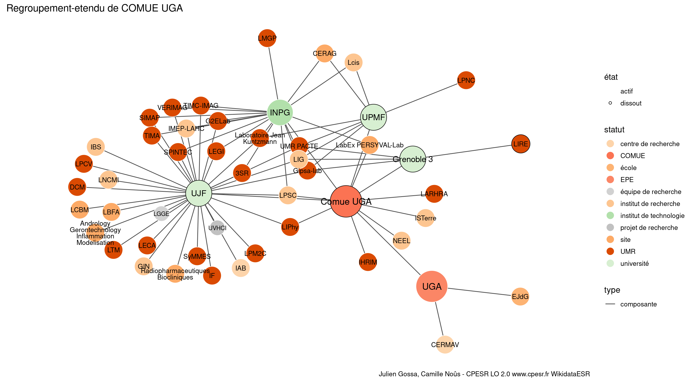 

Avertissements et édition : [logs](plots/regroupements/Q3551589.md) 

### COMUE UGA : Regroupement Superetendu.     Edition des données : https://github.com/cpesr/wikidataESR/blob/master/plots/regroupements/Q3551589.md 

 

Avertissements et édition : [logs](plots/regroupements/Q3551589.md) 

### COMUE Université Paris-Saclay : Histoire.     Edition des données : https://github.com/cpesr/wikidataESR/blob/master/plots/regroupements/Q13531686.md 

 

Avertissements et édition : [logs](plots/regroupements/Q13531686.md) 

### COMUE Université Paris-Saclay : Regroupement Court.     Edition des données : https://github.com/cpesr/wikidataESR/blob/master/plots/regroupements/Q13531686.md 

 

Avertissements et édition : [logs](plots/regroupements/Q13531686.md) 

### COMUE Université Paris-Saclay : Regroupement Etendu.     Edition des données : https://github.com/cpesr/wikidataESR/blob/master/plots/regroupements/Q13531686.md 

 

Avertissements et édition : [logs](plots/regroupements/Q13531686.md) 

### COMUE Université Paris-Saclay : Regroupement Superetendu.     Edition des données : https://github.com/cpesr/wikidataESR/blob/master/plots/regroupements/Q13531686.md 


Erreur : les données sont probablement trop partielles.
```
Error in query(url, "pcontent", clean_response, query_param = query_param, : The API returned an error: missingtitle - The page you specified doesn't exist.

``` 

Avertissements et édition : [logs](plots/regroupements/Q13531686.md) 

### HESAM : Histoire.     Edition des données : https://github.com/cpesr/wikidataESR/blob/master/plots/regroupements/Q3128622.md 

 

Avertissements et édition : [logs](plots/regroupements/Q3128622.md) 

### HESAM : Regroupement Court.     Edition des données : https://github.com/cpesr/wikidataESR/blob/master/plots/regroupements/Q3128622.md 

 

Avertissements et édition : [logs](plots/regroupements/Q3128622.md) 

### HESAM : Regroupement Etendu.     Edition des données : https://github.com/cpesr/wikidataESR/blob/master/plots/regroupements/Q3128622.md 

 

Avertissements et édition : [logs](plots/regroupements/Q3128622.md) 

### HESAM : Regroupement Superetendu.     Edition des données : https://github.com/cpesr/wikidataESR/blob/master/plots/regroupements/Q3128622.md 

 

Avertissements et édition : [logs](plots/regroupements/Q3128622.md) 

### Languedoc Roussillon Universités : Histoire.     Edition des données : https://github.com/cpesr/wikidataESR/blob/master/plots/regroupements/Q2476558.md 


Erreur : les données sont probablement trop partielles.
```
Error in wdesr_ggplot_graph(df, node_size = node_size, label_sizes = label_sizes, : Empty ESR graph: something went wrong with the graph production parameters

``` 

Avertissements et édition : [logs](plots/regroupements/Q2476558.md) 

### Languedoc Roussillon Universités : Regroupement Court.     Edition des données : https://github.com/cpesr/wikidataESR/blob/master/plots/regroupements/Q2476558.md 

 

Avertissements et édition : [logs](plots/regroupements/Q2476558.md) 

### Languedoc Roussillon Universités : Regroupement Etendu.     Edition des données : https://github.com/cpesr/wikidataESR/blob/master/plots/regroupements/Q2476558.md 

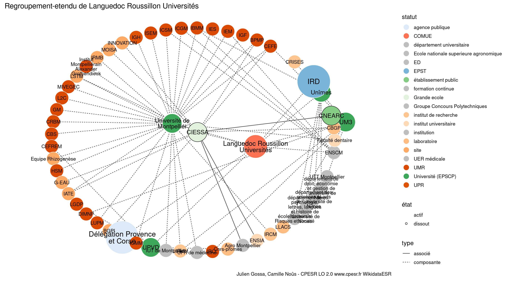 

Avertissements et édition : [logs](plots/regroupements/Q2476558.md) 

### Languedoc Roussillon Universités : Regroupement Superetendu.     Edition des données : https://github.com/cpesr/wikidataESR/blob/master/plots/regroupements/Q2476558.md 

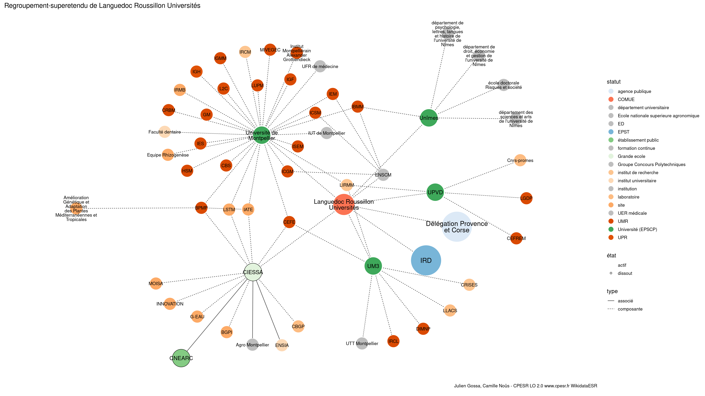 

Avertissements et édition : [logs](plots/regroupements/Q2476558.md) 

### Normandie Université : Histoire.     Edition des données : https://github.com/cpesr/wikidataESR/blob/master/plots/regroupements/Q3343880.md 

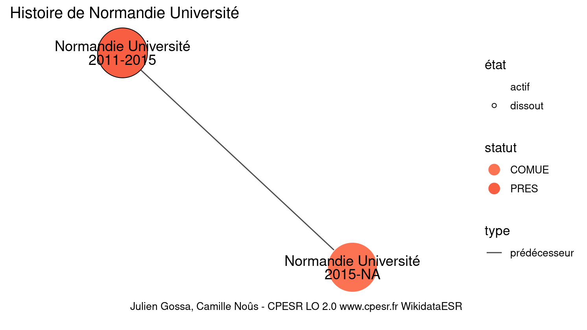 

Avertissements et édition : [logs](plots/regroupements/Q3343880.md) 

### Normandie Université : Regroupement Court.     Edition des données : https://github.com/cpesr/wikidataESR/blob/master/plots/regroupements/Q3343880.md 

 

Avertissements et édition : [logs](plots/regroupements/Q3343880.md) 

### Normandie Université : Regroupement Etendu.     Edition des données : https://github.com/cpesr/wikidataESR/blob/master/plots/regroupements/Q3343880.md 

 

Avertissements et édition : [logs](plots/regroupements/Q3343880.md) 

### Normandie Université : Regroupement Superetendu.     Edition des données : https://github.com/cpesr/wikidataESR/blob/master/plots/regroupements/Q3343880.md 

 

Avertissements et édition : [logs](plots/regroupements/Q3343880.md) 

### Sorbonne Paris Cité : Histoire.     Edition des données : https://github.com/cpesr/wikidataESR/blob/master/plots/regroupements/Q3491149.md 

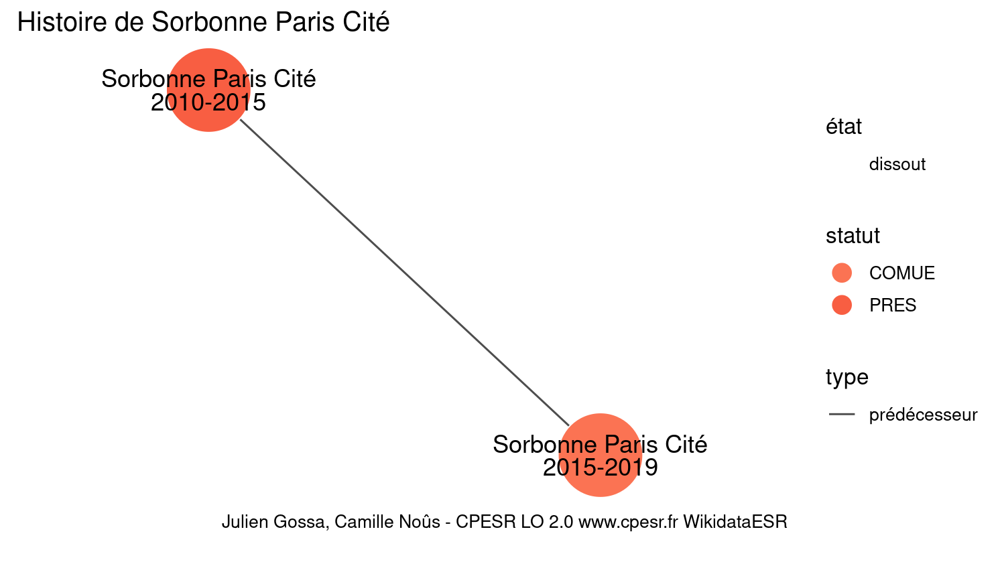 

Avertissements et édition : [logs](plots/regroupements/Q3491149.md) 

### Sorbonne Paris Cité : Regroupement Court.     Edition des données : https://github.com/cpesr/wikidataESR/blob/master/plots/regroupements/Q3491149.md 

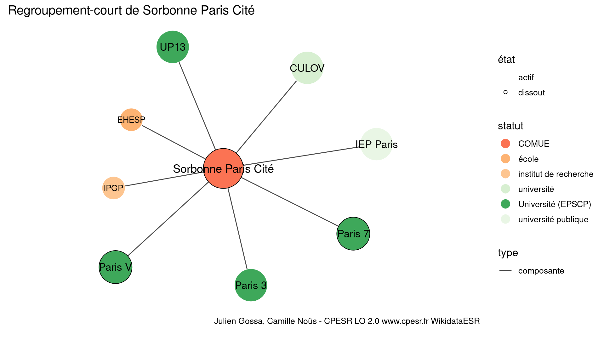 

Avertissements et édition : [logs](plots/regroupements/Q3491149.md) 

### Sorbonne Paris Cité : Regroupement Etendu.     Edition des données : https://github.com/cpesr/wikidataESR/blob/master/plots/regroupements/Q3491149.md 

 

Avertissements et édition : [logs](plots/regroupements/Q3491149.md) 

### Sorbonne Paris Cité : Regroupement Superetendu.     Edition des données : https://github.com/cpesr/wikidataESR/blob/master/plots/regroupements/Q3491149.md 

 

Avertissements et édition : [logs](plots/regroupements/Q3491149.md) 

### Sorbonne Universités : Histoire.     Edition des données : https://github.com/cpesr/wikidataESR/blob/master/plots/regroupements/Q3491150.md 


Erreur : les données sont probablement trop partielles.
```
Error in wdesr_ggplot_graph(df, node_size = node_size, label_sizes = label_sizes, : Empty ESR graph: something went wrong with the graph production parameters

``` 

Avertissements et édition : [logs](plots/regroupements/Q3491150.md) 

### Sorbonne Universités : Regroupement Court.     Edition des données : https://github.com/cpesr/wikidataESR/blob/master/plots/regroupements/Q3491150.md 

 

Avertissements et édition : [logs](plots/regroupements/Q3491150.md) 

### Sorbonne Universités : Regroupement Etendu.     Edition des données : https://github.com/cpesr/wikidataESR/blob/master/plots/regroupements/Q3491150.md 

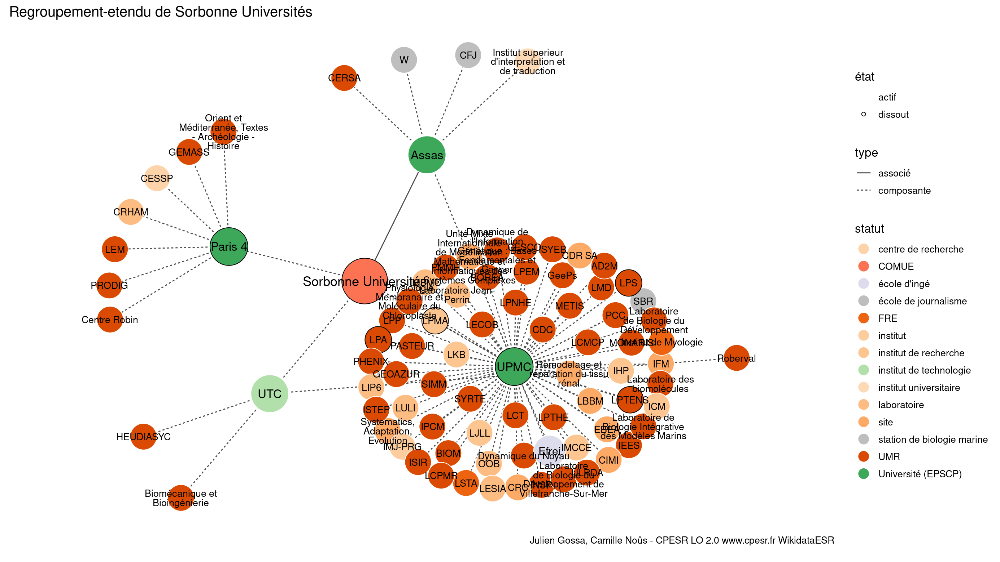 

Avertissements et édition : [logs](plots/regroupements/Q3491150.md) 

### Sorbonne Universités : Regroupement Superetendu.     Edition des données : https://github.com/cpesr/wikidataESR/blob/master/plots/regroupements/Q3491150.md 


Erreur : les données sont probablement trop partielles.
```
Error in query(url, "pcontent", clean_response, query_param = query_param, : The API returned an error: missingtitle - The page you specified doesn't exist.

``` 

Avertissements et édition : [logs](plots/regroupements/Q3491150.md) 

### UBL : Histoire.     Edition des données : https://github.com/cpesr/wikidataESR/blob/master/plots/regroupements/Q21994834.md 

 

Avertissements et édition : [logs](plots/regroupements/Q21994834.md) 

### UBL : Regroupement Court.     Edition des données : https://github.com/cpesr/wikidataESR/blob/master/plots/regroupements/Q21994834.md 

 

Avertissements et édition : [logs](plots/regroupements/Q21994834.md) 

### UBL : Regroupement Etendu.     Edition des données : https://github.com/cpesr/wikidataESR/blob/master/plots/regroupements/Q21994834.md 

 

Avertissements et édition : [logs](plots/regroupements/Q21994834.md) 

### UBL : Regroupement Superetendu.     Edition des données : https://github.com/cpesr/wikidataESR/blob/master/plots/regroupements/Q21994834.md 

 

Avertissements et édition : [logs](plots/regroupements/Q21994834.md) 

### UDL : Histoire.     Edition des données : https://github.com/cpesr/wikidataESR/blob/master/plots/regroupements/Q10176.md 

 

Avertissements et édition : [logs](plots/regroupements/Q10176.md) 

### UDL : Regroupement Court.     Edition des données : https://github.com/cpesr/wikidataESR/blob/master/plots/regroupements/Q10176.md 

 

Avertissements et édition : [logs](plots/regroupements/Q10176.md) 

### UDL : Regroupement Etendu.     Edition des données : https://github.com/cpesr/wikidataESR/blob/master/plots/regroupements/Q10176.md 

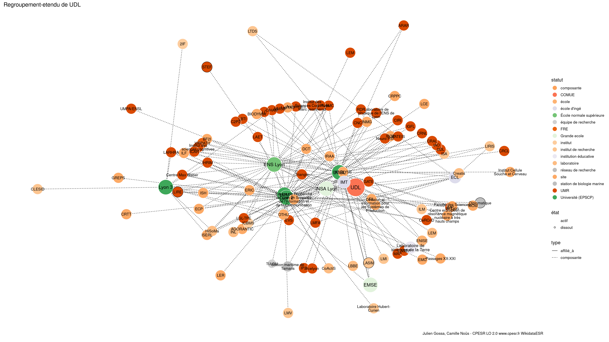 

Avertissements et édition : [logs](plots/regroupements/Q10176.md) 

### UDL : Regroupement Superetendu.     Edition des données : https://github.com/cpesr/wikidataESR/blob/master/plots/regroupements/Q10176.md 


Erreur : les données sont probablement trop partielles.
```
Error in query(url, "pcontent", clean_response, query_param = query_param, : The API returned an error: missingtitle - The page you specified doesn't exist.

``` 

Avertissements et édition : [logs](plots/regroupements/Q10176.md) 

### Union des universités de la Méditerranée : Histoire.     Edition des données : https://github.com/cpesr/wikidataESR/blob/master/plots/regroupements/Q850927.md 


Erreur : les données sont probablement trop partielles.
```
Error in wdesr_ggplot_graph(df, node_size = node_size, label_sizes = label_sizes, : Empty ESR graph: something went wrong with the graph production parameters

``` 

Avertissements et édition : [logs](plots/regroupements/Q850927.md) 

### Union des universités de la Méditerranée : Regroupement Court.     Edition des données : https://github.com/cpesr/wikidataESR/blob/master/plots/regroupements/Q850927.md 


Erreur : les données sont probablement trop partielles.
```
Error in wdesr_ggplot_graph(df, node_size = node_size, label_sizes = label_sizes, : Empty ESR graph: something went wrong with the graph production parameters

``` 

Avertissements et édition : [logs](plots/regroupements/Q850927.md) 

### Union des universités de la Méditerranée : Regroupement Etendu.     Edition des données : https://github.com/cpesr/wikidataESR/blob/master/plots/regroupements/Q850927.md 


Erreur : les données sont probablement trop partielles.
```
Error in wdesr_ggplot_graph(df, node_size = node_size, label_sizes = label_sizes, : Empty ESR graph: something went wrong with the graph production parameters

``` 

Avertissements et édition : [logs](plots/regroupements/Q850927.md) 

### Union des universités de la Méditerranée : Regroupement Superetendu.     Edition des données : https://github.com/cpesr/wikidataESR/blob/master/plots/regroupements/Q850927.md 


Erreur : les données sont probablement trop partielles.
```
Error in wdesr_ggplot_graph(df, node_size = node_size, label_sizes = label_sizes, : Empty ESR graph: something went wrong with the graph production parameters

``` 

Avertissements et édition : [logs](plots/regroupements/Q850927.md) 

### Université confédérale Léonard-de-Vinci : Histoire.     Edition des données : https://github.com/cpesr/wikidataESR/blob/master/plots/regroupements/Q20735682.md 


Erreur : les données sont probablement trop partielles.
```
Error in wdesr_ggplot_graph(df, node_size = node_size, label_sizes = label_sizes, : Empty ESR graph: something went wrong with the graph production parameters

``` 

Avertissements et édition : [logs](plots/regroupements/Q20735682.md) 

### Université confédérale Léonard-de-Vinci : Regroupement Court.     Edition des données : https://github.com/cpesr/wikidataESR/blob/master/plots/regroupements/Q20735682.md 

 

Avertissements et édition : [logs](plots/regroupements/Q20735682.md) 

### Université confédérale Léonard-de-Vinci : Regroupement Etendu.     Edition des données : https://github.com/cpesr/wikidataESR/blob/master/plots/regroupements/Q20735682.md 

 

Avertissements et édition : [logs](plots/regroupements/Q20735682.md) 

### Université confédérale Léonard-de-Vinci : Regroupement Superetendu.     Edition des données : https://github.com/cpesr/wikidataESR/blob/master/plots/regroupements/Q20735682.md 

 

Avertissements et édition : [logs](plots/regroupements/Q20735682.md) 

### Université de Lille : Histoire.     Edition des données : https://github.com/cpesr/wikidataESR/blob/master/plots/regroupements/Q1322289.md 


Erreur : les données sont probablement trop partielles.
```
Error in wdesr_ggplot_graph(df, node_size = node_size, label_sizes = label_sizes, : Empty ESR graph: something went wrong with the graph production parameters

``` 

Avertissements et édition : [logs](plots/regroupements/Q1322289.md) 

### Université de Lille : Regroupement Court.     Edition des données : https://github.com/cpesr/wikidataESR/blob/master/plots/regroupements/Q1322289.md 

 

Avertissements et édition : [logs](plots/regroupements/Q1322289.md) 

### Université de Lille : Regroupement Etendu.     Edition des données : https://github.com/cpesr/wikidataESR/blob/master/plots/regroupements/Q1322289.md 

 

Avertissements et édition : [logs](plots/regroupements/Q1322289.md) 

### Université de Lille : Regroupement Superetendu.     Edition des données : https://github.com/cpesr/wikidataESR/blob/master/plots/regroupements/Q1322289.md 

 

Avertissements et édition : [logs](plots/regroupements/Q1322289.md) 

### université Paris Lumières : Histoire.     Edition des données : https://github.com/cpesr/wikidataESR/blob/master/plots/regroupements/Q3551474.md 

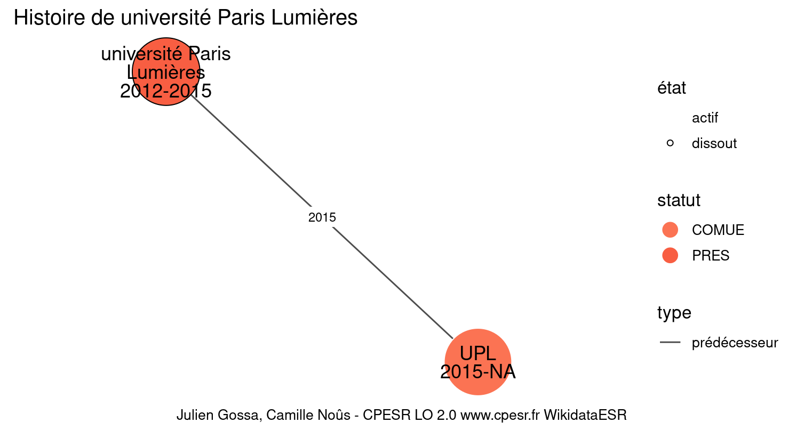 

Avertissements et édition : [logs](plots/regroupements/Q3551474.md) 

### université Paris Lumières : Regroupement Court.     Edition des données : https://github.com/cpesr/wikidataESR/blob/master/plots/regroupements/Q3551474.md 

 

Avertissements et édition : [logs](plots/regroupements/Q3551474.md) 

### université Paris Lumières : Regroupement Etendu.     Edition des données : https://github.com/cpesr/wikidataESR/blob/master/plots/regroupements/Q3551474.md 

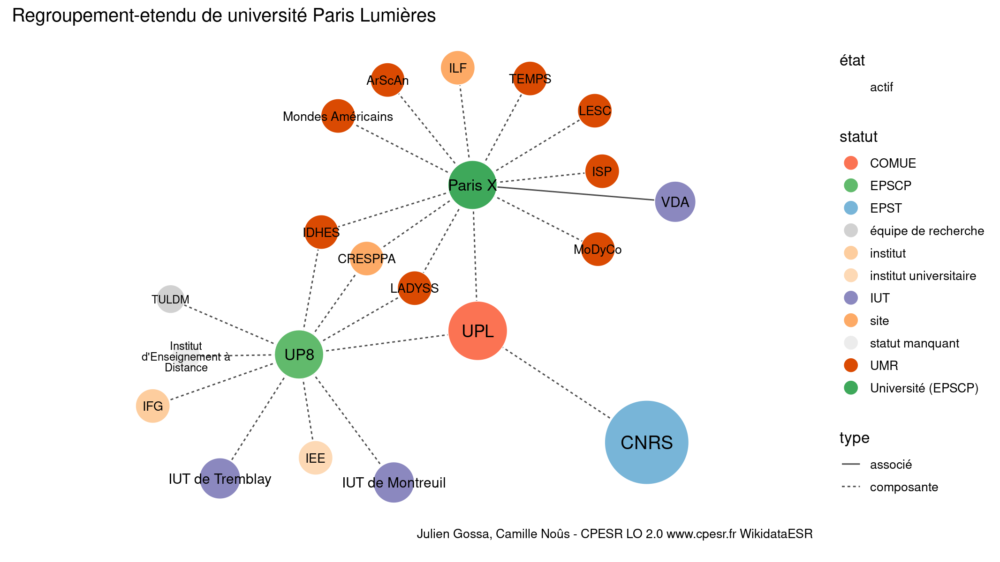 

Avertissements et édition : [logs](plots/regroupements/Q3551474.md) 

### université Paris Lumières : Regroupement Superetendu.     Edition des données : https://github.com/cpesr/wikidataESR/blob/master/plots/regroupements/Q3551474.md 

 

Avertissements et édition : [logs](plots/regroupements/Q3551474.md) 

### Université Paris-Est : Histoire.     Edition des données : https://github.com/cpesr/wikidataESR/blob/master/plots/regroupements/Q3551472.md 

 

Avertissements et édition : [logs](plots/regroupements/Q3551472.md) 

### Université Paris-Est : Regroupement Court.     Edition des données : https://github.com/cpesr/wikidataESR/blob/master/plots/regroupements/Q3551472.md 

 

Avertissements et édition : [logs](plots/regroupements/Q3551472.md) 

### Université Paris-Est : Regroupement Etendu.     Edition des données : https://github.com/cpesr/wikidataESR/blob/master/plots/regroupements/Q3551472.md 

 

Avertissements et édition : [logs](plots/regroupements/Q3551472.md) 

### Université Paris-Est : Regroupement Superetendu.     Edition des données : https://github.com/cpesr/wikidataESR/blob/master/plots/regroupements/Q3551472.md 


Erreur : les données sont probablement trop partielles.
```
Error in query(url, "pcontent", clean_response, query_param = query_param, : The API returned an error: missingtitle - The page you specified doesn't exist.

``` 

Avertissements et édition : [logs](plots/regroupements/Q3551472.md) 

### Université Paris-Seine : Histoire.     Edition des données : https://github.com/cpesr/wikidataESR/blob/master/plots/regroupements/Q3247880.md 


Erreur : les données sont probablement trop partielles.
```
Error in wdesr_ggplot_graph(df, node_size = node_size, label_sizes = label_sizes, : Empty ESR graph: something went wrong with the graph production parameters

``` 

Avertissements et édition : [logs](plots/regroupements/Q3247880.md) 

### Université Paris-Seine : Regroupement Court.     Edition des données : https://github.com/cpesr/wikidataESR/blob/master/plots/regroupements/Q3247880.md 

 

Avertissements et édition : [logs](plots/regroupements/Q3247880.md) 

### Université Paris-Seine : Regroupement Etendu.     Edition des données : https://github.com/cpesr/wikidataESR/blob/master/plots/regroupements/Q3247880.md 

 

Avertissements et édition : [logs](plots/regroupements/Q3247880.md) 

### Université Paris-Seine : Regroupement Superetendu.     Edition des données : https://github.com/cpesr/wikidataESR/blob/master/plots/regroupements/Q3247880.md 

 

Avertissements et édition : [logs](plots/regroupements/Q3247880.md) 

### PSL : Histoire.     Edition des données : https://github.com/cpesr/wikidataESR/blob/master/plots/regroupements/Q1163431.md 

 

Avertissements et édition : [logs](plots/regroupements/Q1163431.md) 

### PSL : Regroupement Court.     Edition des données : https://github.com/cpesr/wikidataESR/blob/master/plots/regroupements/Q1163431.md 

 

Avertissements et édition : [logs](plots/regroupements/Q1163431.md) 

### PSL : Regroupement Etendu.     Edition des données : https://github.com/cpesr/wikidataESR/blob/master/plots/regroupements/Q1163431.md 

 

Avertissements et édition : [logs](plots/regroupements/Q1163431.md) 

### PSL : Regroupement Superetendu.     Edition des données : https://github.com/cpesr/wikidataESR/blob/master/plots/regroupements/Q1163431.md 


Erreur : les données sont probablement trop partielles.
```
Error in query(url, "pcontent", clean_response, query_param = query_param, : The API returned an error: missingtitle - The page you specified doesn't exist.

``` 

Avertissements et édition : [logs](plots/regroupements/Q1163431.md) 

### PRES Université de Lorraine : Histoire.     Edition des données : https://github.com/cpesr/wikidataESR/blob/master/plots/regroupements/Q64590454.md 

 

Avertissements et édition : [logs](plots/regroupements/Q64590454.md) 

### PRES Université de Lorraine : Regroupement Court.     Edition des données : https://github.com/cpesr/wikidataESR/blob/master/plots/regroupements/Q64590454.md 

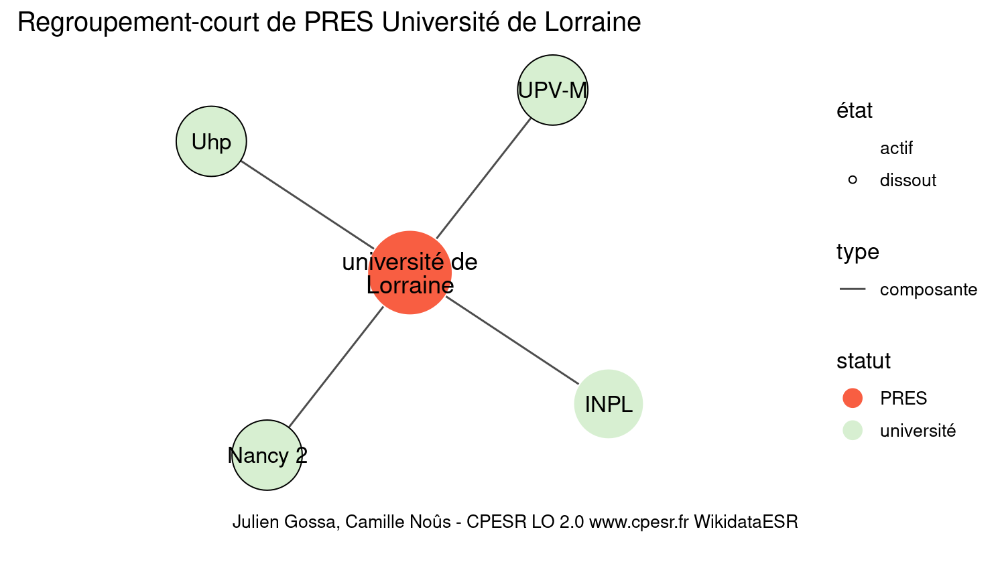 

Avertissements et édition : [logs](plots/regroupements/Q64590454.md) 

### PRES Université de Lorraine : Regroupement Etendu.     Edition des données : https://github.com/cpesr/wikidataESR/blob/master/plots/regroupements/Q64590454.md 

 

Avertissements et édition : [logs](plots/regroupements/Q64590454.md) 

### PRES Université de Lorraine : Regroupement Superetendu.     Edition des données : https://github.com/cpesr/wikidataESR/blob/master/plots/regroupements/Q64590454.md 

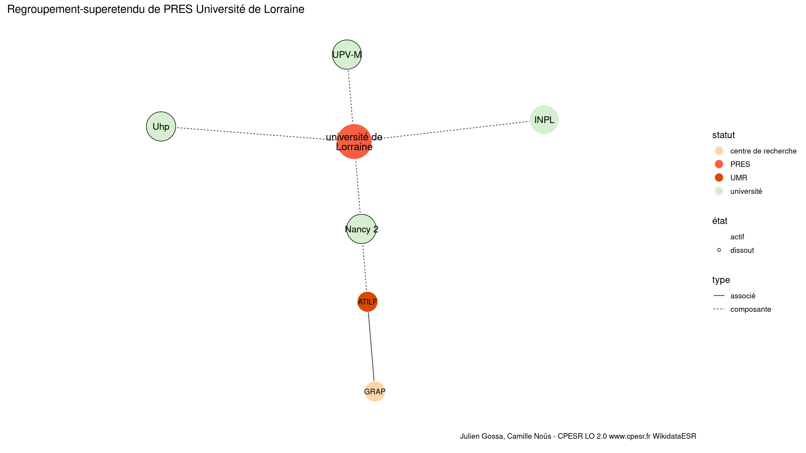 

Avertissements et édition : [logs](plots/regroupements/Q64590454.md) 

### PRES UniverSud Paris : Histoire.     Edition des données : https://github.com/cpesr/wikidataESR/blob/master/plots/regroupements/Q3248808.md 


Erreur : les données sont probablement trop partielles.
```
Error in wdesr_ggplot_graph(df, node_size = node_size, label_sizes = label_sizes, : Empty ESR graph: something went wrong with the graph production parameters

``` 

Avertissements et édition : [logs](plots/regroupements/Q3248808.md) 

### PRES UniverSud Paris : Regroupement Court.     Edition des données : https://github.com/cpesr/wikidataESR/blob/master/plots/regroupements/Q3248808.md 

 

Avertissements et édition : [logs](plots/regroupements/Q3248808.md) 

### PRES UniverSud Paris : Regroupement Etendu.     Edition des données : https://github.com/cpesr/wikidataESR/blob/master/plots/regroupements/Q3248808.md 

 

Avertissements et édition : [logs](plots/regroupements/Q3248808.md) 

### PRES UniverSud Paris : Regroupement Superetendu.     Edition des données : https://github.com/cpesr/wikidataESR/blob/master/plots/regroupements/Q3248808.md 


Erreur : les données sont probablement trop partielles.
```
Error in query(url, "pcontent", clean_response, query_param = query_param, : The API returned an error: missingtitle - The page you specified doesn't exist.

``` 

Avertissements et édition : [logs](plots/regroupements/Q3248808.md) 

### Site alsacien : Histoire.     Edition des données : https://github.com/cpesr/wikidataESR/blob/master/plots/regroupements/Q61716176.md 


Erreur : les données sont probablement trop partielles.
```
Error in wdesr_ggplot_graph(df, node_size = node_size, label_sizes = label_sizes, : Empty ESR graph: something went wrong with the graph production parameters

``` 

Avertissements et édition : [logs](plots/regroupements/Q61716176.md) 

### Site alsacien : Regroupement Court.     Edition des données : https://github.com/cpesr/wikidataESR/blob/master/plots/regroupements/Q61716176.md 

 

Avertissements et édition : [logs](plots/regroupements/Q61716176.md) 

### Site alsacien : Regroupement Etendu.     Edition des données : https://github.com/cpesr/wikidataESR/blob/master/plots/regroupements/Q61716176.md 

 

Avertissements et édition : [logs](plots/regroupements/Q61716176.md) 

### Site alsacien : Regroupement Superetendu.     Edition des données : https://github.com/cpesr/wikidataESR/blob/master/plots/regroupements/Q61716176.md 

 

Avertissements et édition : [logs](plots/regroupements/Q61716176.md) 

### Université fédérale de Toulouse Midi-Pyrénées : Histoire.     Edition des données : https://github.com/cpesr/wikidataESR/blob/master/plots/regroupements/Q578023.md 


Erreur : les données sont probablement trop partielles.
```
Error in wdesr_ggplot_graph(df, node_size = node_size, label_sizes = label_sizes, : Empty ESR graph: something went wrong with the graph production parameters

``` 

Avertissements et édition : [logs](plots/regroupements/Q578023.md) 

### Université fédérale de Toulouse Midi-Pyrénées : Regroupement Court.     Edition des données : https://github.com/cpesr/wikidataESR/blob/master/plots/regroupements/Q578023.md 

 

Avertissements et édition : [logs](plots/regroupements/Q578023.md) 

### Université fédérale de Toulouse Midi-Pyrénées : Regroupement Etendu.     Edition des données : https://github.com/cpesr/wikidataESR/blob/master/plots/regroupements/Q578023.md 

 

Avertissements et édition : [logs](plots/regroupements/Q578023.md) 

### Université fédérale de Toulouse Midi-Pyrénées : Regroupement Superetendu.     Edition des données : https://github.com/cpesr/wikidataESR/blob/master/plots/regroupements/Q578023.md 

 

Avertissements et édition : [logs](plots/regroupements/Q578023.md) 

### Université Paris-Saclay : Histoire.     Edition des données : https://github.com/cpesr/wikidataESR/blob/master/plots/regroupements/Q109409389.md 

 

Avertissements et édition : [logs](plots/regroupements/Q109409389.md) 

### Université Paris-Saclay : Regroupement Court.     Edition des données : https://github.com/cpesr/wikidataESR/blob/master/plots/regroupements/Q109409389.md 

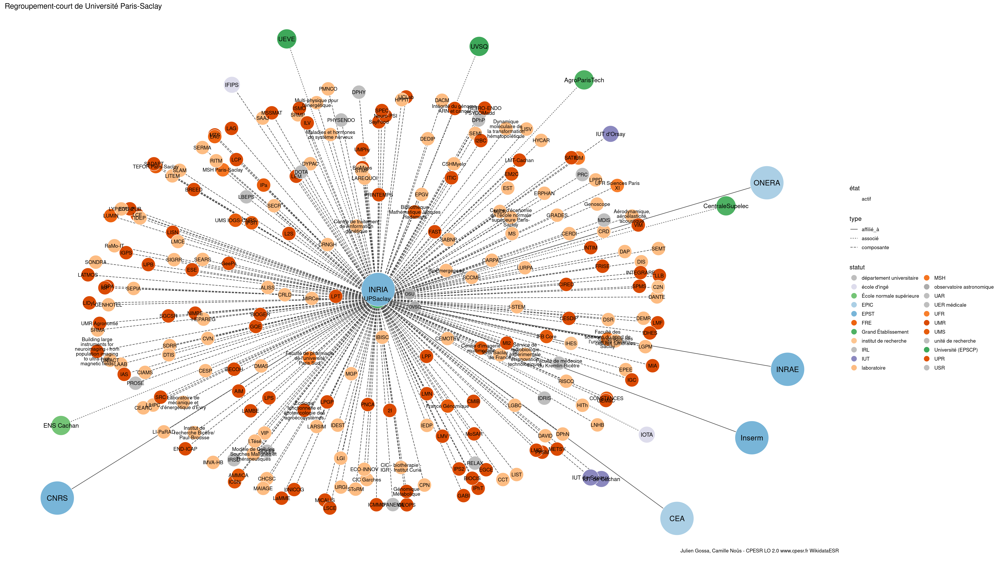 

Avertissements et édition : [logs](plots/regroupements/Q109409389.md) 

### Université Paris-Saclay : Regroupement Etendu.     Edition des données : https://github.com/cpesr/wikidataESR/blob/master/plots/regroupements/Q109409389.md 

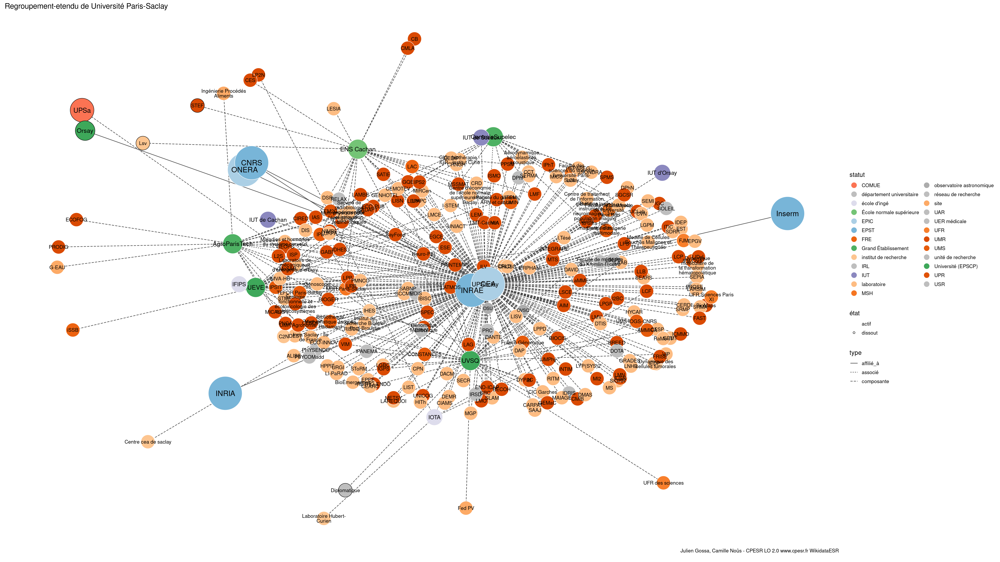 

Avertissements et édition : [logs](plots/regroupements/Q109409389.md) 

### Université Paris-Saclay : Regroupement Superetendu.     Edition des données : https://github.com/cpesr/wikidataESR/blob/master/plots/regroupements/Q109409389.md 


Erreur : les données sont probablement trop partielles.
```
Error in query(url, "pcontent", clean_response, query_param = query_param, : The API returned an error: missingtitle - The page you specified doesn't exist.

``` 

Avertissements et édition : [logs](plots/regroupements/Q109409389.md) 

## Histoire des universités historiques 

### université de Clermont-Ferrand : Histoire.     Edition des données : https://github.com/cpesr/wikidataESR/blob/master/plots/histoire/Q3551576.md 

 

Avertissements et édition : [logs](plots/histoire/Q3551576.md) 

### université de Bordeaux : Histoire.     Edition des données : https://github.com/cpesr/wikidataESR/blob/master/plots/histoire/Q20791505.md 

 

Avertissements et édition : [logs](plots/histoire/Q20791505.md) 

### Université de Paris : Histoire.     Edition des données : https://github.com/cpesr/wikidataESR/blob/master/plots/histoire/Q209842.md 

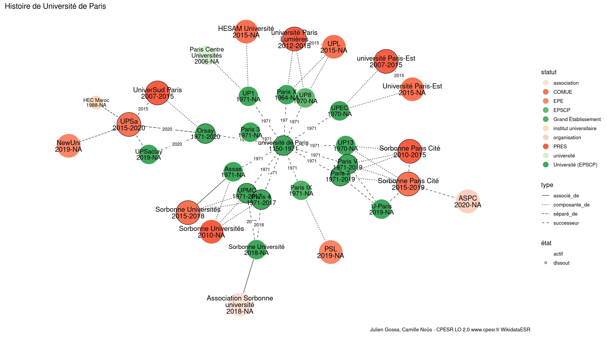 

Avertissements et édition : [logs](plots/histoire/Q209842.md) 

### université de Lille : Histoire.     Edition des données : https://github.com/cpesr/wikidataESR/blob/master/plots/histoire/Q3551621.md 


Erreur : les données sont probablement trop partielles.
```
Error in wdesr_ggplot_graph(df, node_size = node_size, label_sizes = label_sizes, : Empty ESR graph: something went wrong with the graph production parameters

``` 

Avertissements et édition : [logs](plots/histoire/Q3551621.md) 

### université de Lyon (1896-1969) : Histoire.     Edition des données : https://github.com/cpesr/wikidataESR/blob/master/plots/histoire/Q2383462.md 

 

Avertissements et édition : [logs](plots/histoire/Q2383462.md) 

### ancienne université d'Orléans : Histoire.     Edition des données : https://github.com/cpesr/wikidataESR/blob/master/plots/histoire/Q23197733.md 

 

Avertissements et édition : [logs](plots/histoire/Q23197733.md) 

### Université de Montpellier : Histoire.     Edition des données : https://github.com/cpesr/wikidataESR/blob/master/plots/histoire/Q64690423.md 

 

Avertissements et édition : [logs](plots/histoire/Q64690423.md) 

### université de Rennes : Histoire.     Edition des données : https://github.com/cpesr/wikidataESR/blob/master/plots/histoire/Q1987282.md 

 

Avertissements et édition : [logs](plots/histoire/Q1987282.md) 

### École royale de dessin (Paris) : Histoire.     Edition des données : https://github.com/cpesr/wikidataESR/blob/master/plots/histoire/Q20774688.md 

 

Avertissements et édition : [logs](plots/histoire/Q20774688.md) 

### Ancienne université de Toulouse : Histoire.     Edition des données : https://github.com/cpesr/wikidataESR/blob/master/plots/histoire/Q578023.md 

 

Avertissements et édition : [logs](plots/histoire/Q578023.md) 

### Academia argentinensis : Histoire.     Edition des données : https://github.com/cpesr/wikidataESR/blob/master/plots/histoire/Q20808141.md 

 

Avertissements et édition : [logs](plots/histoire/Q20808141.md) 

### université d'Aix-Marseille (1896-1971) : Histoire.     Edition des données : https://github.com/cpesr/wikidataESR/blob/master/plots/histoire/Q21592577.md 

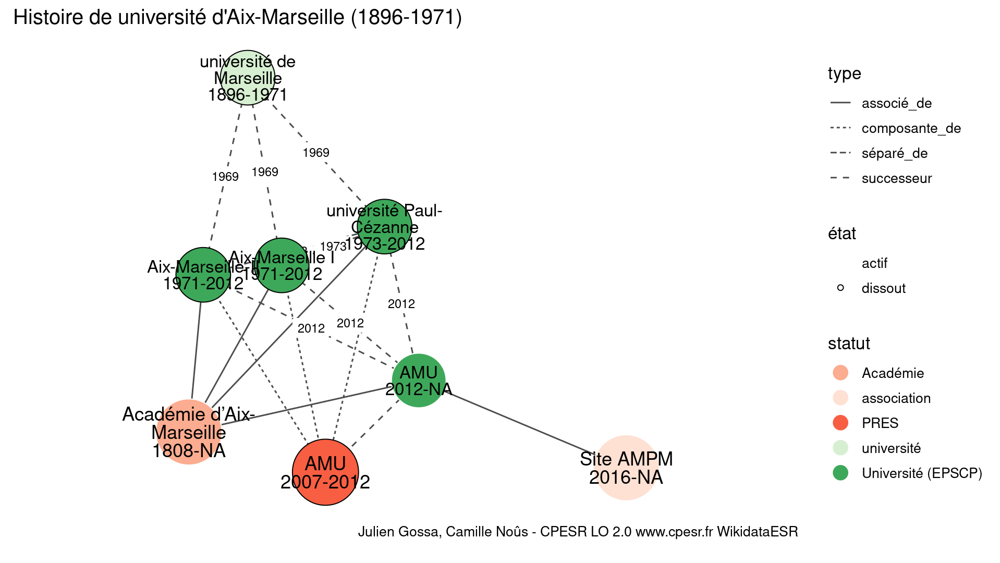 

Avertissements et édition : [logs](plots/histoire/Q21592577.md) 

