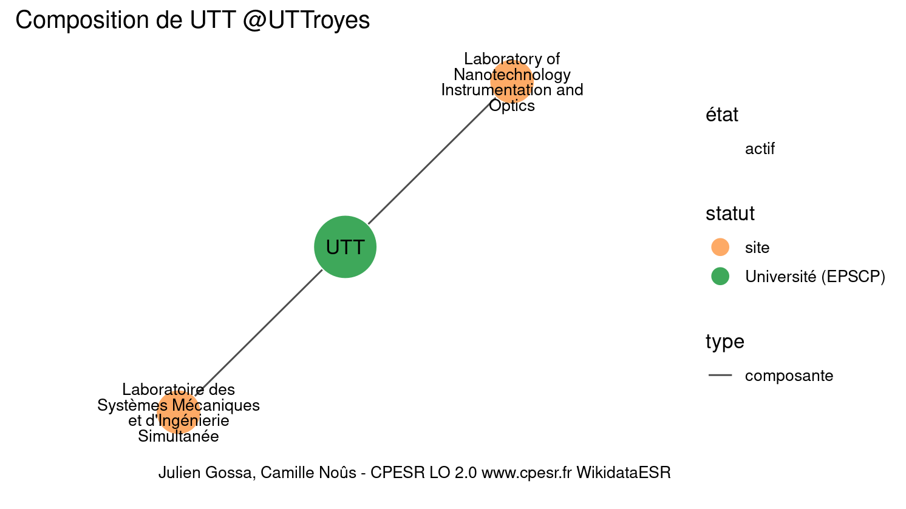
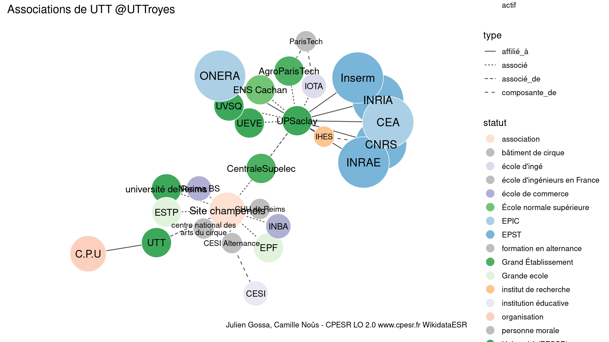

Warnings wikidataESR pour : UTT @UTTroyes(01/10/2023
================

- Edition wikidata : [Q1037208](https://www.wikidata.org/wiki/Q1037208)
- Guide d'édition : [wikidataESR](https://github.com/cpesr/wikidataESR/)

- Discussion sur le guide d'édition : [github](https://github.com/cpesr/wikidataESR/issues)


## histoire 

 

 


Erreur : les données sont probablement trop partielles.
```
Error in wdesr_ggplot_graph(df, node_size = node_size, label_sizes = label_sizes, : Empty ESR graph: something went wrong with the graph production parameters

``` 


## composition 

 

Problèmes détectés dans les entités :

|entité                                               |alias                                                          |statut |message                     |
|:----------------------------------------------------|:--------------------------------------------------------------|:------|:---------------------------|
|[Q30262312](https://www.wikidata.org/wiki/Q30262312) |Laboratory of Nanotechnology Instrumentation and Optics        |site   |Statut trop imprécis        |
|[Q30262312](https://www.wikidata.org/wiki/Q30262312) |Laboratory of Nanotechnology Instrumentation and Optics        |site   |Alias manquant ou long      |
|[Q30262312](https://www.wikidata.org/wiki/Q30262312) |Laboratory of Nanotechnology Instrumentation and Optics        |site   |Date de fondation manquante |
|[Q30262537](https://www.wikidata.org/wiki/Q30262537) |Laboratoire des Systèmes Mécaniques et d'Ingénierie Simultanée |site   |Statut trop imprécis        |
|[Q30262537](https://www.wikidata.org/wiki/Q30262537) |Laboratoire des Systèmes Mécaniques et d'Ingénierie Simultanée |site   |Alias manquant ou long      |

 


## associations 

 

Problèmes détectés dans les entités :

|entité                                               |alias                              |statut                |message                                |
|:----------------------------------------------------|:----------------------------------|:---------------------|:--------------------------------------|
|[Q2992908](https://www.wikidata.org/wiki/Q2992908)   |C.P.U                              |organisation          |Statut trop imprécis                   |
|[Q61716216](https://www.wikidata.org/wiki/Q61716216) |Site champenois                    |association           |Statut trop imprécis                   |
|[Q2945947](https://www.wikidata.org/wiki/Q2945947)   |centre national des arts du cirque |bâtiment de cirque    |Alias manquant ou long                 |
|[Q30255548](https://www.wikidata.org/wiki/Q30255548) |CESI                               |institution éducative |Statut trop imprécis                   |
|[Q17623901](https://www.wikidata.org/wiki/Q17623901) |CHU de Reims                       |personne morale       |Date de fondation manquante            |
|[Q1156553](https://www.wikidata.org/wiki/Q1156553)   |IHES                               |institut de recherche |Statut trop imprécis                   |
|[Q898448](https://www.wikidata.org/wiki/Q898448)     |IOTA                               |école d'ingé          |Statut trop imprécis                   |
|[Q3046044](https://www.wikidata.org/wiki/Q3046044)   |EPF                                |Grande ecole          |Réserver aux écoles non contemporaines |
|[Q273483](https://www.wikidata.org/wiki/Q273483)     |ESTP                               |Grande ecole          |Réserver aux écoles non contemporaines |

Problèmes détectés dans les relations :

|depuis                                                 |vers                                                   |type       |message              |
|:------------------------------------------------------|:------------------------------------------------------|:----------|:--------------------|
|[Q1037208](https://www.wikidata.org/wiki/Q1037208)     |[Q2992908](https://www.wikidata.org/wiki/Q2992908)     |affilié_à  |Date(s) manquante(s) |
|[Q1037208](https://www.wikidata.org/wiki/Q1037208)     |[Q61716216](https://www.wikidata.org/wiki/Q61716216)   |associé_de |Date(s) manquante(s) |
|[Q61716216](https://www.wikidata.org/wiki/Q61716216)   |[Q2496149](https://www.wikidata.org/wiki/Q2496149)     |associé    |Date(s) manquante(s) |
|[Q61716216](https://www.wikidata.org/wiki/Q61716216)   |[Q16665962](https://www.wikidata.org/wiki/Q16665962)   |associé    |Date(s) manquante(s) |
|[Q61716216](https://www.wikidata.org/wiki/Q61716216)   |[Q3117947](https://www.wikidata.org/wiki/Q3117947)     |associé    |Date(s) manquante(s) |
|[Q61716216](https://www.wikidata.org/wiki/Q61716216)   |[Q2945947](https://www.wikidata.org/wiki/Q2945947)     |associé    |Date(s) manquante(s) |
|[Q61716216](https://www.wikidata.org/wiki/Q61716216)   |[Q56185631](https://www.wikidata.org/wiki/Q56185631)   |associé    |Date(s) manquante(s) |
|[Q61716216](https://www.wikidata.org/wiki/Q61716216)   |[Q17623901](https://www.wikidata.org/wiki/Q17623901)   |associé    |Date(s) manquante(s) |
|[Q61716216](https://www.wikidata.org/wiki/Q61716216)   |[Q19203245](https://www.wikidata.org/wiki/Q19203245)   |associé    |Date(s) manquante(s) |
|[Q61716216](https://www.wikidata.org/wiki/Q61716216)   |[Q3046044](https://www.wikidata.org/wiki/Q3046044)     |associé    |Date(s) manquante(s) |
|[Q61716216](https://www.wikidata.org/wiki/Q61716216)   |[Q273483](https://www.wikidata.org/wiki/Q273483)       |associé    |Date(s) manquante(s) |
|[Q19203245](https://www.wikidata.org/wiki/Q19203245)   |[Q109409389](https://www.wikidata.org/wiki/Q109409389) |associé_de |Date(s) manquante(s) |
|[Q109409389](https://www.wikidata.org/wiki/Q109409389) |[Q280413](https://www.wikidata.org/wiki/Q280413)       |affilié_à  |Date(s) manquante(s) |
|[Q109409389](https://www.wikidata.org/wiki/Q109409389) |[Q1474517](https://www.wikidata.org/wiki/Q1474517)     |affilié_à  |Date(s) manquante(s) |
|[Q109409389](https://www.wikidata.org/wiki/Q109409389) |[Q70571774](https://www.wikidata.org/wiki/Q70571774)   |affilié_à  |Date(s) manquante(s) |
|[Q109409389](https://www.wikidata.org/wiki/Q109409389) |[Q1146208](https://www.wikidata.org/wiki/Q1146208)     |affilié_à  |Date(s) manquante(s) |
|[Q109409389](https://www.wikidata.org/wiki/Q109409389) |[Q868550](https://www.wikidata.org/wiki/Q868550)       |affilié_à  |Date(s) manquante(s) |
|[Q109409389](https://www.wikidata.org/wiki/Q109409389) |[Q2007769](https://www.wikidata.org/wiki/Q2007769)     |affilié_à  |Date(s) manquante(s) |
|[Q109409389](https://www.wikidata.org/wiki/Q109409389) |[Q1156553](https://www.wikidata.org/wiki/Q1156553)     |affilié_à  |Date(s) manquante(s) |
|[Q109409389](https://www.wikidata.org/wiki/Q109409389) |[Q273604](https://www.wikidata.org/wiki/Q273604)       |associé    |Date(s) manquante(s) |
|[Q109409389](https://www.wikidata.org/wiki/Q109409389) |[Q898448](https://www.wikidata.org/wiki/Q898448)       |associé    |Date(s) manquante(s) |
|[Q109409389](https://www.wikidata.org/wiki/Q109409389) |[Q1637105](https://www.wikidata.org/wiki/Q1637105)     |associé    |Date(s) manquante(s) |
|[Q109409389](https://www.wikidata.org/wiki/Q109409389) |[Q186638](https://www.wikidata.org/wiki/Q186638)       |associé    |Date(s) manquante(s) |
|[Q109409389](https://www.wikidata.org/wiki/Q109409389) |[Q1531014](https://www.wikidata.org/wiki/Q1531014)     |associé    |Date(s) manquante(s) |

NB : les dates manquantes pour les relations de composante ne sont pas remontées. 

