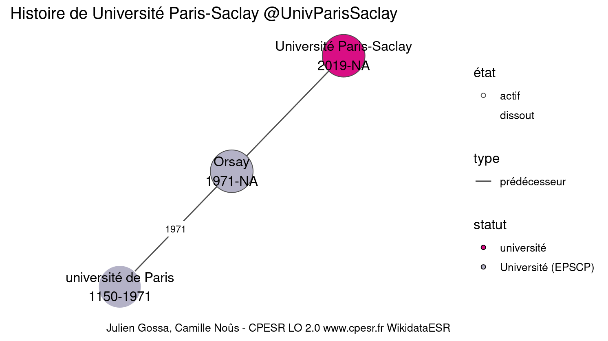
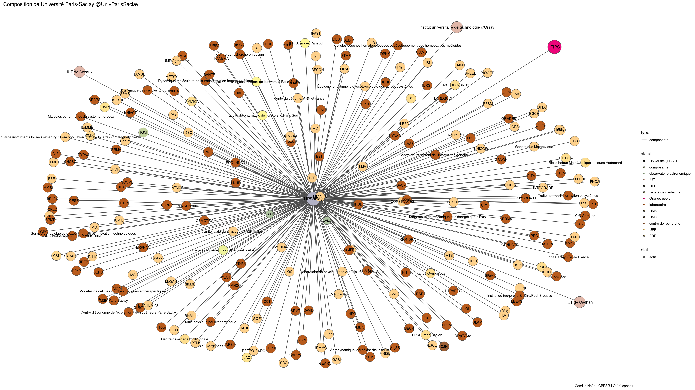
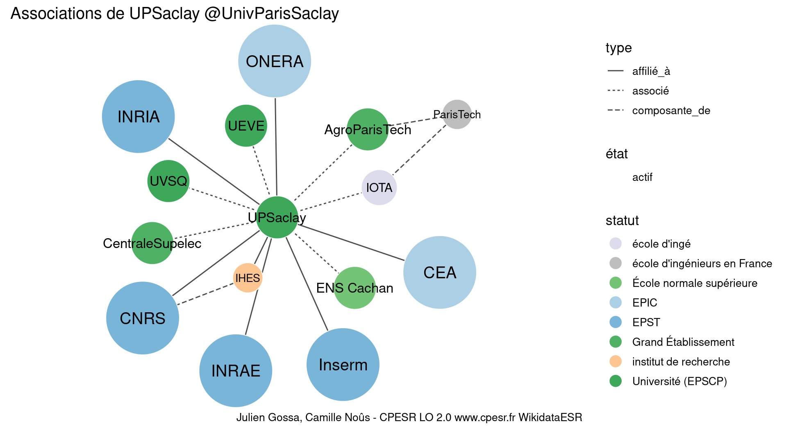

Warnings wikidataESR pour : Université Paris-Saclay @UnivParisSaclay(14/11/2021
================

- Edition wikidata : [Q109409389](https://www.wikidata.org/wiki/Q109409389)
- Guide d'édition : [wikidataESR](https://github.com/cpesr/wikidataESR/)

- Discussion sur le guide d'édition : [github](https://github.com/cpesr/wikidataESR/issues)


## histoire 

 

Problèmes détectés dans les entités :

|entité                                                 |alias                   |statut     |message                |
|:------------------------------------------------------|:-----------------------|:----------|:----------------------|
|[Q109409389](https://www.wikidata.org/wiki/Q109409389) |Université Paris-Saclay |université |Statut trop imprécis   |
|[Q109409389](https://www.wikidata.org/wiki/Q109409389) |Université Paris-Saclay |université |Alias manquant ou long |

Problèmes détectés dans les relations :

|from                                                   |to                                                     |type         |message              |
|:------------------------------------------------------|:------------------------------------------------------|:------------|:--------------------|
|[Q109409389](https://www.wikidata.org/wiki/Q109409389) |[Q1480643](https://www.wikidata.org/wiki/Q1480643)     |prédécesseur |Date(s) manquante(s) |
|[Q109409389](https://www.wikidata.org/wiki/Q109409389) |[Q109409389](https://www.wikidata.org/wiki/Q109409389) |prédécesseur |Date(s) manquante(s) |

NB : les dates manquantes pour les relations de composante ne sont pas remontées. 


## composition 

 

Problèmes détectés dans les entités :

|entité                                                 |alias                   |statut     |message                |
|:------------------------------------------------------|:-----------------------|:----------|:----------------------|
|[Q109409389](https://www.wikidata.org/wiki/Q109409389) |Université Paris-Saclay |université |Statut trop imprécis   |
|[Q109409389](https://www.wikidata.org/wiki/Q109409389) |Université Paris-Saclay |université |Alias manquant ou long |

 


Erreur : les données sont probablement trop partielles.
```
Error in wdesr_ggplot_graph(df, node_size = node_size, label_sizes = label_sizes, : Empty ESR graph: something went wrong with the graph production parameters

``` 


## associations 

 

Problèmes détectés dans les entités :

|entité                                                 |alias                   |statut                |message                                |
|:------------------------------------------------------|:-----------------------|:---------------------|:--------------------------------------|
|[Q109409389](https://www.wikidata.org/wiki/Q109409389) |Université Paris-Saclay |université            |Statut trop imprécis                   |
|[Q109409389](https://www.wikidata.org/wiki/Q109409389) |Université Paris-Saclay |université            |Alias manquant ou long                 |
|[Q1156553](https://www.wikidata.org/wiki/Q1156553)     |IHES                    |institut de recherche |Statut trop imprécis                   |
|[Q19203245](https://www.wikidata.org/wiki/Q19203245)   |CentraleSupelec         |université            |Statut trop imprécis                   |
|[Q1637105](https://www.wikidata.org/wiki/Q1637105)     |AgroParisTech           |Grande ecole          |Réserver aux écoles non contemporaines |
|[Q898448](https://www.wikidata.org/wiki/Q898448)       |IOTA                    |Grande ecole          |Réserver aux écoles non contemporaines |

Problèmes détectés dans les relations :

|from                                                   |to                                                   |type      |message              |
|:------------------------------------------------------|:----------------------------------------------------|:---------|:--------------------|
|[Q109409389](https://www.wikidata.org/wiki/Q109409389) |[Q280413](https://www.wikidata.org/wiki/Q280413)     |affilié_à |Date(s) manquante(s) |
|[Q109409389](https://www.wikidata.org/wiki/Q109409389) |[Q1146208](https://www.wikidata.org/wiki/Q1146208)   |affilié_à |Date(s) manquante(s) |
|[Q109409389](https://www.wikidata.org/wiki/Q109409389) |[Q70571774](https://www.wikidata.org/wiki/Q70571774) |affilié_à |Date(s) manquante(s) |
|[Q109409389](https://www.wikidata.org/wiki/Q109409389) |[Q1474517](https://www.wikidata.org/wiki/Q1474517)   |affilié_à |Date(s) manquante(s) |
|[Q109409389](https://www.wikidata.org/wiki/Q109409389) |[Q868550](https://www.wikidata.org/wiki/Q868550)     |affilié_à |Date(s) manquante(s) |
|[Q109409389](https://www.wikidata.org/wiki/Q109409389) |[Q2007769](https://www.wikidata.org/wiki/Q2007769)   |affilié_à |Date(s) manquante(s) |
|[Q109409389](https://www.wikidata.org/wiki/Q109409389) |[Q1156553](https://www.wikidata.org/wiki/Q1156553)   |affilié_à |Date(s) manquante(s) |
|[Q109409389](https://www.wikidata.org/wiki/Q109409389) |[Q1531014](https://www.wikidata.org/wiki/Q1531014)   |associé   |Date(s) manquante(s) |
|[Q109409389](https://www.wikidata.org/wiki/Q109409389) |[Q19203245](https://www.wikidata.org/wiki/Q19203245) |associé   |Date(s) manquante(s) |
|[Q109409389](https://www.wikidata.org/wiki/Q109409389) |[Q186638](https://www.wikidata.org/wiki/Q186638)     |associé   |Date(s) manquante(s) |
|[Q109409389](https://www.wikidata.org/wiki/Q109409389) |[Q1637105](https://www.wikidata.org/wiki/Q1637105)   |associé   |Date(s) manquante(s) |
|[Q109409389](https://www.wikidata.org/wiki/Q109409389) |[Q273604](https://www.wikidata.org/wiki/Q273604)     |associé   |Date(s) manquante(s) |
|[Q109409389](https://www.wikidata.org/wiki/Q109409389) |[Q898448](https://www.wikidata.org/wiki/Q898448)     |associé   |Date(s) manquante(s) |
|[Q13531686](https://www.wikidata.org/wiki/Q13531686)   |[Q280413](https://www.wikidata.org/wiki/Q280413)     |associé   |Date(s) manquante(s) |
|[Q13531686](https://www.wikidata.org/wiki/Q13531686)   |[Q1146208](https://www.wikidata.org/wiki/Q1146208)   |associé   |Date(s) manquante(s) |
|[Q13531686](https://www.wikidata.org/wiki/Q13531686)   |[Q70571774](https://www.wikidata.org/wiki/Q70571774) |associé   |Date(s) manquante(s) |
|[Q13531686](https://www.wikidata.org/wiki/Q13531686)   |[Q1474517](https://www.wikidata.org/wiki/Q1474517)   |associé   |Date(s) manquante(s) |
|[Q13531686](https://www.wikidata.org/wiki/Q13531686)   |[Q868550](https://www.wikidata.org/wiki/Q868550)     |associé   |Date(s) manquante(s) |
|[Q13531686](https://www.wikidata.org/wiki/Q13531686)   |[Q2007769](https://www.wikidata.org/wiki/Q2007769)   |associé   |Date(s) manquante(s) |

NB : les dates manquantes pour les relations de composante ne sont pas remontées. 

