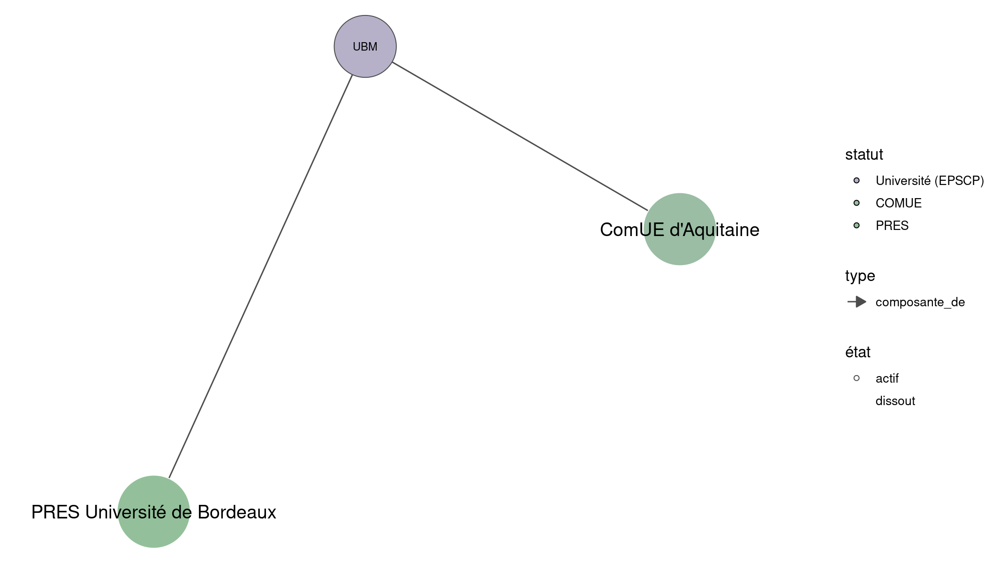

Warnings wikidataESR pour : UBM @UBMontaigne(01/09/2022
================

- Edition wikidata : [Q13342](https://www.wikidata.org/wiki/Q13342)
- Guide d'édition : [wikidataESR](https://github.com/cpesr/wikidataESR/)

- Discussion sur le guide d'édition : [github](https://github.com/cpesr/wikidataESR/issues)


## histoire 

 

Problèmes détectés dans les entités :

|entité                                               |alias                  |statut     |message                |
|:----------------------------------------------------|:----------------------|:----------|:----------------------|
|[Q20791505](https://www.wikidata.org/wiki/Q20791505) |université de Bordeaux |université |Statut trop imprécis   |
|[Q20791505](https://www.wikidata.org/wiki/Q20791505) |université de Bordeaux |université |Alias manquant ou long |

Problèmes détectés dans les relations :

|depuis                                         |vers                                                 |type         |message              |
|:----------------------------------------------|:----------------------------------------------------|:------------|:--------------------|
|[Q13342](https://www.wikidata.org/wiki/Q13342) |[Q20791505](https://www.wikidata.org/wiki/Q20791505) |prédécesseur |Date(s) manquante(s) |

NB : les dates manquantes pour les relations de composante ne sont pas remontées. 


## composition 

 

Problèmes détectés dans les entités :

|entité                                               |alias  |statut      |message              |
|:----------------------------------------------------|:------|:-----------|:--------------------|
|[Q51785385](https://www.wikidata.org/wiki/Q51785385) |EA3656 |laboratoire |Statut trop imprécis |
|[Q51783383](https://www.wikidata.org/wiki/Q51783383) |CEMMC  |laboratoire |Statut trop imprécis |
|[Q51782272](https://www.wikidata.org/wiki/Q51782272) |EA538  |laboratoire |Statut trop imprécis |
|[Q51780320](https://www.wikidata.org/wiki/Q51780320) |EA4196 |laboratoire |Statut trop imprécis |
|[Q51786140](https://www.wikidata.org/wiki/Q51786140) |FSAB   |laboratoire |Statut trop imprécis |
|[Q51785282](https://www.wikidata.org/wiki/Q51785282) |MICA   |laboratoire |Statut trop imprécis |
|[Q51780660](https://www.wikidata.org/wiki/Q51780660) |SPH    |laboratoire |Statut trop imprécis |
|[Q51783592](https://www.wikidata.org/wiki/Q51783592) |TELEM  |laboratoire |Statut trop imprécis |
|[Q74572176](https://www.wikidata.org/wiki/Q74572176) |CLARE  |laboratoire |Statut trop imprécis |
|[Q74573595](https://www.wikidata.org/wiki/Q74573595) |EA4592 |laboratoire |Statut trop imprécis |

 


## associations 

 

 


Erreur : les données sont probablement trop partielles.
```
Error in wdesr_ggplot_graph(df, node_size = node_size, label_sizes = label_sizes, : Empty ESR graph: something went wrong with the graph production parameters

``` 

