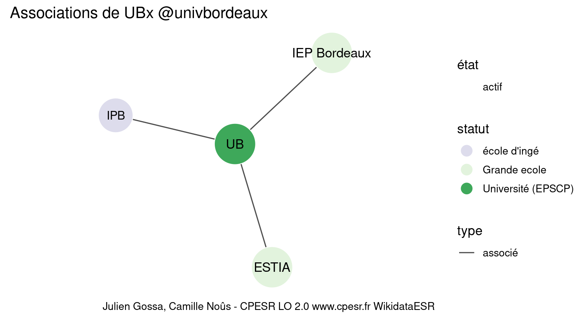

Warnings wikidataESR pour : UBx @univbordeaux(30/12/2021
================

- Edition wikidata : [Q13344](https://www.wikidata.org/wiki/Q13344)
- Guide d'édition : [wikidataESR](https://github.com/cpesr/wikidataESR/)

- Discussion sur le guide d'édition : [github](https://github.com/cpesr/wikidataESR/issues)


## histoire 

 

Problèmes détectés dans les entités :

|entité                                               |alias                        |statut     |message                     |
|:----------------------------------------------------|:----------------------------|:----------|:---------------------------|
|[Q20791505](https://www.wikidata.org/wiki/Q20791505) |université de Bordeaux       |université |Statut trop imprécis        |
|[Q20791505](https://www.wikidata.org/wiki/Q20791505) |université de Bordeaux       |université |Alias manquant ou long      |
|[Q69158721](https://www.wikidata.org/wiki/Q69158721) |Faculté de droit de Bordeaux |composante |Alias manquant ou long      |
|[Q69158721](https://www.wikidata.org/wiki/Q69158721) |Faculté de droit de Bordeaux |composante |Date de fondation manquante |

Problèmes détectés dans les relations :

|from                                           |to                                                   |type         |message              |
|:----------------------------------------------|:----------------------------------------------------|:------------|:--------------------|
|[Q13344](https://www.wikidata.org/wiki/Q13344) |[Q13338](https://www.wikidata.org/wiki/Q13338)       |prédécesseur |Date(s) manquante(s) |
|[Q13344](https://www.wikidata.org/wiki/Q13344) |[Q13340](https://www.wikidata.org/wiki/Q13340)       |prédécesseur |Date(s) manquante(s) |
|[Q13344](https://www.wikidata.org/wiki/Q13344) |[Q13335](https://www.wikidata.org/wiki/Q13335)       |prédécesseur |Date(s) manquante(s) |
|[Q13338](https://www.wikidata.org/wiki/Q13338) |[Q20791505](https://www.wikidata.org/wiki/Q20791505) |prédécesseur |Date(s) manquante(s) |
|[Q13338](https://www.wikidata.org/wiki/Q13338) |[Q69158721](https://www.wikidata.org/wiki/Q69158721) |prédécesseur |Date(s) manquante(s) |

NB : les dates manquantes pour les relations de composante ne sont pas remontées. 


## composition 

 

Problèmes détectés dans les entités :

|entité                                               |alias          |statut      |message              |
|:----------------------------------------------------|:--------------|:-----------|:--------------------|
|[Q30261439](https://www.wikidata.org/wiki/Q30261439) |LAMC           |site        |Statut trop imprécis |
|[Q15967309](https://www.wikidata.org/wiki/Q15967309) |I2M            |laboratoire |Statut trop imprécis |
|[Q2945383](https://www.wikidata.org/wiki/Q2945383)   |LOMA           |laboratoire |Statut trop imprécis |
|[Q51786140](https://www.wikidata.org/wiki/Q51786140) |FSAB           |laboratoire |Statut trop imprécis |
|[Q30262406](https://www.wikidata.org/wiki/Q30262406) |PTIB           |site        |Statut trop imprécis |
|[Q30262479](https://www.wikidata.org/wiki/Q30262479) |ISPA           |site        |Statut trop imprécis |
|[Q30262493](https://www.wikidata.org/wiki/Q30262493) |BFP            |site        |Statut trop imprécis |
|[Q43896471](https://www.wikidata.org/wiki/Q43896471) |NutriNeuro     |site        |Statut trop imprécis |
|[Q50040727](https://www.wikidata.org/wiki/Q50040727) |Immuno ConcEpT |site        |Statut trop imprécis |
|[Q51780660](https://www.wikidata.org/wiki/Q51780660) |SPH            |laboratoire |Statut trop imprécis |

 


## associations 

 

 


Erreur : les données sont probablement trop partielles.
```
Error in wdesr_ggplot_graph(df, node_size = node_size, label_sizes = label_sizes, : Empty ESR graph: something went wrong with the graph production parameters

``` 

