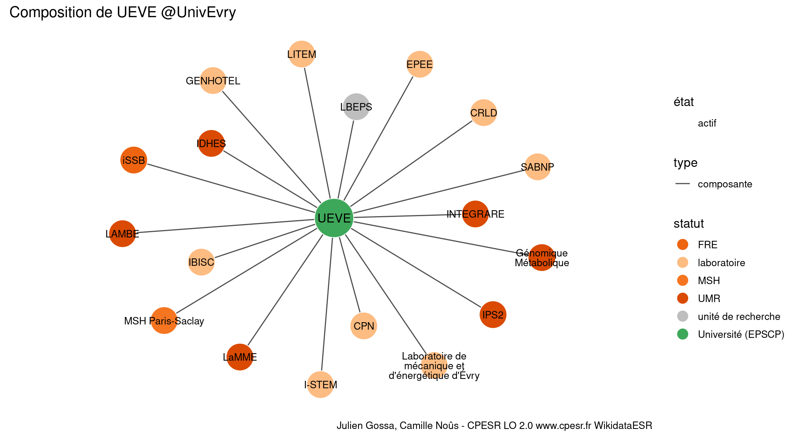
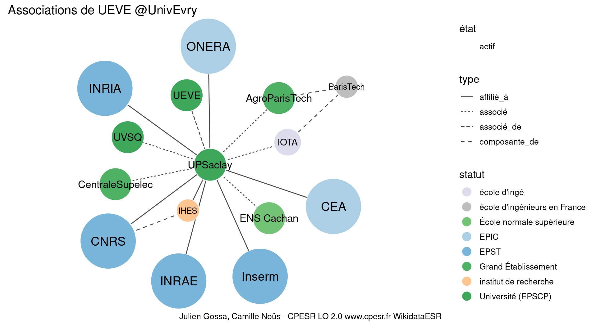

Warnings wikidataESR pour : Université d'Évry-Val-d'Essonne @UnivEvry(14/11/2021
================

- Edition wikidata : [Q1531014](https://www.wikidata.org/wiki/Q1531014)
- Guide d'édition : [wikidataESR](https://github.com/cpesr/wikidataESR/)

- Discussion sur le guide d'édition : [github](https://github.com/cpesr/wikidataESR/issues)


## histoire 

 

 


Erreur : les données sont probablement trop partielles.
```
Error in wdesr_ggplot_graph(df, node_size = node_size, label_sizes = label_sizes, : Empty ESR graph: something went wrong with the graph production parameters

``` 


## composition 

 

 


## associations 

 

Problèmes détectés dans les relations :

|from                                                 |to                                                   |type    |message              |
|:----------------------------------------------------|:----------------------------------------------------|:-------|:--------------------|
|[Q13531686](https://www.wikidata.org/wiki/Q13531686) |[Q280413](https://www.wikidata.org/wiki/Q280413)     |associé |Date(s) manquante(s) |
|[Q13531686](https://www.wikidata.org/wiki/Q13531686) |[Q1146208](https://www.wikidata.org/wiki/Q1146208)   |associé |Date(s) manquante(s) |
|[Q13531686](https://www.wikidata.org/wiki/Q13531686) |[Q70571774](https://www.wikidata.org/wiki/Q70571774) |associé |Date(s) manquante(s) |
|[Q13531686](https://www.wikidata.org/wiki/Q13531686) |[Q1474517](https://www.wikidata.org/wiki/Q1474517)   |associé |Date(s) manquante(s) |
|[Q13531686](https://www.wikidata.org/wiki/Q13531686) |[Q868550](https://www.wikidata.org/wiki/Q868550)     |associé |Date(s) manquante(s) |
|[Q13531686](https://www.wikidata.org/wiki/Q13531686) |[Q2007769](https://www.wikidata.org/wiki/Q2007769)   |associé |Date(s) manquante(s) |

NB : les dates manquantes pour les relations de composante ne sont pas remontées. 

