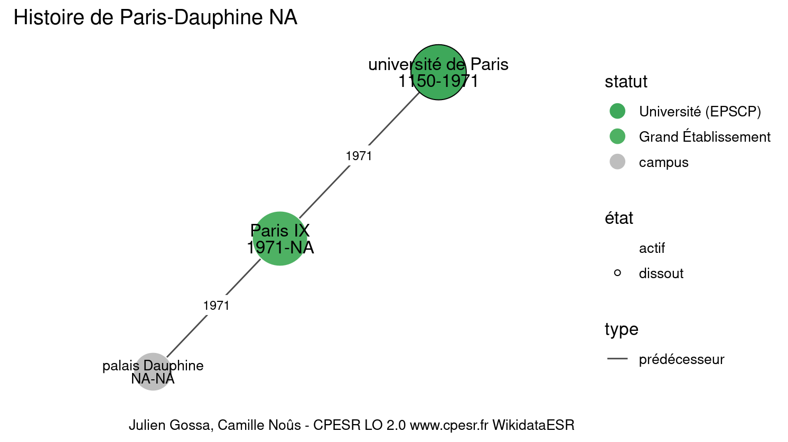
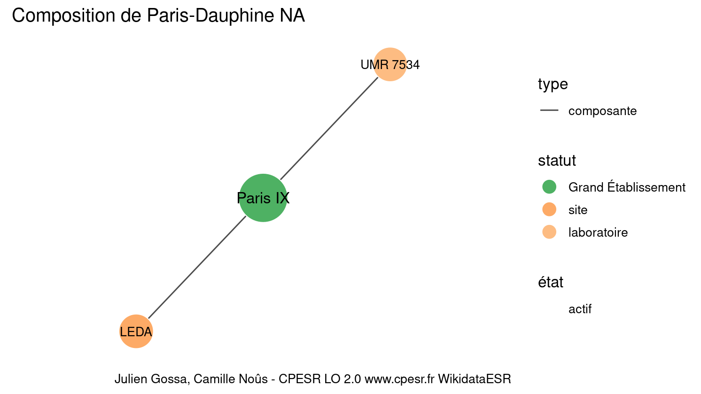
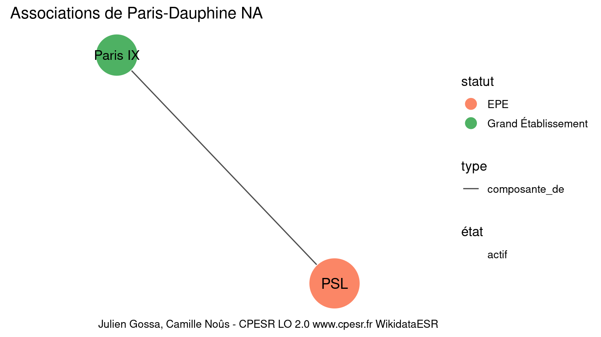

Warnings wikidataESR pour : Paris-Dauphine NA(01/10/2023
================

- Edition wikidata : [Q1546437](https://www.wikidata.org/wiki/Q1546437)
- Guide d'édition : [wikidataESR](https://github.com/cpesr/wikidataESR/)

- Discussion sur le guide d'édition : [github](https://github.com/cpesr/wikidataESR/issues)

## histoire 

 

Problèmes détectés dans les entités :

|entité                                             |alias           |statut |message                     |
|:--------------------------------------------------|:---------------|:------|:---------------------------|
|[Q2946095](https://www.wikidata.org/wiki/Q2946095) |palais Dauphine |campus |Date de fondation manquante |

 

## composition 

 

Problèmes détectés dans les entités :

|entité                                               |alias    |statut      |message              |
|:----------------------------------------------------|:--------|:-----------|:--------------------|
|[Q2913547](https://www.wikidata.org/wiki/Q2913547)   |UMR 7534 |laboratoire |Statut trop imprécis |
|[Q30262539](https://www.wikidata.org/wiki/Q30262539) |LEDA     |site        |Statut trop imprécis |

 

## associations 

 

Problèmes détectés dans les entités :

|entité                                             |alias |statut |message            |
|:--------------------------------------------------|:-----|:------|:------------------|
|[Q1163431](https://www.wikidata.org/wiki/Q1163431) |PSL   |EPE    |Préférer Q77979904 |

 

