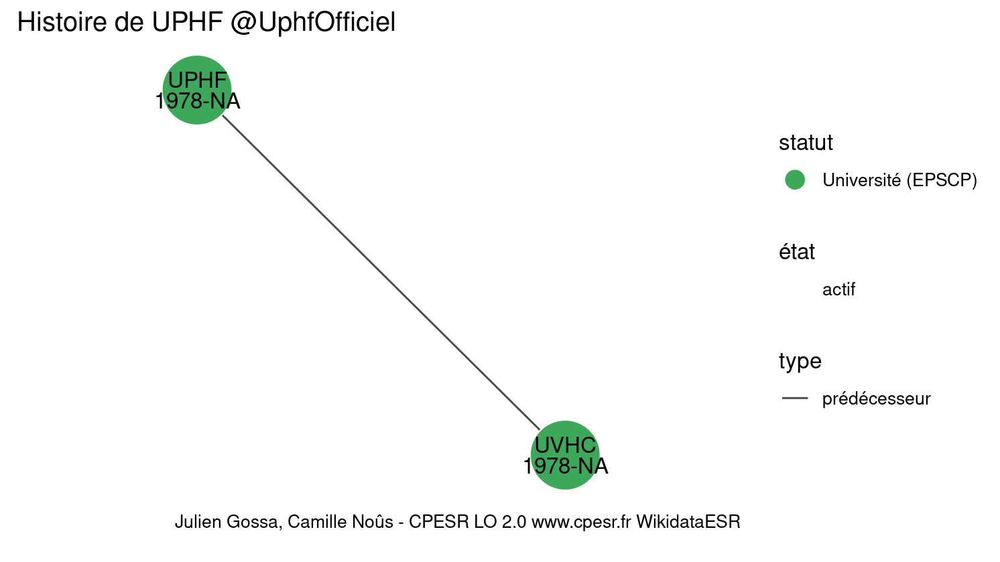
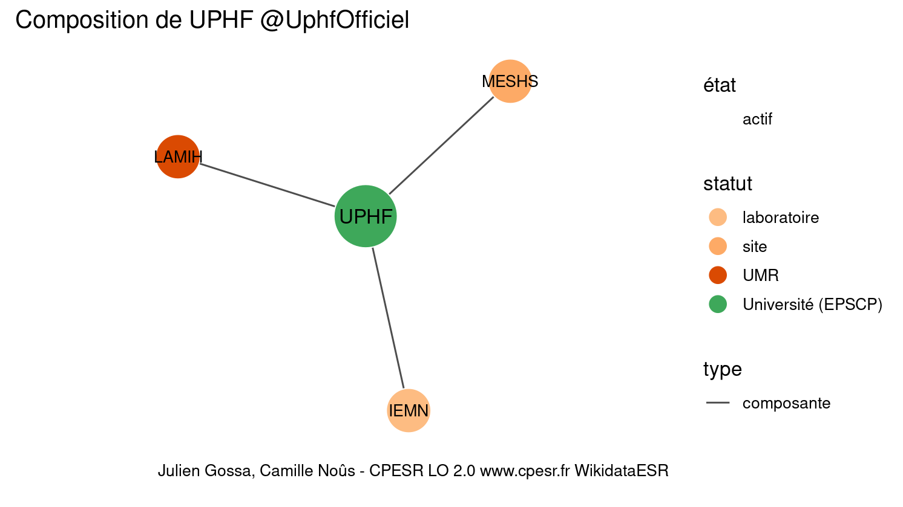

Warnings wikidataESR pour : UPHF @UphfOfficiel(10/11/2022
================

- Edition wikidata : [Q1548539](https://www.wikidata.org/wiki/Q1548539)
- Guide d'édition : [wikidataESR](https://github.com/cpesr/wikidataESR/)

- Discussion sur le guide d'édition : [github](https://github.com/cpesr/wikidataESR/issues)


## histoire 

 

Problèmes détectés dans les relations :

|depuis                                             |vers                                                   |type         |message              |
|:--------------------------------------------------|:------------------------------------------------------|:------------|:--------------------|
|[Q1548539](https://www.wikidata.org/wiki/Q1548539) |[Q102274027](https://www.wikidata.org/wiki/Q102274027) |prédécesseur |Date(s) manquante(s) |

NB : les dates manquantes pour les relations de composante ne sont pas remontées. 


## composition 

 

Problèmes détectés dans les entités :

|entité                                               |alias |statut      |message              |
|:----------------------------------------------------|:-----|:-----------|:--------------------|
|[Q3151942](https://www.wikidata.org/wiki/Q3151942)   |IEMN  |laboratoire |Statut trop imprécis |
|[Q30262374](https://www.wikidata.org/wiki/Q30262374) |MESHS |site        |Statut trop imprécis |

 


## associations 

 

 


Erreur : les données sont probablement trop partielles.
```
Error in wdesr_ggplot_graph(df, node_size = node_size, label_sizes = label_sizes, : Empty ESR graph: something went wrong with the graph production parameters

``` 

