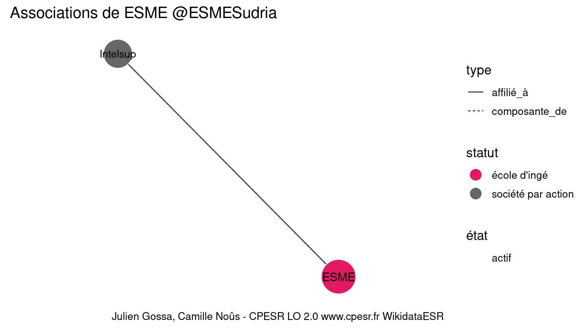

Warnings wikidataESR pour : ESME @ESMESudria(01/09/2022
================

- Edition wikidata : [Q1572655](https://www.wikidata.org/wiki/Q1572655)
- Guide d'édition : [wikidataESR](https://github.com/cpesr/wikidataESR/)

- Discussion sur le guide d'édition : [github](https://github.com/cpesr/wikidataESR/issues)


## histoire 

 

Problèmes détectés dans les entités :

|entité                                             |alias |statut       |message              |
|:--------------------------------------------------|:-----|:------------|:--------------------|
|[Q1572655](https://www.wikidata.org/wiki/Q1572655) |ESME  |école d'ingé |Statut trop imprécis |

 


Erreur : les données sont probablement trop partielles.
```
Error in wdesr_ggplot_graph(df, node_size = node_size, label_sizes = label_sizes, : Empty ESR graph: something went wrong with the graph production parameters

``` 


## composition 

 

Problèmes détectés dans les entités :

|entité                                             |alias |statut       |message              |
|:--------------------------------------------------|:-----|:------------|:--------------------|
|[Q1572655](https://www.wikidata.org/wiki/Q1572655) |ESME  |école d'ingé |Statut trop imprécis |

 


Erreur : les données sont probablement trop partielles.
```
Error in wdesr_ggplot_graph(df, node_size = node_size, label_sizes = label_sizes, : Empty ESR graph: something went wrong with the graph production parameters

``` 


## associations 

 

Problèmes détectés dans les entités :

|entité                                             |alias |statut       |message              |
|:--------------------------------------------------|:-----|:------------|:--------------------|
|[Q1572655](https://www.wikidata.org/wiki/Q1572655) |ESME  |école d'ingé |Statut trop imprécis |

Problèmes détectés dans les relations :

|depuis                                             |vers                                             |type          |message              |
|:--------------------------------------------------|:------------------------------------------------|:-------------|:--------------------|
|[Q1572655](https://www.wikidata.org/wiki/Q1572655) |[Q392110](https://www.wikidata.org/wiki/Q392110) |composante_de |Relation multiple    |
|[Q1572655](https://www.wikidata.org/wiki/Q1572655) |[Q392110](https://www.wikidata.org/wiki/Q392110) |affilié_à     |Relation multiple    |
|[Q1572655](https://www.wikidata.org/wiki/Q1572655) |[Q392110](https://www.wikidata.org/wiki/Q392110) |affilié_à     |Date(s) manquante(s) |

NB : les dates manquantes pour les relations de composante ne sont pas remontées. 

