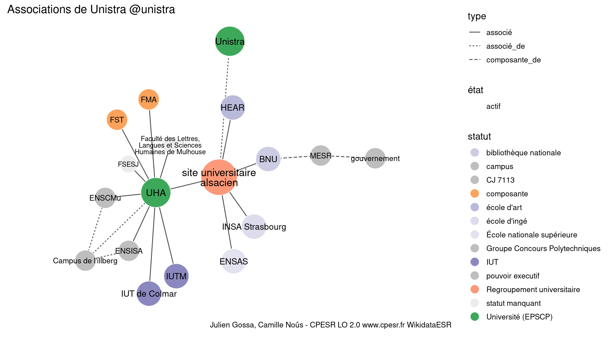

Warnings wikidataESR pour : Université de Strasbourg @unistra(13/11/2021
================

- Edition wikidata : [Q157575](https://www.wikidata.org/wiki/Q157575)
- Guide d'édition : [wikidataESR](https://github.com/cpesr/wikidataESR/)

- Discussion sur le guide d'édition : [github](https://github.com/cpesr/wikidataESR/issues)

## histoire 

 

Problèmes détectés dans les entités :

|entité                                               |alias                  |statut     |message                |
|:----------------------------------------------------|:----------------------|:----------|:----------------------|
|[Q3551497](https://www.wikidata.org/wiki/Q3551497)   |ULP                    |université |Statut trop imprécis   |
|[Q20808141](https://www.wikidata.org/wiki/Q20808141) |Academia argentinensis |université |Statut trop imprécis   |
|[Q20808141](https://www.wikidata.org/wiki/Q20808141) |Academia argentinensis |université |Alias manquant ou long |
|[Q540231](https://www.wikidata.org/wiki/Q540231)     |Reichsuniversität      |université |Statut trop imprécis   |
|[Q1109084](https://www.wikidata.org/wiki/Q1109084)   |UMB                    |université |Statut trop imprécis   |
|[Q3551496](https://www.wikidata.org/wiki/Q3551496)   |URS                    |université |Statut trop imprécis   |

Problèmes détectés dans les relations :

|from                                                 |to                                                   |type         |message              |
|:----------------------------------------------------|:----------------------------------------------------|:------------|:--------------------|
|[Q157575](https://www.wikidata.org/wiki/Q157575)     |[Q3551497](https://www.wikidata.org/wiki/Q3551497)   |prédécesseur |Date(s) manquante(s) |
|[Q157575](https://www.wikidata.org/wiki/Q157575)     |[Q1109084](https://www.wikidata.org/wiki/Q1109084)   |prédécesseur |Date(s) manquante(s) |
|[Q157575](https://www.wikidata.org/wiki/Q157575)     |[Q3551496](https://www.wikidata.org/wiki/Q3551496)   |prédécesseur |Date(s) manquante(s) |
|[Q3551497](https://www.wikidata.org/wiki/Q3551497)   |[Q20808141](https://www.wikidata.org/wiki/Q20808141) |prédécesseur |Date(s) manquante(s) |
|[Q20808141](https://www.wikidata.org/wiki/Q20808141) |[Q540231](https://www.wikidata.org/wiki/Q540231)     |prédécesseur |Date(s) manquante(s) |
|[Q1109084](https://www.wikidata.org/wiki/Q1109084)   |[Q20808141](https://www.wikidata.org/wiki/Q20808141) |prédécesseur |Date(s) manquante(s) |
|[Q3551496](https://www.wikidata.org/wiki/Q3551496)   |[Q20808141](https://www.wikidata.org/wiki/Q20808141) |prédécesseur |Date(s) manquante(s) |

NB : les dates manquantes pour les relations de composante ne sont pas remontées. 

## composition 

 

Problèmes détectés dans les entités :

|entité                                               |alias                                   |statut                 |message                     |
|:----------------------------------------------------|:---------------------------------------|:----------------------|:---------------------------|
|[Q30262256](https://www.wikidata.org/wiki/Q30262256) |Fed PV                                  |site                   |Statut trop imprécis        |
|[Q3278793](https://www.wikidata.org/wiki/Q3278793)   |MISHA                                   |institut universitaire |Statut trop imprécis        |
|[Q3151724](https://www.wikidata.org/wiki/Q3151724)   |ICS                                     |institut               |Statut trop imprécis        |
|[Q3152464](https://www.wikidata.org/wiki/Q3152464)   |IPHC                                    |laboratoire            |Statut trop imprécis        |
|[Q30261415](https://www.wikidata.org/wiki/Q30261415) |SVQV                                    |site                   |Statut trop imprécis        |
|[Q30262155](https://www.wikidata.org/wiki/Q30262155) |LMSPC                                   |site                   |Statut trop imprécis        |
|[Q30262155](https://www.wikidata.org/wiki/Q30262155) |LMSPC                                   |site                   |Date de fondation manquante |
|[Q3815465](https://www.wikidata.org/wiki/Q3815465)   |IBMC                                    |institut de recherche  |Statut trop imprécis        |
|[Q3152101](https://www.wikidata.org/wiki/Q3152101)   |IRMA                                    |institut de recherche  |Statut trop imprécis        |
|[Q27962661](https://www.wikidata.org/wiki/Q27962661) |CEERE                                   |institut de recherche  |Statut trop imprécis        |
|[Q27962661](https://www.wikidata.org/wiki/Q27962661) |CEERE                                   |institut de recherche  |Date de fondation manquante |
|[Q50039829](https://www.wikidata.org/wiki/Q50039829) |MSP                                     |site                   |Statut trop imprécis        |
|[Q51785143](https://www.wikidata.org/wiki/Q51785143) |Institut de recherches Carré-de-Malberg |laboratoire            |Statut trop imprécis        |
|[Q51785143](https://www.wikidata.org/wiki/Q51785143) |Institut de recherches Carré-de-Malberg |laboratoire            |Alias manquant ou long      |

 

## associations 

 

Problèmes détectés dans les entités :

|entité                                               |alias                       |statut                     |message                     |
|:----------------------------------------------------|:---------------------------|:--------------------------|:---------------------------|
|[Q61716176](https://www.wikidata.org/wiki/Q61716176) |site universitaire alsacien |Regroupement universitaire |Alias manquant ou long      |
|[Q521036](https://www.wikidata.org/wiki/Q521036)     |INSA Strasbourg             |école d'ingé               |Statut trop imprécis        |
|[Q1450662](https://www.wikidata.org/wiki/Q1450662)   |gouvernement                |pouvoir executif           |Date de fondation manquante |
|[Q3578190](https://www.wikidata.org/wiki/Q3578190)   |ENSAS                       |École nationale supérieure |Confusion avec les ENS      |
|[Q21041502](https://www.wikidata.org/wiki/Q21041502) |HEAR                        |école d'art                |Date de fondation manquante |

Problèmes détectés dans les relations :

|from                                                 |to                                                   |type       |message              |
|:----------------------------------------------------|:----------------------------------------------------|:----------|:--------------------|
|[Q157575](https://www.wikidata.org/wiki/Q157575)     |[Q61716176](https://www.wikidata.org/wiki/Q61716176) |associé_de |Date(s) manquante(s) |
|[Q61716176](https://www.wikidata.org/wiki/Q61716176) |[Q280183](https://www.wikidata.org/wiki/Q280183)     |associé    |Date(s) manquante(s) |
|[Q61716176](https://www.wikidata.org/wiki/Q61716176) |[Q521036](https://www.wikidata.org/wiki/Q521036)     |associé    |Date(s) manquante(s) |
|[Q61716176](https://www.wikidata.org/wiki/Q61716176) |[Q630461](https://www.wikidata.org/wiki/Q630461)     |associé    |Date(s) manquante(s) |
|[Q61716176](https://www.wikidata.org/wiki/Q61716176) |[Q3578190](https://www.wikidata.org/wiki/Q3578190)   |associé    |Date(s) manquante(s) |
|[Q61716176](https://www.wikidata.org/wiki/Q61716176) |[Q21041502](https://www.wikidata.org/wiki/Q21041502) |associé    |Date(s) manquante(s) |

NB : les dates manquantes pour les relations de composante ne sont pas remontées. 

