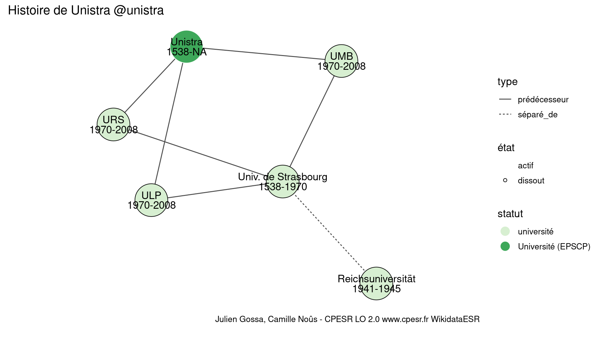

Warnings wikidataESR pour : Unistra @unistra(10/11/2022
================

- Edition wikidata : [Q157575](https://www.wikidata.org/wiki/Q157575)
- Guide d'édition : [wikidataESR](https://github.com/cpesr/wikidataESR/)

- Discussion sur le guide d'édition : [github](https://github.com/cpesr/wikidataESR/issues)

## histoire 

 

Problèmes détectés dans les entités :

|entité                                                 |alias                  |statut     |message                |
|:------------------------------------------------------|:----------------------|:----------|:----------------------|
|[Q3551497](https://www.wikidata.org/wiki/Q3551497)     |ULP                    |université |Statut trop imprécis   |
|[Q20808141](https://www.wikidata.org/wiki/Q20808141)   |Academia argentinensis |université |Statut trop imprécis   |
|[Q20808141](https://www.wikidata.org/wiki/Q20808141)   |Academia argentinensis |université |Alias manquant ou long |
|[Q540231](https://www.wikidata.org/wiki/Q540231)       |Reichsuniversität      |université |Statut trop imprécis   |
|[Q114347097](https://www.wikidata.org/wiki/Q114347097) |Academia argentinensis |université |Statut trop imprécis   |
|[Q114347097](https://www.wikidata.org/wiki/Q114347097) |Academia argentinensis |université |Alias manquant ou long |
|[Q1109084](https://www.wikidata.org/wiki/Q1109084)     |UMB                    |université |Statut trop imprécis   |
|[Q3551496](https://www.wikidata.org/wiki/Q3551496)     |URS                    |université |Statut trop imprécis   |

Problèmes détectés dans les relations :

|depuis                                               |vers                                                   |type         |message              |
|:----------------------------------------------------|:------------------------------------------------------|:------------|:--------------------|
|[Q157575](https://www.wikidata.org/wiki/Q157575)     |[Q3551497](https://www.wikidata.org/wiki/Q3551497)     |prédécesseur |Date(s) manquante(s) |
|[Q157575](https://www.wikidata.org/wiki/Q157575)     |[Q1109084](https://www.wikidata.org/wiki/Q1109084)     |prédécesseur |Date(s) manquante(s) |
|[Q157575](https://www.wikidata.org/wiki/Q157575)     |[Q3551496](https://www.wikidata.org/wiki/Q3551496)     |prédécesseur |Date(s) manquante(s) |
|[Q3551497](https://www.wikidata.org/wiki/Q3551497)   |[Q20808141](https://www.wikidata.org/wiki/Q20808141)   |prédécesseur |Date(s) manquante(s) |
|[Q20808141](https://www.wikidata.org/wiki/Q20808141) |[Q540231](https://www.wikidata.org/wiki/Q540231)       |prédécesseur |Date(s) manquante(s) |
|[Q540231](https://www.wikidata.org/wiki/Q540231)     |[Q114347097](https://www.wikidata.org/wiki/Q114347097) |prédécesseur |Date(s) manquante(s) |
|[Q1109084](https://www.wikidata.org/wiki/Q1109084)   |[Q20808141](https://www.wikidata.org/wiki/Q20808141)   |prédécesseur |Date(s) manquante(s) |
|[Q3551496](https://www.wikidata.org/wiki/Q3551496)   |[Q20808141](https://www.wikidata.org/wiki/Q20808141)   |prédécesseur |Date(s) manquante(s) |

NB : les dates manquantes pour les relations de composante ne sont pas remontées. 

## composition 

 

Problèmes détectés dans les entités :

|entité                                               |alias             |statut                 |message                     |
|:----------------------------------------------------|:-----------------|:----------------------|:---------------------------|
|[Q3151724](https://www.wikidata.org/wiki/Q3151724)   |ICS               |institut               |Statut trop imprécis        |
|[Q30261415](https://www.wikidata.org/wiki/Q30261415) |SVQV              |site                   |Statut trop imprécis        |
|[Q30262155](https://www.wikidata.org/wiki/Q30262155) |LMSPC             |site                   |Statut trop imprécis        |
|[Q30262155](https://www.wikidata.org/wiki/Q30262155) |LMSPC             |site                   |Date de fondation manquante |
|[Q30262256](https://www.wikidata.org/wiki/Q30262256) |Fed PV            |site                   |Statut trop imprécis        |
|[Q3815465](https://www.wikidata.org/wiki/Q3815465)   |IBMC              |institut de recherche  |Statut trop imprécis        |
|[Q3152101](https://www.wikidata.org/wiki/Q3152101)   |IRMA              |institut de recherche  |Statut trop imprécis        |
|[Q3278793](https://www.wikidata.org/wiki/Q3278793)   |MISHA             |institut universitaire |Statut trop imprécis        |
|[Q27962661](https://www.wikidata.org/wiki/Q27962661) |CEERE             |institut de recherche  |Statut trop imprécis        |
|[Q27962661](https://www.wikidata.org/wiki/Q27962661) |CEERE             |institut de recherche  |Date de fondation manquante |
|[Q50039829](https://www.wikidata.org/wiki/Q50039829) |MSP               |site                   |Statut trop imprécis        |
|[Q51785143](https://www.wikidata.org/wiki/Q51785143) |IRCM              |laboratoire            |Statut trop imprécis        |
|[Q3152660](https://www.wikidata.org/wiki/Q3152660)   |IUT Louis Pasteur |IUT                    |Date de fondation manquante |

 

## associations 

 

Problèmes détectés dans les entités :

|entité                                                 |alias                                                         |statut                     |message                                                    |
|:------------------------------------------------------|:-------------------------------------------------------------|:--------------------------|:----------------------------------------------------------|
|[Q61716176](https://www.wikidata.org/wiki/Q61716176)   |site universitaire alsacien                                   |Regroupement universitaire |Alias manquant ou long                                     |
|[Q3064326](https://www.wikidata.org/wiki/Q3064326)     |Faculté des Lettres, Langues et Sciences Humaines de Mulhouse |statut manquant            |Absence de propriété P31 (instance_of/nature de l'élément) |
|[Q3064326](https://www.wikidata.org/wiki/Q3064326)     |Faculté des Lettres, Langues et Sciences Humaines de Mulhouse |statut manquant            |Alias manquant ou long                                     |
|[Q3064326](https://www.wikidata.org/wiki/Q3064326)     |Faculté des Lettres, Langues et Sciences Humaines de Mulhouse |statut manquant            |Date de fondation manquante                                |
|[Q3064346](https://www.wikidata.org/wiki/Q3064346)     |FSESJ                                                         |statut manquant            |Absence de propriété P31 (instance_of/nature de l'élément) |
|[Q111995204](https://www.wikidata.org/wiki/Q111995204) |FST                                                           |composante                 |Date de fondation manquante                                |
|[Q2935640](https://www.wikidata.org/wiki/Q2935640)     |Campus de l'illberg                                           |campus                     |Date de fondation manquante                                |
|[Q3152690](https://www.wikidata.org/wiki/Q3152690)     |IUT de Colmar                                                 |IUT                        |Date de fondation manquante                                |
|[Q111995883](https://www.wikidata.org/wiki/Q111995883) |FMA                                                           |composante                 |Date de fondation manquante                                |
|[Q521036](https://www.wikidata.org/wiki/Q521036)       |INSA Strasbourg                                               |école d'ingé               |Statut trop imprécis                                       |
|[Q1450662](https://www.wikidata.org/wiki/Q1450662)     |gouvernement                                                  |pouvoir executif           |Date de fondation manquante                                |
|[Q3578190](https://www.wikidata.org/wiki/Q3578190)     |ENSAS                                                         |École nationale supérieure |Confusion avec les ENS                                     |
|[Q21041502](https://www.wikidata.org/wiki/Q21041502)   |HEAR                                                          |école d'art                |Date de fondation manquante                                |

Problèmes détectés dans les relations :

|depuis                                               |vers                                                   |type       |message              |
|:----------------------------------------------------|:------------------------------------------------------|:----------|:--------------------|
|[Q157575](https://www.wikidata.org/wiki/Q157575)     |[Q61716176](https://www.wikidata.org/wiki/Q61716176)   |associé_de |Date(s) manquante(s) |
|[Q61716176](https://www.wikidata.org/wiki/Q61716176) |[Q280183](https://www.wikidata.org/wiki/Q280183)       |associé    |Date(s) manquante(s) |
|[Q61716176](https://www.wikidata.org/wiki/Q61716176) |[Q521036](https://www.wikidata.org/wiki/Q521036)       |associé    |Date(s) manquante(s) |
|[Q61716176](https://www.wikidata.org/wiki/Q61716176) |[Q630461](https://www.wikidata.org/wiki/Q630461)       |associé    |Date(s) manquante(s) |
|[Q61716176](https://www.wikidata.org/wiki/Q61716176) |[Q3578190](https://www.wikidata.org/wiki/Q3578190)     |associé    |Date(s) manquante(s) |
|[Q61716176](https://www.wikidata.org/wiki/Q61716176) |[Q21041502](https://www.wikidata.org/wiki/Q21041502)   |associé    |Date(s) manquante(s) |
|[Q280183](https://www.wikidata.org/wiki/Q280183)     |[Q3064326](https://www.wikidata.org/wiki/Q3064326)     |associé    |Date(s) manquante(s) |
|[Q280183](https://www.wikidata.org/wiki/Q280183)     |[Q3064346](https://www.wikidata.org/wiki/Q3064346)     |associé    |Date(s) manquante(s) |
|[Q280183](https://www.wikidata.org/wiki/Q280183)     |[Q111995204](https://www.wikidata.org/wiki/Q111995204) |associé    |Date(s) manquante(s) |
|[Q280183](https://www.wikidata.org/wiki/Q280183)     |[Q3578220](https://www.wikidata.org/wiki/Q3578220)     |associé    |Date(s) manquante(s) |
|[Q280183](https://www.wikidata.org/wiki/Q280183)     |[Q3578246](https://www.wikidata.org/wiki/Q3578246)     |associé    |Date(s) manquante(s) |
|[Q280183](https://www.wikidata.org/wiki/Q280183)     |[Q3152714](https://www.wikidata.org/wiki/Q3152714)     |associé    |Date(s) manquante(s) |
|[Q280183](https://www.wikidata.org/wiki/Q280183)     |[Q3152690](https://www.wikidata.org/wiki/Q3152690)     |associé    |Date(s) manquante(s) |
|[Q280183](https://www.wikidata.org/wiki/Q280183)     |[Q111995883](https://www.wikidata.org/wiki/Q111995883) |associé    |Date(s) manquante(s) |
|[Q3578220](https://www.wikidata.org/wiki/Q3578220)   |[Q2935640](https://www.wikidata.org/wiki/Q2935640)     |associé_de |Date(s) manquante(s) |
|[Q2935640](https://www.wikidata.org/wiki/Q2935640)   |[Q280183](https://www.wikidata.org/wiki/Q280183)       |associé_de |Date(s) manquante(s) |
|[Q3578246](https://www.wikidata.org/wiki/Q3578246)   |[Q2935640](https://www.wikidata.org/wiki/Q2935640)     |associé_de |Date(s) manquante(s) |

NB : les dates manquantes pour les relations de composante ne sont pas remontées. 

