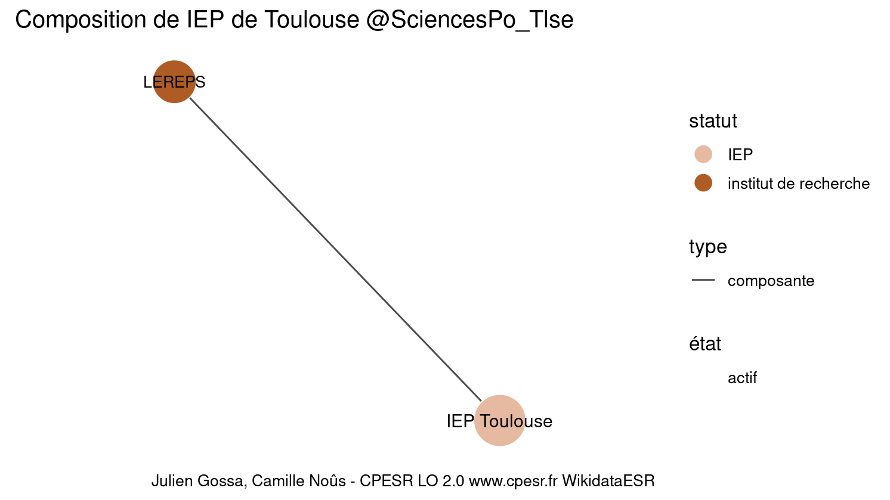

Warnings wikidataESR pour : IEP de Toulouse @SciencesPo_Tlse(01/09/2022
================

- Edition wikidata : [Q1664755](https://www.wikidata.org/wiki/Q1664755)
- Guide d'édition : [wikidataESR](https://github.com/cpesr/wikidataESR/)

- Discussion sur le guide d'édition : [github](https://github.com/cpesr/wikidataESR/issues)


## histoire 

 

 


Erreur : les données sont probablement trop partielles.
```
Error in wdesr_ggplot_graph(df, node_size = node_size, label_sizes = label_sizes, : Empty ESR graph: something went wrong with the graph production parameters

``` 


## composition 

 

Problèmes détectés dans les entités :

|entité                                               |alias  |statut                |message              |
|:----------------------------------------------------|:------|:---------------------|:--------------------|
|[Q63790134](https://www.wikidata.org/wiki/Q63790134) |LEREPS |institut de recherche |Statut trop imprécis |

 


## associations 

 

 


Erreur : les données sont probablement trop partielles.
```
Error in wdesr_ggplot_graph(df, node_size = node_size, label_sizes = label_sizes, : Empty ESR graph: something went wrong with the graph production parameters

``` 

