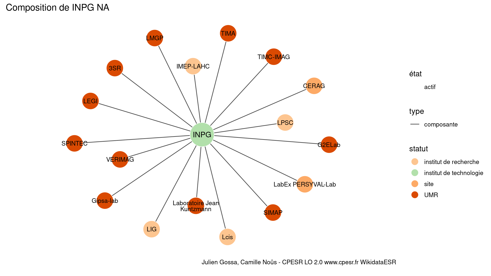

Warnings wikidataESR pour : INPG NA(10/11/2022
================

- Edition wikidata : [Q1665121](https://www.wikidata.org/wiki/Q1665121)
- Guide d'édition : [wikidataESR](https://github.com/cpesr/wikidataESR/)

- Discussion sur le guide d'édition : [github](https://github.com/cpesr/wikidataESR/issues)


## histoire 

 

Problèmes détectés dans les entités :

|entité                                             |alias |statut                  |message              |
|:--------------------------------------------------|:-----|:-----------------------|:--------------------|
|[Q1665121](https://www.wikidata.org/wiki/Q1665121) |INPG  |institut de technologie |Statut trop imprécis |

 


Erreur : les données sont probablement trop partielles.
```
Error in wdesr_ggplot_graph(df, node_size = node_size, label_sizes = label_sizes, : Empty ESR graph: something went wrong with the graph production parameters

``` 


## composition 

 

Problèmes détectés dans les entités :

|entité                                               |alias                      |statut                  |message                     |
|:----------------------------------------------------|:--------------------------|:-----------------------|:---------------------------|
|[Q1665121](https://www.wikidata.org/wiki/Q1665121)   |INPG                       |institut de technologie |Statut trop imprécis        |
|[Q3152051](https://www.wikidata.org/wiki/Q3152051)   |IMEP-LAHC                  |institut de recherche   |Statut trop imprécis        |
|[Q3214404](https://www.wikidata.org/wiki/Q3214404)   |LIG                        |institut de recherche   |Statut trop imprécis        |
|[Q30261567](https://www.wikidata.org/wiki/Q30261567) |CERAG                      |site                    |Statut trop imprécis        |
|[Q3214448](https://www.wikidata.org/wiki/Q3214448)   |Lcis                       |institut de recherche   |Statut trop imprécis        |
|[Q30262530](https://www.wikidata.org/wiki/Q30262530) |Laboratoire Jean Kuntzmann |UMR                     |Alias manquant ou long      |
|[Q6459743](https://www.wikidata.org/wiki/Q6459743)   |LPSC                       |institut de recherche   |Statut trop imprécis        |
|[Q33122106](https://www.wikidata.org/wiki/Q33122106) |LabEx PERSYVAL-Lab         |site                    |Statut trop imprécis        |
|[Q33122106](https://www.wikidata.org/wiki/Q33122106) |LabEx PERSYVAL-Lab         |site                    |Date de fondation manquante |

 


## associations 

 

Problèmes détectés dans les entités :

|entité                                             |alias |statut                  |message              |
|:--------------------------------------------------|:-----|:-----------------------|:--------------------|
|[Q1665121](https://www.wikidata.org/wiki/Q1665121) |INPG  |institut de technologie |Statut trop imprécis |

 


Erreur : les données sont probablement trop partielles.
```
Error in wdesr_ggplot_graph(df, node_size = node_size, label_sizes = label_sizes, : Empty ESR graph: something went wrong with the graph production parameters

``` 

