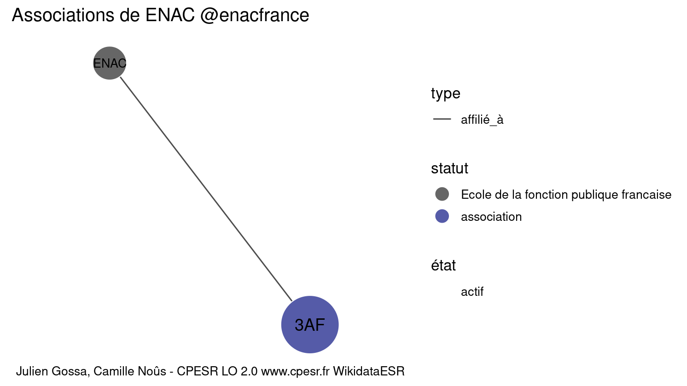

Warnings wikidataESR pour : ENAC @enacfrance(14/11/2021
================

- Edition wikidata : [Q174335](https://www.wikidata.org/wiki/Q174335)
- Guide d'édition : [wikidataESR](https://github.com/cpesr/wikidataESR/)

- Discussion sur le guide d'édition : [github](https://github.com/cpesr/wikidataESR/issues)


## histoire 

 

 


Erreur : les données sont probablement trop partielles.
```
Error in wdesr_ggplot_graph(df, node_size = node_size, label_sizes = label_sizes, : Empty ESR graph: something went wrong with the graph production parameters

``` 


## composition 

 

 


Erreur : les données sont probablement trop partielles.
```
Error in wdesr_ggplot_graph(df, node_size = node_size, label_sizes = label_sizes, : Empty ESR graph: something went wrong with the graph production parameters

``` 


## associations 

 

Problèmes détectés dans les entités :

|entité                                             |alias |statut       |message              |
|:--------------------------------------------------|:-----|:------------|:--------------------|
|[Q1052501](https://www.wikidata.org/wiki/Q1052501) |3AF   |organisation |Statut trop imprécis |

Problèmes détectés dans les relations :

|from                                             |to                                                 |type      |message              |
|:------------------------------------------------|:--------------------------------------------------|:---------|:--------------------|
|[Q174335](https://www.wikidata.org/wiki/Q174335) |[Q1052501](https://www.wikidata.org/wiki/Q1052501) |affilié_à |Date(s) manquante(s) |

NB : les dates manquantes pour les relations de composante ne sont pas remontées. 

