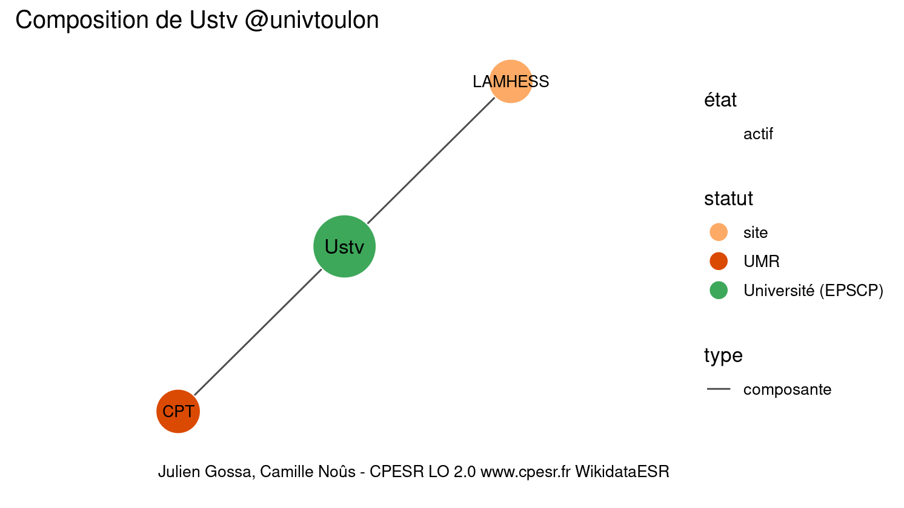

Warnings wikidataESR pour : Université de Toulon @univtoulon(30/12/2021
================

- Edition wikidata : [Q1816857](https://www.wikidata.org/wiki/Q1816857)
- Guide d'édition : [wikidataESR](https://github.com/cpesr/wikidataESR/)

- Discussion sur le guide d'édition : [github](https://github.com/cpesr/wikidataESR/issues)


## histoire 

 

 


Erreur : les données sont probablement trop partielles.
```
Error in wdesr_ggplot_graph(df, node_size = node_size, label_sizes = label_sizes, : Empty ESR graph: something went wrong with the graph production parameters

``` 


## composition 

 

Problèmes détectés dans les entités :

|entité                                               |alias   |statut |message              |
|:----------------------------------------------------|:-------|:------|:--------------------|
|[Q30262352](https://www.wikidata.org/wiki/Q30262352) |LAMHESS |site   |Statut trop imprécis |

 


## associations 

 

Problèmes détectés dans les entités :

|entité                                               |alias                                    |statut      |message                     |
|:----------------------------------------------------|:----------------------------------------|:-----------|:---------------------------|
|[Q61716142](https://www.wikidata.org/wiki/Q61716142) |Site AMPM                                |association |Statut trop imprécis        |
|[Q22916621](https://www.wikidata.org/wiki/Q22916621) |hôpital Sainte-Marthe d'Avignon          |hôpital     |Préférer CHU                |
|[Q22916621](https://www.wikidata.org/wiki/Q22916621) |hôpital Sainte-Marthe d'Avignon          |hôpital     |Alias manquant ou long      |
|[Q22916621](https://www.wikidata.org/wiki/Q22916621) |hôpital Sainte-Marthe d'Avignon          |hôpital     |Date de fondation manquante |
|[Q50126533](https://www.wikidata.org/wiki/Q50126533) |chapelle Sainte-Marthe                   |chapelle    |Alias manquant ou long      |
|[Q50126533](https://www.wikidata.org/wiki/Q50126533) |chapelle Sainte-Marthe                   |chapelle    |Date de fondation manquante |
|[Q850927](https://www.wikidata.org/wiki/Q850927)     |Union des universités de la Méditerranée |COMUE       |Alias manquant ou long      |
|[Q59682680](https://www.wikidata.org/wiki/Q59682680) |EU3M                                     |école       |Statut trop imprécis        |
|[Q59682680](https://www.wikidata.org/wiki/Q59682680) |EU3M                                     |école       |Date de fondation manquante |
|[Q2822270](https://www.wikidata.org/wiki/Q2822270)   |Académie d’Aix-Marseille                 |Académie    |Alias manquant ou long      |

Problèmes détectés dans les relations :

|from                                                 |to                                                   |type       |message              |
|:----------------------------------------------------|:----------------------------------------------------|:----------|:--------------------|
|[Q1816857](https://www.wikidata.org/wiki/Q1816857)   |[Q61716142](https://www.wikidata.org/wiki/Q61716142) |associé_de |Date(s) manquante(s) |
|[Q61716142](https://www.wikidata.org/wiki/Q61716142) |[Q2033119](https://www.wikidata.org/wiki/Q2033119)   |associé    |Date(s) manquante(s) |
|[Q61716142](https://www.wikidata.org/wiki/Q61716142) |[Q2302586](https://www.wikidata.org/wiki/Q2302586)   |associé    |Date(s) manquante(s) |
|[Q2033119](https://www.wikidata.org/wiki/Q2033119)   |[Q22916621](https://www.wikidata.org/wiki/Q22916621) |associé    |Date(s) manquante(s) |
|[Q22916621](https://www.wikidata.org/wiki/Q22916621) |[Q50126533](https://www.wikidata.org/wiki/Q50126533) |associé    |Date(s) manquante(s) |
|[Q2302586](https://www.wikidata.org/wiki/Q2302586)   |[Q850927](https://www.wikidata.org/wiki/Q850927)     |affilié_à  |Date(s) manquante(s) |
|[Q2302586](https://www.wikidata.org/wiki/Q2302586)   |[Q59682680](https://www.wikidata.org/wiki/Q59682680) |associé    |Date(s) manquante(s) |
|[Q2302586](https://www.wikidata.org/wiki/Q2302586)   |[Q2822270](https://www.wikidata.org/wiki/Q2822270)   |associé_de |Date(s) manquante(s) |

NB : les dates manquantes pour les relations de composante ne sont pas remontées. 

