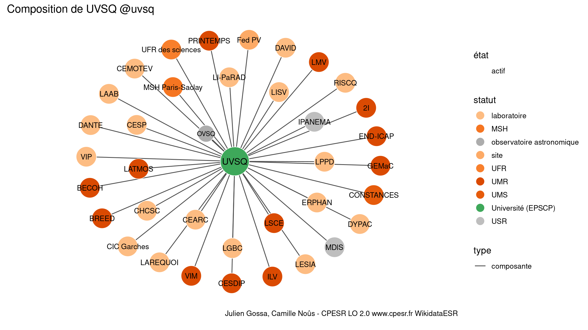

Warnings wikidataESR pour : UVSQ @uvsq(18/11/2021
================

- Edition wikidata : [Q186638](https://www.wikidata.org/wiki/Q186638)
- Guide d'édition : [wikidataESR](https://github.com/cpesr/wikidataESR/)

- Discussion sur le guide d'édition : [github](https://github.com/cpesr/wikidataESR/issues)


## histoire 

 

 


Erreur : les données sont probablement trop partielles.
```
Error in wdesr_ggplot_graph(df, node_size = node_size, label_sizes = label_sizes, : Empty ESR graph: something went wrong with the graph production parameters

``` 


## composition 

 

Problèmes détectés dans les entités :

|entité                                                 |alias            |statut      |message                     |
|:------------------------------------------------------|:----------------|:-----------|:---------------------------|
|[Q30262232](https://www.wikidata.org/wiki/Q30262232)   |CESP             |laboratoire |Statut trop imprécis        |
|[Q30262256](https://www.wikidata.org/wiki/Q30262256)   |Fed PV           |site        |Statut trop imprécis        |
|[Q104773040](https://www.wikidata.org/wiki/Q104773040) |UFR des sciences |UFR         |Date de fondation manquante |
|[Q109580465](https://www.wikidata.org/wiki/Q109580465) |BREED            |UMR         |Date de fondation manquante |
|[Q109584141](https://www.wikidata.org/wiki/Q109584141) |VIP              |laboratoire |Statut trop imprécis        |
|[Q109584141](https://www.wikidata.org/wiki/Q109584141) |VIP              |laboratoire |Date de fondation manquante |
|[Q29624201](https://www.wikidata.org/wiki/Q29624201)   |CEMOTEV          |laboratoire |Statut trop imprécis        |
|[Q47008419](https://www.wikidata.org/wiki/Q47008419)   |CHCSC            |laboratoire |Statut trop imprécis        |
|[Q109587112](https://www.wikidata.org/wiki/Q109587112) |CIC Garches      |laboratoire |Statut trop imprécis        |
|[Q109587112](https://www.wikidata.org/wiki/Q109587112) |CIC Garches      |laboratoire |Date de fondation manquante |
|[Q109587149](https://www.wikidata.org/wiki/Q109587149) |CONSTANCES       |UMR         |Date de fondation manquante |
|[Q51779969](https://www.wikidata.org/wiki/Q51779969)   |CEARC            |laboratoire |Statut trop imprécis        |
|[Q51785421](https://www.wikidata.org/wiki/Q51785421)   |DAVID            |laboratoire |Statut trop imprécis        |
|[Q51781188](https://www.wikidata.org/wiki/Q51781188)   |DYPAC            |laboratoire |Statut trop imprécis        |
|[Q109614029](https://www.wikidata.org/wiki/Q109614029) |ERPHAN           |laboratoire |Statut trop imprécis        |
|[Q109614029](https://www.wikidata.org/wiki/Q109614029) |ERPHAN           |laboratoire |Date de fondation manquante |
|[Q51782948](https://www.wikidata.org/wiki/Q51782948)   |IPANEMA          |laboratoire |Statut trop imprécis        |
|[Q109620268](https://www.wikidata.org/wiki/Q109620268) |LAAB             |laboratoire |Statut trop imprécis        |
|[Q109620268](https://www.wikidata.org/wiki/Q109620268) |LAAB             |laboratoire |Date de fondation manquante |
|[Q29625240](https://www.wikidata.org/wiki/Q29625240)   |DANTE            |laboratoire |Statut trop imprécis        |
|[Q29625240](https://www.wikidata.org/wiki/Q29625240)   |DANTE            |laboratoire |Date de fondation manquante |
|[Q51780035](https://www.wikidata.org/wiki/Q51780035)   |LGBC             |laboratoire |Statut trop imprécis        |
|[Q109620502](https://www.wikidata.org/wiki/Q109620502) |LAREQUOI         |laboratoire |Statut trop imprécis        |
|[Q109620502](https://www.wikidata.org/wiki/Q109620502) |LAREQUOI         |laboratoire |Date de fondation manquante |
|[Q109620610](https://www.wikidata.org/wiki/Q109620610) |LI-PaRAD         |laboratoire |Statut trop imprécis        |
|[Q109620610](https://www.wikidata.org/wiki/Q109620610) |LI-PaRAD         |laboratoire |Date de fondation manquante |
|[Q29606460](https://www.wikidata.org/wiki/Q29606460)   |LISV             |laboratoire |Statut trop imprécis        |
|[Q109620763](https://www.wikidata.org/wiki/Q109620763) |LPPD             |laboratoire |Statut trop imprécis        |
|[Q109620763](https://www.wikidata.org/wiki/Q109620763) |LPPD             |laboratoire |Date de fondation manquante |
|[Q51780617](https://www.wikidata.org/wiki/Q51780617)   |MDlS             |laboratoire |Statut trop imprécis        |
|[Q51780617](https://www.wikidata.org/wiki/Q51780617)   |MDlS             |laboratoire |Date de fondation manquante |
|[Q109620837](https://www.wikidata.org/wiki/Q109620837) |MSH Paris-Saclay |laboratoire |Statut trop imprécis        |
|[Q109620837](https://www.wikidata.org/wiki/Q109620837) |MSH Paris-Saclay |laboratoire |Date de fondation manquante |
|[Q51783930](https://www.wikidata.org/wiki/Q51783930)   |RISCQ            |laboratoire |Statut trop imprécis        |

 


## associations 

 

Problèmes détectés dans les entités :

|entité                                             |alias |statut                |message                                |
|:--------------------------------------------------|:-----|:---------------------|:--------------------------------------|
|[Q1156553](https://www.wikidata.org/wiki/Q1156553) |IHES  |institut de recherche |Statut trop imprécis                   |
|[Q898448](https://www.wikidata.org/wiki/Q898448)   |IOTA  |Grande ecole          |Réserver aux écoles non contemporaines |

Problèmes détectés dans les relations :

|from                                                   |to                                                     |type       |message              |
|:------------------------------------------------------|:------------------------------------------------------|:----------|:--------------------|
|[Q186638](https://www.wikidata.org/wiki/Q186638)       |[Q109409389](https://www.wikidata.org/wiki/Q109409389) |associé_de |Date(s) manquante(s) |
|[Q109409389](https://www.wikidata.org/wiki/Q109409389) |[Q280413](https://www.wikidata.org/wiki/Q280413)       |affilié_à  |Date(s) manquante(s) |
|[Q109409389](https://www.wikidata.org/wiki/Q109409389) |[Q1474517](https://www.wikidata.org/wiki/Q1474517)     |affilié_à  |Date(s) manquante(s) |
|[Q109409389](https://www.wikidata.org/wiki/Q109409389) |[Q70571774](https://www.wikidata.org/wiki/Q70571774)   |affilié_à  |Date(s) manquante(s) |
|[Q109409389](https://www.wikidata.org/wiki/Q109409389) |[Q1146208](https://www.wikidata.org/wiki/Q1146208)     |affilié_à  |Date(s) manquante(s) |
|[Q109409389](https://www.wikidata.org/wiki/Q109409389) |[Q868550](https://www.wikidata.org/wiki/Q868550)       |affilié_à  |Date(s) manquante(s) |
|[Q109409389](https://www.wikidata.org/wiki/Q109409389) |[Q2007769](https://www.wikidata.org/wiki/Q2007769)     |affilié_à  |Date(s) manquante(s) |
|[Q109409389](https://www.wikidata.org/wiki/Q109409389) |[Q1156553](https://www.wikidata.org/wiki/Q1156553)     |affilié_à  |Date(s) manquante(s) |
|[Q109409389](https://www.wikidata.org/wiki/Q109409389) |[Q19203245](https://www.wikidata.org/wiki/Q19203245)   |associé    |Date(s) manquante(s) |
|[Q109409389](https://www.wikidata.org/wiki/Q109409389) |[Q273604](https://www.wikidata.org/wiki/Q273604)       |associé    |Date(s) manquante(s) |
|[Q109409389](https://www.wikidata.org/wiki/Q109409389) |[Q898448](https://www.wikidata.org/wiki/Q898448)       |associé    |Date(s) manquante(s) |
|[Q109409389](https://www.wikidata.org/wiki/Q109409389) |[Q1637105](https://www.wikidata.org/wiki/Q1637105)     |associé    |Date(s) manquante(s) |
|[Q109409389](https://www.wikidata.org/wiki/Q109409389) |[Q1531014](https://www.wikidata.org/wiki/Q1531014)     |associé    |Date(s) manquante(s) |

NB : les dates manquantes pour les relations de composante ne sont pas remontées. 

