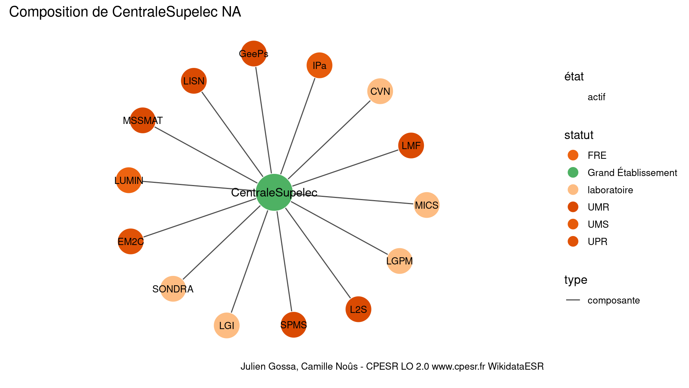
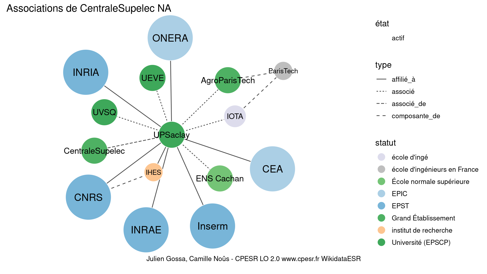

Warnings wikidataESR pour : CentraleSupelec NA(01/10/2023
================

- Edition wikidata : [Q19203245](https://www.wikidata.org/wiki/Q19203245)
- Guide d'édition : [wikidataESR](https://github.com/cpesr/wikidataESR/)

- Discussion sur le guide d'édition : [github](https://github.com/cpesr/wikidataESR/issues)


## histoire 

 

 


Erreur : les données sont probablement trop partielles.
```
Error in wdesr_ggplot_graph(df, node_size = node_size, label_sizes = label_sizes, : Empty ESR graph: something went wrong with the graph production parameters

``` 


## composition 

 

Problèmes détectés dans les entités :

|entité                                                 |alias  |statut      |message              |
|:------------------------------------------------------|:------|:-----------|:--------------------|
|[Q109584455](https://www.wikidata.org/wiki/Q109584455) |CVN    |laboratoire |Statut trop imprécis |
|[Q51786239](https://www.wikidata.org/wiki/Q51786239)   |LGPM   |laboratoire |Statut trop imprécis |
|[Q30262363](https://www.wikidata.org/wiki/Q30262363)   |LGI    |laboratoire |Statut trop imprécis |
|[Q51780222](https://www.wikidata.org/wiki/Q51780222)   |MICS   |laboratoire |Statut trop imprécis |
|[Q109621839](https://www.wikidata.org/wiki/Q109621839) |SONDRA |laboratoire |Statut trop imprécis |

 


## associations 

 

Problèmes détectés dans les entités :

|entité                                             |alias |statut                |message              |
|:--------------------------------------------------|:-----|:---------------------|:--------------------|
|[Q1156553](https://www.wikidata.org/wiki/Q1156553) |IHES  |institut de recherche |Statut trop imprécis |
|[Q898448](https://www.wikidata.org/wiki/Q898448)   |IOTA  |école d'ingé          |Statut trop imprécis |

Problèmes détectés dans les relations :

|depuis                                                 |vers                                                   |type       |message              |
|:------------------------------------------------------|:------------------------------------------------------|:----------|:--------------------|
|[Q19203245](https://www.wikidata.org/wiki/Q19203245)   |[Q109409389](https://www.wikidata.org/wiki/Q109409389) |associé_de |Date(s) manquante(s) |
|[Q109409389](https://www.wikidata.org/wiki/Q109409389) |[Q280413](https://www.wikidata.org/wiki/Q280413)       |affilié_à  |Date(s) manquante(s) |
|[Q109409389](https://www.wikidata.org/wiki/Q109409389) |[Q1474517](https://www.wikidata.org/wiki/Q1474517)     |affilié_à  |Date(s) manquante(s) |
|[Q109409389](https://www.wikidata.org/wiki/Q109409389) |[Q70571774](https://www.wikidata.org/wiki/Q70571774)   |affilié_à  |Date(s) manquante(s) |
|[Q109409389](https://www.wikidata.org/wiki/Q109409389) |[Q1146208](https://www.wikidata.org/wiki/Q1146208)     |affilié_à  |Date(s) manquante(s) |
|[Q109409389](https://www.wikidata.org/wiki/Q109409389) |[Q868550](https://www.wikidata.org/wiki/Q868550)       |affilié_à  |Date(s) manquante(s) |
|[Q109409389](https://www.wikidata.org/wiki/Q109409389) |[Q2007769](https://www.wikidata.org/wiki/Q2007769)     |affilié_à  |Date(s) manquante(s) |
|[Q109409389](https://www.wikidata.org/wiki/Q109409389) |[Q1156553](https://www.wikidata.org/wiki/Q1156553)     |affilié_à  |Date(s) manquante(s) |
|[Q109409389](https://www.wikidata.org/wiki/Q109409389) |[Q273604](https://www.wikidata.org/wiki/Q273604)       |associé    |Date(s) manquante(s) |
|[Q109409389](https://www.wikidata.org/wiki/Q109409389) |[Q898448](https://www.wikidata.org/wiki/Q898448)       |associé    |Date(s) manquante(s) |
|[Q109409389](https://www.wikidata.org/wiki/Q109409389) |[Q1637105](https://www.wikidata.org/wiki/Q1637105)     |associé    |Date(s) manquante(s) |
|[Q109409389](https://www.wikidata.org/wiki/Q109409389) |[Q186638](https://www.wikidata.org/wiki/Q186638)       |associé    |Date(s) manquante(s) |
|[Q109409389](https://www.wikidata.org/wiki/Q109409389) |[Q1531014](https://www.wikidata.org/wiki/Q1531014)     |associé    |Date(s) manquante(s) |

NB : les dates manquantes pour les relations de composante ne sont pas remontées. 

