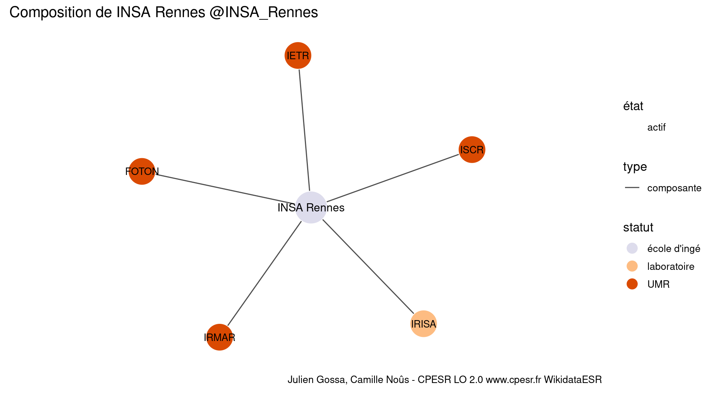

Warnings wikidataESR pour : INSA Rennes @INSA_Rennes(10/11/2022
================

- Edition wikidata : [Q1934614](https://www.wikidata.org/wiki/Q1934614)
- Guide d'édition : [wikidataESR](https://github.com/cpesr/wikidataESR/)

- Discussion sur le guide d'édition : [github](https://github.com/cpesr/wikidataESR/issues)


## histoire 

 

Problèmes détectés dans les entités :

|entité                                             |alias       |statut       |message              |
|:--------------------------------------------------|:-----------|:------------|:--------------------|
|[Q1934614](https://www.wikidata.org/wiki/Q1934614) |INSA Rennes |école d'ingé |Statut trop imprécis |

 


Erreur : les données sont probablement trop partielles.
```
Error in wdesr_ggplot_graph(df, node_size = node_size, label_sizes = label_sizes, : Empty ESR graph: something went wrong with the graph production parameters

``` 


## composition 

 

Problèmes détectés dans les entités :

|entité                                             |alias       |statut       |message              |
|:--------------------------------------------------|:-----------|:------------|:--------------------|
|[Q1934614](https://www.wikidata.org/wiki/Q1934614) |INSA Rennes |école d'ingé |Statut trop imprécis |
|[Q3152091](https://www.wikidata.org/wiki/Q3152091) |IRISA       |laboratoire  |Statut trop imprécis |

 


## associations 

 

Problèmes détectés dans les entités :

|entité                                             |alias       |statut       |message              |
|:--------------------------------------------------|:-----------|:------------|:--------------------|
|[Q1934614](https://www.wikidata.org/wiki/Q1934614) |INSA Rennes |école d'ingé |Statut trop imprécis |

 


Erreur : les données sont probablement trop partielles.
```
Error in wdesr_ggplot_graph(df, node_size = node_size, label_sizes = label_sizes, : Empty ESR graph: something went wrong with the graph production parameters

``` 

