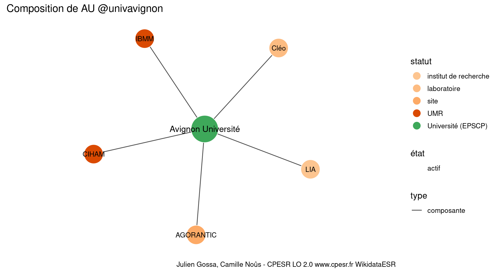

Warnings wikidataESR pour : AU @univavignon(01/10/2023
================

- Edition wikidata : [Q2033119](https://www.wikidata.org/wiki/Q2033119)
- Guide d'édition : [wikidataESR](https://github.com/cpesr/wikidataESR/)

- Discussion sur le guide d'édition : [github](https://github.com/cpesr/wikidataESR/issues)


## histoire 

 

 


Erreur : les données sont probablement trop partielles.
```
Error in wdesr_ggplot_graph(df, node_size = node_size, label_sizes = label_sizes, : Empty ESR graph: something went wrong with the graph production parameters

``` 


## composition 

 

Problèmes détectés dans les entités :

|entité                                               |alias     |statut                |message              |
|:----------------------------------------------------|:---------|:---------------------|:--------------------|
|[Q3214494](https://www.wikidata.org/wiki/Q3214494)   |LIA       |institut de recherche |Statut trop imprécis |
|[Q30274369](https://www.wikidata.org/wiki/Q30274369) |AGORANTIC |site                  |Statut trop imprécis |
|[Q2945983](https://www.wikidata.org/wiki/Q2945983)   |Cléo      |laboratoire           |Statut trop imprécis |

 


## associations 

 


Erreur : les données sont probablement trop partielles.
```
Error in ans[npos] <- rep(no, length.out = len)[npos]: l'argument de remplacement est de longueur nulle

``` 

