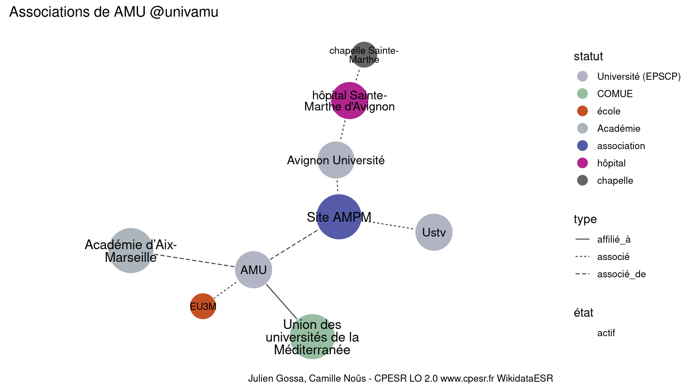

Warnings wikidataESR pour : AMU @univamu(10/11/2022
================

- Edition wikidata : [Q2302586](https://www.wikidata.org/wiki/Q2302586)
- Guide d'édition : [wikidataESR](https://github.com/cpesr/wikidataESR/)

- Discussion sur le guide d'édition : [github](https://github.com/cpesr/wikidataESR/issues)


## histoire 

 

Problèmes détectés dans les entités :

|entité                                               |alias                            |statut              |message                |
|:----------------------------------------------------|:--------------------------------|:-------------------|:----------------------|
|[Q1204304](https://www.wikidata.org/wiki/Q1204304)   |université Paul-Cézanne          |Université (EPSCP)  |Alias manquant ou long |
|[Q21592577](https://www.wikidata.org/wiki/Q21592577) |université de Marseille          |université          |Statut trop imprécis   |
|[Q21592577](https://www.wikidata.org/wiki/Q21592577) |université de Marseille          |université          |Alias manquant ou long |
|[Q95402368](https://www.wikidata.org/wiki/Q95402368) |faculté de médecine de Marseille |faculté de médecine |Alias manquant ou long |

Problèmes détectés dans les relations :

|depuis                                             |vers                                                 |type         |message              |
|:--------------------------------------------------|:----------------------------------------------------|:------------|:--------------------|
|[Q2302586](https://www.wikidata.org/wiki/Q2302586) |[Q1204304](https://www.wikidata.org/wiki/Q1204304)   |prédécesseur |Date(s) manquante(s) |
|[Q2302586](https://www.wikidata.org/wiki/Q2302586) |[Q1687719](https://www.wikidata.org/wiki/Q1687719)   |prédécesseur |Date(s) manquante(s) |
|[Q2302586](https://www.wikidata.org/wiki/Q2302586) |[Q180438](https://www.wikidata.org/wiki/Q180438)     |prédécesseur |Date(s) manquante(s) |
|[Q2302586](https://www.wikidata.org/wiki/Q2302586) |[Q3408271](https://www.wikidata.org/wiki/Q3408271)   |prédécesseur |Date(s) manquante(s) |
|[Q1204304](https://www.wikidata.org/wiki/Q1204304) |[Q21592577](https://www.wikidata.org/wiki/Q21592577) |prédécesseur |Date(s) manquante(s) |

NB : les dates manquantes pour les relations de composante ne sont pas remontées. 


## composition 

 

Problèmes détectés dans les entités :

|entité                                               |alias                                                                              |statut                     |message                     |
|:----------------------------------------------------|:----------------------------------------------------------------------------------|:--------------------------|:---------------------------|
|[Q5062335](https://www.wikidata.org/wiki/Q5062335)   |CIML                                                                               |institut de recherche      |Statut trop imprécis        |
|[Q30261323](https://www.wikidata.org/wiki/Q30261323) |INMED                                                                              |site                       |Statut trop imprécis        |
|[Q3151741](https://www.wikidata.org/wiki/Q3151741)   |Institut Fresnel                                                                   |laboratoire                |Statut trop imprécis        |
|[Q30261471](https://www.wikidata.org/wiki/Q30261471) |INS                                                                                |site                       |Statut trop imprécis        |
|[Q3214382](https://www.wikidata.org/wiki/Q3214382)   |LPL                                                                                |institut de recherche      |Statut trop imprécis        |
|[Q30261587](https://www.wikidata.org/wiki/Q30261587) |LNC                                                                                |laboratoire                |Statut trop imprécis        |
|[Q3214412](https://www.wikidata.org/wiki/Q3214412)   |LAM                                                                                |institut de recherche      |Statut trop imprécis        |
|[Q2945402](https://www.wikidata.org/wiki/Q2945402)   |CRCM                                                                               |institut de recherche      |Statut trop imprécis        |
|[Q30262256](https://www.wikidata.org/wiki/Q30262256) |Fed PV                                                                             |site                       |Statut trop imprécis        |
|[Q30262258](https://www.wikidata.org/wiki/Q30262258) |GIMP                                                                               |site                       |Statut trop imprécis        |
|[Q30262259](https://www.wikidata.org/wiki/Q30262259) |Génétique Médicale & Génomique Fonctionelle                                        |site                       |Statut trop imprécis        |
|[Q30262259](https://www.wikidata.org/wiki/Q30262259) |Génétique Médicale & Génomique Fonctionelle                                        |site                       |Alias manquant ou long      |
|[Q30262259](https://www.wikidata.org/wiki/Q30262259) |Génétique Médicale & Génomique Fonctionelle                                        |site                       |Date de fondation manquante |
|[Q30262423](https://www.wikidata.org/wiki/Q30262423) |Sciences Economiques & Sociales de la Santé & Traitement de l'Information Médicale |site                       |Statut trop imprécis        |
|[Q30262423](https://www.wikidata.org/wiki/Q30262423) |Sciences Economiques & Sociales de la Santé & Traitement de l'Information Médicale |site                       |Alias manquant ou long      |
|[Q30262474](https://www.wikidata.org/wiki/Q30262474) |UNIS                                                                               |site                       |Statut trop imprécis        |
|[Q3497442](https://www.wikidata.org/wiki/Q3497442)   |Station Marine d'Endoume                                                           |station de biologie marine |Alias manquant ou long      |
|[Q30265862](https://www.wikidata.org/wiki/Q30265862) |OSU                                                                                |site                       |Statut trop imprécis        |
|[Q30274355](https://www.wikidata.org/wiki/Q30274355) |IRAA                                                                               |site                       |Statut trop imprécis        |
|[Q2945983](https://www.wikidata.org/wiki/Q2945983)   |Cléo                                                                               |laboratoire                |Statut trop imprécis        |

 


## associations 

 


Erreur : les données sont probablement trop partielles.
```
Error in ans[npos] <- rep(no, length.out = len)[npos]: l'argument de remplacement est de longueur nulle

``` 

