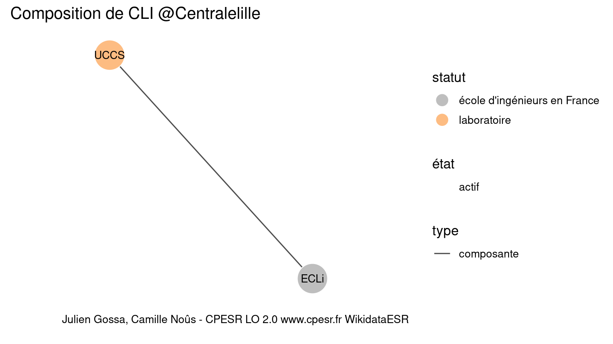

Warnings wikidataESR pour : CLI @Centralelille(10/11/2022
================

- Edition wikidata : [Q273461](https://www.wikidata.org/wiki/Q273461)
- Guide d'édition : [wikidataESR](https://github.com/cpesr/wikidataESR/)

- Discussion sur le guide d'édition : [github](https://github.com/cpesr/wikidataESR/issues)


## histoire 

 

 


Erreur : les données sont probablement trop partielles.
```
Error in wdesr_ggplot_graph(df, node_size = node_size, label_sizes = label_sizes, : Empty ESR graph: something went wrong with the graph production parameters

``` 


## composition 

 

Problèmes détectés dans les entités :

|entité                                             |alias |statut      |message              |
|:--------------------------------------------------|:-----|:-----------|:--------------------|
|[Q3214445](https://www.wikidata.org/wiki/Q3214445) |UCCS  |laboratoire |Statut trop imprécis |

 


## associations 

 

Problèmes détectés dans les entités :

|entité                                             |alias                   |statut                 |message                |
|:--------------------------------------------------|:-----------------------|:----------------------|:----------------------|
|[Q10177](https://www.wikidata.org/wiki/Q10177)     |ECL                     |école d'ingé           |Statut trop imprécis   |
|[Q273458](https://www.wikidata.org/wiki/Q273458)   |Centrale nantes         |école d'ingé           |Statut trop imprécis   |
|[Q3577735](https://www.wikidata.org/wiki/Q3577735) |École Centrale de Pékin |institut universitaire |Statut trop imprécis   |
|[Q3577735](https://www.wikidata.org/wiki/Q3577735) |École Centrale de Pékin |institut universitaire |Alias manquant ou long |

Problèmes détectés dans les relations :

|depuis                                           |vers                                               |type          |message              |
|:------------------------------------------------|:--------------------------------------------------|:-------------|:--------------------|
|[Q10177](https://www.wikidata.org/wiki/Q10177)   |[Q10176](https://www.wikidata.org/wiki/Q10176)     |composante_de |Relation multiple    |
|[Q10177](https://www.wikidata.org/wiki/Q10177)   |[Q10176](https://www.wikidata.org/wiki/Q10176)     |associé_de    |Relation multiple    |
|[Q273461](https://www.wikidata.org/wiki/Q273461) |[Q273649](https://www.wikidata.org/wiki/Q273649)   |associé_de    |Date(s) manquante(s) |
|[Q273649](https://www.wikidata.org/wiki/Q273649) |[Q10177](https://www.wikidata.org/wiki/Q10177)     |associé       |Date(s) manquante(s) |
|[Q273649](https://www.wikidata.org/wiki/Q273649) |[Q273454](https://www.wikidata.org/wiki/Q273454)   |associé       |Date(s) manquante(s) |
|[Q273649](https://www.wikidata.org/wiki/Q273649) |[Q273458](https://www.wikidata.org/wiki/Q273458)   |associé       |Date(s) manquante(s) |
|[Q273649](https://www.wikidata.org/wiki/Q273649) |[Q3577735](https://www.wikidata.org/wiki/Q3577735) |associé       |Date(s) manquante(s) |
|[Q10177](https://www.wikidata.org/wiki/Q10177)   |[Q10176](https://www.wikidata.org/wiki/Q10176)     |associé_de    |Date(s) manquante(s) |

NB : les dates manquantes pour les relations de composante ne sont pas remontées. 

