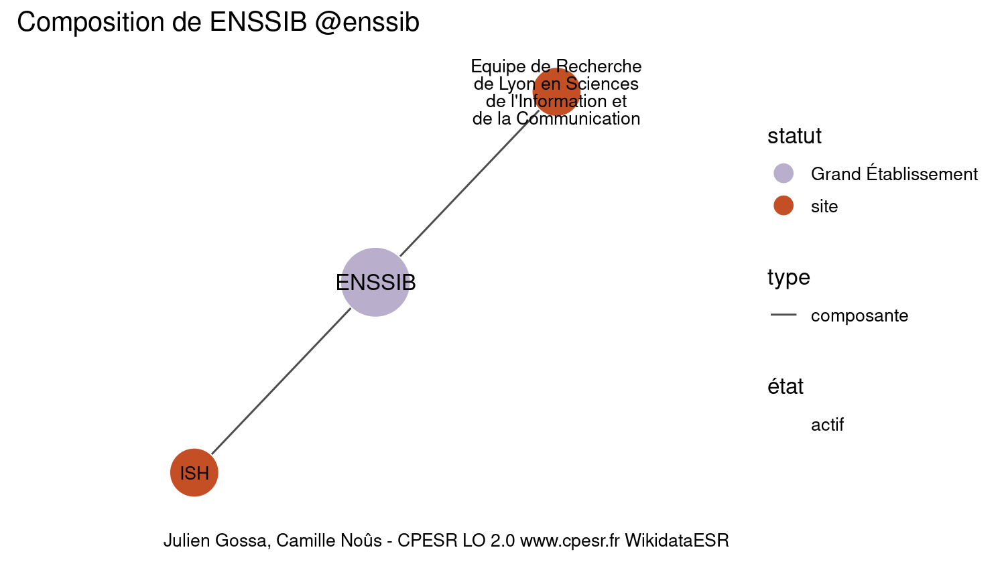

Warnings wikidataESR pour : École nationale supérieure des sciences de l'information et des bibliothèques @enssib(13/11/2021
================

- Edition wikidata : [Q2791269](https://www.wikidata.org/wiki/Q2791269)
- Guide d'édition : [wikidataESR](https://github.com/cpesr/wikidataESR/)

- Discussion sur le guide d'édition : [github](https://github.com/cpesr/wikidataESR/issues)


## histoire 

 

 


Erreur : les données sont probablement trop partielles.
```
Error in wdesr_ggplot_graph(df, node_size = node_size, label_sizes = label_sizes, : Empty ESR graph: something went wrong with the graph production parameters

``` 


## composition 

 

Problèmes détectés dans les entités :

|entité                                               |alias                                                                           |statut |message                |
|:----------------------------------------------------|:-------------------------------------------------------------------------------|:------|:----------------------|
|[Q30274356](https://www.wikidata.org/wiki/Q30274356) |ISH                                                                             |site   |Statut trop imprécis   |
|[Q30274351](https://www.wikidata.org/wiki/Q30274351) |Equipe de Recherche de Lyon en Sciences de l'Information et de la Communication |site   |Statut trop imprécis   |
|[Q30274351](https://www.wikidata.org/wiki/Q30274351) |Equipe de Recherche de Lyon en Sciences de l'Information et de la Communication |site   |Alias manquant ou long |

 


## associations 

 

 


Erreur : les données sont probablement trop partielles.
```
Error in wdesr_ggplot_graph(df, node_size = node_size, label_sizes = label_sizes, : Empty ESR graph: something went wrong with the graph production parameters

``` 

