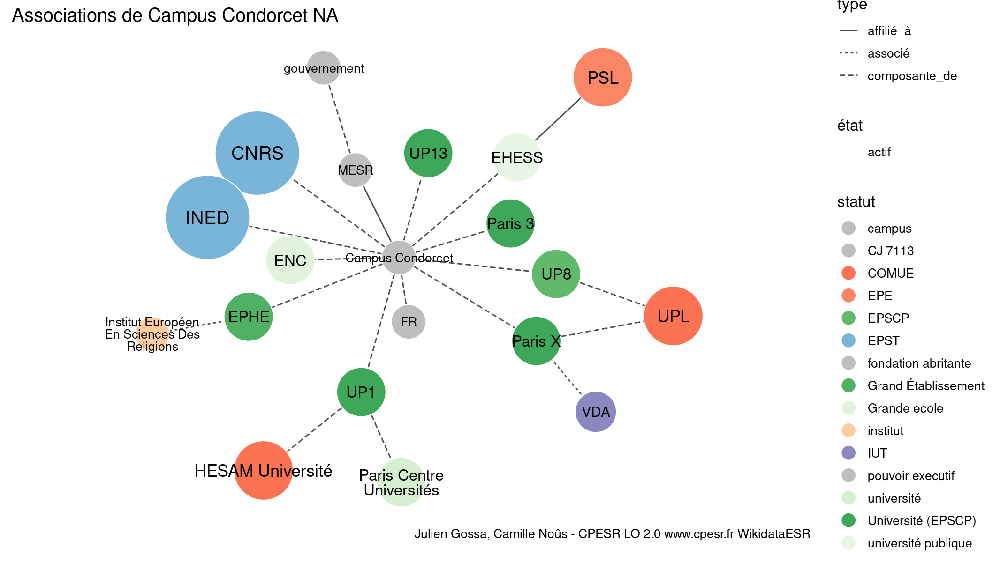

Warnings wikidataESR pour : Campus Condorcet NA(10/11/2022
================

- Edition wikidata : [Q2935605](https://www.wikidata.org/wiki/Q2935605)
- Guide d'édition : [wikidataESR](https://github.com/cpesr/wikidataESR/)

- Discussion sur le guide d'édition : [github](https://github.com/cpesr/wikidataESR/issues)


## histoire 

 

 


Erreur : les données sont probablement trop partielles.
```
Error in wdesr_ggplot_graph(df, node_size = node_size, label_sizes = label_sizes, : Empty ESR graph: something went wrong with the graph production parameters

``` 


## composition 

 

 


Erreur : les données sont probablement trop partielles.
```
Error in wdesr_ggplot_graph(df, node_size = node_size, label_sizes = label_sizes, : Empty ESR graph: something went wrong with the graph production parameters

``` 


## associations 

 

Problèmes détectés dans les entités :

|entité                                             |alias                                       |statut              |message                                |
|:--------------------------------------------------|:-------------------------------------------|:-------------------|:--------------------------------------|
|[Q273518](https://www.wikidata.org/wiki/Q273518)   |EHESS                                       |université publique |Statut trop imprécis                   |
|[Q1163431](https://www.wikidata.org/wiki/Q1163431) |PSL                                         |EPE                 |Préférer Q77979904                     |
|[Q3365251](https://www.wikidata.org/wiki/Q3365251) |Paris Centre Universités                    |université          |Statut trop imprécis                   |
|[Q3365251](https://www.wikidata.org/wiki/Q3365251) |Paris Centre Universités                    |université          |Alias manquant ou long                 |
|[Q273570](https://www.wikidata.org/wiki/Q273570)   |ENC                                         |Grande ecole        |Réserver aux écoles non contemporaines |
|[Q3152242](https://www.wikidata.org/wiki/Q3152242) |Institut Européen En Sciences Des Religions |institut            |Statut trop imprécis                   |
|[Q3152242](https://www.wikidata.org/wiki/Q3152242) |Institut Européen En Sciences Des Religions |institut            |Alias manquant ou long                 |
|[Q1450662](https://www.wikidata.org/wiki/Q1450662) |gouvernement                                |pouvoir executif    |Date de fondation manquante            |

Problèmes détectés dans les relations :

|depuis                                             |vers                                                   |type      |message              |
|:--------------------------------------------------|:------------------------------------------------------|:---------|:--------------------|
|[Q273518](https://www.wikidata.org/wiki/Q273518)   |[Q1163431](https://www.wikidata.org/wiki/Q1163431)     |affilié_à |Date(s) manquante(s) |
|[Q1394262](https://www.wikidata.org/wiki/Q1394262) |[Q113801431](https://www.wikidata.org/wiki/Q113801431) |associé   |Date(s) manquante(s) |
|[Q273631](https://www.wikidata.org/wiki/Q273631)   |[Q3152242](https://www.wikidata.org/wiki/Q3152242)     |associé   |Date(s) manquante(s) |
|[Q2935605](https://www.wikidata.org/wiki/Q2935605) |[Q2726949](https://www.wikidata.org/wiki/Q2726949)     |affilié_à |Date(s) manquante(s) |

NB : les dates manquantes pour les relations de composante ne sont pas remontées. 

