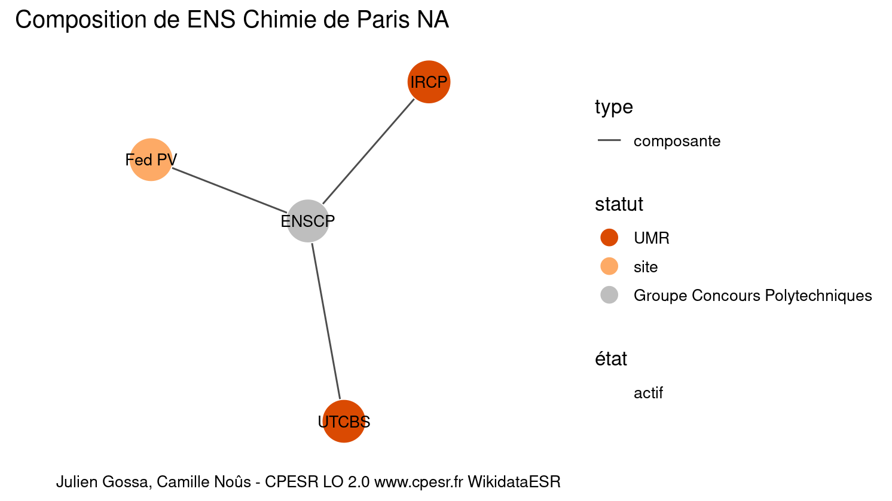
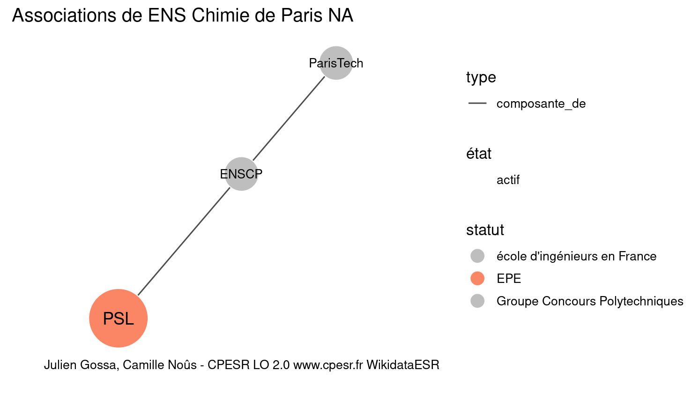

Warnings wikidataESR pour : ENS Chimie de Paris NA(10/11/2022
================

- Edition wikidata : [Q2963665](https://www.wikidata.org/wiki/Q2963665)
- Guide d'édition : [wikidataESR](https://github.com/cpesr/wikidataESR/)

- Discussion sur le guide d'édition : [github](https://github.com/cpesr/wikidataESR/issues)


## histoire 

 

 


Erreur : les données sont probablement trop partielles.
```
Error in wdesr_ggplot_graph(df, node_size = node_size, label_sizes = label_sizes, : Empty ESR graph: something went wrong with the graph production parameters

``` 


## composition 

 

Problèmes détectés dans les entités :

|entité                                               |alias  |statut |message              |
|:----------------------------------------------------|:------|:------|:--------------------|
|[Q30262256](https://www.wikidata.org/wiki/Q30262256) |Fed PV |site   |Statut trop imprécis |

 


## associations 

 

Problèmes détectés dans les entités :

|entité                                             |alias |statut |message            |
|:--------------------------------------------------|:-----|:------|:------------------|
|[Q1163431](https://www.wikidata.org/wiki/Q1163431) |PSL   |EPE    |Préférer Q77979904 |

 

