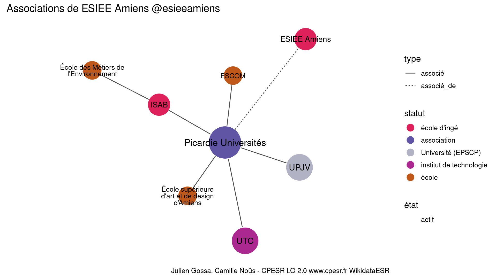

Warnings wikidataESR pour : ESIEE Amiens @esieeamiens(01/09/2022
================

- Edition wikidata : [Q3046116](https://www.wikidata.org/wiki/Q3046116)
- Guide d'édition : [wikidataESR](https://github.com/cpesr/wikidataESR/)

- Discussion sur le guide d'édition : [github](https://github.com/cpesr/wikidataESR/issues)


## histoire 

 

Problèmes détectés dans les entités :

|entité                                             |alias        |statut       |message              |
|:--------------------------------------------------|:------------|:------------|:--------------------|
|[Q3046116](https://www.wikidata.org/wiki/Q3046116) |ESIEE Amiens |école d'ingé |Statut trop imprécis |

 


Erreur : les données sont probablement trop partielles.
```
Error in wdesr_ggplot_graph(df, node_size = node_size, label_sizes = label_sizes, : Empty ESR graph: something went wrong with the graph production parameters

``` 


## composition 

 

Problèmes détectés dans les entités :

|entité                                             |alias        |statut       |message              |
|:--------------------------------------------------|:------------|:------------|:--------------------|
|[Q3046116](https://www.wikidata.org/wiki/Q3046116) |ESIEE Amiens |école d'ingé |Statut trop imprécis |

 


Erreur : les données sont probablement trop partielles.
```
Error in wdesr_ggplot_graph(df, node_size = node_size, label_sizes = label_sizes, : Empty ESR graph: something went wrong with the graph production parameters

``` 


## associations 

 

Problèmes détectés dans les entités :

|entité                                               |alias                                        |statut                  |message                |
|:----------------------------------------------------|:--------------------------------------------|:-----------------------|:----------------------|
|[Q3046116](https://www.wikidata.org/wiki/Q3046116)   |ESIEE Amiens                                 |école d'ingé            |Statut trop imprécis   |
|[Q61716197](https://www.wikidata.org/wiki/Q61716197) |Picardie Universités                         |association             |Statut trop imprécis   |
|[Q61716197](https://www.wikidata.org/wiki/Q61716197) |Picardie Universités                         |association             |Alias manquant ou long |
|[Q622906](https://www.wikidata.org/wiki/Q622906)     |UTC                                          |institut de technologie |Statut trop imprécis   |
|[Q3152468](https://www.wikidata.org/wiki/Q3152468)   |ISAB                                         |école d'ingé            |Statut trop imprécis   |
|[Q3577942](https://www.wikidata.org/wiki/Q3577942)   |École des Métiers de l'Environnement         |école                   |Statut trop imprécis   |
|[Q3577942](https://www.wikidata.org/wiki/Q3577942)   |École des Métiers de l'Environnement         |école                   |Alias manquant ou long |
|[Q3578426](https://www.wikidata.org/wiki/Q3578426)   |ESCOM                                        |école                   |Statut trop imprécis   |
|[Q3578393](https://www.wikidata.org/wiki/Q3578393)   |École supérieure d'art et de design d'Amiens |école                   |Statut trop imprécis   |
|[Q3578393](https://www.wikidata.org/wiki/Q3578393)   |École supérieure d'art et de design d'Amiens |école                   |Alias manquant ou long |

Problèmes détectés dans les relations :

|depuis                                               |vers                                                 |type       |message              |
|:----------------------------------------------------|:----------------------------------------------------|:----------|:--------------------|
|[Q3046116](https://www.wikidata.org/wiki/Q3046116)   |[Q61716197](https://www.wikidata.org/wiki/Q61716197) |associé_de |Date(s) manquante(s) |
|[Q61716197](https://www.wikidata.org/wiki/Q61716197) |[Q947747](https://www.wikidata.org/wiki/Q947747)     |associé    |Date(s) manquante(s) |
|[Q61716197](https://www.wikidata.org/wiki/Q61716197) |[Q622906](https://www.wikidata.org/wiki/Q622906)     |associé    |Date(s) manquante(s) |
|[Q61716197](https://www.wikidata.org/wiki/Q61716197) |[Q3152468](https://www.wikidata.org/wiki/Q3152468)   |associé    |Date(s) manquante(s) |
|[Q61716197](https://www.wikidata.org/wiki/Q61716197) |[Q3578426](https://www.wikidata.org/wiki/Q3578426)   |associé    |Date(s) manquante(s) |
|[Q61716197](https://www.wikidata.org/wiki/Q61716197) |[Q3578393](https://www.wikidata.org/wiki/Q3578393)   |associé    |Date(s) manquante(s) |
|[Q3152468](https://www.wikidata.org/wiki/Q3152468)   |[Q3577942](https://www.wikidata.org/wiki/Q3577942)   |associé    |Date(s) manquante(s) |

NB : les dates manquantes pour les relations de composante ne sont pas remontées. 

