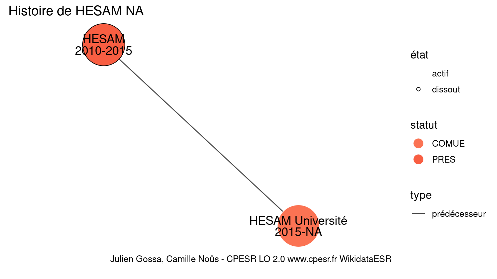
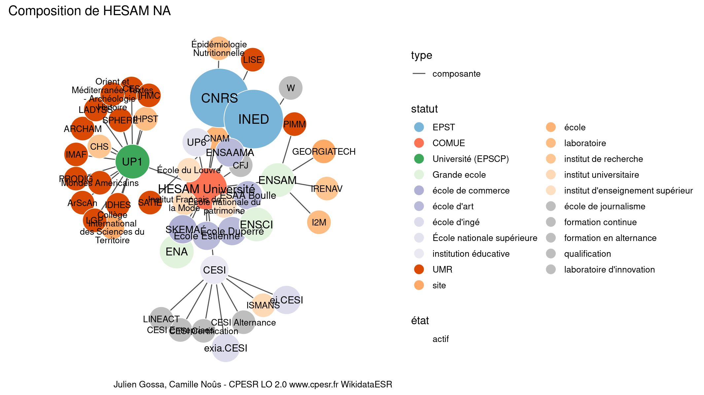

Warnings wikidataESR pour : HESAM NA(01/10/2023
================

- Edition wikidata : [Q3128622](https://www.wikidata.org/wiki/Q3128622)
- Guide d'édition : [wikidataESR](https://github.com/cpesr/wikidataESR/)

- Discussion sur le guide d'édition : [github](https://github.com/cpesr/wikidataESR/issues)


## histoire 

 

Problèmes détectés dans les relations :

|depuis                                             |vers                                                 |type         |message              |
|:--------------------------------------------------|:----------------------------------------------------|:------------|:--------------------|
|[Q3128622](https://www.wikidata.org/wiki/Q3128622) |[Q64760804](https://www.wikidata.org/wiki/Q64760804) |prédécesseur |Date(s) manquante(s) |

NB : les dates manquantes pour les relations de composante ne sont pas remontées. 


## composition 

 

Problèmes détectés dans les entités :

|entité                                               |alias                                                   |statut                            |message                                |
|:----------------------------------------------------|:-------------------------------------------------------|:---------------------------------|:--------------------------------------|
|[Q273534](https://www.wikidata.org/wiki/Q273534)     |École du Louvre                                         |institut d'enseignement supérieur |Statut trop imprécis                   |
|[Q273579](https://www.wikidata.org/wiki/Q273579)     |ENA                                                     |Grande ecole                      |Réserver aux écoles non contemporaines |
|[Q524289](https://www.wikidata.org/wiki/Q524289)     |CNAM                                                    |école                             |Statut trop imprécis                   |
|[Q28530728](https://www.wikidata.org/wiki/Q28530728) |Équipe de recherche en épidémiologie nutritionnelle     |laboratoire                       |Statut trop imprécis                   |
|[Q28530728](https://www.wikidata.org/wiki/Q28530728) |Équipe de recherche en épidémiologie nutritionnelle     |laboratoire                       |Alias manquant ou long                 |
|[Q3578185](https://www.wikidata.org/wiki/Q3578185)   |UP6                                                     |École nationale supérieure        |Confusion avec les ENS                 |
|[Q870925](https://www.wikidata.org/wiki/Q870925)     |ENSCI                                                   |Grande ecole                      |Réserver aux écoles non contemporaines |
|[Q2570220](https://www.wikidata.org/wiki/Q2570220)   |ENSAM                                                   |Grande ecole                      |Réserver aux écoles non contemporaines |
|[Q15967309](https://www.wikidata.org/wiki/Q15967309) |I2M                                                     |laboratoire                       |Statut trop imprécis                   |
|[Q30262481](https://www.wikidata.org/wiki/Q30262481) |GEORGIATECH                                             |site                              |Statut trop imprécis                   |
|[Q15918389](https://www.wikidata.org/wiki/Q15918389) |IRENAV                                                  |institut de recherche             |Statut trop imprécis                   |
|[Q3152445](https://www.wikidata.org/wiki/Q3152445)   |École nationale du patrimoine                           |institut d'enseignement supérieur |Statut trop imprécis                   |
|[Q3152445](https://www.wikidata.org/wiki/Q3152445)   |École nationale du patrimoine                           |institut d'enseignement supérieur |Alias manquant ou long                 |
|[Q16643681](https://www.wikidata.org/wiki/Q16643681) |IHPST                                                   |laboratoire                       |Statut trop imprécis                   |
|[Q30262271](https://www.wikidata.org/wiki/Q30262271) |Collège International des Sciences du Territoire        |site                              |Statut trop imprécis                   |
|[Q30262271](https://www.wikidata.org/wiki/Q30262271) |Collège International des Sciences du Territoire        |site                              |Alias manquant ou long                 |
|[Q30262398](https://www.wikidata.org/wiki/Q30262398) |Orient et Méditerranée, Textes - Archéologie - Histoire |UMR                               |Alias manquant ou long                 |
|[Q2945114](https://www.wikidata.org/wiki/Q2945114)   |CHS                                                     |institut de recherche             |Statut trop imprécis                   |
|[Q2944853](https://www.wikidata.org/wiki/Q2944853)   |centre Pierre-Mendès-France                             |immeuble                          |Alias manquant ou long                 |
|[Q3152284](https://www.wikidata.org/wiki/Q3152284)   |Institut Français de la Mode                            |institut universitaire            |Statut trop imprécis                   |
|[Q3152284](https://www.wikidata.org/wiki/Q3152284)   |Institut Français de la Mode                            |institut universitaire            |Alias manquant ou long                 |
|[Q30255548](https://www.wikidata.org/wiki/Q30255548) |CESI                                                    |institution éducative             |Statut trop imprécis                   |
|[Q56185089](https://www.wikidata.org/wiki/Q56185089) |ei.CESI                                                 |école d'ingé                      |Statut trop imprécis                   |
|[Q56185249](https://www.wikidata.org/wiki/Q56185249) |exia.CESI                                               |école d'ingé                      |Statut trop imprécis                   |
|[Q3152596](https://www.wikidata.org/wiki/Q3152596)   |ISMANS                                                  |institut universitaire            |Statut trop imprécis                   |

 


## associations 

 

 


Erreur : les données sont probablement trop partielles.
```
Error in wdesr_ggplot_graph(df, node_size = node_size, label_sizes = label_sizes, : Empty ESR graph: something went wrong with the graph production parameters

``` 

