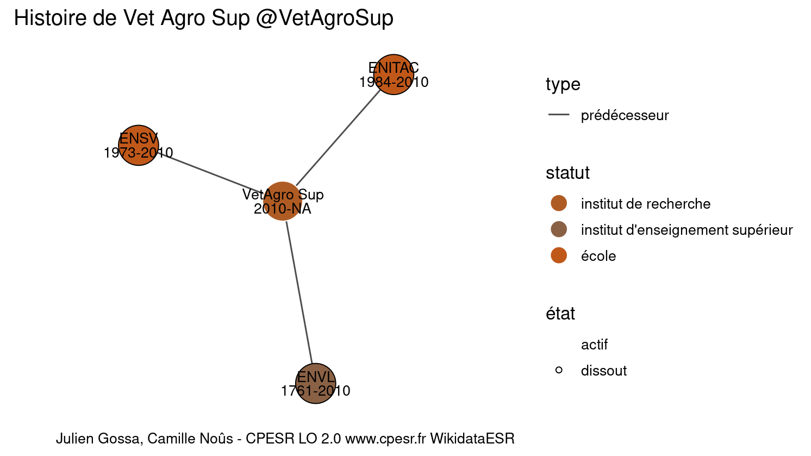

Warnings wikidataESR pour : Vet Agro Sup @VetAgroSup(01/09/2022
================

- Edition wikidata : [Q3151920](https://www.wikidata.org/wiki/Q3151920)
- Guide d'édition : [wikidataESR](https://github.com/cpesr/wikidataESR/)

- Discussion sur le guide d'édition : [github](https://github.com/cpesr/wikidataESR/issues)


## histoire 

 

Problèmes détectés dans les entités :

|entité                                             |alias       |statut                            |message              |
|:--------------------------------------------------|:-----------|:---------------------------------|:--------------------|
|[Q3151920](https://www.wikidata.org/wiki/Q3151920) |VetAgro Sup |institut de recherche             |Statut trop imprécis |
|[Q3578270](https://www.wikidata.org/wiki/Q3578270) |ENVL        |institut d'enseignement supérieur |Statut trop imprécis |
|[Q3578100](https://www.wikidata.org/wiki/Q3578100) |ENITAC      |école                             |Statut trop imprécis |
|[Q3578151](https://www.wikidata.org/wiki/Q3578151) |ENSV        |école                             |Statut trop imprécis |

Problèmes détectés dans les relations :

|depuis                                             |vers                                               |type         |message              |
|:--------------------------------------------------|:--------------------------------------------------|:------------|:--------------------|
|[Q3151920](https://www.wikidata.org/wiki/Q3151920) |[Q3578270](https://www.wikidata.org/wiki/Q3578270) |prédécesseur |Date(s) manquante(s) |
|[Q3151920](https://www.wikidata.org/wiki/Q3151920) |[Q3578100](https://www.wikidata.org/wiki/Q3578100) |prédécesseur |Date(s) manquante(s) |
|[Q3151920](https://www.wikidata.org/wiki/Q3151920) |[Q3578151](https://www.wikidata.org/wiki/Q3578151) |prédécesseur |Date(s) manquante(s) |

NB : les dates manquantes pour les relations de composante ne sont pas remontées. 


## composition 

 

Problèmes détectés dans les entités :

|entité                                             |alias       |statut                |message              |
|:--------------------------------------------------|:-----------|:---------------------|:--------------------|
|[Q3151920](https://www.wikidata.org/wiki/Q3151920) |VetAgro Sup |institut de recherche |Statut trop imprécis |

 


## associations 

 

Problèmes détectés dans les entités :

|entité                                             |alias       |statut                |message              |
|:--------------------------------------------------|:-----------|:---------------------|:--------------------|
|[Q3151920](https://www.wikidata.org/wiki/Q3151920) |VetAgro Sup |institut de recherche |Statut trop imprécis |

 


Erreur : les données sont probablement trop partielles.
```
Error in wdesr_ggplot_graph(df, node_size = node_size, label_sizes = label_sizes, : Empty ESR graph: something went wrong with the graph production parameters

``` 

