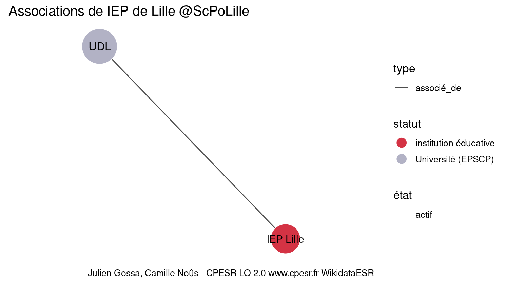

Warnings wikidataESR pour : IEP de Lille @ScPoLille(01/09/2022
================

- Edition wikidata : [Q3151958](https://www.wikidata.org/wiki/Q3151958)
- Guide d'édition : [wikidataESR](https://github.com/cpesr/wikidataESR/)

- Discussion sur le guide d'édition : [github](https://github.com/cpesr/wikidataESR/issues)


## histoire 

 

Problèmes détectés dans les entités :

|entité                                             |alias     |statut                |message              |
|:--------------------------------------------------|:---------|:---------------------|:--------------------|
|[Q3151958](https://www.wikidata.org/wiki/Q3151958) |IEP Lille |institution éducative |Statut trop imprécis |

 


Erreur : les données sont probablement trop partielles.
```
Error in wdesr_ggplot_graph(df, node_size = node_size, label_sizes = label_sizes, : Empty ESR graph: something went wrong with the graph production parameters

``` 


## composition 

 

Problèmes détectés dans les entités :

|entité                                             |alias     |statut                |message              |
|:--------------------------------------------------|:---------|:---------------------|:--------------------|
|[Q3151958](https://www.wikidata.org/wiki/Q3151958) |IEP Lille |institution éducative |Statut trop imprécis |

 


Erreur : les données sont probablement trop partielles.
```
Error in wdesr_ggplot_graph(df, node_size = node_size, label_sizes = label_sizes, : Empty ESR graph: something went wrong with the graph production parameters

``` 


## associations 

 

Problèmes détectés dans les entités :

|entité                                             |alias     |statut                |message              |
|:--------------------------------------------------|:---------|:---------------------|:--------------------|
|[Q3151958](https://www.wikidata.org/wiki/Q3151958) |IEP Lille |institution éducative |Statut trop imprécis |

Problèmes détectés dans les relations :

|depuis                                             |vers                                               |type       |message              |
|:--------------------------------------------------|:--------------------------------------------------|:----------|:--------------------|
|[Q3151958](https://www.wikidata.org/wiki/Q3151958) |[Q3551621](https://www.wikidata.org/wiki/Q3551621) |associé_de |Date(s) manquante(s) |

NB : les dates manquantes pour les relations de composante ne sont pas remontées. 

