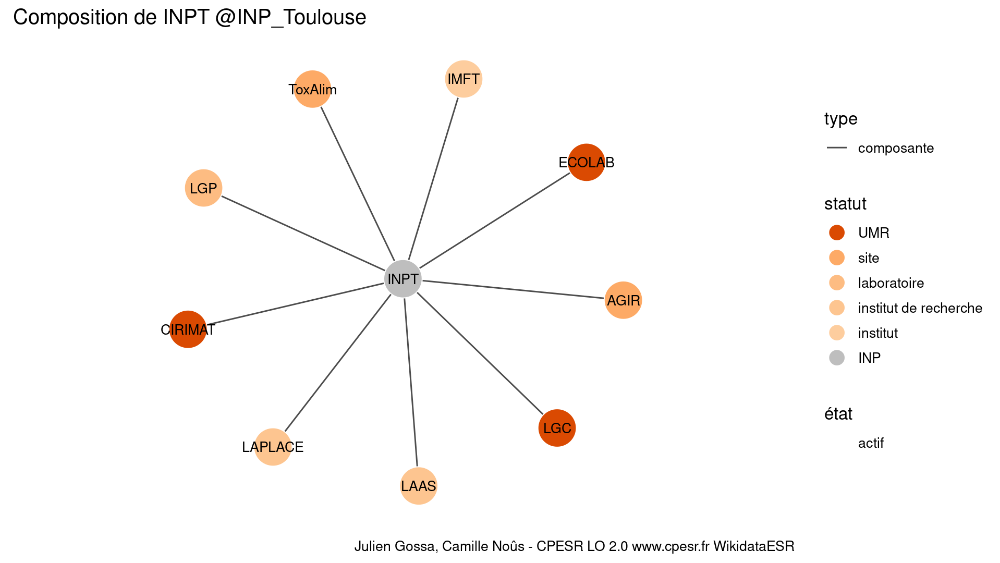

Warnings wikidataESR pour : INPT @INP_Toulouse(10/11/2022
================

- Edition wikidata : [Q3152453](https://www.wikidata.org/wiki/Q3152453)
- Guide d'édition : [wikidataESR](https://github.com/cpesr/wikidataESR/)

- Discussion sur le guide d'édition : [github](https://github.com/cpesr/wikidataESR/issues)


## histoire 

 

 


Erreur : les données sont probablement trop partielles.
```
Error in wdesr_ggplot_graph(df, node_size = node_size, label_sizes = label_sizes, : Empty ESR graph: something went wrong with the graph production parameters

``` 


## composition 

 

Problèmes détectés dans les entités :

|entité                                               |alias   |statut                |message                     |
|:----------------------------------------------------|:-------|:---------------------|:---------------------------|
|[Q30282448](https://www.wikidata.org/wiki/Q30282448) |ToxAlim |site                  |Statut trop imprécis        |
|[Q3152055](https://www.wikidata.org/wiki/Q3152055)   |IMFT    |institut              |Statut trop imprécis        |
|[Q3214408](https://www.wikidata.org/wiki/Q3214408)   |LAAS    |institut de recherche |Statut trop imprécis        |
|[Q6467240](https://www.wikidata.org/wiki/Q6467240)   |LAPLACE |institut de recherche |Statut trop imprécis        |
|[Q30262161](https://www.wikidata.org/wiki/Q30262161) |AGIR    |site                  |Statut trop imprécis        |
|[Q30262161](https://www.wikidata.org/wiki/Q30262161) |AGIR    |site                  |Date de fondation manquante |
|[Q30262355](https://www.wikidata.org/wiki/Q30262355) |LGP     |laboratoire           |Statut trop imprécis        |

 


## associations 

 


Erreur : les données sont probablement trop partielles.
```
Error in query(url, "pcontent", clean_response, query_param = query_param, : The API returned an error: missingtitle - The page you specified doesn't exist.

``` 

