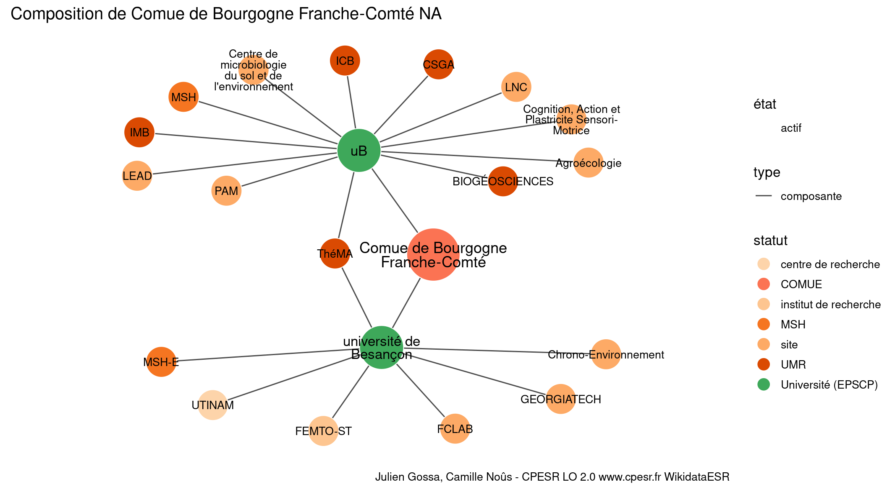

Warnings wikidataESR pour : Comue de Bourgogne Franche-Comté NA(01/10/2023
================

- Edition wikidata : [Q3359833](https://www.wikidata.org/wiki/Q3359833)
- Guide d'édition : [wikidataESR](https://github.com/cpesr/wikidataESR/)

- Discussion sur le guide d'édition : [github](https://github.com/cpesr/wikidataESR/issues)


## histoire 

 

Problèmes détectés dans les entités :

|entité                                             |alias                            |statut |message                |
|:--------------------------------------------------|:--------------------------------|:------|:----------------------|
|[Q3359833](https://www.wikidata.org/wiki/Q3359833) |Comue de Bourgogne Franche-Comté |COMUE  |Alias manquant ou long |

 


Erreur : les données sont probablement trop partielles.
```
Error in wdesr_ggplot_graph(df, node_size = node_size, label_sizes = label_sizes, : Empty ESR graph: something went wrong with the graph production parameters

``` 


## composition 

 

Problèmes détectés dans les entités :

|entité                                               |alias                                                |statut                |message                     |
|:----------------------------------------------------|:----------------------------------------------------|:---------------------|:---------------------------|
|[Q3359833](https://www.wikidata.org/wiki/Q3359833)   |Comue de Bourgogne Franche-Comté                     |COMUE                 |Alias manquant ou long      |
|[Q30261421](https://www.wikidata.org/wiki/Q30261421) |Agroécologie                                         |site                  |Statut trop imprécis        |
|[Q30261493](https://www.wikidata.org/wiki/Q30261493) |Cognition, Action et Plastricite Sensori-Motrice     |site                  |Statut trop imprécis        |
|[Q30261493](https://www.wikidata.org/wiki/Q30261493) |Cognition, Action et Plastricite Sensori-Motrice     |site                  |Alias manquant ou long      |
|[Q30261494](https://www.wikidata.org/wiki/Q30261494) |LNC                                                  |site                  |Statut trop imprécis        |
|[Q30262483](https://www.wikidata.org/wiki/Q30262483) |PAM                                                  |site                  |Statut trop imprécis        |
|[Q30265120](https://www.wikidata.org/wiki/Q30265120) |Centre de microbiologie du sol et de l'environnement |site                  |Statut trop imprécis        |
|[Q30265120](https://www.wikidata.org/wiki/Q30265120) |Centre de microbiologie du sol et de l'environnement |site                  |Alias manquant ou long      |
|[Q30265120](https://www.wikidata.org/wiki/Q30265120) |Centre de microbiologie du sol et de l'environnement |site                  |Date de fondation manquante |
|[Q33121464](https://www.wikidata.org/wiki/Q33121464) |LEAD                                                 |site                  |Statut trop imprécis        |
|[Q829449](https://www.wikidata.org/wiki/Q829449)     |université de Besançon                               |Université (EPSCP)    |Alias manquant ou long      |
|[Q3081158](https://www.wikidata.org/wiki/Q3081158)   |FEMTO-ST                                             |institut de recherche |Statut trop imprécis        |
|[Q30262252](https://www.wikidata.org/wiki/Q30262252) |FCLAB                                                |site                  |Statut trop imprécis        |
|[Q30262481](https://www.wikidata.org/wiki/Q30262481) |GEORGIATECH                                          |site                  |Statut trop imprécis        |
|[Q30262538](https://www.wikidata.org/wiki/Q30262538) |UTINAM                                               |centre de recherche   |Statut trop imprécis        |
|[Q50040734](https://www.wikidata.org/wiki/Q50040734) |Chrono-Environnement                                 |site                  |Statut trop imprécis        |
|[Q50040734](https://www.wikidata.org/wiki/Q50040734) |Chrono-Environnement                                 |site                  |Alias manquant ou long      |

 


## associations 

 

Problèmes détectés dans les entités :

|entité                                             |alias                            |statut |message                |
|:--------------------------------------------------|:--------------------------------|:------|:----------------------|
|[Q3359833](https://www.wikidata.org/wiki/Q3359833) |Comue de Bourgogne Franche-Comté |COMUE  |Alias manquant ou long |

 


Erreur : les données sont probablement trop partielles.
```
Error in wdesr_ggplot_graph(df, node_size = node_size, label_sizes = label_sizes, : Empty ESR graph: something went wrong with the graph production parameters

``` 

