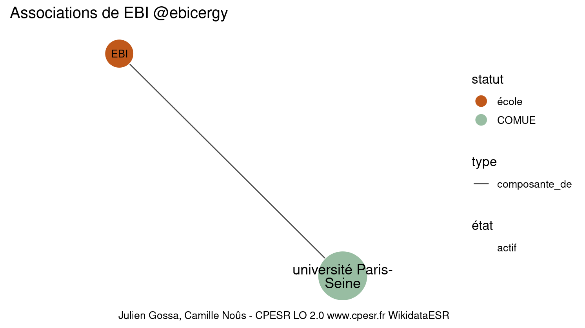

Warnings wikidataESR pour : EBI @ebicergy(01/09/2022
================

- Edition wikidata : [Q3577829](https://www.wikidata.org/wiki/Q3577829)
- Guide d'édition : [wikidataESR](https://github.com/cpesr/wikidataESR/)

- Discussion sur le guide d'édition : [github](https://github.com/cpesr/wikidataESR/issues)


## histoire 

 

Problèmes détectés dans les entités :

|entité                                             |alias |statut |message              |
|:--------------------------------------------------|:-----|:------|:--------------------|
|[Q3577829](https://www.wikidata.org/wiki/Q3577829) |EBI   |école  |Statut trop imprécis |

 


Erreur : les données sont probablement trop partielles.
```
Error in wdesr_ggplot_graph(df, node_size = node_size, label_sizes = label_sizes, : Empty ESR graph: something went wrong with the graph production parameters

``` 


## composition 

 

Problèmes détectés dans les entités :

|entité                                             |alias |statut |message              |
|:--------------------------------------------------|:-----|:------|:--------------------|
|[Q3577829](https://www.wikidata.org/wiki/Q3577829) |EBI   |école  |Statut trop imprécis |

 


Erreur : les données sont probablement trop partielles.
```
Error in wdesr_ggplot_graph(df, node_size = node_size, label_sizes = label_sizes, : Empty ESR graph: something went wrong with the graph production parameters

``` 


## associations 

 

Problèmes détectés dans les entités :

|entité                                             |alias                  |statut |message                |
|:--------------------------------------------------|:----------------------|:------|:----------------------|
|[Q3577829](https://www.wikidata.org/wiki/Q3577829) |EBI                    |école  |Statut trop imprécis   |
|[Q3247880](https://www.wikidata.org/wiki/Q3247880) |université Paris-Seine |COMUE  |Alias manquant ou long |

 

