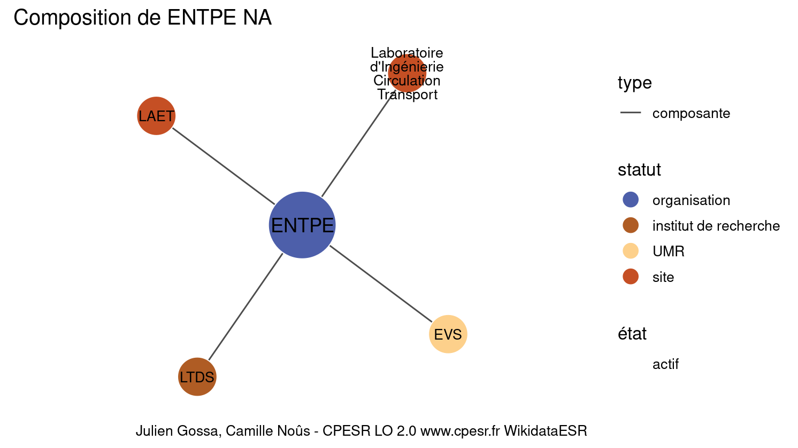
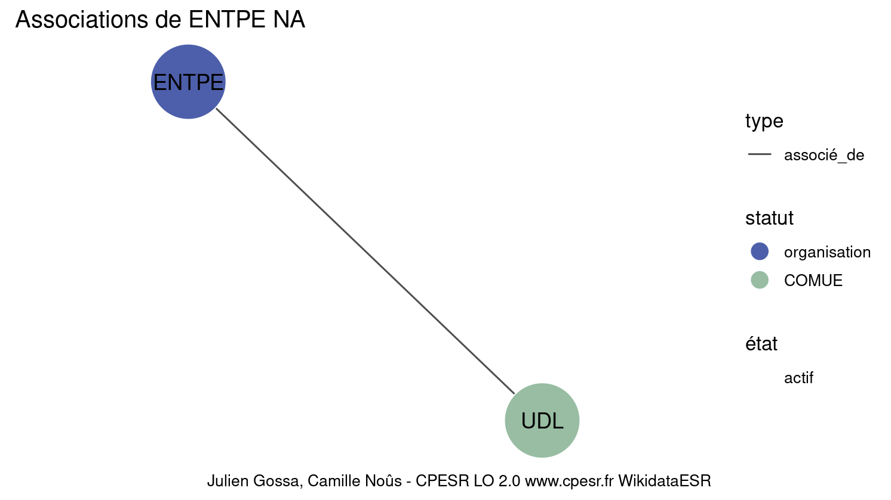

Warnings wikidataESR pour : ENTPE NA(01/09/2022
================

- Edition wikidata : [Q3578157](https://www.wikidata.org/wiki/Q3578157)
- Guide d'édition : [wikidataESR](https://github.com/cpesr/wikidataESR/)

- Discussion sur le guide d'édition : [github](https://github.com/cpesr/wikidataESR/issues)


## histoire 

 

Problèmes détectés dans les entités :

|entité                                             |alias |statut       |message              |
|:--------------------------------------------------|:-----|:------------|:--------------------|
|[Q3578157](https://www.wikidata.org/wiki/Q3578157) |ENTPE |organisation |Statut trop imprécis |

 


Erreur : les données sont probablement trop partielles.
```
Error in wdesr_ggplot_graph(df, node_size = node_size, label_sizes = label_sizes, : Empty ESR graph: something went wrong with the graph production parameters

``` 


## composition 

 

Problèmes détectés dans les entités :

|entité                                               |alias                                          |statut                |message                |
|:----------------------------------------------------|:----------------------------------------------|:---------------------|:----------------------|
|[Q3578157](https://www.wikidata.org/wiki/Q3578157)   |ENTPE                                          |organisation          |Statut trop imprécis   |
|[Q3214487](https://www.wikidata.org/wiki/Q3214487)   |LTDS                                           |institut de recherche |Statut trop imprécis   |
|[Q30262342](https://www.wikidata.org/wiki/Q30262342) |Laboratoire d'Ingénierie Circulation Transport |site                  |Statut trop imprécis   |
|[Q30262342](https://www.wikidata.org/wiki/Q30262342) |Laboratoire d'Ingénierie Circulation Transport |site                  |Alias manquant ou long |
|[Q30274360](https://www.wikidata.org/wiki/Q30274360) |LAET                                           |site                  |Statut trop imprécis   |

 


## associations 

 

Problèmes détectés dans les entités :

|entité                                             |alias |statut       |message              |
|:--------------------------------------------------|:-----|:------------|:--------------------|
|[Q3578157](https://www.wikidata.org/wiki/Q3578157) |ENTPE |organisation |Statut trop imprécis |

Problèmes détectés dans les relations :

|depuis                                             |vers                                           |type       |message              |
|:--------------------------------------------------|:----------------------------------------------|:----------|:--------------------|
|[Q3578157](https://www.wikidata.org/wiki/Q3578157) |[Q10176](https://www.wikidata.org/wiki/Q10176) |associé_de |Date(s) manquante(s) |

NB : les dates manquantes pour les relations de composante ne sont pas remontées. 

