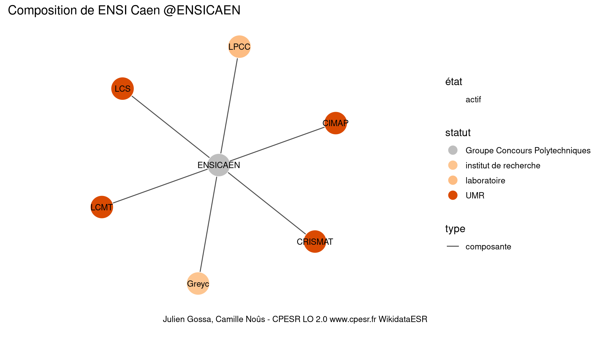
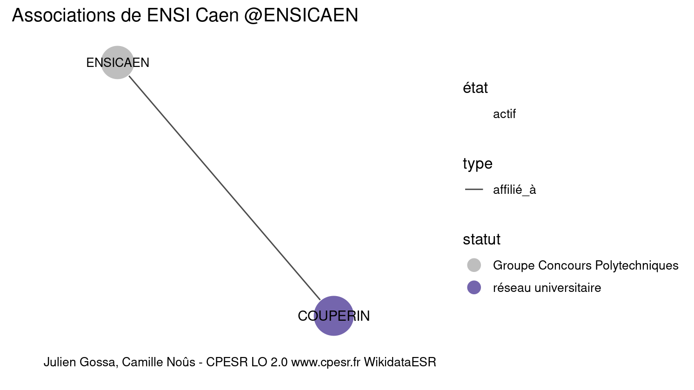

Warnings wikidataESR pour : ENSI Caen @ENSICAEN(01/10/2023
================

- Edition wikidata : [Q3578208](https://www.wikidata.org/wiki/Q3578208)
- Guide d'édition : [wikidataESR](https://github.com/cpesr/wikidataESR/)

- Discussion sur le guide d'édition : [github](https://github.com/cpesr/wikidataESR/issues)


## histoire 

 

 


Erreur : les données sont probablement trop partielles.
```
Error in wdesr_ggplot_graph(df, node_size = node_size, label_sizes = label_sizes, : Empty ESR graph: something went wrong with the graph production parameters

``` 


## composition 

 

Problèmes détectés dans les entités :

|entité                                             |alias |statut                |message              |
|:--------------------------------------------------|:-----|:---------------------|:--------------------|
|[Q3117752](https://www.wikidata.org/wiki/Q3117752) |Greyc |institut de recherche |Statut trop imprécis |
|[Q3214473](https://www.wikidata.org/wiki/Q3214473) |LPCC  |laboratoire           |Statut trop imprécis |

 


## associations 

 

Problèmes détectés dans les relations :

|depuis                                             |vers                                               |type      |message              |
|:--------------------------------------------------|:--------------------------------------------------|:---------|:--------------------|
|[Q3578208](https://www.wikidata.org/wiki/Q3578208) |[Q2994760](https://www.wikidata.org/wiki/Q2994760) |affilié_à |Date(s) manquante(s) |

NB : les dates manquantes pour les relations de composante ne sont pas remontées. 

