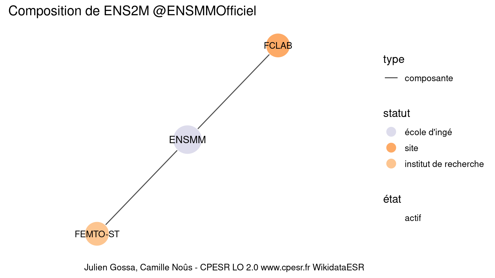

Warnings wikidataESR pour : ENS2M @ENSMMOfficiel(10/11/2022
================

- Edition wikidata : [Q3578235](https://www.wikidata.org/wiki/Q3578235)
- Guide d'édition : [wikidataESR](https://github.com/cpesr/wikidataESR/)

- Discussion sur le guide d'édition : [github](https://github.com/cpesr/wikidataESR/issues)


## histoire 

 

Problèmes détectés dans les entités :

|entité                                             |alias |statut       |message              |
|:--------------------------------------------------|:-----|:------------|:--------------------|
|[Q3578235](https://www.wikidata.org/wiki/Q3578235) |ENSMM |école d'ingé |Statut trop imprécis |

 


Erreur : les données sont probablement trop partielles.
```
Error in wdesr_ggplot_graph(df, node_size = node_size, label_sizes = label_sizes, : Empty ESR graph: something went wrong with the graph production parameters

``` 


## composition 

 

Problèmes détectés dans les entités :

|entité                                               |alias    |statut                |message              |
|:----------------------------------------------------|:--------|:---------------------|:--------------------|
|[Q3578235](https://www.wikidata.org/wiki/Q3578235)   |ENSMM    |école d'ingé          |Statut trop imprécis |
|[Q3081158](https://www.wikidata.org/wiki/Q3081158)   |FEMTO-ST |institut de recherche |Statut trop imprécis |
|[Q30262252](https://www.wikidata.org/wiki/Q30262252) |FCLAB    |site                  |Statut trop imprécis |

 


## associations 

 

Problèmes détectés dans les entités :

|entité                                             |alias |statut       |message              |
|:--------------------------------------------------|:-----|:------------|:--------------------|
|[Q3578235](https://www.wikidata.org/wiki/Q3578235) |ENSMM |école d'ingé |Statut trop imprécis |

 


Erreur : les données sont probablement trop partielles.
```
Error in wdesr_ggplot_graph(df, node_size = node_size, label_sizes = label_sizes, : Empty ESR graph: something went wrong with the graph production parameters

``` 

