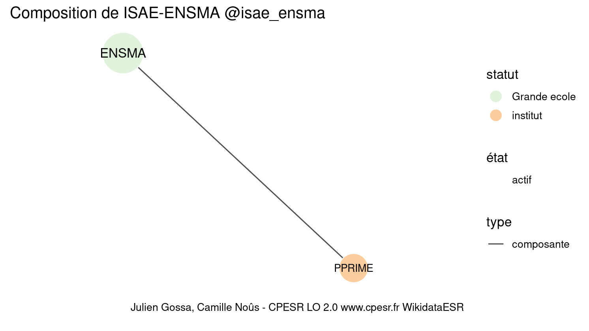
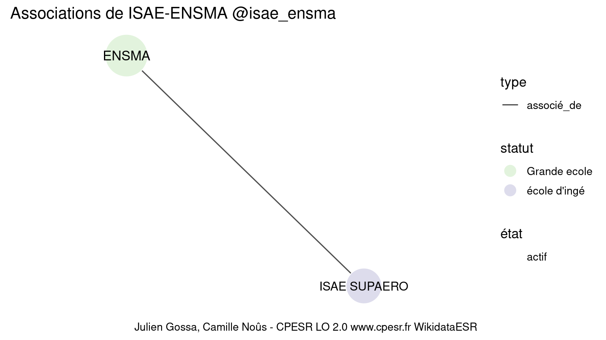

Warnings wikidataESR pour : ISAE-ENSMA @isae_ensma(10/11/2022
================

- Edition wikidata : [Q391044](https://www.wikidata.org/wiki/Q391044)
- Guide d'édition : [wikidataESR](https://github.com/cpesr/wikidataESR/)

- Discussion sur le guide d'édition : [github](https://github.com/cpesr/wikidataESR/issues)


## histoire 

 

Problèmes détectés dans les entités :

|entité                                           |alias |statut       |message                                |
|:------------------------------------------------|:-----|:------------|:--------------------------------------|
|[Q391044](https://www.wikidata.org/wiki/Q391044) |ENSMA |Grande ecole |Réserver aux écoles non contemporaines |

 


Erreur : les données sont probablement trop partielles.
```
Error in wdesr_ggplot_graph(df, node_size = node_size, label_sizes = label_sizes, : Empty ESR graph: something went wrong with the graph production parameters

``` 


## composition 

 

Problèmes détectés dans les entités :

|entité                                             |alias  |statut       |message                                |
|:--------------------------------------------------|:------|:------------|:--------------------------------------|
|[Q391044](https://www.wikidata.org/wiki/Q391044)   |ENSMA  |Grande ecole |Réserver aux écoles non contemporaines |
|[Q3151798](https://www.wikidata.org/wiki/Q3151798) |PPRIME |institut     |Statut trop imprécis                   |

 


## associations 

 

Problèmes détectés dans les entités :

|entité                                           |alias        |statut       |message                                |
|:------------------------------------------------|:------------|:------------|:--------------------------------------|
|[Q391044](https://www.wikidata.org/wiki/Q391044) |ENSMA        |Grande ecole |Réserver aux écoles non contemporaines |
|[Q155446](https://www.wikidata.org/wiki/Q155446) |ISAE SUPAERO |école d'ingé |Statut trop imprécis                   |

Problèmes détectés dans les relations :

|depuis                                           |vers                                             |type       |message              |
|:------------------------------------------------|:------------------------------------------------|:----------|:--------------------|
|[Q391044](https://www.wikidata.org/wiki/Q391044) |[Q155446](https://www.wikidata.org/wiki/Q155446) |associé_de |Date(s) manquante(s) |

NB : les dates manquantes pour les relations de composante ne sont pas remontées. 

