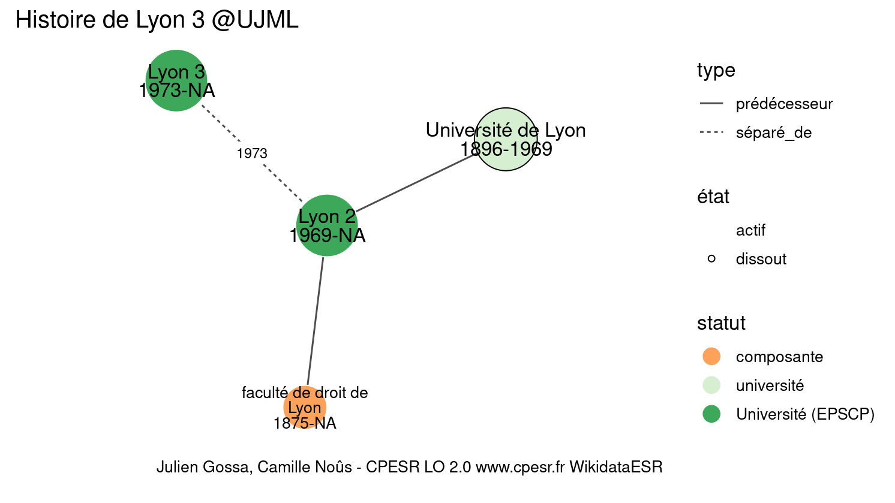

Warnings wikidataESR pour : Lyon 3 @UJML(10/11/2022
================

- Edition wikidata : [Q4027](https://www.wikidata.org/wiki/Q4027)
- Guide d'édition : [wikidataESR](https://github.com/cpesr/wikidataESR/)

- Discussion sur le guide d'édition : [github](https://github.com/cpesr/wikidataESR/issues)

## histoire 

 

Problèmes détectés dans les entités :

|entité                                               |alias                    |statut     |message                |
|:----------------------------------------------------|:------------------------|:----------|:----------------------|
|[Q2383462](https://www.wikidata.org/wiki/Q2383462)   |université de Lyon       |université |Statut trop imprécis   |
|[Q96209609](https://www.wikidata.org/wiki/Q96209609) |faculté de droit de Lyon |composante |Alias manquant ou long |

Problèmes détectés dans les relations :

|depuis                                       |vers                                                 |type         |message              |
|:--------------------------------------------|:----------------------------------------------------|:------------|:--------------------|
|[Q4041](https://www.wikidata.org/wiki/Q4041) |[Q2383462](https://www.wikidata.org/wiki/Q2383462)   |prédécesseur |Date(s) manquante(s) |
|[Q4041](https://www.wikidata.org/wiki/Q4041) |[Q96209609](https://www.wikidata.org/wiki/Q96209609) |prédécesseur |Date(s) manquante(s) |

NB : les dates manquantes pour les relations de composante ne sont pas remontées. 

## composition 

 

Problèmes détectés dans les entités :

|entité                                               |alias                                                                           |statut                |message                |
|:----------------------------------------------------|:-------------------------------------------------------------------------------|:---------------------|:----------------------|
|[Q3137979](https://www.wikidata.org/wiki/Q3137979)   |HiSoMa                                                                          |institut de recherche |Statut trop imprécis   |
|[Q30274351](https://www.wikidata.org/wiki/Q30274351) |Equipe de Recherche de Lyon en Sciences de l'Information et de la Communication |site                  |Statut trop imprécis   |
|[Q30274351](https://www.wikidata.org/wiki/Q30274351) |Equipe de Recherche de Lyon en Sciences de l'Information et de la Communication |site                  |Alias manquant ou long |
|[Q30274356](https://www.wikidata.org/wiki/Q30274356) |ISH                                                                             |site                  |Statut trop imprécis   |
|[Q30274359](https://www.wikidata.org/wiki/Q30274359) |ISERL                                                                           |site                  |Statut trop imprécis   |
|[Q30274366](https://www.wikidata.org/wiki/Q30274366) |MAELYSE                                                                         |site                  |Statut trop imprécis   |
|[Q30274367](https://www.wikidata.org/wiki/Q30274367) |OTHU                                                                            |site                  |Statut trop imprécis   |
|[Q50231792](https://www.wikidata.org/wiki/Q50231792) |2IF                                                                             |institut              |Statut trop imprécis   |
|[Q96026688](https://www.wikidata.org/wiki/Q96026688) |CLESID                                                                          |institut de recherche |Statut trop imprécis   |

 

## associations 

 

 

