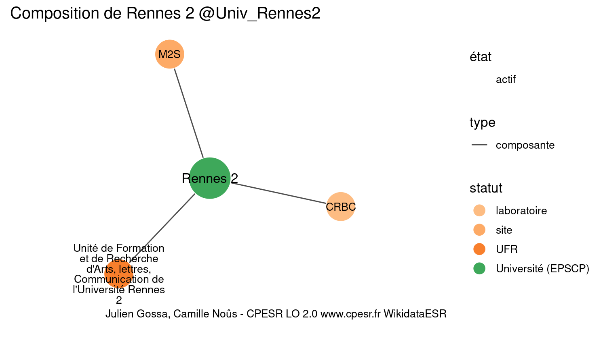

Warnings wikidataESR pour : Université Rennes 2 @Univ_Rennes2(30/12/2021
================

- Edition wikidata : [Q459026](https://www.wikidata.org/wiki/Q459026)
- Guide d'édition : [wikidataESR](https://github.com/cpesr/wikidataESR/)

- Discussion sur le guide d'édition : [github](https://github.com/cpesr/wikidataESR/issues)

## histoire 

 

Problèmes détectés dans les entités :

|entité                                             |alias                |statut     |message                |
|:--------------------------------------------------|:--------------------|:----------|:----------------------|
|[Q1987282](https://www.wikidata.org/wiki/Q1987282) |université de Rennes |université |Statut trop imprécis   |
|[Q1987282](https://www.wikidata.org/wiki/Q1987282) |université de Rennes |université |Alias manquant ou long |

Problèmes détectés dans les relations :

|from                                             |to                                                 |type         |message              |
|:------------------------------------------------|:--------------------------------------------------|:------------|:--------------------|
|[Q459026](https://www.wikidata.org/wiki/Q459026) |[Q1987282](https://www.wikidata.org/wiki/Q1987282) |prédécesseur |Date(s) manquante(s) |

NB : les dates manquantes pour les relations de composante ne sont pas remontées. 

## composition 

 

Problèmes détectés dans les entités :

|entité                                               |alias                                                                                      |statut      |message                |
|:----------------------------------------------------|:------------------------------------------------------------------------------------------|:-----------|:----------------------|
|[Q30262354](https://www.wikidata.org/wiki/Q30262354) |M2S                                                                                        |site        |Statut trop imprécis   |
|[Q3550803](https://www.wikidata.org/wiki/Q3550803)   |Unité de Formation et de Recherche d'Arts, lettres, Communication de l'Université Rennes 2 |UFR         |Alias manquant ou long |
|[Q2945394](https://www.wikidata.org/wiki/Q2945394)   |CRBC                                                                                       |laboratoire |Statut trop imprécis   |

 

## associations 

 

Problèmes détectés dans les entités :

|entité                                             |alias                                                                                             |statut     |message                     |
|:--------------------------------------------------|:-------------------------------------------------------------------------------------------------|:----------|:---------------------------|
|[Q3550803](https://www.wikidata.org/wiki/Q3550803) |Unité de Formation et de Recherche d'Arts, lettres, Communication de l'Université Rennes 2        |UFR        |Alias manquant ou long      |
|[Q3550823](https://www.wikidata.org/wiki/Q3550823) |unité de formation et de recherche de sciences sociales de l'université Rennes 2                  |UFR        |Alias manquant ou long      |
|[Q3550821](https://www.wikidata.org/wiki/Q3550821) |unité de formation et de recherche de sciences humaines de l'université de Rennes 2               |UFR        |Alias manquant ou long      |
|[Q3064270](https://www.wikidata.org/wiki/Q3064270) |Faculté de langues étrangères de Rennes                                                           |composante |Alias manquant ou long      |
|[Q3550802](https://www.wikidata.org/wiki/Q3550802) |Unité de Formation et de Recherche d'Activités Physiques et Sportives de l'Université de Rennes 2 |UFR        |Alias manquant ou long      |
|[Q3550802](https://www.wikidata.org/wiki/Q3550802) |Unité de Formation et de Recherche d'Activités Physiques et Sportives de l'Université de Rennes 2 |UFR        |Date de fondation manquante |

Problèmes détectés dans les relations :

|from                                             |to                                                 |type    |message              |
|:------------------------------------------------|:--------------------------------------------------|:-------|:--------------------|
|[Q459026](https://www.wikidata.org/wiki/Q459026) |[Q3550803](https://www.wikidata.org/wiki/Q3550803) |associé |Date(s) manquante(s) |
|[Q459026](https://www.wikidata.org/wiki/Q459026) |[Q3550823](https://www.wikidata.org/wiki/Q3550823) |associé |Date(s) manquante(s) |
|[Q459026](https://www.wikidata.org/wiki/Q459026) |[Q3550821](https://www.wikidata.org/wiki/Q3550821) |associé |Date(s) manquante(s) |
|[Q459026](https://www.wikidata.org/wiki/Q459026) |[Q3064270](https://www.wikidata.org/wiki/Q3064270) |associé |Date(s) manquante(s) |
|[Q459026](https://www.wikidata.org/wiki/Q459026) |[Q3550802](https://www.wikidata.org/wiki/Q3550802) |associé |Date(s) manquante(s) |

NB : les dates manquantes pour les relations de composante ne sont pas remontées. 

