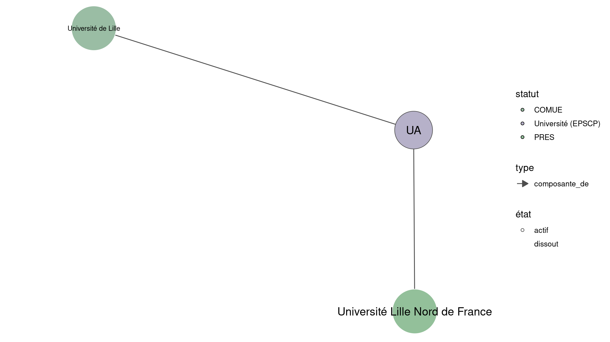

Warnings wikidataESR pour : Université d'Artois @Univ_Artois(13/11/2021
================

- Edition wikidata : [Q475504](https://www.wikidata.org/wiki/Q475504)
- Guide d'édition : [wikidataESR](https://github.com/cpesr/wikidataESR/)

- Discussion sur le guide d'édition : [github](https://github.com/cpesr/wikidataESR/issues)


## histoire 

 

 


Erreur : les données sont probablement trop partielles.
```
Error in wdesr_ggplot_graph(df, node_size = node_size, label_sizes = label_sizes, : Empty ESR graph: something went wrong with the graph production parameters

``` 


## composition 

 

Problèmes détectés dans les entités :

|entité                                               |alias |statut                |message              |
|:----------------------------------------------------|:-----|:---------------------|:--------------------|
|[Q3214445](https://www.wikidata.org/wiki/Q3214445)   |UCCS  |laboratoire           |Statut trop imprécis |
|[Q30262310](https://www.wikidata.org/wiki/Q30262310) |LDAR  |site                  |Statut trop imprécis |
|[Q30262374](https://www.wikidata.org/wiki/Q30262374) |MESHS |site                  |Statut trop imprécis |
|[Q2945409](https://www.wikidata.org/wiki/Q2945409)   |CRIL  |institut de recherche |Statut trop imprécis |

 


## associations 

 

 


Erreur : les données sont probablement trop partielles.
```
Error in wdesr_ggplot_graph(df, node_size = node_size, label_sizes = label_sizes, : Empty ESR graph: something went wrong with the graph production parameters

``` 

