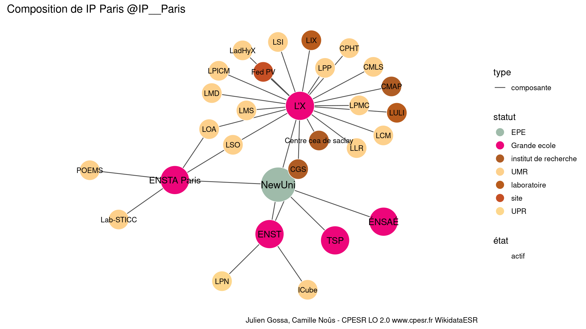

Warnings wikidataESR pour : IP Paris @IP__Paris(01/09/2022
================

- Edition wikidata : [Q48759778](https://www.wikidata.org/wiki/Q48759778)
- Guide d'édition : [wikidataESR](https://github.com/cpesr/wikidataESR/)

- Discussion sur le guide d'édition : [github](https://github.com/cpesr/wikidataESR/issues)


## histoire 

 

Problèmes détectés dans les entités :

|entité                                               |alias  |statut |message            |
|:----------------------------------------------------|:------|:------|:------------------|
|[Q48759778](https://www.wikidata.org/wiki/Q48759778) |NewUni |EPE    |Préférer Q77979904 |

 


Erreur : les données sont probablement trop partielles.
```
Error in wdesr_ggplot_graph(df, node_size = node_size, label_sizes = label_sizes, : Empty ESR graph: something went wrong with the graph production parameters

``` 


## composition 

 

Problèmes détectés dans les entités :

|entité                                               |alias                |statut                |message                                |
|:----------------------------------------------------|:--------------------|:---------------------|:--------------------------------------|
|[Q48759778](https://www.wikidata.org/wiki/Q48759778) |NewUni               |EPE                   |Préférer Q77979904                     |
|[Q273626](https://www.wikidata.org/wiki/Q273626)     |L'X                  |Grande ecole          |Réserver aux écoles non contemporaines |
|[Q16008922](https://www.wikidata.org/wiki/Q16008922) |CMAP                 |institut de recherche |Statut trop imprécis                   |
|[Q4393524](https://www.wikidata.org/wiki/Q4393524)   |Centre cea de saclay |institut de recherche |Statut trop imprécis                   |
|[Q4393524](https://www.wikidata.org/wiki/Q4393524)   |Centre cea de saclay |institut de recherche |Alias manquant ou long                 |
|[Q4393524](https://www.wikidata.org/wiki/Q4393524)   |Centre cea de saclay |institut de recherche |Date de fondation manquante            |
|[Q3214506](https://www.wikidata.org/wiki/Q3214506)   |LULI                 |laboratoire           |Statut trop imprécis                   |
|[Q30262191](https://www.wikidata.org/wiki/Q30262191) |CGS                  |institut de recherche |Statut trop imprécis                   |
|[Q30262256](https://www.wikidata.org/wiki/Q30262256) |Fed PV               |site                  |Statut trop imprécis                   |
|[Q16009025](https://www.wikidata.org/wiki/Q16009025) |LIX                  |laboratoire           |Statut trop imprécis                   |
|[Q2311820](https://www.wikidata.org/wiki/Q2311820)   |ENST                 |Grande ecole          |Réserver aux écoles non contemporaines |
|[Q43305](https://www.wikidata.org/wiki/Q43305)       |TSP                  |Grande ecole          |Réserver aux écoles non contemporaines |
|[Q838454](https://www.wikidata.org/wiki/Q838454)     |ENSTA Paris          |Grande ecole          |Réserver aux écoles non contemporaines |
|[Q1275372](https://www.wikidata.org/wiki/Q1275372)   |ÉNSAÉ                |Grande ecole          |Réserver aux écoles non contemporaines |

 


## associations 

 

Problèmes détectés dans les entités :

|entité                                               |alias  |statut |message            |
|:----------------------------------------------------|:------|:------|:------------------|
|[Q48759778](https://www.wikidata.org/wiki/Q48759778) |NewUni |EPE    |Préférer Q77979904 |

 


Erreur : les données sont probablement trop partielles.
```
Error in wdesr_ggplot_graph(df, node_size = node_size, label_sizes = label_sizes, : Empty ESR graph: something went wrong with the graph production parameters

``` 

