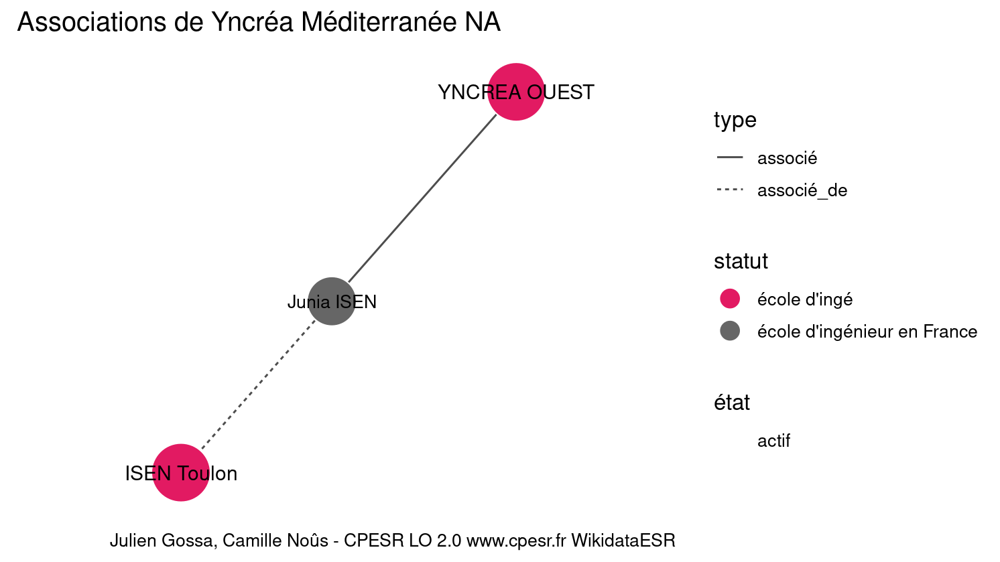

Warnings wikidataESR pour : Yncréa Méditerranée NA(01/09/2022
================

- Edition wikidata : [Q51652036](https://www.wikidata.org/wiki/Q51652036)
- Guide d'édition : [wikidataESR](https://github.com/cpesr/wikidataESR/)

- Discussion sur le guide d'édition : [github](https://github.com/cpesr/wikidataESR/issues)


## histoire 

 

Problèmes détectés dans les entités :

|entité                                               |alias       |statut       |message                     |
|:----------------------------------------------------|:-----------|:------------|:---------------------------|
|[Q51652036](https://www.wikidata.org/wiki/Q51652036) |ISEN Toulon |école d'ingé |Statut trop imprécis        |
|[Q51652036](https://www.wikidata.org/wiki/Q51652036) |ISEN Toulon |école d'ingé |Date de fondation manquante |

 


Erreur : les données sont probablement trop partielles.
```
Error in wdesr_ggplot_graph(df, node_size = node_size, label_sizes = label_sizes, : Empty ESR graph: something went wrong with the graph production parameters

``` 


## composition 

 

Problèmes détectés dans les entités :

|entité                                               |alias       |statut       |message                     |
|:----------------------------------------------------|:-----------|:------------|:---------------------------|
|[Q51652036](https://www.wikidata.org/wiki/Q51652036) |ISEN Toulon |école d'ingé |Statut trop imprécis        |
|[Q51652036](https://www.wikidata.org/wiki/Q51652036) |ISEN Toulon |école d'ingé |Date de fondation manquante |

 


Erreur : les données sont probablement trop partielles.
```
Error in wdesr_ggplot_graph(df, node_size = node_size, label_sizes = label_sizes, : Empty ESR graph: something went wrong with the graph production parameters

``` 


## associations 

 

Problèmes détectés dans les entités :

|entité                                               |alias        |statut       |message                     |
|:----------------------------------------------------|:------------|:------------|:---------------------------|
|[Q51652036](https://www.wikidata.org/wiki/Q51652036) |ISEN Toulon  |école d'ingé |Statut trop imprécis        |
|[Q51652036](https://www.wikidata.org/wiki/Q51652036) |ISEN Toulon  |école d'ingé |Date de fondation manquante |
|[Q51648617](https://www.wikidata.org/wiki/Q51648617) |YNCREA OUEST |école d'ingé |Statut trop imprécis        |
|[Q51648617](https://www.wikidata.org/wiki/Q51648617) |YNCREA OUEST |école d'ingé |Date de fondation manquante |

Problèmes détectés dans les relations :

|depuis                                               |vers                                                 |type       |message              |
|:----------------------------------------------------|:----------------------------------------------------|:----------|:--------------------|
|[Q51652036](https://www.wikidata.org/wiki/Q51652036) |[Q3152574](https://www.wikidata.org/wiki/Q3152574)   |associé_de |Date(s) manquante(s) |
|[Q3152574](https://www.wikidata.org/wiki/Q3152574)   |[Q51648617](https://www.wikidata.org/wiki/Q51648617) |associé    |Date(s) manquante(s) |

NB : les dates manquantes pour les relations de composante ne sont pas remontées. 

