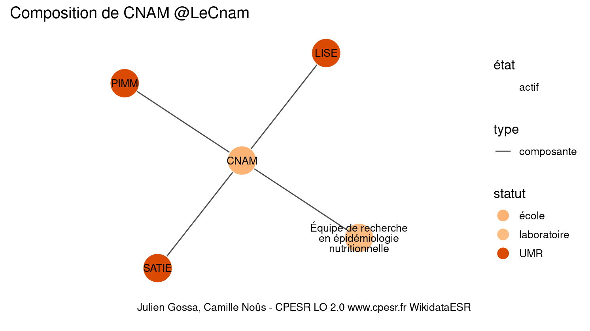

Warnings wikidataESR pour : CNAM @LeCnam(14/11/2021
================

- Edition wikidata : [Q524289](https://www.wikidata.org/wiki/Q524289)
- Guide d'édition : [wikidataESR](https://github.com/cpesr/wikidataESR/)

- Discussion sur le guide d'édition : [github](https://github.com/cpesr/wikidataESR/issues)


## histoire 

 

Problèmes détectés dans les entités :

|entité                                           |alias |statut |message              |
|:------------------------------------------------|:-----|:------|:--------------------|
|[Q524289](https://www.wikidata.org/wiki/Q524289) |CNAM  |école  |Statut trop imprécis |

 


Erreur : les données sont probablement trop partielles.
```
Error in wdesr_ggplot_graph(df, node_size = node_size, label_sizes = label_sizes, : Empty ESR graph: something went wrong with the graph production parameters

``` 


## composition 

 

Problèmes détectés dans les entités :

|entité                                               |alias                        |statut      |message                |
|:----------------------------------------------------|:----------------------------|:-----------|:----------------------|
|[Q524289](https://www.wikidata.org/wiki/Q524289)     |CNAM                         |école       |Statut trop imprécis   |
|[Q28530728](https://www.wikidata.org/wiki/Q28530728) |Épidémiologie Nutritionnelle |laboratoire |Statut trop imprécis   |
|[Q28530728](https://www.wikidata.org/wiki/Q28530728) |Épidémiologie Nutritionnelle |laboratoire |Alias manquant ou long |

 


## associations 

 

Problèmes détectés dans les entités :

|entité                                           |alias |statut |message              |
|:------------------------------------------------|:-----|:------|:--------------------|
|[Q524289](https://www.wikidata.org/wiki/Q524289) |CNAM  |école  |Statut trop imprécis |

 

