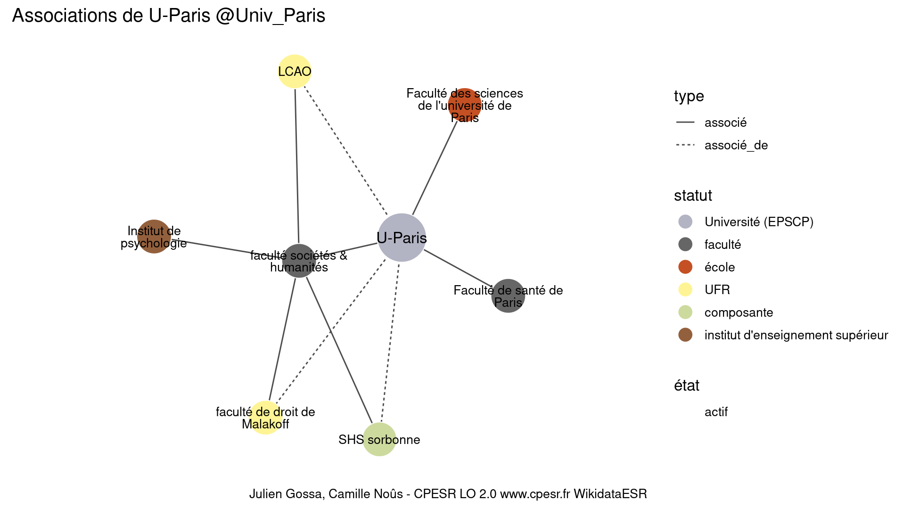

Warnings wikidataESR pour : UPC @Univ_Paris(10/11/2022
================

- Edition wikidata : [Q55849612](https://www.wikidata.org/wiki/Q55849612)
- Guide d'édition : [wikidataESR](https://github.com/cpesr/wikidataESR/)

- Discussion sur le guide d'édition : [github](https://github.com/cpesr/wikidataESR/issues)


## histoire 

 

Problèmes détectés dans les entités :

|entité                                                 |alias                        |statut                |message                                                    |
|:------------------------------------------------------|:----------------------------|:---------------------|:----------------------------------------------------------|
|[Q3064325](https://www.wikidata.org/wiki/Q3064325)     |faculté des lettres de Paris |composante            |Alias manquant ou long                                     |
|[Q3064321](https://www.wikidata.org/wiki/Q3064321)     |Faculté des arts de Paris    |composante            |Alias manquant ou long                                     |
|[Q3064332](https://www.wikidata.org/wiki/Q3064332)     |Faculté de Science de Paris  |composante            |Alias manquant ou long                                     |
|[Q104777601](https://www.wikidata.org/wiki/Q104777601) |École de médecine de Paris   |statut manquant       |Absence de propriété P31 (instance_of/nature de l'élément) |
|[Q104777601](https://www.wikidata.org/wiki/Q104777601) |École de médecine de Paris   |statut manquant       |Alias manquant ou long                                     |
|[Q104777601](https://www.wikidata.org/wiki/Q104777601) |École de médecine de Paris   |statut manquant       |Date de fondation manquante                                |
|[Q104777594](https://www.wikidata.org/wiki/Q104777594) |école de médecine de Paris   |système universitaire |Alias manquant ou long                                     |
|[Q104777594](https://www.wikidata.org/wiki/Q104777594) |école de médecine de Paris   |système universitaire |Date de fondation manquante                                |

Problèmes détectés dans les relations :

|depuis                                                 |vers                                                   |type         |message              |
|:------------------------------------------------------|:------------------------------------------------------|:------------|:--------------------|
|[Q55849612](https://www.wikidata.org/wiki/Q55849612)   |[Q1235608](https://www.wikidata.org/wiki/Q1235608)     |prédécesseur |Date(s) manquante(s) |
|[Q55849612](https://www.wikidata.org/wiki/Q55849612)   |[Q1155944](https://www.wikidata.org/wiki/Q1155944)     |prédécesseur |Date(s) manquante(s) |
|[Q3064325](https://www.wikidata.org/wiki/Q3064325)     |[Q3064321](https://www.wikidata.org/wiki/Q3064321)     |prédécesseur |Date(s) manquante(s) |
|[Q3064277](https://www.wikidata.org/wiki/Q3064277)     |[Q104777601](https://www.wikidata.org/wiki/Q104777601) |prédécesseur |Date(s) manquante(s) |
|[Q104777601](https://www.wikidata.org/wiki/Q104777601) |[Q104777594](https://www.wikidata.org/wiki/Q104777594) |prédécesseur |Date(s) manquante(s) |

NB : les dates manquantes pour les relations de composante ne sont pas remontées. 


## composition 

 

Problèmes détectés dans les entités :

|entité                                                 |alias |statut |message                     |
|:------------------------------------------------------|:-----|:------|:---------------------------|
|[Q109583955](https://www.wikidata.org/wiki/Q109583955) |CB    |UMR    |Date de fondation manquante |

 


## associations 

 


Erreur : les données sont probablement trop partielles.
```
Error in ans[npos] <- rep(no, length.out = len)[npos]: l'argument de remplacement est de longueur nulle

``` 

