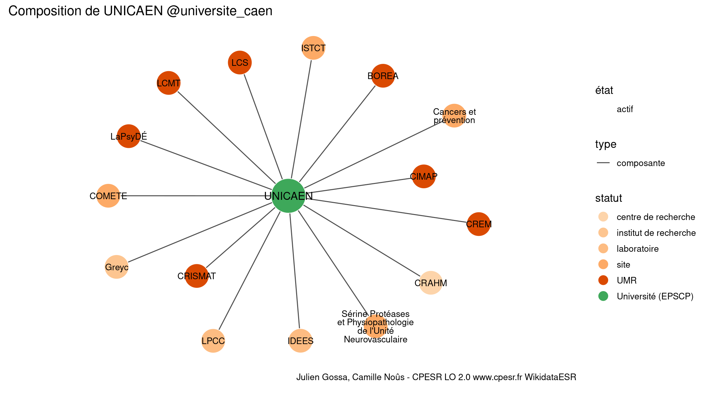

Warnings wikidataESR pour : UNICAEN @universite_caen(14/11/2021
================

- Edition wikidata : [Q568554](https://www.wikidata.org/wiki/Q568554)
- Guide d'édition : [wikidataESR](https://github.com/cpesr/wikidataESR/)

- Discussion sur le guide d'édition : [github](https://github.com/cpesr/wikidataESR/issues)


## histoire 

 

 


Erreur : les données sont probablement trop partielles.
```
Error in wdesr_ggplot_graph(df, node_size = node_size, label_sizes = label_sizes, : Empty ESR graph: something went wrong with the graph production parameters

``` 


## composition 

 

Problèmes détectés dans les entités :

|entité                                               |alias                                                           |statut                |message                |
|:----------------------------------------------------|:---------------------------------------------------------------|:---------------------|:----------------------|
|[Q23001757](https://www.wikidata.org/wiki/Q23001757) |IDEES                                                           |laboratoire           |Statut trop imprécis   |
|[Q3117752](https://www.wikidata.org/wiki/Q3117752)   |Greyc                                                           |institut de recherche |Statut trop imprécis   |
|[Q3214473](https://www.wikidata.org/wiki/Q3214473)   |LPCC                                                            |laboratoire           |Statut trop imprécis   |
|[Q30262446](https://www.wikidata.org/wiki/Q30262446) |Sérine Protéases et Physiopathologie de l'Unité Neurovasculaire |site                  |Statut trop imprécis   |
|[Q30262446](https://www.wikidata.org/wiki/Q30262446) |Sérine Protéases et Physiopathologie de l'Unité Neurovasculaire |site                  |Alias manquant ou long |
|[Q43896457](https://www.wikidata.org/wiki/Q43896457) |COMETE                                                          |site                  |Statut trop imprécis   |
|[Q50035313](https://www.wikidata.org/wiki/Q50035313) |Cancers et prévention                                           |site                  |Statut trop imprécis   |
|[Q50035313](https://www.wikidata.org/wiki/Q50035313) |Cancers et prévention                                           |site                  |Alias manquant ou long |
|[Q50040735](https://www.wikidata.org/wiki/Q50040735) |ISTCT                                                           |site                  |Statut trop imprécis   |

 


## associations 

 

Problèmes détectés dans les entités :

|entité                                             |alias                |statut |message                |
|:--------------------------------------------------|:--------------------|:------|:----------------------|
|[Q3343880](https://www.wikidata.org/wiki/Q3343880) |Normandie Université |COMUE  |Alias manquant ou long |

 

